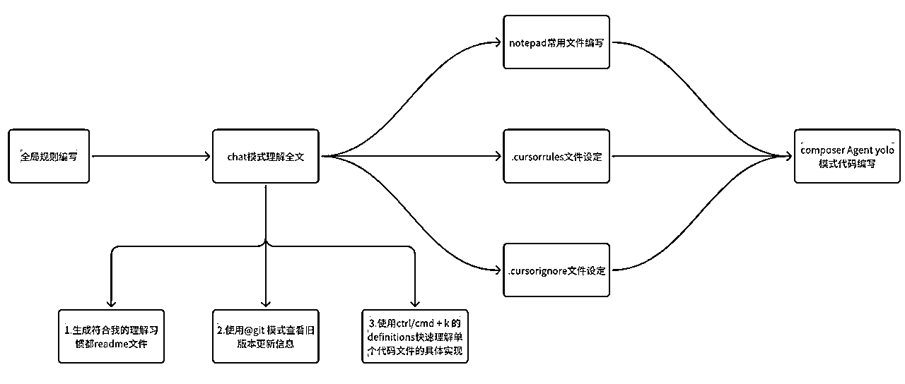
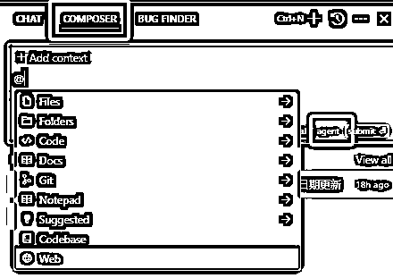
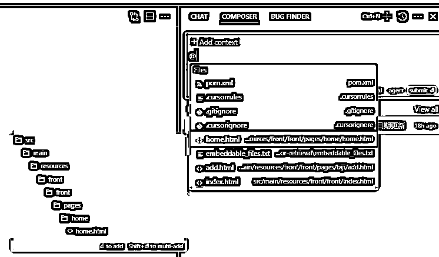
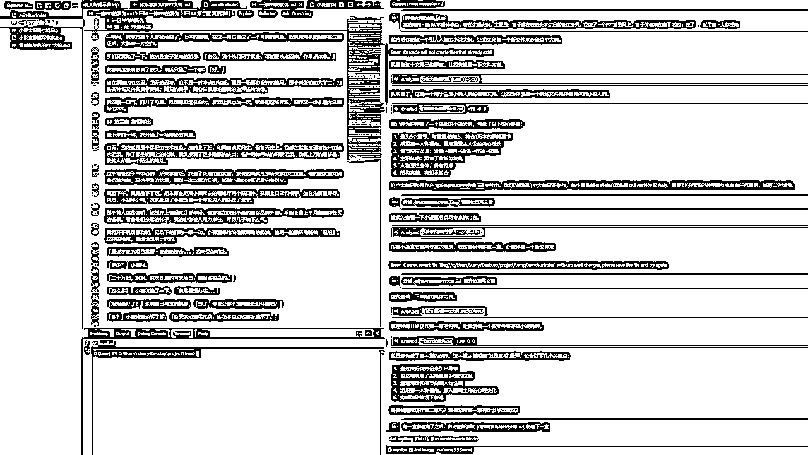
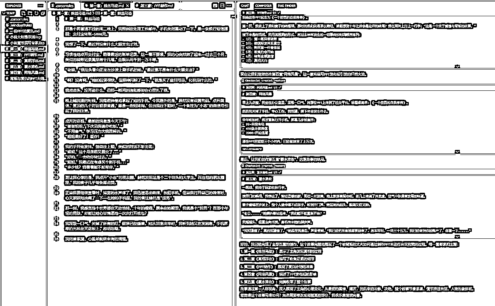

# 以小说 AI 工作流为例， Cursor和Windsurf ，我为什么选择Cursor（万字长文）

> 来源：[https://aiawaken.feishu.cn/docx/ZmGXd6FzHoTXFrxAOldcvqXFnig](https://aiawaken.feishu.cn/docx/ZmGXd6FzHoTXFrxAOldcvqXFnig)

深入使用 Cursor 后，

它又一次加速了我的工作流，

不得不说：Cursor 这波更新实在太强了，

直接在多个核心功能上完成了对 Windsurf 的超越，

来看看具体的重大改进。


本文分享路线：

cursor 新功能 ==> cursor 工作流分享 ==> 和 windsurf 功能点对比

单个功能的讲解在没有基础的理解上，是晦涩的。

我倾向于直接向你展现效果。

知道自己需要的部分是什么，再详细了解细节。

Cursor 工作流涉及两部分：编程 和 写作

建议：

有编程基础关注————我的 Cursor 工作流：编程

无编程基础关注————我的 Cursor 工作流：写作

建议收藏，慢慢吸收。

* * *

# Cursor 新功能速览：

具有功能点：

1.  Yolo模式：即可以自动运行终端命令，不用每一步都确认，赋予 AI 更大的权限 （windsurf 目前需要注意确认命令）

1.  @docs、@git、@web 和 @folder能在 Agent 下使用了

也就是@docs可以引用远程仓库，@git可以分析分支代码，自动 commit&push

@web可以联网搜索内容，@folder可以直接引用整个文件夹内容

Agent 可以并发式的修改多个文件内容（windsurf 目前只能同时修改单个文件）

Composer 的更改有 checkpoints了，也就是一个时间切片，不想要修改的部分，可以直接回退版本了。

Agent 的修改可以自动保存到磁盘，不用担心数据丢失了。

* * *

# 我的 Cursor 工作流：编程



### 给 AI 设定规则

最常用四个工具：

全局规则 + 项目规则（.cursorrules）+ .gitignore补充（.cursorignore）+ notepad

讲人话·：

使用全局规则回复为中文，我不用担心看不懂英文

使用.cursorrules能让 AI 深入理解我们项目的选型（一定程度上弥补了全文记忆的缺陷）

使用.cursorignore能自定义 Ai 不能访问的代码库

使用notepad随意引用切换提示词编写

四个配合是为了 使用 composer Agent yolo模式下的 AI 自动编码更精准

而 windsurf 则缺少了最后两个功能，

而notepad虽然可以使用普通文件引用的方式，但是更方便。

#### 全局规则

其实就是我们在编写代码的时候，最通用的一些规则，

比如 AI 和我们对话用中文，就可以在这里设置

在单个文件里使用 ctrl/cmd + k 的时候也会使用该提示词


#### 项目规则（.cursorrules）

针对整个项目的技术栈的设定，更方便 AI 理解我们的项目

主要是对当前项目的各个角度的描述（比如，项目结构，前后端交互逻辑，函数命名规则等等）

#### .gitignore补充（.cursorignore）

AI 默认是可以索引我们当前打开项目的所有文件的，

.gitignore 文件里是不会索引的，

而.cursorignore就是对它的补充，

可以自定义禁止 cursor 访问哪些文件，

这时候 cursor 就不会自动索引到这些文件


#### notepad

这样理解：这也是一个存放提示词的地方，

方便引入提示词的地方

也就是针对于重复使用的提示词可以放在这，

方便引用


### 三种模式切换

三种模式：

ctrl/cmd + k + chat + composer Agent Yolo（下面有详细解释）

PS：这里只展开对于最常用功能的分析，详细的功能介绍在后面

#### Yolo模式


我在使用 windsurf 的时候，

一个很明显钝感是：

为什么Write模式不能一次性帮我执行完所有的命令？

而 cursor 的Yolo模式就可以自动的执行一连串的命令，

举个例子：

我需要让 claude 自动帮我在终端运行命令，

并且运行完成之后还有其他的命令接着运行，

这时候，它就能自动等待我的终端命令执行完之后再继续执行，

这一点特别针对于终端命令运行报错之后，它自动修改重新运行特别有用。

这里也可以设定 Prompt ，

允许执行的命令，

不允许执行的命令，

甚至直接禁止删除文件

是的，我给它很多权限的同时，

你必须得有所约束，要按照我的想法来，

因为目前 AI 不能替代的就是我们的思维。

有了Yolo模式做铺垫，那么就很好解释这三种模式的联动了：

#### 针对于单个代码文件的编写：

ctrl/cmd + k我们可以直接原子化操作，

也就是编写一个函数，或者一个类，

可以直针对于一个代码文件操作


ctrl/cmd + k按下之后会出现：

5 个选项（如下图） 先着重分析最后两个功能：Definitions Web


我常使用Definitions功能先帮我熟悉这个函数或者类的功能，

然后针对于这个点，做修改；然后Web其实就是提供的一个联网搜索的入口，

又提供了很多思路。


#### 针对于整个项目或者局部文件的理解：

使用Chat模式配合上述的各种规则去快速理解项目，或者分析 bug


反过来思考，我们的各种规则文件也可以通过这种方式快速生成

使用@ 会有很多的功能出现，这里常使用 git，

我们可以直接通过这个功能去理解某个版本的改动是什么，

这一点对于团队协作十分有帮助

当然这里也可以配合 notepad 直接帮我们提交一个 commit 和 push，

这就是和Yolo模式配合起来使用的效果

总之，思路要打开，想象力越丰富越能使用 AI 提效


#### 开始快速编码

使用composer Agent Yolo，拆开来：其实是composer功能下，使用agent功能，并且开启Yolo模式的组合结果，我愿意给 AI 更多的权限去编码，去试探它的边界，这里大家也可以关闭Yolo模式



这里也同样可以使用很多功能（相比 windsurf 那匮乏的聊天框，希望它赶紧更新吧！）着重分享@Files的功能：侧边和待选项都可以展示你当前想要引用的代码文件是在哪个路径下的



感受：

AI 时代的编程，其实单从应用上面来分析，

采用规范的规则，能让 AI 编写一些中等及以下的任务了

也就是纯使用prompt编程的时代来了

任何新事物的出现都有其两面性，

我属于激进派，我愿意去尝试 AI，

去探索 AI 编码的边界

换个角度思考，

编码也是重复性的工作，

大家经常也调侃造轮子这个事

重复性的劳动会被效率性的工作替代（大部分）

包括面向google编程为什么不能面向 AI 编程呢？

编码的本质：通过代码去实现思维逻辑，

那借助 AI 就能快速去验证这个逻辑，

融，百家之长，补己之短

cursor 本质上也只是个工具，

就像 IDE 没有出来前大家传统编码一样的

会用工具+用好工具=>解放重复性劳动

* * *

# 我的 Cursor 工作流：写作

## 误区：AI 编程只有程序员才能用！

AI时代之前，这些 IDE（也就是各种编程工具）确实只有程序员使用更好。

但在AI时代，所有技术都是应该有普世性。

我要重新定义 cursor ：

它本质上就是个

记事本，

一个备忘录，

一个草稿本；也就是一个用来记录的东西

同时也想和你分享一个观点：

从不同角度去看待事物，会有不同的意外收获

我这类普通人也能把它当做魔法。

### 中篇文章撰写

是的，也可以撰写文章，而且是claude-3-5-sonnet-20241022加持下的，没有 AI 味的文章

#### 中篇文章：

1.  不限于公众号文章，知乎回帖，技术分析， 番茄小说，年度报告；甚至是个人建立润色等等内容

1.  中篇：受限于 claude 一次输出的 token 上限，所以一次性生成类似 20 万字的中长篇小说还是比较困难的

总结：一切使用文字创作的部分都可以通过它写

#### 本质：

其实是使用了 claude 的文字能力

在这一点上，使用 cursor 或者 windsurf 其实都是可以的，

因为两者都有 Agent 模式（这个功能用于连续的生成文章），

都能自动创建文件（这个用于自动创建大纲等）

#### 怎么写？

cursor/windsurf 都能引用文件，

或者引用文件夹，有思路了吗？

再思考一下，你平常写文章的思路是什么？

进一步思考，写文章没有灵感怎么把？

终极问题，我写的文章字数不够，

难以达到我的目标字数

## 举例：

### 先思后想：

1.  写作没有思路，但是我有相关材料，想基于这部分展开

1.  我想一键生成 4000 字文章

1.  文章写好后，我整个都不满意

1.  我只想修改文章的局部内容

1.  我想发表到某平台（类似公众号）我想美化排版

1.  一切你对文字生成，改动的需求

### 分步解析：

#### 文章灵感

写作的基础材料总有吧，放在同一个文件夹里，引用他们（最好是。txt 或者。md 格式，其他格式可以自行转换）然后告诉 claude，你要干什么，甚至只要你正确的和 claude 对话了，它也能找到文件并阅读，但是最好是引用，这样更精准；通过这种方式就可以得到写作灵感了


#### 主体创作：

有了灵感（或者大纲）就可以进一步引用这些创造好的文件，

作为 claude 的上下文，就可以根据你的需求开始写文章了！！！

#### 润色：

局部润色：

直接引用某一部分的内容，选中之后，

直接选中之后，ctrl/cmd + k或者ctrl/cmd + L润色局部即可


全局润色：直接引用整个文件，然后输入你的想法，让它帮你修改文章即可！！

总体回顾：

想 + 要 = 想要 =>成品

不要限制了自己的想象力，

溯源 AI 的本质能力，

最强的是文字功底

所有通过文字作为底层核心构建的事物，

都可以通过 AI 提效，而我们只要有想法

就大胆和 AI 沟通，一步步实现自己的需求即可

分享的只是思路

文字作为地基，成品有很多类：公众号文章，知乎回帖，技术分析， 番茄小说，年度报告等

不同类型的文字作品有不同的写法，

但是通用的思路是，

我有一堆材料，我不想读，就可以通过文件引用的方式交给 cursor，

让它替代我们阅读，我们只需要限定它的写作手法，

行文思路，文章架构，成品微调，就能实现想要的效果

cursor 作为你的提示词库是不是很香？

* * *

## 禁止 cursor 保存代码

对于实际的开发中，项目的代码是保密的，

因此使用 cursor 开发时，难免会担心代码泄露的问题

但是 cursor 官方至少提供了一个选项：

我们可以开启这个选项，避免代码的泄露（虽然这里有选择，但是核心的业务代码最好还是不用第三方 AI）

这一点目前没有在 windsurf 里找到


## 新版 Cursor 工作流 本质：

配置。cursorrules，notepads， 以及 Agent 模式的本质上是给 AI 限定范围，

也就是在某个领域的具体场景下，

AI 应该如何和我协作

但，编程本质上就是对于某些功能的思维显现。

我觉得，

人写或者 AI 写代码，没有实质上的差别，

实质上人写代码，

就是一个重复性的工作，

是可以被替代的

而不能替代的，

是人的思想，是运用在编程上的思想

同一个功能的实现，有很多种解法，

但符合业务场景的，可能是少数

因此，只要告诉 AI 在某个环节应该怎样做，

它将给你最佳解决方案，而我们需要做的，就是筛选逻辑

这一点，是我更推荐 Cursor 理由。

* * *

# 小说工作流cursor 和 windsurf 对比

用cursor 和 windsurf 写小说的话，都能实现万字小说一键成文的效果

## 小说创作流程：

#### 生成一万字左右小说，

可以只需要一个大纲提示词，分至少 5 次输出，就可以完成

#### 10 万字小说流程：

## windsurf 万字小说一键成文效果：



## Cursor 万字小说一键成文效果：



如果想要一键生成 10w 字中篇小说，

也可以用同样的方式

先让它生成大纲，再根据大纲写每一章节

一直循环，就能实现一键生成 10w 字中篇小说

* * *

# Cursor 对比 Windsurf 核心优势

## 命令行操作的多样性

```
实现了稳定的命令行操作
实测整体的响应速度要快于 windsurf
cursor支持多文件并发修改
cursor的Yolo模式可以不用确认，自动执行命令
支持 pop out terminal，也就是在命令行窗口预览
```

## git 索引


```
cursor可以自动commit / push代码
@Git 允许 Cursor 的扫描差异并查找可能由差异引起的错误或问题
@工作状态差异@Diff of Working State 从你当前的差异中生成提交消息
windsurf暂不支持以上的git操作
```

在 AI 与系统深度集成这条路上，

命令行操作的稳定性就像是一把通向未来的钥匙

看着 Cursor 在这个领域的突破

我越发确信：AI 不仅要懂代码

更要理解开发者的工作流

当它能稳定地执行命令行操作时

我们就离真正的 AI 辅助编程更近了一步

在辅助编程上，

AI 应该对业务的逻辑有深度理解，

能读懂我们真正想要什么

节省新人上手项目的时间，

节省代码改动的 debug 时间等等

能自动帮我们去修改一些重复性引用的地方，

特别是跨文件的函数调用，业务逻辑的理解

## 上下文智能检索能力

还记得早期版本的 cursor 支持上下文 200k 的 claude3.5-sonnet 长文本阅读，

在那时，我就曾让它去阅读几万行被混淆之后的代码（也就是很不容易阅读的代码）

它很快的帮助我找出了我想要修改的地方，

并且基于对上下文的理解，直接帮我生成了想要实现的功能。

但是由于超出了 10000 tokens 的限制，

并不能直接 apply，但是也很强了，

现在的 cursor，在 Agent 模式的加持下，

能分析代码更全面，能更快速地索引到需要修改的地方，

上下文理解能力的提升，让我想起了人类学习编程的过程，

就像我们需要理解整个代码库的上下文才能写出好代码，

因此，上下文的整体的理解是非常重要的。

Cursor 也在这条路上不断进化，

追平了 Windsurf 引以为傲的这项技术，

让我看到了 AI Agent 加持下的工作流，

真正理解代码的希望。

## 记忆

在多轮对话的指令遵循能力上，Cursor 表现十分出色：

*   能持续记住首次对话的指引

*   支持.cursorrules .cursorignore notepads 持久化记忆

*   只需要在项目根目录新建一个.cursorignore 文件，

就能更准确的帮助编程，避免索引大量第三方代码

同时，对于一些组件的编写，使用notepads快速引用

这样的预设能显著提高 Curosr 生成代码的准确性和相关性，

使其更好地符合项目需求。

* * *

# 我选 Cursor，它更适合没有编辑基础的我

*   Windsurf 的模型数量提供不足

*   Windsurf 后端并发能力明显不足

*   Windsurf 响应速度较慢

*   Cursor 的@功能支持更多的选择

*   Windsurf 没有及时支持 Claude 最新模型

*   Cursor 自动 Lint 检查

*   Yolo命令行自动执行

*   Cursor 支持远程库索引

*   适合没有编程基础，但能知道或者找到真需求的小白。

虽然 Windsurf 目前提供免费的 Pro 版本，但综合体验来看，

我已经完全转向推荐 Cursor。

对大多数 没有编程基础用户而来说，

Cursor 现在是更稳定、更可靠的选择，

当然，如果你是进阶用户，比如资深开发。

依然可以尝试同时使用两款产品，取长补短，

Windsurf 的并行和调用编程，

它设计逻辑更符合程序编程思维。

* * *

作者介绍周知：

AI 觉醒派主理人，AI 工作流专家

AI 觉醒派 COZE 代表作品：

小觉醒思维助手，Suno 音乐歌词专家、智能笔尖，

未来想成为超级个体的你，链接我，

一起探索成为 AI 作家，AI 歌手，AI 艺术家。