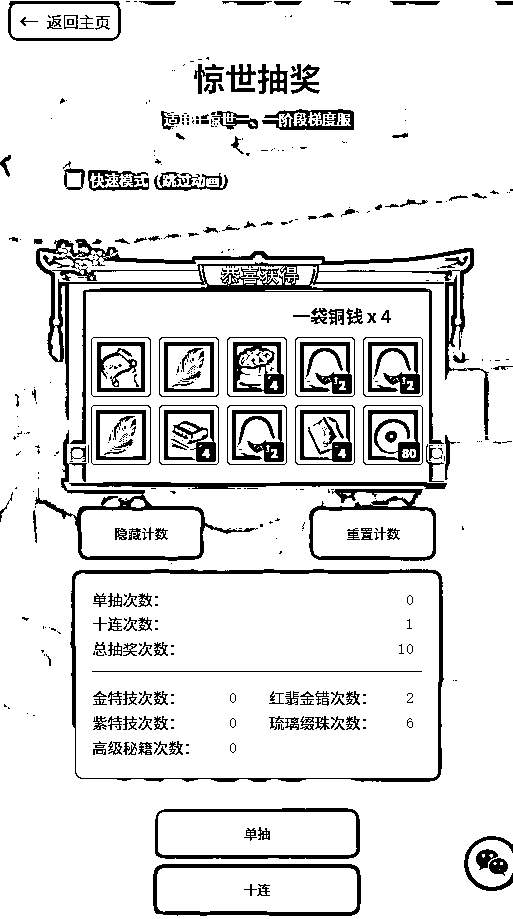
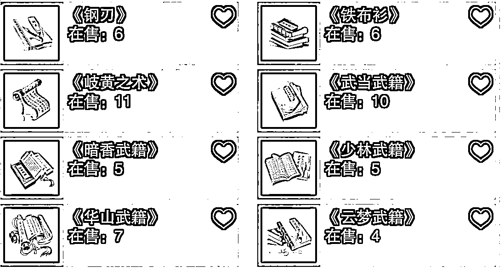
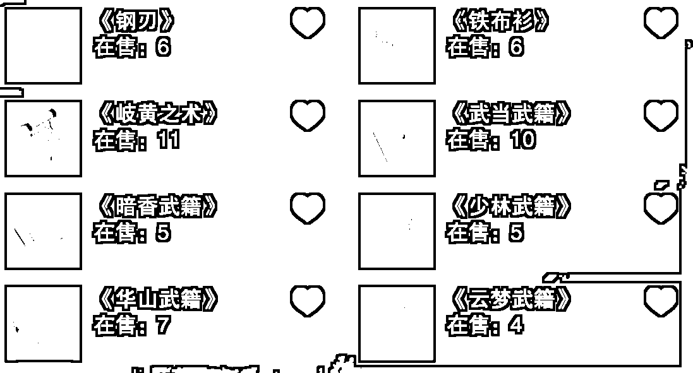
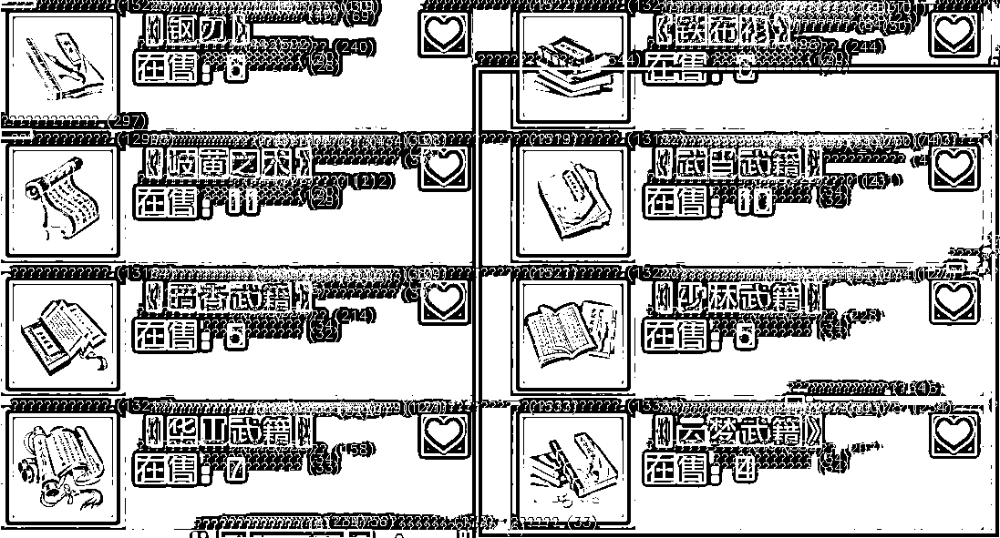
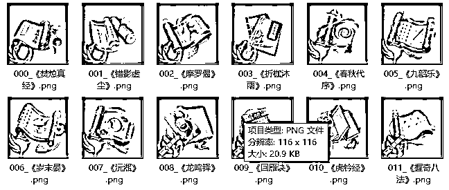
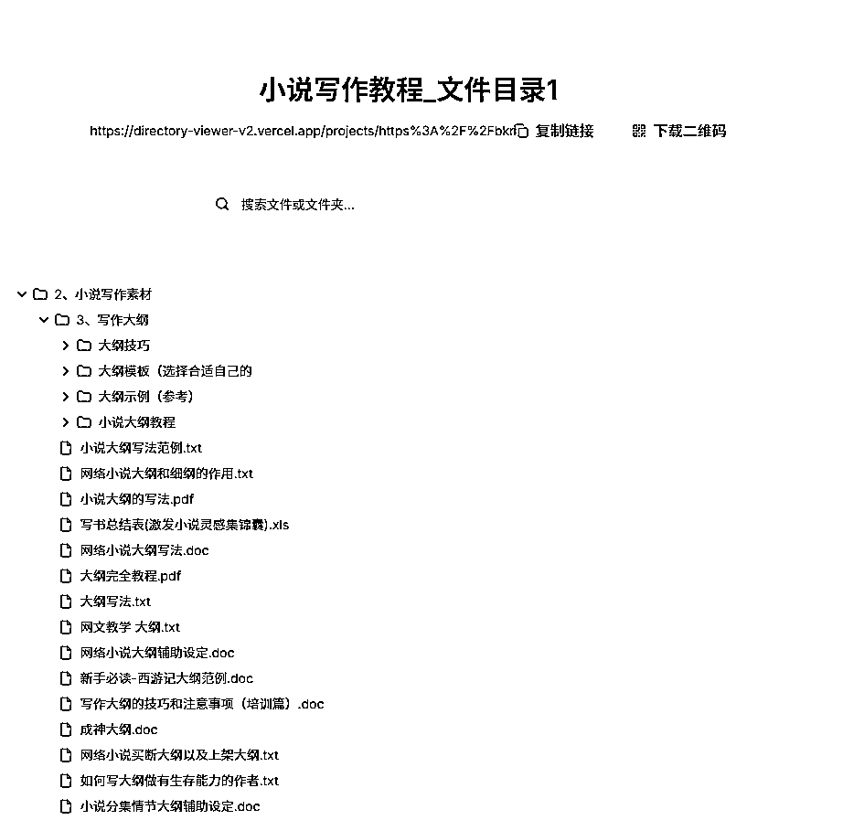

# 不会编程的新人小白在cursor航海收获了什么？

> 来源：[https://bw54wz1lzj.feishu.cn/docx/L4RSdVT5hoj3BZx52G1cuKrGnCg](https://bw54wz1lzj.feishu.cn/docx/L4RSdVT5hoj3BZx52G1cuKrGnCg)

# 1.介绍一下我的作品

## 1.1抽奖模拟器

在航海过程中我总共开发了两个网页和几个配套的小工具，其中一个网页是我之前玩的一个游戏里面的抽奖，因为游戏里的抽奖一次需要6元，而且概率低的离谱，然后很多玩游戏的认可垫刀这一说法（就是抽奖之前抽很多别的奖把不好的运气用掉），我就萌生了一个模拟器的想法，就是把游戏里的抽奖搬到网页中，让大家免费抽奖。

然后就是和cursor讨论怎么做，具体过程我就不赘述了，航海手册都有具体的过程（航海手册已经特别详细了，如果还有什么问题可以直接问cursor，任何问题都可以问），下面贴一下网站和概率图




目前这个网站已经有1300+次访问，并且我挂上了游戏脚本代卖，也卖了几单


在这个过程中最难的是物品图片和名称的对应，涉及200多个物品，所以我又用cursor写了个切割图片并命名的工具，大大增加了我的效率，工具先将图片灰度，然后识别物品框，最后直接切割命名。所以说在生活中只要是重复在电脑上操作的基本都有办法批量制作，大大节省时间。









## 2.2 目录查看器

这个作品的灵感来源是我还参加了闲鱼虚拟资料的航海，我有一个品的资料特别多，文件也很大，我截图的时候直截图了部分文件，但是有一个用户来问我想看看目录确定一下文件里面有啥，但是不能直接给网盘链接给他，因为会直接拿到资料了，我就想能不能直接生成一个目录文件？后来发现百度网盘可以直接导出目录的txt，但是百度网盘导出的目录可读性很不方便，它是这个样子，特别长，这份有13003行，所以我就想给他改超成可以展开目录的形式，就是右边的形式，每个文件夹都可以展开关闭看看里面有什么内容，并且可以搜索，我们只需要把目录文件上传这个网站，然后就会自动生成这个目录页面，可以把链接或二维码发给客户，客户可以直接访问看到我们要卖的资料目录，能够提高客户信任度加大成交率。




# 2.使用cursor开发的一些心得

## 2.1 优先讨论产品实现路径

首先是当你做一款产品的时候一定要先和cursor讨论好用什么方法实现我们的产品，最好是能够让cursor提供多种方案以及优缺点让你选择，我做目录查看器这款产品的时候就是没有事先考虑好，采用了数据库的方法去保存数据，最后导致在vercel部署的时候由于免费数据库太小，我的网站只能分析小文件的目录，大文件目录就会失败，后面在不断的尝试中我看到cursor说了一句可以不用数据库的时候我太崩溃了，前面白干。后面重新讨论分析也是做出了现在的版本，大文件小文件均适用并且用的免费的储存空间。

## 2.2 开发阶段添加开发日志

用cursor开发软件的时候总会遇见各种bug，但是单纯的去说结果可能很难排查出问题在哪。比如我开发的那款切割图片命名的小工具，一开始总是切不出我要的物品图片，不是位置不对就是大小不对，后来我让cursor添加了很多功能日志，如下图，他会分步导出图片让我看问题出在哪，并且把正确的图片加上绿框，具体代码可以看下面，


```
                # 二值化处理
                _, binary = cv2.threshold(mask, 127, 255, cv2.THRESH_BINARY)

                # 形态学操作，确保网格线连续
                kernel = np.ones((3,3), np.uint8)
                binary = cv2.dilate(binary, kernel, iterations=1)
                binary = cv2.erode(binary, kernel, iterations=1)

                # 二值化和形态学操作后，保存调试图像
                debug_binary_path = os.path.join(binary_output_folder, f'debug_binary_{image_file}')
                cv2.imwrite(debug_binary_path, binary)
                print(f"二值化处理完成，已保存调试图像: {debug_binary_path}")

                # 反转图像，使图标区域为白色，网格线为黑色
                inverted = cv2.bitwise_not(binary)

                # 反转图像后，保存调试图像
                debug_inverted_path = os.path.join(binary_output_folder, f'debug_inverted_{image_file}')
                cv2.imwrite(debug_inverted_path, inverted)
                print(f"图像反转完成，已保存调试图像: {debug_inverted_path}")

                # 连通区域分析
                num_labels, labels, stats, centroids = cv2.connectedComponentsWithStats(inverted, connectivity=4)
                print(f"\n找到连通区域数量: {num_labels - 1}")

                # 面积统计和分析
                areas = [stats[i, cv2.CC_STAT_AREA] for i in range(1, num_labels)]
                if not areas:
                    print(f"在 {image_file} 中未找到任何有效区域")
                    continue
               # 判断区域是否有效
                    if area < min_area:
                        reason = "面积过小"
                        color = (0, 0, 255)  # 红色
                    elif area > max_area:
                        reason = "面积过大"
                        color = (0, 255, 255)  # 黄色
                    elif aspect_ratio < 0.7 or aspect_ratio > 1.1:  # 调整宽高比范围为0.9-1.1
                        reason = "宽高比不符"
                        color = (255, 0, 0)  # 蓝色
                    elif w < 40 or h < 40:
                        reason = "尺寸过小"
                        color = (255, 0, 255)  # 紫色
                    else:
                        reason = "有效区域"
                        color = (0, 255, 0)  # 绿色
                        valid_count += 1
```

有了日志之后出现bug你就可以复制给cursor说明，然后就可以精准找到问题在哪，极大提高了开发效率。

## 2.3每增加一个小功能或者完成一个小项目一定要保存版本

因为cursor开发过程中会经常遇见添加新的东西的时候把之前的代码改了，然后导致本来成功的功能也失败了，就又陷入了不断改bug的过程中，所以一定要保存每个版本，航海手册提到的gitlens很好用，强烈推荐。目录查看器这个项目我保存了十几个版本。。。。。

## 2.4 有耐心很重要

因为cursor很多时候不是万能的，它会理解错误，会造成很多反复修改的问题，尤其是agent模式，容易反复修改一个bug，如果没有耐心就很难去仔细分析问题出在哪，要多思考自己应该怎么和cursor交流，尽可能的让它理解你说的东西。遇到了任何问题都可以与cursor讨论，比百度方便多了。

## 2.5大胆去做，体验乐趣

有一个灵感就去做，不要想有没有市场，先体验开发项目的乐趣，熟练之后项目多了之后，会诞生好的产品的，加油。