# 我是如何用 AI 工作流写公众号，45 天涨粉 14000

> 来源：[https://aiawaken.feishu.cn/docx/Afpydi2q6oiLFxxIJ0wciLWanej](https://aiawaken.feishu.cn/docx/Afpydi2q6oiLFxxIJ0wciLWanej)

本系列分两篇：

上篇：讲感想：心路，感受，想法，下一阶段计划

下篇：说实操：如何用 AI 工作流写作做 IP 文

先放几张图，

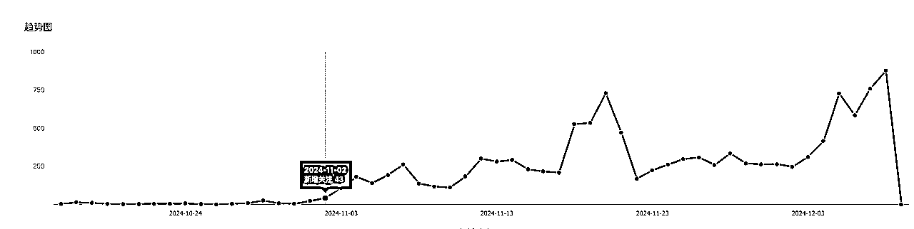

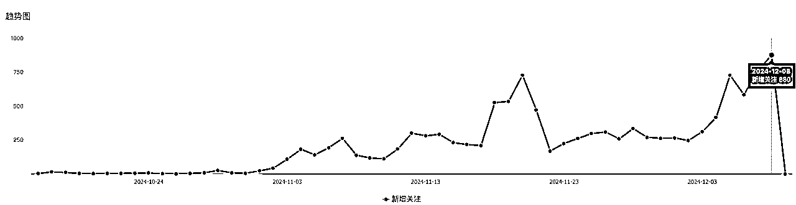

10.16-11.01，在思考，纵所周知 101 应该写什么

11.02 找到明确方向，和表达方法。

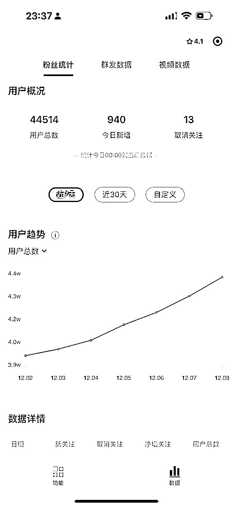

12.09，目前接近 45000 的关注

还记得 2016 年的公众号红利期，

我的"纵所周知 101"发布 3 篇文章就收获了 4 万粉丝。

但没有坚持的代价是关注数逐渐流失，

如今只剩 3 万多。

今年重启更新后，

文章阅读量始终徘徊在 300 左右。

即便我用 AI 工作流做公众号流量文，

创造过单周 200 万流量、日收益破 5000 的爆文成绩，

这个老号依然没有明显起色。

依旧没有起色，

10 月 16 日凌晨，

我做了一个重要决定：放下爆文收益，专注打造真正的 IP。

为什么？

因为当初我 All in AI 创业时，

我希望让更多的人知道 AI，实践 AI，用好 AI，通过 AI 变现

做猎头时，看见大批大批的人因为行业变革而失业。

那段时间，我也常常自问：

“自己的价值在哪里？如何在这个时代创造更大的财富？”

我相信你+AI 的组合，会成就更多 AI 作家，

AI 艺术家，AI 歌手，AI 教育家....、

而我想要做的，就是搭建起这座桥梁，

帮助那些埋头苦干却得不到正反馈的人，

找到与 AI 协作方式。

觉醒强大的自己。

* * *

## 上篇：IP 文

输入：

如何在公众号上沉淀自己的 IP 价值？

它说：

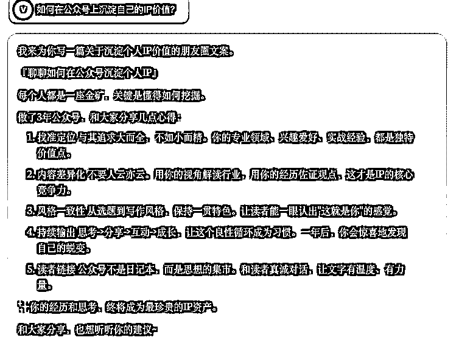

我想说：

IP 文，应该找到合适自己的方式，

去真诚的表达。

那么我想纵所周知 101，应该有这些表达：

#### 个人品牌故事文：我的立身之本

讲好自己的故事，

让大家真正了解了我的成长历程，

因为，我是普通人，

只不过比大家更早学习和实践 AI。

我能做到，真的可以去验证尝试。

我的路径，大多数可以复制。

#### 产品介绍文：我的价值清单

能让粉丝快速了解我能提供什么，

很多讲 AI 的号，

讲现象，讲热点新闻，

但好像没有解决问题，

我觉得一个 AIP 应该有自己 AI 产品背书。

眼见不一定为实，

即插即用的上手更务实。

#### 月度复盘文：我的成长轨迹

定期复盘让大家看到我的工作状态和生活态度。

通过分享经验与心得，

可能，真正价值传递，是变化和成长的本身。

就像我最喜欢的电影《阿甘正传》

让我期待和激励是，未来的阿甘。

#### 个人感悟文：我的先思后量

可以分享对行业趋势的见解、

对热点事件的观察，

或是工作生活中的深度思考。

希望对大家有启发

#### 干货沉淀文：与 AI 协作的工作流

这是纵所周知 101 的核心内容。

我经常分享各种 AI 工作流，

持续探索与 AI 协作的方式。

也是我的初心。

我明白需要在想做，要做，能做里找平衡点，

对于一个重启的老号，

对我自己三个做都满足的是什么

最后，我选择了

干货沉淀文：与 AI 协作的工作流。

* * *

# 感想一：网感选题+有价值内容=有流量的 IP 文

在增长到 1000 粉时，我有一个深刻感受：

原来内容创作的赛道上，

存在着不同的跑道和玩法

爆文就像短跑 —— 来得快，走得也快

能给你带来不错的回报 但粉丝留存率往往不高

就像写情感故事会，写热点文，这种就像擦边视频

30 秒的密集擦边爽点过后，这个账号，留不住读者的心。

而 IP 文则是场马拉松 —— 需要耐心打磨，

慢慢沉淀 一步一个脚印积累真正的粉丝 为品牌注入持久生命力

沉淀个人品牌。看似慢，却在积累忠实读者。

但有趣的是，这两者的核心其实都离不开

两个关键词： 网感 × 内容

▫️网感，

是你对平台的深刻理解 懂得如何用平台的语言说话

明白流量背后的运作逻辑

▫️内容，

则是你真正的价值输出 是你的经验、洞察与思考

是受众真正需要的干货

当这两者完美结合，就会诞生：

平台推荐的 SEO 表达 + 受众需要的价值内容 = 一篇既能吸引流量，又能留住粉丝的作品

记住这个公式： 网感选题 + 优质内容 = 破圈的 IP 文

* * *

# 感想二：内容创作就像“业务复盘”

15 天时，公众号有了 5000 关注

内容创作就像之前在职场一次次“业务复盘”

把我对于某个领域的思路和片面理解

逻辑化的封装和输出

不一样的是：

在职场，

我们习惯把复杂的业务拆解成清晰的逻辑链：

数据分析、问题归因、方案优化... 一步步提炼，

然后，加一层滤镜，

关注汇报老板，看到什么，是符合他的想法

思考下属团队，听到什么，依旧鸡血满满。

最后封装成同事们"想看到的"那部分。

在自媒体内容创作，

我依然在不断拆解和重组自己的认知， 但内心更自由了。

可以尽情表达对某个领域的全部思考，

可以放心分享那些不成熟的困惑，

可以真诚记录每一次认知的升级。

现在，我可以封装全部的“思”与“量”

我输出的观点能够传达到很多人

也许这是学习真正内化意义

你的学有所得，给他人一点点收获

真好。

* * *

# 感想三：内容链接人

做 IP 文，出来关注数的增长

正反馈还有其他：

有时，是一个受用产品反馈

有次，一个电话让我愣住了

原来对方是某企业高管，

通过我的公众号文章找到我。

更让我惊喜的是，

他不仅发来了一份详实的产品反馈，

还和我深聊了 40 分钟创业心得。

有时，是一个写书邀约

一个私信，说是某某出版社的，

写书的计划，是我 2025 年一个目标

没想到用内容提前链接到这样合作。

有时，是一个商务合作，

有时，是一个咨询的请教，

更多，是收到很多读者的诉求

让我更好知道，我该写什么

当你认真对待每一篇文章，用心沉淀每一个观点，

你的内容就在悄悄决定 ——

你能遇见什么样的贵人。

你在链接的是一群同频的人。

所以啊，我们别着急，慢慢来。

你的每一份用心沉淀，只需要静待花开。

* * *

# 感想四：心里有念，亦能执剑

过程，有一个插曲

前同事，和我打电话，说他离职了，

看到我开始做自媒体，有点小成绩。

让我给点建议。

某前任公司，是国内科技猎头行业前列，

也有过亿级的营收。

目前各方面下滑厉害，可能是行业缩影，

当时我 all in AI 创业时，有人说我是投机主义。

有点感概，不是落井下石

发现，再厉害的公司和人，

面对生产力到来时，

如果没有把手弄脏下场，

有可能因为心态和信息茧房的约束淘汰

作为普通人的我，想逆天改命

屏气，凝神，学识

脚踏，实地，实践

逆天改命，不说成不成，

能确定成是构筑 AI 认知差

心里有念，亦能执剑 …

* * *

# 一次游学

2024 年，真的快结束了。

AI 学习的推背感，是 2024 年初的心绪。

AI 机会的涌动感，是 2024 年末的感知。

纵所周知 101 完成了阶段性的目标，

感谢每一位订阅者的支持。

但对我而言，也意味着新起点和新思考的开始。

『凡是找到的，都不再是你要找的。

找到的过程，才是你来时路和道。』

带着这份领悟，我决定用 2024 最后的半个月，

走一趟跨年游学之旅，去长沙，武汉，杭州，上海，北京

想去现场感受即将到来的 2025 年 AI 涌动，

去拜访这些城市的 AI 新知，

更想与屏幕那端的你，建立真实的连接。

让 2024 的尾声， 成为 2025 的序章。

* * *

# 下篇：明确我要让 AI 做什么

我之前写过一篇文章：

设计任何工作流，

我习惯归纳这个 AI 工作流的：

系统和流程

是需要开放式还是固定式输出

我是什么角色，AI 是什么角色

## 首先，我要知道公众号文章的创作流程：

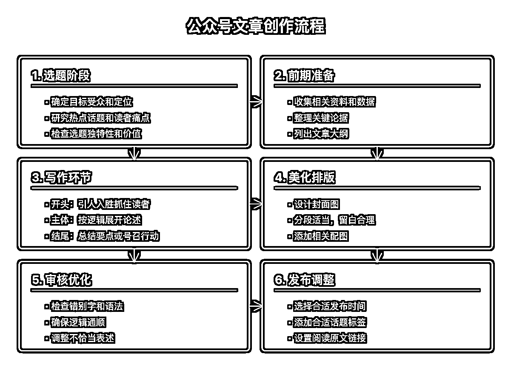

## 其次，明确在工作流里，AI 输出是开放式还是固定式

##### 设计固定的输出：

*   就像给我一个详细的操作手册

*   包含具体的步骤、场景和方法

*   类似于"形"的层面

*   优点：可以得到可控、稳定的输出

*   缺点：可能限制了 AI 的创造性思维空间

比如：大多数的仿写文章工作流就是固定式的，基本就是这样的

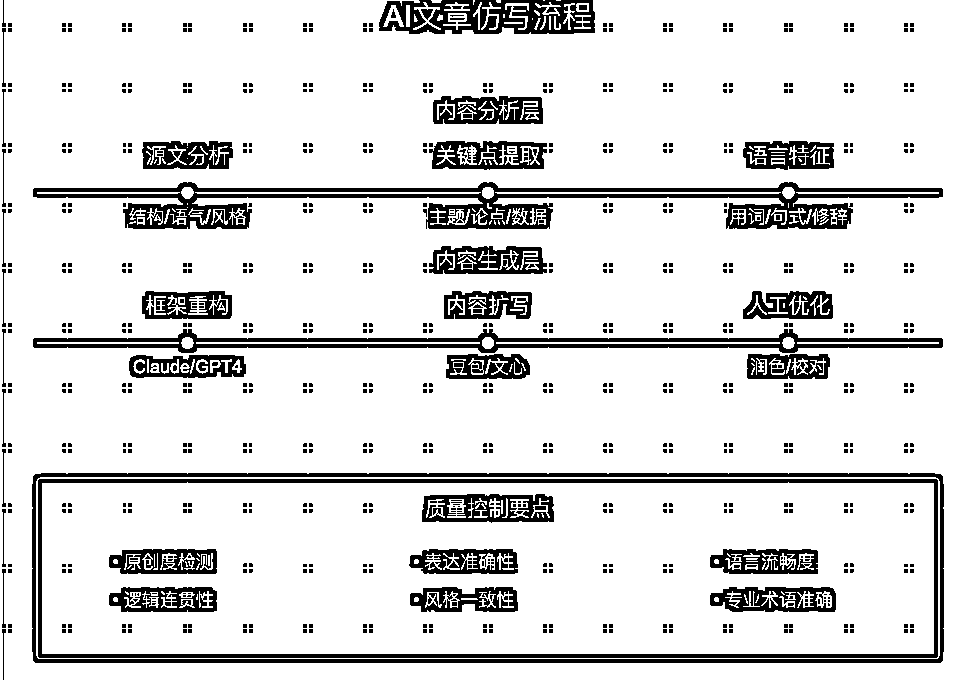

##### 设计开放式的输出：

*   更像是给我一个创作的灵感和方向

*   通过意境的关键词构建语义场

*   触及"神韵"的层面

*   优点：激发我的联想和创造力

*   缺点：输出可能不够稳定可控

比如：AI 与人一起写文章，应该是这样的：

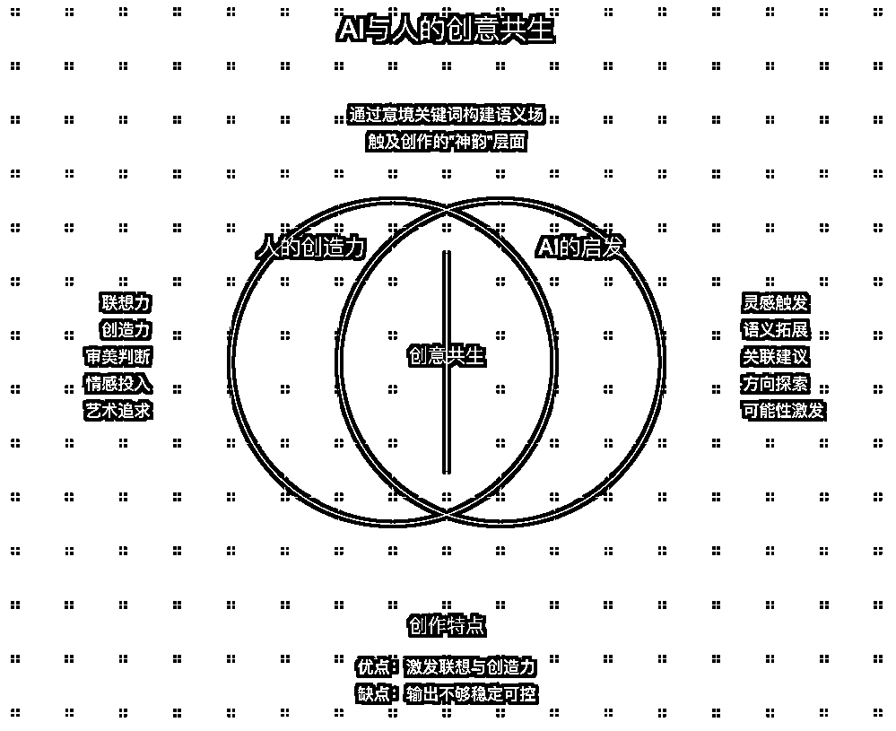

IP 文，是我思与量的封装，

我选后者。

## 最后，我是什么角色，AI 是什么角色

参考：

我觉得人为参与 AI 写作提效比例是

选题阶段：人 80%+AI 提供 20%灵感补全

前期准备：人 60%收集数据+准备素材，AI40%整理论据+列出大纲

写作环节：人微调 10% + AI 写作 90%，

美化排版：人判断，决策 10%+ AI 90%

审核优化：人判断，决策 10%+ AI 90%

发布：人 100%

本质是：

人做： 选择，判断，决策，引导

AI 写作：生成内容，启发灵感各流程灵感

##### 用 AI 封装我的思考，

##### 而不是用 AI 替 代我的思考。

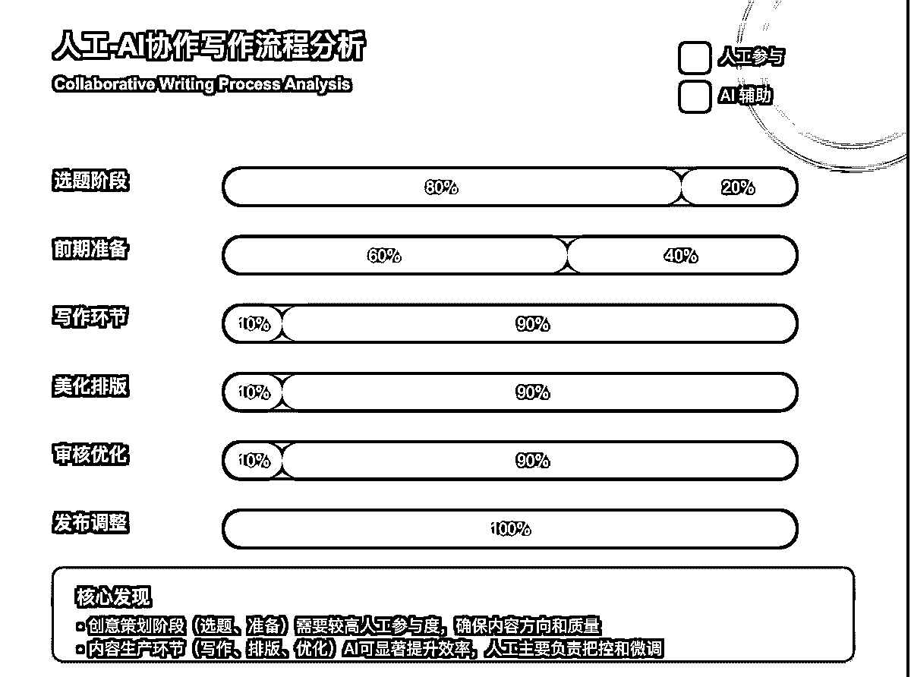

* * *

# AI 选题工作流

## 人选题方法论

我觉得，大道至简，无非是三点

### 观

细心观察每个瞬间

#### 生活观察法

生活中的每个细节都是

绝佳的写作素材。

早晨排队买咖啡的人群、

公交车上的温暖瞬间、

街边小店的人情故事...

当你用心观察，睁眼是故事，闭眼是灵感。

#### 高赞文案观察法：

那些能引发共鸣的文案，

为什么能击中人心？

拆解它们，

你会发现：情感共鸣+巧妙表达，

往往是制胜法则。

#### 热点文观察法：

关注社会热点，但不是简单跟风。

找到热点背后的人性思考，挖掘独特视角。

比如一个网络热梗背后的社会现象，

一个流行话题里的情感共鸣。

但求新，不求快。

在热点里挖掘真实情感，找到独特视角。

让文字有温度，更有深度。

### 记

认真记录每次感悟 ，灵感碎片，用户问题，

#### 对比反思法

今天的你 vs 昨天的你

理想 vs 现实

预期 vs 结果

通过对比，提炼成长，启发思考。

#### 问题解答法

把读者的每个问题都当作写作的金矿：

记录读者困惑

分析问题本质

提供解决方案

延伸拓展价值

一个好问题 = 一篇好文章

#### 灵感收集法

将生活中的每个瞬间都变成写作素材：

*   刷手机时的看到金句

*   路过时的灵光一现

*   阅读时的心得体会

*   深夜里的突发奇想

### 体

用心体会每份情感

#### 痛点挖掘法

你的困扰，大概也是他人的困扰。

工作压力、情感困惑、生活焦虑...

这些共同的"痛点"往往最能引发共鸣。

记录下如何克服困境，你的经验可能正是别人需要的。

#### 专业延展法

把你的专业所长转化为大众感兴趣的内容。比如：

程序员谈高效工作方法，

设计师聊生活美学，

老师分享教育心得，

我应该是分享 AI 工作流的方法赋能更多人。

#### 情感共鸣法：

这个时代，

被看到比去批评

更值得提倡吧。

## AI 选题工作流 = 人机写作

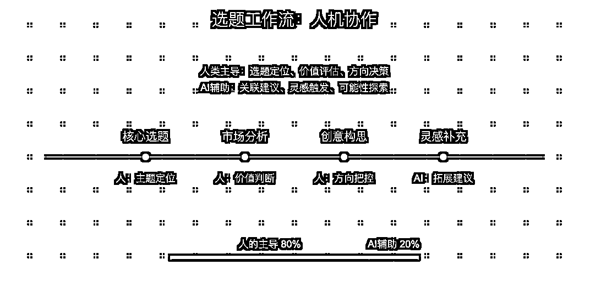

### 例：应用在热点文观察法

我来为您生成一个展示人与 AI 协作写作过程的案例，类似于之前文本的对话迭代形式。

初始版本

人： 我想写一篇关于刘润 2024 年跨年演讲的解读文章

>> GPT API 回复：

你可以从以下角度解读刘润的演讲：核心观点提炼、案例分析、思维方法论等。

这是一个典型的演讲解读文章框架。

增加"人类洞察"影响

人：我发现我们可以把这个演讲放在工作总结的框架下来写

>> GPT API 回复：

这个角度很有创新性。我们可以把刘润演讲中的观点，

重新组织成一个工作复盘和展望的框架。

这样不仅解读了演讲内容，还能给读者实用的行动指南。

增加"双向互动"影响

人：我想用工作复盘为主线，请你帮我找出演讲中可以支撑这个思路的点

>> GPT API 回复：

我们可以从演讲中提取：

年度工作者画像分析

行业发展趋势研判

个人成长路径建议

这些要素都能很好地融入工作总结框架。

增加"价值聚焦"影响

人：这个角度看起来更有实用性，我决定采用这个方向

>> GPT API 回复：

完全同意。这样的改编能让内容：

从单纯的演讲解读转向实用指南

让读者能立即应用到自己的工作总结中

形成可操作的行动框架

增加"执行规划"影响

人：那我们就这样确定选题：《用 AI 工作总结框架解读刘润 2024 年跨年演讲》

>> GPT API 回复：

这个标题很好，它体现了三个价值点：

时效性：2024 年的新内容

实用性：工作总结这个场景

创新性：AI 视角的解读方式

我们可以看到：

*   人类带来了创造性的角度转换

*   AI 提供了框架化的思维辅助

*   双方协作让选题更有价值和可执行性

*   最终成品融合了人的洞察和 AI 的结构化能力

最后文章：

### 例：应用专业延展法

输入：

用你的思考思考，解答下面任务，show don't tell：

“我观察到 AI 工作流很适合赋能自媒体进行内容创作，请你帮我提供写作选题思路 ”

回复：

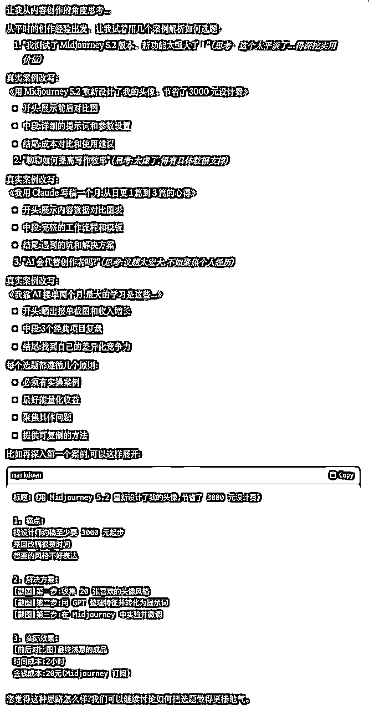

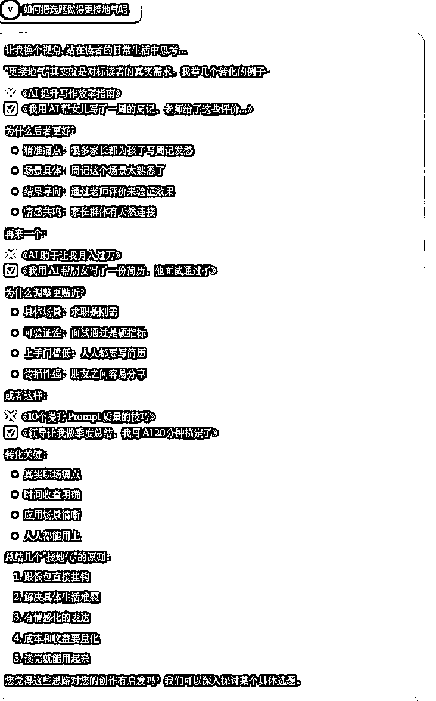

你看，

我们是不是做好

主题定位

价值判断

方向把控

就够了。

但，难点是

你得首先掌握选题方法论。

* * *

# AI 内容工作流

我首先的思考，还是回归对内容的理解，

什么是我要写的内容，

我觉得应该是适合我自己的真诚的表达

内容具有增量性：人有我优

内容具有稀缺性：人无我有

于是，我设计以下工作流：

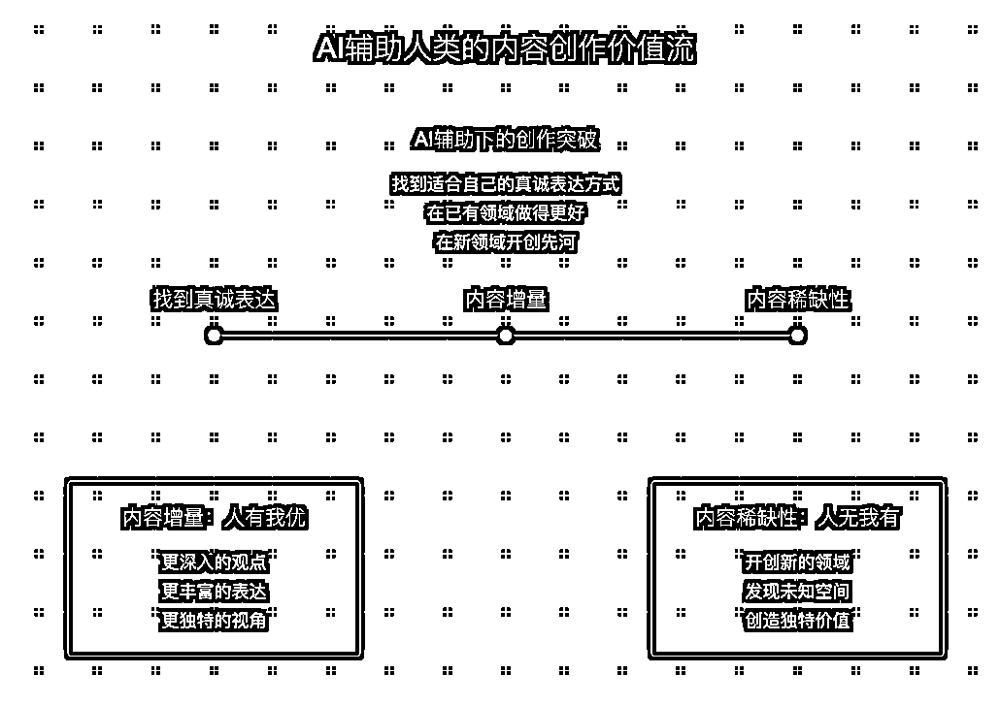

人有我优，

我可以通过 AI 优化，行文风格，排版，标题等等

比如内容的优化：

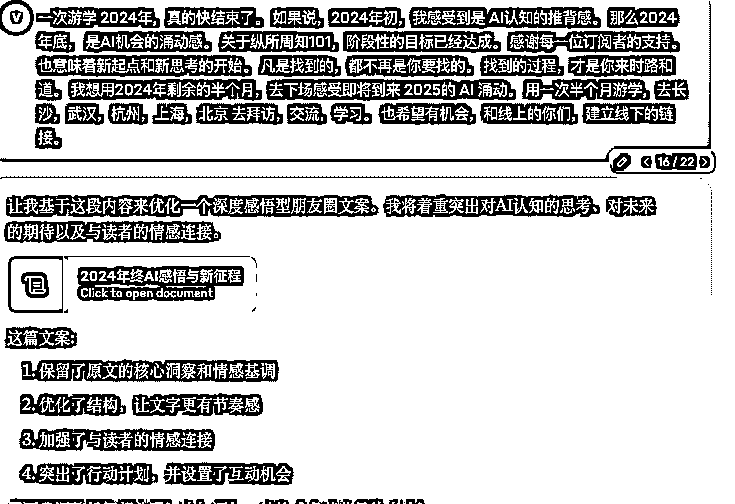

人无我有，

我可以设计让大家一眼就懂的辅助内容，比如：小觉醒 ｜看见思考的形状。

有了一系列文章：

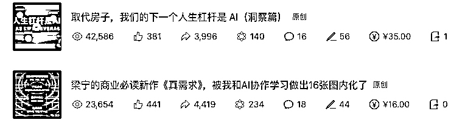

* * *

"在这个 AI 时代，我们的价值究竟在哪里？"

抬头望去，整个世界都在谈论 AI。

有人焦虑，有人兴奋，有人迷茫。

其实，AI 就像一面镜子，

让我们第一次如此深入地思考： 人类的独特价值究竟在哪里？

也许答案就在于：

我们能与 AI 对话，

能思考这个问题本身，

能主动探索协作之道，

能不断觉醒、成长、超越。

我想，我会带着这个问题继续求知，求索。

* * *

作者介绍周知：

AI 觉醒派主理人，AI 工作流专家

AI 觉醒派 COZE 代表作品：

小觉醒思维助手，Suno 音乐歌词专家、智能笔尖，

未来想成为超级个体的你，链接我，

一起探索成为 AI 作家，AI 歌手，AI 艺术家。