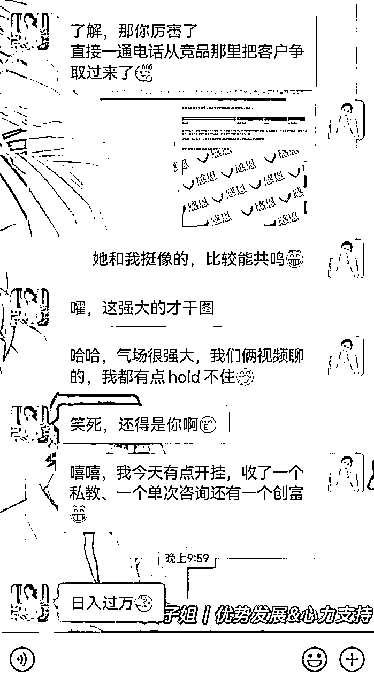
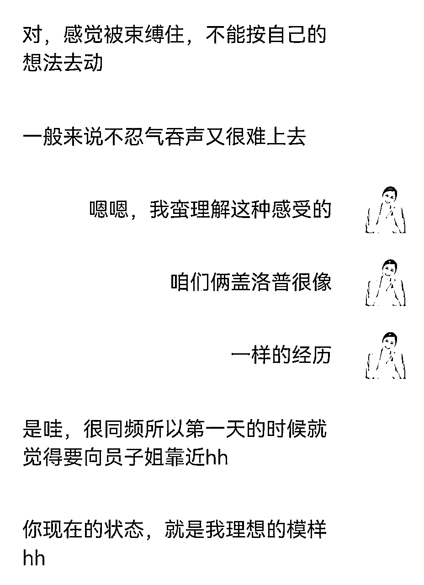
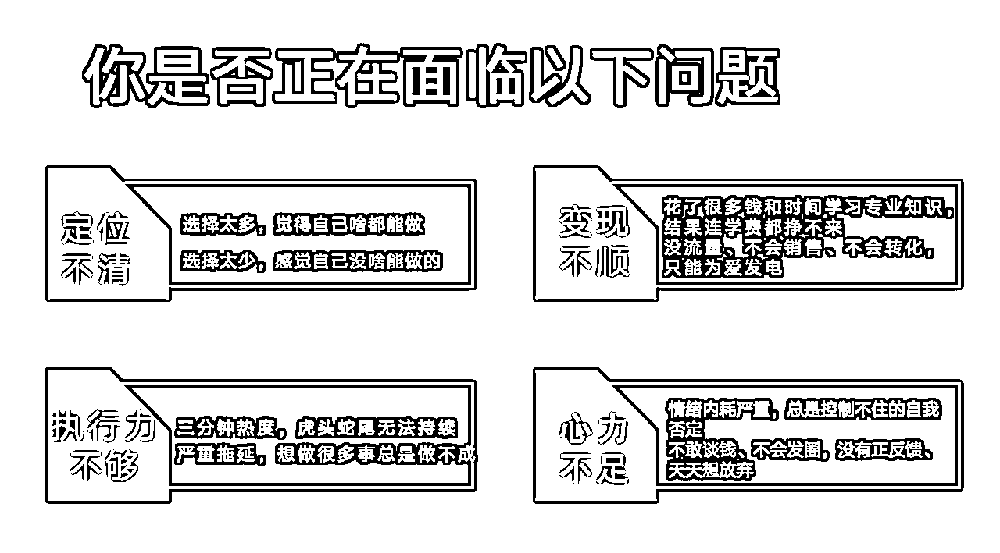
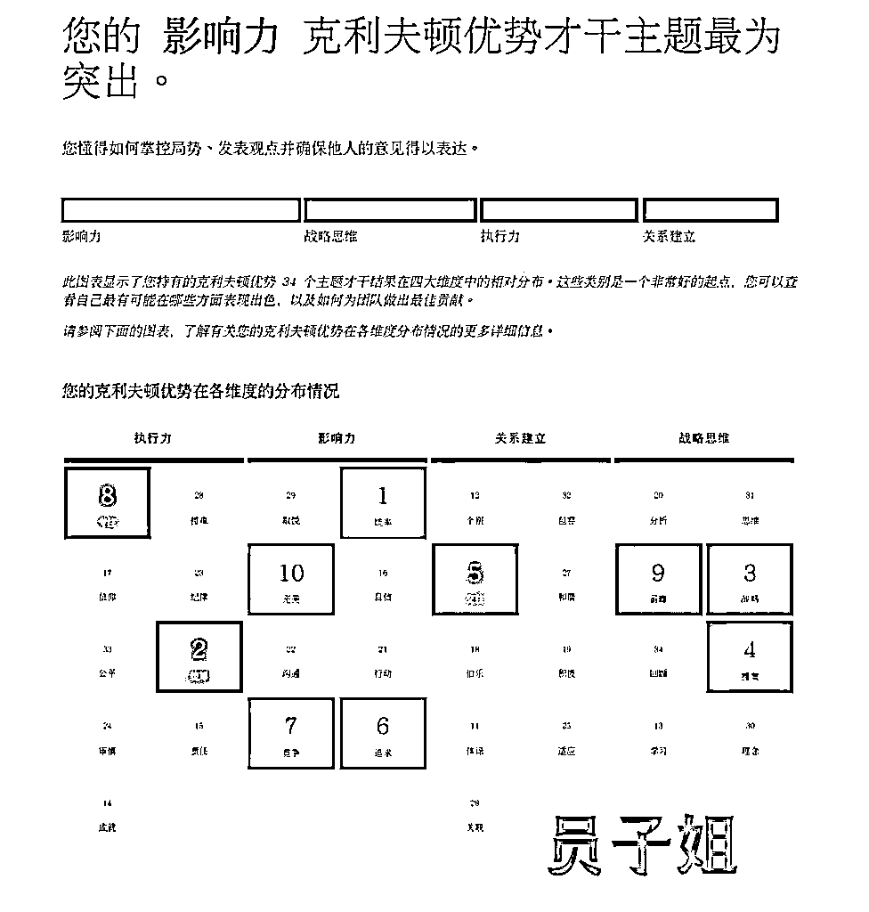
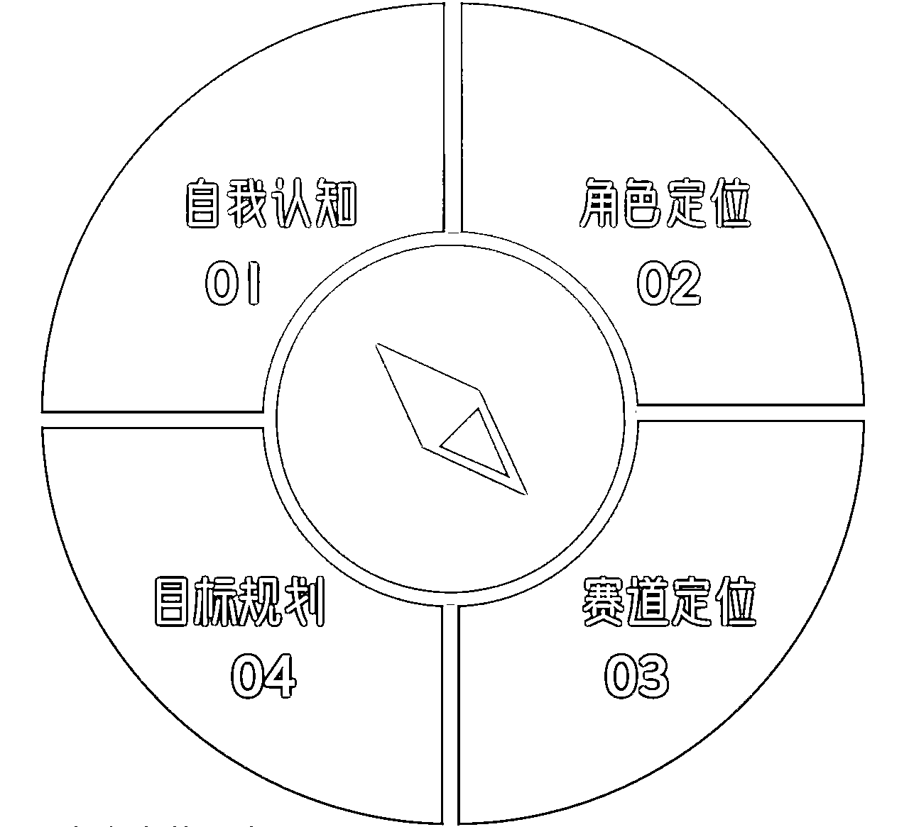
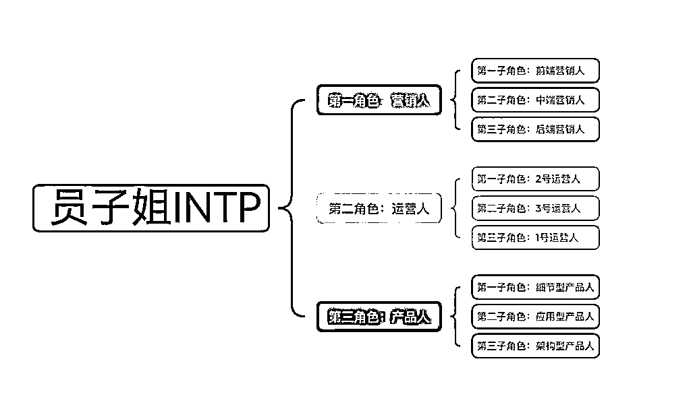
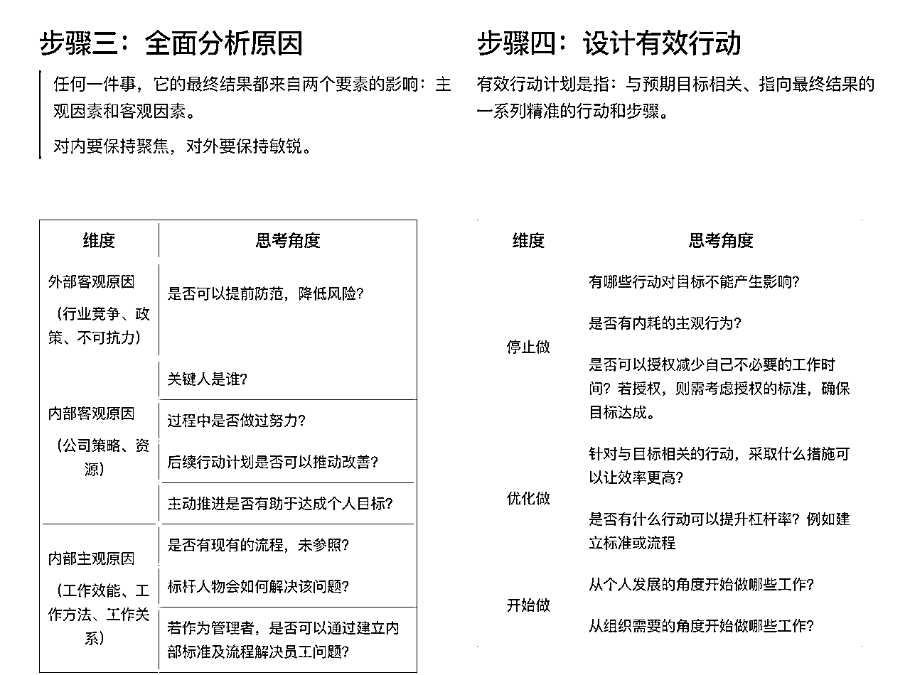
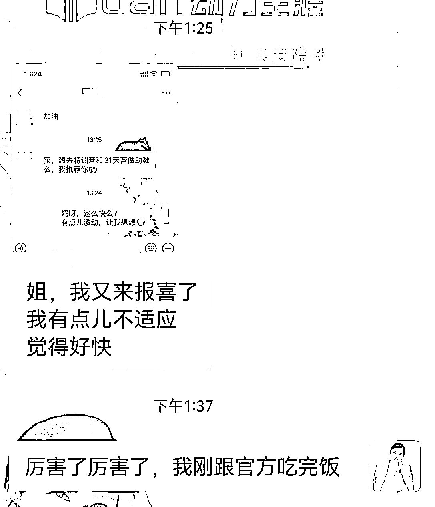
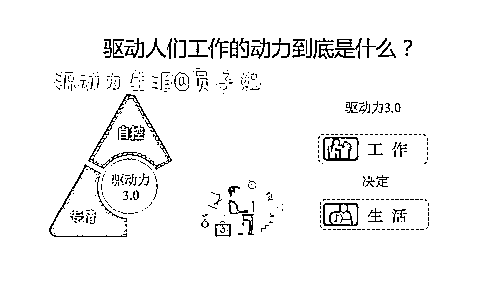
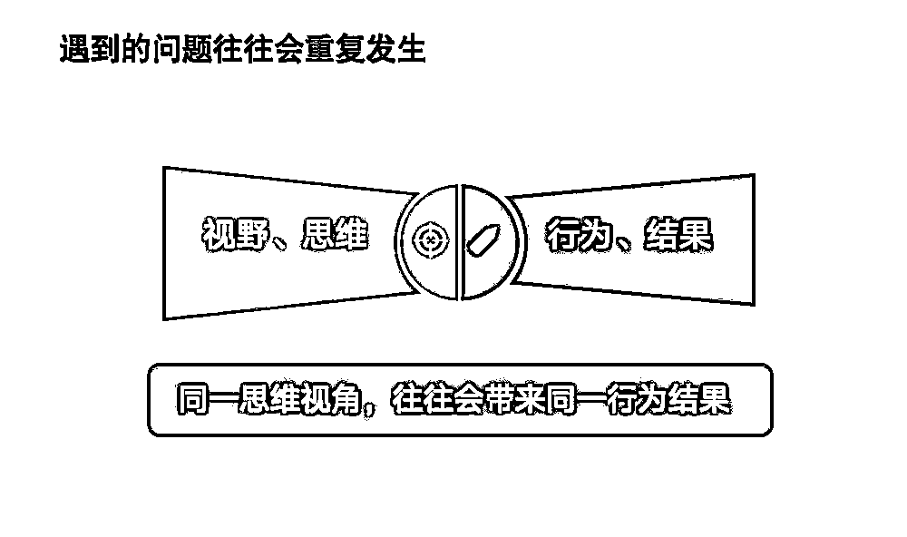

# 一个罗盘、四个步骤、八个锦囊，帮你精准定位，轻松实现只工作不上班

> 来源：[https://gulggw6ggu.feishu.cn/docx/LjZPdVI5Mo9xzIxtDuNcsAfpnGh](https://gulggw6ggu.feishu.cn/docx/LjZPdVI5Mo9xzIxtDuNcsAfpnGh)

大家好，我是员子姐，自洽人生教练、盖洛普全球认证优势教练、职业生涯规划师、MBTI高级解析师、结构化复盘高级教练、咨询师IP经纪人。

员子姐深耕生涯规划领域7年，在脱掉了孔乙己的长衫后，我不但找到了专属的优势模式，更是突破了困扰很多新手咨询师的流量、销转卡点，找到了自己的本命事业。

2023年1月，员子姐正式开启了独立咨询师&优势教练的工作模式~

只工作不上班的第二个月我成为了靠谱的合伙人，收入也一下子从1500元到突破五位数，第一年营收突破50w，我把自己活成了最好的成功案例。

2024年是员子姐只工作不上班的第二年，我实现了从月入过万到日入过万的突破。

如果说2023年让我突破了卡点，跑通了商业闭环。那么2024年我更多的是向内修炼，让自己的内核更加的稳定，在自己的框架和节奏里面稳定的前行。

今年我带的学员也逐渐成长起来，很多人成为了我的轻创业路上的合伙人、同行者。

只工作不上班这两年，我越发深刻的觉察到这是一种生活状态，有种不以物喜不以己悲的感觉。外界的环境和周围的人已经很难影响我的状态。

我接触到的很多学员，都会说，员子姐，你活成了我理想中的样子。

你们可能会觉得员子姐很幸运，但是事实上我也经历了相当长的一段自我探索时期。

我从2018年自己遭遇职业发展瓶颈，开始学习生涯规划。从解决自己的问题开始，到不断升级打怪去帮助更多的人解决职业问题。

员子姐有13年职场经历，3次零基础跨行业转型成功经历。当过大学老师、混过体制、体验过互联网、组建过高科技公司。

2023年开始担任生涯规划行业头部公司新精英生涯的基石班促动师、职业突破营签约带教老师；同时也是优势动力创富合伙人、玩赚合伙人、靠谱销冠群成员、粥左罗顶峰会成员、理白星辰会成员、可粒的超级个体成员。

目前专注为职场人/自由职业/轻创业者提供基于优势的个人发展规划以及心力支持陪跑服务，让你主业有突破、转型有方向、副业有机会，搞定情绪内耗，活出自洽有掌控感的人生。

员子姐累积辅导550+职场人，咨询时长600+小时，帮助来访者实现主业升职副业变现，带领100+新手咨询师成长，打通商业闭环。

我能提供：

1、为职场人，规划晋升路径，实现升职加薪、副业变现

2、为创业者，找到专属的优势模式，十倍放大个人势能

3、为咨询师，提供发展路径规划，打通商业闭环

那我的分享就正式开始啦，今天的稿子内容有点多，大家跟上进度，觉得共鸣和收获的地方可以拍拍我，让我感受到你们的陪伴哦~

今天的分享有以下几个部分的内容

1、无论是身处职场还是自由职业探索，那些逃不掉的困境

2、一个罗盘、四个步骤帮你精准定位

3、轻松实现只工作不上班的八大锦囊

## 一、无论是身处职场还是自由职业探索，那些逃不掉的困境？

作为一名职业生涯规划师，员子姐接待过上千名来访者。发现大家无论是在职场上，还是做副业兼职，又或者是做自由职业，都逃不掉上面👆🏻这些问题。

我有过三次跨行业转型的经历，虽然每次转型表面上看还都不错，但是每次转型都是因为我遇到了个人发展上的卡点，而当时的我能想到或者能做到的就只有转型这一条路。

这也导致我的职业经历看上去很丰富，换了不同的赛道也取得了一些小成绩，但是没有在一个领域深耕，发展后劲不足。

没学优势的时候，职业发展中遇到的困惑会让我产生自我怀疑；清楚了自己的优势和思维模式后，我的内心就变得更加的笃定，知道我是谁、知道我可以为他人提供价值的方式，这也是我能够熬过那些“黑暗时刻”的动力源吧。

给大家分享几个我曾经的职场瞬间。

场景一

明明势在必得的晋升，结果却毫无征兆地落选了。我特别想不通，明明对手样样都不如我，明明领导在各种公开场合夸我能力强，为什么最后晋升的人不是我而是别人？

当时的我除了失落更多是不解，为此我傻乎乎的跑去找领导问为什么？领导说因为我的同事互评分数比较低，所以影响了整体的分值。

WHAT？？？

晋升不是看个人工作能力和工作业绩吗？最后我竟然输在了职场的人际关系。

如果你也经历过职场人际关系的困扰，那么我想你肯定能够理解我的感受和心情，我实在是想不明白自己到底什么时候、做了什么得罪人的事情。

那时候我甚至开始怀疑自己这么直来直去的性子是不是真不对，我要不要收敛一些。

直到我开始深入学习盖洛普优势，我才找到答案。原来我是统率第一的大影响力。不怕冲突、敢说敢想敢做敢于承认责任就是我天然的行为模式，当然这个过程中少不了得罪一些人。

而且我在工作中会关注事情，会忽略人感受和情绪，我的正义感和责任感也很强，工作中碰到有损公司利益或形象的事情，我一定会制止的，所以我在不知不觉中就会侵害到某些同事的利益。还有一点就是我当时的能力和职位还驾驭不了统率才干，这也是让我痛苦的原因。

场景二

初入职场的几年，我特别愿意去组织筹备各种活动。最有成就的一次就是我同时负责两场大型会议的筹备工作，其中一场还是国际型商务会议，对于零经验的我来说，确实是个挑战。

在我成功办完这两场会议后，我就被贴上了“会议筹备”的标签。不管大会小会、商务展览、出国考察，领导通通安排给我负责。

刚开始我还是干劲十足，有种老鼠掉进米缸的快乐，觉得我的工作找得太对了。

但是随着我办会经验丰富、整理出一套SOP流程后，千篇一律不断重复的会议形式让我觉得特别特别特别的痛苦。

我和领导沟通希望进行一些调整，但是领导觉得这个活你干得这么好，给你干我放心啊，再说也没有其他合适的人选。

我和身边的朋友、家人倾诉这些苦恼，她们却认为我是在无病呻吟。在他们看来这些活你干起来毫不费力、轻轻松松有啥不好的呢。

而我自己也特别费解，这些工作都是我擅长的呀，那为什么我做起来越来越痛苦呢？

那时候职业发展不顺，总是想当然的错误归因。

单纯的认为这个工作我做的太痛苦了，不行，我要换一个。这个公司晋升体系不行，不看实力只看人际关系，不行，我要换个规范点的公司。

工作时间久了，职场经历多了，我才明白，每家公司每份工作都会有让我们不满意不舒服的问题，但是我们不能频繁的通过跳槽转型来解决问题，看似问题解决了，实际上是不断的给自己挖坑。

所以你看，即便保持探索、多次转型成功，都无法让我找到愿意终身坚持下去的事业。

那么如何才能找到自己的本命职业呢？

## 二、一个罗盘、四个步骤帮你精准定位

员子是幸运的，只工作不上班的这两年，收了30多个合伙人私教，做了150+的个案辅导，陪跑了100+ 新手咨询师成长，卖了3500个盖洛普优势测评码。

每天工作4小时，其他时间全部都可以自由支配，周末的亲子游、日常的健身、陪伴父母、错峰旅游、闺蜜小聚、外出学习等等。

不用因为孩子、父母生病而不好意思和领导频繁请假，也不会因为加班错过了学校的亲子活动、自责懊恼，总之生活的掌控权牢牢的掌握在自己的手中，这种感觉太美好了。

可以说从2023年我开启只工作不上班的状态开始，我就在不停的自我迭代。我明确了自己要做咨询师、要走知识付费这条路，但是到底我的目标用户是谁、我要帮他们解决什么问题、提供什么样的价值，这个是我不断实践根据市场的反馈、导师的指导来不断调整的。

从最初做复盘课程月入1500，到找到流量密码开始月入过万，从专注于中年职场人的职业转型，到陪跑新手咨询师做商业、给自由职业者做优势发展规划以及心力支持。

因为自己走过每一个阶段，自己的方法论得到验证，我能辅导的群体越来越多，但是我的定位反而越来越聚焦。

因为我太了解自己的优势是什么了。虽然我的来访者都说我是最有温度的大影响力，但是做教练的中立位，的确会让我的影响力才干领域受到一些的压抑。

我更适合在顾问式的咨询，用我的战略+前瞻，结合生涯+优势的双重视角，帮助来访者找到能够发挥自己优势的发展路径，同时我的复盘心法以及统率+完美+竞争这样的强势才干，也会不断的鞭笞我的来访者去把行动落地，拿到实实在在的结果。

员子姐想用真实的经历告诉大家，没有谁的定位是永远不变的，我们定位和职业生涯都是动态变化的，也要根据自己不同阶段的人生侧重点进行调整的。

关于员子姐定位的调整，大家可以看我之前的分享

这里也想和大家分享我最近迭代了的个人优势定位罗盘。

我们在做个人定位的时候，其实要分四步走。我们需要先对自己有清晰的自我认知，然后对自己进行角色的定位，有了角色再去明确赛道，最后才是做目标规划。

在自我认知的部分，我们可以借助于一些工具。像员子姐在给学员做定制化规划的时候，我会用到霍兰德职业兴趣测评、职业性格偏好测评、职业价值观评估以及个人优势测评。

记住好的咨询师是带着工具箱上路的，如果一个工具有局限，那么把工具综合起来使用，会有意想不到的收获。

自我探索其实是可以帮助我们避坑的，通过一些工具可以帮助我们快速的知道自己适合做什么、能做成什么、更适合用什么样的方式去做，当你对自己有了更多的了解，你在做选择和决策的时候，就更有针对性，命中率也会更高。

第二步是角色定位，这是我们做职业规划或者是自媒体定位经常会忽略的一点。就像员子姐遇到很多来访者，问他想解决什么问题，上来就是想找到适合自己的副业定位，想做自媒体。

具体做什么呢，一问三不知。

这个就像我们去吃饭选餐厅，你想吃中餐、西餐、日料还是法餐。先明确了大的范围，再去选具体哪家餐厅。

那么我们在企业中有三大核心角色，做自媒体也一样。

分别就是产品人、营销人和运营人。

如果你要发展副业、探索自由职业，这三个角色你会怎么选择呢？

记住，我们不是为了认知而去做自我认知，而是为了匹配对应的角色去进行自我认知探索。

第三步赛道定位，这个我在之前的分享中提过，三个点

1、优先选择你有资源的赛道

2、选择满足市场需求大，离钱近的赛道

3、选择你能够胜任，自己有能力做，也有兴趣的赛道

第四步利用高效复盘心法，以终为始的制定你的目标规划。这里复盘心法中的部分内容，想要完整复盘心法工具包的小伙伴，可以找员子姐领取。

给大家分享一个学员的案例。

她多次出现在我的朋友圈和分享里面。

她是2023年5月看到我的朋友圈，微信上询问了我的业务。说自己想要转型，让我给一个具体的职业选择答案。

问完几句，消失了3个多月。再来就直接成为我的优势合伙人，完全是她的第一才干完美作祟。

第一次聊完，结合职业价值观和优势测评帮她确定定位：优势教练-情绪疗愈。

因为她有情感咨询和倾听师的一些背景，自己对这方面也很喜欢，于她而言还是蛮适合的。再结合盖洛普优势，她更偏向于做一名产品人。

做优势教练最基础的一步就是先了解自己，如果你连自己都没搞明白，又怎么能辅导他人？

在我的督导下，她做了几个公益咨询，感觉还可以。直到有一天，遇到一个来访者，她把一个咨询师能踩坑的坑全踩了。

她也开始质疑自己做咨询的能力。正好遇到顶峰会涨价，她加入顶峰会，写了篇觉察日记，还被粥左罗点赞了。

之前她觉得写作也许会让自己改变，但她质疑自己，直到5月份加入粥老师的写作训练营，她开始变得不一样了。

从最初一个月和我抱怨，稿子太难写了，写不下去，甚至放弃写稿一个月。

直到第二月末，她开始不停地和我报喜。先上稿27篇，再到2200字长文，写出10W+，三个月她就不一样了。第四个月，甚至成为训练营的班长，带着写作小白开始中稿。

能量场都不同了，之前向我要答案，现在会主动跟我聊成长。现在第六个月，她已经中稿120+篇，至少7个10w+，也开始接触剧本写作。

她的自由职业定位也在不断变化，赛道定位从最初的优势教练咨询赛场转换到写作疗愈赛道，上个月她还高分考过了MBTI解析师证书，对自己的定位和人生规划越发清晰。

现在写作就是她的基本盘，结合之前的技能和经验，现在她是MBTI教练+写作，每天快乐的写稿，当写作营的班长，教别人写稿，逐渐再向上走。

她还全职带着自己的孩子，每天写稿到三四点，依然甘之如饴，也不再跟我抱怨写得多累，自己多苦，反而是不断地去做，去坚持。

今天中午她又来和我报喜了，又有新的邀约。她自己都被自己的成长速度惊讶到了。

你看，明确自己的优势定位后，只工作不上班这件事情就变得越来越轻松和自然。

我最近看了电影《人生七年》的电影的介绍，里面提到了一个富人越来越富，穷人越来穷的理论。核心点是：富人很早就找到了自己的优势，深耕优势，为自己创建圈层，灵活运用身边的资源。

大家想想自己身边的富人， 是不是把优势完全用活了。

## 三、轻松实现只工作不上班的八大锦囊

自由职业是强者的游戏，想过上只工作不上班的日子，你就要接受不稳定的收入、面对可能比职场更大的压力与挑战，有足够的经济支撑自己进行探索。

你准备好了吗？

全力以赴，不给自己留退路的准备吗？

#### 1、提前规划自己的生存能力

员子姐也遇到很多来访者，上来就说不想上班不想打工了。

OK，没有问题。

既然不想上班，咱们就看看有什么能变现的技能吧。

结果一问，啥都不会。本职工作也没有干好。

这也让我想到理白和靠谱经常说的，如果一个人在职场的本职工作都做不好的话，那么做副业也很难成功的。

从职业生涯规划的视角，不论你现在是什么状态，只要你未来想实现只工作不上班的状态，一定要提前规划，让自己具备一项可以傍身的技能。

这些技能包括什么呢？

比如设计师，可以以项目合作，也可以做独立的设计师去接单；

比如程序员，也是可以单独去接一些开发类的项目；

比如老师，可以作为独立老师去做培训、去上课；

比如医生，也可以做康复、大健康方向的咨询；

以上这些都是你原有工作技能的延续，是可以帮你快速开启新的工作状态的。

那我们如果之前没有相关工作的经验积累，怎么办？

那就选择一项技能开始学习吧。

像员子姐就是为了解决自己的职业问题开始学习生涯规划，这个过程中发现自己其实很喜欢也很擅长，就持续的深耕到现在了。

尽早规划，提前种种子才有开花结果的可能性。做职业规划的意义在于，对结果的提前设想能让我们提早种下因。很多看上去像天降馅饼的好事，实际是上去过五年、十年的间点点滴滴的积累。

看上去员子姐只工作不上班第一年就做到了很好的成绩，就是因为我在过去7年没有间断的提升自己的能力，不仅仅是我做咨询的能力，还有写作能力、做公域平台的能力、做社群运营的能力、做个人品牌的能力。

虽然我的小红书23年才出的爆款，但是我在22年的4年就报名了小红书课程，开始学习如何运营一个小红书账号了。

所以，那些看上去毫不费力的结果，是因为没有被提到的努力。

想实现只工作不上班，第一个锦囊就是提前规划自己的生存能力。

#### 2、深耕自己的优势领域，明确自己的优势定位

在驱动力3.0的时代，我们随便找份工作都能满足自己的最基本的生存需求，那么我们为什么要做当下的这份工作呢？

从马斯洛需求层次理论来说，现代人都在追求自我实现，期待自己所从事的工作是可以满足个人价值的，大家都在寻求一种鱼与熊掌兼得的状态。

其实只工作不上班不就是一种鱼与熊掌兼得的状态吗？

我们既想要理想的收入，同时也要求自己所做的工作是自己喜欢的，热爱的、有动力持续去做的。

想要达成这样的状态，那就必须做在自己的优势领域深耕，不然你想想自己何来的动力去日复一复的坚持呢。

如果你是鱼就应该在大海里面自由自在的游来游去，如果让你去爬树，不仅是难如登天，离开水你都活不下了。

想轻松实现只工作不上班就要找到属于自己的那片水域，让自己是一种如鱼得水的状态，才能做起来既高效又轻松。

那要怎么做到？

1）分析自己，先明确自己喜欢的、擅长的和已经具备的技能是什么。简单高效的方式就是借助一些测评工具，结合专业教练的分析解读，当然你也可以选择自己摸索。

2）分析市场。定位不能脱离市场的需求，你能力再强，没有人为你买单再努力也是白扯。

3）分析同行。看看你的同行们都在做什么，细分领域是什么，有没有是你想做又有能力做的。

#### 3、找到适合自己的商业模式

只工作不上班不仅需要具备专业技能，同时也需要有商业能力。

这里大家一定要明白一点，专业能力不等于搞钱能力。

不懂商业，再强的专业能力也无法实现变现。

员子姐在陪跑新手咨询师的时候，很多人都有一个误区，觉得自己的有专业证书加持就很厉害。敲黑板、敲黑板、敲黑板，你的商业价值不是由你的证书定义的，而是由市场定义的。

你拿到了认证，并不意味着你就拥有了足够多的“付费用户”。员子姐接触到很多ICF的教练，花了十几万拿到了证书，也积累了很多的案例时长，但是真的是没挣到啥钱。

没有真正赚到过钱的人，才会过度的强调自己的专业能力。

员子姐在只工作不上班的第一年，整个商业闭环中的挖掘需求、明确定位、设计产品、宣传获客、销售运营等等，我都是亲力亲为。

我必须自己全部跑一遍，知道这个事情的全貌是什么样子，我才能清晰自己的重心应该放在哪里。

今年，员子姐的业务侧重点就发生了一些变化。

我会根据自己的优势来有所侧重，员子姐的盖洛普优势是大影响力，对我来说其实我更喜欢到公域平台做露出或者做社群分享。我希望自己能够被更多的人看到。

员子姐现在做一对一咨询会比较少，我的精力更多是放到合伙人的培养和私教陪跑方面。其他的一些客户，我都会分给我带出来的咨询师去做交付。

一是，单纯的一对一咨询已经没有办法给我带来挑战了，影响力开始作祟了。

二是，考虑到投入产出比，把低客单分配给我带的咨询师，不仅不会流失客户，同时也是帮自己的合伙人解决案源的问题。合伙人带出来后，也可以和我联合交付，最大化我的时间价值。

员子姐的战略突出，很喜欢花巧劲去干活，我的脑子每天想的就是怎么帮自己偷懒。

我就把自己可以授权的流程化工作都交给我的学员去做，让自己释放更多的精力去做内容、去获客和成交。

当然，我在做商业模式的调整时，也会考虑合伙人的意愿度。让每个人都充分发挥自己的优势，在属于自己的水域里面自由的成长。

#### 4、具备找到优质导师的能力

很多小伙伴会很吃惊，什么选老师也需要能力，不是选最厉害，最有成绩的就可以了吗？

NO、NO、NO，很多人依靠名气、收入去选择老师，忽略了这个老师的风格调性，要知道这才是最最核心的，找老师需要从自己的性格出发哦。

员子姐也经常说，像影响力之间也是会互相吸引的。像理白和靠谱都是影响力突出，和他们沟通的过程，不仅专业能力超强，情绪价值更是拉满，那种别人都不理解你，但是他们就像你肚子里面的蛔虫一样懂你的感觉，太美妙啦~

前段时间员子姐脑子一热报名了一个课程，后来我宁可损失大几千块钱也要退了。不是因为我不在意钱，而是因为我更在意自己的时间精力和心情。

作为一名大影响力，我做事的风格一向是单刀直入，没有什么虚虚的成分在里面，就是有一说一。对于我不喜欢的内容，我表示尊重，但是我不想花时间在方面。

我就学好技能， 踏踏实实的、认认真真的交付我的学员，努力把每个相信我的人都带出来，这就够了。其他那些带有说教性质的，原生家庭归因等等方面的理解，都不是我能接受的范围。

这就是性格的差异，或者说价值观的差异，所以找老师也找和你脾气秉性类似的。而且小IP的好处就是有足够的时间和精力去给你做交付，而且会亲自交付。

很多名气很大的老师都是助教交付，你可能连人都没办法联系上。

#### 5、你自己才是自己这套方法论最好的成功案例

起步阶段，我们的影响力辐射范围很小，还没有足够的成功案例，这个时候怎么办呢？

把你自己活成最好的成功案例。

员子姐在23年收到了18个合伙人，秘诀就是这个。

很多人还把我当做的自己的对标人物，我是靠着自己的这套方法论和迭代方式拿到了实实在在的结果。跟着我学习，在我的指导下，你也可以拿到属于自己的成绩。

所以，在最初的阶段没有成功案例不要紧，把自己打造成自己最好的招牌。

一个人朋友圈、业绩可能会造假，但是一个人的状态是假不了的。

#### 6、拥有稳定的内核，保持稳定的心力

为什么很多人做一件事情，做着做着就做不下去了呢？因为他们看不到未来，看不到未来确定性，就开始怀疑自己当下正在做的事情。

最后，自己就放弃了。

所以，想要轻松的只工作不上班。

一定要保持稳定的心力，有稳定的内核。这样外界的那些噪音和变动是无法影响你，让你动摇的。

我见过很多来访者，听说小红书变现不错就去做小红书，做了一段时间没有效果，就开始焦虑，看到别人做视频号直播挣钱多，又赶紧去学习视频号，结果也是没有正反馈就坚持不下去。

前段时间网络上有个话题很火，就是很多自由职业者都选择重新返厂。

其实今年员子姐也有这样的机会。之前一个关系不错的老板，在无锡这边开了新公司，给我开了50w年薪+股份的offer。

其实当收入不稳定的时候，接到这样的offer还是非常有诱惑力的。

但是，我短暂的犹豫后直接拒绝了。

因为我太了解自己了，大影响力想要的人生掌控感我已经有了。现在的我有自己喜欢的工作、有时间陪娃陪父母，也不耽误搞钱，更重要的是我可以拒绝不喜欢的客户。

现在的日子不要太爽，我爱死现在的自己。

为什么要让自己回到那个曾经束缚我的地方呢。

我只想大声的说一句，职场，是我回不去的曾经（去TM的职场）

在不确定的时代，我们就是要做确定的事情。心力就是你内心对实现目标的那股愿力。

保持向内的探索，清晰的知道自己要什么

对自己要做的事情保持坚定感

对自己现在的生活保持松弛感

#### 7、成长性思维，新的视角和方法才能带你达到新大路

旧的视角和方法是无法带你取得新的成绩。

既然要追求自由掌控的人生，那就下

我们做优势教练，经常让大家去做的一件事情就是觉察。

其实觉察可以贯穿我们生活中的每一件事，只要生活在继续，觉察就会持续的发生。

那我们觉察的是什么呢？

是我们的思维和行为模式，以及我们的感受。

这件事，我们做成功了。当时我们是怎么思考的、做了哪些动作呢？

这件事，我们失败了。当时我们是怎么思考的，做了哪些动作呢？

同一个场景下，你用三个方法都成功了。那么这种场景下的模式，就是你擅长的。

同一个方法，你在三件事上都成功了。那么这种方法就是你的优势。

这就是我们觉察最终的目标，找到自己的专属模式用来指导自己未来的行为。

#### 8、为有源头活水来，打造多渠道的收入

很多人无法实现只工作不上班的状态，还有一个核心就是即便离开了职场，还是用一份收入把自己困住了。

要知道，当一个人收入不稳定的时候，是很容易陷入到焦虑、内耗的情绪中，开始做出一些对当下有利，但是不利于未来长期发展的决定。

所以，只工作不上班的第八个锦囊就是打造多渠道收入。

虽然员子姐是做咨询师教练的，但是我的收入并不局限于做咨询的收入。

我们要有一个主线收入，同时也要有一些支线收入。

支线收入的作用是什么呢？就是在你的主线收入突然断掉的情况下，既能够保持你的基本生活需求，不会因为没有收入而让自己的陷入困境。

还有一点就是让你有足够的底气保持现在的状态。

员子姐遇到很多同行者，走着走着他们就不见了。后来发现有些人转行去做了保险经纪人、有些人重新回到职场打工、有些人继续当着全职妈妈等等。

只工作不上班有哪些收入渠道呢，以员子姐为例

1、一对一咨询、私教的收入。

2、项目合作收入。我在一些平台担任导师，有一部分项目收入。

3、分销大佬产品的收入。这部分收入不太涉及到交付，相对来说对时间精力的占用很小。

4、带货的佣金和平台自动出单。员子姐是小红书和视频号的职场博主，得益于前面的积累，也会有一些合作、带货的收入。

5、投资理财的收入。大家千万别觉得投资理财需要钱很多才可以做，我开始工作的时候每个月工资也就几千块钱，但是我每个月都要存至少1000。后面我买房的时候，那张卡里也存了几万块钱，解决了很大的问题。我给自己私教学员的建议就是，无论你现在收入是多少钱，哪怕每个月只有几千块钱，也要预留一部分存起来。这是以后你遇到困难时候可以给你救急的，也是你养的可以下蛋的鸡。

这是员子姐开启自我探索的第七年，也是我只工作不上班的第二年。

我深刻的感受的，随着自己技能点越来越多，我就越能够对抗焦虑。

我不会因为大环境的变化、周围人的言论而陷入焦虑，因为我始终相信，经过这么多年的积累，我无论做什么都能做成，并且挣到钱。

我也想对正在朝着理想状态前行的你说，永远不要想着一口吃成个胖子，从赚小钱入手，不求短时间暴富，只求可持续、可掌控、自己喜欢。

很多人想要开启只工作不上班的状态，都是因为这是这里理想中的职业状态。但是事实上，理想的职业状态，是工作让你更好地理解和成为自己

我们是什么样的职业状态并不重要，重要的是不管你在哪里，都拥有自己的成长体系，让自己保持生命力。

以上就是员子姐的分享。