# 3分钟，用mac搭建了每日自动打开网页领取积分的RPA

> 来源：[https://ewtk6agpo4c.feishu.cn/docx/LsEfdICKvo2LRsxvE6icQZxHnVb](https://ewtk6agpo4c.feishu.cn/docx/LsEfdICKvo2LRsxvE6icQZxHnVb)

大家好我是林悦己（悦悦子），一个不用工具就会die的重度工具依赖者。

这次给大家分享的是，为了解决我自己每日登录网站领取福利的需求，搭建了一个自动化流程分享。

新手非常友好，唯一问题就是，针对mac用户！！！！

话不多说 开始干！

# 一、效果说明

每天10点，mac会自动打开网站（哪怕我mac处于熄屏状态）领取积分，如果熄屏没连接网络，再次解锁mac的时候 ，页面就直接是在通义听悟的网页上，刷新一下，领取成功！


# 二、整个搭建步骤

## 意识到有需求

最近开始大量使用通义听悟，发现自己的免费时长不够用了，于是决定每日登录领取积分，但是我这个人又真的很懒，于是念头一转，我的mac是一个成熟的mac了，他应该学会每天自己打开网页，领取积分。有了这个需求，然后借助我的外籍员工的智慧，用苹果原生的rpa工具搭建了这个，自动化流程！

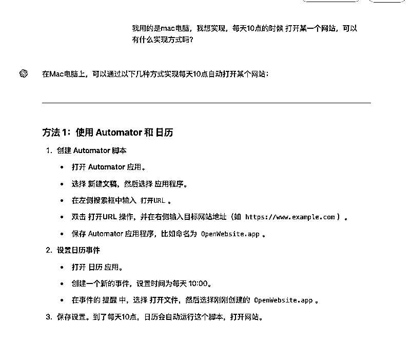

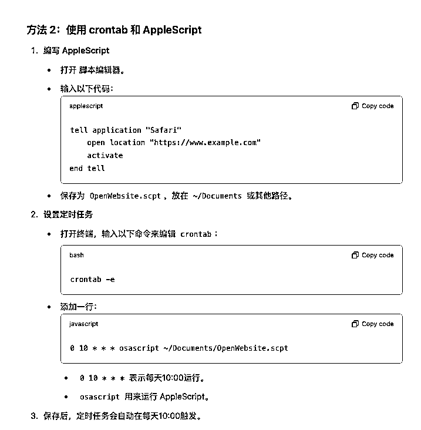

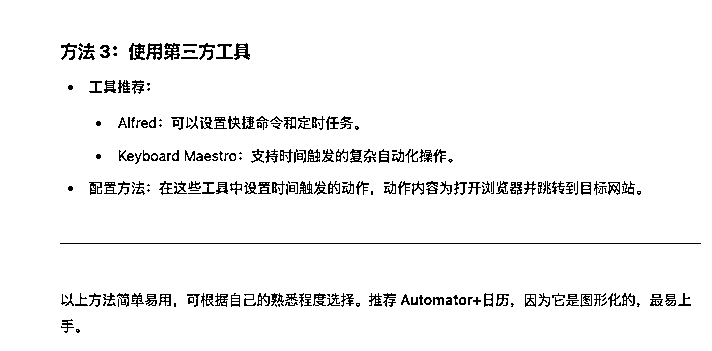

## 提需求给ai，得到解决方案

前提，我应该要写一些prompt给他角色的，但是我没有，直接上。所以学了prompt也不要给自己设限制，有时候 只要需求足够清晰，直接发问，问题也不大！

我的需求如下：

```
我用的是mac电脑，我想实现，每天10点的时候 打开某一个网站，可以有什么实现方式吗？
```

key points：mac电脑，每天10点，打开网站，告诉我实现方式

gpt给了我三种功能实现方式，我选了第一种，因为automator我知道这个东西，毕竟第二个解决方法是代码，第三个还要下载别的，有点复杂！

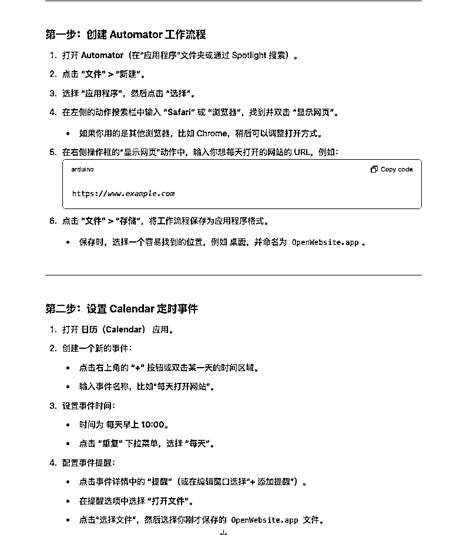

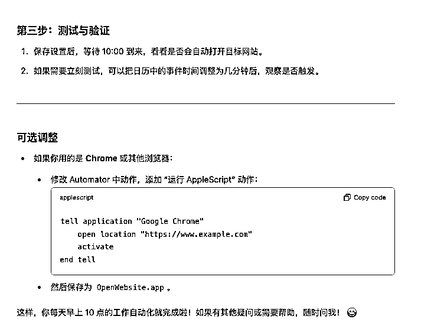

## 跟着解决方案，个性化调整，成功

告诉他，我选择方案一，让他给出更详细的步骤，然后就开始跟着他的操作指南走（因为我是英文系统，所以我让他说英文再来一遍，这样，方便我找对应的）。

### 打开automator ，新建application（程序）

command +space（空格）唤出搜索栏，输入 automator（中文版本应该也会出现）

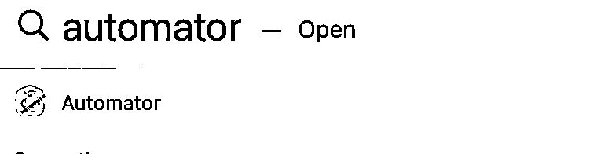

打开以后出现下面的页面，选择第二个“application”（程序），点击“choose”（选择）

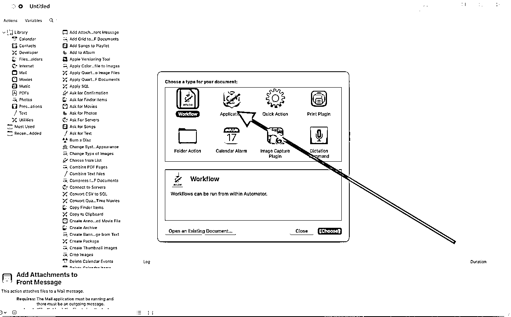

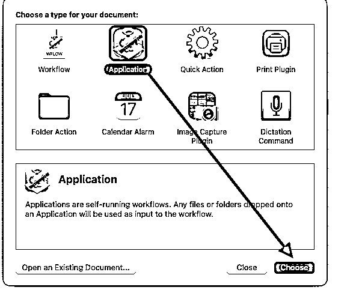

然后就进入到这个页面了👇


### 选择action，搭建工作流

在搜索栏 搜索“applescript”，得到右边的 “run applescript”（运行苹果代码）

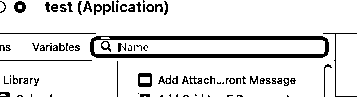

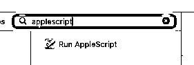

直接鼠标把这个内容拖到右边的空白区域得到下面的图

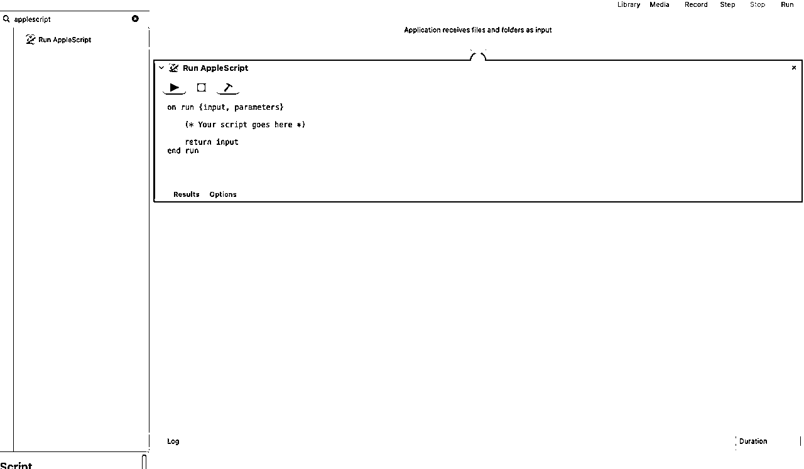

修改里面的内容为下面的部分(我的是打开googlel 浏览器)

```
tell application "Google Chrome"
        activate
        open location "https://tingwu.aliyun.com/home"
end tell
```

safari版本是这个

```
tell application "Safari"
        activate
        open location "https://tingwu.aliyun.com/home"
end tell
```

如果你有别的默认浏览器，也都可以把修改进去

网址的内容，大家可以随意更改为自己要打开的网站～

### 测试workflow（工作流）

虽然只有一步，但是也叫workflow啦～

复制进去以后，点击右上角的“Run”（运行）

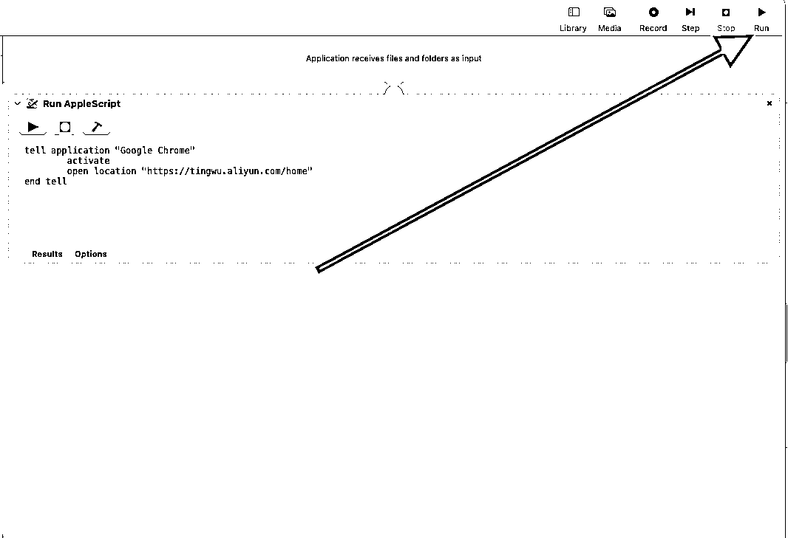

我运行完以后 直接就用google浏览器打开通义听悟的网站了，如果你第一次打开，记得登录，后面的就不会再让登录啦～

### 4.0保存为程序

鼠标滑到最顶部查看 “文件”--->“保存”--->修改名字和保存位置--->“保存”

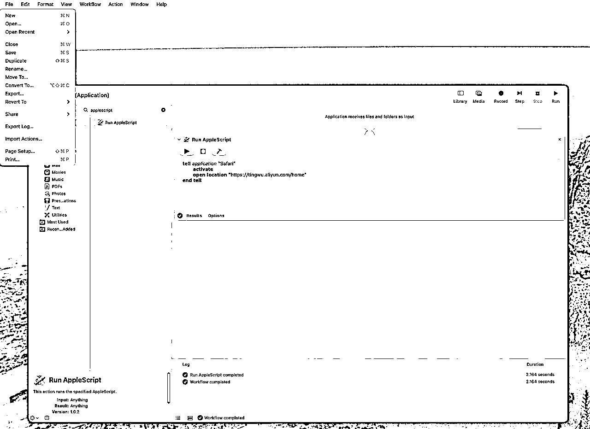

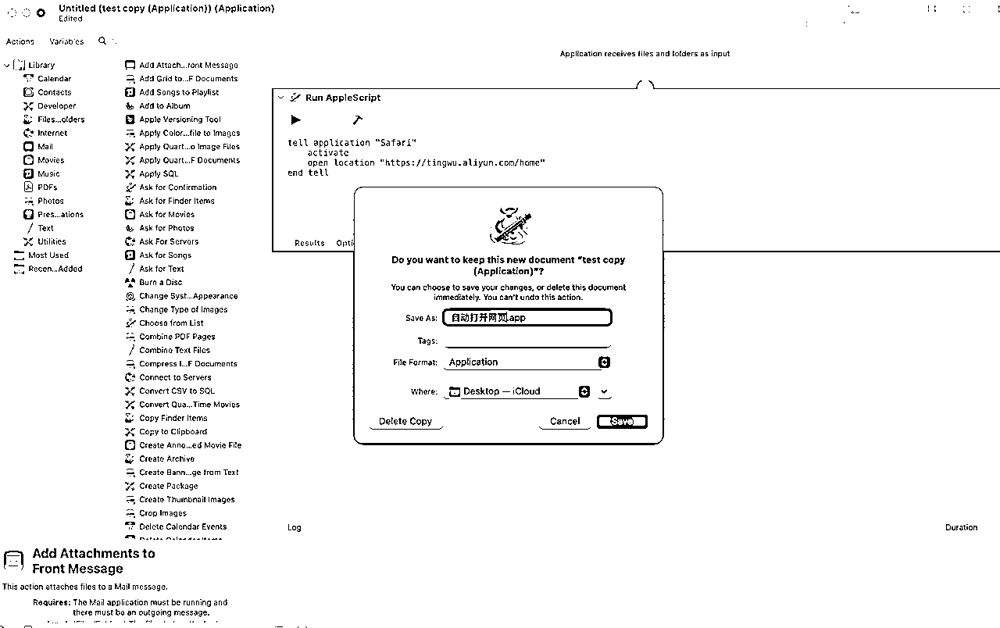

成功以后这个程序（application）就在桌面上了！

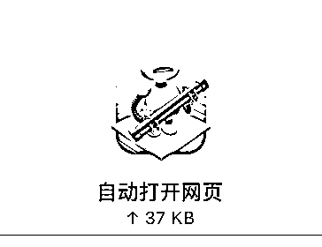

### 5.0 设置日历，固定时间打开“程序”

打开你的“calendar”（日历）--->随便再某一个日子上“鼠标右键”--->建立“new event”（新的事件）

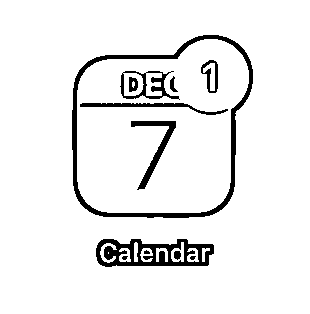

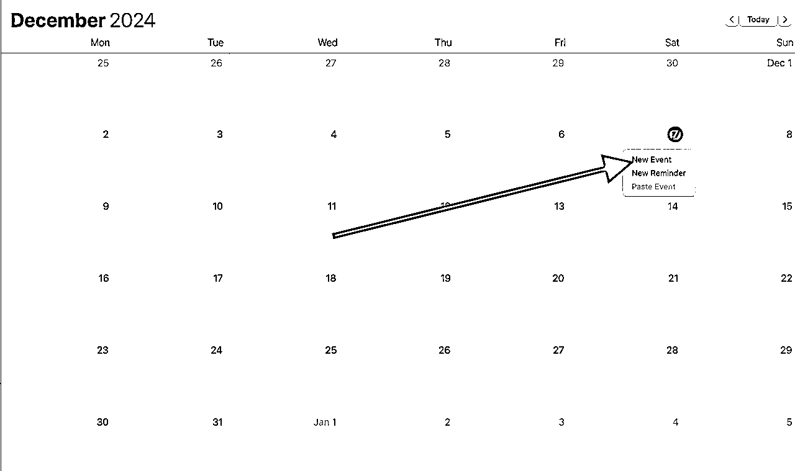

成功以后是左边的地方，输入一个你想要的名字

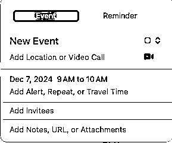

再次点击右图“添加提醒，重复....”

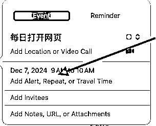

然后就得到这个画面

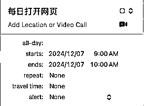

Starts：10:00

Ends：10:00

repeat（重复）：everyday（每一天）

alert（提醒）：custom（自定义）--->open file（打开文件）--->other（其他）--->选择刚刚的文件

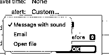

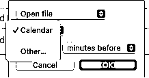


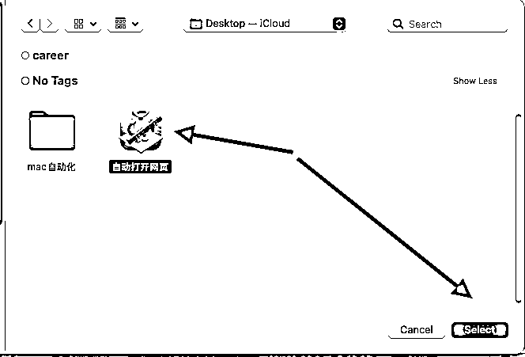

最后调整“时间”，选择 “at time of event”(事件时间)即可，点击ok（确认，就会出现这样子）

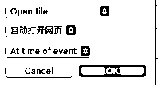

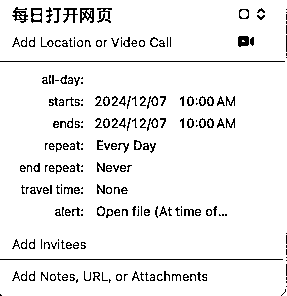

你的日历就会非常壮观！

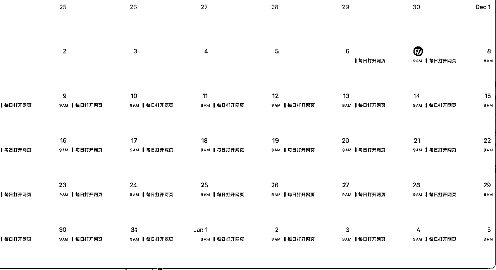

到这一步，咱们的RPA就算是搭建好了！

mac，可以很强！！！！

# 三、结尾碎碎念

很多时候，了解/知道一个工具是为了帮助我自己知道“能力边界”在哪里，虽然我自己的代码水平非常基础，但是我知道我的外籍员工（chatgpt）和新加入我团队的小伙伴（cursor）非常知识渊博。

我自己遇到了问题，有了需求，我知道XX东西可以实现，只是不知道怎么做。 这个就是知道“能力边界”的体现。只要我知道能实现，实现方式就交给更专业的人/机器/anything。

相信看到这篇文章的每个圈友，或多或少都接触过ai，用过ai，如果我们能知道“能力边界”在哪里，相信做出来的东西，可能会让自己吃惊！

哈哈哈，别吐槽如果有中文就更好了（改英文系统已经5年了，凑合看吧～）

如果你觉得不错，欢迎大家到原帖点个赞！爱你们～