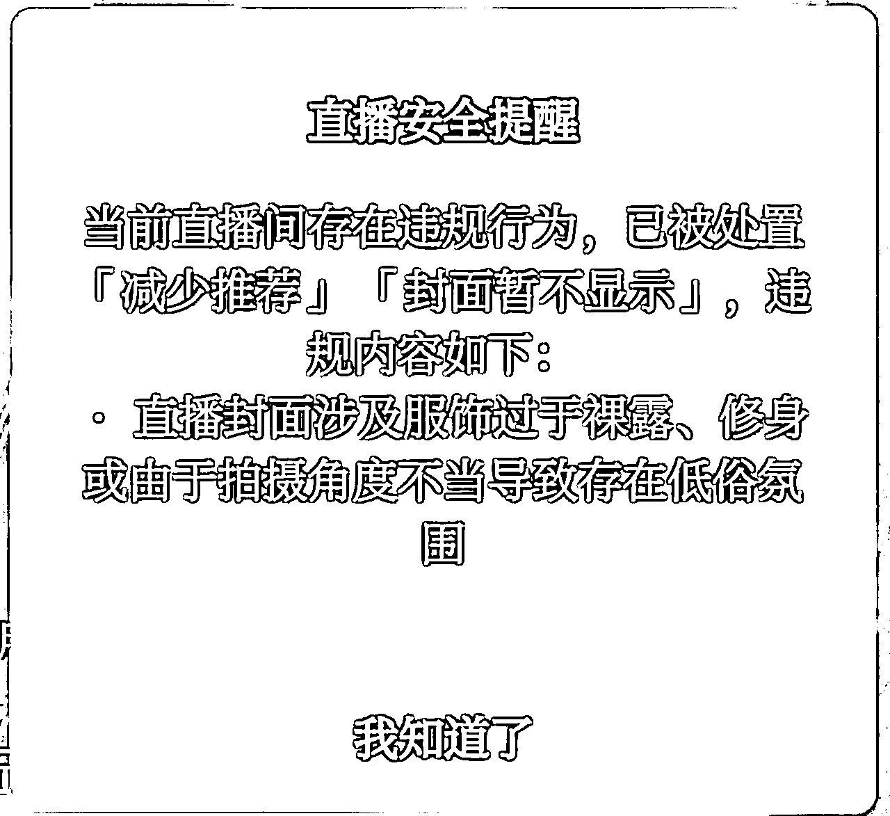

# 语音直播公众号涨粉实战指南

> 来源：[https://il1a85pj6b.feishu.cn/docx/CCrIdSlaaoKaNHxOHuRcnNprnFg](https://il1a85pj6b.feishu.cn/docx/CCrIdSlaaoKaNHxOHuRcnNprnFg)

大家好， 我是老秦，线上专注于公众号相关&副业项目实战，创业者。

# 写在前面

hi，各位好。

欢迎大家来到 语音直播公众号涨粉 项目文档。

1.一体号的回归，为视频号和公众号的结合（涨粉）提供了新的机会

2.利用一体号新风口，门槛降低，无需出境给公众号涨粉

3.本项目旨在帮助大家实现公众号涨粉，开通流量主，跑通整个流程

4.老秦免费副业星球：https://t.zsxq.com/19X6MGmeX

# 一、项目介绍

本项目旨在通过视频号抽奖活动，有效提升一体号公众号的粉丝数量。

内容全部来自各位教练，带队的实战经验，每一步都有详细的SOP指南

## 项目价值

1.快速搞定500粉，开通流量主

2.沉淀到公众号，更易触达用户

3.日更公众号引流到微信

4.跑通语音直播涨粉流程，提高认知；后面你做其它垂类直播，都可用此方法引流到公众号

# 二、数据

我这两天语音直播了四场， 直接涨粉 1000+，而且不用自己说话，轻轻松松可以给公众号开启流量主。

贴图如下：

# 三、整体逻辑

一体号给公众号涨粉的整体逻辑主要是通过视频号吸引流量，然后将这些流量引导至公众号，从而实现粉丝的增长。涨粉步骤具体为：

1.  深入了解什么是一体号， 非一体号不能语音&视频直播给公众号涨粉

1.  按规则注册公众号和视频号（已注册的直接看规则）

1.  视频号&公众号绑定，并开启「在直播中展示公众号身份」的选项

1.  发起语音&单人电台直播，设置福袋抽奖

# 四、关于一体号

## 一）什么是一体号

一体号是指将微信公众号和视频号绑定后，视频号以公众号的身份展示视频和直播的功能。这种绑定可以让用户在浏览视频详情页或直播间时，直接关注到该账号所绑定的公众号，从而实现粉丝的互通与转化。

## 二）一体号的好处

*   粉丝增长：通过视频号的巨大流量，快速增加公众号的粉丝数量。

*   内容互动：结合公众号的文章和视频号的短视频或直播，提供更加丰富的互动体验。

*   私域流量导流：将视频号的粉丝合规地引导到公众号的私域流量中，提高粉丝的粘性和活跃度。

## 三）如何开通公众号与视频号互通（设置一体号）

*   绑定账号：在视频号首页点击右上角的三个点，进入账号安全与绑定页面，将公众号与视频号进行绑定

*   开启功能：绑定完成后，需要开启一体号功能，以便在视频号展示时能够以公众号的身份出现。

注意！！注册的视频号和公众号必须是相同的管理员（微信）才行！

具体见下方实操步骤。

# 五、视频号注册

注意！！注册的视频号和公众号必须是相同的管理员（微信）才行！

开通（创建）视频号

1.  打开微信，点击【发现】-【视频号】，进入视频号界面。

1.  在右上角找到人像图标，点击它进入设置页面。

1.  点击【发表视频】的选项，开始创建视频号。

1.  设置视频号的基础信息，包括名称、简介、头像等。

1.  如果需要，可以进行视频号认证（选填）

1.  完成以上步骤后，你的视频号就成功开通了。

# 六、公众号注册

注意！！注册的视频号和公众号必须是相同的管理员（微信）才行！

注册公众号个人账号两个途径，「电脑端注册」 「手机端注册」。

## 一）手机端注册

1）实验步骤

1.下载「订阅号助手」APP

2.选择微信登录

3.右上角，选择「注册订阅号」按钮

4.输入手机号+验证码，注册，填写合规的名称+头像

下面贴一下图片流程：

## 二）电脑端注册

1）电脑端直接登陆微信公众号开放平台 注册即可。

2）选择注册类型就是订阅号

填写基本信息，手动激活邮箱，输入收到的邮箱验证码，自己设置一个登录密码。

邮箱账号一定要牢记， 以后登录公众号会经常用， 如果密码忘记了也是通过邮箱来找回的。后面的就是一些常规操作了。

3）填写基本信息，选择个人，然后填写个人身份信息，手机号等。手机号码验证，绑定管理员身份。

4）设置自己的公众号信息，头像、昵称、简介等。

# 七、视频号&公众号绑定，涨粉互通

开通直播涨粉需要两步：

1.  视频号&公众号绑定

1.  开启「在直播中展示公众号身份」的选项（涨粉互通）

注意！！注册的视频号和公众号必须是相同的管理员（微信）才行！

绑定前建议确认后

## 一）视频号&公众号绑定

### 1、手机端绑定方法（建议用此方法）

1\. 打开微信，进入视频号主页。

2\. 点击右上角「…」，进入「账号安全与绑定」。

3\. 点击「公众号」，选择需要绑定的公众号进行绑定

### 2、电脑端绑定方法

1\. 打开公众号后台。

2\. 点击左下角公众号。

3\. 点击「账号详情」。

4\. 找到视频号一栏，点击「绑定」，跟着操作即可。

绑定后2小时内可以更换绑定，但2个小时后，直到14天内，无法更换绑定。

## 二）开启「在直播中展示公众号身份」的选项

*   开启条件：确保视频号与公众号已绑定（上面步骤完成），并满足视频号和公众号是相同的管理员。

*   操作步骤：

*   进入视频号页面，在右上角找到人像图标，点击

*   在右上角找到「设置」，进入

*   滑到底部找到「账号安全与绑定」

*   选择「公众号」

*   找到已绑定的公众号，并打开「在视频和直播中展示公众号身份」的按钮

必须保证公众号管理员和视频号管理员主体要一致才行！否则打不开的！

这是最最核心的步骤，这块不开，公众号无法涨粉

这是最最核心的步骤，这块不开，公众号无法涨粉

这是最最核心的步骤，这块不开，公众号无法涨粉

重要的事说三遍！

# 八、发起直播

先说下两个重点：

1.每天直播次数：没限制 。 建议 2 次内 。 每次 1 小时以上

2.开播一会没流量怎么办？

先挂在那，什么都不用管 。没流量，也不影响，推流不可控。

下播后先看SOP中的【直播异常查询】自查，没问题的话， 下次继续播。

我们选择手机端开播，操作步骤如下：

## 一）直播选择&设置

### 1、视频模式（推荐）

先来看一下视频直播的效果

一张背景图，关闭摄像头+静音， 开播，效果比语音直播强很多 。

用视频方式直播，可以修改背景图，禁音麦克风后，可以继续播放背景音乐，所以非常推荐。

*   打开微信，点击【发现】-【视频号】，进入视频号界面。

*   选择「发起直播」，点击「直播」

解释：

1.选择【视频·竖屏直播】

2.选择你要的封面，也会成为直播间的背景

3.写本次直播的主题，随便写什么都行，只要不涉嫌引流就行

4.选择直播的类目

5.关闭摄像头

这里有两个问题。

1、如何修改分享直播间的图片样式 ，如下图

修改发起直播时的封面就可以

2、视频直播的图片不清晰

开启视频直播后，选择【文件演示】

把你提前准备的图片贴上就非常清楚了哈。

对了，你准备的图片清晰度也要高呀

关于如何生成高清图， 老秦在SOP末尾提供方法。

### 2、语音模式

点击语音直播切换到语音直播模式。

### 3、各种参数设置

#### 1）画面设置

主要是关闭摄像头

#### 2）音乐设置

如果是首次直播别忘了配置 音乐， 点击音乐按钮，选择背景音乐

选择自己喜欢或者适合的音乐， 点击右上角的+号去添加音乐，记得把音量调到最大。

#### 3）福袋设置（抽奖）

也就是设置福袋，开播前可以提前设置好抽奖（直播后添加即可），也可以开播后设置。

可以送一些小心心，棒棒糖等都可以。

*   礼物不在多，我经常是送2-5个小心心

*   开奖时间 我一般是15分钟，前期推流多时间可以设置偏短一些， 后期推荐或者推荐少了，可以设置为15分钟。

*   用户参与方式 ： 必须选择【关注主播】

#### 5）开始直播

点击开始即可直播， 成功开播后选择音乐播放+发起抽奖。

如果你视频号没有认证过，会提示如下：

点击【实名信息认证】,同意授权

认证后即可开播。

#### 6）设置静音

直播默认是开启麦克风的，因此直播一开， 第一件事就是关闭麦克风。

*   直播中选择右下角如下按钮， 点击

一切都设置好后， 正常直播，福袋开奖后， 继续发起抽奖，依次循环。

## 二）开通粉丝团（必要）

开了别人才能送你粉丝灯牌

1.  进入视频号：打开手机微信，点击底部的“发现”选项，然后选择“视频号”进入

1.  发起直播：在视频号界面右上角点击“人物图标”打开个人中心页面，然后点击右下方的“发起直播”进入直播发起页

1.  创建粉丝团：

*   在直播界面右上方，点击并排的“三个小圆点图标”。

*   在弹出的窗口中，选择“粉丝团”。

*   点击“创建”按钮，完成粉丝团的创建

## 三）开启送礼物

# 九、账号异常查询

如果视频号直播，没有推流， 整场下来， 个位数的观看人数，那肯定是异常了。

分享四种自查方法。

## 一）视频号账号诊断

视频号--->个人中心--->账号诊断

看账号的信用分

有扣分可查看具体的违规详情

注意：诊断100分不代表你账号没问题， 有的账号是隐形违规， 继续下面的操作。

## 二）看视频号私信

视频号主页--->视频号私信--->视频号团队

看是否有直播处罚的通知。

## 三）账号加热测试（推荐）

视频号--->选择「发起直播」

进入后，选择「更多」

选择「直播加热」

如果账号异常会提示违规，如下：

证明你的账号现在处于隐形限流的状态， 需要停播3天， 3天后再尝试，如果不弹异常消息， 说明直播间正常了，可以正常开播。

通过前三条，基本上可以处理好直播异常的问题。第四条是老秦之前遇到过的， 也贴出来。

## 四）看账号是否异常

视频号主页--->创作者中心

选择 加热工具

找到原因了， 显示账户异常无法加热

原因就是因为我长期不发视频导致被判定账号原创度低， 直接限流了。

于是我马上发布了一条短视频， 然后直接点击 【我的账号】 去申诉。

填写一下申诉理由。

一天后申诉通过， 短视频 直播 流量都正常。

# 十、几点建议

## 一）公众号与视频号主体一致， 但微信管理员不一致，不能实现给公众号涨粉

提示如下，不能开启「在直播中展示公众号身份」， 不能给公众号涨粉

## 二）公众号与视频号主体不一致，无法互绑定

## 三） 直播无人进，无法转发直播间，并提示：“已设置私密账号”

需要把视频号内容公开可见即可。操作步骤如下：

1.  打开视频号主页

1.  进入设置：在视频号主页，点击右上角的三个点图标，选择「设置」。

1.  选择「谁可以看我的视频号内容」

1.  选择「公开」这样所有人都可以看到你的视频号内容

## 四）关于提高转化问题

我统一说一下， 关于如何如何提高转化问题

说几个可行的操作

1.调整背景图（健康，非引流）

2.调整开播时间点

3.直播主题，填写加上领福袋

对于其它的操作，例如静态背景改为播视频，或主题写送xxx资料等等

老秦都不建议

这是个轻量的项目， 核心还是要【稳】，这种公域平台，算法一直在变

你的”创新“操作，非常容易违规和限流

这么稳下去， 做的越久，涨粉越多 ，越香呀

有人反馈， 同样的直播内容/背景/实操方法以及直播时间点，为什么有的人涨粉多，有的人涨粉少

玩过抖音快手的人都应该了解， 有个抖加加热短视频/直播间

可以通过抖加付费推流，推荐人群也可以选择， 有喜欢转发的，有喜欢点赞的，有喜欢点关注的

很简单，他的直播间进来的是喜欢参与的抽奖的那一批人

关注率就是高

方法没问题， 你只要坚持播， 肯定也会有涨粉多的一天，勿急

## 五) 两个常见问题（必看）

1.每天直播次数：没限制 。 建议 2 次内 。 每次 1 小时以上

2.开播一会没流量怎么办？

先挂在那，什么都不用管 。没流量，也不影响，推流不可控。

下播后先看SOP中的【直播异常查询】自查，没问题的话， 下次继续播。

## 六）开播前，视频号的个性签名等地方不要留引流信息

## 七）封面图不要设置穿着暴露的人

## 八）直播间封面侵权违规

# 十一、如何生成超清背景图

这里老秦推荐即梦AI，地址如下，也可下载移动端app

https://jimeng.jianying.com/ai-tool/home

选择图片生成

配置图片

点击立即生成，生成后， 选择合适的配图，双击进去

选择HD超清

生成超清图后，不要直接选择下载， 直接下载有水印，选择【去画布进行编辑】

进入后，选择右上角的导出， 图片超清无水印，完成

# 十二、百问百答库

### Q1：怎么看福袋或者其他的支出?

步骤操作：

1.  进入视频号：在微信的底部导航栏中，点击“发现”选项，然后选择“视频号”进入。

1.  访问创作者中心：在视频号页面，点击右上角的头像，进入个人中心。在个人中心页面，点击“创作者中心”

1.  查看直播抽奖记录：在创作者中心页面，点击“更多”选项，然后选择“直播抽奖记录”。在这里，您可以查看自己发布的福袋数量以及相关的抽奖记录。

### Q2：苹果手机充值微信豆

微信直冲（1元钱10个微信豆）

否则苹果充值1元钱只有7个微信豆

https://webeans.url.cn/mobile/pay

### Q3：什么时间段直播人气比较高？

答：早上 6-7 晚上凌晨后，每次至少45分钟以上，效果更好些

### Q4：直播背景可以更换吗？能在直播间打字引导关注吗？

答：视频模式可以更换直播背景，语音不可以；

直播过程中，不要引导关注， 引导性质的文字，图片，主题，都不要加

### Q5：播了25分钟被弹框2次断播，平台给的违规证据是放歌的时候，画面没有任何文字。不知是否是公众号上的简介问题？

答：如果视频号上有微信号、一些行业词汇等，会被平台判定引流，先把微信号删了，可以正常直播。

### Q6：请问一天最多可以播几次为宜？多播几次影响大吗？

答：建议 1-2 次 时间间隔开；开播次数多会影响账号

### Q7：可以在公众号推文中插入直播预约吗？我看好多大号的文章里有插入？

答：可以，但这种语音直播，不建议

### Q8：直播时可以挂公众号文章吗？

答：不需要挂，别创新，按 SOP 操作，已经验证的 SOP，去执行就好

### Q9：视频好没有发布内容，需要发布吗？

答：不需要，直播先玩起来再说，发短视频违规就GG

### Q10： 直播中途才打开“在直播中展示公众号身份”需要重新开播吗？

答：不能在直播切换，重新开播，一定要直播前设置好

### Q11：是要一直有福袋挂着吗？需要我主动派发吗？

答：15 分钟一次，中间间隔影响也不大，具体看直播间人数，中奖后会自动派发，本人不需要操作中奖事宜。

### Q12：开直播的手机微信号是不是得跟公众号注册的主题一致?

答：主体一致， 管理员微信也一致

### Q13：开了一体号是只涨公众号粉丝，视频号粉丝不涨是吧？

答：一次只能一个身份涨粉