# 闲暇时间从0粉新号，一个月跑通抖音短剧

> 来源：[https://mvh6uii5p7e.feishu.cn/docx/MlWddFhNeozTwwx8cizcfCAZnnf](https://mvh6uii5p7e.feishu.cn/docx/MlWddFhNeozTwwx8cizcfCAZnnf)

生财圈友大家好，我是唐杰，距离上次分享快手聚星时隔一年多，今天分享一下抖音星图短剧一个月时间，从一个新号变现10来万的玩法。

加入生财这2年当中从一个小白到过手15＋个实战项目

有了自己1家公司，同时还组建了3个合伙分公司

很多朋友见证着我这一路的成长

也感谢成长路上朋友们不惧风雨携手同行

同时感谢生财提供的平台让信息更加透明化

从快手聚星，视频号分成，tk基金这些项目到抖音星图，感觉到还是在抖音上赚钱比较舒心

时间有限废话就不多说了，如今浮躁的气息不如让实战来熄灭它

直接上一部分图，这是我最近一个月做出的效果，变现了10来万

百万播放基本上每个号都会有，转化率万播在100元上下浮动

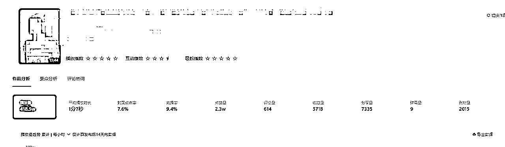

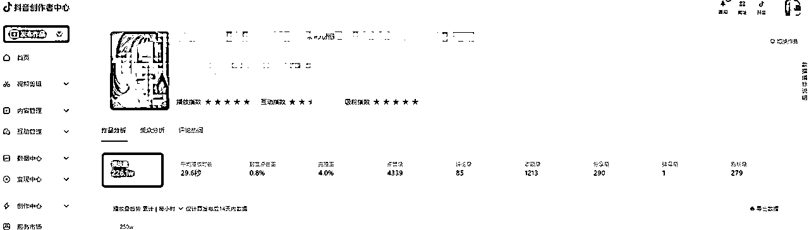

完全是从0粉新号开始上手操作，一个视频收益几万是庭常见

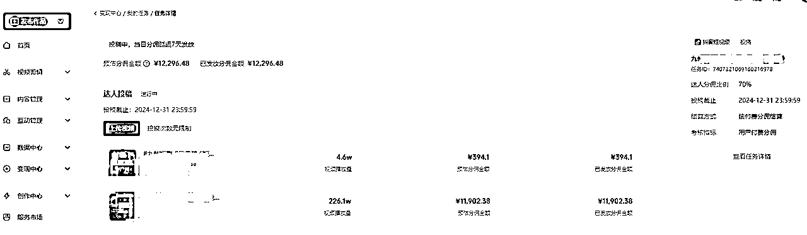

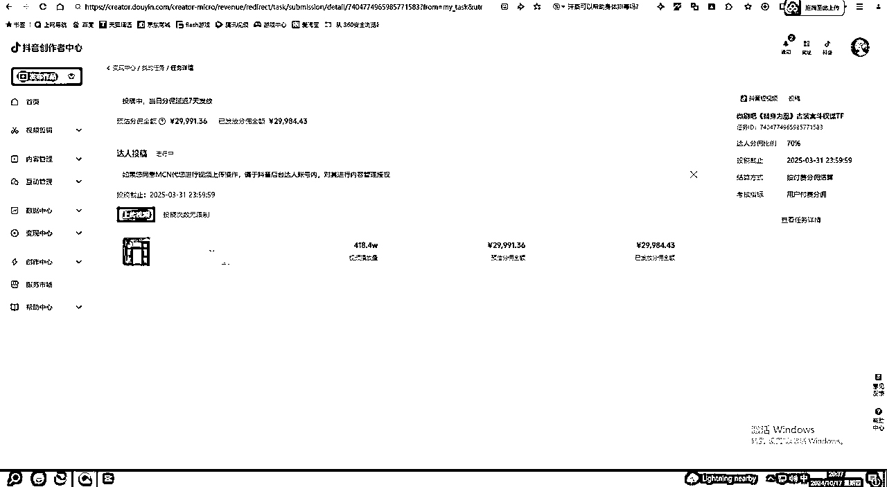

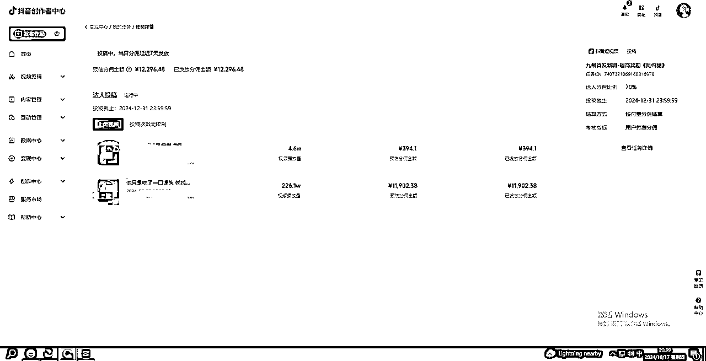

# 一、机缘巧合

这个项目起因是我朋友在做，5月份的时候就喊我做没做，因为当时5.6月玩的是搬运，感觉不会有大收获就没放在心上

后边再见面说起来他当时一天收益在5万左右，我有点不可理解，搬运？平均一天5万？什么概念？我电商部一天所有的GMV都不到5万，他这是纯利5万！

在三讨教下我利用闲暇浅试起了第一个号，发了6个作品就爆了，虽然这条作品转化一般，但是反馈快的我反应不过来

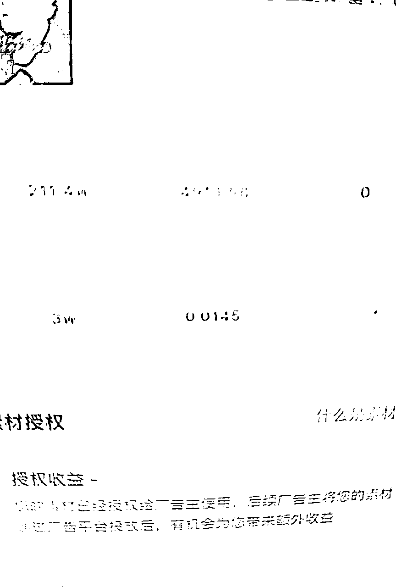

其实之前短剧这个项目极其不看好的，感觉这个项目就是推广没什么太大浪花，在实操之后真的是哐哐打脸

整体来说这个项目门槛还是比较低的，千粉即可做，也不用大投入，一台手机，一台电脑就可以执行起来

回报率目前来说还是很可观，跑通速度也够快

唯一的缺点就是耗时间，制作一个作品下来大约要2个小时左右

但是付出和收益还是成正比的

# 二、机会都在实操中

确定放大做这个项目时

我特意邀请了2位执行力在线的朋友还有一位合伙人一块做这个项目

再次测试一下这个项目是运气还是实力做出的结果

基本都做出结果了

不管怎么样，没有空军说明是个好营生

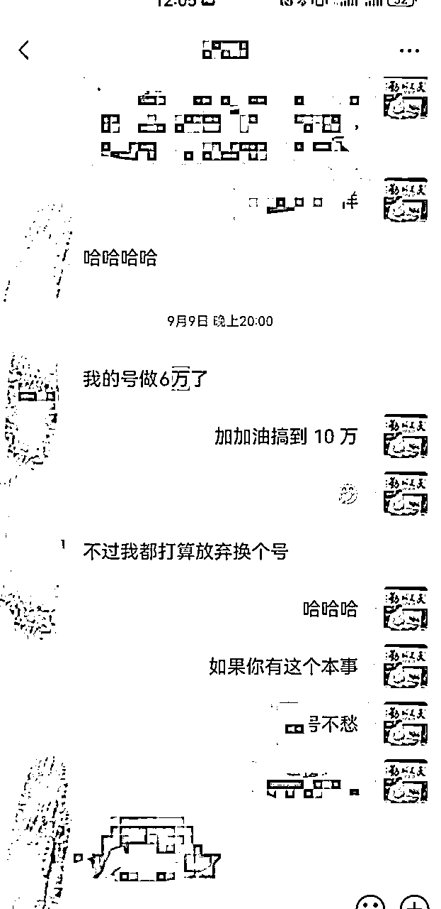

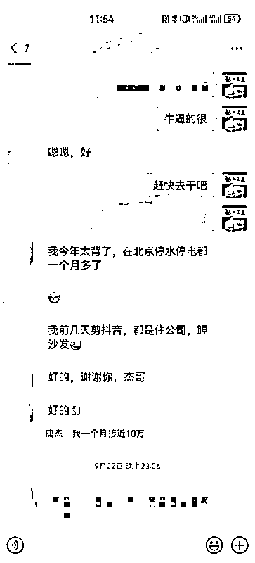

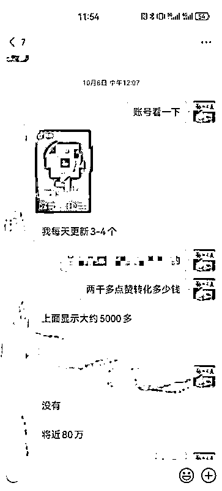

看到了这个反馈效果立马找合伙人单独开一个星图短剧工作室，设备迟迟的才到一部分

# 三、技巧决定高度

为什么要做抖音星图短剧？

1、可以星图可以做到多实名，不受实名拘束

2、抖音星图分佣高达70-80%

3、抖音目前打压非站内链接短剧的同时抖音也在扶持星图短剧的流量

本身短剧流量就很好，加上官方流量扶持，这就是新号基本都能爆的原因

这里就不过多叙述这些信息了，想要了解更多看下星图官方https://creator.douyin.com/creator-school

我们把时间，重点来了解这个项目的打法

其实这套玩法跟我上半年做影视解说带货基本是差不多的逻辑

# 项目底层逻辑

### 使用爆款开头视频+洗爆款文案+混剪视频素材

抖音自始以来都是抄抄，如果你没有文案功底，最简单最直接的就是抄，这也是我们现在使用的方法

1、开头使用爆款的开头视频+洗爆款文案

爆款的开头视频：

在抖音跟爆款跟热点是这几年一直不过时的玩法，别人爆过的视频，你再抄他的爆的几率会很大，这里说的抄，不是直接去水印使用同行的视频，而是在剧方的原素材里重新找到这些镜头进行二剪。

我们是做的5-20分钟的短剧视频，视频爆不爆开头是至关重要的，在没有创作力的情况下只能接受上天赐予，对同行下手

切记开头前5秒非常重要，尽量跟爆款视频一样，相似度达九十左右，因为爆过的有爆过的点，可能稍加改动，这个点就没了。

洗爆款文案：

文案必须要洗，主要是规避抖音的检测，用一模一样的文案也可以，但是流量一旦大了有概率被人工判同质化

2、后边内容利用混剪手段进行去重

只要开头做的没问题，后边的混剪内容把故事剪流畅即可，要让人看懂视频是什么剧情即可

我们看这个剧，榜单上5个视频有两个开头视频是一样的，只是文案轻微修改了一下

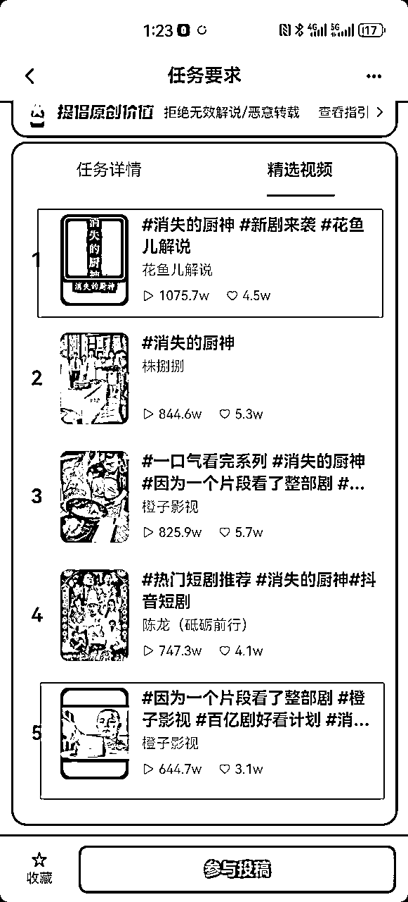

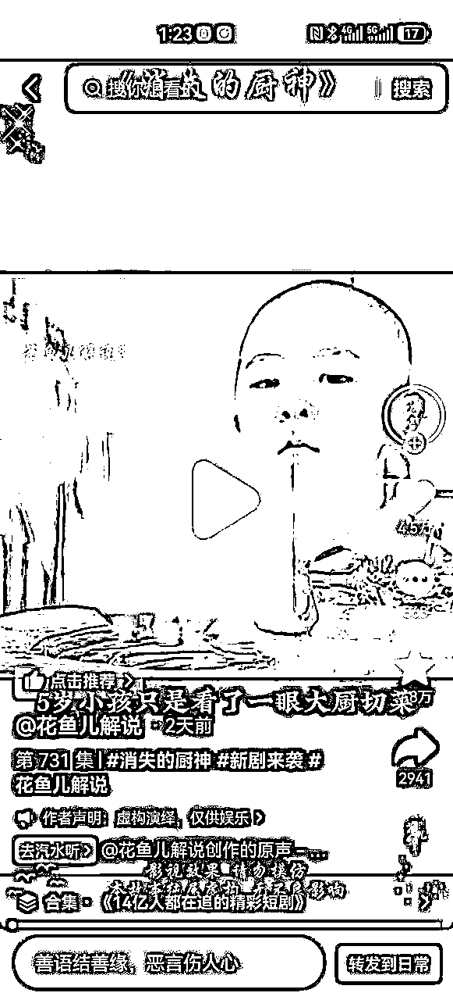

↓↓↓看一下爆款视频会更有感觉↓↓↓

前20秒的视频画面是一模一样的（滤镜画面大小镜像除外）

前20秒-2分钟的视频画面相似度有差异

2分钟后的视频全是混剪内容（无解说），因为每个人剪辑剧情都不一样，这就很好的达到了去重效果

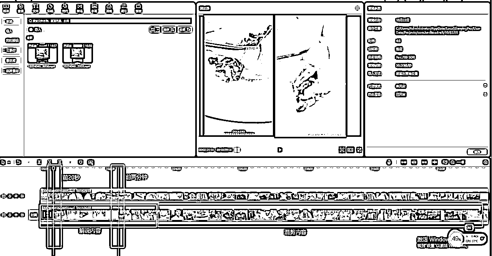

为了更好理解，我做了个表格，这样更加清楚视频脚本是什么样的，按照视频脚本下来不会判搬运，我们发出几百个视频一点事没有，就是100个人抄同一个爆款发出来基本也不会被判的，因为每个人的剪辑思路都不一样，选的片段不一样，所以放心大胆的剪就行。

有的可能就开头一段解说，有的全程解说，也有的一会解说一会混剪

总之这个模板举一反三，目前全程解说比较少，基本是开头解说后边混剪

# 四、正文开始

## 1、星图短剧如何接单

#### 1.1、账号1000粉500有效

星图开通短剧任务需要1000粉500有效，这1000粉不要求粉丝画像

这个太简单，满大街的渠道可以满足

或者用涨粉素材涨粉几条素材就涨够1000粉

#### 1.2、星图如何接单

第一步、点三条杠

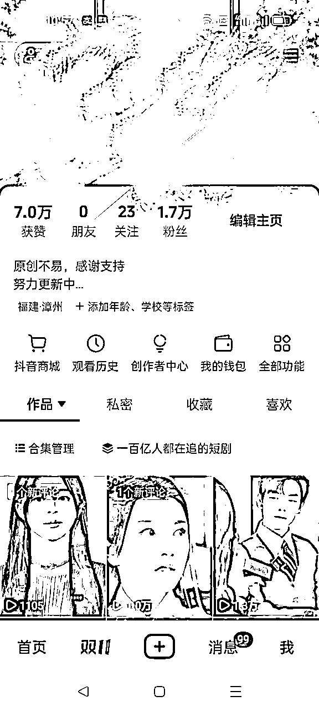

第二步、点创作者中心

第三步、点星图商单

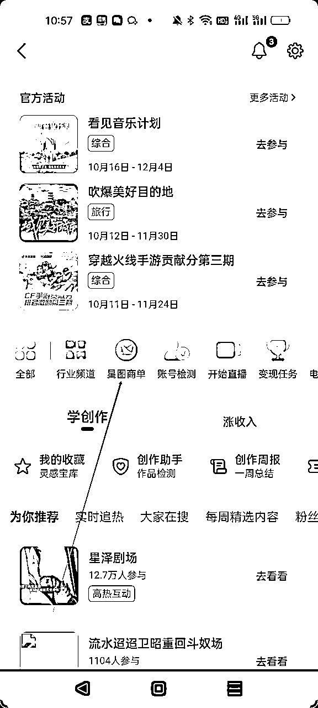

第四步、点短剧频道

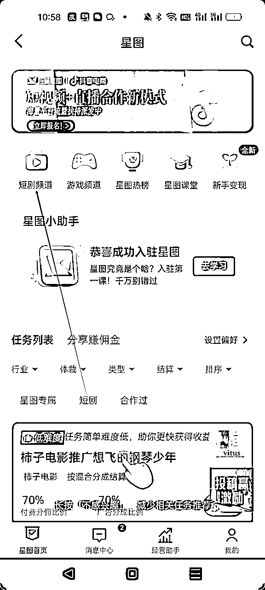

第五步、搜索要做的剧名

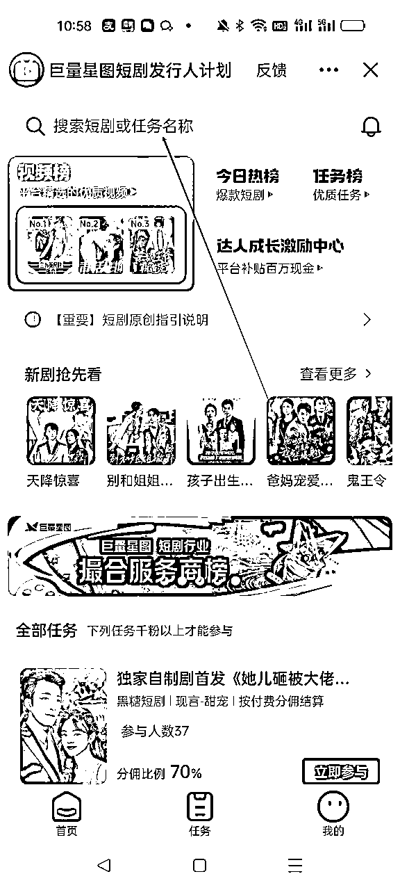

第六步、点参与投稿

第七步、领取视频素材

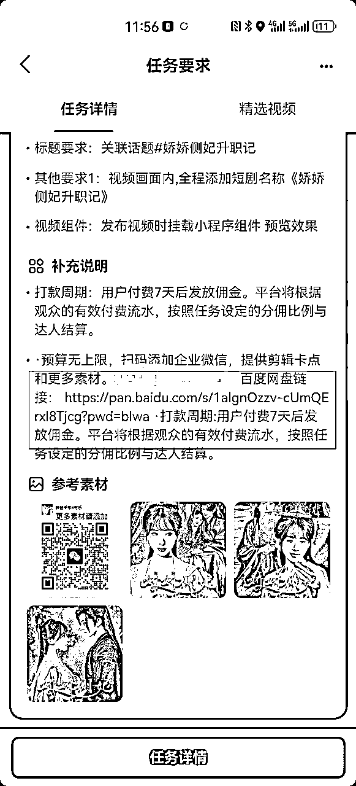

## 2、选剧

做短剧爆不爆的概率跟你选的剧有很大的关系

相似于带货，七分选品三分运营

做短剧也一样，选到一部好的短剧流量是非常大的

现在大小剧场几十个，每天上新的短剧也有几十部，根本剪不完的

基本分为男频、女频，我们主要看参与达人数和已付费人数

好的剧已付款人数基本是参与达人数的三倍，这种转化是很好的

例如下边这个剧

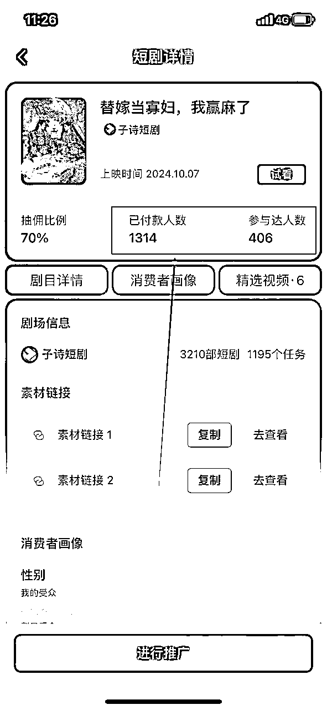

选好剧，接下来准备文案

我们打开抖音搜这部剧按照最多点赞一周内发布，找到比较不错的解说视频

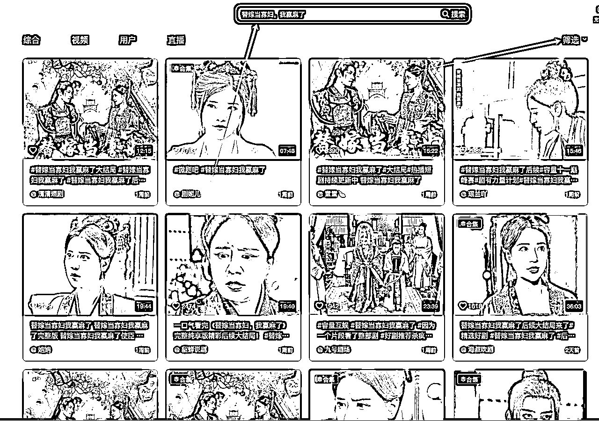

## 3、文案

#### 3.1、先去水印再用飞书妙记提取文案

##### 手机去水印：

https://api.peiyinshenqi.club/u/mKbVZ

##### 电脑去水印：

哼哼猫是收费的，如果不想花钱，用上边的小程序用电脑微信打开一样用

#### 3.2、把下载好的视频用飞书进行提取文字

打开飞书-点开工作台-点开飞书妙记

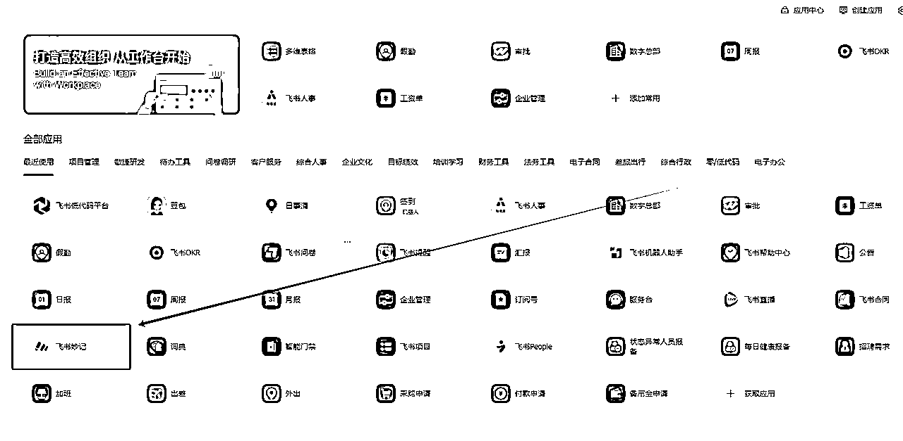

#### 3.3、把视频拖进去进行字幕提取

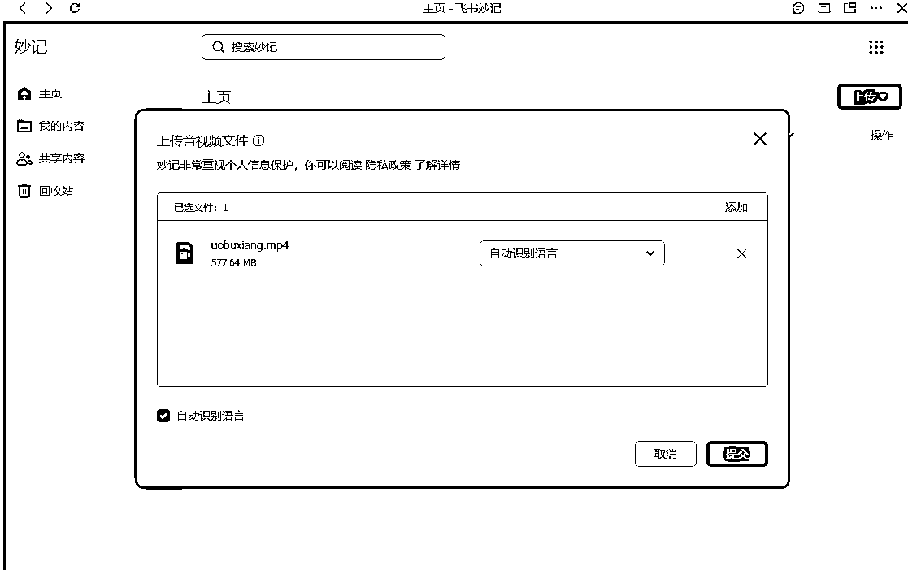

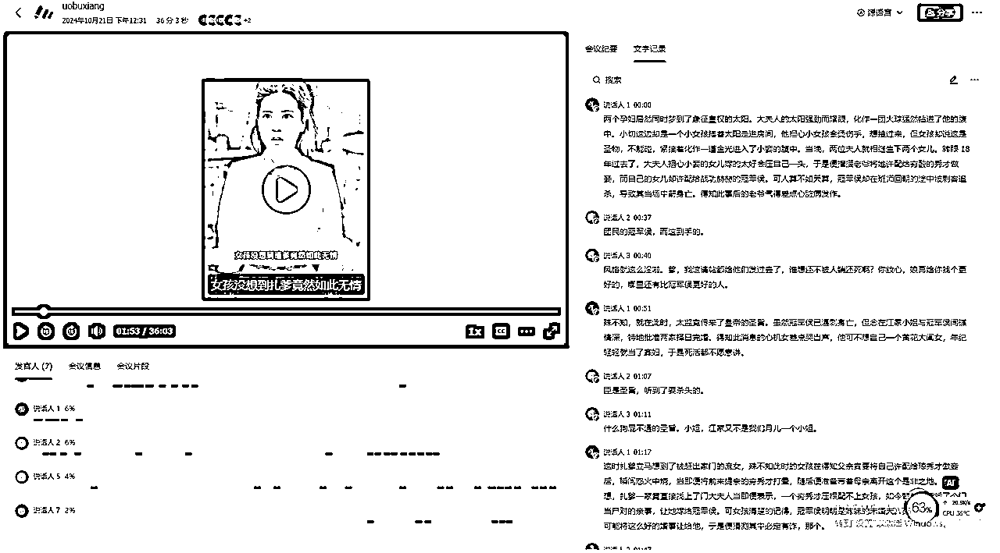

#### 3.4、飞书妙记能识别出每个人的说话的文案，我们只需要把解说的一部分文案复制出来就可以，一般就是开头的几句话

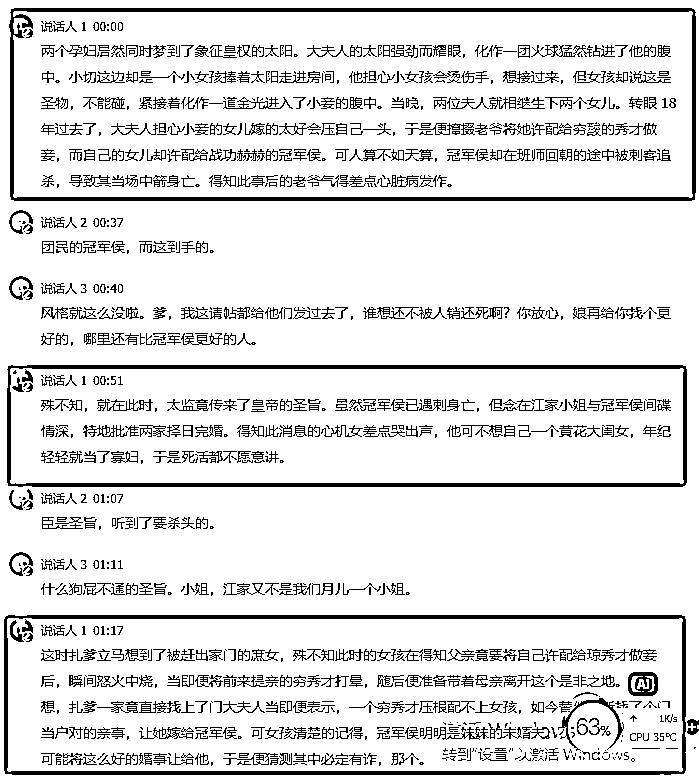

#### 3.5、把每一段的文案用11112222333344445555数字间隔开，有利于后期剪辑使用

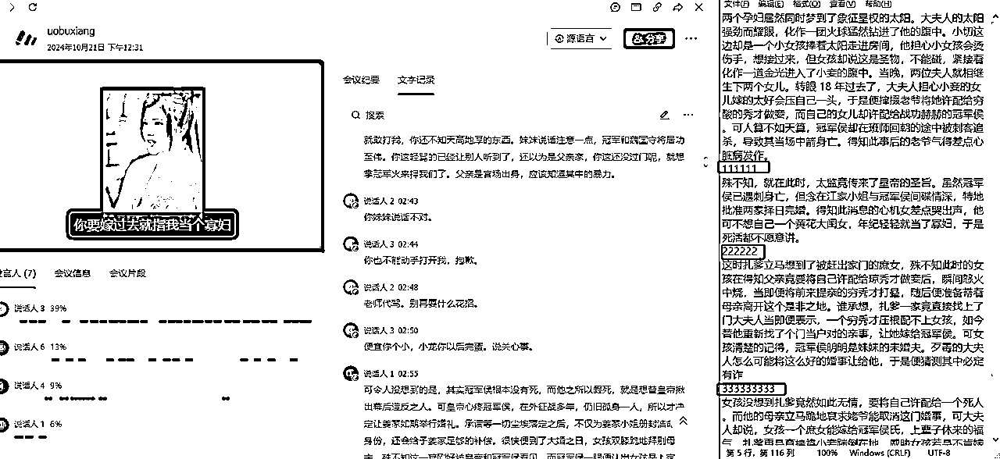

## 4、洗文和配音

# 洗文工具

豆包：https://www.doubao.com

先把原文案复制进来，最后加上：以上是一篇短剧解说文案，要求内容丰富多彩，剧情简单明了，框架重新组织一下，意思不能变，参考抖音爆款影视的提示词

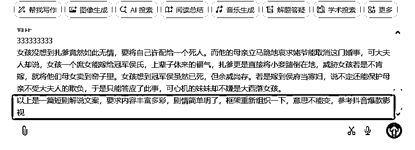

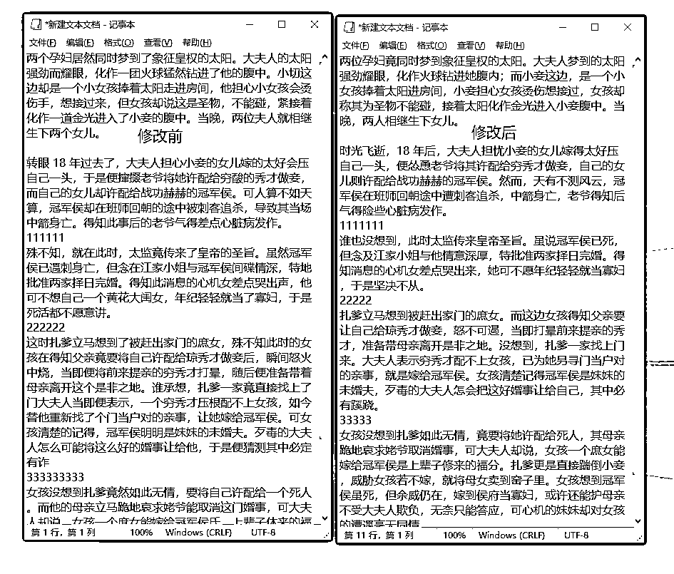

# 配音工具：

配音神器：https://api.peiyinshenqi.club/u/mKbVZ

这一步很简单一共就5步

打开工具-点击制作配音-复制进文案-选择声音-导出mp3格式

## 5、剪辑

#### 5.1、先把剧场提供的原素材2倍速看一遍，了解剧情内容，这样剪起来更加顺手

#### 5.2、把配音拖进剪映进行裁剪

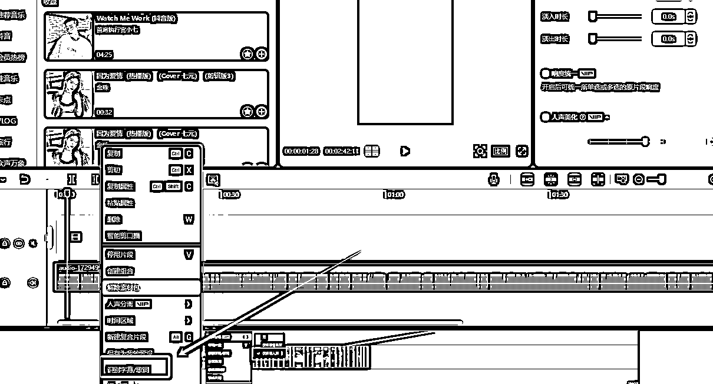

识别完以后找到我们开始标记的11112223334444进行把配音分割，把带有111222333444555的声音切割删除，只保留有用的配音

修改好后把字幕删掉

再把剧场的原视频素材拖进来

#### 5.3、视频拖进来后先把视频背景音去掉只保留人声

把视频全部选择点右键选择人声分离-选择仅保留人声

#### 5.4、加上一个合适的BGM

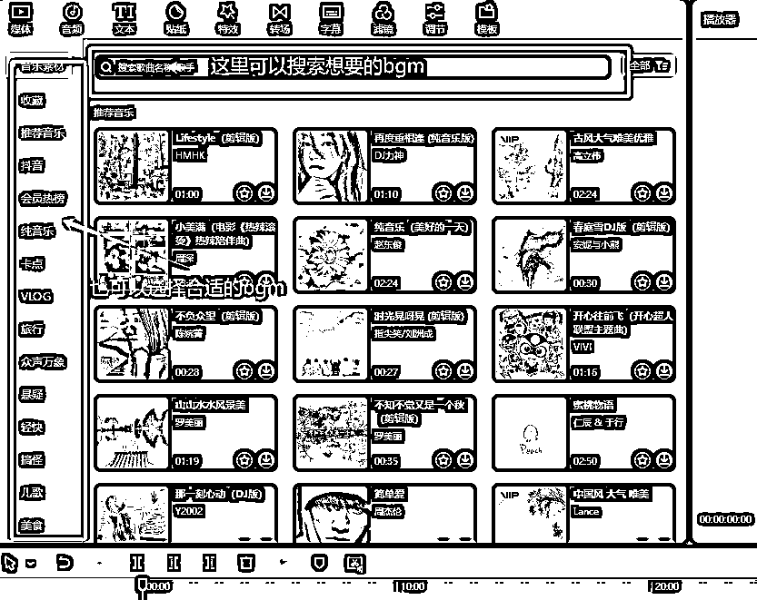

#### 5.5、以上步骤准备完了开始剪辑

剪辑：

1、配音部分需要音画同步，配音在说什么，画面要出现配音中提到的相似场景

2、切除多余的废话，无用的镜头，包括视频气孔间隔带

3、把故事线剪的更短更密集

4、多加点转场特效

整个剪辑方向主要分三块

*   开头20秒内

黄金开头爆款怎么剪的就怎么剪

*   前2分钟

这一部分基本在解说，要把剧中的爆点尽量安排在开头，人物关系，事情起因，在2分钟左右内给叙述明白，可以跟对标照葫芦画瓢但是不能一模一样

*   后边部分

主要想要这部分能体现出什么故事情节，故事情节取决于我们怎么剪，你乐意把主角剪的很坏也可以剪的很好，主角的塑造自己说的算，顺着故事线剪下来就行

100个人能剪出100种样子所以说大胆剪，不会判搬运的

注意：

尽量剪的碎一点，越碎同质化越低，推流越好，但是不要把剧的意思剪的乱七八糟的

剪好的半成品是这样

主视频，配音，bgm，转场都调好

#### 5.6、提取字幕

剪好后导出，进行提取字幕

提取字幕工具https://pan.baidu.com/s/1akXN4lB5N2fUEmUIHJU_7A?pwd=6666

软件里有教程，根据教程安装操作就可以

5.7、遮挡原字幕

①选择主轨道上任何一条视频

②点击蒙版

③选择矩形

④点击反转

把这个蒙版调到能覆盖字母的地方

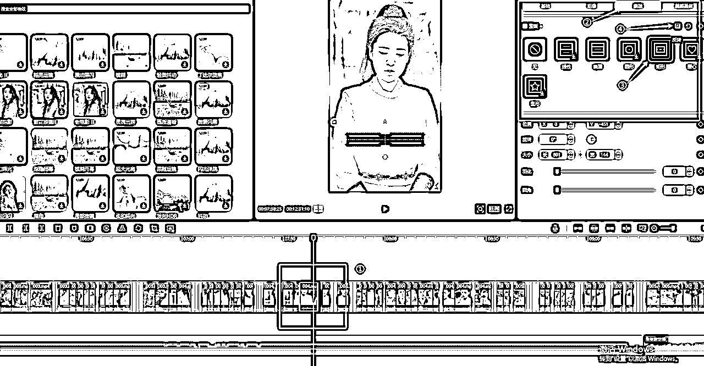

⑤选择刚才的视频右击复制属性点基础

⑥往下拉点击背景选择模糊

⑦右击这个视频复制属性

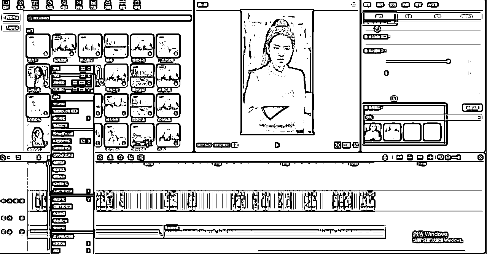

⑧全选主轨道的视频右击点粘贴属性

⑨粘贴

这样视频上的字幕就遮盖住了

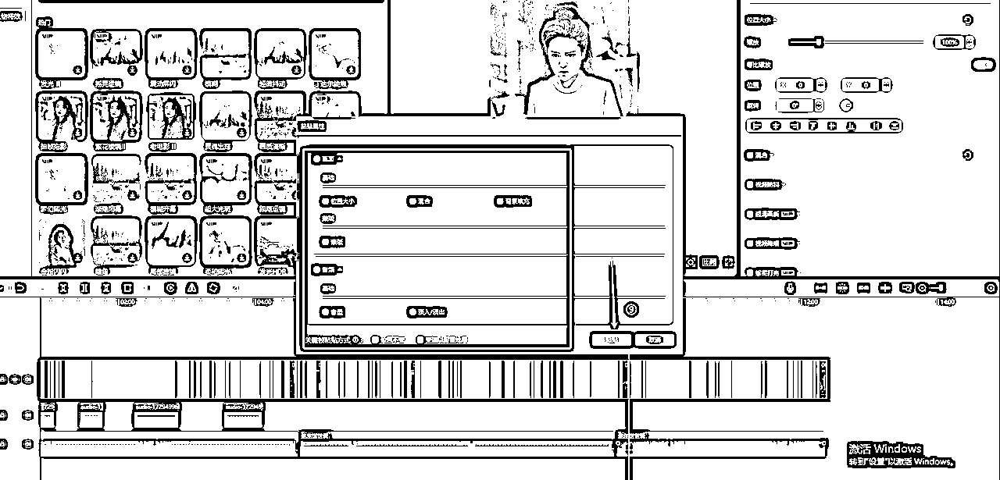

#### 5.7、添加字幕

刚才提取的字幕拖进剪映

把字体和字号调成合适的尺寸，放到模糊模板处

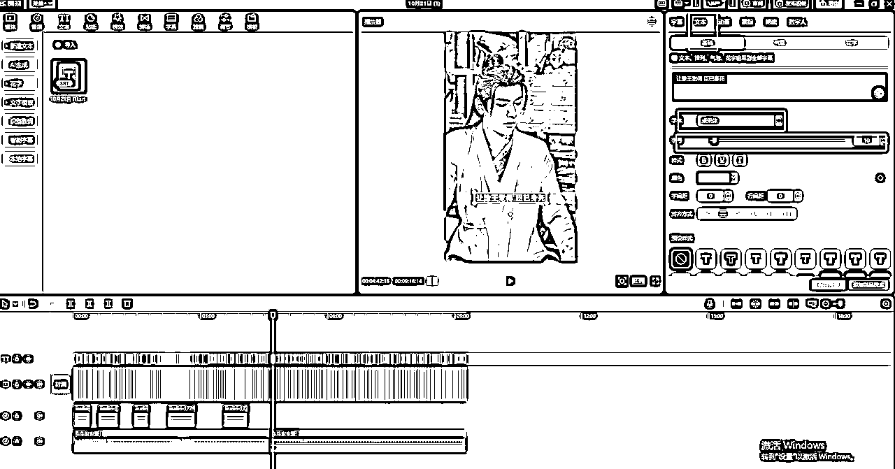

#### 5.8、添加元素

①视频间隔反转

②添加滤镜

③添加剧名

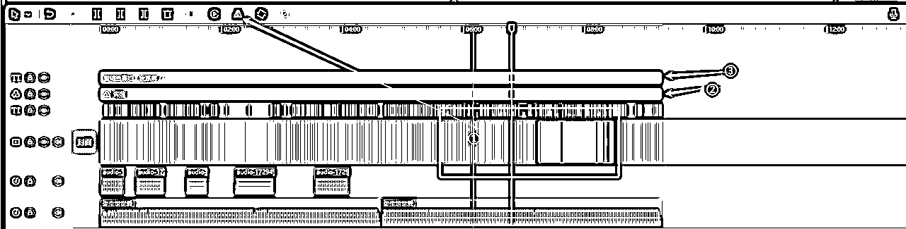

#### 5.9、导出

导出设置1080p30fps

## 6、发布挂链接

发布之前一定先看一下剧方硬性要求

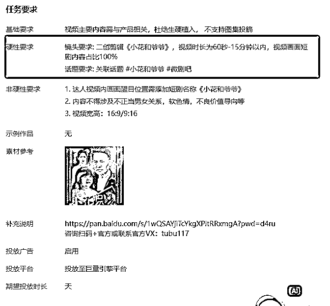

①、标题，话题根据剧方要求填写好

②、封面用剧中的主角当作封面

③、禁止别人下载视频

④、发布

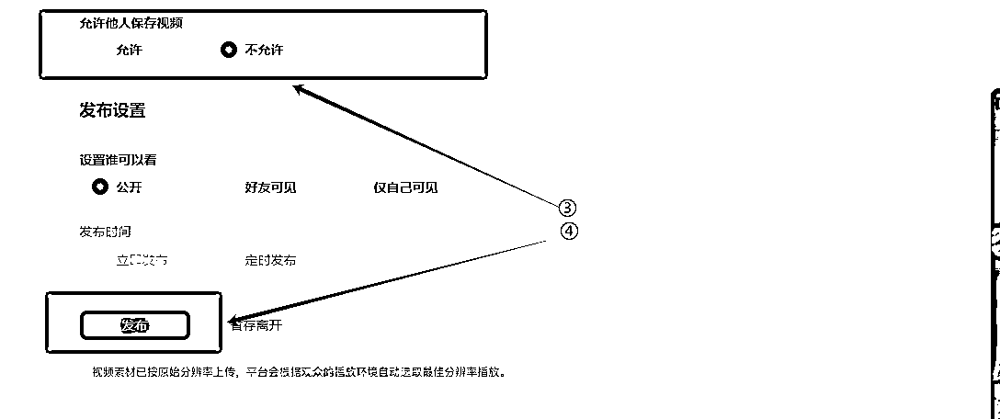

# 最后

短剧市场其实还是蛮大的，制作拍摄到达人推广每个环节都藏着巨大的空间，现在某些短剧真的不差电视剧的质量

文中演示的短剧内容不是一个剧，前后有差异，因为不是一天写完的，只能每天把工作中的素材写上去，但是意思是一样的，诸位请谅解

重要事情说三遍

这套剪辑手法，不会判搬运，请放心大胆的剪

这套剪辑手法，不会判搬运，请放心大胆的剪

这套剪辑手法，不会判搬运，请放心大胆的剪

看完此文的圈友，请上手去做，肯定能对得起你的劳动成果，时间有限，未完待续........