# 我是如何通过cursor赚取第一笔金的

> 来源：[https://lxvp0jknskn.feishu.cn/docx/UWJhdD8ZQoYm7dxJiWycolsqnqr](https://lxvp0jknskn.feishu.cn/docx/UWJhdD8ZQoYm7dxJiWycolsqnqr)

圈友们好，我是薇薇。

我大学学的是英语专业，一直也从事英语相关的工作，接触cursor前从不曾接触过代码开发，也没有学过编程。

但是我一直有一个梦想，想自己能0资金做一些产品，最好是APP。感谢这次Cursor帮我实现了我的梦想。

起因是2024年11月13号亦仁大大分享的第三个超级标，让我知道了Cursor的巨大潜力。

这让我对cursor产生了好奇和憧憬，我立马下载了cursor,然后在B站，youtube到处找操作视频（我心中想的编程过于复杂，不敢轻易自己摸索），但是那些博主讲的过于复杂，我实在看不懂，就搁置了cursor。

# 用cursor第一款贪吃蛇游戏

很快第二天，2024年11月14日，在生财看到另外一个帖子：《如何让吴佳文会用cursor完成一个复杂项目》

我想小白都能做，我应该也可以。

按照这个帖子，我一步一步按照步骤做出了贪吃蛇游戏。

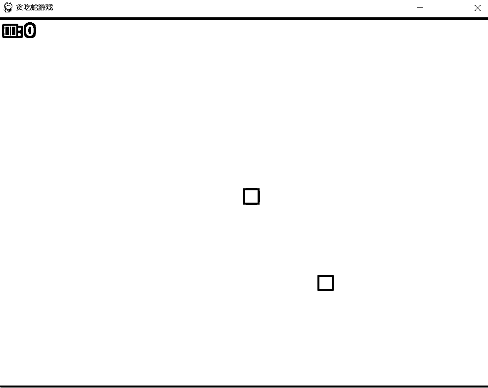

这款开发的小游戏，我感受到了软件自主开发的乐趣。

我想尝试做更多可用的软件。

# Youtube视频软件开发

因为已经在做Youtube shorts的AI赛道了，每天都需要下载对标账号的视频。生财有术的圈友分享了很多youtube视频下载链接，比如https://ytshorts.savetube.me/zh/29-youtube-video-downloader-1keen2

这个网页打开有很多”牛皮藓“广告，初打开链接，很难第一眼就发现导入链接的地方，比如：

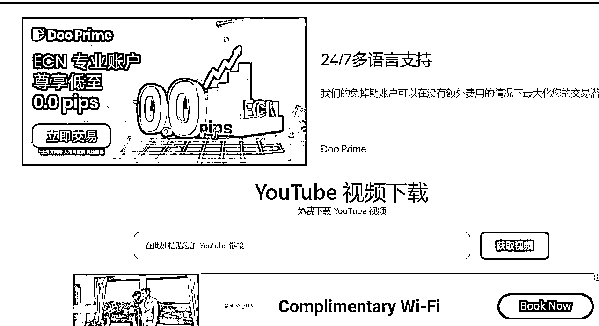

而且它的下载程序需要四步：

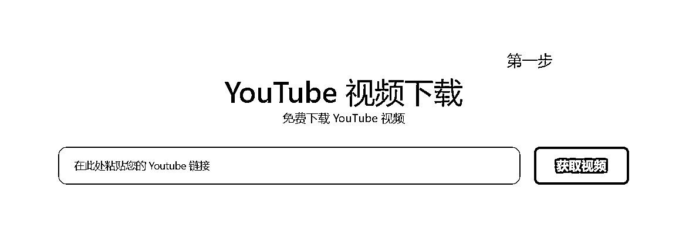

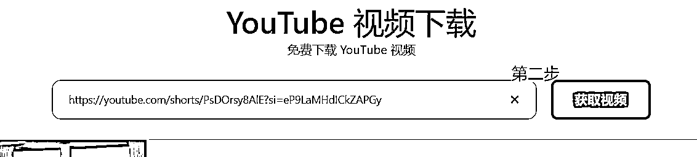

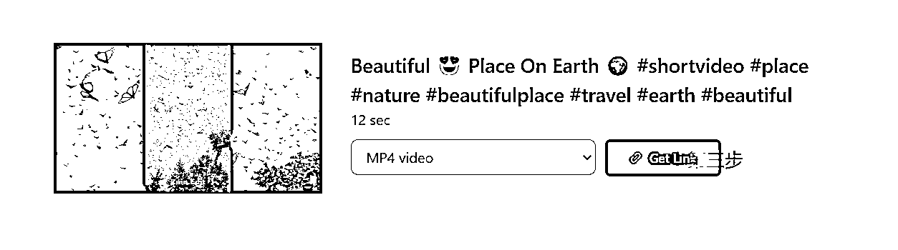

期间无数的牛皮藓广告烂飞，下载步骤过于复杂，很耽误时间和精力。

为此，我想尝试自己做一款Youtube下载软件。

## 第一步 描述需求

这一步是使用任何AI工具的核心。

同样的，我们在cursor之前，心里要想清楚需要实现什么功能。

我是想做一款APP，任何电脑只要一次解压，就能实现下载功能~

我在"chat”聊天窗口输入以下内容：

能生成一个能下载Youtube视频的APP吗

## 第二步 按照步骤一步一步操作

以下是cursor的回答

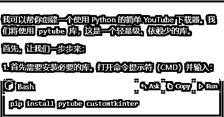

接着安装一个python文件

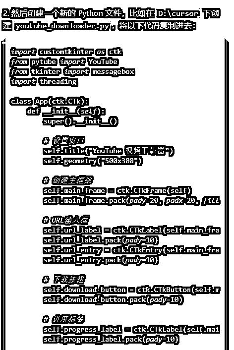

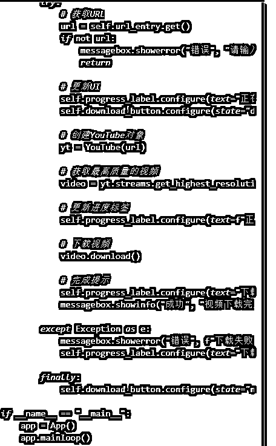

同时，cursor对该软件做出了如下解释：

简单的图形界面

支持输入 YouTube 视频链接

自动下载最高质量的视频版本

显示下载进度和状态

错误处理和提示

使用方法：

运行程序

复制 YouTube 视频链接粘贴到输入框

点击"下载视频"按钮

等待下载完成

视频会下载到程序所在的同一目录下。需要注意的是：

需要稳定的网络连接

某些视频可能因为版权限制无法下载

下载速度取决于你的网络状况和视频大小

要运行这个程序，你需要：

安装 Python（如果还没有的话）

通过 pip 安装所需的库

运行 python 文件

需要我详细解释任何部分吗？

## 第三步 发挥“不懂就问”的作风

期间我连怎么运行python文件都不懂（汗颜😓）

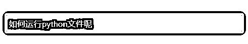

cursor这时候就发挥了耐心的好老师风范，立马给出解答

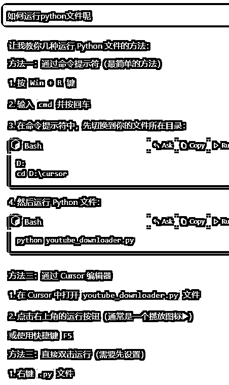

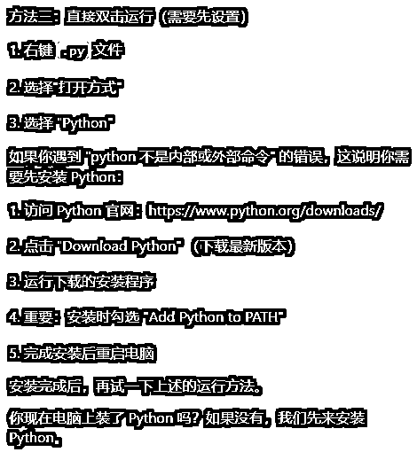

可惜的是，即使我按照流程启动了程序，最后还是报错了，我立马反馈给cursor

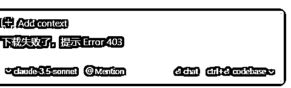

cursor会根据错误代码来重新调试代码

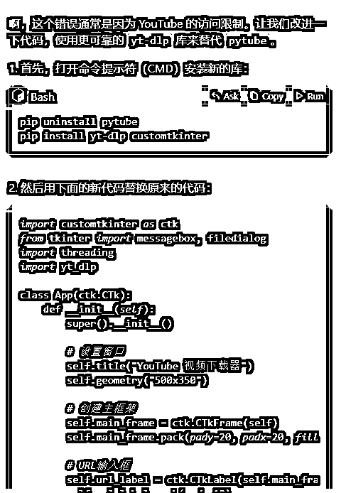

最终我做出这款YOUTUBE 下载APP，这款软件只用输入分享链接，选择保存位置，就能在一秒内下载出视频啦

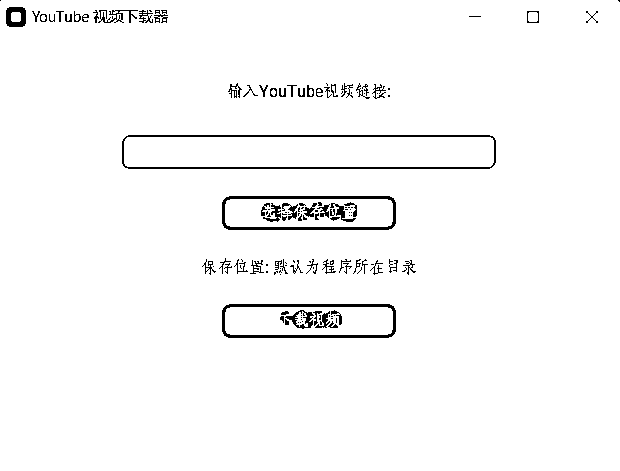

# 尝试靠youtube下载软件赚钱

产品做出来了，我也想尝试下是否可以靠自己开发的产品赚钱呢？

为此，我今天下午把这款软件发到咸鱼上，很快就收获了2单生意。

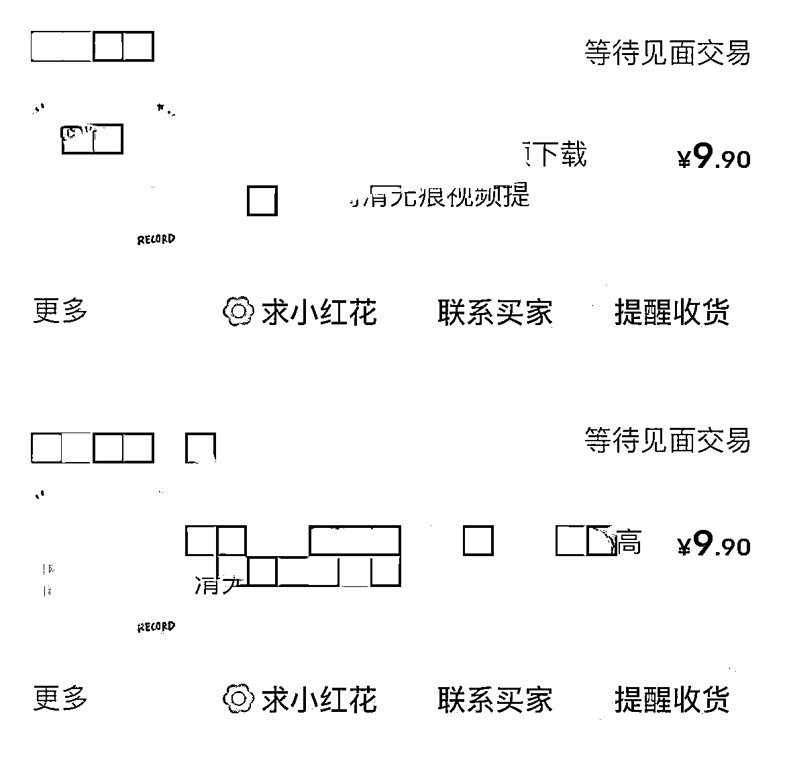

美好的故事有时候也会遇到狂风暴雨😊

结果晚上咸鱼就判定违规了 /(ㄒoㄒ)/~~

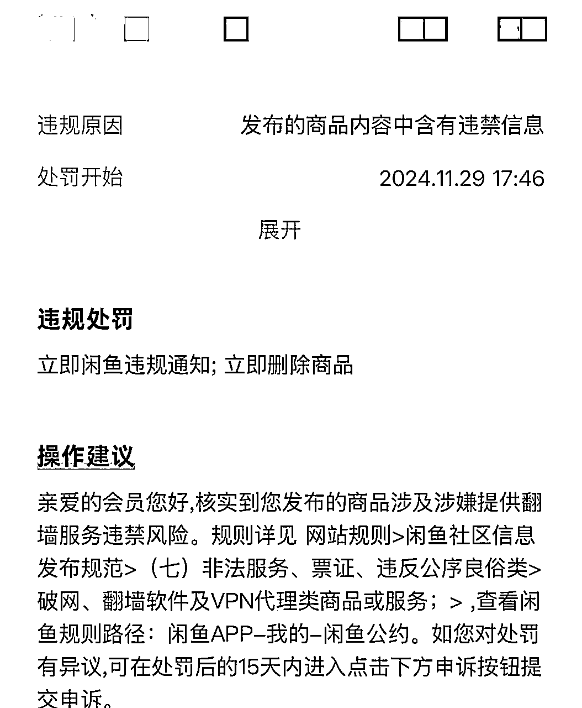

如果其他群友有什么方案能避免违规，也可以分享给我哦，谢谢啦~~

好啦，我的分享结束了。重新回到生财的怀抱之后，我每天像海绵一样不停吸收生财的养分，非常感谢各位圈友的分享，太多太多了，我就不一一感谢啦~~

我曾经被一句话打动：是什么曾经拯救过你，你最好就试着用它来拯救这个世界。生财开了我的眼和脑，我也试着分享出自己的一点浅薄经验来回馈啦~~

最后，祝各位圈友们，一起生财有术。

12月份的航海即将远行，我也是cursor航海中的一名实习志愿者，希望所有cursor的船员们能一起开心靠岸咯~~