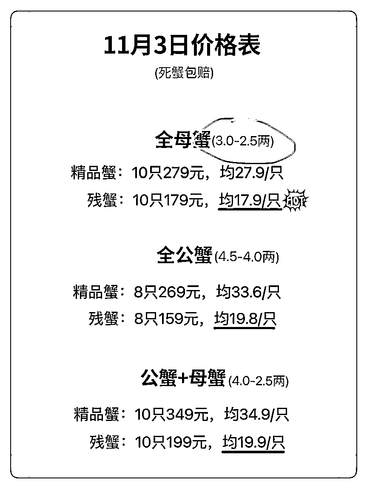

# 小红书残蟹项目全套细节玩法，复制就能出单

> 来源：[https://lw03aeuj0n.feishu.cn/docx/N2sqdXekQoWm2Wx1D28cGo62nwi](https://lw03aeuj0n.feishu.cn/docx/N2sqdXekQoWm2Wx1D28cGo62nwi)

大家好！我是艾小飞，擅长小红书精准引流

又到吃大闸蟹的季节了，今天给大家分享一篇去年我做残蟹的项目玩法

这个项目低门槛，照着做就能赚钱

前几天我朋友按照我写的步骤来操作，第一天就赚了300+

今天我把这篇文章分享出来，感兴趣的圈友可以试试！

这篇文章主要讲的是整个私域残蟹无货源的全部教程

可能你不太懂什么是残蟹，在这我先给你科普下，什么是残蟹？

残蟹其实就是断了腿，但还活着的大闸蟹。

它跟精品蟹的品质和口感没任何差别，只是因为断了腿不方便拿去送礼，所以市场价格超便宜！

很多人为了省钱，不会去计较这些微瑕疵的产品，市场有很大的需求，但很多人都没注意到这点，这个就是我们的优势

我们做的残蟹项目，是利用了客户想占便宜的心理，打着低价的幌子，来给客户发完整蟹的一个玩法

那其实客户是不懂这些的，他们收到后之后发现居然都是好蟹，客户获得了意外的惊喜！

这就是这个项目的心理套路

当你清楚了这点以后，我现在来大概的给你梳理一下，整个项目的流程都有哪些

简单一句话概括就是：在小红书上引流和转化客户，把他们引到微信上，复制闲鱼的链接给客户下单，下单后我们在拼多多上下单，拼多多发货后复制单号到闲鱼订单上，客户收到货后就交易完成了

这其中低买高卖的差额，就是我们所赚到的利润

总结：小红书引流/转化→微信承接→闲鱼下单→拼多多进货→闲鱼发货→交易完成

虽然一段话讲清了整个流程，但这里面的细节点是非常多的，细节也将会决定了你这个项目能玩多久，能赚多少钱

好，接下来你就要按照我给你的步骤，一步步的去执行到位，缺少了其中一个环节，都有可能导致你赚不到更多的money

# 一、准备硬件设备

这个时候你需要去做两件事

第一、要去注册一个全新的小红书帐号，注册的时候不能去登录Wi-Fi，手机型号最好是用苹果7P以上的，安卓手机型号尽量在五年内的，过于老款的手机尽量不要去注册了

第二、要准备一个微信大号加同行，复制朋友圈到微信小号上打造人设

## 怎么用大号微信加同行呢？

去抖音搜索“大闸蟹”关键词，要找那些不是开店铺的博主评论区，假扮客户留言：“怎么买”，“怎么下单”

1-2小时后，你的私信或评论区就有一堆的卖家来主动找你了，假扮客户想办法加到他们的微信号

去看看他们有哪些朋友圈能打动得了你的，你就把他的文案和图片复制到微信小号的朋友圈上，成为你的素材来源

记得，一定是要发能打动你朋友圈的素材，要是没有一条能打动你，那就继续找更多的同行

这么做的目的，是在客户加你之前，就认为你是在卖这类产品的，信任非常的重要

朋友圈每天发3-5条就好了，不能不发

## 为什么要发朋友圈呢？

先跟你说下我的想法

因为我们的客户都是从小红书上过来的，他跟你聊天没几分钟就过来加你了，加你之后他肯定会第一时间先去看你朋友圈的

要是你朋友圈啥也没有的，他是不会轻易给你转钱的，因为你们只聊了几分钟的天，还只是个网友关系，信任度是非常低的

这时候朋友圈就是能打造你们之间信任非常好的一种方式

朋友圈就相当于是你这个人设的名片，同时你要把朋友圈设立为仅三天可见。

而且还要把加过来的这批客户，专门给他们单独设立一个标签，比如像我给他们设立的标签是：“大闸蟹客户”

所有发大闸蟹的朋友圈，仅给他们看就可以了

这就是我为什么在加到客户之前，要先打造好朋友圈的原因

当完成了这些步骤之后，我们就开始进行下一步的动作

# 二、布局账号小红书

做完前面的步骤就可以开始去布局小红书的帐号信息了

比如头像、简介、名称和背景图

这里要怎么去操作呢？

你可以复制我以下的这一块模板

名字：

专卖残蟹的小霏姐姐

简介：

✈️目前我在广西工作，但爸妈在苏州养蟹有20多年了

🦀因为螃蟹会打架，所以时常会有断腿蟹卖不出！

🙏🏻于是我打算来帮爸妈卖残蟹！蟹都是活的，姐妹们放心

然后你在这个模板基础上，去修改你的名字和地区就可以了

比如我的名字叫专卖残蟹的小霏姐姐，你可以把它改成：专卖残蟹的小*姐姐

同样的在简介上，把我所在的城市换成你所在的城市

直接把模板复制过去，这样省时省力

我们现在账号的人设是帮爸妈卖残蟹，你一定要立住这个人设，不要把“她”给整崩了

头像怎么弄呢？

很简单的，你不是刚刚注册了一个小红书新号嘛，你用它去搜索“女生自拍”这个关键词

点击最新，点击图文

然后你可以根据我给你的标准去找

哪些标准呢？

*   1.自拍一定是要真人的，不能是动漫、风景、物品

*   2.真人一定是要真实接地气的自拍、不能是相机拍摄的、不能是网图感太重的，也不能是明星的图片

*   3.年龄在20-30岁之间的露脸自拍

*   4.要选颜值中上的，颜值好看的女生会间接影响你的下单率

然后你按照我的这四个标准去找，然后截图下来裁剪成1:1比例，作为你的小红书头像

完成了操作后，下一步就是把你小红书的头像、简介和名字，全部都同步到你的微信和闲鱼账号上

要保持这三个帐号都是一样的头像、名字和简介【微信、小红书、闲鱼】

让客户从看到你小红书帐号到微信上，都是无缝丝滑的，然后从微信转到闲鱼上看到也是无缝丝滑的

千万不要小红书一个头像，微信又一个头像，闲鱼又另一个头像的，这样会让客户认为你是不值得他去信任的

要记住，信任是下单的唯一关键因素，如果你的某一个举动，让他对你失去信任了，那么你的价钱再怎么有优势，你说的话再动人，他也是不会去理会你的

完成了操作后，下一个步骤，就要开始发布第一篇小红书笔记了

# 三、素材怎么找

答案是：小红书的评论区

平时去找素材来源的时候，我是非常喜欢到大闸蟹的评论区去找的，因为在大闸蟹评论区大多数都是用户拍出来的真实反馈图

而且小红书上用户拍摄的照片颜值，不一定比那些博主拍的差

要找什么类型笔记的评论区呢

第一步是搜索“残蟹”，然后看看哪些是吐槽类的笔记，给他们点个赞，让大数据知道你是喜欢看这类内容的，下次刷推荐页的时候，就会给你推送一堆相似的内容，这样就不缺素材来源了

然后你到他们笔记的评论区看看，有没有图片的评论，要是有，就按照以下的标准去找图片：

*   第一：选择活蟹作为封面的图片，一定要大！至少要比手掌还要大。

*   第二：选择熟蟹的黄一定要诱人，看着你自己都想吃一口，公蟹的膏要多要鲜嫩

*   第三：图片一定要高清。不是那种拍的很模糊的，焦点要集中在螃蟹身上

*   第四：要找图片比例是3:4的。千万不要去找横屏拍或正方形拍的，后期我们不好去二次裁剪和创作

然后你就按照这四个缺一不可的标准，去评论区翻找符合条件的图片

例如：

点进他们的评论区，看看哪张图片能吸引到你的

## 如何获取素材

找到后要如何去获取素材呢？

要记住，千万不能保存原图！不能保存图片！一定是要截屏！截屏！

为什么？先跟你说个冷知识吧，为什么不能保存图片

保存下来的图片再去发笔记，哪怕二创过，被判搬运的几率比截图的要大！

但截屏就不一样，通过手机内置的截屏功能，能绕开平台的数据抓取，安全系数要比保存原图的要高

说完了冷知识，我们继续，然后你分别找出30张生蟹的图片，找30张熟蟹的图片，符合标准的就截图下来

打开手机相册，从中删除当时认为很好看，但多张对比后觉得不好看的图片去

接下来就开始进行二次的裁剪和创作了

## 怎么二次裁剪和创作

因为我不知道你的手机是什么型号的，但如果你的是苹果手机的话，可以用我下面的图片来给你做个案例参考，安卓手机也是同样的原理

首先你手机相册打开一张截图好的图片，点击右上角的编辑，点击右上角的比例，再点击右下角的3:4比例，然后你再点击左上角的平移翻转这个图标，点击右上角的完成就可以了

你复制这个流程，把相册里的每张截图都操作一遍后，我们就进行到下一步

打开美图秀秀，任意点击一张图片。选择滤镜，它就会自动的给你上一层滤镜，要是你觉得这个滤镜的颜色不太好看，你可以在程度那里，把它划到你喜欢的滤镜颜色

选择旁边的打钩后，在最下栏滤镜的旁边有个“贴纸”的选项，点击它选择一个不显眼，隐蔽性非常强的小帖纸，双指把它缩小到肉眼看不到后，选择打钩

然后在右上角的“保存”旁边有三个点，找到“自动保存配方”的选项，把它给打开，然后再点击保持就完成了

当你想二次创作下一张图片的时候，你就可以选择精选旁边“我的”，点击刚刚制作好的创作模板，那么你直接点击右上角的保存，这样就能批量的去二创图片，可以省掉很多的时间成本了

Ok，整个找素材源头和二创的操作流程都说完了，是不是现在听起来觉得有点懵，那是对的，因为你现在还没走到那一步

当发布第一篇笔记的时候，要注意有三个“不能”

不能打开定位，不能打开Wi-Fi，不能保存图片，把这三个选项全部都关了之后，你就可以发布第一篇笔记了

因为你这个帐号是个新号，刚发布第一天，不可能会马上成为爆款的

那么第一篇笔记他的主要作用，是来测试你的这个帐号的流量，是否是正常的

如果这个帐号它不正常，到时候我会在电话里面跟你沟通，会教你怎么去解决，在这里我就不多说了

当发布完第一篇笔记时，流量要是正常的话，那么在半个小时内就会有人来评论你：“怎么买”

# 四、怎会回复顾客

## 评论区回复

有人在评论区评论，统一回复：后台踢踢我，我给你发今天的价格表

目的呢，是把真正的客户引到私信上去做转化，也让后面来的人看到评论话术后，他们会自主的找到你

## 私信回复

当有人来主动私信你的时候，就是要回复像这样的私信话术

这是大部分客户常见的私信聊天场景，这些话术也是能套用到大多数他们常见的问题里的，你就按照像这样的一个场景话术去回复他们就没问题了

# 五、计算利润

那么下一步，我就教你怎么去找拼多多的商家，来设定你想要的利润

我非常喜欢拼多多的一点，就是他们的产品价格在全网来说，是超低超低的

这个就能保障到我们订单量少的情况下，还能找到最低的供应商去拿货

因为我们这样的量，要是去跟线下的代理商去谈进货价，估计连门都进不了

所以这个时候拼多多就展示出了他的价格优势

但有一点让我非常不爽的，也非常讨厌拼多多的一点，就是他们的虚假宣传太过于严重了

严重到什么地步呢？

比如客户下单的是三两蟹，我在拼多多那下单的也是三两蟹，等客户收到货后，有可能连二两都不到，而且还是带绳称的，都不够二两重！

要是把绳子给拆下来，那螃蟹的净重估计也就1.5两这样

你可以想象一下，拼多多发的那个蟹，是有多么的小，要是你收到这样的产品，会不会很生气

所以在我这边也经常会遇到一些客户来闹，大部分都是因为这个货源的问题。

不单单是这个，还有就是让我非常讨厌的，就是拼多多他会主动的给客户发送产品的信息，让客户马上意识到，我们就是个中间商，他被赚中间差价了

唉，拼多多虽然很恶心，但谁让他是全网最低价呢，真的是又爱又恨，拿他没办法

要是你这边有遇到更加好的货源，我建议你优先抛开拼多多，去跟你的朋友合作吧

OK，我也把拼多多的好和不好的方面，都给你讲清楚了，然后下一步我就教你计算利润

让你清楚的知道每种规格的进货价分别是多少

比如你看这张价格表中的3.0-2.5两母蟹，售价是179元10只

然后你再找到拼多多商家跟我一样的规格，你看看他的这个价格是多少

这里的进货价是102.9元10只，179-102.9＝76.1，这就是我每单的利润

要是你想薄利多销，也可以把利润降低点，每单赚个20-30也行，这样客户下单率会更高

拼多多商家他们每天的价格都会有些上下浮动的，大概浮动10块钱左右，所以当你有订单后，你一定要时不时的留意拼多多的价格变动，他们涨，你也涨，他们降，你也降

然后在这张价格表里，精品蟹这栏的价格你就不用去修改了

精品蟹的价格主要的目的不是拿来卖的，而是来衬托残蟹低价的，让他们对比得出残蟹更具性价比的意思

如果有客户问价格表上没有的规格怎么回复？

假设1：

客户问：有没有大一点的残蟹？

你回答：有的，你想要多大规格的蟹

当他说出规格后，你就可以在拼多多的链接里，找到他想要的规格，然后加上你想赚的利润，把售价发给他就可以了

假设2：

客户问：哎呀，你这里的数量太多啦，10只我一个人吃不完的，我可以先买五只吗？

首先你去看看拼多多那有没有五只的规格，要是没有，可以拒绝他

怎么拒绝？

你回答：我们这里最低的规格是xxx只的，要是只发五只的话，邮费是需要你自己出的

要是客户问你邮费多少钱，你就随便开个高价

比如说60块，目的是让他觉得邮费都比残蟹还贵了，不划算，而且也能很婉转的拒绝他，让他去买多只的

价格表是死的，但客户的需求都是可以灵活操作的，要是客户下单了，你就去拼多多那下单

我们所有价格表的售价，一定要根据拼多多那边的价格来进行变动的

只要你想清楚一点，每单你想要赚到多少钱，就保持那个数区间就行了

OK，清楚了拼多多商家的价格设定后，然后下一步是要鉴别，什么样的人不是我们的客户，如何避开同行恶意举报

# 六、鉴别客户（重点）

这个环节是非常重要的，因为一旦处理的不好，随时会引火上身

因为在残蟹的这个行业，同行实在太多太多了，而且同行之间都是有非常多恶意竞争的，今天你举报我，明天我举报你的

因为我们的帐号刚开始是一个新号，它就相当于是刚刚出生的婴儿一样，非常的脆弱，他经不起同行的大量恶意举报，所以我们一定要先在源头上，去排除什么样的客户，不是我们要的，什么样才是我们的目标客户

## IP地区排除

IP地区的排除，只要你看到他的IP属地标记的是江苏地区的

你千万不要去回复他任何的私信，但评论区可以正常按照话术回复

为什么呢？

因为在江苏地区的IP，大部分都是卖残蟹的同行，既然是同行，那么他们来找你，你觉得他们有什么目的？

无非就是想套出你说出一些违禁词，比如说微信的联系方式，比如微信二维码，这样才方便他去举报你，把你的账号给封禁了，他心里就满足了

你会想：怎么那么变态？

对，这个残蟹的同行就是这么的变态，一定要防住！江苏地区的ip私信别去理他！看到了马上左滑删

可能你会问，那他们不一定都是同行呀，他也有真实客户的啊

先跟你说下，在江苏地区的客户，不是我们的目标客户，因为在他们当地残蟹的价格，有可能比我们的进货价格还要低，而且还是现捞现卖的，对于我们来说是没有优势的

要是有江苏地区的客户来找我们，我们把价格表发送过去，不管怎么说，他们都是会嫌贵的，而且都不会在你这下单的，浪费你的时间和精力

所以江苏地区的ip，千万不要去回复他们任何的私信，把他们的记录给删除就可以了，就像这样，聊天记录往左划，点删除

## 着急的顾客（提高警惕）

还有第二种类型的客户，当你跟他聊了两三句，他就很着急的想加你微信的，这种人一定要提高警惕！

因为正常想购买残蟹的客户来说，他对你的信任度是非常低的，他不可能轻易把自己的微信交给你的，你想想有哪个客户会追着你下单，这不可能吧

所以一定要警惕那些聊不上两三句，就直接问你要微信号去下单的，那种90%的概率是同行

她想通过加到你的微信号，先举报你的小红书私信，然后再举报你的微信朋友圈，把你的小红书号和微信号全部都给搞破坏，看到你比他过得还要差，那么他就开心了

我之前就是这样的人搞过，所以非常警惕这类型的人，谁要是聊不上几句就主动加我的，一般我都点删除，我不会为了有可能赚你那几十块的风险，把我的微信号给搞封掉

## 爱砍价挑毛病

还有一种类型，是很喜欢砍价和扣细节的人

比如会问你：这个残蟹啊，我在线下买都没这么贵，你这里怎么那么贵啊，价格你能不能少点

像这样的客户，你千万不要去理他，因为爱砍价的客户往往售后处理起来是非常麻烦的

他可能会因为你货源的一些细节问题，给你无限的放大缺陷，去找你的麻烦，去找你索赔，去投诉你这啊那的问题，这种的客户处理起来是非常心烦的，好像你赚了他那几十块钱，感觉要伺候个皇上那样难

还有就是千万不要去理会事多的人

比如说会问你：能不能给我指定快递某天到？能不能保证你的蟹不是空壳的？要是蟹不够称怎么办？要是不满黄怎么办？要是不好吃怎么办？

问这种类型问题的客户，你也一定要警惕起来，因为这种客户他就是专门来抠细节的

刚刚我说了，因为我们在拼多多上找的这些货源，它非常的不稳定，而且虚假宣传还很严重

要是他问这种细节性的问题，你就不要去答应他，不要去成交他，他不是我们的目标客户，容易惹火上身

## 三无账号

还有一种，就是无头像，无名称，无ip，无简介，无作品的

他跟你聊天的时候，你点进他主页进去看，啥都没有的，这种一般都是人家的小号，你不懂他是真实客户还是同行，你也不懂他背后有什么目的

我之前也是被这种人给恶意举报过小红书号，一直骂我是骗子骗子，我问他你的订单是哪个，他又不说，那我大概率猜测应该是同行来捣乱的，你拿他也没办法，所以这种类型的人，尽量离远一点

说了那么多，我们的客户是什么样的呢？

总结：不爱抠细节，问的问题不多，主页有生活笔记的人

因为像这种客户，哪怕他最后收到货在重量上有那么一点点的相差，或者口感有点点的不理想，他也不会来找你麻烦的，因为他觉得这种事是很正常的

但是遇到那种非常爱抠细节，很啰嗦的人，那么你处理起来就非常的麻烦了

OK，总结一下，什么类型不是我们的目标客户

*   1.江苏地区IP的

*   2.直接问你要微信号的

*   3.爱砍价，事特多的

*   4.纯小号的

# 八、出单话术

## 评论区话术

OK，现在我来说说评论区的话术该怎么回复，当对方回复：“多少钱”，“怎么买”，“怎么下单”等这种留言时，你就统一回复这句话：后台踢踢我，我给你发今天的价格表[偷笑R]

当有人在你评论区恶意捣乱，比如说：“你的价格还没我低呢”，“你的价格好贵”，“你这是骗人的吧”

凡是关于对笔记不友好的评论，都要删除掉

如果他连续多条去恶意评论，你就直接把它给拉黑了

## 引导加微话术

当有客户来私信找我们的时候，要如何引导他们加到微信号呢

首先这个时候你需要去准备一个小红书的废号，什么是废号？

就是你之前不管怎么发都没流量的账号，如果没有，重新注册一个也行

当准备好账号后，就同步你大号的头像名字过去

你可以制作一张这样的图片

然后你在小红书小号上发布这张图片，标题配上“流程”两个字

然后你就用大号去搜索小号的id号，找到刚刚发布的那篇，给他点个赞

当有客户来问怎么下单的时候，你就在“分享笔记”这

找到你刚刚点赞的那篇笔记发送过去给他

并附上一句：姐妹，这样看得到吗？

这个操作流程就完成了

但有一点要值得注意的是小红书，小红书对引流的操作行为打击是非常严的，每隔几天系统都会自动扫描一遍全网

看看哪些帐号会有引流的动作，然后都会自动屏蔽掉，所以你发的分享笔记次数多了，客户就看不到了

这个时候该怎么办？

有两个办法

一、你用小红书小号在每隔一小时区间重复的发，仅为自己可见，然后把客户看不到那一篇给删掉，只打开其中一篇公开就可以了

然后再用你的大号去点赞你小号的笔记，这样就可以避开了平台的检测

要是这个方法行不通，没关系，还有另外一种方法

当客户说还是看不到，你可以截屏当时跟他的聊天记录发送给他，并附上一句：姐妹，这样看得到吗？

这样就能解决被系统屏蔽的问题了

有个知识点要说下，就是在小红书上引流没有100%安全的，而我们的笔记类型是属于商业引流，所以平台是比较痛恨我们这种的

所以我们的账号生命周期一般很难支撑得过5天，可能5天后要是被违规提示了，就要重新的注销再注册了

但不用担心说注销账号要等7天后才能使用，小红书当天注销，当天就能用同个号码继续注册新号了，而且还不用被实名，所以这点是比抖音要有优势的

# 九、微信话术

当你确认客户有意向想要下单后，他也加了你微信。

这时第一句话该要怎么说呢？

第一个动作，先问他：你好姐妹，请问你是想要哪种规格呢？然后把当天的价格表发过去

他要是说：“谢谢，目前我还没想好，过几天我再买”

像这种客户的话，可能当下他没有需求，没关系。你每隔两到三天就去再问他一遍：“姐妹，现在的蟹非常的肥哦，口感很好吃。有想好想要买哪一款吗？

然后再把当天的价格表发过去，尽量要去成交他，而不是让他一直潜伏在你的朋友圈里面

你要知道的是，不下单的用户对于我们来说，是没有任何价值的

加到微信后，我们的目的要么是成交他，要么把他删了。

# 十、闲鱼链接流程

OK，当对方选择了相应的规格后，然后你就在闲鱼上去设置一个价格链接，怎么设置呢？

打开闲鱼，选择底层中间“卖闲置”

然后在相册选一张好看的大闸蟹封面，配上客户要买的规格上去

比如他要的是十只3.0-2.5两的母蟹，你就打：3.0-2.5全母10只

然后填好售价，不要标原价，设置包邮，就点击发布就好了

然后你就点击链接的右上角，有个分享微信的图标，发送过去给客户

发完后跟他说上一句：待会拍好了告诉我哦，我让我妈妈给你挑大的！

他拍好了后，简单的聊几句就结束话题了，不宜过多的跟他深度沟通

# 十一、拼多多下单

当他下单后，你就马上去拼多多下单它对应的规格，记住这里有一个非常重要的细节点，如果你希望客户不会收到拼多多骚扰短信的话，这个时候有两个技巧可以避开

第一、你可以把客户的号码改成你的号码，当快递打电话给你的时候，你在跟快递员说正确的号码，这样的话平台的信息是不会经过客户手机号的

第二，如果你想省事的话，你可以把客户的号码改成你的号码，当你发现拼多多的物流开始有变动后，你就跟拼多多的客服说：哎呀，我的号码弄错了，你能不能帮我修改一下？然后你再把客户的正确号码改上去就可以了

这是两种技巧是可以避开拼多多给客户发骚扰短信的方法。但这种技巧它并不是100%安全的，有时候可能会有失效的时候

当你用了这些技巧后，客户还是收到拼多多的短信，客户很生气的来质问你，这时该怎么办？

第一步，先别急，别慌。首先你的情绪要稳定，才能顺利的安抚客户的情绪

你可以像我这么说

一般爱吃大闸蟹的，或玩小红书久的客户，他都很清楚小红书上面的价格是多么多么的贵，那他来你这里肯定是看中了你的价格便宜，而且还包邮。

所以你就借用包邮这个点去放大的说。那么他也会理解的

要是你遇到非常难缠的问题，到时候你再电话来跟我说，因为每个客户遇到的情况都不一样的，只能见招拆招

当拼多多这边一旦有了单号后，一定要马上的去复制物流单号到他下单的咸鱼上，给他去发货，而不是等到他发现的问题不对劲点击退款了，你再复制单号过去，那样处理售后起来是非常麻烦的

# 十二、售后

Ok，那么下一步客户收到货之后，发现重量和宣传的严重不符该怎么办？

还是那句话，先别着急，别着急，心态先放平，遇到这事第一时间打电话给我，然后我会根据当时的情况来给你做具体的解决方案

要是当时我没有第一时间看到你的消息，你可以按照下面的这个步骤去走。

首先你跟他解释说，姐妹实在抱歉，你可以先拍张图片过来吗？我发给我妈妈看看是怎么回事

然后你就马上去联系拼多多的客服，质问他原因，语气一定要非常的严重，给他们施压，直到拼多多给你赔付或退全款为止

然后你就跟客户好好的解释说：不好意思，实在抱歉了，可能是我妈妈的员工阿姨不小心发错货了，你看我先给你赔付20元代表我的歉意可以吗？毕竟我也是第一次在网上卖这个残蟹，我也不希望会发生这种错误！姐妹，真的真的很抱歉

然后你先看看他是什么样的态度，要是她答应了，你就发个20元红包过去，再感激一遍

要是他一直在纠缠，一直在骂你，你不要激动，冷静她一个小时后，再回复他：实在抱歉了，刚刚我又打电话给我妈妈了，我妈妈也当着我的面去责怪那个员工阿姨了，然后我妈妈说20元太小气了，让我给你赔双倍的价格，给你赔付40元。这是我妈妈对你的歉意，让我转告给你，姐妹，真的实在不好意思了，抱歉抱歉

然后你再看看她是什么样的反馈态度！总之就一直要安抚他的情绪，不能跟他去斗嘴，不能跟他去吵架！就一直说是我们这边发错货了，是我们的问题！

如果赔付+道歉都还解决不了，那就说明你遇到的这个人，是个难缠的人了

总之遇到像这种问题，你的心态一定要先冷静，不能去跟客户去争吵，一定要先安抚他的情绪，然后把问题抛给拼多多客服那边，看看他们那边是怎么处理的

拼多多那边要是不处理，你就申请平台介入。因为拼多多的平台大多数是比较袒护客户这边的

当你得到拼多多那边的全额赔付或者少量的赔付后，这样你才有底气去跟客户周旋的空间

无论如何，我们做生意的，千万不能做亏本买卖，不能自掏腰包去给他填坑

因为拼多多货源的问题实在不太稳定，要是你这边有遇到更加好的供应商，而且价格跟拼多多持平的，甚至比拼多多更低的话，那么你可以去跟他谈谈合作。

要是没有的话，那只能先暂时忍受一下拼多多的这个缺点吧，我也是非常痛恨他这一点。但没办法，谁让他价格有优势

# 十三、货款多久到账

可能你会问，这笔交易的钱什么时候打到我的账上呢？

一般三天后，客户收货后了，觉得没问题了，会点击确认收货，然后你的支付宝就会收到这笔货款

如果他收到货后，一直都不点确认收货，那系统会在你发货后的15天内，会自动的默认确认收货，然后把这笔货款打到你的支付宝上的

那么这整个残蟹的交易环节就完成了，你也赚到了属于自己的辛苦费

# 十四、账号违规怎么处理

Ok，交易的环节已经讲完了，那么来说说当你发布笔记时违规了该怎么办？

因为我们这种笔记是商业引流类型的。对于平台来说它是很痛恨这种的，被违规，被限流，被封号也是家常便饭的事

即便容易违规，但也有属于他的规律和类型

以下的违规提示，是由最近发生影响最小做排序的，越往后，违规更严重，影响也更大

第一种类型是影响最小，也是你发布第二天就会接收到的

当接收到像这样的违规类型后，该怎么做呢？

你可以不用去理它，它只是怀疑你的内容不是原创。但没有收到任何的证据而已

这个也不是别人举报的，是平台系统自动检测到的，所以不用慌张啊，这种类型是最轻微的，它是不会影响你任何流量的

这个时候你需要做的一步，就是重新点击笔记中的编辑，然后再发布。你的流量就会恢复正常了

因为平台它自己的一套自动检测违规的功能。不管你怎么发，他都会有这样的提示，所以不用担心

第二种类型呢，是像这样的

他提示说你的笔记已经涉嫌抄袭了，说明你的笔记被人举报了，平台也掌握了证据

这时该怎么办？

最好的办法是把违规那条笔记删掉，在一两天内不要再发那条违规的素材了，相隔两三天再发

这种类型影响不算大，也不会限流的

第三种违规类型是这样的

这种是平台在每周的巡查里，自动检测出来的，然后检测到你跟客户之间有导流的动作，抓住证据后就给你发了这条提示

这条提示意味着，你离注销的节奏已经不远了，但该发笔记还是要发，该引流的还是要引流，流量都是正常的，所以不用担心太多

最后一种违规类型是这样的

当你收到这样的违规提示后，那这个事情就非常的严重了，看到后就马上注销，注销理由选其他，不要拖延

然后相隔半天后，就可以在用同个号码再注册一个新号了

这些环节是比较关键的，一定要按照我给你的步骤去走，千万不能自己擅自去瞎操作，一旦瞎操作自己被搞封号了，那么有可能你的这台手机就没有办法再继续注册小红书号了

哪怕注册来的号，流量肯定也是大不如之前了，所以一定要听话照做，按照我给你的步骤去走。

# 十五、总结

说到这虽然也接近尾声了，但是你在实操的过程中，还会遇到非常多的细节问题，可能都没有出现在这一篇文章里面

这篇文章是很长的，能看到这已经是很不容易了，说明你也是在认真的学习了

你可以把这篇文章当做是你的学习课本来参考，有哪些点不懂的，可以照着这里面的步骤去操作

也可以把这篇文章当做是你的小红书启蒙书，以后要是有哪里做得不够好的，可以再翻回看看

好了，到这里也差不多了，看完后记得给我个反馈，谢谢啦

原创：艾小飞

转载可私信

禁止抄袭和搬运