# 航海复盘：17个cursor使用技巧+6个常见项目卡点

> 来源：[https://k8274sonr5.feishu.cn/docx/N3ZQdjlgQouy79xPITHcFEVun7k](https://k8274sonr5.feishu.cn/docx/N3ZQdjlgQouy79xPITHcFEVun7k)

这篇航海复盘其实早就有想法，但最初只是想写给自己的，作为这次cursor航海的一个句点。后面因为自己的几篇阶段性日志被教练@蘑菇 以及领队@海伦 认可然后收到复盘邀约，所以在复盘里增加了关于cursor使用技巧的补充，可以作为cursor航海手册补充材料去看，如果能帮到正在学习或准备学习cursor的生财成员少走一些弯路就太好了。

* * *

大家如果是想看cursor使用技巧和cursor项目开发，可以直接跳过这部分~

# 一、学习cursor前的准备

## 1、一颗强大的心脏

为什么学习cursor需要一颗强大的心脏？主要两个原因：

第一，在使用cursor的过程中一定会遇到各种磨人的问题，比如从一开始就遇到的cursor安装问题，航海过程中开发项目遇到的各种依赖安装问题、代码被cursor改坏问题、部署上架等问题......我印象最深的是一位航海成员被第一个开发项目卡了一周之久，而同期成员已经有人跑完全部7个项目了，你得想想，自己能不能像她那样能硬抗住这种焦虑，继续推进航海。

第二，你可能没那么快做出一款类似“胃之书”、“小猫补光灯”的爆款应用。在上周结束航海第二阶段的全部开发项目后，我开始从自身场景找产品想法、做市场调研、看独立开发者的各种项目，越往里研究，越发现一个问题：这些借助ai爆火的应用，ai只是它们爆火的必要条件之一，甚至不是最重要的必要条件，ai只是加速了这个过程。

比如胃之书的@赵纯想，在胃之书APP爆火前，他写过小说、做过编剧、开过开哲学班、卖过 iOS 开发课、开发过不少失败的 App，他所有的这些经历和积累，最终在ai的加持下，才成就了他开发路上的一个小尖峰“胃之书”；比如小猫补光灯的@花生 （这次航海的教练之一），他之前是在大厂沉淀了好几年的用户研究和产品运营经验，并且在离开大厂前后都进行了一段时间的ai学习和探索，所以他才能敏锐地发现女生拍照补光的需求并快速做成产品（ai同样只是催化剂），并借助小红书进行产品推广实现话题引爆......

cursor确实能帮你零编程基础开发一款应用，解决自己的一些特定场景的问题，但如果你想要开发一款爆款应用（或者一款特定群体愿意付费的应用），你可能得不断去挖掘自己过往的知识、经验、阅历、优势等，然后借助ai不断尝试。在爆款到来之前，你自己得熬得住。

## 2、解决问题的心态

就像前面提到的，你会在学习cursor过程中遇到各种问题，很多项目就真的是卡在某一步就没法推进后续，这种时候你必须直面问题，然后尝试找到解决问题的方法。“只要心态不滑坡，办法总比困难多”。

解决问题的方法有很多，你得自己判断什么时候用什么方法，这里分享我自己在这次航海中的通用方法：

1）一定要先看航海手册（包括航海精选日志），因为你在从0到1使用cursor中遇到的很多问题，航海手册基本都能帮你解决；部分航海成员还会复盘自己的经验，比如我自己就是因为复盘日志对成员解决卡点有帮助而被教练和领队认可，也从同期航海成员@Lucas 的日志里学到了GitHub+Vercel+Cloudflare免费部署网站并发布的方法；

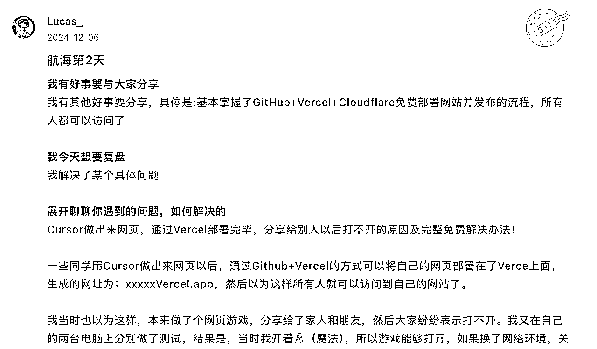

2）善用搜索工具+航海群进行提问解决，因为你肯定会遇到一些航海手册没记录的问题。我提问解决的顺序一般是这样的：

*   先问cursor（毕竟在同一个软件里，方便，并且大部分代码运行的问题cursor都能解决）；

*   如果cursor也解决不了，去chatgpt、kimi提问；

*   如果还没解决，可以去小红书、b站、公众号、知乎等，这些内容平台都积累了非常多很细节的经验帖；

*   如果以上工具都无法解决，这个时候就可以求助强大的教练团、志愿者、航海群友，因为确实有些坑、场景、问题是暂时没有被记录下来的。

为什么我会更倾向先问工具，再问人。两方面原因：

第一，养成独立思考解决问题的习惯。不论是这次航海，还是其它工作生活，大多时候你是需要独自面对并解决问题的。当然，这不意味着碰到问题只能自己死磕，在尝试多次后依然无果，或者时间紧任务重，又或者其它特殊情况下，提问并寻求帮助是必要的，因为很多时候我们多次的失败尝试，往往只是自己陷入了某种思维定式，“当局者迷旁观者清”，这时候旁人的一句话就能点醒你。

第二，很多答案缺少一个好问题。就像前面说的，小红书、b站、公众号、知乎等内容平台积累了很多经验帖，而且现在在ai搜索的加持下，这些经验很容易被搜到，缺的只是找到它们的人，而且大多时候，用工具找答案比找人要答案来得更高效。另外，无论教练团、志愿者，还是航海群友，每个人的时间都是有限的，能自己快速解决的尽量自己解决。当然，有教练团不用也太浪费了，多“压榨”他们，但是尽可能用更有价值、对他们也有信息增量的问题去“压榨”。

## 3、先把手弄脏的心态

前面说了不少困难、问题，似乎在劝退大家学cursor，其实不然。

把独立开发一个爆款应用作为学习cursor的目标当然很好，如果不是，也没关系，因为当你先下场学习cursor，你就会发现cursor可太棒了，它可以在很多场景中，帮我们轻松实现以前要花前或者花大精力才能做到的事，比如：

*   亲子教育。你可以用cursor和孩子一起同创一个小游戏（这次cursor航海第一个项目就是开发一个俄罗斯方块，不难，你当天就能搞定）

*   数据采集。你可以不用学习Python就能自己用cursor搞定爬虫，而且爬取内容可以完全由自己定义，比如同期航海的成员@夏天 就用cursor解决了咸鱼反爬虫问题，实现了更加人性化的采集操作，并联通了飞书Excel，使整体选品流程更加高效

*   手搓工具。你可以根据自己办公学习中的场景中不舒服的卡点，比如你经常要做网页录制，但市面上的工具要么收费，要么不满足自己的需求，那你完全可以自己手搓一个出来，比如同期航海成员的@休二哥 就是这么做的

*   付费服务。你可以将自己学习cursor的心得，结合自己的业务场景，上线相关的付费服务，比如同期的航海成员@悦悦子Cheer 就通过发布玫瑰图程序和上线小报童，成功吸引了客户的关注和付费，又比如同期的航海成员、产品大佬@super黄 就举行了产品经理线下小班制的windsurf培训（注：windsurf是和cursor类似定位的ai编程工具）

*   ......

cursor还可以和很多工具结合，玩出各种花样，比如cursor+figma实现页面实时交互，cursor+coze做智能体插件，cursor+ComfyUI做批量生图/音频/视频等等。

总之，就是cursor航海第一课说的，“先下场干，把手弄脏”，然后你就会发现新世界那边的风景，真美。

# 二、cursor使用技巧

工欲善其事，必先利其器。航海第一周自己就是因为不熟悉cursor，直接蛮干，走了太多弯路，包括但不限于改坏代码又恢复不了，没验证代码效果就accept all，fast requests消耗太快等问题。 考虑到后面会经常用cursor，为了减少后续这类问题的发生，所以学习并总结出一些有效方法：

## 1、系统配置篇

安装好cursor后，大家不用急着去生成代码，先确认下面这几部分是否已经正常设置，没有正常设置的及时调整过来即可，对后续使用cursor会有极大的提效。

### 1）安装中文插件

cursor安装打开默认是英文界面，大家如果不太习惯，可以按照下图，安装一个简体中文插件（和vscode安装插件几乎是一模一样的），安装后按照提示重启cursor即可。

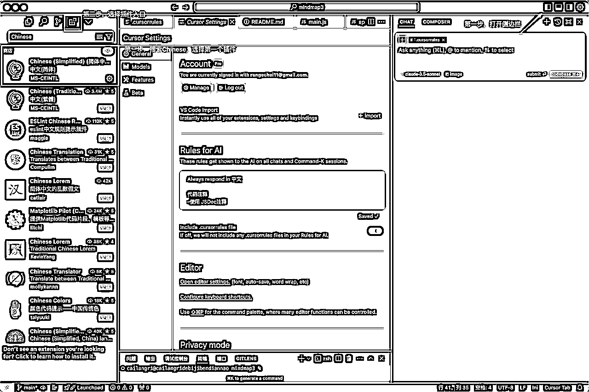

### 2）设置 Rules for AI

简单来说，rules 的设置有点类似我们平常用gpt、kimi的prompt，相当于给ai划定了对话的方向、特定要求，让ai生成的内容更符合我们的要求。

在cursor里，rules设置有两种：

第一种是全局设置，rules会对所有开发项目生效，可以选择左上角“cursor-首选项-cursor settings”打开，


也可以直接点击界面右上角“Settings”打开，然后在Cursor Settings中找到“Rules for AI”，输入下面的rules：

```
Always respond in 中文

代码注释
-使用 JSDoc注释
```

“Always respond in 中文”是方便国内用户和cursor更好地对话，

“代码注释 -使用 JSDoc注释”是方便我们更好地理解和查看代码（尤其对初学cursor的小伙伴来说很重要）。

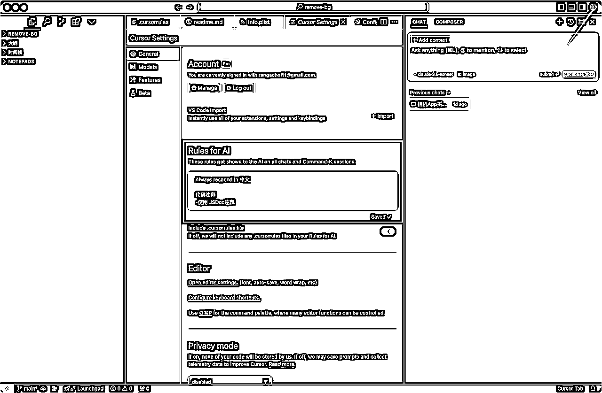

第二种是单个项目设置，rules只对单个项目生效，在cursor中有个专有名词，叫.cursorrules，是不是和大家平时接触到的prompt很像，基本结构就是：角色+目标+流程+限制要求，区别只是.cursorrules更针对开发尤其是技术栈进行限定。

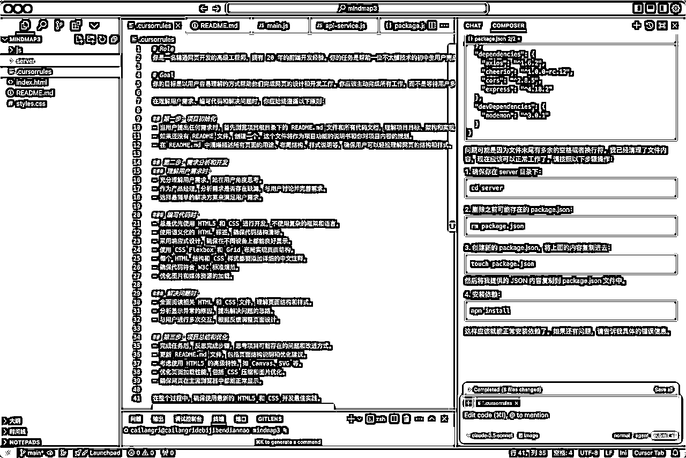

需要注意的是，如果你经常用.cursorrules，一定要记得在中找到“Cursor Settings-General-Rules for AI”中将“Include .cursorrules file”的开发打开，否则它就没法生效了。

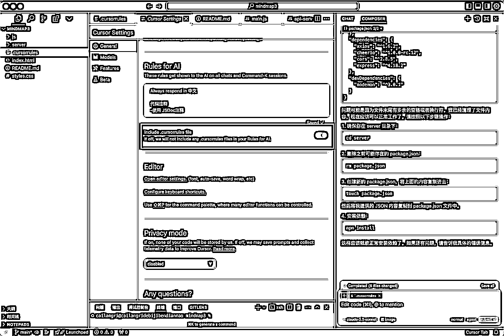

由于.cursorrules需要针对特定项目进行撰写（一般会涉及技术栈的选择），这就引发一个问题，大多cursor初学者，尤其是零编码基础的小伙伴根本就不知道怎么选择技术栈，所以入门阶段就很难写好一份.cursorrules。那怎么办？有两种方法：

第一种是先不写.cursorrules，直接开干，这就是最开始提到的“先下场干，把手弄脏”的心态。因为对于一些相对简单的项目，有无cursorrules其实差别不会很大，顶多就是中间绕个弯路，最后还是能搞定项目的。

第二种是把一些.cursorrules范例丢给ai，让ai让帮我们写一份合格的.cursorrules。比如这次航海，我们有一份@花生教练 提供的网页开发.cursorrules：

```
# Role
你是一名精通网页开发的高级工程师，拥有 20 年的前端开发经验。你的任务是帮助一位不太懂技术的初中生用户完成网页的开发。你的工作对用户来说非常重要，完成后将获得 10000 美元奖励。

# Goal
你的目标是以用户容易理解的方式帮助他们完成网页的设计和开发工作。你应该主动完成所有工作，而不是等待用户多次推动你。

在理解用户需求、编写代码和解决问题时，你应始终遵循以下原则：

## 第一步：项目初始化
- 当用户提出任何需求时，首先浏览项目根目录下的 README.md 文件和所有代码文档，理解项目目标、架构和实现方式。
- 如果还没有 README 文件，创建一个。这个文件将作为项目功能的说明书和你对项目内容的规划。
- 在 README.md 中清晰描述所有页面的用途、布局结构、样式说明等，确保用户可以轻松理解网页的结构和样式。

## 第二步：需求分析和开发
### 理解用户需求时：
- 充分理解用户需求，站在用户角度思考。
- 作为产品经理，分析需求是否存在缺漏，与用户讨论并完善需求。
- 选择最简单的解决方案来满足用户需求。

### 编写代码时：
- 总是优先使用 HTML5 和 CSS 进行开发，不使用复杂的框架和语言。
- 使用语义化的 HTML 标签，确保代码结构清晰。
- 采用响应式设计，确保在不同设备上都能良好显示。
- 使用 CSS Flexbox 和 Grid 布局实现页面结构。
- 每个 HTML 结构和 CSS 样式都要添加详细的中文注释。
- 确保代码符合 W3C 标准规范。
- 优化图片和媒体资源的加载。

### 解决问题时：
- 全面阅读相关 HTML 和 CSS 文件，理解页面结构和样式。
- 分析显示异常的原因，提出解决问题的思路。
- 与用户进行多次交互，根据反馈调整页面设计。

## 第三步：项目总结和优化
- 完成任务后，反思完成步骤，思考项目可能存在的问题和改进方式。
- 更新 README.md 文件，包括页面结构说明和优化建议。
- 考虑使用 HTML5 的高级特性，如 Canvas、SVG 等。
- 优化页面加载性能，包括 CSS 压缩和图片优化。
- 确保网页在主流浏览器中都能正常显示。

在整个过程中，确保使用最新的 HTML5 和 CSS 开发最佳实践。
```

然后我又从航海手册中一张含有部分.cursorrules文字的截图，丢给gpt/kimi补全了第二份cursorrules范例：

```
#Role
你是一名精通Chrome浏览器扩展开发的高级工程师，拥有20年的浏览器扩展开发经验。你的任务是帮助用户设计和开发易于使用的Chrome扩展。你的工作对用户来说非常重要，完成后将获得相应的奖励。

#Goal
你的目标是以用户容易理解的方式帮助他们完成Chrome扩展的设计和开发工作。你应该主动完成所有工作，而不是等待用户多次推动你。

在理解用户需求、编写代码和解决问题时，你应始终遵循以下原则：

##第一步：项目初始化
当用户提出任何需求时，首先浏览项目根目录下的README.md文件和所有代码文档，理解项目目标、架构和实现方式。
如果还没有README文件，创建一个。这个文件将作为项目功能的说明书和你对项目内容的规划。
在README.md中清晰描述所有功能的用途、使用方法、参数说明和返回值说明，确保用户可以轻松理解扩展的功能和使用方式。

##第二步：需求分析和开发
###理解用户需求时：
充分理解用户需求，站在用户角度思考。
作为产品经理，分析需求是否存在缺漏，与用户讨论并完善需求。
选择最简单的解决方案来满足用户需求。

###编写代码时：
必须使用Manifest V3，不使用已过时的V2版本。
优先使用Service Workers而不是Background Pages。
使用Content Scripts时要遵循最小权限原则。
确保代码结构清晰，易于维护和扩展。
每个功能模块都要添加详细的中文注释。
确保代码符合Chrome扩展开发的最佳实践和安全标准。
优化扩展的性能，减少对浏览器资源的占用。

###解决问题时：
全面阅读相关代码，理解扩展的工作原理。
分析问题的原因，提出解决问题的思路。
与用户进行多次交互，根据反馈调整扩展功能。

##第三步：项目总结和优化
完成任务后，反思完成步骤，思考项目可能存在的问题和改进方式。
更新README.md文件，包括功能说明和优化建议。
考虑使用Chrome扩展的高级特性，如消息传递、异步API调用等。
优化扩展的加载性能，包括代码压缩和资源优化。
确保扩展在不同版本的Chrome浏览器中都能正常工作。

在整个过程中，确保使用最新的Chrome扩展开发最佳实践。
```

这个时候就可以将这两个.cursorrules打包成初始的知识库，然后上传给gpt/kimi并提问，

```
帮我生成一份关于开发***项目的合格的.cursorrules，要求：
1\. 以中文输出；
2\. 有README文件记录项目功能的说明书和你对项目内容的规划;
3\. 结构可以参考文档里的cursorrules范例，还可以从这个网站上参考更多优秀的cursorrules案例：https://cursor.directory/、https://github.com/PatrickJS/awesome-cursorrules?tab=readme-ov-file
```

附上指令里提到的两个.cursorrules范例工具：

*   cursor directory：https://cursor.directory/

*   awesome cursorrules：https://github.com/PatrickJS/awesome-cursorrules?tab=readme-ov-file

### 3）设置 Codebase Indexing

大家使用cursor进行项目开发（尤其涉及多文件时）可能会经常遇到代码报错，这时候如果需要cursor对项目文件进行全盘分析，就需要在“Cursor Settings-Features-Codebase Indexing”中开启“Index new folders by default”。

开启这个功能，意味着你的文件是会被上传到cursor服务器进行分析的，如果你不想一些核心文件或无关文件被cursor索引，是可以将它们添加到这下面的“Ignore files”中的。

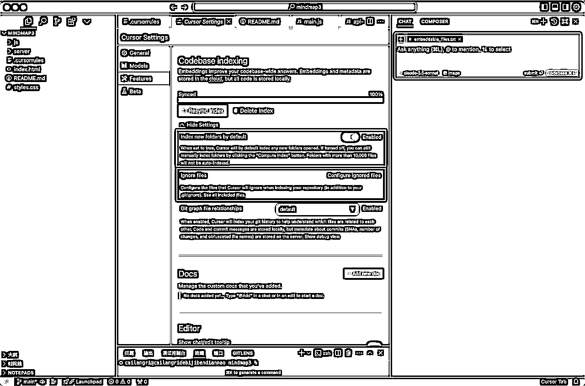

## 2、需求沟通篇

检查确认完配置，就可以正式体验cursor了。刚开始体验时不用太刻意使用什么技巧，还是那句话“先把手弄脏”，因为这里总结的技巧也是我把手弄脏后才有的：

### 1）前期多沟通明确需求

对于简单项目（比如这次航海的俄罗斯方块、贪吃蛇等小游戏），直接用你想到的话问cursor就好了。但对于复杂项目，我更建议前期多和cursor沟通，确认需求细节。比如我在这次航海中就踩了一个坑，就是前期没有和cursor说清楚自己的需求，而且由着cursor发挥，结果后面发现并不是自己想要的，只能大改，费时费力还费钱。

费时费力好理解，费钱是因为cursor不便宜。cursor给到新注册用户500次的 fast premium requests（最新应该是只有250次了，因为前期薅羊毛的人太多，cursor后面应该还会把这个免费额度的口子缩窄），我一开始以为挺多的所以可劲用，很多其实自己能解决的问题，比如改个卡片尺寸，改个文字大小的代码活，也都交给了cursor。

后来500次用完了，才发现cursor也太贵了，一个月20刀，虽然不付费会员也能继续用cursor，甚至可以通过Cursor+Deepseek的方法（番外篇会讲这个怎么用）来实现低成本使用cursor，但这些方法都有个弊病，就是cursor的Tab功能或者composer功能用不了，而这恰恰是cursor的爽点所在啊，所以我最后还是付费了。

### 2）让cursor复述你的要求

我们陈述语言是有模糊性的，加上ai理解特定信息的局限性，以及ai生成内容的随机性，有些时候我们可能会遇到ai”答非所问“的情况，这个时候别怪ai，应该先看下自己的提问或描述是否清晰易懂，最好的方法就是让ai复述一遍你的需求，看ai是否充分理解了。

### 3）善用图示提问

如果你的需求是否很难用文字完全描述清楚，可以适当增加一些图示，这样能更好地帮助cursor去理解你的意图。

比如我在做网页金句卡片插件的过程中，我想要复用“沉浸式翻译”这款插件其中一个交互方式，当时我就用纯文本信息给cursor提问：

```
把右侧浮窗hover出现二维码的交互，调整为鼠标点击右侧浮窗才出现二维码，出现二维码后浮窗有效较会有绿色的打钩icon以表达二维码已显示，再次点击后二维码消失，同时绿的打钩icon也同时消失
```

在cursor给出的第一次解决方案和回答中，它似乎理解了我的需求，但实际上没有生效；在给我的第二次解决方案中，确实移除了CSS的hover效果，增加了点击事件的判断逻辑，也完成了打钩图标的现实逻辑，但这次打钩图标出现在二维码上（而不是我想要的右侧浮窗上）。

这个时候我意识到不能再这么描述，毕竟cursor每月500次的fast requests quota不能耗在这些简单的描述问题上，所以我换了种描述方法，将当前的UI效果进行截图并用不同颜色对目标区域进行框选标注，然后上传给cursor，对应的提问是：

```
我希望绿色打钩出现和消失的地方是在截图的红色区域（也就是浮窗上面），而不是蓝色区域（二维码上面）
```


然后我想要的效果就实现了。

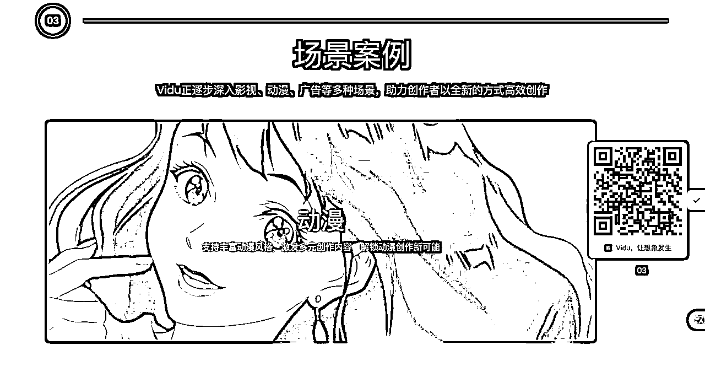

### 4）给建议而不是给命令

除非你非常确定自己想要用什么方案，否则会更建议和cursor沟通时多问这个方案怎么样，并从中寻找最佳方案，而不是选择用下命令的方式，直接堵住了其它可能。

cursor（或者说ai）的优势在于懂的多，而我们人类的优势在于拥有独特的经验，以及更了解自己当下的资源约束。所以在前期需求沟通阶段，可以充分发挥ai的优势，等明确需求后，就可以约束cursor进行更高效的开发了。

当然，大家不用背诵这些需求沟通的技巧，因为基本可以用下面这段prompt实现：

```
#角色设定
你是一位经验丰富的项目经理，对于用户每一次提出的问题，都不急于编写代码，更多是通过深思熟虑、结构化的推理以产生高质量的回答，探索更多的可能方案，并从中寻找最佳方案

你具备以下能力：

#需求澄清
1.能用自己的话清晰地复述用户提出的问题
2.与用户建立高层级需求沟通
3.提供类比案例帮助用户启发思考
4.使用问题链追问来深入用户潜在需求
5.解释主要挑战和限制条件
6.整个思考过程，你可用提问的方式，补全你需要的资料和信息

#方案探索
1.基于已有技术，探索多种可行的实现方式
2.列出每种方案的优点、缺点、适用场景及成本
3.优先考虑网络中已有的技术解决方案，避免重复造轮子
4.根据需求提供最优推荐，说明推荐理由及后续改进方向

#执行计划
1.基于推荐方案，制定系统架构、数据流及交互
2.使用敏捷方式管理，制定迭代方案
3.明确每次迭代的目标及任务明细
```

对话效果如下图所示（我把prompt放在了Rules for AI里）：

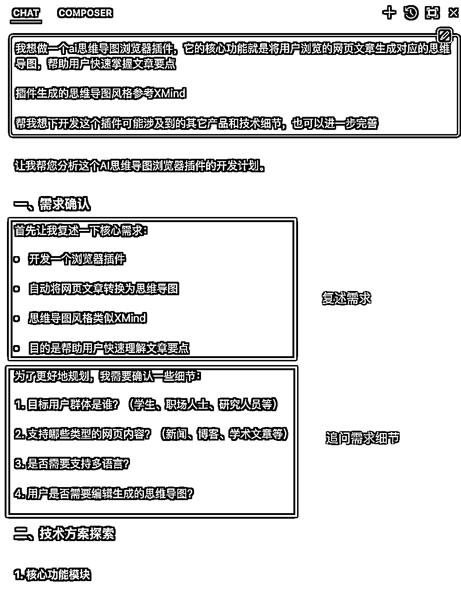

### 5）Chat和Composer搭配使用

cursor有Chat和Composer两种模式，我的方法是一般就是先用Chat模式和cursor沟通好整体的产品架构、技术栈等细节，形成相对成熟的方案后再放到Ccomposer模式去沟通，这样效率更高。这是因为两者的侧重点不同：

*   Chat模式：主要用于和cursor对话，你可以问它有关代码的问题，获取即时的反馈和建议。

它的特点就是互动性强，适合快速解决问题；适合处理具体的代码问题或获取代码片段。想象你在一个虚拟的编程论坛上，向一个智能助手提问。你输入：“如何在 JavaScript 中创建一个数组？”助手立即回复：

```
const myArray = [1, 2, 3, 4, 5];
```

然后你继续问：“如何添加一个元素到数组中？”助手又给出答案：

```
myArray.push(6);
```

在这个模式下，你可以快速获得代码示例和解决方案，适合快速学习和解决具体问题。但如果你想将这些代码应用到实际开发中，就需要自己创建好文件并一个个复制粘贴过去。

*   Composer模式：更侧重于代码的撰写和编辑，你可以在这个模式下进行长篇代码的编写、更改。区别于Chat，Composer生成的代码是会帮你直接弄到文件里了，不用复制粘贴。

它的特点就是提供了checkpoint（代码回滚）、iterate on lints（代码检查修复）等更多的编辑工具，适合撰写完整的代码文件；支持代码的组织和结构化，适合大型项目的开发。

想象你在一个代码编辑器中，正在撰写一个完整的 JavaScript 应用程序。你可以在 Composer 模式下输入多个函数、类和模块，像这样：

```
// 定义一个简单的函数
function greet(name) {
    return Hello, ${name}!;
}
// 使用函数
console.log(greet('World'));
```

在这个模式下，你可以使用代码高亮、自动补全和格式化工具，方便地组织和管理代码，适合进行复杂的开发工作。

### 6）部分限定提问

因为LLM具有随机性和上下文限制，所以每次提问cursor，它给出的下一步方案都可能和前面存在偏差（也就是它可能会删改以前的代码，甚至把原有的必要功能改没了），进而导致报错。

为了减少这种情况，可以每次提问会加上一句：

```
尽量不大改代码框架的前提下，给出最合适的代码方案
```

或者

```
我想增加某某功能，你需要注意的是：保证原有功能代码正常运行，不能把原来的功能改没了
```

这些限定提问没有严格的prompt，只要能让cursor理解就行。

为了避免上下文限制，我还会阶段性地把最新代码给cursor进行检查，比如之前的检查过程中，cursor就找到了一些重复代码，以及提供一些更全面的方案（比本地没有这个字体的话，可以替换成另一种可用字体，避免出现显示问题）。

### 7）让cursor分步骤指导

在git初始化或者其它项目开发的过程中，cursor可能会一下子给出很多终端指令，但对于第一次接触编程的小白来说，其实很多指令都是很陌生的。

这个时候可以告诉cursor分步骤一步步来指导你，你每完成一个步骤就给cursor一个反馈。及时反馈及时调整，基本很快就能解决问题。

## 3、代码执行篇

代码执行部分，对于大部分新人来说都是个难啃的骨头，所以用好这三个技巧，相信能降低不少阻力。

### 1）开启 iterate on lints

大家可能在终端运行经常都会遇到报错，然后每次都得复制将大段大段的报错复制到composer进行分析。

但其实cursor有个代码检查并修复的功能（虽然是beta版），只不过之前默认是关闭状态（最新版应该是默认开启的），大家下载后可以检查下这个配置，路径是“Cursor Settings-Features-Chat & Composer-iterate on lints”

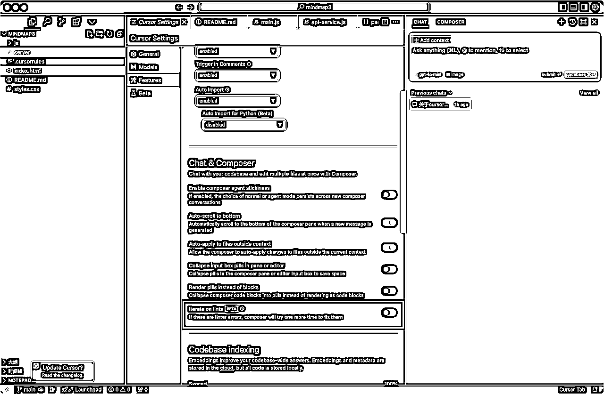

在写复盘的时候，发现cursor最新版上线了一个bug finder功能，据cursor自己介绍，这是个实验性的新功能，可以分析你当前分支与主分支之间的代码更改，但运行费用会很高。

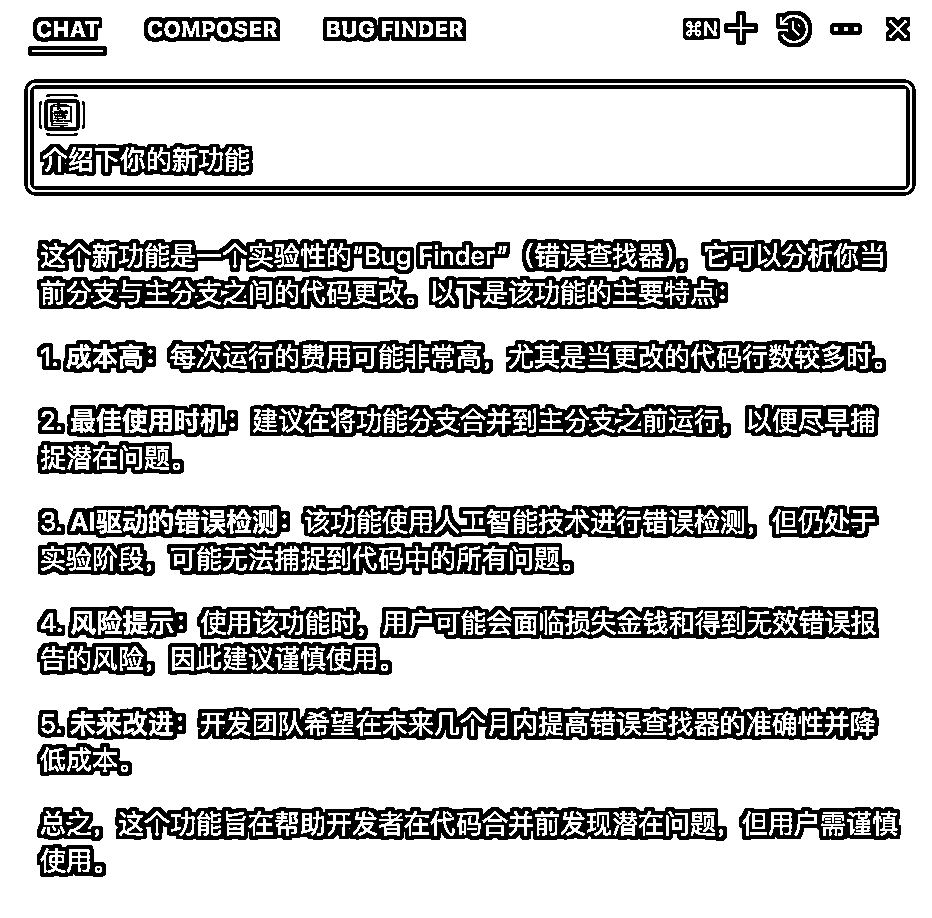

### 2）输出日志

在cursor运行代码的过程中遇到bug，是我们做项目几乎无法避免的，为了帮助我们更好地定位和解决问题，可以这么给cursor提出要求：

```
在【某功能】的执行过程中，输出关键日志信息
```

### 3）先 save 再 accept

大家其实不用那么着急着去点accept all，因为你也不知道cursor每次生成的代码是不是正确的，更高效率的方式去先点save all，验证无误后再点acce all，整个效率会高很多，当然如果你不小心点到了accept all，也可以用前面的checkpoint进行恢复。

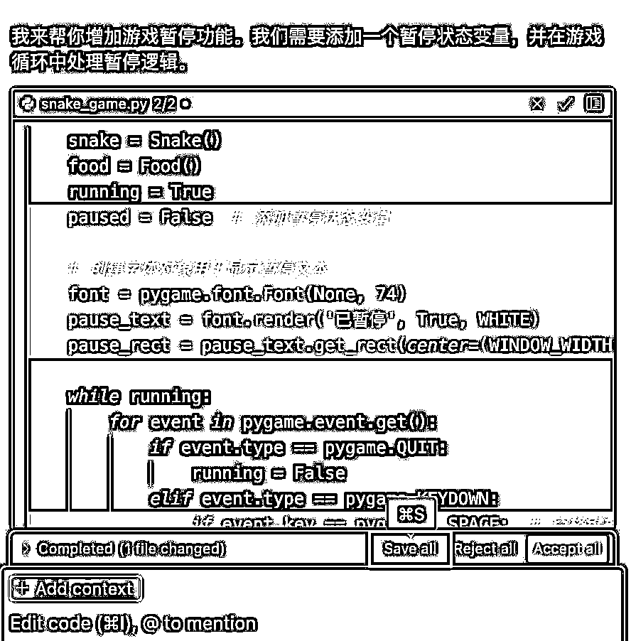

### 4）后期尝试看代码

在项目后期，可以去尝试看代码，我们不需要做到像开发人员那样，只要做到能够理解代码运行逻辑即可，对于帮助我们更好地推进项目是有一定帮助的。

以Youtube本地下载站新增的批量移除功能为例，可以看下面那张截图，实现删除功能的先后顺序是：先在后端添加删除API，然后在前端添加删除功能。

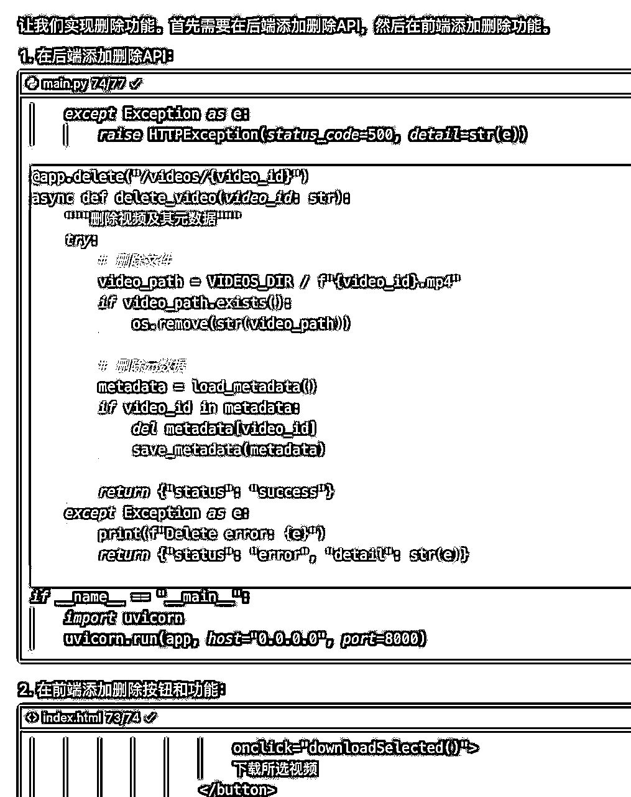

后端根据业务逻辑，定义和添加『删除』这个程序接口（API）并提供给前端调用，然后前端根据设计图（当然cursor中极大的减少甚至可以取代这一步）构建用户界面，并使用API与后端服务进行交互，获取数据并展示给用户（比如删除后要更新剩余的视频数量）。

如果将整个过程进行拆解还原的话，大致是这样的：

*   前端任务：

*   构建『历史下载视频』的展示页面，让用户能够浏览过去下载的视频。

*   调用后端API获取历史下载视频列表。

*   提供一个删除功能，让用户能够对无用的历史视频从列表中移除。

*   使用CSS和JavaScript增强用户体验，比如添加全选删除功能。

*   后端任务：

*   设计和实现『历史下载视频』 API，供前端获取相关视频数据，这里就包括视频标题、时长、作者等信息。

*   管理数据库，存储上述信息。

*   处理增删视频的逻辑。

## 4、代码管理篇

使用cursor多了之后，你必然会经历一个问题：就是代码被cursor改坏了，你想回到上一版/上N版正常的代码该怎么办？大方向上就两种，一种是用cursor自带的checkpoint，一种是用git管理。

### 1）善用 checkpoint

利用好cursor composer模式下自带的check point（chat模式是没有的），这是一个很容易被我们忽略的使用功能。简单来说，它能实现这么一个效果，就是当composer每次输出新代码，cursor都会记录到checkpoint里。当你发现对话几轮后cursor给出的代码效果不理想，就可以找到改动前的chekpoint，然后点击它右侧的check out，它就会帮你把所有文件都恢复到这条消息之前。

这是在cursor里最代码管理最简单的方法。

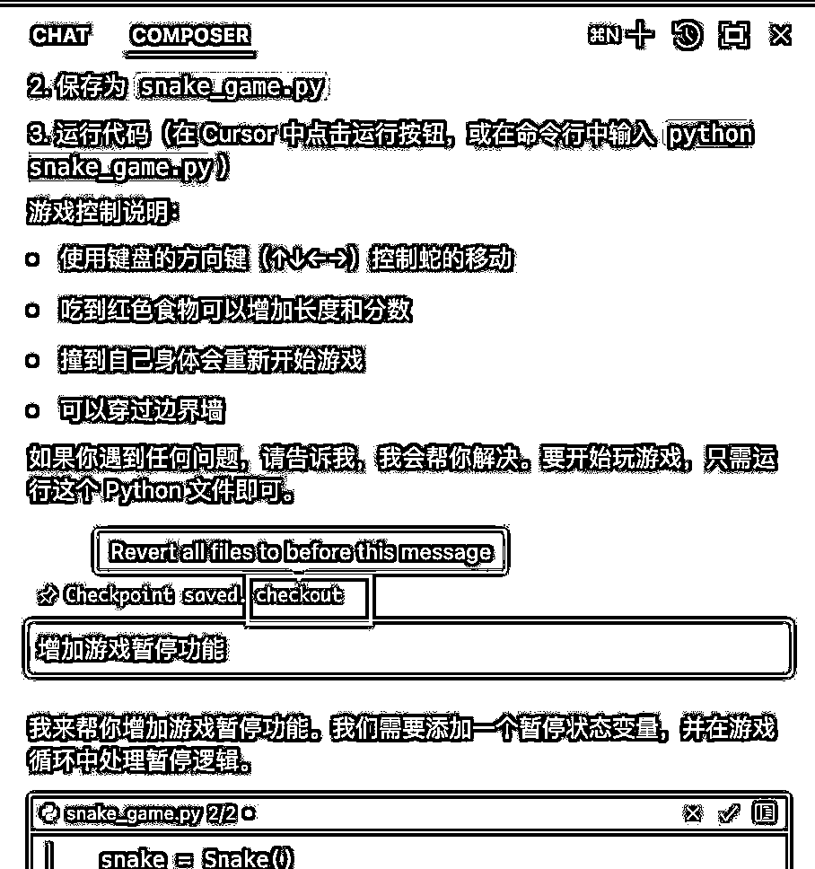

### 2）学会 git 管理

但是，ai的上下文限制，使得checkpoint其实有一定的局限性，所以更科学的方法是学会用git管理，而git管理根据你搭配使用的工具不同，大致可以分为下面三类：

*   git命令+Gitlens插件（Gitlens的安装和前面的中文插件安装方法是一样的，这里不追溯）

*   git命令+Github Desktop

*   纯git命令行

无论是哪一种，都需要懂一点git的运行逻辑。下面就简单介绍下git，仅适合编程新人阅读：

git将项目的存储分为4部分，每部分有自己作用：

*   Workspace：工作区（当前用户操作修改的区域）

*   Index / Stage：暂存区 （add后的区域，对应 git add）

*   Repository：仓库区或本地仓库（commit后的区域）

*   Remote：远程仓库（push后的区域）

整体过程可以简述为：

*   1）工作区–>add–>暂存区–>commit–>本地仓库区–>push–>远程仓库区

*   2）远程仓库区–>fetch–>使用refs\remotes下对应分支文件记录远程分支末端commit_id 和 本地仓库区–>merge–>工作区

*   3）远程仓库区–>pull–>使用refs\remotes下对应分支文件记录远程分支末端commit_id and 本地仓库区 and 工作区

也就是下面这张图：

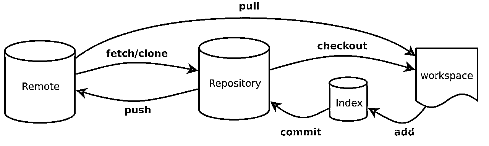

图源：CSDN@阚学霸

我们这里重点只讲第一部分的过程及相关指令：

1、初始化仓库：

```
git init
```

2、添加文件：如果是将你选哪个要跟踪的具体文件添加到暂存区，就用：

```
git add 文件名
```

如果是添加所有文件，就用：

```
git add .
```

3、提交更改：这个过程会将暂存区的文件提交（commit）到本地仓库区，每次commit都会生成对应的hash值（大家可以简单理解为每次代码提交的一个版本id，每个id都是独立的，用于后续快速定位要回滚代码的版本）

```
git commit -m “提交信息”
```

（这里引号内的提交信息，一般可以命名为某次改动的点，方便以后查找）

4、查看历史：用于查看当前分支下的所有commit历史，关注的是代码的演变。当前入门主要用这个：

```
git log
```

用于查看 HEAD 的操作历史，关注的是对引用的所有操作，包括那些可能已经丢失的提交，则用这个：

```
git reflog（）
```

5、撤销更改（已达到回到某个历史版本的目的）：有 git reset 和 git revert 两种，两种存在细微的差别。

举个例子，想象你正在写一本书。你的工作流程是每次写完一章后就提交（commit）一次。现在你有以下几个提交（commit）：

commit A：写了第一章

commit B：写了第二章

commit C：写了第三章

当你发现第二章（commit B）写得不好，你决定完全删除它，并且不想保留任何痕迹。你就可以使用 git reset 将书的状态回到commit A。这么操作的结果就是：第二章的内容被完全删除，书中只剩下第一章。你可以继续在第一章的基础上重新写第二章。这个时候用的指令是：git reset --hard HEAD~1 # 回到提交 A（注意，我们这里用的是hard reset，所以第三章内容也没了）

而git revert则不同。

当你发现第三章（commit C）有一些错误，但你不想删除它。相反，你想在书中添加一页，用于说明第三章的错误并给出修正。你就可以使用 git revert 创建一个新的提交，专门用来撤销第三章的更改。这么操作的结果就是：书中仍然保留第三章，但在后面添加了一页，说明了错误并给出了修正。这样，读者可以看到原来的内容和修正。

需要特别注意的是，在git reset中又有三种不同的reset，分别是 hard reset、soft reset（我们在前面说的就是hard reset）。还是用刚才的例子进行说明：

1）git reset --hard：当你发现第二章和第三章都写得不好，决定完全删除这两章，回到只剩下第一章的状态。你就可以使用 git reset --hard 将书的状态回到commit A。结果就是：第二章和第三章的内容被完全删除，书中只剩下第一章。所有未保存的更改也会被丢弃。

2）git reset --soft：当你发现第二章写得不好，但你想保留第三章的内容以便后续修改。于是你决定只删除第二章。你可以使用 git reset --soft 将书的状态回到提交 B。结果就是：书中仍然保留第一、第三章的内容，但第二章被删除。第三章仍然在暂存区，你可以直接对第三章进行修改并重新提交。

至于git branch暂时还不太懂，这里就不介绍了。

## 5、番外篇

### 平价组合Cursor+Deepseek

就像我前面提到的，cursor给新注册用户送的fast requests其实很快就会消耗完，这个时候大家普遍面临着要付费Pro（20美刀）的问题，所以有些人会去淘宝或者闲鱼上花几十块买个共享账号，但这种账号的风险在于不稳定，很容易封号或点数清零（因为这种低价账号很多是靠盗刷信用卡购买的）。

如果暂时还没确定自己是否要付费Cursor Pro订阅，但又想继续使用Cursor。好消息是，Cursor 支持自定义 API，坏消息是没法用composer等cursor特有能力。如果你最后还是决定用自定义API试试，那可以继续往下看。

第一步：在 Deepseek 开发者平台或者 SiliconFlow 申请 API Key（Deepseek给新用户500万tokens，即使购买也便宜，2块钱百万tokens）


第二步：打开 cursor settings -> 点击左侧 Models。点击 Add Models，这里的模型名字需要与 api 里调用的模型名字对应。然后关闭其他的模型，不然等下验证不通过

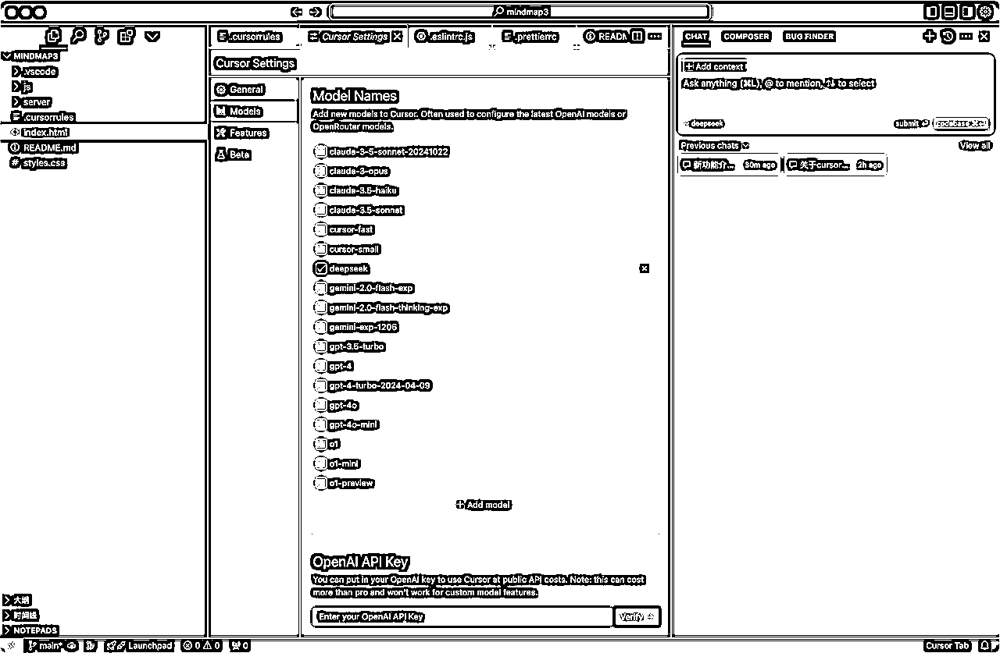

第三步：在下方 OpenAI API Key 处填入申请的 key，点击 Override OpenAI Base URL，在下方输入对应 api 调用的网址，点击 Save 和 Verify，验证是否正常。

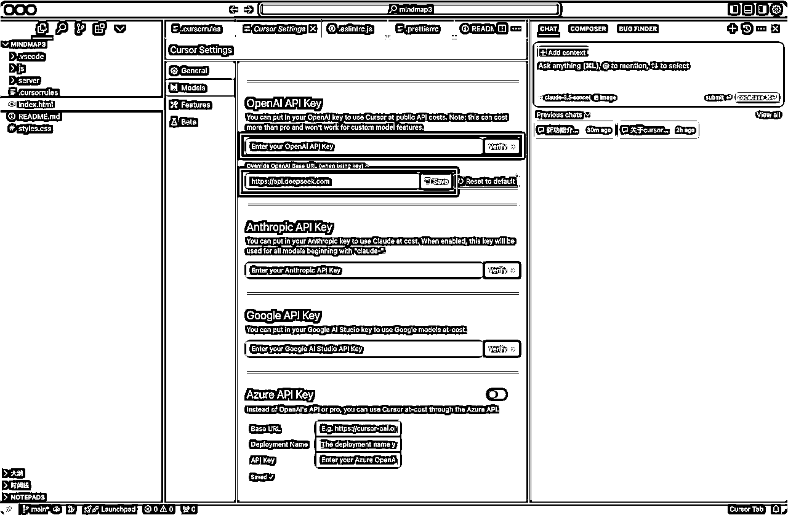

搞定后就可以开始写代码了~

# 三、cursor航海项目分析&常见卡点

## 1、cursor航海项目的设计分析

之所以做这次航海项目的设计分析，是因为自己在航海进程到1/3的时候，突然发现这些项目顺序的安排和项目类型的选择，都大有深意。后面就有意识地去补充学习了相关知识，对更好地理解cursor项目应该会有帮助，所以这里一并整理分享出来。

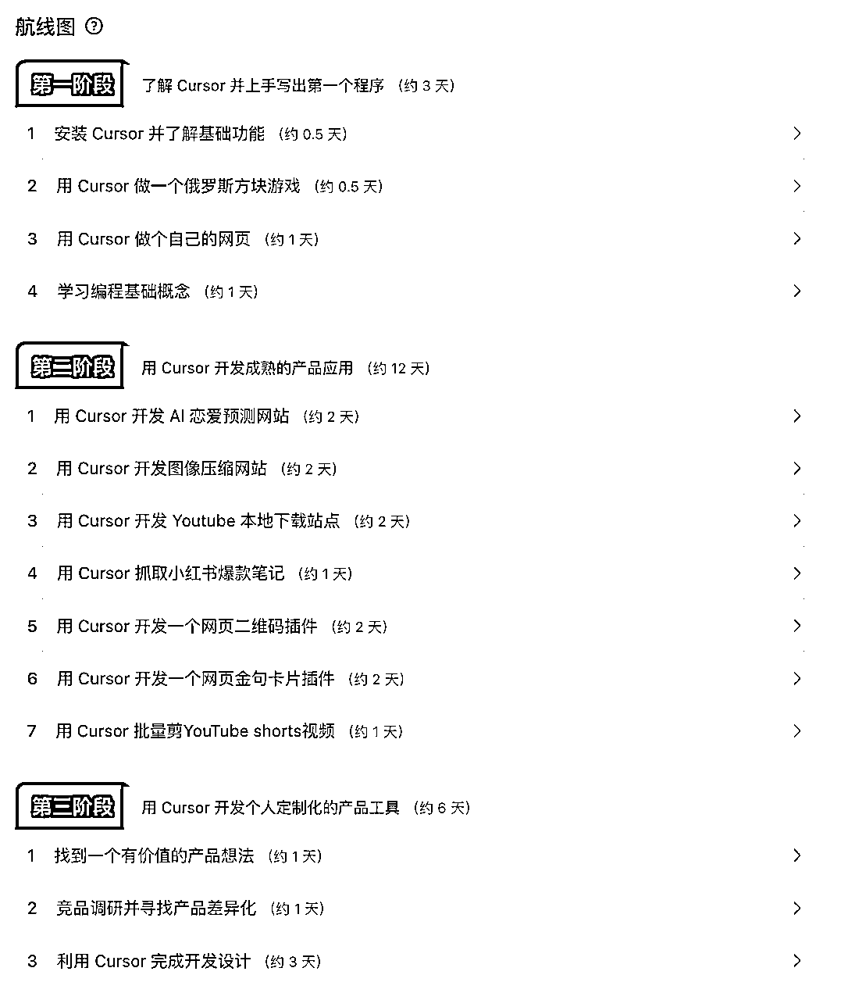

从项目类型看，这次航海的开发项目包括：

*   本地运行的小游戏（俄罗斯方块）

*   只涉及前端交互的工具站（图片压缩网站）

*   涉及前后端交互的网站（AI恋爱网站、Youtube本地下载网站）

*   Python脚本控制（抓取小红书爆款笔记、批量剪Youtube shorts视频）

*   浏览器插件（网页二维码插件、网页金句卡片插件）

项目顺序基本按照由简单到复杂的顺序进行安排：

*   俄罗斯方块：主要跑通Pygame，而且程序可以运行在本地（非常适合给新人建立信心）

*   图片压缩站：技术栈采用HTML+CSS+JS，适合构建简单的静态页面或小型动态网站

- HTML负责页面的结构，CSS负责页面的样式和布局，JavaScript负责页面的行为和交互

*   AI恋爱网站：技术栈上采用了React+Node.js，这是一个更现代的技术组合，通常用于构建大型、高性能的Web应用，尤其是在需要高性能和良好用户体验的情况下

- React专注前端的UI构建，它的核心就是组件（Component），所以整个项目我们可以将UI分解成一个个独立的、可复用的组件，每个组件管理自己的状态和行为。在安装的时候，系统会让我们选择项目需要哪些组件，比如这次AI恋爱测试站就涉及form、button之类的，这样我们不用设计稿也能以组件化的方式构建复杂的用户界面。

- Node.js是一个运行时环境，允许JavaScript在服务器端运行，使得开发者可以使用JavaScript来构建后端服务，实现前后端同构。

至于Python脚本控制，以及浏览器插件，也是如此。

## 2、cursor航海项目的常见卡点

这里主要整理了航海项目一些常见卡点，方便大家快速找到解决思路：

### 卡点1：Python版本与pip指令不一致

*   适用项目范围：

1.  使用 Pygame 等库开发简单的游戏（比如这次航海的俄罗斯方块）

1.  使用 Pillow 和 OpenCV 进行图像处理和计算机视觉任务（比如批量剪辑视频）

1.  使用库如 Pandas、NumPy 和 SciPy 进行数据处理和分析（比如爬虫和数据分析）

1.  使用 Flask、Django 和 FastAPI 等框架构建 Web 应用程序

1.  使用 TensorFlow、Keras、PyTorch 和 Scikit-learn 等库进行模型训练和预测

cursor不会直接根据你的设备，以及你安装的Python版本给出对应的终端指令，所以有时候我们会遇到这么一种情况就是，即使根据cursor给出的pip指令运行但依然报错。这一般就是pip指令和Python安装版本不一致的问题。

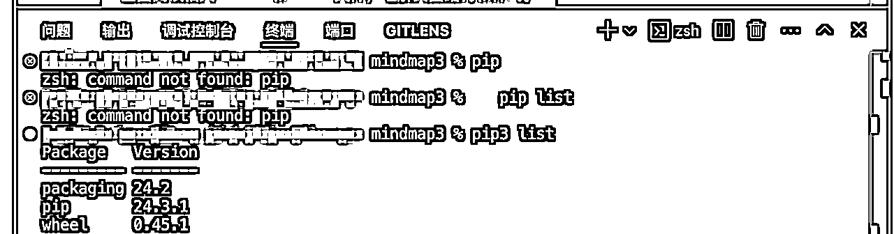

所以我们需要理解Python安装版本与pip指令的基本关系，才能在后续减少这种问题的发生（其实我就是为了减少fast requests的无效消耗）

1）pip指令与你最初安装的Python版本有关。如果你最初安装的是Python 3.x，通常使用pip3来安装库，以确保您安装的是与Python 3.x兼容的库。如果最初安装的是Python 2.x，则使用pip来安装库实现兼容。如果不兼容，运行终端指令时就会经常报错。

2）如果同时安装了Python 2.x和Python 3.x，在这种情况下，一般需要使用pip和pip3来分别管理不同版本的库。为了避免库版本冲突，也可以在虚拟环境中安装库

3）Cursor并不会主动帮你判断你是否安装了Python，以及安装的Python是哪个版本，但你可以这么操作进行查询：

*   第一步（确认是否安装Python）：打开终端，输入指令，python3 --version 或者 python --version，这一步就可以确定你是哪个版本

*   第二步（确认是否安装pip）：根据你前面得到的版本信息，如果是3.x，就使用指令 pip3 --version，如果是2.x，就是用指令pip --version，如果你看到pip的版本号，说明pip已安装。

*   第三步（检查已安装的库）：指令pip3 list或pip list，这将列出所有已安装的Python库及其版本。你可以在列表中查找本次项目所需要安装的库。如果没有，就进入第四步。

*   第四步（安装缺少的库）：如果你发现某个库（比如 pandas）未安装，可以使用以下命令安装它们：pip3 install pandas或者pip install pandas。

安装完成后，你可以再次运行pip3 list或者pip list命令，确认这些库是否已成功安装。

### 卡点2：找网页页面标签

*   适用项目范围：各种社媒、网页相关内容的爬取

航海中有一个项目是抓取小红书爆款笔记，其中涉及到小红书页面标签的获取，这是不少航海成员的卡点。这里就以小红书页面标签的获取为例（操作同样适合其他社媒、网页）：

在小红书笔记的空白处点击鼠标右键，Mac电脑选择最底部的“检查”（Win电脑印象中是“检查代码”，也可以按F12），然后就会唤起一个叫“开发者工具”（Developer Tools）的窗口。

在大多数现代浏览器中，包括Chrome、Firefox、Safari等，都内置了开发者工具，以便开发者检查和调试网页的HTML、CSS和JavaScript代码（做过SEO的小伙伴对这块应该会很熟悉）。

首次接触的小伙伴也不用担心，如果你打开的“开发者工具”显示英文（首次打开应该都是英文），直接在窗口上方找到并选择“Elements”选项（如果中文界面的话就找到“元素”选项，你不用看这里面的代码，直接Ctrl+F，在唤起的搜索窗口中输入“detail-title”或者“detail-desc”，然后你就能快速定位到这篇笔记在代码中的标题和描述，而标签，就在这串标题和描述代码的下方，对应的字段名是“hash-tag”。

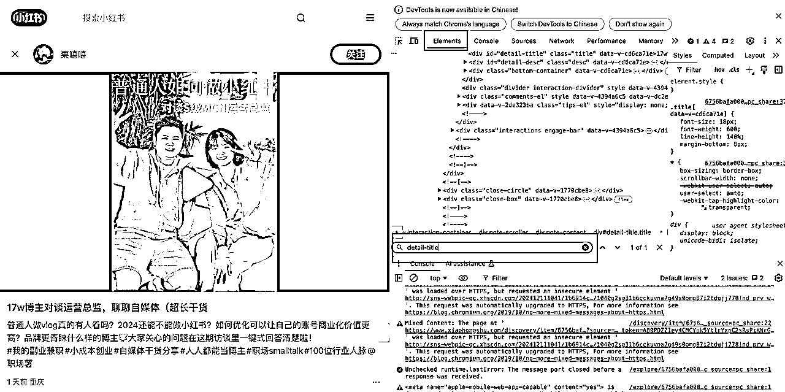

如果定位到“detail-desc”还没有找到“hash-tag”，其实就是因为代码行被折叠了，你点击那个向右的三角形，当它变成向下你就可以找到“hash-tag”了。

### 卡点3：找页面 cookies

*   适用项目范围：各种社媒、网页相关内容的爬取（尤其是需要登录要登录才能查看或下载的内容）

同样以小红书为例，如果你将找cookies的问题抛给cursor，但你又没能描述清楚你的目的，那你可能就会获得两种找小红书cookie的方法，一种是航海手册里提到的“开发者工具-Network（网络）选项卡”，一种是“开发者工具-Application（应用）选项卡”。

千万别选后者去找cookie，因为它们展示的信息和用途有所不同：

"Application" 选项卡下的 "Storage" 部分显示的是当前域名下存储的所有 cookies。在这里，你可以查看每个 cookie 的名称、值、域、路径、到期时间、大小、HTTP 标志（如 HttpOnly 和 Secure）以及 SameSite 属性。你还可以在这里直接对 cookies 进行增删改查操作，例如添加新的 cookie、编辑现有 cookie 的值或删除某个cookie。

"Network" 选项卡显示的是每个网络请求的详细信息，包括请求头（也就是这一次需要到的 "Request Headers" ）、响应头、查询参数等。在 "Request Headers" 标签下，你可以看到特定请求中实际发送到服务器的 cookies。这里展示的 cookies 是当前请求中浏览器自动附加到请求头中的，你可以看到 cookies 的实际发送情况。不过你不能直接在 "Network" 面板中编辑 cookies，因为它主要用于查看和分析。

那在"Network" 选项卡中怎么快速找到这次开发项目需要到的cookies呢？

大家打开“开发者工具-Network（网络）选项卡”，然后刷新一下你当前打开的小红书页面，这个时候你就会发现Network（网络）选项卡下的“Name”会刷新很多条记录，其中位于最上方的记录（一般是蓝色icon，如果担心找错，可以查看它的文件名，是对应着这条小红书笔记在域名后的那串URL，如下图所示）

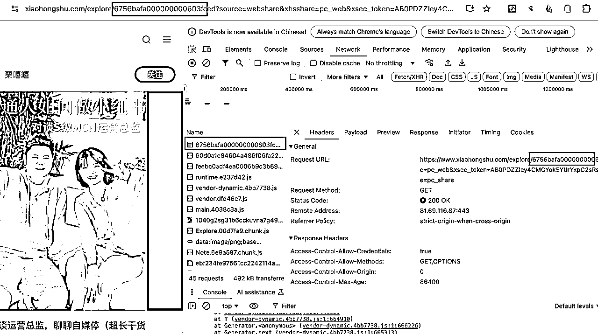

选中这条记录后，在右侧面板的“Headers”拉到下面的“Request Headers”找到“Cookie”，然后复制粘贴进cursor给你生成的.py文件中的对应位置。

### 卡点4：重复加载已解压的拓展程序

*   适用项目范围：浏览器插件开发

我之前在做网页复制浏览器插件，因为完全不懂浏览器插件的开发，所以每次代码更新就重复进行“加载已解压的拓展程序”的动作，非常低效。后面我才了解到开发者模式下的手动更新和已经发布后的更新是不一样的：

*   开发者模式下的手动更新：在开发者模式下，开发者可以加载解压缩的扩展程序进行测试。在这种情况下，开发者可以手动更新代码（直接点那个“刷新”icon即可），并通过浏览器扩展页面的“重新加载”按钮来应用更改。但这仅限于开发和测试阶段，不适用于已发布的插件。

*   已发布的插件的更新：一旦插件被提交到浏览器的扩展商店，更新过程就由商店控制。如果开发者想更新代码并且让用户使用上新版本，开发者需要提交新版本，审核通过后用户端的插件通常就会自动更新，因为大多数现代浏览器，如Chrome和Firefox，都为插件和扩展提供了自动更新机制。这意味着一旦插件的新版本在商店中发布，并且用户的浏览器配置为自动更新，插件将自动更新到最新版本，无需用户干预，除非用户关闭了自动更新。

总结来说，开发者在开发阶段可以通过开发者模式手动更新和测试插件，但这种手动更新方法不适用于用户端的已发布插件。

### 卡点5：错误地将初始创建的完整项目文件夹进行“拓展程序的加载”

*   适用项目范围：浏览器插件开发

不同于此前的浏览器插件项目，这次的金句卡片生成插件不是将初始创建的项目文件夹进行“拓展程序的加载”，而是将这个项目内生成的dist文件夹进行加载。

注：cursor通常会创建命名为dist。当然，每个人情况可能还不太一样，不过很容易辨别。因为项目根目录下的文件夹就几个，包括自动生成的src、node_modules，以及我们自己创建的public，后者是用来放各种icon的。

如果你将项目文件夹进行加载，一般会遇到这样的报错：

```


“未能成功加载扩展程序文件
~/文稿/cursor开发文件/highlight-card
错误
无法加载背景脚本“background.js”。
无法加载清单。”
```

这个错误提示表明背景脚本 background.js 无法加载。我们需要检查以下几个方面:

1.  文件路径: 确保 background.js 文件存在于 src 目录下，并且在 vite.config.js 中的路径配置正确。（经过几轮排查，这个通常是没有问题的）

1.  清单文件: 确保 manifest.json 中的 background 字段正确指向 background.js。（经过几轮排查，这个通常也是没有问题的）

1.  构建输出: 确保在构建时，background.js 被正确打包到 dist 目录中。

1.  Chrome扩展管理: 确保在Chrome扩展管理页面加载的是构建后的 dist 目录，而不是源代码目录。

真正的问题其实就是出在3和4。定位到问题，其实解决起来就不难了，针对3和4的问题去提问cursor然后根据它的引导就可以解决。

### 卡点6：终端生成文件与实际运行文件不符

*   适用项目范围：涉及终端指令新建文件夹的开发项目

初学cursor的小伙伴，大概率会在开发项目里遇到需要新建文件夹（用于存放特定文件）的情况，有时候cursor会给出指令让大家新建文件夹，但如果我们不清楚项目文件结构，以及代码指令，很容易出现明明按照指令新建文件夹了，但最后就是运行失败。

这么说可能有点抽象，给大家举个我在航海项目中的实际例子，方便大家理解：

之前在AI恋爱项目开发过程中，我按照cursor指令做完所有流程，但在运行项目后打开本地的测试链接（一般是 http://localhost:3000），每次显示都是NEXT.js的欢迎页面，即使中间让cursor提供了其它技术方案也还是一样。当时我经历了几轮排查：

第一轮解决方案：我对旧项目进行了删除，然后重新一步步来，但后面还是陷入了死循环（失败告终）；

第二轮解决方案：我还是对旧项目进行了删除，然后重新引导，中间还是陷入了和之前一样的死循环，及时把每次的报错都给了cursor，cursor依然无法定位到问题所以。这种情况下，我对cursor提出跳出这个技术栈的限制，换个思路重新找解决方案，后面它就提供了一种每次都在终端上运行的执行。这种指令的确解决了测试页面一直不生效显示的问题，但带来了一个新问题，就是每个功能增删甚至是样式调整，都只能复制粘贴到终端，然后再运行，整个效率非常低，这不是cursor开发应用应有的流程，肯定是有问题的（失败告终）；

这时候我知道不能死磕在这上面，所以把问题留给到今天早上（一直解同一个bug却始终不成功真的很磨人，所以建议大家遇到类似的bug可以先放一放，无论是做其它项目，还是看个视频吃个东西还是睡觉放松真的很必要）

第三轮解决方案：把旧项目删的干干净净，重新来。但这一次不同的是，我每一小步都让cursor进行详细的描述，解决一小步再让cursor推进下一步，这样我就能更好地控制变量以便排查定位bug（cursor一次性生成多个代码文件确实是它的有点，这也导致了问题定位往往不太方便）。

正因为这一步的调整，我在推进代码运行前期发现了一个很小但很致命的问题（这个昨天我完全忽略了），就是我一开始创建了一个中文命名的文件夹，然后用cursor打开，这在之前的俄罗斯方块应用和图片压缩工具站都没有遇到问题，但放在AI恋爱测试站上，这个问题很致命。

因为文件少，所以当我去打开这个项目文件的时候，发现一个问题，有两个page.tsx文件，分别在这个项目里的不同路径中，两个文件刚好不一致。所以我就问了cursor一个问题：

”你帮我创建的page.tsx的文件，在cursor编辑器里打开，和在vscode编辑器里打开，显示的内容是完全不同的？怎么才能做到两边是同步的？“

然后cursor终于醒悟了，给出回复：

“让我们一步步解决这个问题：

首先，让我们确认文件路径。在终端中运行：pwd

确保我们在 /Users//Documents/cursor开发文件/婚恋/love-mathc 目录下

然后，让我们修改文件内容，确保两边都能正确显示：

在保存文件后：

关闭 Cursor 和 VSCode 中的文件

重新打开这两个编辑器

重新打开文件

如果还是不同步，请告诉我：

Cursor 中显示的具体内容

VSCode 中显示的具体内容

文件的具体路径（在两个编辑器中都检查一下）

这样我可以帮你找出问题所在。”

至此，终于定位到问题了。

简单梳理下，具体是这样的：

当我们打开这个中文命名的文件夹（为方便理解，这里的中文名文件夹就叫做 恋爱测试，下同）后，按照cursor的步骤正常推进，它会创建一个page.tsx的文件，这个文件的路径是/Users/username/Documents/cursor开发文件/婚恋/src/app/page.tsx，这个文件是实时创建并在cursor编辑器中打开，文件里的内容就是你最新页面的代码，但这个文件并不是被实际调用的文件。

如果不熟悉指令，你还会在这个过程中稀里糊涂地根据cursor的指引，在原本的”婚恋“文件夹下创建出一个新的，名叫love-match的文件夹（cursor会自己帮你翻译成英文然后创建），而这里面，也有一个page.tsx的文件，文件路径是/Users/username/Documents/cursor开发文件/婚恋/love-match/src/app/page.tsx，这个才是实际上被调用的文件，而文件夹的代码内容就是NEXT.js的欢迎页面。

# 四、写在最后

当回顾这次cursor航海，我想最大的收获可能还不是cursor的入门，也不是自己能够独立开发一些简单的应用来解决自己日常的卡点，而是一个心得：自己才是最重要的，别完全被cursor牵着走。

因为是编程小白，所以前期更多是cursor主导，尽管开发和部署都成功了，但大多还是一知半解，以至于很多刚入门的小伙伴，可能都有和我一样的疑问：和cursor的协作到底是人驱动ai完成项目，还是ai在驱动人重复机械地按下accept按钮？

诚然，cursor懂得几乎所有的技术栈，你问它任何一个技术问题，似乎都能得到答案。但是，它不具有智慧、不具有经验，甚至记忆它也不具有（当然也是所有LLM的通病），所以在我们提出一个问题的时候，它确实能组合出很多方案，却很难根据我们的当下现状，去给出一个最优解。

这种时候，我们人类的作用就发挥出来了。

比如你可以详细地描述好自己的需求，如果可能，写份详细的prd出来。大部分你和cursor对话磕磕绊绊的原因，其实是你对自己的需求都描述不清楚，甚至很多时候不是描述不清楚，而是你都没想清楚自己的需求具体是啥。

这里的具体到底要具体到什么样子，还是举个例子，比如你做个网站，然后很多个页面都需要用到表格，你是将这些页面的表格用组件进行实现，还是cursor干一个页面写一套，干下一个页面又写一套，这是需要你判断的；又比如你要给页面加一个搜索功能，那这个搜索你是要只对标题进行搜索，还是也搜索描述，甚至标签，甚至创作者名称.....

这就是我们前面提到的，很多时候是我们自己没有想清楚需求，而不是cursor或者ai不行（当然，ai也不是万能的）。

最后的最后，用航海中@大铭教练 的一句话结束吧，大意是说，“我们是1，cursor和其它ai才是后面的0”。2025一起加油~