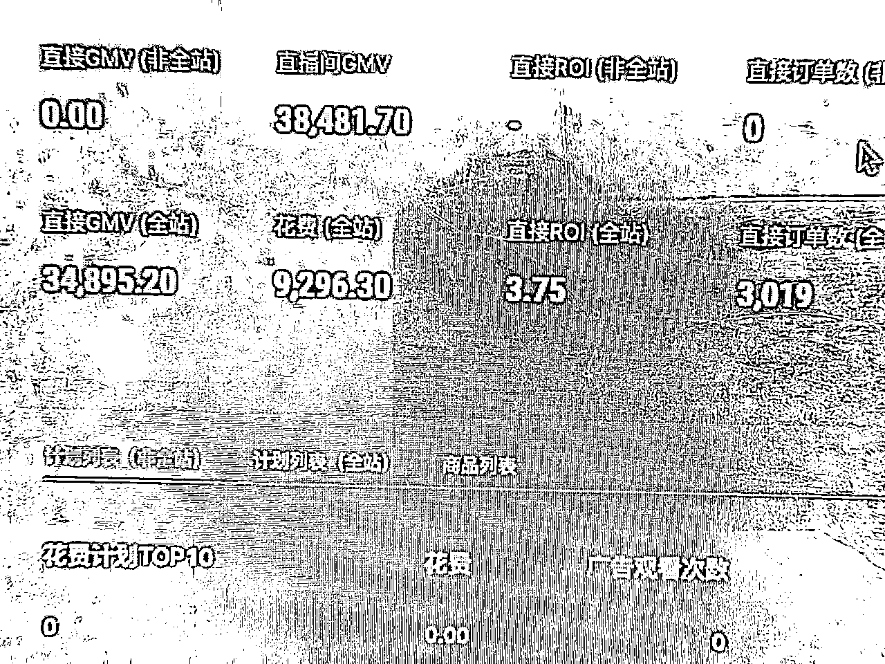
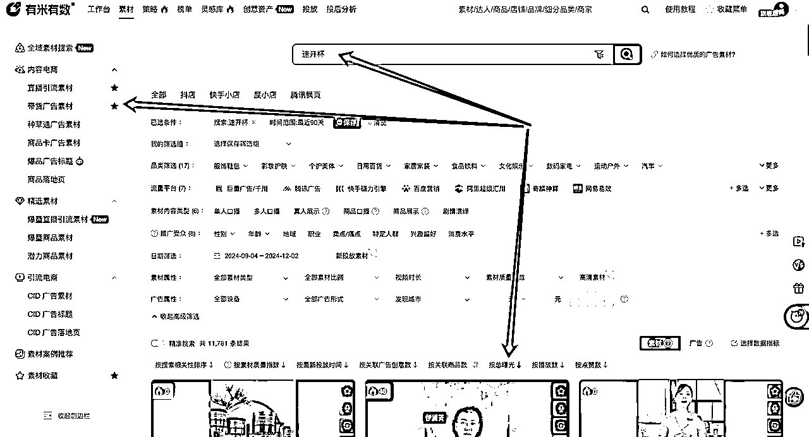

# 快手数字人单品付费打爆保姆级教程

> 来源：[https://s94d3ho0dr.feishu.cn/docx/N510dMHW4os001xx6KOcqmfQneg](https://s94d3ho0dr.feishu.cn/docx/N510dMHW4os001xx6KOcqmfQneg)

hello，大家好，我是迪伟，自我介绍一下

*   22年快手无人直播，累计变现100W+；

*   23年转战抖音单品付费，深耕付费素材的制作技巧及流程，通过原创脚本、原创拍摄，在抖音上把一个白牌食品打到top3级别；

*   24年专注快手数字人付费，目前已打出6个头部爆品，单品日销售额4W+；

潜水了很久，今天第一次在星球发帖，主要和大家分享下快手单品付费这个项目；

# 项目简介

*   快手数字人单品付费到底是什么？

这个项目，其实就是通过付费加热带货短视频，最终通过短视频挂车或是引流到直播间进行成交转化，而在快手上面，直播间成交这一环节，是交给数字人进行承接，并没有真实的主播；

*   项目的优点是什么？

*   成本低：素材上面，大多数可以搬运或混剪抖音上的爆款素材，在一定程度上减少了拍摄剪辑的人力开支，在投放上面也减少了一定的测试成本；在直播上，可以用官方的女娲数字人系统，省掉了真人主播的成本；

*   确定性高：选品和素材是这个项目成功的关键，而选品和素材大多数都是搬运或者混剪抖音平台爆过和验证过的，对比抖音等其他平台，更容易拿到结果；

*   可复制性强：项目的环节分为选品、投放、素材、直播，每个环节都是可以标准化流程的，所以可复制性比较强；我们在把流程标准化后的开始阶段，曾经6个号同时在直播，即使流量较差的时候，当天保底利润也在2000+；

*   收益稳定：项目的一切操作都是合规的，不会存在录播封号等违规情况；一个品虽然是有周期的，但是项目可复制性强，一旦矩阵化运作后，不断地测品打品，整体收益会比较稳定；

*   他适合哪些人？

*   有一定资金规模，但是缺乏稳定项目或者基本盘的团队或个人；

*   之前在抖音打过品的团队；

*   我为什么做这个项目以及拿到的结果：

22年入局内容电商后，第一个成功的项目就是快手搬运和无人直播，那个时候经历过日赚5W但是第二天早上就死号，循环往复，虽然有时赚的多，但一直没办法正规化和放大；

步入23年后，一直就在思考如何正规化和稳定化的事情，当时的认知，如果要正规化和放大，必须建立在合规且能够复制的基础上，所以23年死磕素材和付费投放，最终在抖音拿到一定结果，但随着抖音比价系统的上线以及同行越来越卷的情况下，利润就一直在下滑；

今年4月份后，偶然在朋友圈刷到快手可以进行数字人直播，当时觉得这是一个非常利好的消息，如果数字人直播能够合规，那么意味我们可以省掉很大一部分的主播成本，所以带领团队进入到这个项目；经过一些时间的打磨，最终拿到结果并将标准化流程跑出来；

在做的过程中明显能感觉到，对比抖音付费来说，这个项目大大节省拍摄剪辑、测品成本、以及主播的成本，而且快手平台不像抖音那么内卷；对比自然流的项目，这个项目合规且稳定，不是吃了上顿没下顿；

# 项目详解：

## 选品

### 要求：

相信不少的人在选品时会有疑问，这么多的产品，我到底应该选什么类型的品，什么类型的品适合做内容电商？

我们不妨思考一个问题，当我们在卖货的时候，我们本质是在卖什么，以及消费者在为什么买单？

回归到这个问题的本质，其实不难发现，绝大多数的消费行为，其实都是在为需求买单；那么需求对应到我们的产品上面，其实就是产品的卖点；即我这个产品解决了消费者的某某需求或痛点，所以消费者才愿意去下单；

而当我们想要把这个产品卖出去，那么对应的则是需要在产品的带货/引流视频中，传递出产品的卖点或是消费者的痛点；那么我们的选品，也需要尊崇这一规律；

要求一：卖点可视化，通过视频能够将产品的卖点很好的呈现；比如下面两个视频为例：

第一个视频开头展示拆开产品，再到折叠组装，收纳效果展示，组装和移动效果展示；

第二个视频开头展示用户痛点（需要固定床单），在引入产品，产品使用前后效果展示；

要求二：有量，产品的量决定了测品成功后收益的上限；如果是在抖音上面，一般我们要找月销超过100W以上的才行；

要求三：品质不能太差；品质太差，退货率上涨，会变相增加我们的付费投产要求；如果被平台命中劣质产品，则会下架甚至被罚款；

### 方式：

#### 抖音

可以通过抖音养号的方式去刷，找一个抖音新号，碰到卖货的直播间全部点进去加购，收藏，关注，点赞，让系统知道你是对卖货类型的账号或内容感兴趣，那么后续给你推荐出卖货的账号就会越来越多；当找到一个意向账号后，我们在去考古加等数据平台查该账号的销量数据，以及直播间流量结构（需要付费占比为主）；

#### 考古加

在考古加我们可以通过以下方式去找：

找达人：达人列表选为直播达人，在筛选列表中，查到符合我们选品条件的达人（付费单品为主）；

找商品：直播为主，且有投流的商品；

找直播：筛选出付费比例在50%以上的带货直播，在详细查看该直播的详细数据（付费单品为主）；

#### 有米云

通过直播引流素材中，时间选择一周，我们一般主要会看日用百货类目，找到最近爆的素材，用素材去找品；

通过短视频引流素材中，选项和直播引流素材类似；

也可以通过有米云中的爆量直播引流素材、爆量商品素材去找；如果有有米云，把有米云后台的功能一定要用起来；

## 投放

### 投放的底层逻辑（理论基础，如果实操可直接跳到计划搭建的模块阅读）

相信不少的朋友对于付费总会觉得很神秘或是迷惑，为什么我的投产不高？为什么我的账户没有消耗？后台这么多种计划，这么多种操作，我应该如何搭建计划和投放？

今天我们一步步来解开这个神秘的投放系统，了解它是怎么运作的，以及我们如何更好的使用它；

#### 广告的售卖逻辑

我们现在做一个假设，如果你是一个短视频平台，现在你要卖广告，广告主在你这里可以进行的操作就是调整广告的出价以及给你提交对应的广告内容，那么面对N多个广告主，这些广告位到底应该给那个广告主售卖，应该给那个广告主先卖给那个后卖？（可以思考1分钟，再往下看）

现在我们来做几种假设，如果广告平台遵循价高者得这个规则，那么出价高的广告主则会先拿到流量/广告位，与之带来的影响则是，平台上面可能会充斥大量用户体验极差的内容，但是由于出价高，仍旧跑的很好，那么对于平台的生态和消费者的体验则会带来非常差的影响；如果换一种方案，广告内容优质的可以先拿到流量/广告位，与之带来的影响则是，消费者体验很好，但平台的营收可能会受到影响；

最终这些平台在综合了内容质量、广告主出价，引入了一套ECPM的竞价体系；

那么ECPM这个竞价体系，到底是由哪些因素组成的，以及是如何进行排序和运作的，我们现在引入ECPM值这个公式：

ECPM=CTR（点击率） * CVR（转化率） * 出价 + GPM/IPM/小店评分等，我们来挨个看这些指标的定义：

CTR（点击率）=行为数/广告曝光数，行为数则是指点击广告进入商品落地页或点击进入直播间的次数；如果投短视频引流直播间，则是指用户看了短视频后进入直播间的比例；

CVR（转化率）=直接订单数/行为数；如果是投短视频引流直播间，则是指支付的订单数除以广告的点击数（也就是通过短视频进入直播间的人数）；

出价：则是指广告主在计划中对于转化目标的出价；

GPM/IPM/小店评分，这个模块抖音、快手平台考核的指标不同，主要是一个增益数据；

通过这个指标的定义，我们不难发现，CTR、CVR、GPM/IPM这些，其实是和素材质量强相关的（暂时抛开产品这个变量去看），而出价则是和广告主的调控相关的；

广告主在出价后，平台会结合广告主的出价以及素材的CTR、CVR等数据，最终计算出每个广告主的ECPM值，然后在用这个值去排序，进行广告先后顺序的分发；

看到这里，其实不难发现，如果我们要想降低广告成本，那么我们可以操作的其实就是优化我们的内容/素材，提高我们的CTR、CVR等数据，使我们出价低但是仍旧能够拿到流量；

当我们熟悉了投放的底层逻辑后，我们接下来会再去拆解ROI的构成因子，以及对CTR、CVR进行归因分析；

#### ROI的决定因素

ROI=GMV/广告消耗=（点击率*转化率）*客单价*1000/广告千次展现费用；内容电商平台，广告都是按照曝光去扣费的（非点击扣费）；

##### 点击率

点击率=行为数/广告曝光数；对于短视频引流直播间来说，则是指用户看了短视频后进入直播间的比例；那么我们应该如何提高这个比例呢？

我们将素材拆解开进行分析；一个素材如果要把用户能引入直播间，那么开头要做的就是能吸引并留住目标用户，也就是说，素材的3秒完播率、5秒完播率要足够的优秀；当把目标用户留住后，其次要做的就是给用户在传递我们产品的优惠，或者其他卖点，亦或是一些行动的提醒，从而让用户能够更好的进入我们的直播间；当然，在整个环节中，最重要的还是素材开头的吸引/留人能力；

##### 转化率

转化率=直接订单数/行为数；如果是短视频引流到直播间，那么转化率其实和我们的主播话术、直播场景、商品定价，强相关；如果是短视频挂车，那么和我们的产品定价、以及产品的主图详情图强相关；

##### 千展成本

千展成本=花费/广告曝光*1000；不管是磁力金牛还是巨量千川，广告的扣费规则都是按照展现去扣费，不是按照点击等其他行为扣费的；那么千展成本的高低，其实就是反映出了流量的便宜与贵；

那么流量什么时候会便宜，什么时候会贵呢？

*   当竞争对手变多的时候，也就是僧多粥少的时候，流量就会变贵；（一般大促期间，千展成本普遍都会上涨）

*   当你的产品价格变高，对应的目标购买用户变少，人群质量/消费能力变高的时候，流量就会变贵；（一般产品涨价后，千展成本也会随之上涨）

*   当系统探索人群难度变大，人群范围变窄的时候，流量就会变贵；（计划如果搭建人群包、达人定向、莱卡等，千展成本也会随之上涨）

#### 不同计划的区别和特点

##### 最大转化

###### 简介

最大转化：是一款 仅设置「预算」与「投放时长」，无需限定成本（出价）的智能出价产品，用户给出「预算」与 「时长」，平台交付该时空下的「最大转化量」；

更加详细的介绍和说明，建议阅读官方文档：https://docs.qingque.cn/d/home/eZQAOhr3HprG4Hb3DbyfXL7j9?identityId=206uL3bhSl9

###### 优点

系统根据大盘流量&实时转化效果动态调整预算分配及出价，其中跑量为最优先，探索的人群价值更广，促成更多的转化；

###### 缺点

没有成本保证及赔付；

##### 成本保护

###### 简介

成本保护：用户设置出价/ROI目标后，系统以此作为出价基准，尽量去获得更多的流量和消耗；

更加详细的介绍和说明，建议阅读官方文档：https://docs.qingque.cn/d/home/eZQAOhr3HprG4Hb3DbyfXL7j9?identityId=206uL3bhSl9

###### 优点

成本有保证，超成本有赔付；

###### 缺点

跑量能力无法确定，用户设定的出价/ROI如果没有竞争力，计划将不会消耗；

#### 我们应该如何搭建计划（实操可直接看这个模块）

##### 测品阶段

在测品阶段的时候，我们主要会面临这些问题：

*   账号没有模型；

*   素材和产品都是新的，那么到底出价多少合理？如果出价高，计划容易跑飞导致亏钱，如果出价低，计划没有消耗，无法积累有效数据；

在结合上述计划的优缺点来看，在这个阶段，我们一般搭建最大转化的计划是比较好的，因为它既可以保证有消耗，也不至于让计划跑飞；

我们现在一般的流程则是每个品最少准备15条素材以上，然后用最大转化进行搭建，然后观察3-5天，如果有投产打正的素材，那么说明这个品和素材都是可以的，然后在转为控成本计划；如果跑3-5天，素材投产普遍都比较低（低于盈亏线的60%），则放弃这个品；在原则上，我们不死磕一个品，只测品，不磕品；

##### 测品完成阶段

这个时候我们已经测出这个品有投产打正的素材，那么要做的就是在保证成本的情况下，让系统无限放量去跑；这个时候我们一般会建出价计划和ROI计划，两种都会去跑；跑1-3天后，会在上全站投放继续跑，然后持续更新和迭代素材；

## 视频素材

当我们决定测这个品的时候，接下来最重要的就是要准备这个品的视频素材；在找视频素材这一步，我们遵循的原则就是只找爆款和成功的案例，接下来给大家分享几个寻找爆款对标的方式；

### 找对标方式

方式一：抖音

抖音上面主要用搜索功能，搜这个产品相关的关键词，然后将点赞比较高的视频下载下来，当做我们的对标；例如找速开杯这个产品，主要就是搜产品相关的关键词进行查找，然后将点赞比较高的视频下载；

方式二：有米云

在有米云上面，我们一般会将产品关键词在直播引流素材和带货广告素材进行搜索，搜索排序中选择按照总曝光倒序；依次找到和产品相关且曝光比较高的素材下载当做对标；如果在抖音上面有刷到同时在卖这个产品的对标账号，我们也可以直接搜这个账号，看这个账号的投放素材；

方式三：考古加/蝉妈妈

考古加/蝉妈妈这些工具，我们主要通过找商品、找视频两个方式去找对标素材；

找商品选项中，输入该产品的关键词，然后找到视频销量高的链接，点进去后在看对应的视频列表；在这里需要注意，如果销量比较高的视频是大主播（董宇辉、罗永浩等）的切片或者账号，一般是不能当做对标视频的；我们要找的是那种纯产品展示且是素人的账号视频；

找视频选项中，时间选择180/365天，选择销售额排序；

方式四：快手

在快手中找对标的方式和抖音上的相似，我们通过产品关键词，找到点赞量比较高的视频进行下载；

### 剪辑

当我们找好对标了以后，接下来就是混剪对标视频，混剪的原则就是高度还原爆款，禁止创新；那么应该如何高度去还原爆款呢？我们将一条带货视频拆解开来看，视频是由文案、音频、画面组成的；那么我们要想高度还原，需要做到以下几点：

1.  保留原视频的文案/音频：爆款的文案和音频已经是被验证的，就不要再去做创新了，而且文案音频重复，也不会被系统判重；

1.  高度还原对标视频的场景；

1.  保留对标视频的前3秒或第一个镜头；通过上面投放的原理我们可以看到，视频的开头对点击率和留人能力影响非常大，所以在视频的开头，我们尽可能的不做任何更改，百分百还原爆款开头；

接下来就是剪辑的实操了，我们分为以下几个步骤：

1.  拆解爆款视频场景/画面

我们以下面床单防滑垫这个视频作为对标，按照分镜来顺序进行拆解：

床上粘贴胶带-引入产品-铺床动作展示-铺好床后人物滚动效果展示-床单放在地上效果展示-铺地板动作展示-铺好地板后效果展示-铺好沙发效果展示；

1.  建立素材库

在这一步，我们需要将抖音上面和这个产品相关的素材进行下载，用剪映的智能镜头分割功能进行拆解，当做我们的混剪素材库；

1.  按照拆解的画面和场景进行高度还原（音频和文案用原视频的，不做更改），具体的操作步骤如下：

1.  将对标视频音频分离；

1.  按照拆解的分镜顺序，从素材库中找到对应的替换片段（对标视频的第一个镜头需要保留）；

1.  检查视频的卡点、时长等细节，如果有时长过短的片段，则需要补镜头，如果有时长过长的片段，则需要剪掉部分镜头；

上述步骤的工程文件截图以及最终的成品效果如下：

## 直播

### 话术要求

我们的直播间是单品直播间，进入到我们直播间的用户，大部分都是被短视频已经种草后来的，所以我们直播间反复循环讲述这一款产品既可，整个的话术框架如下：

场景营造/介绍+卖点介绍/强调+同类品对比+引导购买/逼单；

我们以速开杯这个产品为例，它的话术框架大概是下面这样：

*   场景营造/场景介绍:

*   场景一：开车人群：有经常开车的家人们，咱是不是每次开车喝水都超级的麻烦，杯盖拧不开还很不安全，有这种烦恼的家人们，这款速开杯一定要带回家啊，有了它再也不用担心开车喝水麻烦或者不安全了，咱这款杯子采用按钮式杯盖 ，您只需要单手就可以轻松打开，让你既能喝上热水也不影响开车，密封性好摇晃不漏，高硼硅玻璃材质防爆耐晒，放在车里喝水真的特别方便；

*   场景二：外出游玩（钓鱼）：咱们直播间肯定也有喜欢钓鱼的家人，咱们每次钓鱼的时候是不是都腾不出来手喝水，一渴渴一天，非常不方便，这个时候要是有咱们这样一款速开杯，单手就可以轻松开盖喝水，真的太方便太好用了；

*   卖点介绍/强调：

*   一键开杯，开车必备；

*   免费刻字，定制专属你的杯子；

*   茶水分离，喝茶不吐渣，不管你泡什么茶都能过滤，茶水过滤网做的是SUS304不锈钢材质，用的久了也不会生锈；

*   同类品对比（同品不同价，同价不同品）：

*   某猫某东，像这样的杯子，最少也得八九十了，我们今天只要19.9还给您包邮刻字；

*   别的家19.9可能只有一个小容量的还不刻字，我们家这个今天19.9大容量包邮还给您刻字；

*   引导购买/逼单：

*   主播还有XXX分钟下播了，现在拍的，都是可以免费刻字的，下播后，我们刻字都要加5块钱了，所以现在抓紧去拍，把这波福利早点带回家；

*   后台现在库存只剩个位数了，主播卖完这波就要给家人打包发货，明天在开播就没有这个福利价格了，所以现在刷到就赶紧拍，犹豫徘徊等于白来；

### 数字人直播间搭建方式

数字人直播间搭建的详细方法，这里就不展示详细说明了，直接阅读官方的文档既可：https://docs.qingque.cn/d/home/eZQB7A0wslQ-q8_miKHibTS3S?identityId=1tRE9siQVuu#section=h.oefno1q0npv2

## 厂家对接

### 找厂家的方式

找厂家的方式我们一般会去拼多多、1688找，一般找的时候，我们主要会用产品的价格进行筛选，最终筛选出三四个备选厂家，然后主要沟通以下几个问题：

*   是否做一件代发（有的厂家只做批发，不做代发）

*   哪些地方需要加运费，哪些地方不发货（根据这个设置我们后台的运费模板）

*   产品是否有合格证，如果做代发能带上合格证吗，如果是3C数码产品，产品是否有3C标（产品如果没有合格证，容易被打假的投诉和索赔）

*   是否有快手面单（如果没有快手面单，后续订单同步过去有可能打不出单，无法发货）

# 感想和总结

*   选品>素材>直播>投放：卖货的本质，就是卖需求；飘柔即使宣传的再好，和尚也不会买它；一个好的品，只要素材上面稍微努力下，就能起飞，但一个差的品，即使你素材在怎么努力，起到的作用也是微乎其微；

*   一个好的生意，必须要具备几个条件，合规/符合平台规定，有稳定的利润（不能吃了上顿没下顿），可复制（意味着上限高）；

*   抓住时代的红利很重要，现如今抖音付费的红利已经趋于消失，但快手付费仍旧有比较大的红利，尤其在今年官方推出数字人的工具后，大大节省了主播的开支，对我们中小商家更是一个红利；

*   多实操，拿反馈，多总结，做时间的朋友：以这个项目为例，当一切的方法（剪辑、投放）都变为透明的时候，那么什么才是所谓的核心竞争力？一定就是选品的命中率，而选品命中率这个东西，没有人与生俱来就很牛逼的，只有通过不断地实操，不断地反馈和总结，一步一步的去提高；一个优秀的狙击手，都是成千上万发子弹养出来的；但凡一招制敌的东西，都不是所谓的壁垒，而是信息差，壁垒都是稳打稳扎，一步一步形成的；

*   流量大的平台未必能赚钱，流量小的平台也不一定会亏钱：抖音有7亿日活和你没有关系的，快手有4亿的日活，也和你没关系的；和你有关系的只是你的同行，你的同行已经拼的刺刀见红了，那么你进去了也只是送人头，你同行都垃圾的要死但还赚得盆满钵满，那么你进去大概率也能吃到肉；

以上就是我对快手数字人单品付费项目的全部分享，希望对大家有帮助，有感兴趣的圈友们，可以一起交流学习，分享这个帖子也是希望可以获得更多志同道合的圈友，一起生财，共同富裕！