# 新手入局temu 3个月 登顶家具畅销榜Top1经验分享

> 来源：[https://ke53ufsrvc.feishu.cn/docx/NPgddb4PJomg68xpWpfcIThMnNc](https://ke53ufsrvc.feishu.cn/docx/NPgddb4PJomg68xpWpfcIThMnNc)

各位圈友好，我是糖饼，坐标厦门。前手机品牌营销操盘手/电商平台小二，22年大厂毕业后开始与友人尝试创业，有过1-2个不在能力圈的项目都无疾而终。今年4月底加入生财，中途介入友人已有货盘的国内PDD电商（因ROI感人已摆烂）；8月开始试水跨境电商Temu全托管，其中一家店于11月初占据品类畅销榜NO.1，另外两家店日破千单，月利润率30%+，单店月入4w+，3个店月入10W+

对于一个从来没有做过跨境电商以及刚接触电商的我来说，期间的过程充满挑战，只能硬着头皮去刷航海手册（真的没想到能在生财有temu的航海手册❤️），以本文做个记录的同时也希望能够给躬身入局即将做跨境的小伙伴提供点帮助。

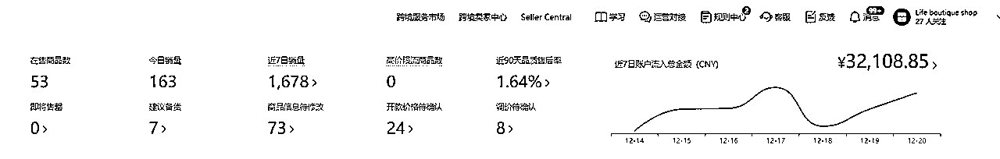

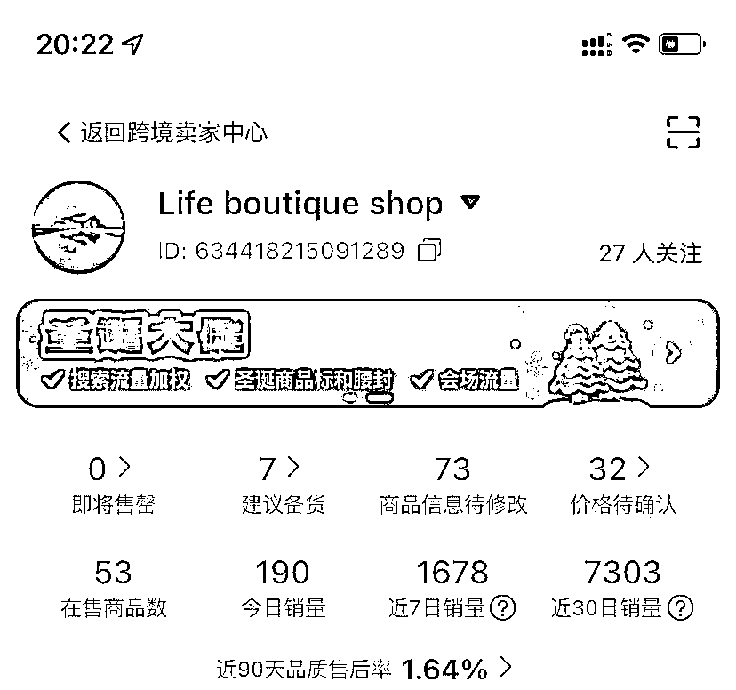

## 一：头等大事搞定选品/上品/核价

整个temu的流程包括：注册店铺 -> 选/上品 -> 核价 -> 创建备货单 -> 采购 -> 贴标 -> 发货 -> 日常运营，个人身份证就可以直接开店，建议新手刚入局可以1个店起步，后期可以做个体工商户开店（至多可以做20家店群）。基础性的问题在3月份的temu航海手册中都有提及，这里就不做过多重复。以下主要讲几个重点：

#### 怎么选到爆款

电商的核心问题就是选品，temu平台属于既没有流量抓手，也没有售后的抓手，你唯一需要花精力操作的就是选品（其他都是体力活可替代性高），选品定生死在全托平台中是最高真理，从你决定做这个品后就已经决定了你的订单量。 另，temu是pdd旗下以低价横扫全球😊，当下入局做店的大前提是不要考虑35以上高客单的品！！！（这里指的是采购价大于35以上的，在不管任何阶段都是出单较为零星，起店阶段根本不用去考虑这类产品） 想想看我们自己在逛pdd时决定会下单的终极决定因素是什么——价格

以下是本人较常使用的两种选品方式：

##### temu插件辅助选品+同平台市场竞争调研

必备选品工具：temu卖家助手 https://www.temushuju.com/goods/hot-sale

1、通过插件看销量——刚起店的可以重点看新店热销/大卖新品（上架时间：一个月），销量在1000 以内的，同时是被平台验证后有市场的产品

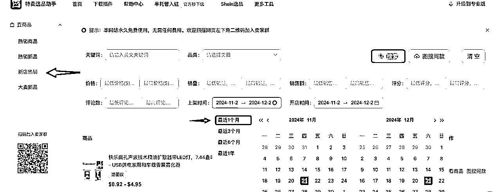

2、验证同平台该市场情况——数据筛选后，查看同款在线商品数量和销量数据，依此决定该产品是否上架。一般情况认为，在线商品数量＜6，上架一个月内，链接平均销量大于100的算是不错的产品

##### 站内机会/站内榜单跟款

机会商品中，重点关注站内稀缺、潜力商品，这边所有的品在站内不多且有官方流量扶持。可自行先查看站内同款数量多少（大部分是找不到或者同款数量绝对稀缺），再结合亚马逊销量情况判断是否上架。

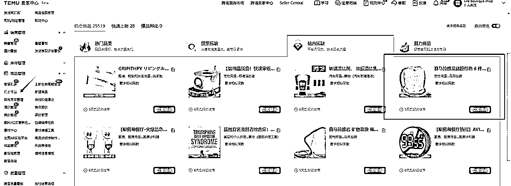

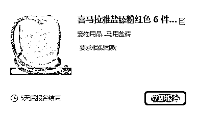

比如上面的这个机会商品，站内无同款，且亚马逊销量感人（月均1000+），结合1688的产品价格判断该产品（2-3kg）的SKU售价10元，两个装打包+贴标成本在21左右，大概率利润率在30%以上，直接上链接核价即可。核价同意后，会自动报名，如果不放心可以重新进入该机会商品报名页面，手动点击报名（如果上架没问题，在机会商品页面会自动抓取该商品连接）

切记注意，机会商品的报名要符合报名要求：商品类目+尺寸/SKU规格要完全一致，否则不会有官方的流量扶持。

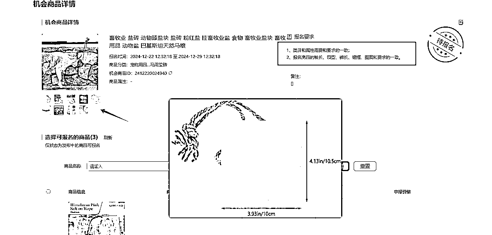

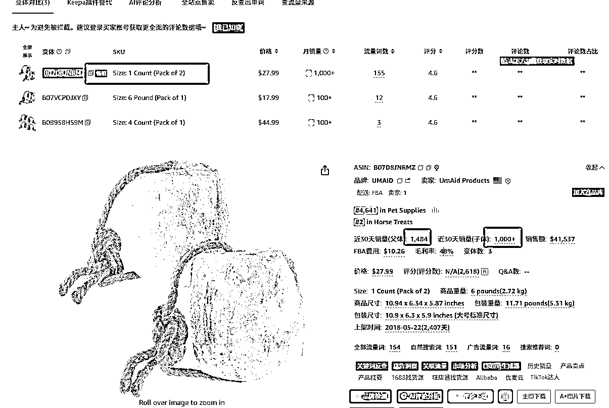

亚马逊插件——卖家精灵https://www.sellersprite.com/ 关注官方公众号，回复“推荐码” 获取长达30天的相应功能

小贴士：有几个选品禁忌一定要规避，不花冤枉钱必看！！

1、新手不要选：带电的（内含🔋都不行）/ sku多（手机壳/服饰/鞋/袜/手套）/ 易碎品 （玻璃/陶瓷等）/医疗/美容用品/挥发类产品/液体类产品/

2、看到选品助手/站内不错的品，评分低于4.5且评论数大于10条的尽量别选

3、花草树木在老外眼中都是活物，不要选不要选！！！！上架寄样后可能给你弹资质！！！

（此前选过一个宠物狗咀嚼木棒被判定需要活物的相关资质，简直恼火）

4、首饰类产品尽量不要选，也会弹资质（一般产品上架后会立马触发平台资质核查，也有延迟1-2天的情况发生）

5、今年11月起，所有食品接触类产品都需要资质|（油壶/水壶/零食盘等一切与食品接触类）

并不是所有弹资质的产品都不可做，在需要资质售卖的国家数量不多的情况下，还是可做的。如发现上架且核价有利润可做的产品链接触发平台资质需求，复制SPU ID——合规中心——商品资质上传

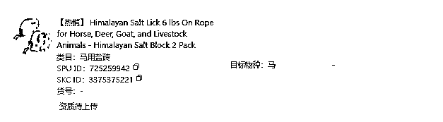

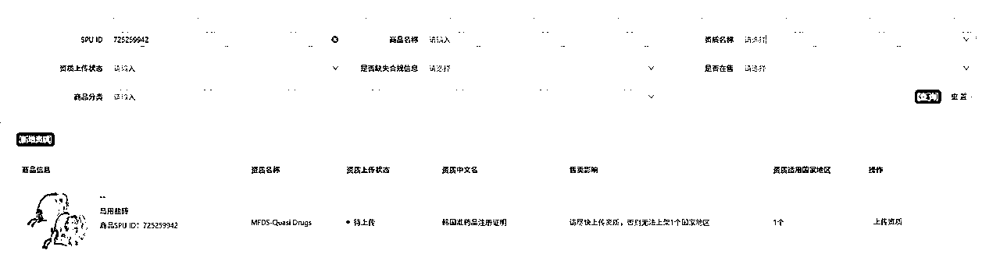

#### 如何高效上品

航海手册中有提到过采集上品的工具（店小秘），在试用了多款工具后结合本人的实战经验，这里给各位打算从事跨境业务的朋友推荐一个更高效+免费的——妙手（https://erp.91miaoshou.com），使用前需要添加授权，将授权token添加至妙手。ps：店小秘采集的商品无法发布至同个站点，除非用钱开路。

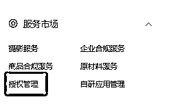

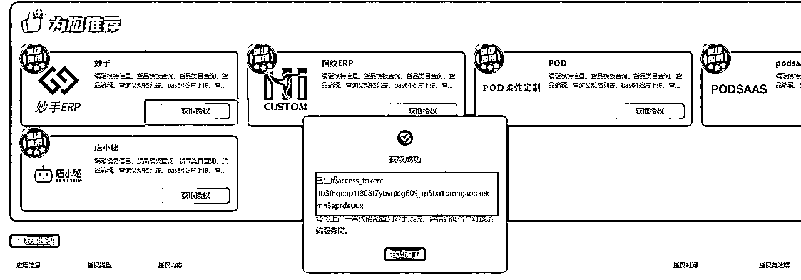

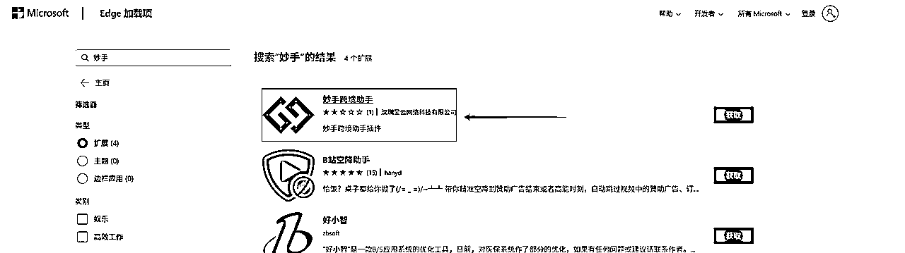

##### 使用妙手采集商品发布流程：采集——调整价格/SKU/上传标签图——发布（点击放大查看）

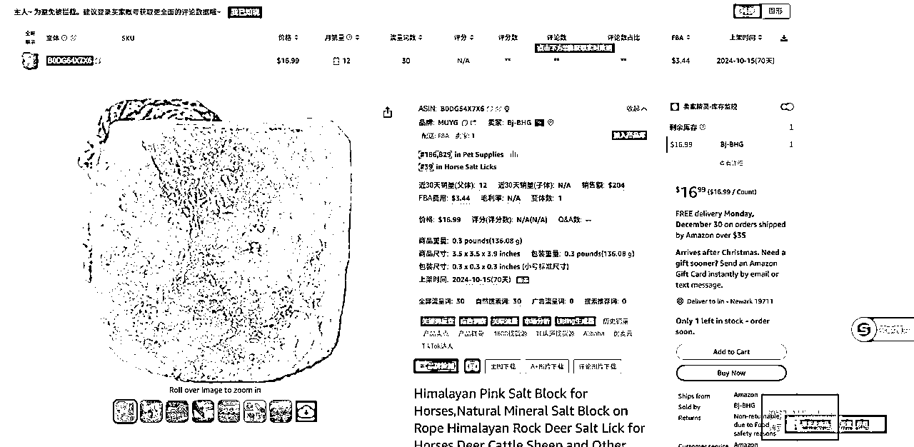

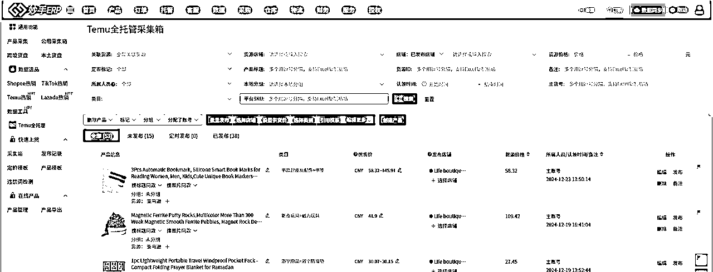

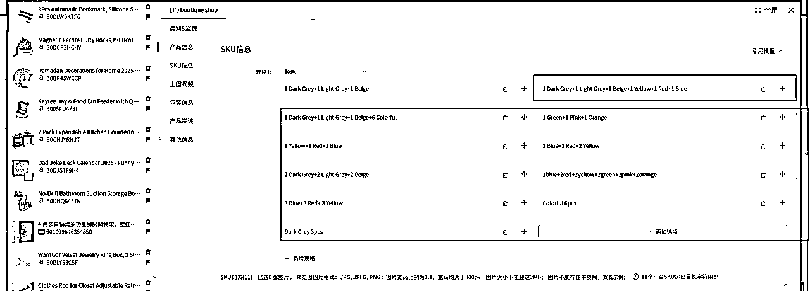

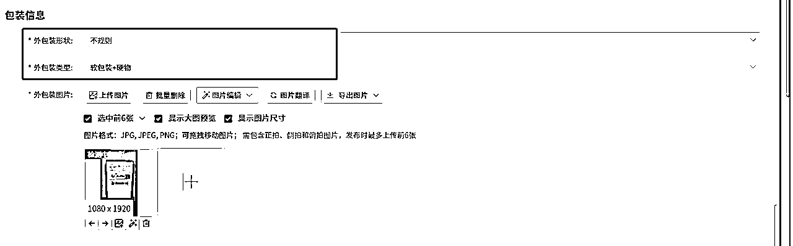

关于店铺运营需要遵循的几个小tips：

1、新店前期不用考虑做垂直，根据上面的选品方法找到合适的品上架核价即可

2、如原链接中含有多个SKU，务必只保留1-2个销售数据亮眼的款留下核价，这样做成本更可控（temu的首单需要备货10-15件，单个SKU更节约成本）

3、有效上品=符合原则的选品+有利润的核价，所有不符合这条原则的均为失败上品

4、如遇商品已经在temu后台，但是不核价，请参考下述的核价技巧

#### 核价技巧/商品差异化——批量链接+差异化主图

temu目前没有人工核价，所有的商品核价均为机器核算，我们选到的产品可能也有很多人会看中，大部分普货都是同款图，那么系统大概率是不核价或者核价无利润。但也有一些解决同款核价的工具，目前操作下来绕过系统判定同款的操作：调整SKU图/SKU名称（可写中文）/主图/主标题（突出材质部分的描述）

Linkfox 利用ai换背景图能解决部分差异化问题——https://www.linkfox.com/，官方有使用教程，可自行注册账号+客服领取“新人三天全功能限免大礼包”

例： 该款置物架上线的链接都是同一张图（左侧），利用工具抠图生成多种背景图，放到SKU图/主图中再去核价，核价不要仅限一条链接，同时发布多条链接批量核价（利用上品工具高效发布链接）

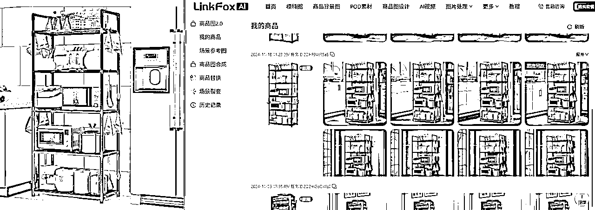

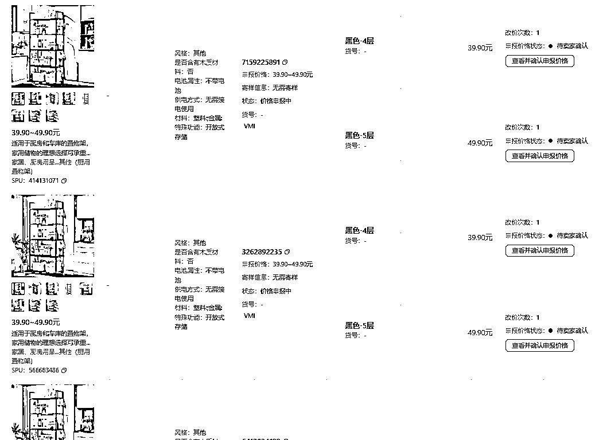

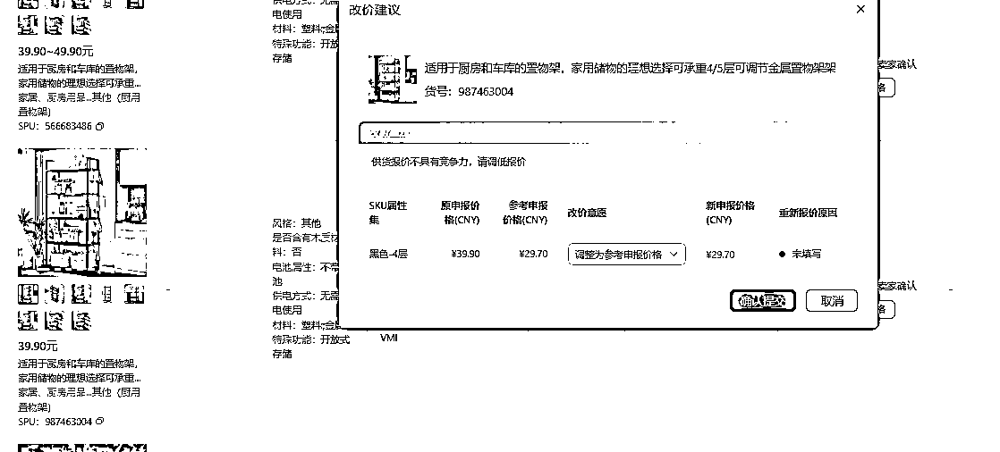

注：核价的过程中也别闲着，继续找下一个品，重复上链接+做差异化/核价的操作

## 二：发货/入库过程中的坑点

平台自11月初起，销售商品须遵守《GPSR》要求，不符合要求的商品将从欧盟和英国北爱尔兰地区下架。此前这个阶段，因为多个备货单贴标不符合平台要求，被退供，物流费上的损失没有多大麻烦，但！！！这也意味着已上架在平台的产品断流，损失了产品销售的时机。技术性流程（选品+上链接+核价）做好的前提下，实操性细节没把控好造成的影响往往得不偿失。

#### 资质+贴标 新人最容易踩的坑

一个合规的产品标签只需要符合欧代标准，如果是电器类产品需要英代，玩具类产品需要美代；所有的产品都需要有防窒息警示语，纺织类产品的标签上需特别标注纺织品，食品接触类产品也需要有专门的标志露出。

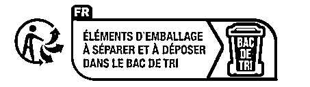

纺织品标识（例如枕套/枕芯等）

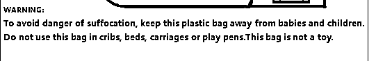

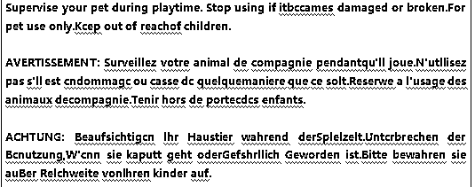

ps：新手开店前期做普货把欧代和防窒息弄明白就够，避开选品禁忌，从普货开始跨境掘金之路！

###### 什么是欧代标准

欧代其实就是欧盟授权代表。我们作为主体，把产品销往欧洲国家时，需要一个代理人作为渠道，沟通当地消费者和我们之间的联系。如果产品有问题，消费者直接联系我们比较困难，这时候就需要代理商起到纽带作用，保护消费者的权益。

###### 如何申请欧代

申请欧代可以通过一些合作机构来完成。进入店铺后，选择跨境服务市场，然后选择VAT及其他合规服务，找到欧盟授权代表。当然，如果你有信得过的长期合作的代理，也可以叫他们来做。另外，从海鲜市场/淘宝也都有办理欧代的卖家，一般一年/110，两年/178。

###### 上传欧代信息

申请完欧代后，接下来需要把欧代信息上传到后台。进入卖家中心——合规中心，选择负责人信息申报，选择新增代理信息申报。如果你是欧代，选择欧盟代理，把服务商给你的信息填上去就可以了。这些信息代理商都会一一发给你，有不清楚的问他就行。

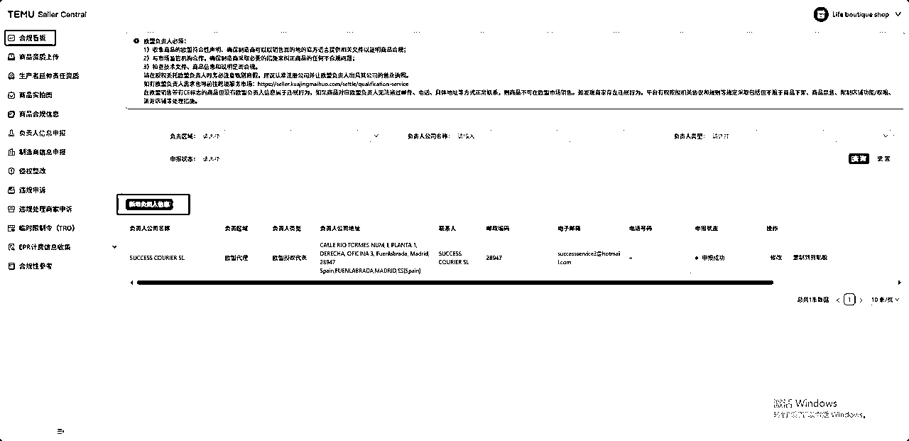

###### 极简且合规的标签必须包含的信息

下图就是一个合规标签，在新建商品的流程中，商品外包装图片的上传就需要这张标签实拍图（务必打印出来拍照上传）。所有的产品除特殊需求标识的产品外（如宠物产品/纺织品/），均可使用同一个标签照

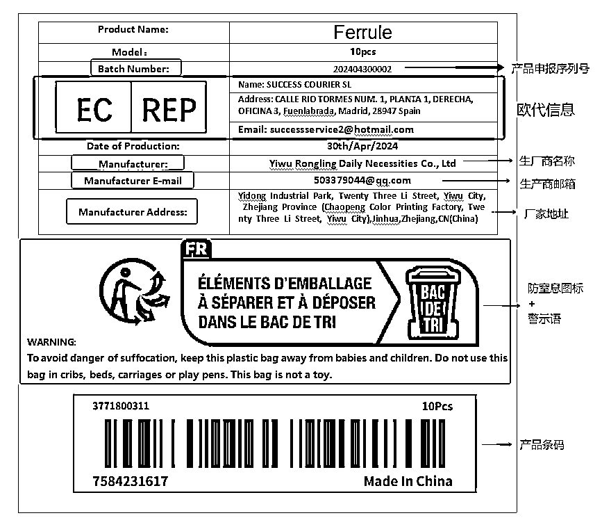

各种标签制作请查阅 ——https://dztool.shuaishou.com/tool/tag

注：工具只是辅助并不能满足所有需求，最终落地还需要根据供应商实际可提供的贴标尺寸情况做调整。

###### 产品合规信息申报

在走完整个选品-上架-平台核价-人工确认核价后，发货流程需要上传产品实拍图，点击【去处理】跳转到实拍图界面，上传的实拍图为此前已经制作的产品标签实拍图

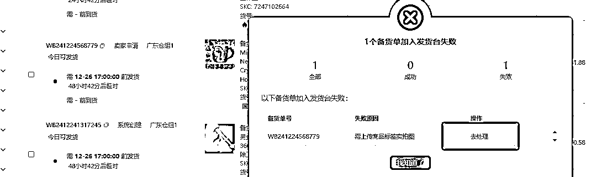

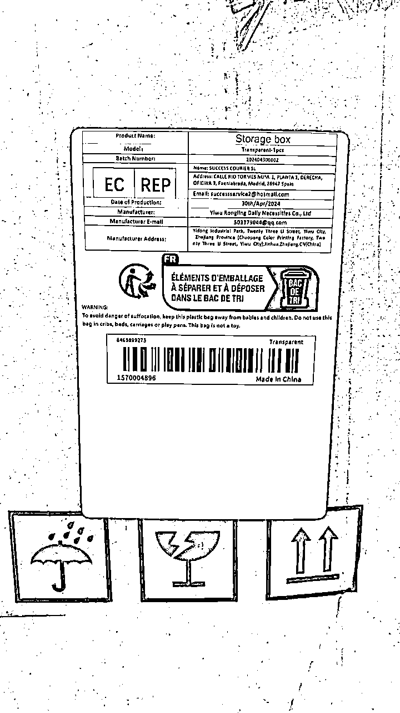

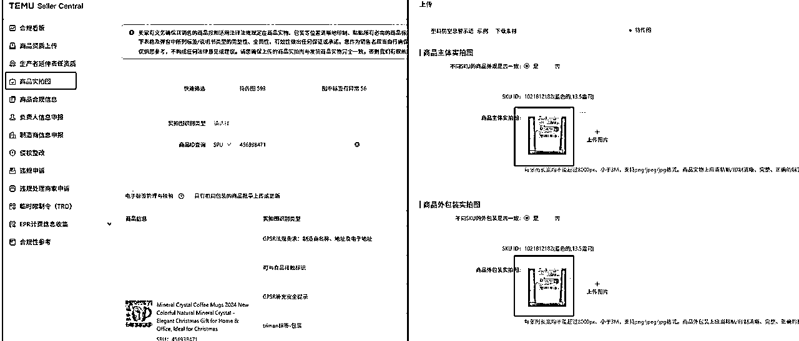

商品实拍图完成后，需要去合规信息这里做申报，所有信息也需要与制作的标签一致！真的是所有魔鬼都藏在细节里，一整个十月没被质检退货，到了11月初被退的货堆了一个小储物间，具体操作细节极其容易失误，淋过雨就想帮圈友们避避坑。

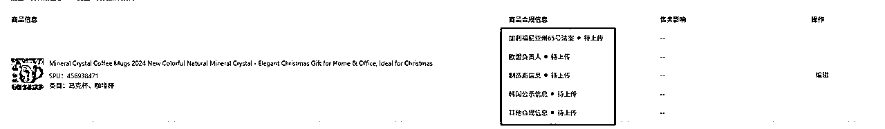

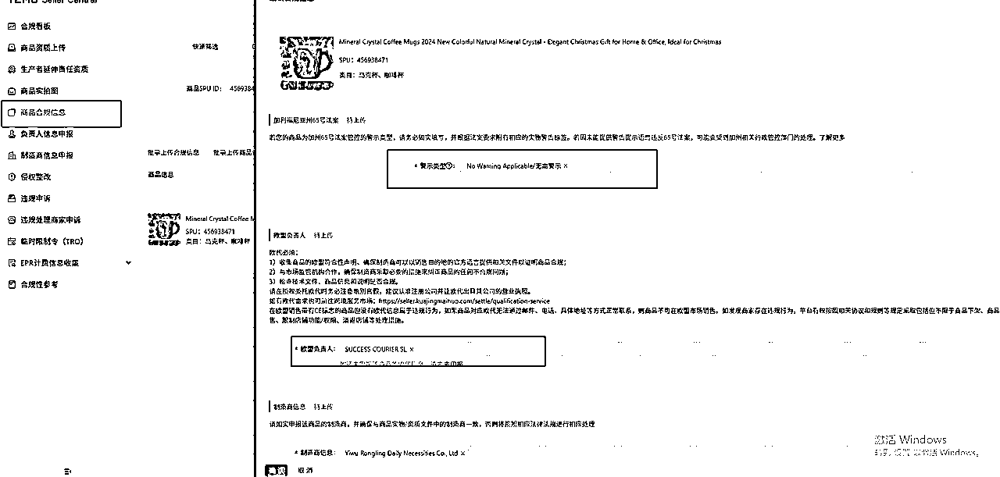

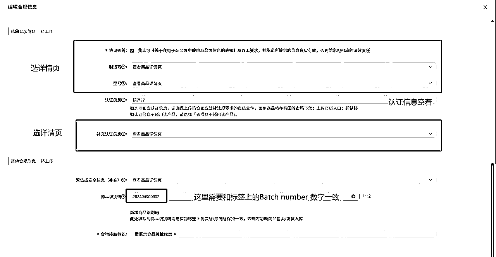

#### 质检被驳回的对应情况及解决方案

经历了上个月月初的退货潮，总结几个自身被退货的情况以及解决方案。当然也有很多时候，错误并不发生在你身上，当习惯这些莫名其妙的破事落在头上的并且淡然处之的时候，你就成长了。

产品标题

该产品当时卖得是3件套组合装，因销量数据不错被评定热销款，新增单个SKU-1件装并持续热销补货两周后，突然质检不过，导致大量的退供

解决方案：调整产品标题，把标题上的量词 3-piece去掉即可重新备货。temu对于标题也会检查是否与售卖产品的数量一致，没必要在标题上体现数量词，除非本身就不适合做组合装的产品 。

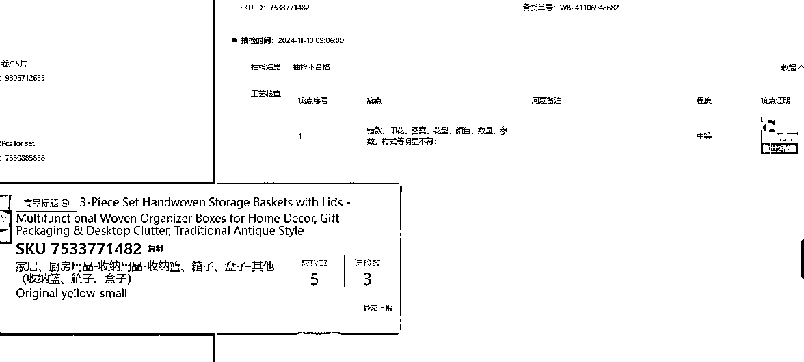

产品包装未封口

这个产品被退货纯属意料之外，因为多次备货都没有出现质检退供问题。究其原因有可能是每个仓库的外包质检人员质检标准不一样

解决方案：保险起见，所有产品都需要封口，以产品是否会掉落是平台判定包装合格与否的基础条件。

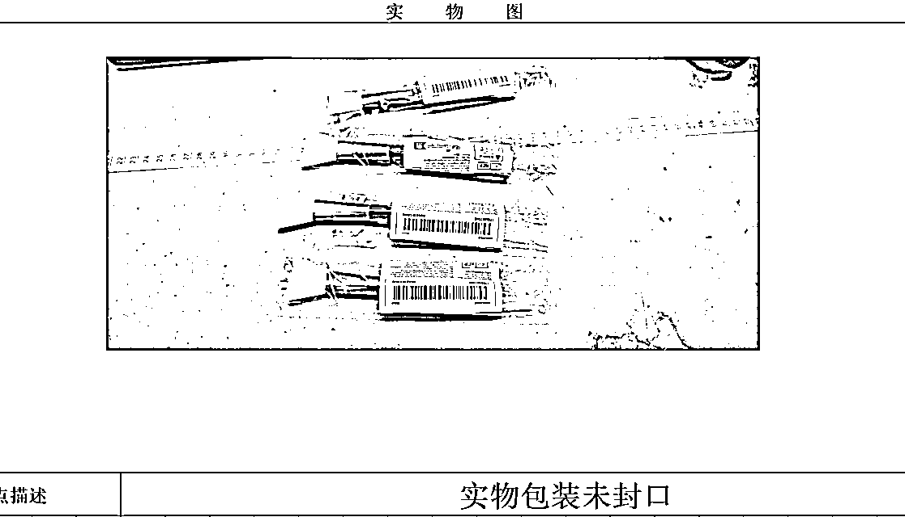

产品标签问题

产品标签问题在此前强制欧代时尤其常见，标签制作务必严格遵循标签制作流程：生产商信息/生产批次/生厂商地址/联系方式 要与申报的商品信息以及商品合规图/外包装图 完全一致，不得有一丝马虎！！

解决方案：如果是安排供应商贴标代发，请让供应商发货前试贴标，拍照留底（一定要看到供应商的贴标，免得质检出问题后互相扯皮），查看是否标签有部分不完整（如右下图因警告标语不完整被退供）。

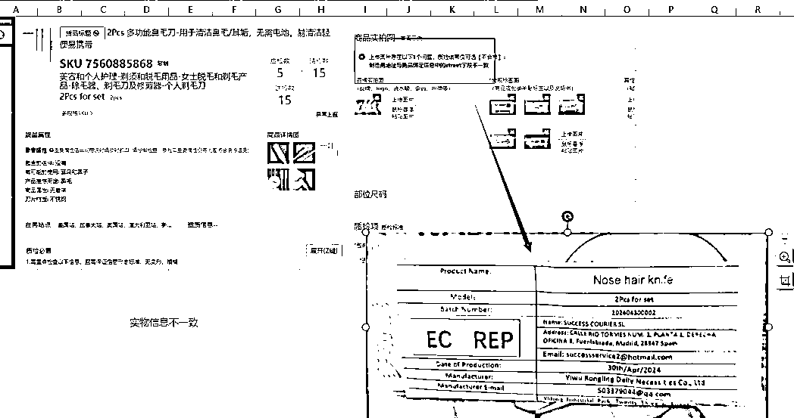

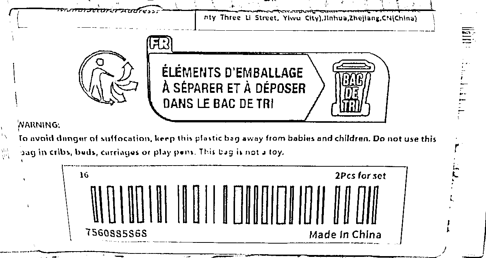

产品包装破损

包装破损大部分情况不在你也不在厂家，量大的备货单极有可能是在运输到仓的过程中出现破损。塑料制品，即便包装完好，海外消费者货到手也有概率一片稀烂。

解决办法：前期选品避开或者与商家沟通到仓过程的货损处理方案，遇见好说话的供应商请他们打包的时候使用厚度更大的瓦楞纸箱，那么成本也必然会涨上去

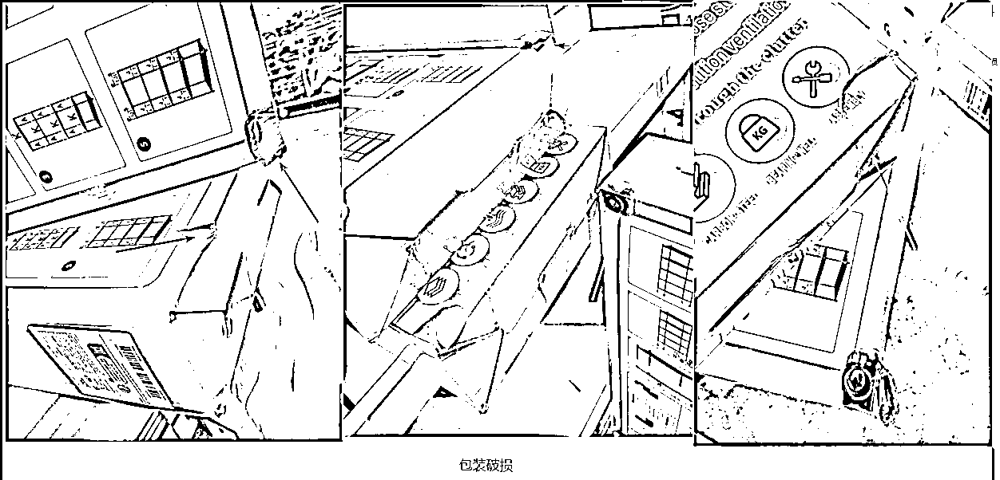

质检被退供的产品若因厂家原因，可适当与厂家商量部分退款，包装损坏的让厂家重寄包装自行打包。若因标签问题导致的退供，需要重新去除标签，换上新制作的标签再打包发货。

去除标签不损坏商品包装的两种方式：1、用吹风机加热 2、用热敏纸涂改液（1元/瓶买不了吃亏）；

切记不可把新标签覆盖到老标签上，会再次被退供！！！

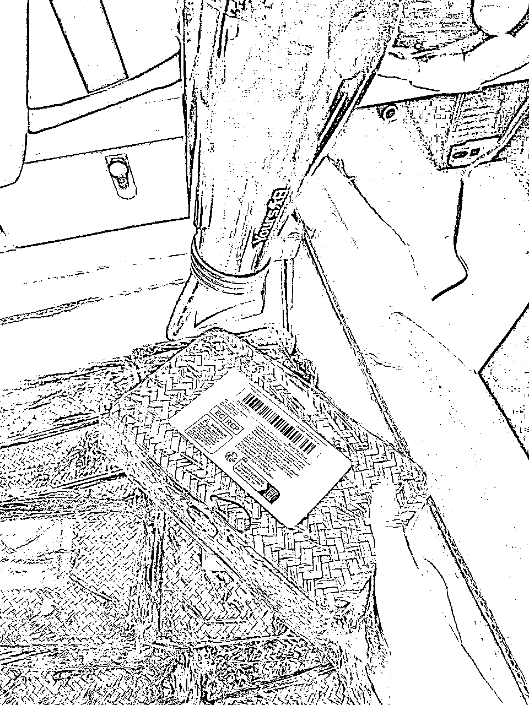

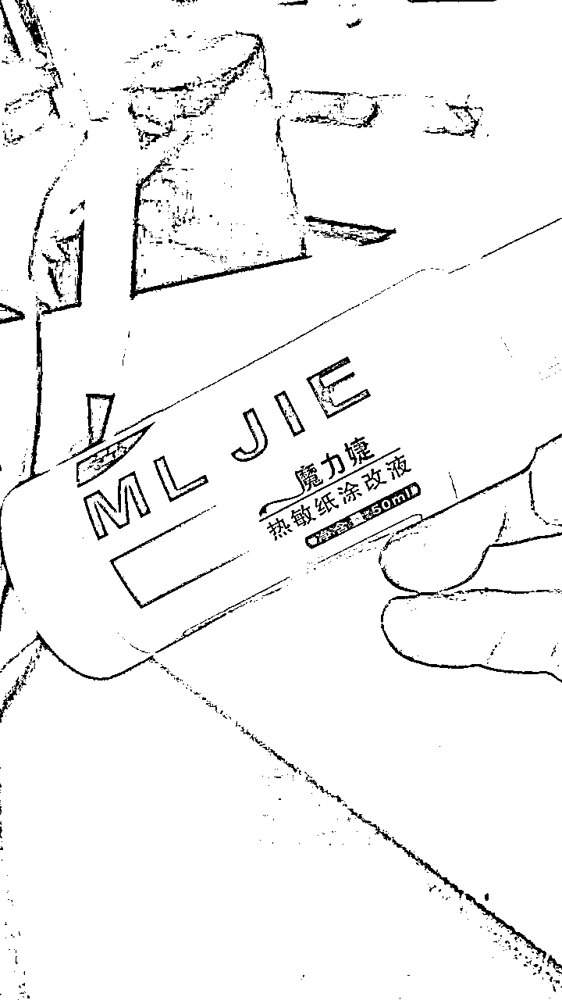

## 三：关于库存管理

#### 核心原则：遵循少量多次，提前预判，永远不要拉满的大体原则

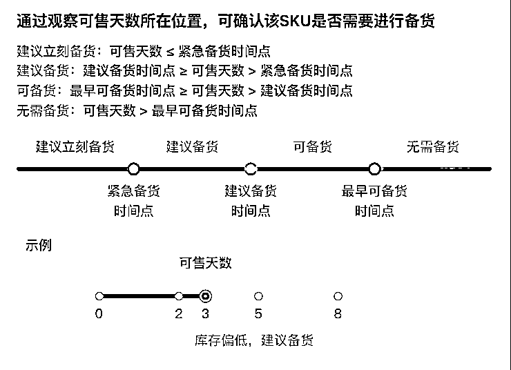

TEMU的系统备货逻辑是根据你的销售数据来订的。对刚接触temu运营的新手来说，有时候会具有迷惑性，大多数情况为了保证成本安全的前提下是不建议直接按照系统的备货逻辑走的。

品质分75+且销量稳定的热销款（评价数量50条以上更优，如若评价数量太少容易引起产品评分的大幅度波动），备货逻辑按照11（天的仓内库存）+3（天的在途库存），原则上要保证库存在线，不断流且具备一定的库存爆发容错。

品质分70+销量零星的普通款，备货逻辑按照5（天的仓内库存）+3（天的在途库存），小批量测款避免滞销增加买货成本。

要特别警惕伪爆款的情况，也就是首单刚上架，48小时（大概是这么个区间段）售罄，系统突然大量要求备货（比如备个120单）

如有遇见千万别以为这个品是大爆款，觉得自己是电商圣体；很可能按照平台备货到仓，又马上要求你降价/或者销量突然没了，你降价与否销量都没有些许波澜，结果导致全部滞销，到时候批量退回导致库存积压很占用空间。相对正确的做法是再备一次首单的量+5/10件（视产品成本情况）

出现伪爆款的原因是平台都会给新上架的商品一定的流量倾斜，导致前端价格相对较低。这里也可以关注下自己的选款到仓上架与前端同款的售价差异，保利润率为大前提做适当营销

以上的备货逻辑都是为了确保成本支出绝对安全和避免滞销导致的库存积压，temu对于每个产品都有品质分的把控。品质分＜90分都会有罚款，根据每个产品申报通过的价格进行2/3/5倍罚款。那么我们就要在库存管理上多下功夫，当你操作多了，对这块的拿捏也就更得心应手了。

## 四：一些经验以及入局建议

1.  新店前期前期千万别考虑做垂类，等2-3个月店铺起来后看什么卖得最好，就往那个品的类目去深耕。另外，看到一个品已经在稳定出单且3/7日销量上涨趋势明显不着急做下一个款，在这款产品的链接上新增SKU，做组合装或者同款不同色。也可以通过AI做差异化图片，多备几条同款产品的链接，为品质分的不确定性留个后手。

1.  大量备货的时候，一定要关注品质分的变化——temu全托管无法控评，当然也有外部控评渠道，一条真实评论的成本=前端产品售价+刷单价格，且在拍下后15-30天内（国际物流时效）留评价，也会根据评价的类型有不同的收费（纯文字/图文/视频）。大多刷评人要求全额付款，中途若取消订单无法检测得不偿失。评价上10条开始出品质分，品质分低于70的备货务必要谨慎再谨慎！

1.  选品过程中遇到24小时还没核价的品，直接忽略继续下一个选品。你选的产品即便是站内稀缺的潜力商品，也有可能不核价。

1.  合理分配时间，尽量把80%+的产品去做一件代发，后期省事很多（前提是保证你的供货商绝对靠谱，关键时刻能找得到人）。提高自己的品感是头等大事，一家店在一天的工作中至多不超半天，这样才有更多精力做店群放大利润。

1.  核价环节留出至少35%的利润（低于40%的本人从不考虑），供应商贴标在0.1-0.5价格不等且有些产品需要到起订量，有的时候量少贴一件产品就要10元的贴标费。

1.  发首单的产品，一定要关注物流到仓+质检时效，方便之后精准对补货周期做预判。

1.  对于到货时间的预判相对精准的前提下，保证爆款链接的不断流很重要。此前有款产品日销20+，因为11月初贴标问题导致在途货品物质检不过，又无法重新生成备货单，断流10天之久，之后再备货销量直接挂蛋。所以，爆款多复制几条差异化的链接非常关键！

1.  新品上站点后关注前段价格，及时去报活动，前7天是重中之重，7天没出单爆款概率小一半。可行的情况下，牺牲几个点利润去报活动。这也是为什么核价要留出至少35%利润的原因所在。

1.  运营过程中一定要找到对应的类目小二/类目卖家群，不见得小二会及时回复你，但是出问题也只有这么一个反馈渠道。

##### 当下入局temu是否还有机会？

Temu 于 2022 年 9 月在美国正式上线，如今覆盖150+国家和地区，整体利润/流量情况比shein强。当下入局还是有机会的，前期一定一定要从最简单的普货入手把整个流程跑通。后续再根据自己的情况量力而行，宁可自己多做几个店也不要贸然扩大团队，体力活（如贴标/货损重新打包）可替代性高，相对容易解决。

ps：在今年8月刚入局2周左右时候，当时心情是沮丧的，因为遇到了各种卡点，也咨询过圈友@七喜，再次感谢生财的力量！第一次发帖，文中措辞不当的请各位指出，祝各位圣诞节快乐，新年提钱大吉~！

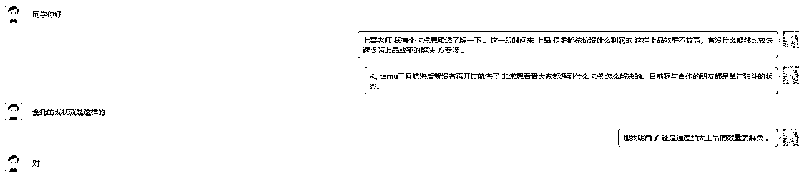