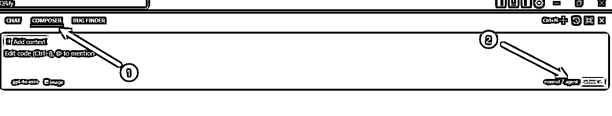

# 使用Cursor 开发浏览器插件

> 来源：[https://hqhhkfm2ink.feishu.cn/docx/UEFrdZDK7oLtskxyxpwcVssInMe](https://hqhhkfm2ink.feishu.cn/docx/UEFrdZDK7oLtskxyxpwcVssInMe)

# 1、环境搭建

## 1.1 Node.js 介绍

Node.js是一个开源的JavaScript运行时环境,它允许开发者使用JavaScript在服务器端编写应用程序。

简单来说,Node.js让JavaScript不仅可以在浏览器中运行,也可以在服务器端运行。这意味着开发人员可以使用同一种语言(JavaScript)来编写前端和后端代码,从而提高了开发效率。

Node.js的一个关键特点是它使用了事件驱动和非阻塞I/O模型,这使得它非常适合构建高度可扩展的网络应用程序,比如Web服务器和API。

对于初学者来说,可以把Node.js想象成一个可以运行JavaScript代码的环境,就像浏览器一样,但是它是运行在服务器上而不是在浏览器中。使用Node.js,开发人员可以编写后端服务、命令行工具、甚至是桌面应用程序。

总的来说,Node.js为开发人员提供了一个强大的JavaScript运行时环境,使他们能够构建各种类型的应用程序,从而提高了开发效率和灵活性。

## 1.2 NVM

### 1.2.1 介绍

NVM (Node Version Manager) 是一个用于管理Node.js版本的工具。它与Node.js本身有着密切的关系。

简单来说:

*   Node.js 是一个JavaScript运行时环境,允许开发者在服务器端使用JavaScript。

*   NVM 是一个工具,可以让你在同一台机器上安装和切换不同版本的Node.js。

NVM 的主要作用是:[

1.  允许你在同一台机器上安装和管理多个版本的Node.js。这在开发过程中很有用,因为不同的项目可能需要不同版本的Node.js。

1.  让你可以轻松地在不同版本的Node.js之间切换,而不需要手动安装或卸载。

1.  确保你的项目使用的Node.js版本与项目要求的版本相匹配,避免兼容性问题。

总的来说,NVM 是一个非常有用的工具,它可以帮助开发者更好地管理Node.js的版本,提高开发效率和灵活性。

### 1.2.2 安装

#### 1 下载

下载地址：Releases · coreybutler/nvm-windows


点击下载安装程序。


下载好后直接双击安装程序即可。

#### 2 安装

安装位置不推荐选C盘，除非你C盘空间非常大。


点击 Install，确认安装即可。


#### 3 检查

安装完成后在终端输入 nvm -v，能查到版本号，说明安装成功了


#### 4 配置下载源

安装成功后打开 nvm 的安装目录，找到 settings.txt 文件


```
node_mirror: https://npmmirror.com/mirrors/node/
npm_mirror: https://npmmirror.com/mirrors/npm/
```

#### 5 配置环境变量

右键此电脑，点击属性


找到高级系统设置


点击环境变量


在系统变量中找到

NVM_HOME

NVM_SYMLINK

如果没有， 也可以点击新建环境变量。

然后我们把这两个变量配置到 path 中去。


选中，点击编辑。

%NVM_HOME%

%NVM_SYMLINK%

### 1.2.3 使用 NVM 安装 node.js

在终端输入 nvm list available，查看可以安装的版本

```
nvm list available
```


在终端输入 nvm install xx.xx.x 选择一个版本安装, 例如

```
nvm install 18.20.5
```


查看已经安装的 node，* 号表示当前使用的 node 版本

```
nvm list
```


指定要使用的版本。

```
nvm use 18.20.5
```


NVM 常用命令表格：

# 2、 使用脚手架初始化项目

## 2.1 介绍

为什么使用脚手架初始化项目？ 因为我们在开始编码时，很少真正从零开始写代码。使用脚手架的一个好处是它能够为开发流程设定边界。如果不对cursor进行限制，它可能会按照自己认为合适的、主流的方式生成代码，这可能会导致许多错误。

个人经历分享： 当我最初根据教程开发浏览器插件时，尝试让cursor从零开始创建插件。我发现它需要通过链接下载来引入依赖，这样做的问题是链接可能已经失效，而Cursor使用的大模型可能还没有意识到这一点。

对现代前端依赖管理的看法： 目前，前端开发普遍使用npm、pnpm等工具来管理依赖。我认为这种使用链接方式下载依赖的方式已经有些过时了。而且还可能下载不下来。

而这次我们使用的脚手架也是 AI 推荐的，我目前使用下来感觉确实还不错。

chrome-ext

下面是 Claude的介绍


## 2.2 初始化项目

找一个文件夹。

地址栏输入 cmd , 然后回车打开终端


使用命令开始初始化项目，项目名称,推荐英文名称，这样可以减少一些莫名其妙的bug 。

```
npm create chrome-ext 项目名称
```

直接回车，使用默认包名即可。


这里选择技术栈，有前端经验的可以选择自己熟悉的技术。我比较熟悉Vue ，所以我就选择了Vue。


这里可以随意，使用JS / TS 都可以。

打开文件夹，就可以看到创建好的项目。


使用 cursor 打开项目。

# 3、开发

## 3.1 创建 .cursorrules 文件

我现在习惯在项目开发前，先创建一个 .cursorrules 文件。

.cursorrules 是一个"指导文件”，告诉AI在不同项目里该用什么方式写代码。

比如风格,命名方式等。

我创建 .cursorrules 的方式就是 从 Cursor Directory 中去找到我自己用到的技术栈，然后丢给chat ,让它给我仿写出 类似的。


直接选第一个就好。


随便找一个复制。

打开 cursor，然后新建一个对话。

将刚刚复制的 .cursorrules 内容粘贴到对话框


回车，就生成好了针对我们项目的 .cursorrules 内容了。

点击复制粘贴到 .cursorrules 文件中。


## 3.2 使用 Chat 生成产品需求文档

我一般刚开始开发的时候，脑海中只有一个 idea ,但是具体如何实现和展示，我是没有思路的，这个时候我会让 AI 帮我写一份产品需求文档，如果可以，我就直接使用了。

还是一样，cursor 中 新建对话。

这让就直接有了一份产品需求文档，点击复制


然后把产品需求文档放到 NOTEPADS 中，方便后续使用。


将复制的内容粘贴进去。


修改文档的名字


这样我们就能在 对话中直接 @ 文档了。


## 3.3 让Cursor 根据 产品需求文档进行开发

首先我们将模式切换到 COMPOSER ,然后选择 agent 模式。模型就使用 Claude-3.5



然后开始让cursor 开始进行工作。

接着，你就看到Cursor非常快速的帮我完成了相关代码文件的新建和写入了。


同时，你也可以看出，Cursor 在完成我们的任务之后告诉我们该如何安装和测试这个插件。

这里还是要提醒一下，如果你的cursor在中间没有帮你执行打包操作，那需要你自己的手动在终端执行。


# 4、测试迭代

完成上面的基础代码编写后，就可以开始测试和迭代插件了。

这个时候要保持良好的心态，运气好，测试一次通过。

运气不好就只能 再把报错信息复制给cursor 进行修复了。

先在Chrome中打开「扩展程序」界面：chrome://extensions/，并且打开右上角的开发者模式。


选择打包的插件。


打开一个网站进行查看：百度一下，你就知道


哎，运气比较好，居然成功了。

当然，如果大家失败了，可以直接把报错信息复制给 cursor ，让它进行修复即可。


一般如果有报错，这里都会显示错误，点击进去，就可以看到具体错误。


然后把这个报错信息截图给cursor 进行修复即可。

## 4.1 迭代


迭代前，一定要 使用 Git 提交一遍代码 ！！！至于Git 是什么，大家可以问问Cursor


这里cursor 没有帮我们执行包的构建命令，这就需要我们自己去执行一下了。


看看最终的效果。

感觉还不错。


## 4.2 插件安装

最后附上插件的压缩包