# 风向标挖掘经验分享：10个真实案例的深度拆解

> 来源：[https://qjv17b58t3.feishu.cn/docx/HqzHdnf1jotZBNxrbmHcxWvwn3c](https://qjv17b58t3.feishu.cn/docx/HqzHdnf1jotZBNxrbmHcxWvwn3c)

🤝大家好，我是老彭

起初我是这么想的，每个平台都挖出n个情报源，做个汇总来分享。但后来放弃了，因为我实际上并不是这么做的

所以，我打算从很私人的角度来分享：「拆解我自己」，事实上，我也确实没有一套特定的方法论去写风向标，我没有自己的情报库，也没有关注那些做账号拆解的博主，我发布的内容都藏在自己的日常里

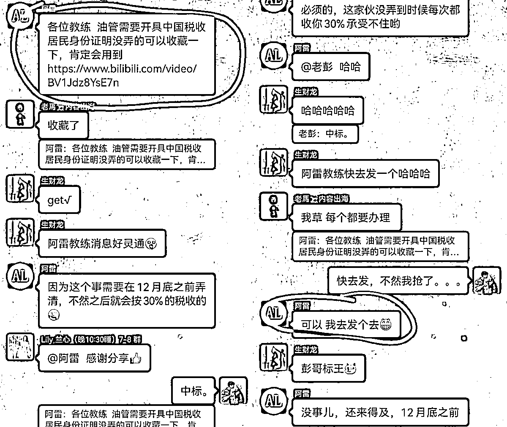

☝️你们也可以，只是你们没有意识到而已

❓️为什么是拆解我自己的风向标：当然是足够打动圈友（bushi），其实是我也拆解不了别人hhh🤣

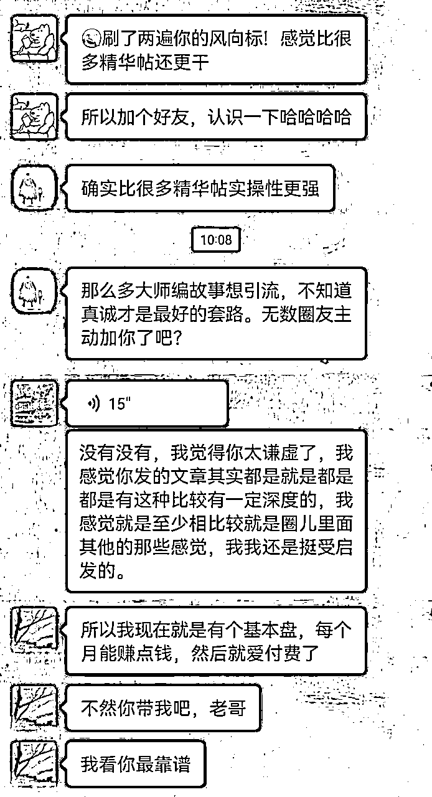

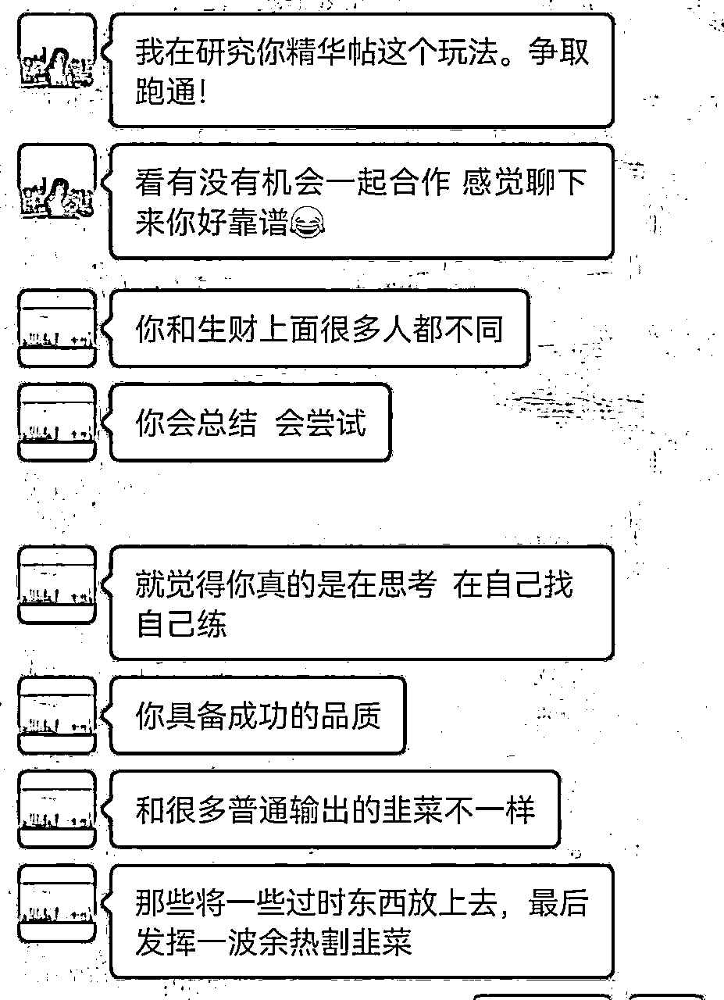

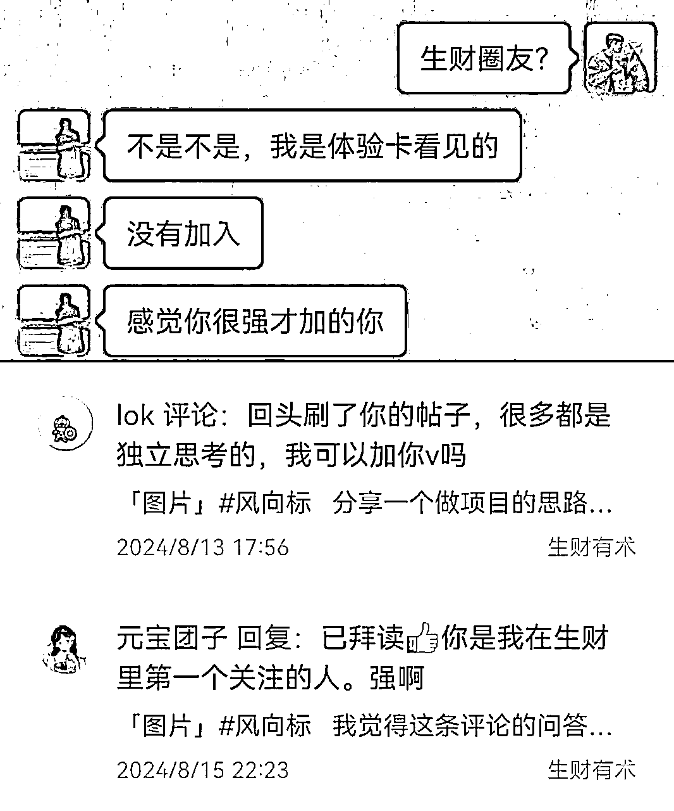

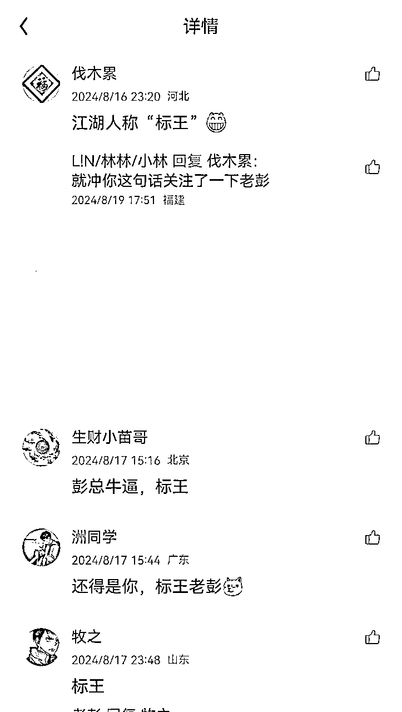

接下来我将拆解10个案例，尽可能筛选我在不同角度写的，分“理论类”与“实操类”两个部分，各5个案例进行讲解。

好，我们开始（1-5为理论类，6-10为实操类）

## 案例一：用AI重新做一遍自媒体

📌链接：https://wx.zsxq.com/group/1824528822/topic/4848242882422818

1、suno出了v4版本：想去了解下相关信息

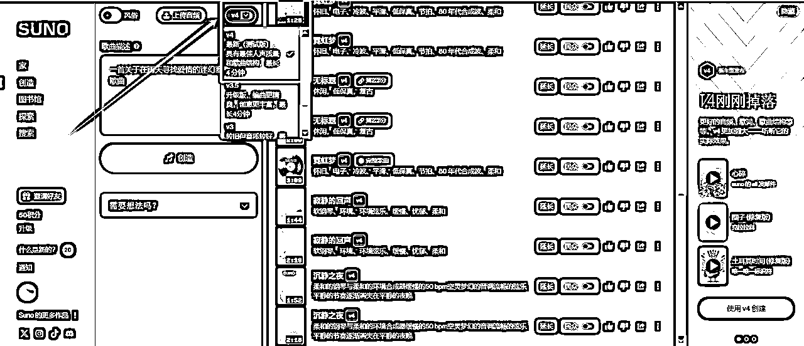

2、小红书搜索“suno v4”：浏览热门的相关帖子

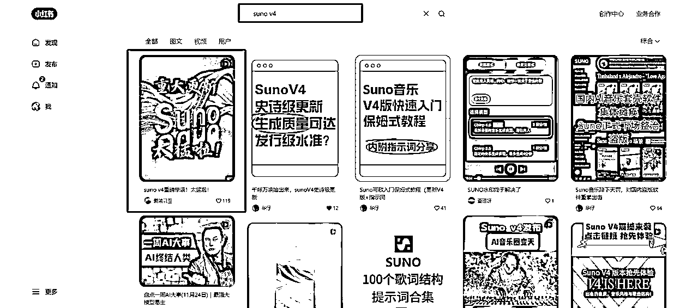

3、查看热门贴作者主页，有没更多相关信息：

最后被“AI音乐涨粉12w”的主题吸引到

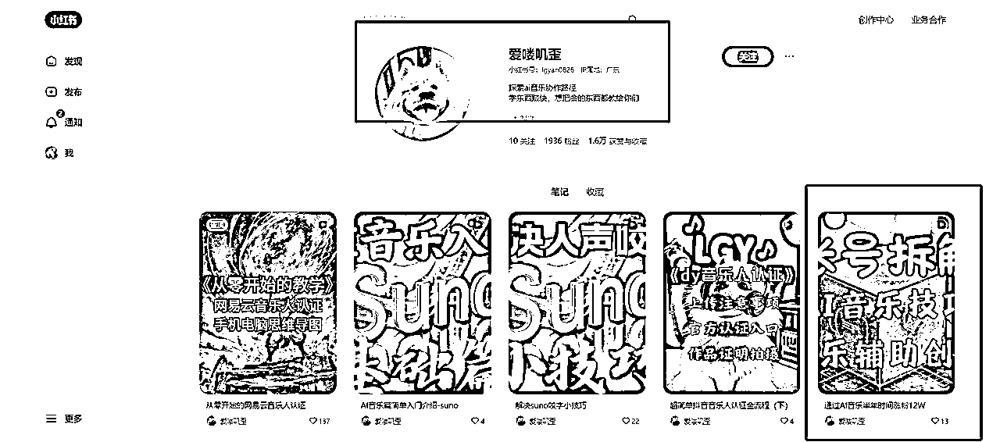

4、查看拆解案例：用AI音乐做科普赛道

思路完全可以迁移到其他赛道

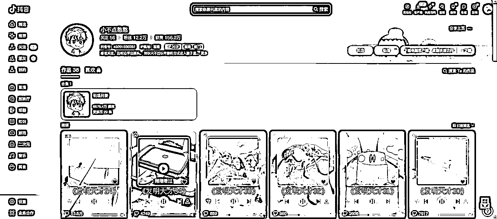

于是，我将整体主题放大：「用AI重新做一遍自媒体」，然后把自己观察到的信息和思考，梳理成了一条风向标。

✅️可能的路径：

1、对自己所在的赛道保持敏感度（比如有新的玩法出现）

2、带着好奇心或者问题，用关键词去搜索（一般是内容平台）

3、关注那些比较热门的答案（平台的热门帖子）

4、既然都到这了，这些都是同赛道前辈（掌握的信息量肯定比我们丰富很多），不妨顺着这个方向再多看一眼，同赛道的好内容往往更容易触动自己，引发思考，不小心就梳理成一篇风向标了

## 案例二：「YouTube视频下载」信息差赚钱

📌链接：https://wx.zsxq.com/group/1824528822/topic/8858454858222242

1、闲鱼搜索“油管”：我想看现在的付费工具都有哪些

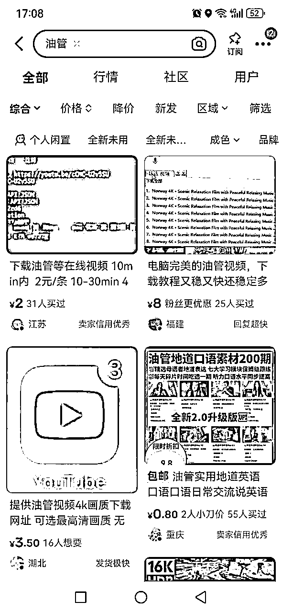

2、意外发现信息差：YouTube视频下载也能赚钱

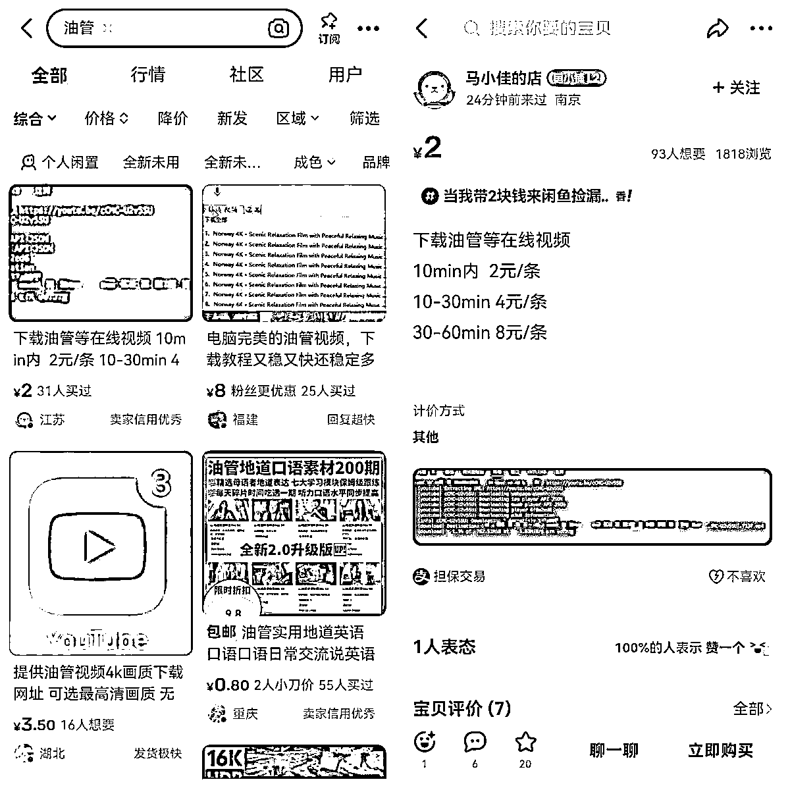

大概浏览了一下，没想到这么简单的“视频下载”，居然有这么多的需求量。然后我就觉得吧，这件事谁都能做，而且正反馈也快（挖到一个可以写的点），一边写一边也在思考，纵向上，这不过是虚拟产品的一种，横向上，这只是信息差的一种。（有时候我们发掘到一个点就可以去写风向标了，当你把它当成风向标后，写的过程中就会不自觉地去优化它，增加它的信息增量，最后呈现出来的效果就很好~）

已有圈友实操贴，这种中标很酷😎，也是我觉得未来社群风向标可以发展的方向...

## 🔺这里顺便附上一个很实用的风向标写作方法：

1、写风向标可以采用分点概括的形式

2、当你想到一个点，去写完1的时候，往往大脑会不自觉地想到2，就像大脑突然被唤醒一样

3、还是本篇举例，其实我刚开始只是写了一段话“标红的那段”，当我把他当成风向标去分享时，写下第1点的观察后，写着写着就写到了第6点（我很多篇风向标都这样，你正在看的这段写作方法也是👻）

4、如果你不喜欢这样的分点概括，写完再把这些1234删掉即可，全文连成一段

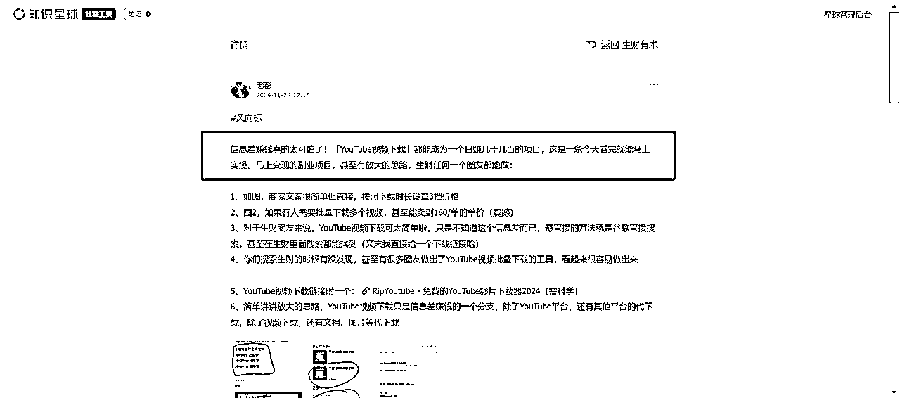

## 案例三：「初学xx的新人」账号定位

📌链接：https://wx.zsxq.com/group/1824528822/topic/8858452881244412

1、小红书平时有点赞AI内容：因为我在学AI

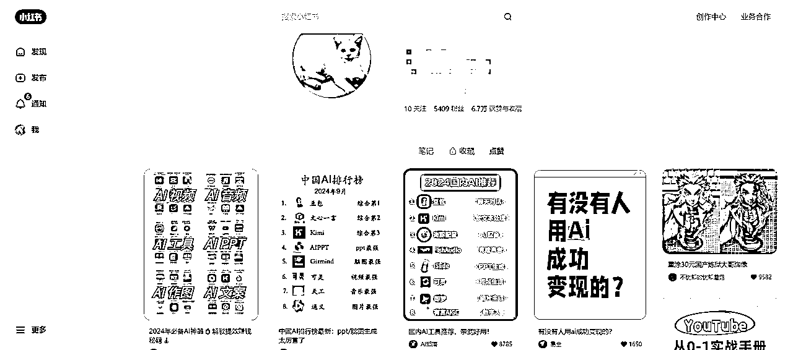

2、大数据推送：比如这个“AI画图134次”

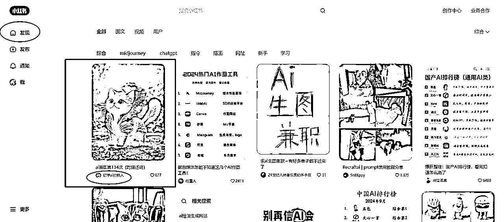

看到这个账号的时候，我眼前一亮，因为它解决了一个问题：新手切入ai自媒体怎么做账号定位和内容规划，因为我之前没有找到可以模仿的作者。既然对我有帮助，那思路也同样可能对别人有用，于是写了风向标。

✅️可能的路径：

1、去内容平台点赞你想摸索的内容（比如我昨天想了解下reddit，想到就去搜索点了赞）

2、然后等待大数据投喂线索（不过我不是整天刷，就是日常玩顺便看，触动到我就随手转发微信写下关键词👇️）

3、再顺藤摸瓜，思考有无有价值的点可以梳理成一条风向标

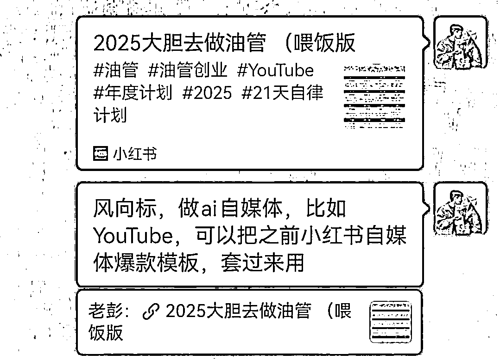

## 案例四：借鉴boss选择YouTube赛道

📌链接：https://wx.zsxq.com/group/1824528822/topic/5121548258521424

1、我要去做YouTube，然后我该做什么领域？或者说什么赛道

2、当我去接触这个问题的时候，大脑很快就做了一个条件反射：

可以上boss搜索YouTube看看，看看别人都在做什么领域

3、我为什么会有这样的一个条件反射呢？是因为以前我有过相关的经验，知道做得比较好的自媒体公司，他们通常会去做矩阵，尤其是那些可以复制的领域

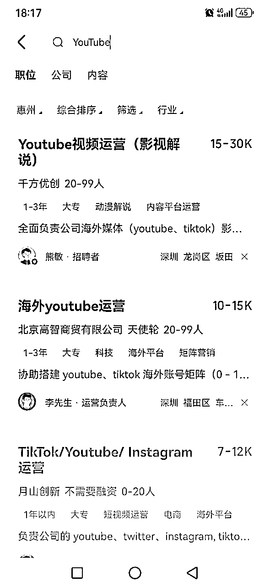

所以，如果你在做项目时，接触一些信息或者问题时，你能够很快地想到答案，而且它同样适用于很多人，那这条信息通常是有价值的，其实我们在实操项目过程中是会产生很多有价值的信息，只是没意识到这也可以发风向标。

## 案例五：「围观群」，最小的mvp

📌链接：https://wx.zsxq.com/group/1824528822/topic/412814512154528

1、我很少主动加别人，但因为经常分享的原因，会有很多圈友主动来链接

2、有些你看他自我介绍，或者跟他聊天，会发现他很会搞钱。有时我就会忍不住去看一下他的朋友圈或者公众号，通常里面还真有一些比较有价值的信息

3、我就拿这个风向标来举例，这个圈友在朋友圈搞了一个围观群，交付非常轻，我当时就在想，这个我也能干呀，我身边很多圈友都可以干呀，而且这种形式还真有很多人愿意付费，从我自己角度出发，假如我在做一个项目，能围观比我更有经验的人，我也愿意付费

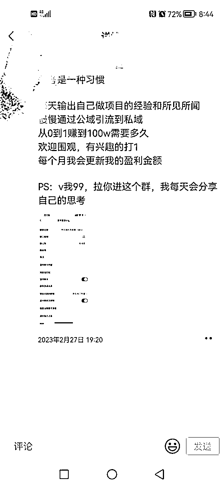

这只是其中一个案例，其实就是，可以去关注一下身边那些很会搞钱的朋友，他们在社交媒体上的内容，可能会隐藏着有价值的搞钱信息。

* * *

接下来的几个案例是实操类的，在星球中标率巨高！可能是因为它能够分享出来，本身就已经是经过了一定量的执行和思考，思路大概率是有价值的，

而且它有价值增量，除了术值，还能赚钱（很多的付费请教），赚情绪价值（很多的夸你牛逼），赚优质人脉（大佬的链接求合作），甚至很多人是直接来求带的，如果你是做知识付费或者想尝试，那这就是一个很好的切入点。

## 案例六：「实操总结」分享5个小红书私信技巧

📌链接：https://wx.zsxq.com/group/1824528822/topic/214285122841521

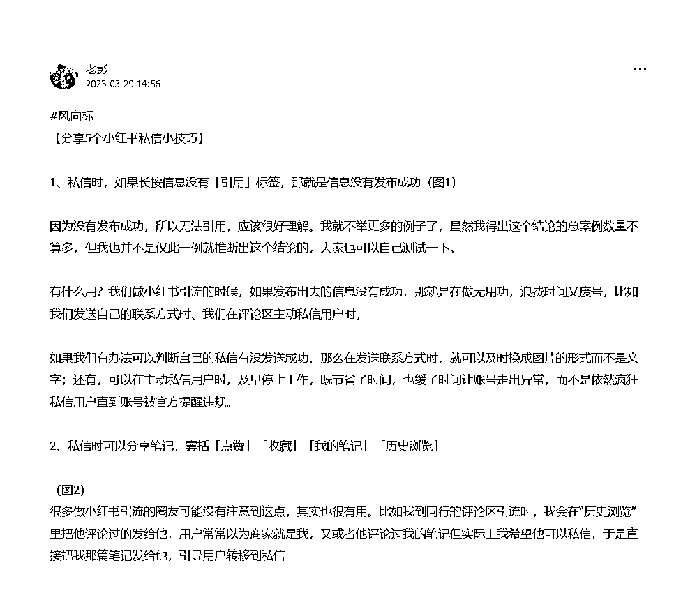

1、当时我在一家公司做小红书引流主管（写过职称日引流100+的高赞贴）

2、我会在实战中遇到问题和解决问题，需要把这些经验总结出来，分享给团队，当时也写了一些风向标

（基本都中标，☝️看上面视频）

3、所以我觉得，你们在做一个项目的时候，在遇到问题解决问题的过程中，也可以多去总结其中的方法论和经验，这些都是很容易中标的信息。

## 案例七：「实操细节」小红书短剧剪辑粉的引流获客

📌链接：https://wx.zsxq.com/group/1824528822/topic/4844182222825828

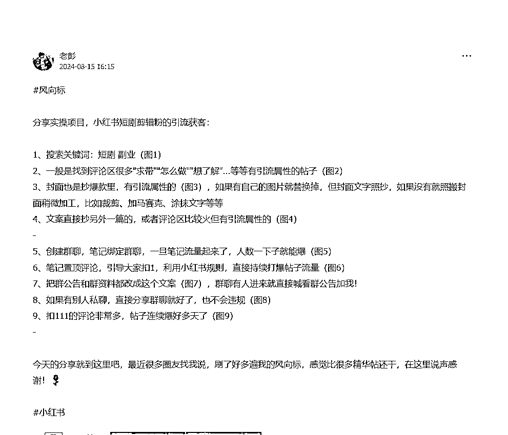

1、我直接拿一个价值增量的案例出来吧

2、因为我一直在分享小红书引流的相关实操贴，所以被大佬圈友左哥邀请合作了

3、短剧剪辑粉的引流获客，我是直接把创业粉兼职粉的那套玩法复制迁移使用

4、所以我觉得，如果你在做项目的过程中，或者观察到的那些，可复制可迁移的思路是值得分享的，就像我前面借鉴Boss选择YouTube赛道。

## 案例八：「项目放大」学历提升

📌链接：https://wx.zsxq.com/group/1824528822/topic/4844185448122218

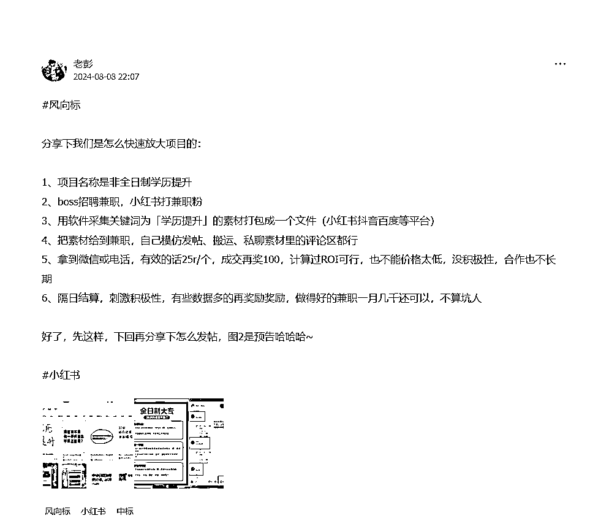

1、这是朋友请教我，我出的一个运营思路

2、思路我是这么来的：招聘网站借鉴了同行和相似行业

3、但每个人的经验不同，面对别人的问题和请教也不一样，有时我们在解决别人问题和请教时，生产出来的思路和答案，往往也是有价值的

## 案例九：「实操拆解」初中生升学业务

📌链接：https://wx.zsxq.com/group/1824528822/topic/1522852882512122

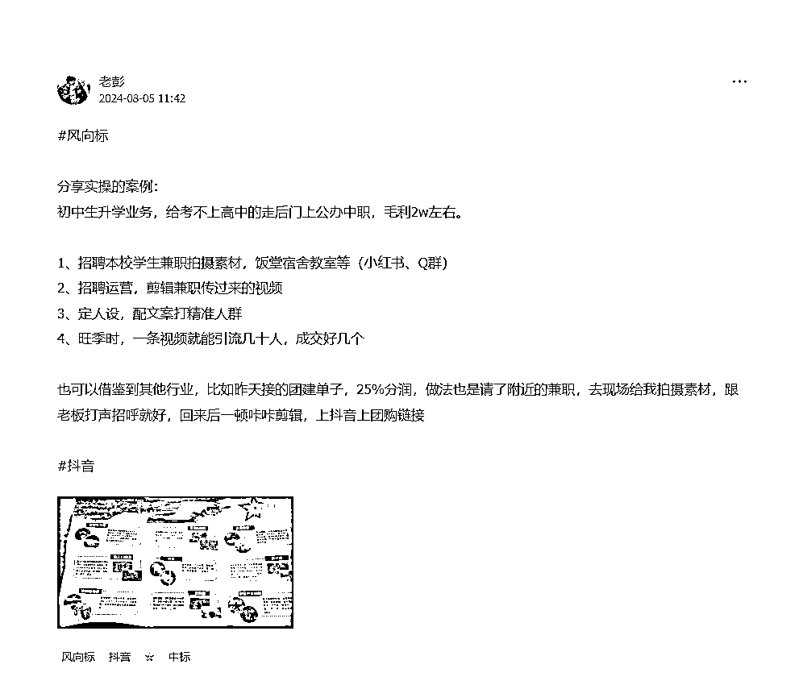

1、这是我搜Boss认识的老板（我拓展人脉的一种方式，写过一篇Boss引流老板粉）

2、当时四五月份快中考了，看到这个业务有点兴趣 就去沟通，他们以前是电销，然后想转型做新媒体转型

3、请我吃了几次饭，我现场梳理了对标玩法，对整个过程进行拆解执行（按最低成本）：

①视频素材，本校学生兼职拍，②剪辑，招个运营剪吧，③文案，抄对标做微调（后续他们跑通了）

4、七八月份出去旅游，看到了类似的运营思路，突然想起来可以发个风向标

5、其实就是代入到同行角色，去拆解那些当下热门，或感兴趣的案例，如果拆解下来，思路是通的，即使没条件去验证，那可能也是有价值的。

## 🔺以上实操，划个重点：

其实实操类的风向标，也不是指你要去实操后才能生产，也可以是拆解别人的实操，只要案例本身有价值，那这个拆解也是有信息增量的

## 案例十：「项目挖掘」小红书留学粉变现

📌链接：https://wx.zsxq.com/group/1824528822/topic/1522421812521882

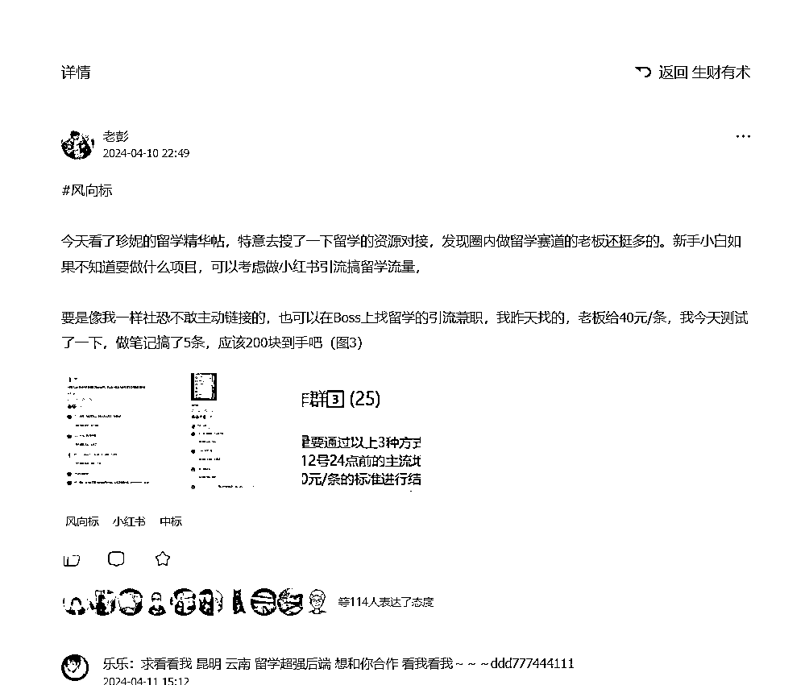

1、这个是我在星球看到圈友珍妮的留学精华帖，感觉这行利润不错

2、然后我虽然有引流经验，但当时不确定自己能不能跑通，所以上Boss找了个招兼职的，40元/个

3、很快就跑通了，就把实操分享出来了（后面还写了复盘实操贴，200多赞，吸引了更高价的后端合作）

4、哎，写到这里，好像这123步骤的实操思路单拎出来，这个路径也很有价值啊，可以发风向标（对，请你们也养成这样的习惯吧）

## 结尾

先总结：不要觉得风向标离我们很远，其实就藏在我们的日常里，只是我们之前没意识到这也可以发风向标，

再结个尾，心态上面的，因为我就是这么想的，才会一直这么写着：

就把发风向标当成一种记录（中不中标无所谓）、还有一种习惯，去验证自己的思路有没价值，如果有我会很开心（我tm真是个天才），如果没有（哈哈哈这思路居然不行）

👋拜拜，下期见~