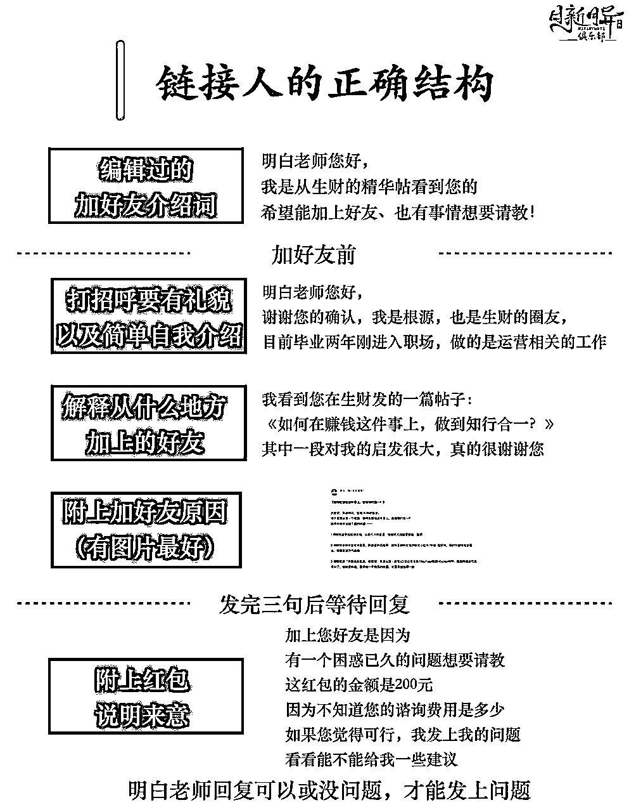

# 【生财技能】新人如何在一个社群里正确的请教与互动

> 来源：[https://oee5lr7gsk.feishu.cn/docx/ONpMdFl2oo9GXsxtHa3cZVnInKc](https://oee5lr7gsk.feishu.cn/docx/ONpMdFl2oo9GXsxtHa3cZVnInKc)

全文共：8,105 字

预计阅读时间：6.88 分钟

还记得几年前刚加入生财的时候

看了一篇好文章，想主动链接写文章的大佬，总是得不到回应

又或者是，得到回应后就不了了之

当时，我只出现了一个想法，生财的圈友怎么都这么难相处

但是经过了几年，我才意识到，当时犯了多大的错误

根本就不是圈友的问题，而是我自己的问题

现在回看当时发好友邀请所编辑的简单介绍词（有些甚至都不太编辑）

我自己都会有种要我看到这种申请，也不会想点

就算真的加上好友了

我聊天打的那些文字，现在都看不下去，说的那是什么鬼

这种表达、谁会想给你帮助、会想给你回应

今天想聊聊一个话题

『如果我是个新人，如何在社群里正确的请教与互动』

* * *

# 新人链接大佬或者想认识的人，三个主要的场景

想与厉害的人或者是你想认识的人成为好友，获取第一次的『交流』

一般会有这几种场景

## 场景一：从公众号文章底部的联系方式加好友

看到文章底下的联系方式，直接加上（假设是公众号）

如果是我，不会选择直接加上好友

特别如果这个公众号主又是个超级大号，阅读很多的状况下

我会选择先赞赏，可能是16元、52元、88元（含以上）

大原则就是，不要赞赏『个位数金额』。

因为这篇文章谈的是『新人』，所以金额不能太高，得把成本考量放进去

但也不能太低，因为不会被关注到

我可能会分三到五天的时间，每天都赞赏一篇文章，

然后我才会留私信询问：（提供一个范本）

某某老师你好，这几天看到您的公众号

非常有感触，也让我学到很多

尤其是前天更新的那篇文章，看完后解决了我一个大问题

不知道能不能加上您的好友

想更靠近的跟您学习

如果你在一周之内，赞赏五次以上

这个私信一定会被重视。

因为你的赞赏会被他看见

这时候有很大的状况下，对方会回复你：没问题！

* * *

## 场景二：透过其他平台加对方好友

其他平台看到好文章，想联系对方，但是没有联系方式

就类似于在生财有术的知识星球上，看到一个很不错的帖子，很想认识作者。

这一种跟上面的方式很像

假设能赞赏，可以按照上面的方式后

透过平台私信先询问

一般来说，一定会得到一个不错的回应

也就是不管对方是否留联系方式

我都会先用『平台私信』当做第一次的联系

不会优先选择马上加微信

* * *

## 场景三：微信群里看见，想直接加对方好友

我想微信群里加好友这场景，各位一定不陌生。

这里就不赘述，那接下来想谈一谈如何在群里更好地互动跟链接。

* * *

# 刚加入社群的新人，最需要具备的特质就是『主动性』

先谈一个我觉得很重要的点，就是「主动性」

这一点大家肯定每天多多少少都会主动出击，

但是主动，本就是一件更困难的事情。

我先用一个简单的案例，让各位知道，主动跟被动有多的差异。

我想，多数人都知道有个行业，叫做『保险从业人员』。

买保险的渠道，一般分为两大类：

⭕️第一类：银行端

也就是，你去银行柜台存钱，或者是办理某些资料的时候

柜员会顺便问你，要不要买点保险、存点钱。

⭕️第二类：保险业务员

这个各位肯定熟悉，身边最少都有超过五位以上的保险业务员

保险业务员『主动』上门，问你有没有保险需求。

银行端属于被动，业务员端属于主动

同样一张五百万的『养老保险』，一年交一百万，连续交五年的方式。

1.  银行端柜员成交，这个成交的柜员，大概有『几百块』的佣金。

1.  但如果，今天是保险业务员，主动找到客户，并且成交同等的单子，第一年应该有20万左右的佣金。

这就是主动和被动的区别

但是，主动的难度，也远远大于被动。

但是当你具备主动性，你就有机会被更多人看到，

你的优点，你的好的特质，也更容易得到别人的赏识，也更容易得到别人的帮助。

* * *

# 如何更好地在社群里链接与互动？

回到重点，假设，今天我想在某个群里，链接到大佬或者想认识的人，有没有什么更好的方式？

提供几个我自己常用的方式。

## 第一：经常在群里活跃

这个活跃可能是参与到群里的问题讨论，

或者是看到别人有需要帮忙，你主动去帮忙，做一些力所能及的事情。

当这类事情越多，你在群里的好感度就会越高，

以及也更有机会被大佬或者厉害的人看到。

那未来你想链接或者向对方请教，就会因为这份好感，有更多的机会。

* * *

## 第二：突然聊上某个话题，主动去链接

群里如果有大佬分享，或者讨论某一个问题，然后@ta，在群里跟ta对话。

只要对话超过三句以上，就可以私下加好友了，这个场景是最好的场景，

因为有过互动，加上好友之后，会瞬间没有陌生感。

可以类似这样开场：

谢谢你点了好友确认

刚刚在群里

你说的（某某观点）

说的真是太好了

这时候记得，还要截图他在群里说的那段话，连同夸奖一起发。

这可以增加，重视对方的程度。

* * *

## 第三：想要加对方好友，进行深度的链接

那第三种就是，如果你很想认识这个人，你是真的想跟他有深度的链接。

我自己在主动链接人的时候，有一套固定的流程，

也是我目前为止测试下来，加好友的时候，我觉得最好的流程。

### 加好友之前，一定要先说明来意

第一个一定要在申请好友的备注上面打的详细一点，就类似：

明白老师你好，

我是在生财看见你的，

看到你的一篇文章对我启发很大，

不知道能不能跟你成为好友？

这里面尽可能多打一些，因为当你在备注多打一些内容的时候，

最少可以让看的那个人有一种你跟别人不一样的感觉，以及你比较用心的感觉。

尤其在这个互联网的时代，有很多的举动都会过于的的制式化，

就是我加好友，他都会显示是什么群的什么名字。

那这时候，别人就会有一种疲乏。

所以，加好友的过程我一般都先喊出对方的名字，

以及讲我是从哪儿认识的、我想加好友的原因是什么？

然后等对方确认之后，一定得有礼貌，

并且再一次的说明来意，以及说明从什么地方认识的。

就类似：

明白老师，你好

我是从您的公众号上看到你的文章，

我觉得文章里面写的某一段

对我的帮助真的很大

说到这里的时候，最好是可以把你看到的那一段截图截下来，一起发上去。

因为大多数的人在讲这种话的时候，其实会有一点虚，

虚的意思就是他可能连文章都没看过，只是听说别人讲他很优秀，然后就这么去加了。

这时候，你会发现你跟对方没有话聊，同时也会让对方感觉到你根本就不重视我，

所以，如果说可以把你真的感觉很棒的那一段文章，

或是那一段话，或者是群里的某一句对方说过的什么内容，

只要能够截图，他的感觉一定会更好，因为你真的让对方感觉到你很重视他，你真的关注到他。

也就是前面的一大段，只是介绍我为什么加您好友，以及我从什么地方认识到你，下一段就是要说明来意。

* * *

### 好友通过之后，切忌一次给对方发太多的讯息

当然，在把从什么地方认识的这个部分讲完之后，一定要先等对方回复，

要是对方没有回复，我们就一次性的把很多内容打完，

假设可能有八九行，这个会让对方感觉到压力的。

所以，这时候先等待对方回复，

那如果说当下一直等不到，那没有关系，就对方回复之后，你再说明来意，我觉得会更好。

因为加好友的过程本来就是一种互动，

尤其可以想象一个场景，今天我一打开手机，手机上啪啦噼里啪啦，

有一个不认识的人给我发了十几段话，一定会感觉有压力的。

再来一个点，是对方没有回，肯定是他在忙，

如果说一次性发五六段话，每一个讯息过去，他的手机就会有一次震动。

如果一开始我们发太多段话，他的手机震动的跟来电有人打电话来是一样的，

所以这时候你会让对方的感受并不好。

所以，我自己的节奏大概是发三段，我就不再发，只要对方没有回，我不会继续发。

因为我们也得为对方目前在做些什么考虑，你才不会一开始就让对方有反感，

如果他是重要会议，手机噼里啪啦一直震动，任谁感觉都不舒服，

尤其一看这人，我也不认识，名字我也没见过。

所以，我一般都是先发三段，等对方回复之后再说明来意。

也就是说，得在三段话之内，把你从什么地方认识的讲清楚，

三段话讲清楚，然后就等待他回应，等他回应之后，再说明来意。

* * *

### 加完好友之后，如何更好地深度链接？

那通常来意有几种啊，一种就是我单纯想认识你，没有任何的目的，

但是这种来意我比较不推荐。

#### 方式一：报名课程，更深度的学习和链接

通常我的来意可能是我有问题想询问，或者是您有没有什么类似的成长社群？

因为我在你的公众号里或者是你的文章里看到某一个主题，

我想知道针对这个主题有没有类似的这个付费社群可以让我加入，我想要可能更靠近跟你学习。

这种方法之所以好，是因为用这样子的方式，可以让对方感觉到你这个人是有价值的，

就你加我是有原因的，而不是单纯为了想认识我，这个感觉会更好。

再来一个点是，你要想，如果说你自己有产品，有一个人主动加你好友，

然后并且主动的讲想购买你的产品，你的感觉肯定好的，你对这个人印象一定很深刻的，

因为我们想加一个很优秀的人，不就是希望可以靠近他吗？

那如果说可能预算有限，那就可以明确的说：

因为关注了你，

我其实很想跟你学，

但是我现在是个学生，

我的预算其实没有这么多，

我想知道你有没有什么可能在300块以内，

或者是400块以内的课程以及社群

可以让我加入

然后我可能更靠近地跟你学习。

这时候，你就可以把自己的预算清晰的表达出来，就不会尴尬。

因为你当你把预算表达出来之后，如果说你的预算是300，就那个人的课程可能是900，

你的开场就说我很想加入你的课程，加入你的社群，好好跟你学习，

结果他一开口就跟你讲一个900块的内容，结果你没有这样子的预算，那这也尴尬。

所以如果说预算有限制的情况之下，在一开始就明确并且清晰的把预算表达清楚，

这时候，你不尴尬，然后他也知道你大概有什么样子的需求，以及大概能够付多少钱。

* * *

#### 方式二：付费提问，增加对方的被重视感

第二种方式就是直接提问，把一个最近遇到的问题，或者是你觉得他可能可以帮到忙的问题先编辑好。

然后在打完招呼之后，他一回复，直接先打个红包，然后发上问题。

这种一开始就明确的表达我有付费意愿的好处就是，

因为这个举动就会让别人对你印象很深刻，因为我们目的不就是为了认识他，并且让他能够记住你，

或者是我们可能需要得到更多的帮忙吗？

因为在主动链接别人的过程，让对方感觉到被尊重是一件太重要的事情了。

可以想象一个场景：

今天你在某一些群体里面

也是能够被大多数人注意到的，

有一个人主动加你好友，

并且你能明显感觉的到这个人是很尊敬我的，

你的感受一定非常的好。

所以，一定要把这种感受带给别人，这样子你就可以得到对方的重视，

当对方重视你，最少他对你一定是有好感的，因为他发现你这孩子可以，或者是这个人可以。

当你开始让对方有这样的感觉的时候，那这时候这个的链接就一定有帮助。

大原则就是，再差都不要产生坏印象，

那用付费的方法链接，其实是最有效率并且最有效果的方式。

那同时，付了钱，你才会珍惜任何的提问，

不管这个钱是52块还是88块，或者别的什么金额都好，你就会开始重视这个人，你也会重视这次的链接。

其实，加上好友之后，你可以跟他说：

你好，我是从xx地方看见你的，

因为你的某一段文章或者是某一段话，

让我印象非常深刻，

我想知道一下，

就是目前有没有什么样子的课程，

是我能够跟着你一起学习的，

我能够跟你一起学习的？

就是在跟对方在打招呼的时候，一定要说清楚是从什么地方加上他，

这个会让对方感觉到有一种被重视的感觉，而不是随随便便就加上我，

然后又不礼貌，对我又不了解，加了好友也不知道干嘛。

那这时候给他付费是一种最好的方式，但是有些可能是学生，然后没有那么多的钱，

其实在这个时候也可以用一些很好的表达，让对方意识到，我能知道一下你有什么课程吗？

但因为我是个学生，我可能现在没有这么多钱，可能我的预算大概是300块，

我想知道一下，

如果跟着你学习

您是否有类似的课程，

或者有在这样子价格范围之内的课程，

可以让我跟着你一起学。

也就是一开始就把自己的情况说清楚，那他就可以很好跟你介绍了。

* * *

## ❗️❗️链接别人，很容易让对方反感的三个举动（一定不要做）

我觉得加好友这个举动其实会有三种不同的阶段。

*   第一种阶段叫我加了对方好友，但是对方对我产生反感，就是他对我印象不好。

*   第二种叫我加了对方好友，他对我没感觉，就是可能两三天不聊天，我就被遗忘了。

*   第三种就是这个对方加了我好友，然后我对于他印象非常的深刻。

最怕的是第一种，就是我宁愿加了好友，对方忘了我，对我没有印象，

也千万不能够加了好友，让对方对你反感，或者是不喜欢你，或者是觉得这个人怎么这样。

那有一些情况，是在加好友的过程，会让对方产生反感的几种案例。

### 加完好友，二话不说直接发一长串提问

第一个就是我加了对方，然后也不打招呼，

我直接开始说我的诉求或者是我遇到的问题，然后发一长串话。

这个太可怕了，因为对方没有义务帮你解决问题，

你加好友，你啥也不说，也不先打声招呼，你就直接把你的问题发一长串。

如果对方正在忙，然后对方的的手机可能就会一直震动，这是一个非常讨人厌的举动，

所以千万不能够一加好友，对方确认的那个当下就噼里啪啦打一长串的问题，这是一个很严重的事。

### 对话的方式很粗鲁，很少用礼貌用语

第二个就是不礼貌。

什么叫不礼貌呢？不礼貌其实有很多不同的呈现方式。

因为微信更多的是用文字去发，所以在语言表达上

多用“你好”、

多用“谢谢”、

多用“不知道能不能够请你帮忙？”

……

这些其实都是在文字表达里面会让对方感觉到，你这个孩子还可以，或者是你这个人还可以。

但是，有大多数的人，他们其实一见面就会讲说：

哎，你应该要帮我这个。

哎，你帮我回答一下这个问题，

你的这个课程怎么样？听说什么巴拉巴拉之类的

……

反正就大概类似这种情况，当少了这一些礼貌用语的时候，就让别人感觉到内心也会觉得不舒服，

当你用这种过于直接的话术做表达的时候，如果这个人是不认识你的情况，

他会觉得有点唐突，这种唐突就很容易产生这种不礼貌的感觉。

* * *

### 加完好友，啥话不说，完全不回复

第三种就是加了好友之后，啥话都不说，

我遇过一种情况，就是对方加我好友，然后我主动打招呼说：

你好

请问我能够给出什么样子的帮助吗？

结果他当下不回复，第二天也不回复，第三天也不回复。

当然，我也不会再一次的去问他怎么加了我好友都不说话，

我其实不会主动这么问。

但我就觉得怪，这个举动的背后

就代表他就是在一个地方看到好友，想着要不我就加一下吧。

我就能感觉到，他加好友是没有任何目的性的，甚至他不在乎我。

所以，当加了好友之后，如果说你在当天都不去跟对方打声招呼，这是一个挺不讨喜的举动，

如果说你加的那个人是有习惯性整理朋友圈的人，有可能对方就顺手把你删了。

## 3.5 固定的请教框架

* * *

# 如何更好地向对方请教问题？

接着说一点，假设在群里或者加上对方好友，

如何更好地向对方请教，同时也让对方可以对你产生好的印象。

## 用发红包的方式，让对方感受到被重视

如果说你加好友的目的是为了想解决某个问题，你感觉这个人应该能够给你一个解答。

打完招呼之后就可能跟对方说：

你好，

我是xx地方加到您好友的

那因为目前我遇到了某一个困惑，

我不知道能不能够向您请教？

打完这句话之后，先不用描述问题，而是先打红包。

那这时候，红包就有分了。

其实，红包的设计很微妙

你可以发8元

你可以发39元

你可以发88元

你可以发168元

你更可以发200元

对我来说，发红包只有几种数字

52元

66元

131.4元

188元

200元

这五种数字以外的红包，我不太发

因为毕竟是请别人帮忙解决问题，我肯定都会打三位数以上

点开红包的那瞬间看到不同数字，会有不同的心情

一般来说，只要红包打开是188元以上，这肯定是一种『重视』

当对方回复之后，再把问题发上。

并不是说打了红包对方就一定要帮你解答问题，这一定要区分清楚。

打了红包，除非对方说可以回答你的问题，

或者是他说行，他直接点收下红包，这时候他再回复你。

另一种就是他红包没点，他只先说你说说看你的问题，

这种情况都算是他能够听听看你出现了什么状况，这个时候再把问题发上。

* * *

## 发红包的方式提问，红包金额最好精准地告诉对方，不然就很尴尬

因为有多数的人会觉得我发了红包，对方一定就要给我帮助，这其实是个很错误的思维。

有没有可能对方咨询一个小时可能1万块，

你红包打一个100，或者红包打个8.8，像我就很常遇到这种情况。

对方加了好友，他马上先我打个红包，

那红包很尴尬，红包这个数字点下去是多是少你也不知道。

然后对方问题发了，想着要不先回答问题，我再收钱吧，

结果问题回答完了，红包一点开，发现8.8，我对这个人印象就会变得不好。

所以这个时候，有一种更好的方法就是不发红包，直接转账，

可能转个200，可能转个600，可能转个1000……反正转多少都行，

或者是你跟对方说：

要不红包您先收吧，

因为我不知道你的咨询费用是多少。

那这个红包是200元的红包，

我可能只想要耽误你一点的时间，

因为我不太确定就是

我的这个问题能不能够在这边得到解答。

所以，就类似这样子的表达，提前把你的诉求说清楚，甚至把红包金额都告诉他。

这时候，你打了一个预防针，你让他心里有一个预期。

虽然是你主动请教，但是你对这个人的收费标准其实是不清楚的，

在这个时候，明码标价会是一个非常好的解决方式。

如果说你直接告诉对方，这个红包的金额是200块，

那因为我不知道您的咨询费用有多高，只是我这个问题可能会耽误你5~10分钟左右，

那如果说你觉得，这个红包的金额是可以的，然后可以解决我的这个提问，希望能够请你帮忙解答这个疑惑。

你这么说对方听着就舒服呀，那200块能接受，我就收下然后尝试给你解答，

如果是我，我的咨询费其实其实不低的，

但如果说对方这么告诉我，又有礼貌，就算这个红包他不到我的咨询费，

我也会愿意花点时间在他身上，并且给他解答。

因为这是一种感觉问题，而不是标价的问题。

* * *

# 尾声的过去历史介绍

我是根源，同时也是第四期的生财圈友

一个有 2w+ 实战案例的心理咨询师

12年线下销售、团队管理经验。

2022 年开始转型线上，做一些知识付费的项目。

过去曾发表过几篇文章

都能看到这，代表你对文章的喜爱

肯定有一定的程度！

也欢迎阅读过去我写过的历史文章。

2021年的文章（精华x1）

1.  精华《直觉式萨克斯 透过社群成功变现146万》 https://t.zsxq.com/116B1bcYc

1.  《73项被动收入打造》 https://t.zsxq.com/11EHjTH0P

1.  《杭州夜话02场，夜话官复盘》 https://t.zsxq.com/19IkX4UMl

1.  《年入百万，团队从20人到4万人》 https://t.zsxq.com/19JYt77hL

1.  《主题：如何更有效的链接见面会认识的圈友》 https://t.zsxq.com/19VY2LWg4

2022年的文章

1.  《互联网小白，第 1 次做线上产品，7 天赚回 10 倍门票》 https://t.zsxq.com/11ooZZbM7

1.  《把捣乱分子『逆势』转成爱用者的好方式》 https://t.zsxq.com/19lipLhJ5

1.  《 好的内容，是目前依旧没退旧流行的变现方式 》 https://t.zsxq.com/19BLMAYw1

1.  《明白老师的一个启发，让我从100天日耕的过程赚了30W+》 https://t.zsxq.com/19BgNoxfi

2023年的文章（精华x6）

1.  《私域的意义不是管理，而是经营》 https://t.zsxq.com/19WEsfSq1

1.  精华《9年传统行业 1 年时间，从一无所有，到年入 200 万》 https://t.zsxq.com/10nmEr1cA

1.  精华《25个提高微信成交率的小技巧》 https://t.zsxq.com/11AgRW24F

1.  精华《35 个让私域收入翻 3 倍的技巧》 https://t.zsxq.com/11FmV2aqZ

1.  精华《续篇 - 25个提高微信成交率的小技巧（26 - 50）》 https://t.zsxq.com/13yRbmUwo

1.  《 私域话题：涨价之后，如何回复以及留住客户？》 https://t.zsxq.com/11UJk9HxQ

1.  精华《成为自由职业者的20个必备特质 》 https://t.zsxq.com/14XTxhh15

1.  《 36个让私域成交率翻倍的实战指南！ 》 https://t.zsxq.com/17zSrYzvk

1.  精华《产品线有引流体系，如何通过沟通促成升单？》 https://t.zsxq.com/17ocUJEFA

1.  《知识付费赛道，如何透过处理『反对问题』，增加用户粘性和复购率？》 https://t.zsxq.com/181fSc5rv

2024年的文章（精华x10）

1.  精华《第一次尝试「问答群形式」的公域往私域转化，7天变现11万》 https://t.zsxq.com/18gBXlWxE

1.  《 线上新手，我是如何用一套固定流程，累计成交 300 万高价产品？ 》 https://t.zsxq.com/18IWgDiXo

1.  精华《 私域话题-如何在客户咨询过程中，透过三个步骤提高2倍成交率？ 》 https://t.zsxq.com/196Ad34aR

1.  《私域的十倍增长话题：不同信任程度的客户，如何提升成交率？》 https://t.zsxq.com/YKHGT

1.  精华《 为什么都是做副业，我能第一年就达到七位数？ 》 https://t.zsxq.com/APodD

1.  《 写作赛道，如何使用「算账思维」精准地评估产出？》 https://t.zsxq.com/ymcEE

1.  《 私域+知识付费话题：如何通过增加合理的触达次数，提升2倍以上成交率？》 https://t.zsxq.com/elSxU

1.  《9年传统行业转型第2年，如何维持百万利润》 https://t.zsxq.com/61VlK

1.  《把副业做到超过主业收入，你必须得知道的20件事！》 https://t.zsxq.com/bkbd1

1.  精华《用这 13 个思维，我做过的副业全都成功变现！》 https://t.zsxq.com/1q1Re

1.  精华《如何找到靠谱的人，让项目成功几率提升十倍？》 https://t.zsxq.com/hJZfN

1.  《私域筛选流程小尝试，四位数产品课程，转化率40%》 https://t.zsxq.com/o2dJx

1.  《 30个『提高5倍微信成交率』的小技巧 》 https://t.zsxq.com/oThQB

1.  《私域话题—引流来的客户，用什么样的话术，可以提高2倍成交率？》 https://t.zsxq.com/RuaIy

1.  精华《如何处理退费(反对)问题，让高客单产品的退费率大幅降低？》 https://t.zsxq.com/X2PEX

1.  《如何善待恶贵人，增加项目赚钱的稳定度？》 https://t.zsxq.com/aspYc

1.  精华【生财技能】如何透过几个标准、筛选出合适的合伙人？ https://t.zsxq.com/h1J4J

1.  精华【生财技能】我是如何做自己的时间管理体系、让工作效率能维持在挺不错的状态。 https://t.zsxq.com/u4HxT

1.  精华【失败经验】四万人的团队，如何凭证一身实力把团队搞崩盘 https://t.zsxq.com/YuLQz

1.  【生财技能】我知道副业很重要，但是却找不到坚持的动力 https://t.zsxq.com/SDRdD

1.  【生财技能】好的咨询师，都得有属于自己的课程 https://t.zsxq.com/sb0tW

1.  精华【生财认知】为什么大多数人的收入无法提升？ https://t.zsxq.com/bUiir