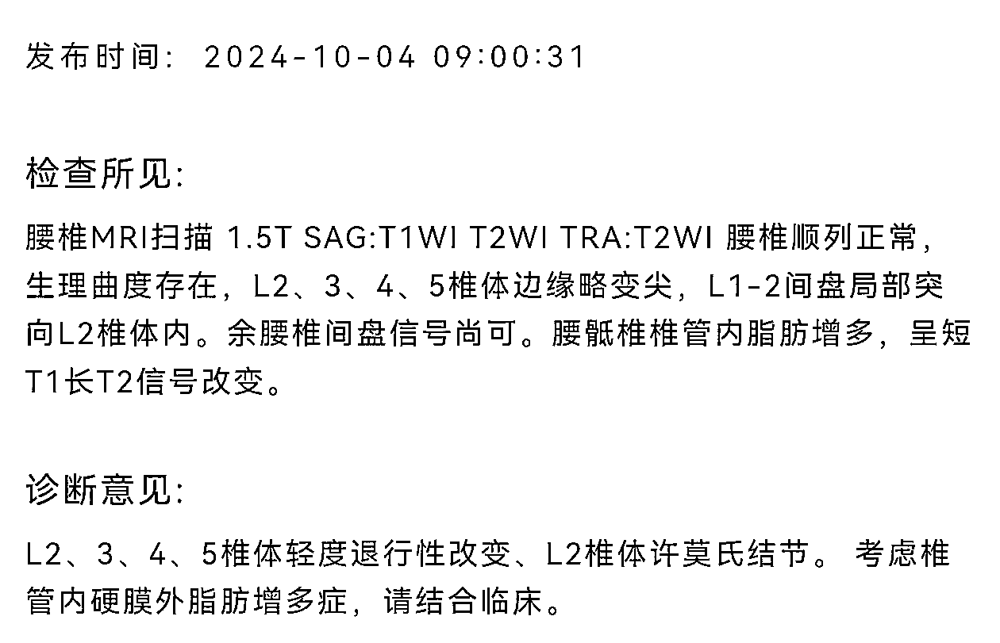

# 互联网人保命指南

> 来源：[https://p8tchgpz2u.feishu.cn/docx/OSS3dwoeeogJYixmVoUcuLkNnre](https://p8tchgpz2u.feishu.cn/docx/OSS3dwoeeogJYixmVoUcuLkNnre)

你好啊，我是梁靠谱，2008年入学天津医科大学，2019年入职全国百佳三甲医院，内外妇儿都轮转过，还干了三年ICU，到现在为止的十几年里，为上万人次看过诊，免费问诊星球运营了三年多，解决过很多身体健康和心理健康的问题，有一片自己的小杏林。

这篇文档是我根据我的经验和大家常见的健康问题，总结的一个基础版的各个习惯和系统的保养、体检、常见病诊断思路，希望大家在搞钱的路上，注意身体。

村上春树说过，肉体才是人的神殿，不管里面供奉的是什么,都应该好好保持它的强韧、美丽和清洁。

以下文字，仅代表个人经验和思路，个体具有差异化，生命科学无绝对，如果有急症和不舒适之处，大家要尽快就医，如果你是同行或者是杠精，有不同的意见，那就是你对，可以把多余的力气用在帮助别人上。

祝看到这个文档的所有人，富贵安乐、长命百岁。

# 妖怪都画你不画-皮肤篇

不知道有没有家人好奇过，为什么脸用了那么多贵的护肤品，还是有各种各样的皮肤问题，为什么屁股啥也不用，还白白嫩嫩的，这也根本不公平啊！

还有，为什么很多欧美的明星，他们的花期那么短，没几年就长残了，但是我们这边很多明星，却满40减20呢，这里面的差异化又是什么因素？

医美什么的当然是一部分原因，还有一个重要的原因是很多人都忽视的，就是光照，也就是紫外线。

其实内源性老化只占30%左右，70%是光老化，所以所有变美博主都知道一句话：养儿不一定能防老，涂防晒霜才能。所以一定要防晒，物理防晒是指拿东西包着、戴帽子、打伞等等，化学防晒是指涂防晒霜。而且是建议四季防晒、室内也要防晒、坐飞机等等更要防晒。

一个冷知识：我们在室内晒太阳，其实没办法补钙和补充维生素D，因为玻璃挡不住UVA、但是能挡住UVB，但是合成维生素D、偏偏是需要UVB，然后UVA就让人变老变丑了。

所以去外面晒，包住脸，然后就算是美黑，也要涂专业的美黑霜，因为紫外线会造成DNA的损伤，会导致皮肤的癌变等等，这个地方，还真是要注意了。

然后一白遮百丑是有道理的，人的审美，是先局部再五官，所以离远了看，人就是马赛克的色块，离特别远你也能看出来这个人的体态、发量、肤色、是不是健康。

美白和很多保养的方法呢，现在的主流主张，是医美大于内服大于保养，人衰老是从骨骼-骨膜-肌肉-韧带-脂肪-真皮-表皮的很多层开始老，所以想要辐射很多层，还是要上仪器才行。

贵的护肤品是有效果的，但是效果有限，也就吸收3-5%，而且大多仅限于表皮层，可以改善皮肤的质地，但是改变不了深的层次，以及每天0.02毫米的下垂速度。

所以其实皮肤的肌肉走向在变、颧脂垫在下移，很多的纹路都是组织互相挤压造成的，就像地震的时候，大地和大地互相挤压、然后翻起来是一样的，所以解决皮肤整体的问题还是要管理熵增，而不是一味地填充或者做加法。

所以很多人整形失败，其实不是当时就失败，而是当时的脸上看着能够暂时维稳，但是过后有衰老或者整体变化的时候，就会显得整得太过了。

人的美白是有一个上限的，大概参考你大臂内侧或者大腿的颜色，就是你的脸能达到最白的颜色，在这个之上，就是你的最白的界限了。

但人的好看和健康是没有上限的，你可以抗糖，防止过多的糖和蛋白质结合，生成终末糖化产物，让脸变黄，胶原蛋白断裂和支离破碎，你可以少生气和少熬夜，让氧自由基生成减少，抗氧化=抗老。

总之皮肤的保养是一个系统工程，根据自己的目标和自己的条件来动态调整，最简单的就是补水、早睡、防晒和开心，最便宜的医美其实是减肥，再热的热玛吉，也吊不住三两苹果肌，懂得都懂。

关于痘痘：别总摸、别自己挑破、可以涂夫地西酸，忌口不吃糖、不喝奶制品。

关于痘印：特别深的，有色素沉淀的，一两年还代谢不下去的，要打激光。

关于过敏：分区护肤、极简护肤、研究成分、医用护肤品、内服保养。

关于刷酸：不适用于角质层薄的人，酸的种类和浓度有讲究，不建议居家操作，要找专业的人。

关于斑点：斑是最忍辱负重的皮肤问题，潜伏期长，上面一颗、底下一窝，这个用涂抹肯定解决不了，号称祛斑的护肤品也基本都是概念性的，最终你还是要医美，做不做都要防晒。

关于长痣：有一些没有突出于皮肤表面的，可以用药物，有基地和突出的，基本要切一下，把基地挖出来，不然还会再长。要警惕黑色素痣，别轻易刺激，不然恶变了就不好了，尽快切。这个部分多嘱咐一句，一些比较相信面部风水这些的宝子，动脸之前找找专业的人指导，然后看看黄历，尊重一切想法。

关于红脸蛋：皮下血管的血管壁受损、皮肤科治疗、大概率也要打激光等等。

# 蒲公英孩子之殇-头发篇

二十年前的理发店，很流行的一个剪法、叫做打薄，头发太多了我给你剪掉一半、或者剪出一点层次。现在可没人说了，植发很贵，很多人的头发、很不能都有自己的名字，这个叫Lily、那根叫Lucy，掉一根就少一根了。

有人说脱发的原因是用洗发水什么的，但是这个确实是没有得到科学研究的证实。已经得到证实的因素里呢，是这几个：遗传、年龄、免疫、饮食、睡眠、压力、内分泌、外部物理化学刺激、脂溢性皮炎等等。

已知遗传和年龄这些是不变的，所以主流的影响因素，主要是压力、睡眠、饮食和内分泌和免疫状态有关，所以还是整个社会的意识形态、经济趋势、互联网环境等等，影响了头发的形态。

我小时候看日本的电视剧和新闻什么的，觉得他们当时的头发就不茂盛了，这个也跟经济和意识形态是契合的。没想到经济基础决定上层建筑，决定到头发上去了。

所以头发的养护方法呢，我们就从最严重的因素开始排除和处理，以上有哪样就先去除哪样，然后怀疑雄激素脱发的人，去查一下雄激素受体等等，必要的时候吃药解决。

已经证实有用的成分，外用的是米诺地尔、内服的是豌豆苗提取物，这俩我都用过，我的发量你们也见过，没什么学医和创业的痕迹，有时候我都觉得头发多，有点热（别打）。

然后，头皮防晒、很重要、别用特别烫的水洗头、很重要。

如果实在是多方尝试无果，也别气馁，现在的假发片以假乱真，很多明星也都戴的，努力赚钱，植发什么的，花钱买自己的或者花钱买别人的，用钱去治疗「没毛病」，咱们没毛病！

# 这是心灵的窗户-眼睛篇

现代人戴眼镜的真是越来越多了，开始近视的年纪也越来越小了，总体来说有几个原因，第一是电子产品盛行，几乎所有的小孩子都会操作智能手机和平板电脑了，第二是课业压力确实重，上学和补课、写作业的时间比我们小时候长很多，第三是户外时间短、室内时间长，近处用眼场景太多。

现代人眼底出问题的几率也大了，跟高血压、糖尿病这些疾病的发生发展风险有关，也跟人体的寿命变长有关，也跟疾病的诊断和治疗手段越来越发达有关。

所以总体不变的几个原则是，用眼要节制，不管是时长还是距离，都要注意，不管你是防蓝光还是什么高科技的镜片，你都不要让你的眼部肌肉太久保持一个状态从而失去调节功能。

除此之外，阻断继发因素的发生发展，比如血压、血糖，第一控制原发病，第二如果得了病、要检测和控制指标，第三如果有了迹象、要早处理，比如打激光等等。

我爸爸的眼睛做过几次手术，分别是糖尿病视网膜病变的玻切手术、白内障手术等等，因为手术之后没有听医生的嘱咐，没有恢复好，所以一只眼睛是只有光感，没有视力的，所以会损失掉空间感，有的时候倒水会洒，有的时候会撞到东西，以及视野是比两只眼睛都好的人要少一些的。

他的眼睛是我一直以来的心病，我很担心如果这只眼睛再保不住，他完全失明，该怎样面对生活，有时候我就很难想下去。有时候我刷到一些盲人在做自媒体的账号，比如盲人博士黄莺和宝哥和他的导盲犬，我都会去想象，我如果有一天看不到了，我是不是有勇气重建我自己的生活。

所以真的建议普通人不要自暴自弃或者自怨自艾，更不要浪费生命，我们四肢健全，五感无碍，其实已经是老天爷的恩赐，平静的生活背后有很多维持的代价。

眼睛如果有视力的下降和视野的缺损、感光或者飞蚊等等的症状，要及时去就医，该综合验光就综合验光、该查眼底就查眼底、该测眼压就测眼压，别拖着，很多疾病的发展是特别快的。

初次近视和近视合并其它的屈光不正的情况，最好去医院的视光中心去验光，因为你不知道外面的眼镜店准还是不准，影响你戴镜子矫正，在医院测完了，带着这个结果再去外面配眼镜、或者电商渠道买镜框，都好一点。

关于近视要不要手术，其实现代医学的评判标准就两个，很简单，第一是你是不是有意愿摘掉眼镜，第二是你的眼睛的情况能不能耐受手术，如果可以的话，就选适合的术式来做，现在的技术还是很发达的。

关于很多医生为啥不做手术、还要戴眼镜，倒不是因为手术不好，因为眼镜本身对于眼睛也是一种保护作用，像患者的血液、体液、甚至呕吐物那些东西、还有做实验时候的试剂等等，对于医生的眼睛来说，都是外部的风险，就算不戴近视镜，也要戴护目镜的，那还不如就戴自己的眼镜，免得哪天忘记戴了，造成暴露。

还有就是，很多人也没有好看之类的需求，也没觉得这个眼镜影响自己，就不会特意去做个手术了。

关于眼部感染的疾病，不如沙眼、麦粒肿、结膜炎等等，第一要注意用眼卫生，尤其不要用手去揉眼睛，这个习惯很不好，造成感染，还会造成眼周皮肤老化比较快。

确诊了感染之后，要及时用抗生素，彻底消除炎症，不然时间久了，炎症机化、形成包裹等等，有些人的散粒肿是需要切开引流的，切开了之后的睑板腺，形成了瘢痕，容易恢复不好，造成永久的用眼不适，所以要注意。

最后就是，蒸汽眼罩是有用的，可以增加眼周的血液循环，多转眼珠子、眼保健操从小做到大，眼镜太干可以滴人工泪液，就这样，爱护它们！

# 屁股上的仙人掌-痔疮篇

如果说有什么地方是人们都在谦让，生怕早点到自己的，要么就是十八层地狱下油锅，要么就是肛肠科住院处来换药。肛肠的疾病真的太痛了，经历过的人都有阴影，这个部位的神经超级丰富，又每天必须要用，不管是久坐还是吃辣还是便秘，它都没有办法独善其身，可怜的菊花。

靠谱自己本人是十几年的老患者了，高三的时候我妈妈献宝一样说什么喝苦瓜根水可以败火，就给我喝了结果她自己没咋喝，其实我学习挺好也没有火可以上啊。

结果就是前几天拉肚子、拉水，后面开始干燥、拉不出，当时也不懂用开塞露，就用蛮力，一开始是擦的时候觉得纸上面有一点血，后面发现屁股上就长小啾啾了，后来知道了，这是外痔。

再后面大学几年相安无事，就是偶尔有点痒痒，也过得去。再后面工作了，忙、久坐、饮食不规律、频繁去成都出差（不是）等等，就严重了，不仅那个外痔小啾啾越来越大，而且出现了血栓痔，就是疼得剧烈、不能缓解、一跳一跳地疼，严重的时候都不能走路，天天在床上趴着。

也是这一次，我人生中第一次尝试喝药，也是体会到了什么是病急乱投医，也让我同事帮我麻醉和切开引流减压等等，当然也都没用啦，这个中间，我心理建设了大概一年，终于决定去手术了。

可能因为心理建设太深太久了，真的手术就觉得还好，就完了？就结束了？手术还没有一次犯病来得难受呢？第一天早上办理住院，然后采血，然后灌肠，然后就手术了，下午回来了甚至医生就喊我出院，我说等拔掉屁股上的引流管和换药再出吧，医生：不用换药。

手术的麻醉方式是腰麻，就是往腰椎管里打麻药，然后屁股以下没知觉的那种，手术后两小时开始恢复知觉，然后带了镇痛泵也不疼，手术当天也睡得香，第二天就能吃饭了。

因为怕术后第一次排便受罪，所以天天吃白粥面条，还备了乳果糖，术后每天温水坐浴三次，加一点医生给开的促进伤口愈合的药，术后第四天排便，软软的，可以承受，不是很痛。

术后六天，底下长肉了，凌晨的某一刻突然感觉像针扎了一下，那个黑线就掉下来了，术后七天上班，术后21天第一次坐飞机出差。现在做完一年多了，有注意不久坐、怕出差饮食不规律上厕所会干，就备着开塞露，但也基本没用到，一次都没有犯过，整体就是上岸很香。

痔疮分为内痔和外痔，内痔一般不痛，但是便血很多，有的止不住，有的内痔会掉出来，外痔就是小啾啾，可能是一个，也可能是一圈，可能会痛会肿，混合痔的话就是都有。

一般就是时间越久、长得越多、手术的创面就越大、越疼、恢复得越慢。

所以对于痔疮的防治，谱谱我的主张是不久坐、多提肛、上厕所不带手机进去、没事多温水坐浴，尽量别得。得了呢也别怕，注意生活习惯，说实话我觉得这个病就是仙女的诅咒，你的生活习惯如果健康到连痔疮也不犯，那你其它的毛病也是不容易得。

最后就是，如果保守治疗真的保不住了，手术也没有想象的那样洪水猛兽，也没有外面传的一定会复发啥的，这个就是幸存者偏差，因为没复发的千千万万人也不会到处去喊说，老子痔疮手术很成功，巴巴适适嘞，所以在表达的都是不太好的一小撮人，才会让人有这种错觉。

# 国之脊梁的脊梁-颈肩篇

你别看一颗脑袋在那里比肩膀窄好多，就是一颗球，实际上它的重量、耗能不可小觑，成年人的头颅大概十斤左右，有100个鸡蛋那么重，你想想你拎着五筐鸡蛋就上个楼喘不喘？那咱们的颈椎支撑着这个头、要持续多久？经历多少场景？

这还是正常的垂直支撑，已经一直有向下的力了，那么如果是角度歪的呢？比如是倾斜的，低着头、伏案、盯着电脑，一点一点往前挪、往前看，久而久之，要不要出问题？

所以颈椎出问题，急性的一般因为外伤和暴力，慢性的就是因为长期的姿势不对。

我自己必须承认错误，我自己过去也没注意，所以我是犯过一次颈椎病的，是在有一年的新年，忽然就感觉头迷迷糊糊像一团浆糊了，每天睡不醒、还记不起东西，偶尔有点恶心，当时第一反应，以为我老年痴呆了，就想起《我脑海中的橡皮擦》里面的女主，然后也在想，我是不是长了什么脑瘤，后来才后知后觉想，是不是颈椎的问题啊？然后在大年初五去做检查，果然---

果然，C3-4、C4-5、C5-6间盘轻度变性、轻度膨出，老实了，休息了挺长时间，好了以后也再也不敢熬夜，办公注意姿势、然后开始吊单杠、游泳了。

日常保养颈椎，意识是最重要的东西，不管你是弄电脑支架还是高的桌子，还是像某参那样常年戴颈托，总是，姿势和时长上，一点要从根源杜绝，尽量别让骨头变性。

另外，肌肉和筋膜的强韧，也可以保护骨头，所以日常的肩颈操可以做，打开任何一个自媒体软件或者keep之类的，每天跟练就行，中医推拿什么的也管用。

我之前去找中医师傅，他根据我的情况，触诊一下就知道了我的所有不良习惯，比如脊柱有点偏，工作的时候是不是可着一边使劲儿用，比如腰肌劳损等等，因为肌肉日常的收缩，是可以缓冲运动带来的震动和损伤的，如果肌肉长时间保持一个动作，很僵硬，那么就失去了保护作用，那么韧带就会代替它来出力，然后久而久之，韧带也会钙化，那么僵硬的肌肉和韧带就会拉伸骨头，让骨头变形。

所以主动地锻炼肌肉，被动地放松肌肉，也都有一些作用。

值得注意的是，不是所有类型的颈椎病都适合推拿和牵引，如果是一些特定的类型，骨头动了，反而会影响骨髓和神经根，越按越严重，所以已经出现了病变的宝子，你要先拍片子确定情况、再去对症处理。

颈椎的病变，会从前期的劳累、到轻度变性、到重度病变，从物理治疗能缓解、直到只能手术治疗，我们可以在任何一个阶段主动叫停，就医和改善生活习惯，千万别挺着、也别拖着。

值得注意的是，锥体的疾病啊，它不是说做完手术就能一劳永逸的，锥体是一节一节的，本身是可以自由活动的，手术完了之后，其实是融合到一起，这个部分不能缓冲和发挥功能，那它的活儿就要临近的几节来代劳，久而久之，临近的锥体也会出现问题。

像什么呢？一座吊桥有很多块木板一起作用，突然有几块木板碎了，就换了一块新的，几块换成了一块，那么临近木板的接头处，受力跟原来不同，也是容易出问题的。

颈椎的手术，在骨科里，也是非常大的手术，头发全剃光备皮，后脑勺和脖子全部把皮肤打开，二十多厘米的伤口触目惊心，恢复期也超级久，但是到了份儿上，也不能不做，因为如果不做，神经和血管的压迫症状，会让人整个瘫痪，失去对整个身体的支配作用。

所以，我们这一代人，是久坐的产物，可能还有一些人，他们的不良生活和工作习惯还没有开始产生蓄积作用，到一定的严重程度，一定要警惕，一定要注意日常保养，我不希望在门诊和住院处见到你们任何一个人。

# 别成为现代孙膑-关节篇

膝盖是不可再生资源、做关节置换手术很贵，这是本章节的两个前提。

关节起着连接、缓冲、运动、保护等作用，平时感觉不到存在，但是一生病就挺不方便的。

首先，所有胖子的关节都更容易出问题，比方说一个人200斤，小腿和脚占30斤，那么剩下的170斤体重，都压在了膝关节上，你说说这得是多大的压力，如果这个200斤的人再跑跳什么的，关节是不是每天都在加剧损伤？

其次，不要让关节的血运不好，也就是不要长期久坐、不要长期着凉，做好保暖，泡脚和按摩都可以安排起来。

第三，警惕关节疾病的继发因素，比如高尿酸会导致尿酸盐在关节结晶、然后形成慢性炎症，继发痛风，非常非常痛苦，还有免疫性的疾病，也对关节都有损害。

第四，警惕运动副损伤，比如姿势不正确呀，比如热身不到位呀，比如大体重基数减重的时候太激进、或者运动的方式不适合啊等等，一定要建立耐受、充分热身、专业指导下进行等等。

然后关节本身不好的，一定不要爬山、不要爬楼梯！

保养关节的一些好物，外用的可以是活血类的膏药，可以是加热类的敷料贴，都是促进血液循环，加速炎症的消散和积液的吸收等等。内服的是钙+骨化三醇、氨糖软骨素等等，增加骨质密度、增加关节缓冲等等。

# 妈说小孩哪有腰-腰背篇

其实有腰的，现在小孩十几岁，成绩和财富还没突出，腰间盘就突出了的案例可真是不在少数，那就说明一辈子不能久站、久坐，不能劳累了，真的很无奈，就像《如懿传》里，富察皇后的嫡子有哮喘，作为储君的有力竞争者，不能骑马、不能打猎那么无奈。

现在人一般如果腰疼来问我，我首先让他去两个科室，泌尿科和骨科，前者去排查肾结石，后者去排查腰椎间盘突出。如果有合并症状，那指向性就更大了，比如腰疼合并血尿，这大概率是泌尿科，比如腰疼合并腿麻和腿疼，这大概率是骨科。

当我们是猴子的时候呢，是四脚着地爬的，后来进化成了人，是双腿直立行走的，一直到进化为现代打工的牛马，才开始了久坐的征程，但这个动作实在危害太大了，对颈椎、腰椎、菊花、下肢血管等等，都会产生危害。

比如我爸就是最近做了椎间盘突出切除手术，因为压迫神经导致的腿疼，已经困扰他好几年了，试过很多地方的很多种方法，还是没有缓解，住院的时候，主治医生都说，你自己女儿在医院工作，怎么还没有这个意识呢？

手术切除了突出的椎间盘、还有部分黄韧带和肌肉等等，医生给我看了照片，整体是黄褐色的，有些地方已经发黑了，手术比较顺利，术后症状消失也很明显，同病房的患者里，他是最轻的，有一个已经半年不能动，也不能平躺睡觉了，真是一个人间酷刑。

我之前在网上看其他医生的自媒体账号，看到有一位患者，因为太疼了、太痛苦了、迟迟不能缓解，于是喝农药自杀，然后被救过来了，做了手术、解决了痛苦，对医生感恩戴德。

我自己在医院里陪护我爸的时候，也开始腰疼，因为之前我也有过一两次腰疼和腿麻的经历，虽然当时拍片子没事儿，但我总觉得是因为处在腰突的临界状态，离腰突不远了。

我就先戴上了护腰，然后强忍着把我爸陪护出院了之后，去拍了个核磁，结果显示，椎管内脂肪增多。

这是什么意思呢？你们吃过牛骨髓、大骨棒没有？看过美食博主直播嗦没有？大的骨头内部是空腔的，里面装的是骨髓、神经、血管等等，我的腰椎管，里面脂肪多、压迫了坐骨神经和马尾神经，造成了这个症状。

后来我查了很多文献，有人是因为生病然后应用外源性激素，造成的脂肪重新分布，有人是因为过胖，我自己都不占，就还是因为久坐、腰椎的压力太大，所以保护性的脂肪增多，就造成了症状。

其实这是人体的代偿机制，人体的自我调节功能其实是很强的，每天都在不停高速运转+及时调整修复，代偿期就是还能调整得过来，如果严重到失代偿的时候，就会造成各种的机能崩盘。

后来我就调脂，吃了一个月的他汀类降脂药，然后没事的时候就躺着，过了不到一个月，症状就完全缓解了，截止到我发文，也没有再犯过。

然后我办了游泳卡，每天下班去游泳，这个运动对心肺、颈椎、腰椎都很友好，运动时候的曲度，很符合生理曲度，未来只要不是条件不允许，我都准备一直游下去。

而且我还配备了骨传导耳机，可以边游边听播客，这样就不会无聊啦，身体和灵魂都在路上的感觉，是很好的。

腰不好的小伙伴，尽量不要做对腰椎有压力的运动，比如骑马、跳绳什么的，可以多吊单杠、然后开背、摸门框等等，可以做臀桥和小飞燕、加强后背的肌肉，来保护骨头，最重要的就是不要久坐，可以考虑买升降的办公桌，总之不要保持同一姿势过长时间，腰太重要了！

# 是消化也是免疫-肝胆篇

肝脏是身体的大化工厂，是劳模，身兼数个作用，它代谢身体的营养物质，参与代谢维生素和激素，所以肝脏不好的人，容易缺这缺那的，肝硬化的男患者，会出现乳房发育什么的，就是因为肝脏对雌激素的灭减弱。

然后肝脏能合成胆汁，虽然叫胆汁，但是大部分是干细胞合成，胆囊负责分泌的。

肝脏能解毒，所以代谢一些物质的时候会超出本身的负荷标准，造成急性肝损伤，也有一些物质是本来没有太大毒性，代谢之后毒性变大，让人体受伤的。

它还有免疫和血容量调节功能，还主导凝血因子的生成，所以肝硬化患者凝血功能障碍，容易大出血。

肝脏最怕的东西有五样：病毒、酒精、各种药物、暴饮暴食和熬夜和情绪不好，而且这个器官是做得多、说的少，一般不会抱病喊冤的，因为神经分布不多，所以即使是严重的病，也可能不疼。

以前在体检不普及，和很多人没有体检意识的时候，经常因为肝癌的晚期造成牵拉疼或者黄疸、消瘦等等，一查才发现是肝癌晚期。

所以平时有意识规避风险、定期体检、尽早就医，是特别重要的。

# 怎么就变态了呢-过敏篇

很多人去医院问导诊，我过敏了，要挂什么科室，导诊说，变态反应科，患者一听就懵了，好好的人，怎么就变态了呢？其实不是，过敏在医学上就成为变态反应，而且还分四型呢。

为什么人人会对常见的物质过敏呢？牛奶、鸡蛋、粉尘、螨虫、猫狗，冷空气都会有的，甚至有人因为对老公的小蝌蚪过敏，这简直是太离谱了，对吗？

过敏的机制其实是我们自身的识别、反应和防御的系统出了问题，然后认不出正常的内容了，开始发动异常攻击，然后就把自身的组织和器官等伤到了，大水冲了龙王庙，自家人打自家人。

有人说最近免疫力低、才对什么东西过敏，其实还真不是，一般都是异常性增强、敌我不分，才会导致各种症状的出现。

那么过敏的表现呢，也是各异的，有轻有重，体现在头上，就是打喷嚏、眼睛红、痒等，体现在皮肤上，就是痒、长疹子，体现在肠胃，可能是腹泻，体现在生殖系统，可能是流产，还有一些肝炎、脑炎，就比较严重了，更有甚者，体现在喉头水肿，会窒息，然后危及生命。

所以呀，所有没确定过是不是过敏的小伙伴，如果有突然异常的症状，就要去看医生，查查过敏原，确定一下是不是过敏了，已知过敏的小伙伴，要远离过敏原，这是第一要义，养成点单和买食物前先确认有没有不能吃的，对自己的身体熟悉，常备抗过敏药，以及如果感觉有什么不对劲，一定要及时去医院。

免疫状态呢，也很玄学、不好把握，有时候无缘无故就对一些东西有反应了，当然也有少数一直过敏的东西突然就好了，但我们还是可以从无常中去提炼恒定的因素。

你如果听说过这几个病，神经性皮炎啊、应激性溃疡，就会知道，很多的疾病，其实都是跟精神和心理因素有关的，你像现在关于身心疾病、躯体化症状的研究真的挺深入的，所以人体真的受精神心理因素影响，免疫系统也是这样的，凡事不要太往心里去，好好吃饭、好好睡觉。

# 我有一个朋友问-男科篇

怎么说呢，别害羞哈，在医生眼里，人只有生理学的XX和XY，以及第二性征的区分，其它的就是就事论事，想了挺久这个part应该怎么写，那我就按照感受和功能两个方面来写吧，前者是亲密关系里，彼此的感受，后者肯定是遗传功能啦。

感受上，这是一个双方的问题，基本上我觉得，它是一个结果导向，只要两个人觉得是OK的，那么长度和直径，其实就没有一个绝对的标准，如果有不OK，就要坦诚相待、先沟通，然后解决问题。

1、时间短，一般定义时间短，差不多是两分钟，但是如果少于两分钟，两个人也挺满意，那也不用处理的，然后时间短呢，分原发性和继发性，跟很多因素有关：比如遗传、皮长、敏感度高、精神心理因素、以及一些慢性病等等也会影响。

一般先诊断原因，然后对症下药，药物治疗+精神心理治疗+戒烟戒酒+避免外部的理化刺激+控制慢性病+养成良好的生活习惯+跟对方多沟通增加彼此的亲密度等等。

如果都试了还是没办法，还有一些配合器械和外部辅助的装置可以尝试，总之现代医学还是非常发达的，很多人都面临这个问题，不要讳疾忌医。

有的男生真的致死是少年，六十岁往上还能生孩子，有一句诗叫一树梨花压海棠，说的就是一个诗人老夫少妻，年纪很大了，小妾还给他生孩子，被好友调侃，梨花是白色、指的是白头发，海棠是小姑娘。

这俩人很恩爱，小妾还生了好几个儿子，最后老头没了的时候，她也因为伤心过度，没多久就去世了。

2、长度短，这个一定建议减肥，有研究说，体脂率每增加10%，兄弟的长度可能会短1-2厘米，成年男人减重十几斤，兄弟可以增加1英寸的长度，所以，先减肥。

然后，脂肪越多，睾酮的水平越低，过多的雌激素也会让男性的特征变弱，影响男友力、影响战斗力，越来越姨，最后变成姐妹，所以这样真的是不行。

如果实在短到鞭长莫及，现在也有手术可以拉丁了，是把韧带切断，用内填外拔的缝合技术，差不多可以拉长2-4厘米，还是挺管事的。另外还有补片植入术啊、肢体脂肪注射啊、肢体皮瓣移植啊、玻尿酸注射啊，很多种方法，但是一定要去正规三甲医院的男科或者泌尿外科去做，千万不要去私立、莆田和奇奇怪怪名不见经传的医疗机构，那可是命根子啊要重视。

最后，如果长度上不占优势，其实也可以在其它维度苦练，让对方达到满意的状态。

3、遗传功能异常。首先，想要孩子的男性，不要总是泡热水澡、蒸桑拿等等，小蝌蚪的发生和发展，都需要一个比人体内部更低温的环境，所以睾丸才在体外，太热不成。

然后一般其实建议准备要孩子的夫妻，都常规做一下检查，包含了传染病和遗传病的检查，男生查一下精子，女生要查的比较多，生殖系统的超声和TORCH，激素水平等等，如果没有异常就可以正常备了。

如果超过一年没有动静，就做进一步检查。然后也有夫妻，是婚检完了就备，如果备不上了再检查的。

很多因素都会影响活力和畸形率的，比如抽烟喝酒压力大，所以如果把优生优育当成一件大事，那还是要积极配合调理身体的，毕竟男生你就努力这一哆嗦，比较受考验的都由女生完成啦！

另外有一些医生也会建议备孕期间，男生也同步补充叶酸，这个反正成本也不高，让你补就听话跟着补就好啦，毕竟娃出来了跟你一个姓不是？

另外，吃富含氨基酸的干净饮食，油炸的太刺激的少吃，内裤不要穿太紧，别照X线，避免一些化学物质的刺激，别吃有生殖毒性的药物。

# 我还有一个朋友-妇科篇

女性的尿路短、宽、直，男性的尿路长、窄、弯，所以先天的结构决定了，女性的泌尿系和生殖系统，感染的几率都会比男性要高一些，所以在这一块更要多注意。

而且每一次的两性行为，都是一次菌群的破坏，所以之前要清洗、之后要排尿、上大号的时候从前往后擦，这都是挺重要的，要养成习惯、规避风险。

有了两性经验的女性，都要按理每年查HPV和TCT，第一看看有没有高危感染，第二有没有宫颈的病变，尽早发现、尽早处理，你看著名的明星梅艳芳，就是宫颈癌过世的，这个病跟HPV高度相关，所以有条件的要打疫苗，甚至已经有感染的，也要打，因为这个人乳头瘤病毒有很多分型，即使感染了一种，对于其它的分型来说，也是有预防意义的，打疫苗始终能获益。

这里多提一句，HPV有高危也有低危，低危的没有致癌作用过，像有的人脖子上长的肉丝、肉赘，那个叫丝状疣，就是跟低危的HPV感染有关，明矾酊、乳酸溶液、5-氟尿嘧啶外用溶液等外用，无效就激光和冷冻等。

然后呢，女性的Y道的健康环境呢，是弱酸性的，PH值大概4左右，是乳酸杆菌代谢来维持的，如果有什么原因破坏了这个环境，抵抗能力就会下降、造成很多外来菌群的感染，如果感染呢，也会破坏这个环境，互相促进、互为因果，所以千万不要乱用洗剂。

正常的分泌物是透明至淡黄色的，没有味道、量少，如果出现了性状的变化，就要及时就医，该内窥镜检查就检查，该留分泌物化验就留化验，先确诊、再用药，不要擅自用药。

然后月经量不管过多还是过少，还是周期过长或者过短，还是过程中特别疼，都去医院看看，是不是有肌瘤、是不是雌激素水平过低、是不是有内膜异味等等。

如果有体质特殊的女孩子，月经期间疼到受不了的，不是不能吃止疼药的，布洛芬这类的，一个月吃一到两片，不至于有成瘾性或者特别大的危害，总比疼昏过去要强。

红糖水无效，有效的是热水，但是男朋友的关心是有效的。

不要相信任何安全期，不要为了任何男人的任何承诺伤害自己，结婚之前，或者没有生育计划的时候，要绝对做好避孕，所有女孩子要先爱自己的身体，别人才会来爱你。

男孩子如果爱女孩子，可以尝试分开用马桶，如果不能分开，你坐下排尿，会让马桶周围的细菌等等的浓度变低，也会对这个女孩子的健康有益处。

不管男生还是女生，做凯格尔运动，都是有益的。

为了自己和对方的感受更好，现在有一些私密的项目，比如让黏膜变紧致、让盆底肌变紧致等等，都是确切有效的，可以自己锻炼，也可以电刺激，也可以both A and B。

有一个医美的项目，叫Fotana 4D，它有一个黏膜的模式，是用一个圆柱形的探头，伸进嘴里，让两边腮帮子里面的黏膜受热收紧，来让口角的皮肤抗衰紧致、解决口角囊袋和下颌缘不清晰等问题。

是不是特别熟悉？黏膜？探头？紧致？是的，本来它的开发就是解决私处的问题。随着现代女性的觉醒，大家取悦自己的意识越来越强，这个市场也越来越大、越来越成熟了，这挺好的。

所有男科篇和妇科篇更新完了，想跟男孩子女孩子们说，要爱自己、要注意卫生和健康，但也不要因为生了病而觉得自卑或者不好意思，生病不是你们的错，只有意识到了这个问题，才能去正规医院就诊，不要去莆田系和任何不正规的医疗机构就医，然后被骗，知道吗。

# 一辈子都在念叨-减肥篇

在所有的减肥方法里，我对于饮食的调整，最认同的一个是8-16进食法，也就是在一天的8小时之内，完成所有的进食，剩下的16小时不吃东西，只喝水，甚至有一些人会2-22进食。

这种方法，不光能够减重，还能让血糖平稳，如果是一天三餐的进食，其实血糖的波动是很大的，如果再加餐和吃零食，那血糖会经常飙升到十几甚至二十去。

有一些自媒体博主，就戴那种皮下植入探针的血糖探头，在大臂上贴住，然后可以持续几十天，连上手机，每天24小时实时检测血糖，就发现，很多食物对于血糖的影响，远超我们的想象。

血糖忽高忽低，第一对胰岛是很大的负担，我有一段时间的感觉是，如果我没吃早餐，我就不会有什么特殊的事情，但是我如果吃了早餐而且是喝了粥的话，接近中午的时候我就会低血糖。

那这种胰岛素分泌的大开大合，其实也是糖调节受损的一种，因为我们家族是有糖尿病基因的，所以我自己就从年纪很小的时候就开始注意。

血糖忽高忽低，第二是，胰岛素分泌，会让人变胖。人体的血糖调节激素，升糖的有很多，比如肾上腺素、胰高血糖素等等，但唯一能降低血糖的就是胰岛素，它降血糖的机制是，让组织利用糖的这个动作加剧，那怎么利用呢？要么消耗、要么储存，所以就变成糖原等，还有最讨厌的脂肪了。

所以升糖指数高，胰岛素分泌多，储存脂肪过多，变胖就是这么来的，从糖到脂肪很容易，想要让它们出去，可就不容易了，所以保持血糖稳定，和控制升糖食物的摄入，这就至关重要了。

糖这个东西，反正是双刃剑吧，人的基因就是嗜甜的、好好工作又需要它功能，但是如果多了，就会变胖、变老、变丑、长痘，甚至糖摄入太多了，还会影响各处的菌群，导致感染概率增加。

所以控制进食的时间，以及种类，还有速度，这个就是我们普通人成本最低的减肥了。

大家可以下载薄荷营养这类的APP，学会看配料表，糖太多的、过度加工的少吃，不要不知不觉吃掉了太多而不自知，学会吃低GI（升糖指数）的主食和配菜，用代糖做饭等等，一点一滴减少摄入。

说完了热量的摄入，然后就是消耗了，它分几个部分，1、基础代谢，就是维持我们每天机体运转的这部分，越年轻、肌肉含量越多，基础代谢率就越高。

2、小孩子还有成长发育，这部分要占很多的热量，所以才会有半大小子、吃垮老子的这个说法，大人就没有这个部分，所以才会中年发胖。

3、消耗掉的部分，就看大家自己能适应的方法啦，我见到过干啥瘦下来的都有，跳绳的、游泳的、郑多燕、打拳击的，都行，只要每天消耗的比摄入的多，就能瘦下来，只是量力而行，看看速度和效果。

减肥的产品有没有用呢？我觉得是有的，要看成分和作用，要么就是增强饱腹和减少吸收的，要么就是促进排出，或者改善肠道菌群、增加消耗的，这里不做推荐，大家自行功课，告诉你们一个方向，如果不确定，就把配料表上靠前的成分，一个一个去查，确认效果和有无副作用。

其实容貌和体重，跟世上很多东西一样，是熵增的，不管理就会无序增长，没有一劳永逸的事情，你对自己有要求，就代表了要常年服美役，每一天的行动都来匹配，we are what we eat，we are what we choose，认真和选择决定了你的行为，而行为决定了我们是谁。

# 生气留在奶子里-乳腺篇

你知道，女性更年期的很多症状，都是跟雌激素的水平骤降有关，那么为什么我们不去外源性补充雌激素来治疗这些症状呢？明明雌激素也不贵，是不是？

那是因为，过多的雌激素，对于乳腺是一种风险，致癌的作用是确切的，所以，除非是特别严重的病例，否则我们不把外源性补充，作为首选的治疗方案。

然后，很多的乳腺疾病，也跟育龄有关，绝经之后可以自行缓解。所以，有乳腺疾病的人，也不能吃维生素E，也要少吃豆制品，因为维生素E和大豆异黄酮，都是类雌激素，都会对乳腺有刺激作用的。

所以女生生气和情绪不好，会通过影响体内多种激素的波动，对乳腺造成不良影响，如果产后家庭关系不好，可能直接就乳汁淤积和乳腺炎了，女孩子一定要开开心心的，没有任何人值得你不开心，每一次生气，都会变成结节存在你的奶子里，如果是这样，还要生气吗？

另外，女性的乳腺健康，要定期自检，顺序是：外上、内上、外下、内下、中部、腋窝，也就是右侧乳房顺时针，左侧乳房逆时针，然后中间和腋窝也要查，如果发现了肿物，或者血性和脓性的分泌物，要抓紧去医院检查，早干预，一定比晚干预的代价要小得多。

另外，乳房的日常保养呢，也要小心呵护，不管多激情、不建议暴力对待，不过长时间穿着太紧的内衣，扩胸运动、任何年龄都不晚，把肌肉和韧带保养好了，外层也会更加坚挺。

最后，心情好、睡眠好、饮食好，对什么器官都有益处的。

# 身体的第二大脑-菌群篇

我是学西医的，但我对中医的态度挺客观的，我觉得择其善者而从之，其不善者而改之，我也研究过一些患者问我的中医问题，其中比较有意思的一个概念叫做脾胃。

中医的脾胃，并不是西医里的器官脾和胃，我一直很好奇，这个脾胃不合，指的是哪里不合，以及为什么这个脾胃，能影响到人体的那么多种功能，它在哪里呢？

直到我看了一些文献，忽然觉得，这个脾胃，很有可能是肠道菌群。

肠道叫人体的第二大脑，肠道菌群已经证实过跟人体的几乎所有器官的疾病都相关了，尤其是跟痴呆、记忆、睡眠、情绪等也有关，作用远超很多人的认知。

人身上有很多细菌，一个100斤的人身上，有3斤左右都是活的或者死的细菌，包含但不仅限于肠道菌群、口腔菌群、阴道菌群、呼吸道定植菌群，还有皮肤表面的细菌等等。

这些细菌的基因组加起来，会是人本身基因组的几百倍，所以作用很多。

比如夫妻为什么会越来越像？有几个原因，包括了饮食习惯，不自觉模仿对方的表情，就会有相应的表情纹相似，就更容易让人觉得连相。还有很重要的一点就是，菌群会通过共同饮食和亲吻互相交换，它也会潜移默化影响人的身体健康和容貌。

之前的科研，说把瘦的动物的肠道菌群移植到胖的动物身上，饮食不变的情况下，胖的动物也能变瘦，所以好基因和好菌群，真的很值钱的。

然后很多细菌呢，它是本来日常的环境里就有的，在人体有一些异常行为和状态的时候，就会出现在本来不应该出现在的地方，比如大肠杆菌从肠道进入到泌尿系，就会造成尿路感染，比如着凉了免疫力低、就会感冒等等，所以要保持开心、保持营养状态充足、保持保暖，让自己的免疫力杠杠的。

最后是，有一些细菌呢，是跟恶性肿瘤相关的，比如幽门螺杆菌，所以体检的时候别忘了查这个部分，有创的检查是胃镜，无创的检查是碳14呼气试验，如果是阳性，在没有禁忌症的情况下，进行四联根除，停药之后四周后复查，是否根治成功，如果家里大人确诊了，要跟老幼分餐，不在一个盘子里吃饭。

# 车都保养那人呢-体检篇

都说现代人疾病的各种疾病发病率高，主要原因有三个：第一是，平均寿命长多了，古代人平均活个三十几岁，没到疾病的高发年龄呢就嘎了，好消息是没生病，坏消息是死的快。第二是生活习惯和饮食习惯确实不健康，这些因素都加速了疾病的发生和发展。

还有很重要的一个原因，就是体检的普及和意识增强。即，以前也有很多人罹患疾病，但因为没有检出，所以就没办法统计出来。

那么体检的原则呢，靠谱建议分成几类：

1、保底类，不管男女老少，不管有没有家族史、慢性病，都要体检，最晚不要超过30岁，就要进行第一次、全面的体检。像我们医院的职工，35岁以下没有免费体检，所以我都是在外面自费找体检机构、或者门诊挂号、或者直接找我同学做。

这种体检要包括血、尿的常规，生化系列，肝胆胰脾超声、泌尿系超声、甲状腺乳腺的超声，还有胸部的CT，然后根据个别化验的指标异常来定位，找出哪个系统需要进一步检查。

2、进阶类，比如有高危因素，像年纪超过30岁，或者是抽烟、喝酒、有家族史等等，就要查胃肠镜、头CT、冠脉64排等等，去排除消化系统和心脑血管系统的疾病。比如有高危生活史或者病史或者家族史，要查肿瘤标志物。

3、保命类，这种是指已经生过一些病，一次体检，兼顾了体检+复查的职能，就要根据自己的疾病去查相应的检查了。比如尿酸高、痛风，就把关节的核磁也做了；比如糖尿病，就把眼底、心脏大血管、下肢静脉的超声也做了；比如高血压，那么眼底和肾脏和脑血管等等靶器官，都要检查，务必让并发症在发生和发展的时期停下和延缓。

看了这么多呢，你也不用担心，现在不管是医院的体检中心还是外面的体检机构，都会给你几类的套餐去选，比如ABCDE，也会有男女差异化。如果还是不清楚，就直接把自己的病史和家族史跟体检中心的医生说，他们会给你做相应的推荐。

等报告出来了呢，不要看到箭头就焦虑，也不要看到什么结节和囊肿就害怕，很多单独的指标轻度升高、稍稍高于正常值的上限，是没什么临床意义的。

所以要找体检医生或者医院的医生帮你看一下报告，对自己的身体情况有个掌握和认知，把发现的问题分层成这几类情况：

a、必须要尽快处理的情况，比如恶性肿瘤、肌酐特别高，因为很多很严重的病，因为其发生位置的原因，在到了终末期之前，也不会有疼痛的情况，所以一旦发现就很严重了，都是沉默的杀手。

这里我把四高也放在这里，高血糖、高血压、高血脂、高尿酸，一旦发现了，最好就是当即干预，有的人会觉得，我可以通过饮食和生活习惯调理一下，但靠谱不这样认为。

我认为你需要尽快先通过药物把指标降下来，然后再去通过生活习惯去保持，因为高指标状态每在你身上持续一天，你的生体就有可能产生一些不可逆的变化，比如血管斑块、比如关节滑膜的尿酸盐沉积、比如眼底出血等等，所以原则就是，你要尽快脱离危险的外部环境和内部环境，然后再考虑重建的事情。

b、在一个期限内要处理的情况，十天半个月不弄也不会说马上就嘎掉，可以给你一个请假、安排工作的周期，但不能一直拖下去，因为有风险、早晚还是要处理的，比如疝气的修补、比如皮肤的黑色素痣、比如高危的HPV感染、甲状腺4类结节等等。

但是也不绝对，如果病情有了变化，也要提高优先级，赶紧干预处理。

c、暂时不需要处理，定期复查就可以的情况，比如甲状腺功能正常情况下的1类和2类结节，比如影像学上表现的比较小的肝、肾囊肿，没有症状的小结石、不能明确性质的小肺结节等等，这些就根据检查结果调整生活习惯、然后定期复查。

多说一句，体检和日常自己检查的时候，要注意流程是标准的，免得影响了结果、造成误差，影响你自己的调理和干预。

比如说，有人留尿的时候，手指碰到了尿杯的内壁，手上的细菌混入到尿样里，误诊断为尿路感染。

比如说，有人扎指尖血糖的时候，还没等消毒的酒精干透了就开扎，或者出血了之后用力挤压手指，造成了组织液混到血液里，这些都会造成血糖的测量结果不准确的。

比如说，测血压的时候，要静息一段时间后再测，就算抽烟也可能影响结果，还有那个血压计要跟心脏的水平持平，这些都会有人操作不规范，然后影响了结果，用错误的结果去指导用药，最后也会不规范的。

还有，体检的前一天清淡饮食，不大鱼大肉、多盐多油，但你也不要全天禁食，这样也会对代谢造成影响、导致结果误差的。

现在的科普视频很多，你操作之前，上抖音找几个黄V认证主任的视频看一下，就能对着自己操作了。

# 不行了就搬救兵-补剂篇

我们在医院里接诊，或者生活里帮身边的亲朋答疑，经常听他们说的一句话就是，我以前也没这个毛病啊，我去年还好好的啊，等等。说实话，让一个人承认自己生病了或者在退化，是一件残忍的事情，但我们活着的每一天，都是现在最年轻，也状态最好的一天了。

到了巅峰的年纪之后，任谁都在走下坡路，所以像乔布斯、何鸿燊，再有财富的人，也没有办法实现用钱来续命，所以有了钱和权力的人，他们的统一梦想，就是长生不老，不论是我们那个迷人的老祖宗秦始皇，还是现在拿着几千亿搞生命科学的拼多多黄峥。

人生有八苦，生老病死，恨别离、爱长久、得不到、已失去，每个人都在轮回里，所以其实接受越快，就能越快作出相应的措施，来对抗风险，让自己获益。

你可以把人体看成一个蓄积很多种物质的水池，就像咱们在初中的时候学的数学，一个泳池，一边放水、一边蓄水的那种，人体也是，任何一种营养素也好、代谢指标也好，都是一边饮食摄入、加上自身代谢生成，另一边通过消化系统、泌尿系统或者皮肤和呼吸道等等排出体外。

所以有动态平衡，就会出现不平衡，比如血脂和尿酸高，就是摄入太多或者代谢异常，或者收入过多+代谢异常，比如甲减和糖尿病，就是激素分泌减少和/或利用异常。

那么在这个基础和宏观之上，就不会觉得吃补剂这件事儿有啥毛病了，也不会存在什么一旦外源性补充，机体就不会自己生产的这些说法了，都不是真的。

目前主流的补剂和保健品，我自己吃过和见别人吃过的，主要有以下这些类别，对心脏和心脑血管起作用的辅酶Q10和鱼油，对眼睛有作用的叶黄素，对皮肤有作用的胶原蛋白肽，一些细胞级抗衰的NMN和NAD+、细胞功能的胆碱和肌醇等等----

一些有功能的微量元素，比如补锌和镁，会明显让情绪变好和心情稳定、减少冲动，比如特定人群补充钙、铁和维生素等等，还有一些补剂，是用来增强记忆力和改善睡眠的，比如GABA。

另外是国民保健产品益生菌，疫情的那几年，就被很多专家推荐的，肠道承载了人体70%左右的免疫功能，而且儿童成长发育所需的一些物质，也要依赖于肠道的有益菌来合成，所以肠道健康非常重要的，有需求的人群补充益生菌，这个也是推荐的。

另外，衰老缘于氧化，所以抗氧化具有抗老的作用，所以虾青素这类的产品，作用也是蛮确切的。

我记得去年双十一看到过一组电商的数据，说是保健品的消费额，达到了历史的新高，这说明大家的保养意识和保健意识都比较强，这个市场未来也不会衰减。

就现在的生命科学还有商业领域来说，整体对于补剂的态度还是比较积极的，靠谱觉得，如果要吃，有几个点注意一下：1、一定要是正规公司生产、正规渠道购买的，偏方或者不明成分的粉末、千万别碰。2、吃之前要知道自己的身体状况，有没有一些基础疾病或者肝肾功能不全等等，如果有，要遵医嘱。

3、别贪多，一次别搞太多，不然也会有代谢负担，根据自己最稀缺的程度选一样或者几样，换着吃或者规划经济。4、补剂是一种额外的加分，千万不要觉得有了这个，你就可以随心所欲、大吃大喝大熬夜等等，该克制的地方还是要克制，这个不变。

# 看到了才会敬畏-好物篇

我自己的公司是设有健康角的，其实成本不高，也就是血压计、血糖仪、消毒的酒精和碘伏，还有试纸，以及一些常备药等等，置办加上换耗材，每年不到一千块钱，但是体现了关怀的文化。

为什么要放这些东西呢？我会觉得因为看到了才会敬畏。

比如人都是看了一些安全性的新闻，比如着火的、爆炸的、安全生产的，然后就去刻意注意一段时间，等过一段时间又松懈了，这些都是人性，所以要实时提醒。

我会建议家中有老人、有慢性病患者、工作强度大的公司，都常备这些监测的用品，第一是，看见了就会想起来自己有家族遗传史或者患病前期的状态，然后在每一餐进食的时候都能少吃点，或者在量不变的情况下，能吃一些热量低的食物，久而久之，就会获益了。

另外，比如说有时候测一下血压和血糖，觉得指标到了一个临界状态，比如空腹血糖正常区间是3.9到6.1，虽然6.0也没有超标，但是离超标不远了，这时候也能提醒自己，就算不能完全停下来，起码能踩踩刹车，防止事情向自己不可控的方向发展过去。

我们品牌有一个代理，她是那种为了保持保持好看，可以忍受所有痛、贵、繁琐的人，她每次出差都会在行李箱里面带一个体重秤，防止自己因为放纵、吃多了胖，她说这个就是菩萨畏因、凡人畏果。

我真的在医院工作，太知道现在年轻人的调性了，天天喊着什么我烂命一条、我不活了、我吃零食、我熬夜看剧，实际上当体检的指标高上0.1的时候给他们吓的啊，有如惊弓之鸟。

另外，我自己这两年觉得特别实用的东西和生活习惯有几个，我工位旁边不放垃圾桶，单位是每人一个然后阿姨每天更换的，我把我的拿走给别人了，我觉得这东西第一是放在你旁边、脏、有味道，一扔东西难免会沾上瓜果梨桃，第二是，我有了垃圾就起身去厕所扔垃圾的时候，可以有效防止我在不知不觉中坐太久。

坐太久是很多疾病的元凶，包含但不仅限于颈肩的疾病、腰背的疾病、痔疮、下肢血栓等等，所以有时候你自己主动去意识到坐久了很难，每天都用定时器提醒，那个声音也很大，不如用这种方式强制把你的坐下的时间隔开，除此之外，杯子小一点，喝完了再起身去饮水机接水，顺便活动一下，也都是很好的办法。

像我是做自媒体的，需要用手机的场景非常非常多，以前工作强度特别大的时候，也会有腱鞘炎，我现在就用懒人手机支架，躺在床上，把手机架在离自己30厘米的地方，抬起手来操作手机，这样可以减轻脊柱的压力，手也不会那么累了，我真的，如果早知道这个神器，我的身体还能再好一点！

# 熟悉细软跑路径-推演篇

就医推演的意思有两个方面，第一是日常的情况，第二是紧急的情况。我们以前买房子的时候，都说要看交通、学校、商圈等等，但其实医院也很重要，它不常用，但没有就很要命。

尤其是家里有老人、孩子、慢性病患者等等，一定要知道离家最近的医院急诊在哪里，去多远打车能到，如果120要进院能不能进来，上楼能不能上来等等。

谱爸本爸就是2016年心梗的，当时是凌晨，他自己觉得不太对劲，就打了120，然后把身份证和医保卡拿在手上，并且把门打开了安静等着，全程处理非常及时，从心梗发作到支架的血液再通，也就不到两个小时，没有错过任何生命的黄金时间窗。

要知道，如果处理不及时，想支架也来不及了，只能溶栓、甚至以后搭桥等等，这时候不要到处问，为了找什么熟悉的人、或者顶级的医院啥的，结果过程浪费了半天及以上，到时候再著名的医生和机构，也没办法去弥补过程 耽误的这些时间了，所以要及时，要做对患者本人生命最好的决策。

和以前相比，现在的医院看病都非常方便了，几乎所有的大医院都有微信公众号，里边可以挂号、缴费、看结果，甚至交住院押金和结算，像我们医院对于医生和护士的要求是，患者当天出院，当天就要结账，让患者不需要先回家然后再额外来一趟，外地的患者如果想要病例的复印件，可以再来一次，也可以线上填写地址和邮寄。

所以大家要掌握自己的生命通道，凡事提前安排，不讳疾忌医，这样下来，收效是最大的。

# 男女搭配就不累-差异篇

很多疾病都是有男女差异的，这跟X和Y染色体携带的疾病基因类型、性激素对人体机构的影响、生活习惯、劳作方式，甚至是性格原因等等，都是挂钩的。

比如免疫系统疾病、甲状腺疾病等等，就更加偏爱女性，比如大部分恶性肿瘤的发生，容易在男性中出现，比如因为雌激素对心血管的保护作用，男性患心血管疾病的概率确实更高些，但也因为雌激素的作用，女性会面临乳腺和妇科的肿瘤，还会更加容易水肿。

女性的平均寿命多于男性六七岁，男性的平均寿命更短，而且很多恶性肿瘤和心脑血管疾病的患病风险也更高，这就解释了为什么如果男女同岁，买重疾险和寿险等等的价格，男性要高出女性一截。

这个跟激素的分泌水平有关，也和男女工作和生活的习惯不同有关，比如女性普遍更擅长用倾诉、哭泣、购物等方式去缓解压力，而男人则是抽烟跟喝酒，结果这一来，就更加剧了命短了。

然后呢，女性的一生要经历生育和月经的考验，生孩子自古以来都是过鬼门关。

大家各自都有各自的修行，所以靠谱倡导的，从来都不是男权或者女权，不要打拳、也不要对立，最好的处事模式，是君子和而不同，部分理解、部分合作，严于律己、宽于待人，求的是幸福活在世上。

# 被上帝咬了一口-博主篇

我把这一篇写在了最后，因为希望更多人能够感受到生命的意义，以及在人生的路上，用更勇敢、乐观我们所遇到的一切，不论拿到什么样的牌，好好打，都有赢牌的机会。

我自己年纪小一点的时候也会怨恨，比如为什么遗传了父母身上不好的特质和基因，比如为什么他们没有给我跟别人一样好的起点，但是长大了，经历的多了，慢慢也能够理解到彼此，每个人已经尽了自己的力了，况且那些还不如我们的人，他们的态度是更积极的。

比如自媒体有一类博主，叫「糖人」，不是真的用糖做的小人儿，而是患有糖尿病的人，有不少是一型糖尿病，几岁或者十几岁的时候就确诊了，你看他才二十多岁，其实已经打胰岛素十几年了。

他们也没有自怨自艾，说怨恨老天爷不公、为什么偏偏自己这么倒霉，也没有怨恨父母，为什么把这个病遗传给他们等等，而是勇敢寻找出路，既然体质不适合上班，那就搞自媒体。

比如，以身试法，拿自己当小白鼠来做测试，来测试那些网红食品，和一些或大众或小众的食物，对于血糖会有什么样的影响，然后让其它病友选择能吃的、避雷不能吃的。

也会输出一些日常，比如别人好奇的，这类病人会有什么样不好的感受，植物神经功能紊乱了怎么处理，有遗传病的人如何看待婚恋的问题，会不会面对喜欢的人自卑等等。

总之这样的输出、这样的账号，有自己独特的商业价值，给了别人认知价值、时间价值、甚至还有情绪价值，所以这种价值也能变现，他们带的货，吃的和用的，都有很多人买，即使没有糖尿病的人，害怕血糖高、想要提前预防的，也是可以买他们推荐的食物。

还有一些觉得被鼓励到、被感动到的人，也会想要买一些产品表示鼓励。然后这个账号的带货数据就会非常好，我认识的几个这样的博主，每年的收入都在百万级别，这些钱不仅可以支出自己的生活和医疗成本，还能用来荫蔽家里人。

这类人我叫他们被上帝咬了一口的苹果，因为自己格外甜，因为格外有价值，所以就承受了一些考验。

还有一些盲人做自媒体、小儿麻痹做美妆博主等等，我有时候刷到了，雄鹰一般的东北女人都会流下眼泪，感谢这世上还有这么多闪光的人，让你觉得人间值得。

也希望看完了这篇的你，好好生活。

这里是梁靠谱，感恩相遇，愿有缘看到这篇文章的你，健康、幸福、快乐。