# 小学教辅2个月，变现2w+，分享我的实战经验！

> 来源：[https://a35q2zqvrm.feishu.cn/docx/OTCBdtlHUoQWaKxjeoKcqyfKnfd](https://a35q2zqvrm.feishu.cn/docx/OTCBdtlHUoQWaKxjeoKcqyfKnfd)

大家好，我是静静妈，90后，坐标上海，体制内二胎妈妈。

# 背景介绍

我是2021年就了解生财，直到去年12月正式加入生财的，做过知乎好物、小红书真人口播接广、22年4月断断续续开始引流到私域；今年10月15日开始做小学教辅（低年级为主），目前2个月差不多变现2w＋（还有小部分在支付宝）

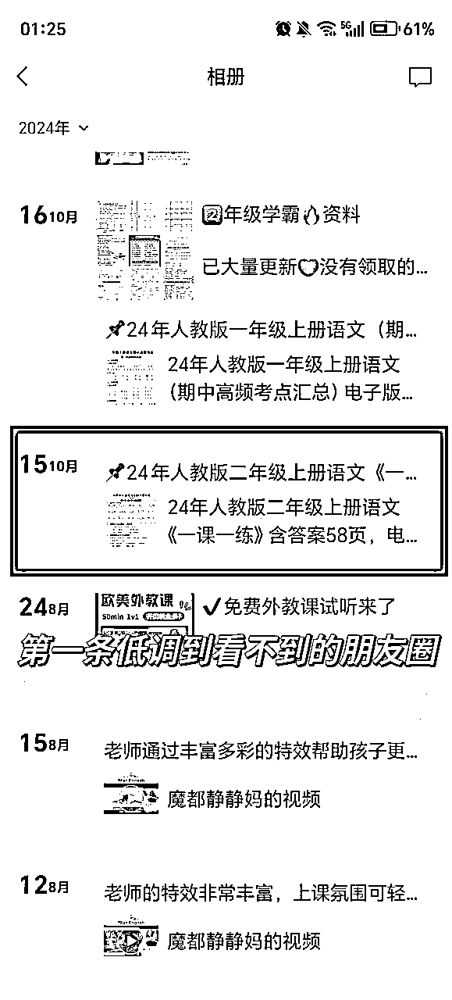

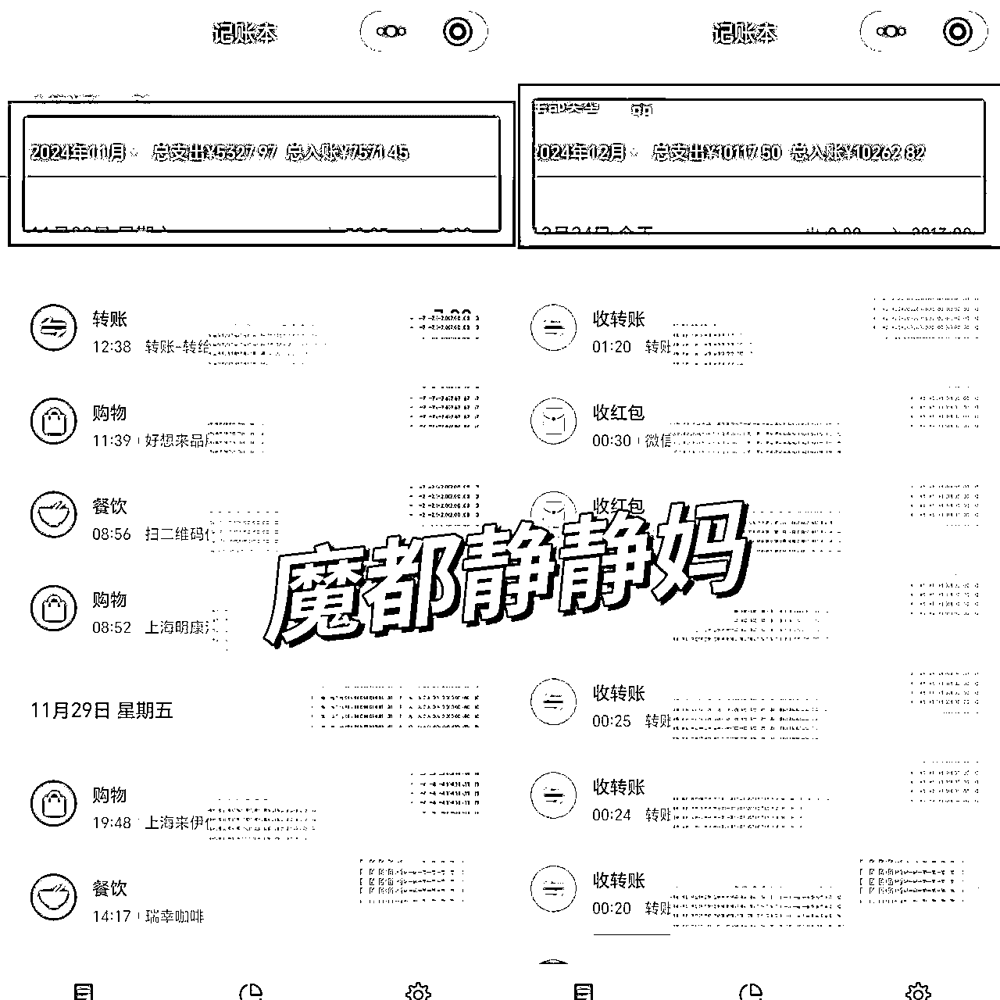

感谢航海提供的这次机会，很高兴和大家分享我的变现经历，希望今天的分享能够给你带来一点收获。

我今天分享的内容主要有以下几个部分：

1⃣、我是如何快速借力团队跑通整个闭环的

2、小红书、抖音、公众号实战引流方法和经验

3、几个方向扩大收入

4、日常操作的一些实用技巧

# 一、我是如何快速借力团队跑通整个闭环的

接触小学教辅缘起于4.22在生财看到拾一发的一篇精华帖，很详细地介绍了整个项目的sop，看完当晚就链接上了拾一，觉得是个门槛不高、上手简单、适合个人做的小项目。

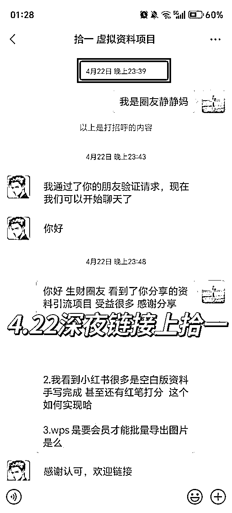

之后因单位有考试 备考了几个月直到考完试，10.15正式开干；虽然晚了点，但只要有人在赚钱我就相信一定能掘到金❗

刚开始我准备自己搭建资料库，先混了几个QQ群，观摩了下群文件；然后建QQ群，准备下载同行再上传，还准备找个合伙人一起做。

结果我发现，这个工作量太大：1、小学一个学期一个群，要12个群；2、除了语文统一部编人教版，数学、英语特别多版本；3、教改以及要随教学进度持续更新，光资料库我就能想象得花费多少精力，如果再自己准备朋友圈素材，再发笔记、引流转换，对于我这个上班族完全不现实。

所以果断放弃自己建库的想法，决定找个团队借力❗交点管理费自己好腾出更多时间引流

我先wx小号加了十几个同行观摩朋友圈，透过朋友圈窥探他们做的如何，从中也能看出来是否有团队、有培训、有素材文案提供、以及是否可以招代理；

然后又对比了背后团队情况：规模、成立时间、服务会员数、资料质量、代理模式等，最终选择了现在的上家和团队。团队负责更新资料、有现成的话术、有图片素材、能招代理，培训也不错，适合长远发展。

资料库和团队都好了，我开始变现。10.15发布了第一条朋友圈铺垫2天后，因为本来就有两个社群，10.18当天就变现1100+，也让我坚信需求在，可以做。

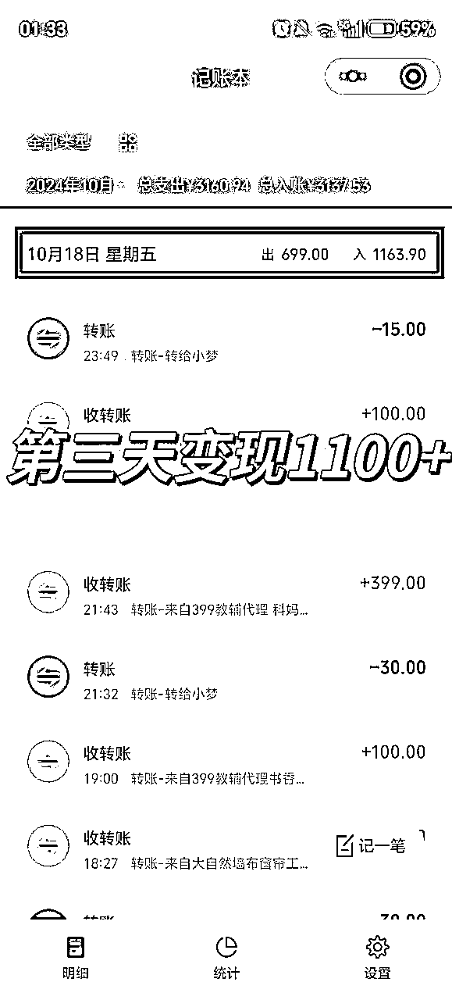

# 二、小红书、抖音、公众号实战引流方法和经验

迅速跑通流程后，马上着手放大；

## 2.1小红书：

我先尝试了小红书，看到小红书特别多爆款，看起来并不难，而且据前期调研小红书用户质量高，付费意愿强，是首选。

我用了一个3、4年的老号和一个新号，养了几天后开始发笔记；但是我发现我图文流量基本都是2位数，不论如何模仿爆款、发热门，持续了大半个月也没有哪怕小爆过；视频流量大一点能有1-200，但是赞藏多，评论引流来的人很少，即使小号引导评论仍然效果不佳；就这样断断续续来了些用户，到现在2个月可能也不超过50人；

但好处是用户付费意愿强些，有些直接加上了就问怎么买，转化率高。

## 2.2抖音

为了扩大流量，我尝试之前不熟悉的抖音，模仿同行纯电子版图文流量一般，又用剪映翻页或向左擦除功能做10s左右视频，流量大概在3000-5000之间，每天断续几个十几个人；偶尔爆了一个到3w浏览量，一下能引流几十人。这让我发现抖音的引流对我来说明显更容易。

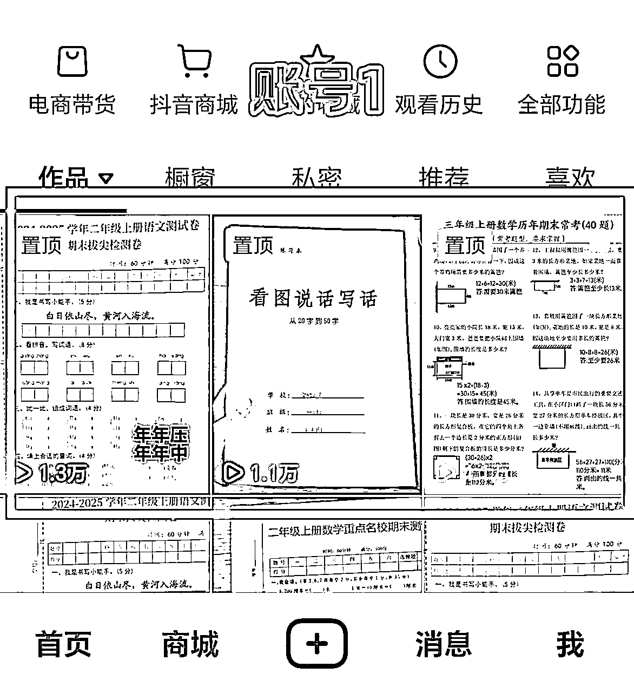

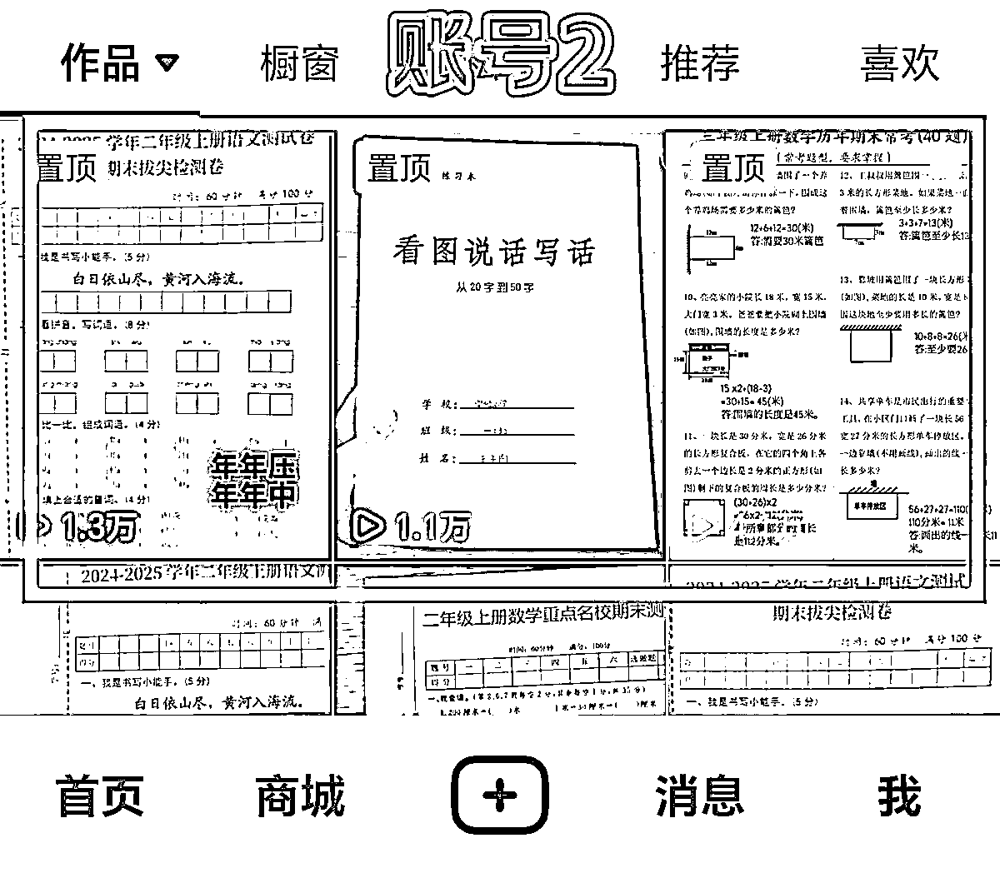

而且抖音就目前操作下来，对引流没那么多遮遮掩掩，明显的倒流行为竟然到处都是。总结了下同行，大部分有3种引流方式

1、建群：同小红书一样，邀请家长入群，置顶一条带有微信的视频；

2、大号直接背景图放微信，名字是XX老师（看主页背景图领电子版）之类，简介让看背景图，目前我也这么操作了，竟然没有被判定违规，太明目张胆了（不知道后续会不会，但目前看几百粉到几万粉的都有直接这么放的）

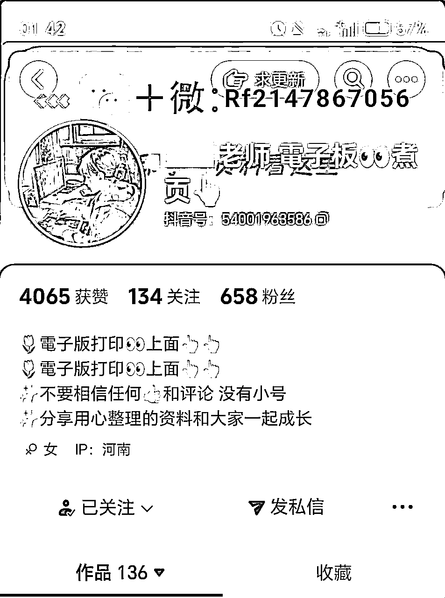

3、小号引导：小号取名“点我领取电子版”，背景图放微信、简介放微信或看背景图、笔记直接放微信号：总之一点进来马上能明白要加微信（不明白的就再见吧）。然后大号简介处at小号，或者用小号去评论大号下求资源的家长

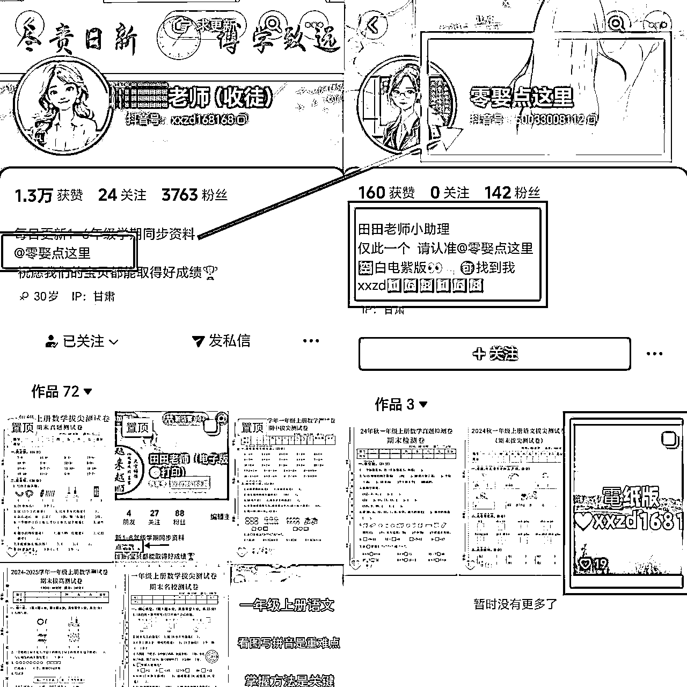

而且抖音特别友好，被判违规后限流几天后又能恢复，并不影响后续流量，我3个号都有判违规过，好几次是视频疑似重复提醒，1、2次是引流违规，但后面仍然持续的出1w以上浏览量的笔记，非常友好。

但是抖音流量大，弊端也明显，就我自己体会：用户质量不高，来的人多，一天能几十人，但是付费的少。

我昨天和同行交流，最近我靠期末试卷几个爆款来了一大批人，但是不愿意付费，小伙伴经验说：期末试卷来的转化49、59这种难，可以考虑转化个29.9本学期，是个好思路，准备试试。

但是希平教练也指出来核心问题：引流基数太小、流量是限制收入最大的壁垒

so，不管用户质量好坏，在引流不来人的时候，先别考虑质量问题，白猫黑猫先来人了再说，抖音来的人同样有付费的；如果小红书一直不出结果，也别死磕小红书，换个方向试试。

另外还有个不是很道德的引流方式：截流同行，就是到同行爆款下评论，效果也不错，但是容易被判违规，废号，酌情使用吧

2.3公众号

另外公众号引流仍然没有过时，虽然不多，但是特别稳定；我从10.18开始参考同行公众号发资料文（原有粉丝900+），截止目前粉丝1600不到，日阅读量在200上下，每天基本固定能引流5-10个人，付费意愿大致介于抖音和小红书之间。

可以找个不带图片标签又直发夸克网盘链接的这种公众号，直接原封不动复制资源内容，3分钟完成发文。这块别投入太多时间

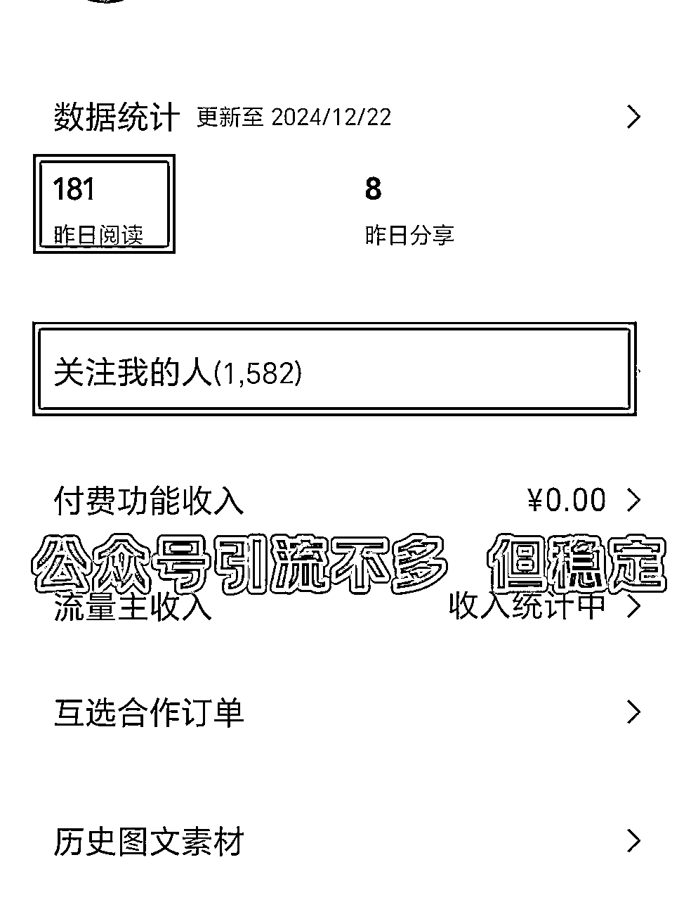

总之，在精力足够的情况下，选择自己容易出结果的方向去引流，思路再打开点可能有不一样的收获。

# 三、几个方向扩大收入

3.1大胆收徒

因为自己之前就有招代理的经验，在10.18跑通这个闭环的同时，我就开始布局收代理；

一方面是朋友圈打造：除了日常分享资源外，晒单、晒好评、晒团队培训、晒自我成长、晒学员赚钱等等，吸引潜在副业人群加入。

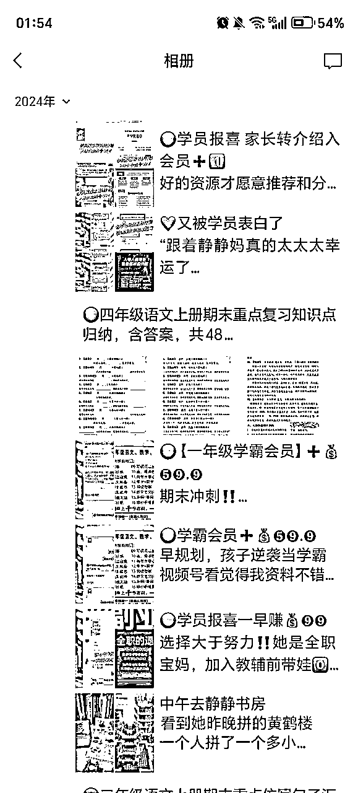

另一方面是吸引副业精准粉：小红书引流家长没有什么水花，但是做了一个吸引小学教辅副业粉的小账号，几十的粉丝转化了2个代理，非常精准，这又是一个思路；别盯着小学资料的爆款笔记，教别人赚钱 吸引副业粉也是个方向。

如果这个项目我赚到了钱，而且培训值这个价，知识付费太正常不过，大胆收徒，别有心里负担，任何项目二八定律。交付值得剩下是否赚到了钱就不是项目问题、不是培训问题、不是我们的问题，是学员自己的问题了。

因为可以借力团队素材、培训等，2个月里，陆续收了20多为教辅代理，这块收入就有1w多

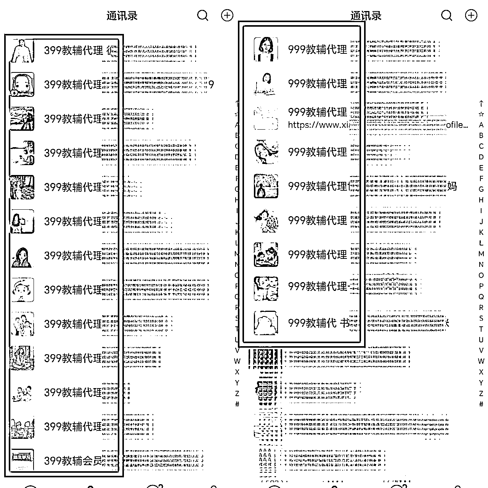

3.2分销收入（快团、寒假直播课等）、网盘拉新收入等

这块主要可以通过朋友圈和建立社群维护，团印类产品佣金高、寒暑假直播课卖一个也一百多；社群可以日常分享会员群资源，提高转化；另外可以分享网盘链接，少量拉新收益，但是也会浪费不少精力运营社群，早期不建议做，后期看自己选择，各有利弊。（感谢希平教练提点 这块别花太多精力 引流还是核心）

# 四、日常操作的一些实用技巧

## 4.1、朋友圈打造

不论是否建群、不论是否招学徒，朋友圈都得发，不然除了首次链接上，后续连曝光自己的机会都没有；尤其是如果想招代理，朋友圈得打造的吸引人

## 4.2、首次链接话术

这个我调整了好几次，同行我也观察了下，一般几种

1、直接问需要几年级资料，然后告知会员收费情况：比较冰冷；如果没有回答，后续酌情再邀请入社群

2、直接问需要几年级资料，然后随机发送一个免费的，再介绍会员收费情况：有点温度；如果没有回答，后续酌情再邀请入社群

3、直接邀请入社群（群公告整理部分免费资源），在社群里进一步转化：坏处是可能来不及介绍会员制度，好处是可以入群再慢慢转化

我仍在摸索哪种好，不过样本量可能小，看不出好坏，还是和用户质量有关系。还是专注引流吧

## 4.3、常用话术管理好

我是把常用话术放收藏夹里，教辅项目简单，常用话术也就20-30条，收藏夹收藏好，需要时直接调出来用，提高效率。

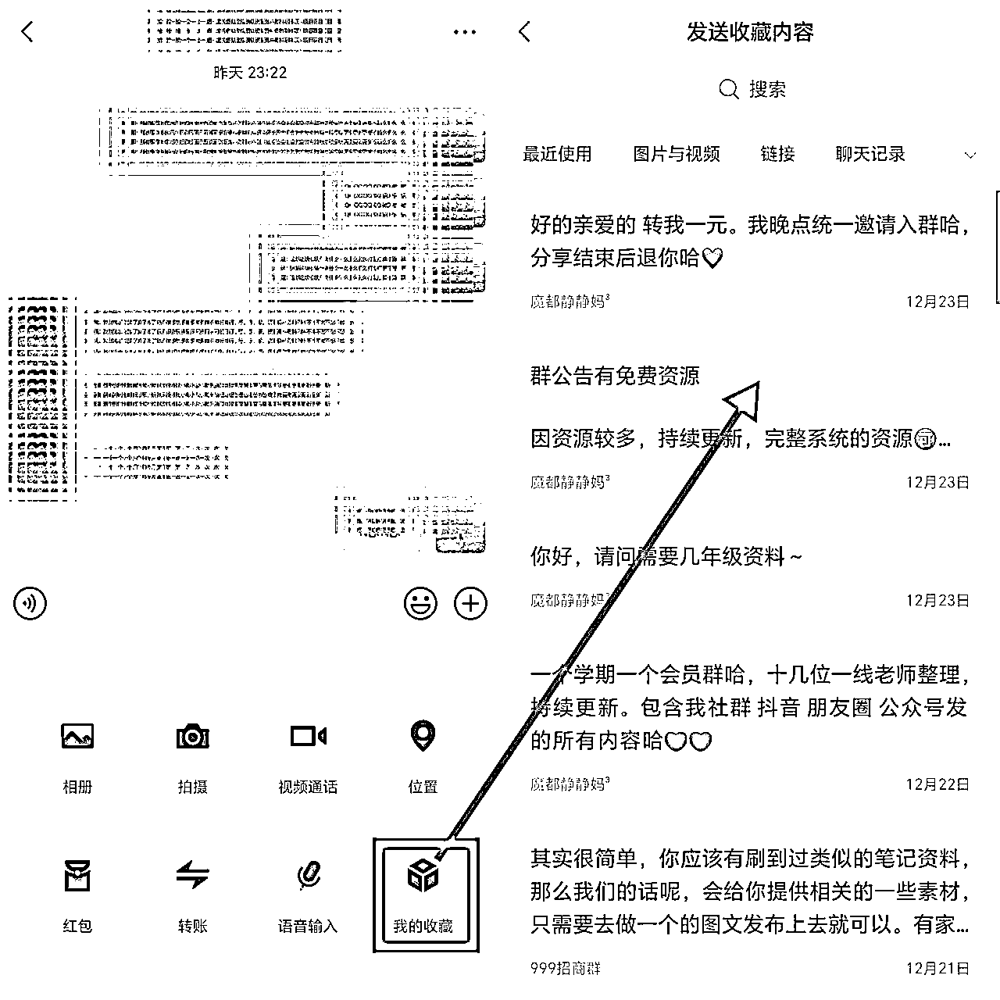

## 4.4、用户打标签

我是按照几年级来打标签的，另外一些关键信息尤其是咨询过代理制度的我会备注教辅意向，重点关注外往代理转。

# 结语

最近其实也遇到一些卡壳，转化率低、发笔记效率不高、因为上班带娃还得发圈发笔记 时间管理方面有些乱

但是昨天我们团队老大一句话我觉得很对：业绩是自己拼出来的，副业就是这样，做了就有钱搞、懒散了就没钱赚。

一定要保持对赚钱的热爱，一定要记住赚钱的快感，迷茫时可以休息调整，但别停止，副业这条路请坚定的永久走下去！

以上，仅抛砖引玉，希望对大家有启发❤