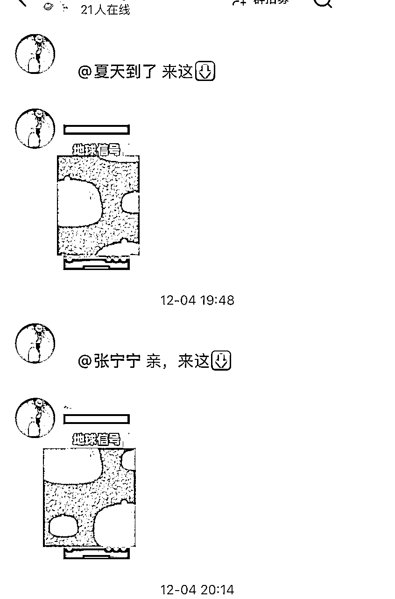

# 生财有术·12月航海 小红书引流-教育资源篇实战心路历程分享

> 来源：[https://im4rf4hmff.feishu.cn/docx/OUVGdcsBVoy4sLxJVxcc2A3TnOf](https://im4rf4hmff.feishu.cn/docx/OUVGdcsBVoy4sLxJVxcc2A3TnOf)

# 各位爱学习的朋友们，大家好，我是家明表哥。来自伟人孙中山的故乡广东中山，中山欢迎你们！

感谢生财有术、感谢剑渊领队、感谢教练们、特别是希平教练、感谢志愿者们、特别是大朱志愿者，让我有机会给大家分享这次小红书引流——教育资料篇的航海新路历程。

# 结果前置——先来说一下12月4号开船后，我拿到的一些结果

首先是收款情况，毕竟任何项目，终极目标就是收款，这个不接受反驳。

小红书引流微信号收款1122.58元、支付宝27元、微信二维码收款60元、快团团138.36元、有20元对方已转我还没收款 收款总合计：1367.94元。

（部分小额收款省略……）

# 接下来说一下引进微信私域结果

比起这段时间收款情况，其实我最看重的是引进私域的情况。本来引进私域有接近300人，后续我发现有些人删除我，所以我也清理掉了。（我觉得一个微信号有必要定期清理僵尸粉)

这边我有一个促成交和引进群的小技巧要分享给大家。

刚加上客户微信，是不是都想试着成交对方，尽快完成一次0-1的闭环成交？可是对方可能一听到要付费就甩手摇头，这时候就是你的话术需要改进了。毕竟客户愿意加你微信，肯定是对你的资料有兴趣的。

下面我展示一下对方加上我微信后，我的话术：

刚加上，不用过渡介绍自己，反而抓好机会表现自己是细心值得信任的。所以加上后，我第一件事是确认对方孩子教材的版本，避免后续出现版本错误。

接着抛出对方想要的东西，进一步引诱对方，反正能加上微信，肯定是想要你的资料。这边会有两个情况，有些伙伴可能报了价格，对方就不愿意进一步交谈了，我刚开始也是这样的，不过很快就调整了话术：要付款，但能进入资料分享群，再说说进群有什么好处。这里不得不提，当我们开了新的微信号，记得第一时间把群也建起来。

因为完成了一次成交，我想对方是愿意消费的，所以继续卖一下我有的产品：

毕竟这个彩印资料就是卖一波，春节前一周几乎就要停了。继续完成了一次成交。

然后完成电子资料交付后，就邀请对方进群

并且也把群之前分享的资料打包给对方，让对方觉得你重视他，而且也让他初步了解一下这个群的价值

这边我用了个小心机，就是找了一份资料特别去说明外面是要卖XX钱（反正比她付的虚拟资料钱要高，让她觉得她付的钱物超所值，当然，我图片说的那份资料外面确实要钱的，不过我幸运免费得到，但有水印的，我用了航海过程中，教练教的去水印手段，搞走水印，必须要给教练加鸡腿。）

然后又因为刚好搞了第一次团购，也觉得资料确实好，接下来顺便把团购链接也抛给对方了，买不买也随缘了。

没想到也成交了，反正这样一环扣一环，一个刚加上的客户，在短短10分钟内，完成了3次成交。收款46.7元。

当然不是每个客户都是能这么一环扣一环地成交，有些客户单单在虚拟资料上就不愿意付款了。这时候你可以先把对方晾一下，通过成交发朋友圈引诱对方。又不是所有引到微信私域的人都能成交的，所以千万不要因为他们内耗。

下面我具体分享一下12月4日-12月22日这段时间我的心路历程，希望大家在我的分享过中有所思有所得。毕竟我走着的路也是大家走着的路，遇到的问题困难大家也许差不多，甚至一样。

# 关于我每天第一、首要、重复去做的事：每天把航海手册看一遍

航海手册就是我们的秘籍，每天必看，并且把这句话重复读三遍：通过在小红书平台发布优质作品，引流教育领域粉丝到微信私域，并转化为教育资料产品的购买者，从而实现变现的一个项目。

这句话贯穿我们整个航海路线，是我们每天重复要做的事。

这段时间下来，我发现有些朋友方向好像搞迷糊，在为自己的资料库犯愁，其实资料库真是简单现成的事，甚至压根不需要花一分钱就拥有巨大且巨量的资料库

路径：小红书上关注做得好的同行——混入她的微信教辅资料圈——从她的免费资料库里面筛选你要的资料

其实你会发现获得资料的同时，你经历了一遍优秀同行“获客”的过程，从中也学到很多技巧，例如：她的爆款笔记，你会注意到她，肯定是由于她有爆款笔记，所以我们可以模仿她的爆款笔记，然后就是关注对方后，对方是如何把你引流到微信私域，因为有些朋友在引流过程，发现被判违规了，而那些优秀同行肯定也经历过违规，她现在的引流方法也是有改良并且规避了判违规的风险，踩在她的“肩膀”上，我们就可以尽量规避风险。

关于每天发布优质作品做个事情上，我自己是做得最不好的，我是听从教练要求，最少做3个号，但是我发作品的总数，从来没有超过6条，量远远不足。幸好小爆了三条笔记成功引流了100多号人到我的微信私域。

这些都是通过笔记加上我，然后我又通过群、私聊把他们引到我微信私域。

从小红书引到群的方法就是私聊+表情

或者群聊：小号回复+表情

有朋友说有风险，但是我这边暂时还没有……也不知道什么时候会被判违规。

后期作品小眼睛依然不理想，我开始走旁门歪道——去优秀模仿账号的作品里截流（这一举动其实也引流了快100号人到我的微信私域，但代价很大：被举报了，喜提7天“无自由”。至此，我的引流速度开始放慢了，而且我发现竟然出现一天也加不上一个人，然后我就去试验是不是我小红书评论禁言了，还是我的微信加好友出现问题，在实验完后就对症下药。

从航海开始，我一直跟自己说，一定要重视引流环节，比起顺利收款，先把“鱼”引进自己的“池塘”更重要。毕竟只要对方愿意进入到你的私域，哪怕刚开始没有发生成交，经过时间的“养熟”，对方总有给你付款的机会。前提是对方进入你的私域。

因为引流上笔记没有再小爆了，然后又不敢再去截流了（这种邪术，还是不要碰，一碰必被举报判违规），虽然会有作废账号的准备，可是这种明知故犯而违规的话很冤。所以我就把火力集中在成交上。毕竟我引流到私域，是为了收款，完成0-1的成交闭环。

由于我选择的赛道，决定了我相对更好成交：三年级更换英语教材，所以我发笔记的钩子就是三年级的英语电子教材，在开船前2天，我就做好发笔记的素材准备，在拼夕夕花了7.77元买了一整套电子资料

这个成本后续给我带来了超400的收款，这可都是纯利润哟。虚拟资料利润真的香喷喷

其实刚开始都是成交电子虚拟资料，也是由电子虚拟资料做钩子引潜在客户到我的私域流量，后来竟然有客户问我有没有把电子资料做成纸质的服务，那我肯定回应有，毕竟这也是收款变现的其中一个产品。然后马上去万能拼夕夕搜索，算好自己的利润点，再报价。同时自己也下单了一本，作为发笔记的素材，消费15.2元。

结果笔记发了几天需要彩印资料的人越来越多了，我就找商家私聊，跳出平台，找到成本更低的商机，当晚就收获了第一个大单（20本彩印），我从这个客户身上挣了190元。而且从加上到成交就5分钟之内

这个客户他的身份是教培机构老师，刚好寒假有开三年级英语班，其实刚开始我是抗拒接触教培机构老师的，总感觉对方最多也就买我一份电子教材资料而已，毕竟对方有的是无限量的电子资料，结果歪打正着，让我发现了彩印电子资料这个商机。后续我就疯狂去翻朋友圈，看看那些引流到私域的流量是教培老师身份，用这个老师成交为案例，促单。虽然没有到成交上，毕竟还没到期末，她们都在招生中，但是她们口头也陆陆续续透露了需要彩印纸质的数量，大概超200本，我这边也做好了记录，并且有时候发朋友圈会@他们看。就是有意无意提醒他们这件事。还有不到三周期末考，争取这两周继续去“访问”一下他们，再一次进行逼单，毕竟彩印资料其实就做这一波，开学后正版书本就发给小孩了。

我引到微信私域的人每次有成交，我都在名字上备注一下对方买的是什么，一方面筛选，另一方面为后续回访促二次多次成交做准备。

其实每个进入到私域的人，都值得深挖，消费无底洞，看你挖掘能力。所以我又在有第一次成交的基础上发起促二次成交，成交了138.46元，不多，但是是我的又一个里程碑，值得牢牢记录。

关于选择赛道，因为家里面有三年级孩子，所以从一开始我就坚定不移地选择了K12赛道里面的三年级；刚开始有考虑做K12全域赛道，但在没有跑通从0-1的闭环，贸然做全域很容易因为精力不足，没有拿到结果就放弃，所以我根据自己的实际情况果断选择三年级赛道，并且一开始只从英语这一科开始。

有了解英语教材改版的人都知道，今年秋季三年级、七年级的英语教材改版了，这两个年级率先用上了新教材。那为什么我会不选择七年级而去选择三年级呢？抛开家有三年级小孩这个事实条件来说，其实三年级家长会比七年级家长“卷”的动力更大，愿意消费的动力也就“更大”。不是说七年级家长不关注孩子学习，只是因为七年级的家长，在学习上很多都有心无力，而且小孩又要晚修，基本不用家长辅导，家长对教辅资料就相对没有三年级家长那么迫切渴望。所以我就果断选择三年级。

总结我踩的坑，希望大家不要踩，能跳过去，如果也在踩着，尽快跳上来。

1.  不重视发笔记数量，却在忧愁发的那几条笔记明明自我感觉良好，或者耗时挺多去搞的，结果小眼睛两位数，甚至一位数。真的不要玻璃心了，不然只会拿不到结果。（这句话也是对我自己说的）。多去看看笔记会被推流的条件，不要从自己角度出发。笔记要埋钩子，要看的人有兴趣，愿意点赞收藏甚至评论，因为看的人每一个动作都会有相对应的分值。希平教练现在日更21条，巅峰的时候80条。我们没拿到结果的就不要在这里伤春悲秋了。毕竟听话照做，真的能少走弯路，航海群里每天教练们都会苦口婆心地叮嘱把重心放在打磨笔记输出笔记上，有时候隔着屏幕都感觉到他们恨不得帮我们发笔记。你要相信一句话：在自媒体平台，对于小小的我们，要发出作品才有爆的机会，并且要量变才有质变飞跃的可能。随便发一条就爆的人有，但是绝无仅有。不要把自己看得太高。老实打磨作品，提质量、提数量吧。（这句话也是对我自己的叮嘱）

1.  那些花精力去研究搞资料库的朋友们，快点走出来，这个事情压根不值得去深究，先把流量搞好，虽然“人货场”是紧密相连的三要素，可是如果你“人”没搞好，你就搞不了钱，有“货”也没用啊。

多做一下的动作，都是多做有益的事。

1.  引流成功的，尽快进行第一次交易，完成闭环成交，要知道我们这次航海的目的：通过在小红书平台发布优质作品，引流教育领域粉丝到微信私域，并转化为教育资料产品的购买者，从而实现变现的一个项目。只有跑通了，收钱了，哪怕只收到1元钱，你也能感受整一个项目的过程，然后再根据航海手册、以及教练们的帮助下，再进行优化、提炼、精进。

1.  成交后学会主动报喜，不管在航海群还是项目微信的朋友圈。你会发现你的每一次报喜，都是一次蜕变，不管心态上还是收款上，反正我每次在项目朋友圈报喜，都会吸引到愿意付款的人。

1.  当觉得迷茫时，静下心来再去研究航海过程教练老师们的分享，大爱的他们宝贵的经历都概括好分享给我们，现在不流行“慢慢来比较快”，现在流行的“接近跑通闭环并且取得持续结果的人比较快”。

最后送8个字给自己也给大家：听话照做持续执行。