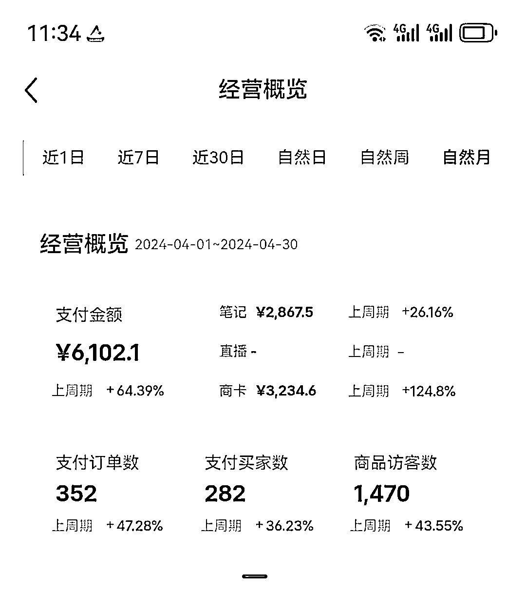
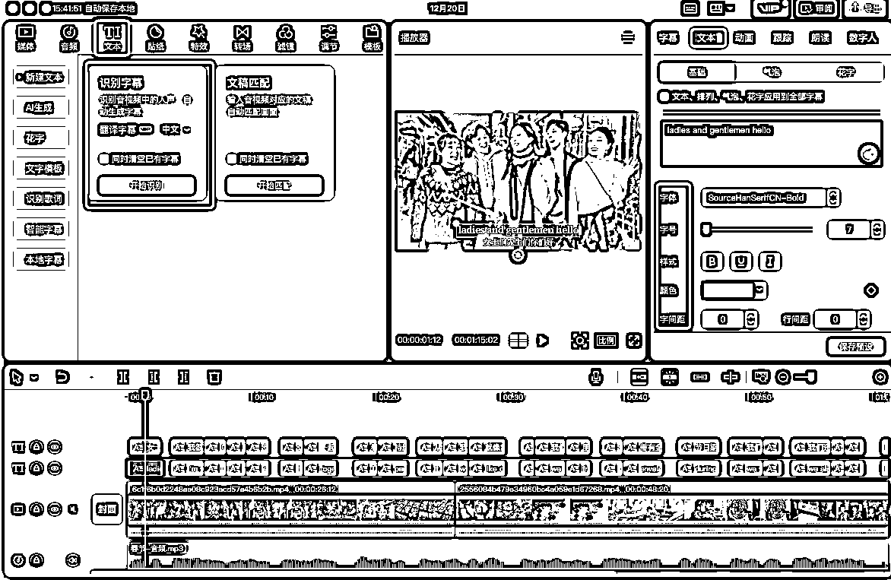

# 小红书蓝海副业-英语演讲定制实操经验分享

> 来源：[https://lx8770bctp.feishu.cn/docx/Oc0Zd2Fftod36lx3audci7clnff](https://lx8770bctp.feishu.cn/docx/Oc0Zd2Fftod36lx3audci7clnff)

大家好，我是贺贺。

今天发帖给大家分享一下我自己做的一个小红书副业项目-英语演讲定制。

这个细分赛道非常蓝海，项目也很简单，适合新手小白，投入成本几乎为0， 但做的人非常少，所以每个月多赚4位还是比较容易的。

我每周只花1-2个小时去推送定时笔记(内容请兼职做)，小红书店铺自动发货，每月被动收入4位数，以下是项目收益截图:

我把这个项目分享给了一个朋友(小白，高中英语水平)，她最近2个月的收入是20000+，当然她付出的时间也多。所以这个项目丰俭由人。

今天我把这个项目的保姆级实操教程分享出来，感兴趣的圈友可以试试!

# 一、项目简介

#### 1)先介绍一下自己

我是贺贺，做了3年全职妈妈，去年做的第一个副业项目就是这个英语演讲定制，变现了6位数，今年跟着生财的视频号带货大航海，变现了7位数，我的商业思维基本是在生财接受的启蒙，非常感恩!

以前觉得自己这点东西太渺小，所以一直在潜水，如今我觉得我已经出了新手村，有义务来回馈生财，希望这个帖子分享的内容，能帮到那些和去年的我一样的新手小白，踏出副业第一步，收获正反馈!

#### 2)项目介绍，什么是英语演讲定制?

还没有娃的圈友可能不太懂，这里先科普一下这个项目的由来:

自从新课标改革以来，英语这个科目对小初高中孩子的要求，就从以前的“会做题”，转变为“会说会表达”，尤其是要求孩子们拥有能“用英语向世界传播中国文化”的能力。

因此无论是学校、省市教育局，还是校外机构，都争相组织举办英语演讲比赛，给学生们提供锻炼的机会。

国内外比较知名的赛事有: 希望之星、希语盛典、常春藤国际英语演讲比赛、地球村国际青少年英语演讲比赛等。

*仅希望之星一年就有超过30万学生报名参加。

但凡能在这些比赛中拿到靠前的名次，对于孩子的升学、择校、面试都有很大的加分，所以家长们都会争先恐后的将孩子送去参加比赛。尤其是一二三线的家长。

一旦参加这类赛事就需要准备英语演讲稿、背景视频等，对于家长而言，能花钱解决的，就不想自己动手，况且很多家长的英语能力是写不出一篇英语演讲稿的，所以就有了我们这个项目的诞生。

我们根据家长的付费意愿设计了2个产品:

1、想要孩子取得好成绩又愿意花钱的家长，就会购买3位数的定制单(定制英语演讲稿+音频+视频)；

2、只想让孩子试试的家长，就会选择购买2位数的普通单(现成英语演讲稿+音频+视频)。

无论是英语演讲稿还是背景视频，我们都是用AI直接生产交付。小白也能轻松上手。

一张图说清楚这个项目的运转逻辑:

*定制单老客户复购率很高，因为有初赛-复赛-半决赛-总决赛，只要孩子晋级，家长100%会再复购

#### 3)月入4-5位数的收入构成

*   普通单，每月有100单起，定价是在9.9-59.9/单

比如有些 客户只需要英文稿和音频，就9.9元出售；有些客户需要英文稿+音频+视频，就根据视频时长和精美度来定价，一般是29.9-59.9元出售

*   定制单，旺季每月有10-30单，定价是在200-400/单(寒暑假是淡季，其他时间都是旺季)

定制单按照时长和制作复杂程度来收费，最低200起； 最高有一单3分钟的视频定制收了450元。

*   有多少利润?

-小红书店铺会抽佣5%，其他都是净利润。

-引流到微信成交就是100%净利润。

*想要收入高，多接定制单即可。 一般三个定制单就能有1000+的纯利润收入

看懂上面的逻辑，就按照以下我给你的步骤，一步步去操作执行，细节执行到位，第一周基本就可以出单!!

# 二、项目实操细节

项目实操涉及到五个方面:

1、英语演讲视频如何制作?

2、定制单如何制作?

3、新手做小红书需要准备什么?

4、如何从小红书获取流量?

5、如何转化用户?

接下来一步步教会大家如何操作!

### 1、英语演讲视频如何制作?

先来看看一个英语演讲视频长什么样:

这个就是我们发在小红书上的笔记内容，我们来拆解一下这里面包含了几大要素，分别是: 视频画面+英语音频+背景音乐+字幕，所用到的四个工具分别是:度加+KIMI+记灵+剪映。

#### 第一步、用AI生成英语演讲稿

国内外任意一个AI软件都可以，比如kimi/智谱清言/豆包/GPT，随便打开一个，最重要的是按照下面的提示词写就可以:

请用国内10岁小朋友的英语水平，用优秀的英语演讲稿的结构，生成一篇主题为“XXX”的英语演讲稿，要求字数250词，并在最后附上生动优美的中文翻译

我们以kimi操作界面为例，让AI生成一篇主题为“春节”的英文演讲稿，生成结果如下:

生成后的中英文稿件可以先用word文档保存，因为这也是普通单交付的内容之一。

有些人可能会问:

应该选什么样的英语演讲稿主题写啊?

最简单的办法就是就抄同行，这种高点赞的主题，直接照抄，但演讲稿的内容建议不要抄啊，对方很容易举报。 用AI生成原创内容就可以了。

#### 第二步、用AI生成英语音频

##### 1)电脑搜索记灵配音(免费)，并打开，点击在线配音。

##### 2)将生成的英语演讲稿的英文复制粘贴到记灵，主播在外语主播里任选一个，语速调整为0.88

##### 3)点击合成mp3，等待5秒左右，下载生成的AI音频并保存，这也是普通单交付的内容之一。

#### 第三步、用AI生成视频画面

##### 1)打开“度加创作工具”

这是百度出的AI成片网站，电脑搜索打开，界面如下:

主页右上角每天可以免费领积分后使用，不用花钱买。

##### 2)点击“AI成片”，并将上面生成的英语演讲稿的中文全部复制粘贴进去，点击“一键成片”。

##### 3)等待15秒左右，度加就会根据你给出的文字内容生成对应的视频画面，点击发布视频，等待下载即可使用

如果你觉得哪个视频片段不满意，就在操作界面左边的素材库里手动挑选满意的素材替换。

##### 4)下载保存视频备用。

#### 第四步、用剪映最终合成英语演讲视频

##### 1)打开剪映，将第二三步生成的音频和视频拖进去处理

##### 2)将视频静音，并裁减比例为16:9，就能把字幕切掉

##### 3)让视频和音频保持一样的长度

这一步你可以通过变速，或者在度加生成多一段视频内容来实现

##### 4)生成字幕

*   点击剪映生成双语字幕：“文本-智能字幕-识别字幕-翻译字幕成中文-开始识别”；

*   根据第一步生成的英文演讲稿文本进行字幕校对调整

*   点击“文本”，调整字体、大小、位置等

##### 5)添加音乐

在剪映的“音频-音乐素材-搜索和主题相关的音乐”，选择合适的轻音乐并添加

将音乐声音微微调小，不能影响英语音频的声音即可。

##### 6)添加片头标题

在剪映的“文本-文字模板”里选择喜欢的模板，做成片头标题

最后我们来看下效果:

以上完成后，把视频从剪映导出，就可以直接用来发小红书笔记啦!

我分享的这种方式已经能达到月入4-5位数，但如果你本身就非常会剪辑的话，剪辑的视频越精美，卖价还能更高，收入也会越高

### 2、定制单如何制作

定制单就是在普通单的基础上，多了一些个性化的需求，比如需要增加一个自我介绍，或者比赛是命题作文，就在这段提示词的基础上做增减就可以了，给大家一个提示词模板:

请用国内XX岁小/初/高学生的英语水平，用优秀的英语演讲稿的结构，生成一篇主题为“XXX”的英语演讲稿，要求有简单的自我介绍，字数要求XXX词，并在最后附上生动优美的中文翻译

视频制作会要求更精美一些，无非就是多花时间去找合适的素材。以及有些要抠人像之类的，剪映有大把操作教程。

所以定制单制作的诀窍就是，花时间找素材和沟通清楚详细需求。其他都和普通单一样，都是交付:英语演讲稿+音频+视频。

### 3、新手做小红书需要哪些准备:

有些同行是用引流的方式在微信交易，其实我们测试下来，在小红书直接开店转化是更快的，而且不用担心封号，所以建议大家直接开店。

##### 1)需要准备哪些硬件设备

*   做小红书最好1卡1机1号；苹果安卓机都可以，没有要求

*   如果本身有小红书账号，只要没发过内容，没有违规过，就可以直接养号后使用

*   如果小红书账号有发过内容，或有过轻微违规，则注销后重新注册再用

*   笔记和商品都是用小红书千帆平台(PC端)发布

*   用开店的方式只需要做一个账号即可。1个做成后，后面可以矩阵

##### 2)小红书养号

新号建议养号3-5天，每天刷1小时左右，重点刷同行，正常点赞评论，你就能收获很多对标内容。

##### 3)账号包装

*   账号四件套(昵称、头像、背景、简介)，建议抄同行对标，在同行的基础上修改成自己的版本

*   简介建议要突出自己的业务范围和优势

##### 4)小红书开店

0粉就能开店，不需要营业执照，选“个人”，使用身份证开店。

小红书开店需要1000块押金，可以选择提现的时候再交。

类目选择:虚拟定制

自动发货我用的是第三方的服务，小红书后台有很多可以选，也可以试用。

##### 5)小红书笔记怎么发，商品怎么描述和定价

借鉴同行，包括标题、正文、话题，不要自创，同行是最好的老师

电脑打开小红书千帆平台，用来发笔记和建商品

千帆的“笔记中心”每周还有做任务奖励流量，千万不要错过

点击商品管理-发布商品

参考同行填写好标题、做一张商品图片，选择“虚拟定制”类目，点击下一步

细节填写里只需要重点留意一个地方，就是:

*   选择 “无物流发货”

*   运费模版选“全国包邮”

*   千万不要点“七天无理由退货”

电子资料一旦发货不包退换的哈，不然很多爱占小便宜的会利用这点申请退款。

商品建好后，再点击发布笔记，把做好的视频拖进去

填写好标题、正文、话题后，选择添加商品，点击发布，笔记就发布成功啦~

定时发布可以定时推送未来2周的内容，所以每周花一天时间制作好1-2周的内容定时发布，其他就坐等接单就可以了

### 4、如何从小红书获取流量?

英语演讲定制这个赛道的流量非常精准，意思就是，她们都是带着需求在小红书主动搜索并下单的，给你看下我们的流量分布，搜索流量占据70%的成交。

因此，这个项目在小红书上获取流量只需4步:

##### 1) 每一篇笔记都铺好关键词，比如这两个:“英语演讲背景视频”、“英语演讲稿”

以及多在内容和正文里埋关联关键词，这样你就能吃到源源不断的搜索流量。

##### 2)多发笔记，堆量

同行爆过的主题，你继续发，很大机率可以再爆。

##### 3)多关注英语演讲比赛

所有的英语演讲比赛都是命题赛，在网上都能搜索到，你把主题对应的英文演讲稿和视频做出来，并标注赛事名称，就能吃到赛事的搜索流量。

并且，很多家长希望孩子能取得好的成绩，不一定会买你的现稿，而是会找你单独定制。

##### 4)发客户获奖或感谢好评

这是定制单高下单率的关键。

还没有客户好评怎么办?

自己用小号和大号互聊做一条出来就行。

有了以上这些获取流量的动作，其实账号的流量基本不愁了，我们再来看看用户从咨询到转化的路径。

### 5、如何转化用户

转化的用户分两类:

##### 1)普通单客户

购买普通单现成稿件的用户，基本都是直接下单，很少咨询，大多是买了之后问要发货的，像这样。

##### 2)定制单客户

定制单客户一般都会带着需求来主动咨询

我们问清楚客户是需要定制几分钟，具体的比赛要求，就可以给客户报价了，3分钟的英语演讲比赛稿定制的价格，我们一般收300。

如果客户接受这个价格，就发链接让她直接下单付全款；

如果客户不接受，就会还价或者直接跑了，还价看你自己的接受程度，愿意接就做。

不需要太多的沟通技巧，因为我们是直接在小红书店铺成交，不用引流。

# 三、避坑指南

##### 1、这个项目的受众非常精准，因此我们的视频发出去可能播放量不高，但却会一直有单，搜索流量占据我们50%以上的订单来源，所以不要遇到播放量不高就放弃。

##### 2、偶尔有客户发微信或引导你说出微信联系，只要你回复就会吃违规，无论你回复什么内容。所以尽量在店铺成交，客户购买商品后会留下手机号码，你再通过这个号码去添加微信就可以了。

##### 3、笔记的主题和内容一定要正面积极，不要踩红线，这是平台的底线。

##### 4、做原创，不要搬运

我们有AI在手，做原创其实是很容易的事，抄爆款主题，不要抄内容，否则很容易被侵权投诉，自讨苦吃。

##### 5、英语不好，能不能做?

有高中英语水平就能做，因为文章不是你写，是AI写的。就像上面说的那个朋友一样，只有高中英语水平，上个月只靠这个项目就赚了1万2。

但如果英文字母都不认识的，那就不太适合了。

# 四、结尾碎碎念

这个项目到现在，我刚好做了一年了，从手心朝上没有收入，到每个月稳定4-5位数的收入，给了我很多正向反馈。也正是因为摸到了这类人群类似的需求，所以我又做了视频带货，也取得了更大的正反馈。

又因为频繁做出百万级的爆款内容，让我收获了网感和线上获客的能力，因此又同步开启了陪跑孵化IP的业务，并跑出了很多成功案例，开启了转型之路。

也让我意识到了，商业的本质，其实就是要有利他思维，当你能帮别人解决痛点问题时，满足了他的需求，你自然就能获得与这部分价值匹配的金钱收益。

以上，感谢观看！

认真去做的人，相信收获一定不会少！

有任何问题都可以在评论区留言，必知无不言!