# 利用AI工具copycoder + bolt 三句话复制想要复制的网站

> 来源：[https://efhb85rrm7.feishu.cn/docx/PSIOdJ2HCoyjIzxv9GOcIz9Hnhb](https://efhb85rrm7.feishu.cn/docx/PSIOdJ2HCoyjIzxv9GOcIz9Hnhb)

# 1、介绍

大家好，我是路过蜻蜓，一个喜欢潜水在生财偷偷学习的小透明。

在生财潜水很久了。在朋友的鼓励下自己也来发一下分享。今天打算自己也来分享一下。

刚好亦仁也发布了超级标。

我是如何利用AI工具copycoder + bolt 三句话复制想要复制的网站。

# 2、生成网站效果

先看看生成的网站效果:https://exquisite-donut-20454b.netlify.app


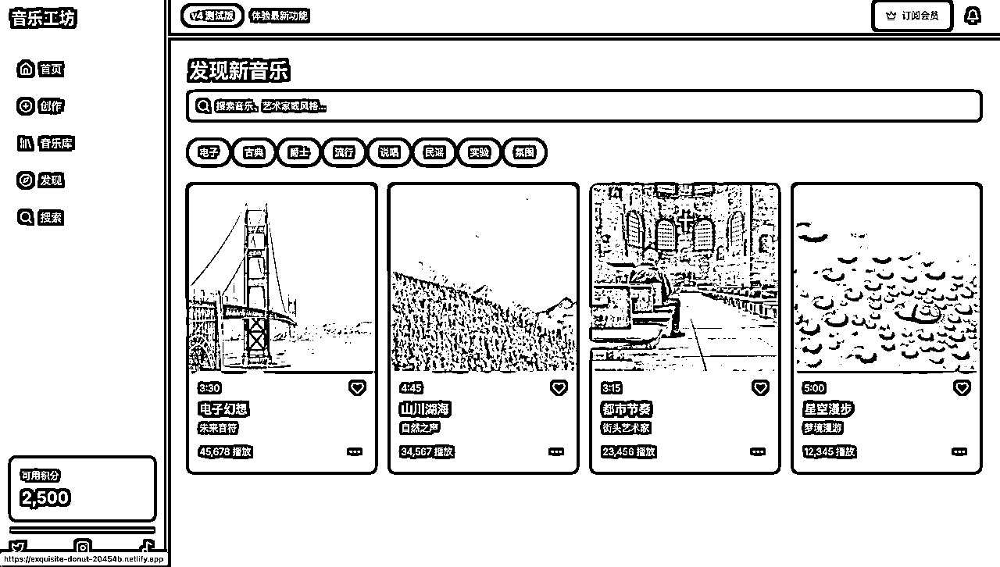


可以看到生成的效果是很完美。 各个页面都存在。

# 3、Copycoder工具介绍

最近在逛X的发现了一款新AI工具https://copycoder.ai

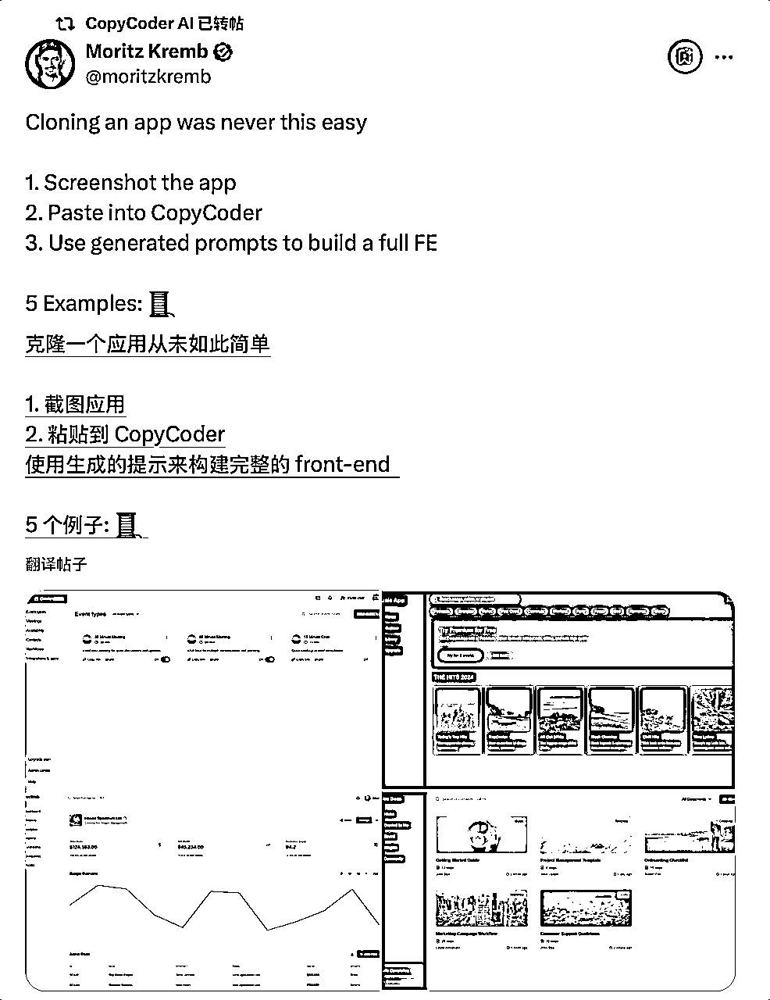

看到后，我第一时间问问chatgpt，这是一个什么网站。

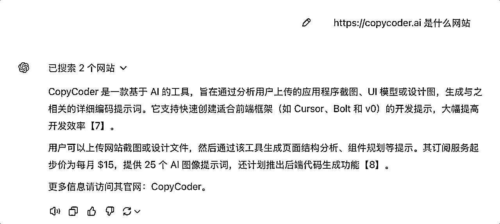

CopyCoder 是一款基于 AI 的工具，通过分析用户上传的应用程序截图、UI 模型或设计图，生成与之相关的详细编码提示词。它支持快速创建适合前端框架（如 Cursor、Bolt 和 v0）的开发提示，大幅提高开发效率。

用户可以上传网站截图或设计文件，然后通过该工具生成页面结构分析、组件规划等提示。

根据ChatGPT的回答，我只需要上传网站截图，或者设计稿之类的就能直接生成网站。

少说话，直接打开网站进行尝试。


## 步骤1、

最近我在研究suno AI 音乐，就直接拿suno进行尝试。

打开https://suno.com，直接复制，他的首页，并上传首页截图


点击Generate prompt 生成提示词

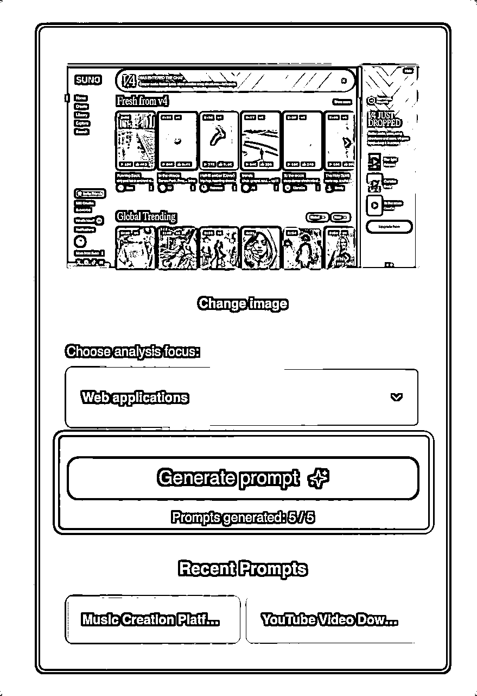

步骤1里面放着提示词。

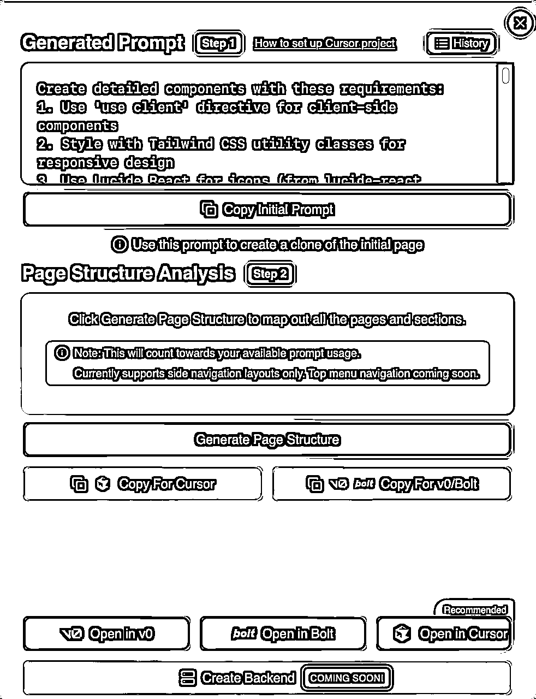

### 支持工具

根据官方提示，目前生成的提示词支持 V0、bolt、Cursor

打开这里，他会教你如何使用Cursor来创建项目。


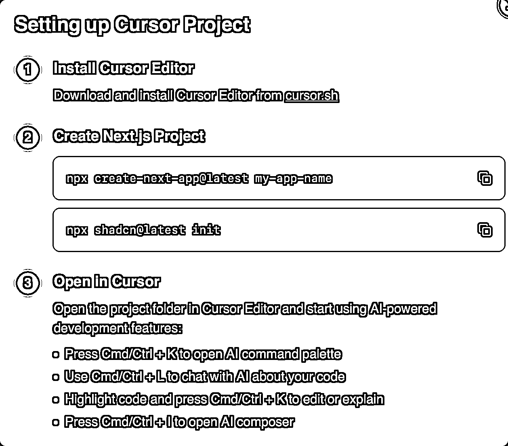

这里的话，我就不使用Cursor来进行创作了。我选择了bolt工具。

## 步骤二

### bolt

https://bolt.new

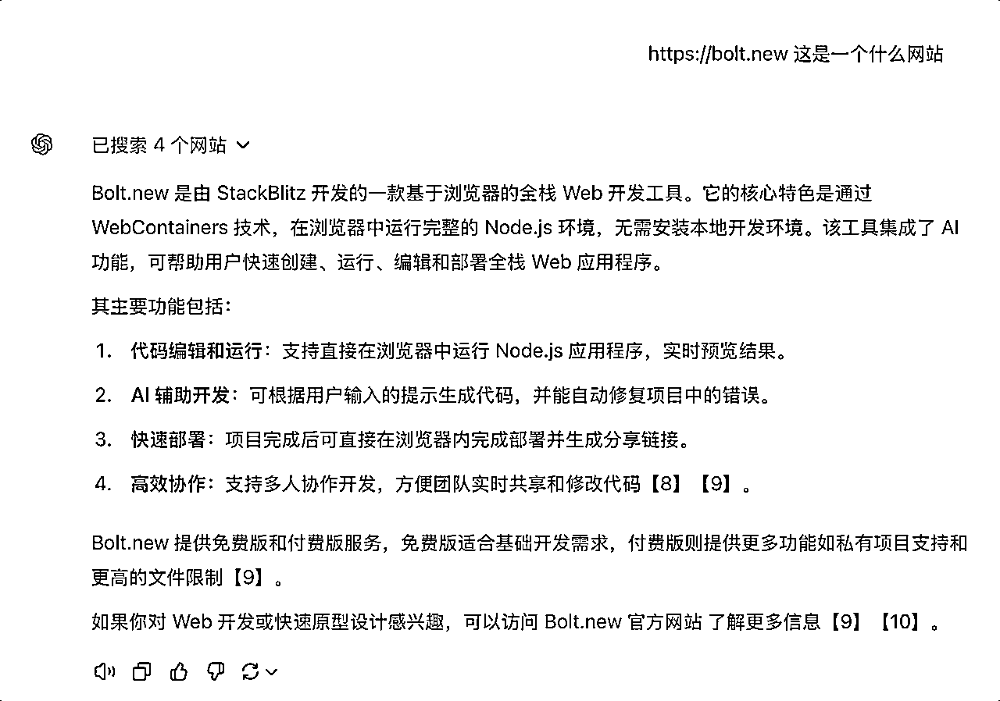

直接复制提示词到输入框里，他就会自动生成网站。

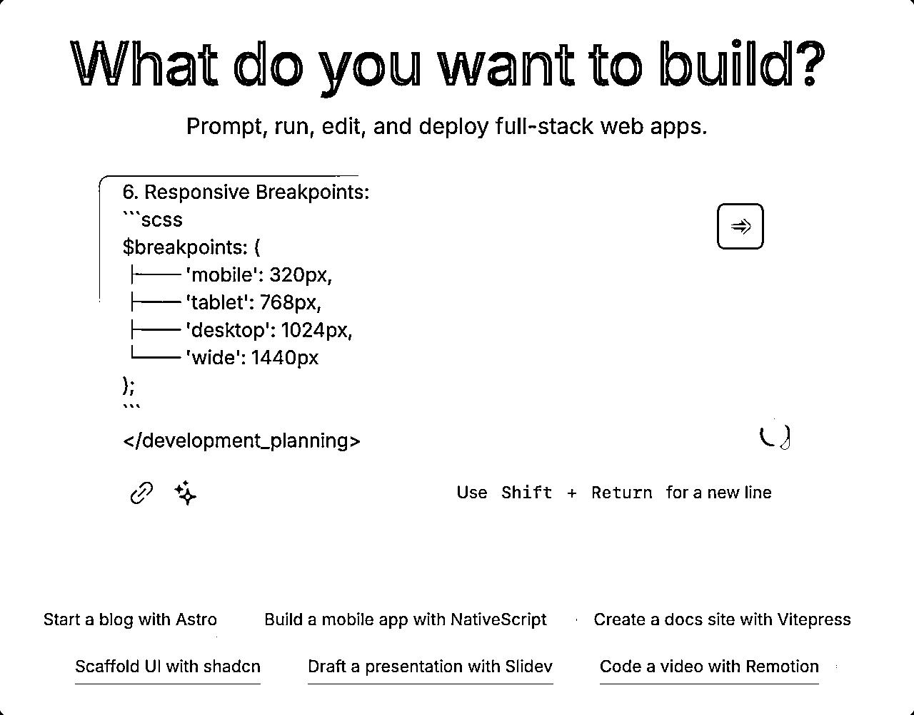


这个网站能一边跟Ai聊天一边看到Ai生成的一个效果。因为我已经没有试用次数里，所以看不到。


让AI 把网站里的文字都使用简体中文。


回到copycoder、点击Generate Page Structure获取第二步提示词。


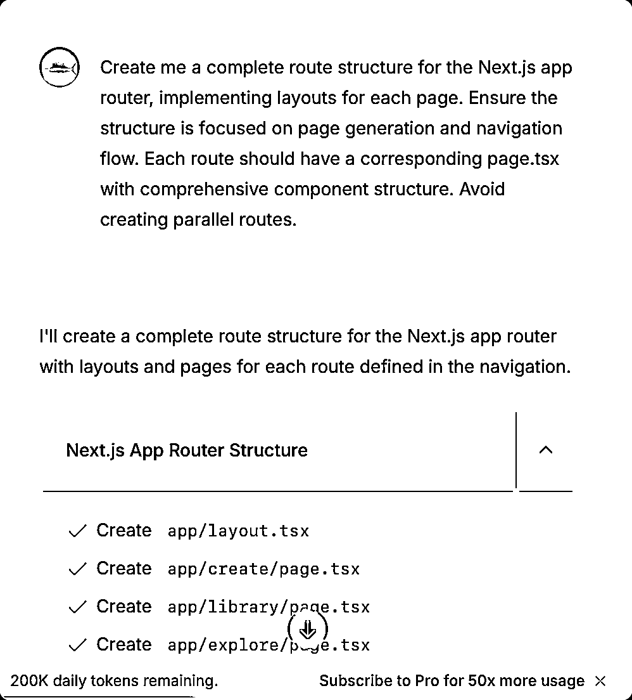


提交给bolt。这里我遇到一个问题，首页显示不正常我让Ai修复一下。然后部署一下。


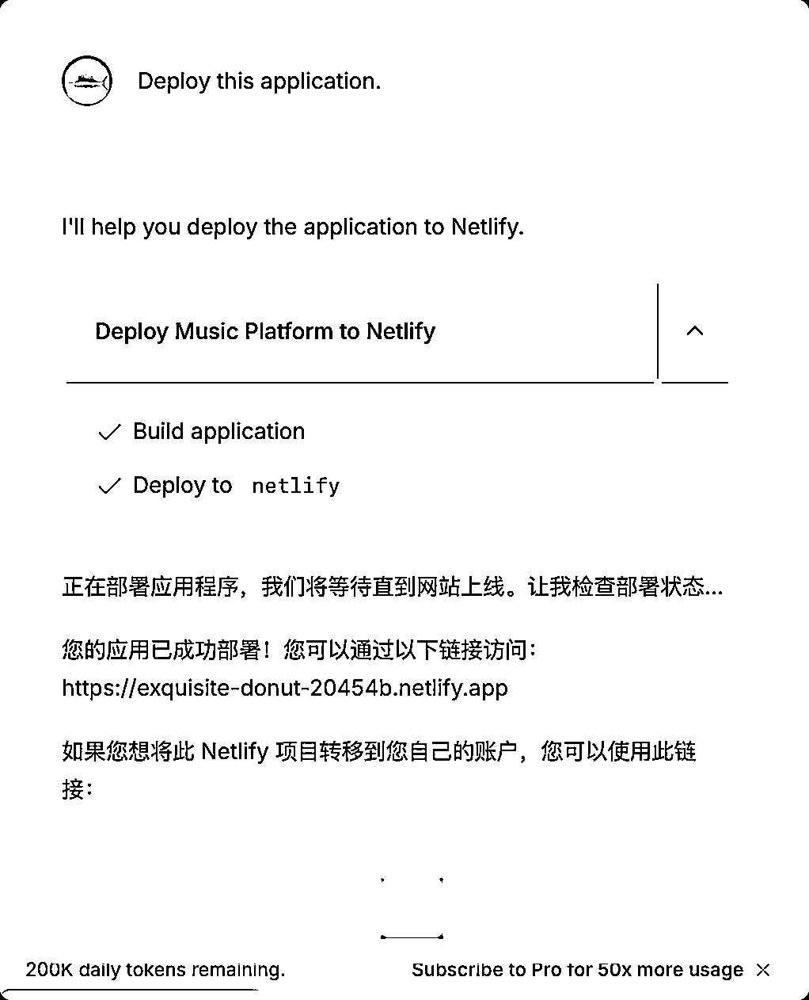

可以看到，我只跟AI对话三句话、四句话就实现了效果。下面放着有我的提示词，大家可以自己尝试下。

## 成品网站

https://exquisite-donut-20454b.netlify.app


## 注意：

### 目前copycoder 只支持生成网站。后续应该会开放手机等

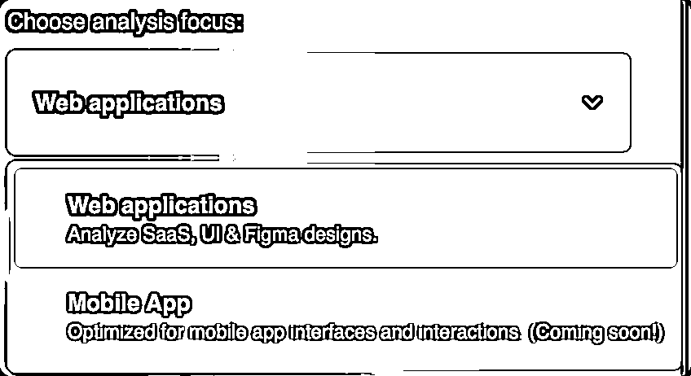

### 翻译工具：

推荐使用浏览器插件沉浸式翻译，还能接入AI来进行翻译

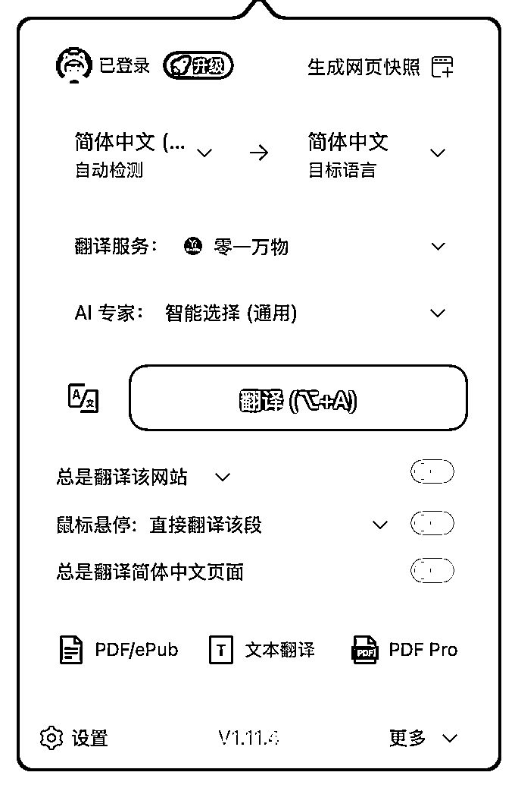

# 4、步骤一提示词：

```
Create detailed components with these requirements:
1\. Use 'use client' directive for client-side components
2\. Style with Tailwind CSS utility classes for responsive design
3\. Use Lucide React for icons (from lucide-react package). Do NOT use other UI libraries unless requested
4\. Use stock photos from picsum.photos where appropriate, only valid URLs you know exist
5\. Configure next.config.js image remotePatterns to enable stock photos from picsum.photos
6\. Avoid duplicate components
7\. Automatically source and display logos from a CDN in design placeholders
8\. Follow proper import practices:
   - Use @/ path aliases
   - Keep component imports organized
   - Update current src/app/page.tsx with new comprehensive code
   - Don't forget root route (page.tsx) handling
   - You MUST complete the entire prompt before stopping

Music Creation Platform Dashboard with Featured and Trending Tracks

 1\. Navigation Elements:
- Left sidebar with: Home, Create, Library, Explore, Search
- Secondary navigation: Credits counter, Subscribe button, What's New, Notifications
- Social media links at bottom: X, Instagram, TikTok, Discord

2\. Layout Components:
- Header banner: 100% width, ~60px height
- Main content area: ~80% width
- Card grid layout: 5x2 grid for featured content
- Cards dimensions: ~200px x ~280px

3\. Content Sections:
- Top banner announcement for v4 features
- "Fresh from v4" featured section
- "Global Trending" section
- Track cards with: Duration, Title, Artist, Play count, Likes
- Right sidebar promotional content

4\. Interactive Controls:
- Play buttons on track cards
- Like counters with interaction
- More options (three dots) menu on cards
- Global/Now filter dropdowns
- Navigation hover states

5\. Colors:
- Primary dark theme: #000000 (background)
- Accent blue: #1E90FF (v4 badge)
- Text white: #FFFFFF
- Secondary gray: #808080
- Gradient overlays on track artwork

6\. Grid/Layout Structure:
- Main container: 1440px max-width
- Card grid: 20px gap
- Sidebar: 240px fixed width
- Responsive collapse points at 1200px, 768px 

 1\. Project Structure:
```
src/
├── components/
│   ├── layout/
│   │   ├── Sidebar
│   │   ├── Header
│   │   └── TrackGrid
│   ├── features/
│   │   ├── TrackCard
│   │   ├── PlayControls
│   │   └── GlobalTrending
│   └── shared/
├── assets/
├── styles/
├── hooks/
└── utils/
```

2\. Key Features:
- Audio playback system
- Track information display
- Like/interaction system
- User authentication
- Track upload/management

3\. State Management:
```typescript
interface AppState {
├── player: {
│   ├── currentTrack: Track
│   ├── isPlaying: boolean
│   ├── queue: Track[]
│   └── volume: number
├── user: {
│   ├── profile: UserProfile
│   ├── likes: string[]
│   └── credits: number
├── }
}
```

4\. Routes:
```typescript
const routes = [
├── '/',
├── '/create/*',
├── '/library/*',
├── '/explore/*',
└── '/search/*'
]
```

5\. Component Architecture:
- TrackCard (reusable component)
- AudioPlayer (global component)
- NavigationBar (fixed component)
- FilterControls (shared component)

6\. Responsive Breakpoints:
```scss
$breakpoints: (
├── 'mobile': 320px,
├── 'tablet': 768px,
├── 'desktop': 1024px,
└── 'wide': 1440px
);
``` 
```

# 5、步骤二提示词

```
Create me a complete route structure for the Next.js app router, implementing layouts for each page. Ensure the structure is focused on page generation and navigation flow. Each route should have a corresponding page.tsx with comprehensive component structure. Avoid creating parallel routes.
```

# 6、也可以直接复制我的项目进行创作

https://bolt.new/~/sb1-x4derj

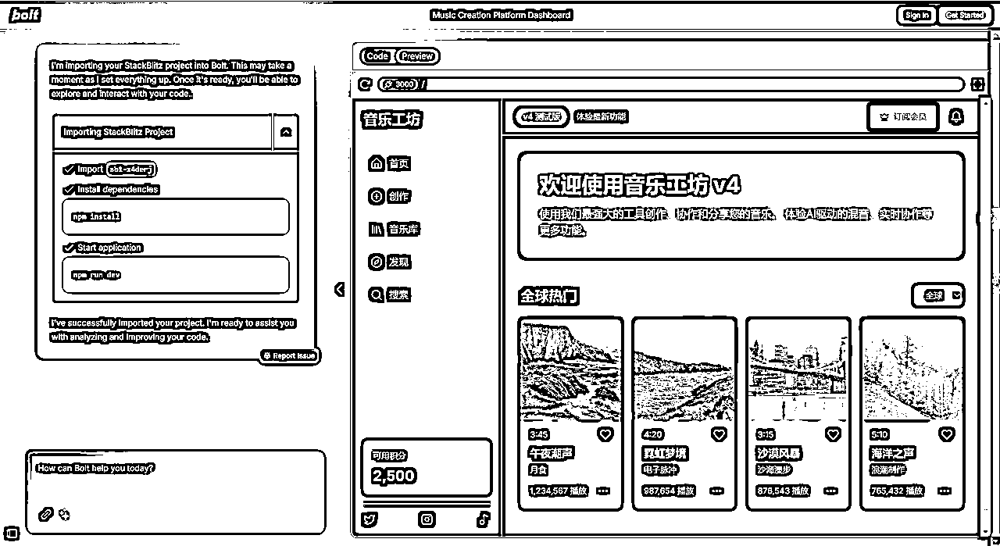

# 7、延伸阅读

使用cursor+windsurf编写。

顺带介绍下我用AI写的项目：

由于报名了生财youtube航海，顺带写的工具。

包含登陆注册等。

http://www.maotools.org


还开发了MacOS下的Youtube下载工具。

这一切都是使用AI工具制作。

后续有空会分享一下，我是如何制作并且上线这个网站的，所使用的技术。

# 8、总结：

现在是AI创意的时代，只要你有创意、你有想法，基本都能实现。