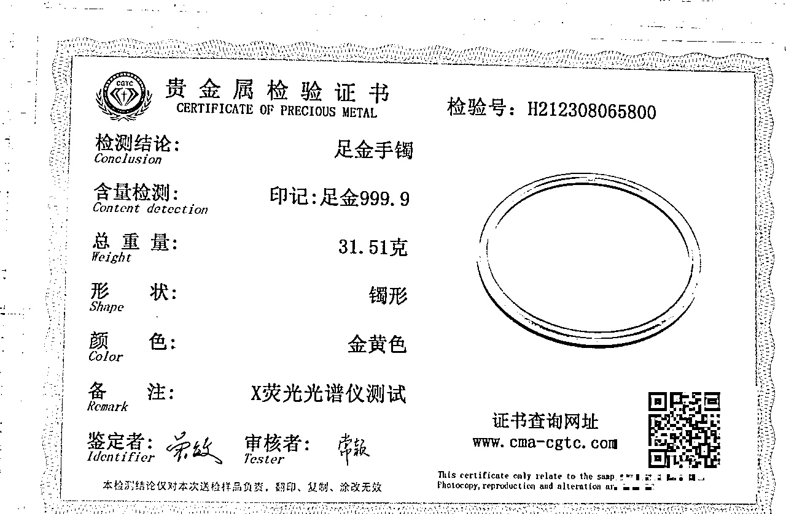

# 黄金买卖/代购项目分享-省钱有术

> 来源：[https://pa7l8baqg83.feishu.cn/docx/Pf5Fdb59toINWXxNvxtcDCRGnNf](https://pa7l8baqg83.feishu.cn/docx/Pf5Fdb59toINWXxNvxtcDCRGnNf)

# 前言：

国内贵金属（黄金、白银、铂金等）可以从全国贵金属批发集散地：深圳水贝买卖，金价依据上海黄金交易所金价➕几块到几十块/克手工工费（常见黄金工艺十几块到三十多块/克足够），比品牌店便宜将近200元/克，水贝黄金款式多，黄金纯度也有保障（买黄金首饰无非就图这两点吧）。

特别申明本文纯实操分享，并无合作或者推广（深圳快给我打钱！！），爱买首饰的姐妹或者给女朋友/老婆/家人买首饰的兄弟，get一个省钱攻略，在深圳水贝买一个30克的黄金手镯，立省5K多，真香；如果有朋友对黄金代购感兴趣可以移步本文档第三部分，有简单的思路分享。

本文概览：

*   黄金基础知识普及

*   买黄金

*   卖黄金

*   黄金代购项目分享

## 先说一个故事：

以前我想换掉自己的老首饰，在某凤祥折价50元/克换新，再加价50元/克工费买新的首饰，而且某凤祥金价比水贝贵100多每克（按现价798-617=181元/克），瞬间贵了200多/克...让我哭一会儿，希望大家get本文档省钱攻略，一起省钱有术。

## 深圳水贝地址：

打开百度地图，搜索🔍深圳水贝，放眼望去全是珠宝大厦，异地可以高铁到深圳北站；飞机到深圳宝安国际机场；然后地图导航到深圳水贝地铁站或者任意珠宝大厦：例如深圳金展珠宝广场、水贝金座、水贝银座等。

## 实时金价查询：

*   微信小程序：融通金或者今日金价行情（国内买卖金价实时变动）

*   上海黄金交易所网站：https://www.sge.com.cn/sjzx/jzj

## 黄金（AU）基础知识普及：

足金999，也叫千足金（代表黄金含量99.9%）

足金9999，也叫万足金（代表黄金含量99.99%）

以上两者均可放心购买

18K金（代表黄金含量75%）

足金（代表黄金含量99%）

这两种黄金饰品可以了解

# 一、买黄金

比如我们去深圳水贝金座、水贝银座、金展珠宝广场（楼上/负一楼），不方便的朋友可以让深圳朋友代购（短视频平台代购可以看第三个板块，需自行辨别），或者春节来深圳和香港玩一趟也可，妥妥的旅游还省钱攻略，而且春节南方天气好，舒服哈哈哈。

1.  深圳水贝买黄金优先选择按克交易的商家（大部分商家均是按克交易）。

1.  问价方式：老板，今天金价多少一克？（一般都是按照当天上海黄金交易所金价，但有些小店会加价，所以问问比较好）

1.  挑选后看中了某个款式，再咨询足金999还是足金9999，以及工费

问询方式：老板，这款是足金三个九还是四个九？（符合两种之一都可，有些小小店买镀金产品，老板都会如实说，国家有监管）

问询方式：老板，这款工费多少一克？（常见工艺十几块到三十多块/克足够）

## 温馨提醒：

不用加价买足金9999的黄金。

举例：假设今日黄金价格是616/克

616/克 * 99.99% = 615.94元

616/克 * 99.9% = 615.38元

每克相差0.56元，6毛钱/克，不值得加价买足金9999，但如果价格相同肯定选足金9999，总之加价买足金9999不划算，不要被忽悠。

回收♻️黄金的时候，也是按照以上公式计算，后面卖黄金篇幅会提到。

1.  准备下单，但不放心是否是真的：

在水贝珠宝大厦里面买黄金，基本不需要做证书检测，在水贝正规柜台买的黄金是真的，第一次购买不太放心可以问老板哪里可以做检测，她会告诉你，有很多楼层都有珠宝检测中心，不放心老板指路，可以自己找珠宝检测中心；检测证书价格5块到十几块不等。

（检测证书）

1.  如果是送礼，需要包装盒（水贝黄金因为就赚个加工费，便宜，没有精美的包装盒，需要自己买），自用就不要买包装盒了，戴上，哈哈哈

包装盒：去珠宝大厦精品店里买，几块到几十块都有，让老板告诉你最近的礼品盒店在哪里，很方便，基本一个楼层都能搞定：买黄金，做检测，买礼品盒。

# 二、卖黄金

## 方式一：

去家附近黄金回收店，一般需要按照当日金价减10-50元/克不等回收。

## 方式二：

融通金公众号，有实体店和顺丰邮寄买卖服务，按照当日上海黄金交易所金价实时交易，也就是我们买/卖黄金都是实时金价，中间耗费我们一个手工费（金价上涨期，其实是赚的），对于经常想换款式的朋友是福音，比品牌某福、某凤祥金店便宜一百块多一克（798-617=181元/克）。

卖黄金的时候除了各大银行的足金9999金条，其他首饰都按照足金999金价卖，所以买黄金首饰的时候不要加价买足金9999，而且卖的时候会将首饰融掉再次检测纯度，店家仪器测出来还可能纯度不够，需要按照998/997纯度卖掉，下面会举例说明。

## 买卖案例举例：

买的时候是31.51克，足金9999

卖的时候是31.49克，纯度99.7%，当日金价480.54元/克

当然会有一点损耗，在可接受范围内就可以交易。

纯度折算：31.49克 * 99.7%纯度=31.39克

损耗：（31.51克-31.39克）* 480.54元/克 = 58元

一共才58块，基本可以忽略不计...比外面金店减10-50/克省钱不少。

## 另一个手镯买卖：

金价按照实时金价，融掉检测纯度是99.8%/99.7%，重量和纯度会少一点，有正常磨损的可能，也有可能是emmm，老板们也要赚钱嘛，我觉得在正常范围内就可以接受。

# 三、黄金代购项目

去各大短视频平台搜索水贝黄金代购，例如小红书、视频号、抖音等，会出现很多同行，翻看评论区查看用户需求情况。

做代购需要离深圳水贝近点，比较好真人出镜拍摄，以及帮客户挑合适的黄金饰品样式；

如何拿货：线下去店里可以找金店老板开户（开户免费：需提供姓名+电话+银行卡等信息），就说你是做黄金代购自媒体，以后在店里拿货，出货量不多老板给正常顾客的价格给你，也是划算的，金价+工费上下利润空间差价接近200/克，利润空间较大。

加老板微信，方便沟通，朋友圈会更新款式：

利润空间：代购生意就是赚个差价，例如：低克重饰品，收个门槛价；高克数饰品，每克赚10元以上/克，具体看你自己怎么定价，可以先当顾客去同行引流群围观，加同行微信围观和询价，了解行业情况，看看同行是怎么做的。

当然水贝代购还有很多玩法，还有和店铺合作或者店铺员工直播带货（如下截图），本篇纯自用省钱攻略，以及少许黄金代购项目思路分享，以上一起生财有术。

