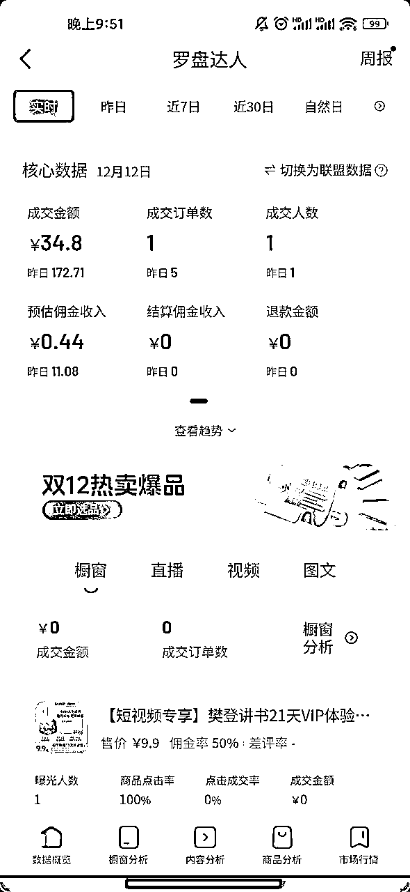

# 有长途航海一定要参加的！（抖音达人航海7天1万GMV，以及我的生财2024）

> 来源：[https://eim9fzbtjyh.feishu.cn/docx/UitldngxkoI0xWxMg1zc61Nsn7g](https://eim9fzbtjyh.feishu.cn/docx/UitldngxkoI0xWxMg1zc61Nsn7g)

# 自我介绍

哈喽，我是清水，生财有术一年级新生

是一位全职奶爸，现阶段还在找寻自己的基本盘，目前在做抖音达人、web3、小红书店铺，

# 为什么我要写这篇文章

自从上次在视频号航海写了一篇精华帖后

《视频号口播航海，新手第一次爆单1.8GMV，我是如何接住这波流量》

（https://scys.com/articleDetail/xq_topic/4844185144884588）

我意识到，虽然我写的东西比较浅显

也没有像大佬们一样深刻的思想和最前沿的项目分享

但是生财还是需要我这类流水账的项目记录和小白的思考分享

能让刚入圈还没有正反馈，处在焦虑不安中的圈友们，给予一些普通人的慰藉

# 为什么长途航海一定要参加

对于我来说，我目前没有基本盘，没有特别好的资源，作为自由职业者

我相信生财也有很多跟我一样的人

相对于普通的航海，长途航海周期更长，能够更加深入的去参与一个项目

而且长途航海一般由一个团队来操盘，更加的专一和专业

对于这类细分的项目，有更好的变现逻辑

同时双方是合作共赢的模式，航海团队会更加愿意付出帮助你

对于迷茫、自主意识弱、想要更加落地手把手教的圈友来说

长途航海简直就是不二之选。

幸运的是这次航海一开始就给我带来了正反馈~

# 抖音达人带货航海

12月我继续参加了抖音达人的航海（为什么说继续呢，下面会说）

而且在开营不到2周，视频发布1周达成了1W的GMV

## 参加了上一期的精致达人

其实自从上次视频号口播带货停止了之后，就一头扎进了抖音达人航海的船上

上一期精致达人全程参与

两个月的成绩就是零星出了几单，视频播放很少过百

本来的信心满满，到最后的想抓紧结束这期航海

确实失败常有，成功不常有

但是成功往往也隐藏在失败之中

### 总结一下精致达人的失败原因

1、对自己预期过高，看到别人每月能大几十万甚至上百万的GMV觉得自己也行

2、自我要求不高，精致达人精致达人，对自己不够精致啊，视频模仿的不到位

3、对于视频复刻拍摄不机制，总是把原因归结到其他地方，比如空间不够，灯光不对。

4、航海中，对于女性品类倾向更多一些，有些品类拍摄确实尴尬

再次总结其实还是自己不够努力没有深究，同时发觉自己不适合之后就更加摆烂了

### 但是其实也有很多收获

1、知道了在MCN机构下，作为达人该做的哪些事项以及流程

2、对于不同赛道达人的前期准备、选品、拍摄、文案等内容，两个月下来基本上都已经熟悉了

3、认清楚了自己目前拍摄的东西真的很垃圾，哈哈哈，这会看看之前做视频号口播的东西就更差了

### 这一次的服装达人带货

为什么还要参加？

因为我有老婆啊，哈哈哈

我觉得我老婆就非常合适，那么先给她找个副业吧，剩下的剪辑、选品、杂事就交给我

同时参加航海之前也找到了，指导我的教练，询问了意见，觉得中老年服装是合适她的

同时我的账号在带了两个月的精致达人后，粉丝画像是：小镇中老年和都市银发！！！

为什么这么契合，又为什么精致达人被我带成了精致中老年，哈哈哈

那么现在要素都齐了

## 带货的整个流程

那么再来过一下抖音达人航海的流程吧

输出就当让我再加深一下印象哈

1、通常来讲第一周，会学习一下理论的知识，抖音带货基本逻辑，达人整个成长路线

2、买粉开橱窗，一般是至少3千粉（其中1千有效粉）这样每天至少可以发5条挂车视频，1万粉能发10条（精致达人一天5条可能够用，服装类的5条，现在有点不够了，真的建议上1万粉）

3、账号的搭建，头像、名称、简介包装

4、一些硬件的准备：手机、灯光、软装布置

5、场景以及灯光的调试！！！超级重要，一劳永逸，算上软装以及灯光到货这块我们其实花了快一周的时间，

教练也超级用心，一点都不厌其烦的帮我们去做调整。因为除了你的表现力，这块就是你视频中最为直观的东西了。

好的场景和灯光对于视频整体以及感观上的提升真的非常的大。

6、选品，申样，文案：这块教练都会帮你准备好，提前熟悉同时购买样品即可

7、拍摄：拍摄前先熟悉文案以及整个带品的结构，爆款开头，产品亮点，促单结尾，基本上按照这样的三段式问题就不大

8、剪映，发布：服装类的不像精致达人有较多的分镜和画中画，整个视频基本在一分钟中，比较好剪辑，基本上剪辑掉一些气口、调整一下字幕，调整一下美颜声音优化，也可以加一点点BGM。

同时注意封面和标题的统一性，对于账号主页美观会起到很大的作用

9、数据分析，视频优化：后面则是不断的测品，出单，优化，爆单的过程啦

以上基本上就是抖音达人带货的基本流程啦，如果有不对的，或者有问题也请各位指正哈~

## 怎么就爆了

简单讲我认为更多的是，你准备好了，然后内容没问题，选品没问题，人群没问题，爆款是迟早的事，等风来~

现在回顾虽然我们还算是准备的比较快，开营就申请了样品，添加了灯具设备以及软装，但是还是折腾了大半周的时间，同时账号还是现场的，就调整了一下账号包装

（家里其他地方一团糟，只要画面中好看就行）

我们在发布后视频并没有抱太大的期望

没想到第二条就出单了，虽然佣金不高，但还是给了我们极大的鼓舞

（昨日有数据是，因为我自己买了样品，是自己的单子）

看到出单，我立马又把准备的同款库存发了出来

没想到命运的齿轮就开始转动了，爆款就这么来了

截止目前这个品已经带了超过500单，GMV也超过了2W，虽然没有带来很高的利润

但是至少为账号数据打下了坚实的基础，同时也给我们对这个项目极大的信心

希望这个月能够冲击3W，达人等级能到L3

## 爆单以及航海阶段性总结

对于爆单，我觉得

1、还是队友比较给力，刚上手整体形象、动作、表达至少都在及格线上

2、之前精致达人积累，账号对应的精准用户人群，对于项目的熟悉程度，都有很大帮助

3、教练细心指导，咱们听话照做

4、运气，所有的成功都离不开运气，哈哈哈

对于航海

1、这次爆单给了极大的信心继续做下去，至少有个基本盘

2、正反馈真的很重要，但是没有正反馈也很正常，就像我做精致达人的时候，项目是没问题的，更重要的是人

3、马上就下个月同时也就是2025年了，航海还没结束，项目远远没有结束

# 关于我的的2024，关于我的生财有术

2024是我正式离开了7年的公司，从打工人变成自由职业者的一年

虽然目前还没有稳定的收入，也还在寻找自己的基本盘

但是很高兴能够加入到生财这样的大家庭

在这里我同样认识到了好多位像我一样状态的圈友

在和圈友的沟通过程中，我发现自己也是能够给别人带来力量

至少每次航海都能够顺利下船

至少尝试了各种项目后没有被打倒

至少在也写过一篇精华帖，加入了传术师

至少我喜欢真诚，利他

至少我还在路上

最后感谢生财团队、狂潮团队，当然还有我的老婆以及一直在交流相互鼓励的圈友们

也希望各位圈友都能都够达成自己的目标

有任何疑问的也都可以联系我，知无不言~

那么我们下一次爆单见吧！！！