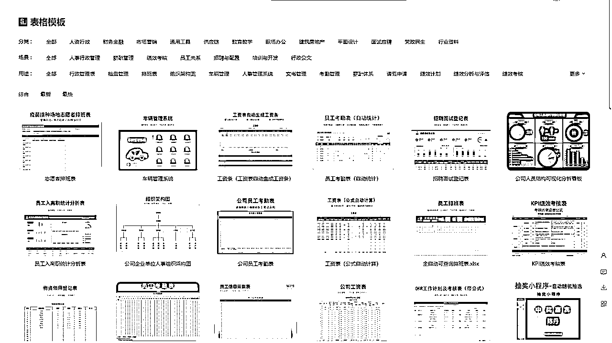
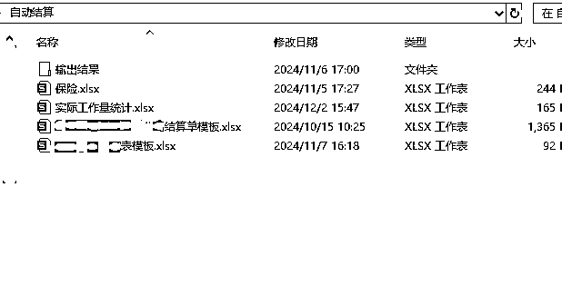
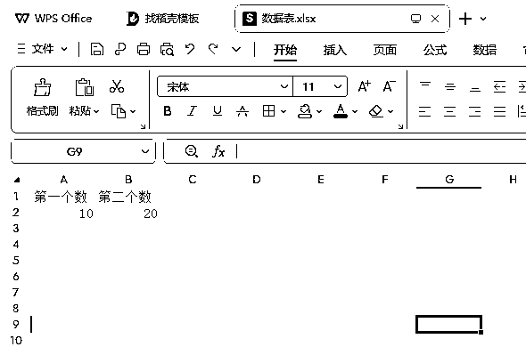
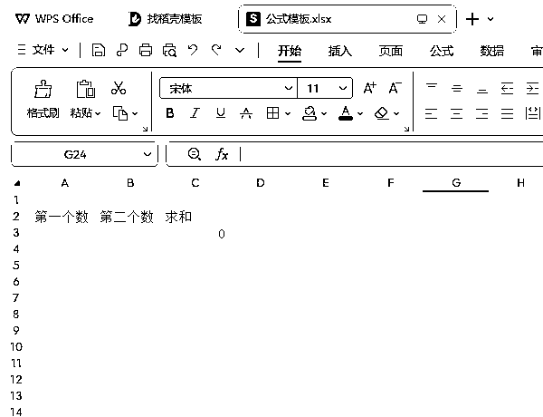
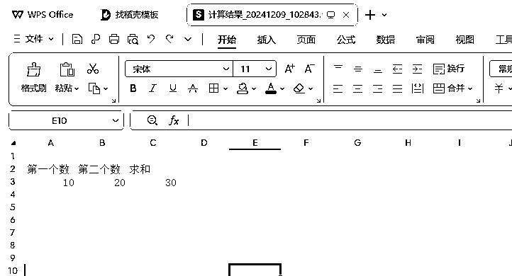

# cursor没能让我赚到一分钱，但彻底改变了本牛马的工作方式

> 来源：[https://k1jlm70p5bv.feishu.cn/docx/KQyRdYaC8ok55VxxCPicC12YnVE](https://k1jlm70p5bv.feishu.cn/docx/KQyRdYaC8ok55VxxCPicC12YnVE)

大家好，我是惜光菌，一个今年4月才加入生财的小金牌志愿者。

背书就不写什么了，虽然在单位里还算出类拔萃，但是我自己总觉的只是矬子里拔将军而已。

这篇文章我只想分享一下cursor带给我这个普通到不能再普通的小牛马的真实改变，以及对于牛马来说一些日常工作使用cursor解决的思路。

我主要是用cursor来写python代码，包括下面内容都是用python来实现

但是cursor并不是只能写python

大家别被这篇文章限制住，不然我罪过可大了。

（结尾附新手接触cursor的几个问题附个人理解）

## 1.对于普通牛马来说，什么东西可以交给cursor去做

这可能是没有接触过编程的小白最常问的一个问题，其实这个答案已经被大佬们给出过无数次了，我这里引用一下：客观的、重复性的工作都可以交给cursor去做。

换句话说，只要你能给出明确处理逻辑的工作，都可以。

再具体一点说，我们打开wps的表格模板：

不管你是哪行哪业，只要你用得到这些模板，基本多多少少可以用cursor解放一些生产力。

下面举几个例子，在2、3、4里分别分享一下，同时分享一下在写代码的过程中一些问题的处理方式。

## 2.牛马痛点之报表

### 2.1工作内容分析

我的工作内容会涉及很多报表，日报、周报、月报、年报，只要是个工作内容，恨不得就得出四五个报表，再加上月底的一些汇总、工作量计算等等等等。

大多数这类报表都有一个共性：有逻辑。

一般数据类报表都会将大量数据用一定逻辑进行分类、计算、汇总等，其实牛马需要做的就是把数据粘贴到excel中，然后根据逻辑关系得到最后答案。

之前我用的方式是excel公式，虽然已经比较简便了，只需要把数据做一下“格式化”，结果就出来了，但是我懒啊。我连格式化都不想做啊！所以这事就交给cursor了。

想让cursor完全从0到1的输出一个表格其实挺困难的，因为表格的格式、关键列等内容很难完全和我们心意。

但如果我们加入一个excel计算模板，需要做的只是让cursor帮我们写一个程序，将数据格式化后粘贴到对应位置，然后excel内完成计算，这个事就解决了！

理论形成，开始实践！

上图中前两个表格是数据来源，属于其他同事发给我的数据，我需要的数据都在里面，后两个表是我自己制作的模板，计算逻辑已经通过excel公式写进去了。

在让cursor输出的过程中，我们需要明确的告诉他

“我要把某表某sheet中哪些单元格粘贴到某表某sheet具体哪个单元格中”

这个很重要！划重点！！

然后让模板excel保证准确运算即可，“表格计算完毕后再保存”这几个字要告诉cursor。

这里有个点要注意，我们最好复制模板的副本，然后进行粘贴运算等操作，以免代码有误导致模板报废掉。

### 2.2工作流程

按照这个思路，我们可以得到这样一个工作流程：

1.把模板复制一份副本

2.把需要的数据从数据来源表的某单元格粘贴到模板副本的某单元格

3.模板副本完成工作簿内的计算

4.保存

这样捋出工作流程后，是不是就简单多了，不管多大的数据量其实本质都一样了。

也就是说，只要我们能完成把A表A1粘到B表A2，并让B表完成计算，这类问题就都不再算问题了。

### 2.3示例

我在这里放一个小示例，里面放了两个文件，一个是数据表，一个是计算模板，用于下面的演示。

数据表截图如下：

公式模板截图如下：

我们现在来把上面梳理出的工作流程转成一段“甲方需求”发给cursor。

以下是提示词示例：

cursor的输出如下：

拿着代码去运行，运行成功，一次性过！

当然实际的报表可能会有更复杂的计算过程，比如第一步的结果是第二步的条件，等等，但是每一次计算都可以拆分成同样的计算过程，只是用同一个样子的小积木来回拼搭即可。

## 3.牛马痛点之文件整理

### 3.1工作内容分析

前段时间我负责的一个项目面临年度检查，很多文件需要重新整理，其中两项工作如下：

1.在几百个人员合同中找出本项目的几十个人的合同

2.把几百份制式文件中某几页删除

这两个工作内容真的是够机械、够重复，重复到要吐了。

让我这么一个懒牛马干这个，牛马怕啥要把嚼子都咬碎了吧！！！

以第一个工作为例，我们分析工作内容后可以发现

我们去看一下合同命名规则，如果里面包含一些我们掌握的不重复信息，比如员工编号、身份证号等，那我们是否可以用这样一份不重复信息的数据列表，让代码帮我们把需要的文件复制到新文件夹？

所以，交给cursor。

### 3.2工作流程

我们梳理一下工作流程：

1.找到不重复信息，创建表格，填写好信息后保存，命名为“人员明细”

2.把所有合同打包放在一个文件夹中，确保文件命名有我们要的信息（一般人劳保存合同时命名还是蛮规范的），给文件夹命个名（我是直接用了之前一个代码，命名是“人员身份证”）

3.用“人员明细”某列信息去在文件夹中模糊搜索，并复制到新文件夹

### 3.3示例

因为信息敏感，所以放个脱敏版的示例上来吧。

一个文件夹中我放了10个空白文件，命名用1-10数字命名，在“人员明细”里放了1-5，看看能不能让cursor准确的把1-5找出来。

根据我们的工作流程给cursor发一段提示词：

以下是cursor给出的回复：

本来要耗费一上午的活，5分钟搞定了。

## 4.牛马痛点之微信群发

微信群发功能可能一年用不到几次，但是每次用到都很烦。

因为真的不方便……尤其是微信好友标签打的不全的时候。

其实这次做这个功能更多是因为航海，志愿者经常要通知一些事情嘛，比如提醒打卡啊、上课信息啊，跟有一些船员也约定了提醒时间，可能小A需要每天早上通知，小C需要晚上通知（别问B去哪了）

发信息其实是一个很机械的活，有目标人，有话术，有工具（微信），所以，交给cursor。

这个代码第一次接触到了python里类的用法！！

你看你看，小白用AI编程次数多了，也会慢慢的不那么白了对不对！

### 4.1工作内容分析

首先我们有一个列表，需要把消息发给谁、发什么内容、几点发。

然后在具体时间点，复制接收人信息，到微信搜索栏粘贴，进入聊天框，复制发送内容，发送。

依次完成所有发送任务，结束。

其实这就是自动发微信的全部内容了。

### 4.2示例

根据这个工作内容分析，我们来给cursor一份提示词：

这次就没那么顺利了，中间出过不少次错误，其中“找到好友并发送消息”就卡住了很久。

在最初设想中，是用python自动找到微信的搜索栏去搜索好友（其实也知道快捷键CTRL+F就可以打开），但是AI输出多次后依旧找不到搜索栏，最后还是使用了快捷键版本。

所以在实际操作中，如果遇到一些问题，能用plan B就直接去用好了，在一个问题上死磕并不是一个太好的办法。道路千万条安全第一……啊不是，条条大路通罗马！

以下是最终版代码示例：

代码中设置了“定时发送”和“即刻发送”两种情况，时间栏空白就会即刻发送。

模板可以直接生成，避免模板差错导致代码找不到信息。

wxid可以是微信号也可以是昵称（昵称最好唯一，不唯一会发给第一个）

## 5.新手接触cursor的几个问题

1.cursor编程和用GPT编程有啥区别吗

没区别。

你可以把cursor看成是gpt和代码编辑器的一个合体，它的界面左边是编辑器，右边是AIchat栏，AI回复的代码直接粘到左边，比较方便。

2.没有编程基础用cursor好上手吗

好上手。

只要你能当一个好甲方，把需求提的明明白白，比如“A表的B3单元格内容复制到B表B2单元格中”，这样的语音是AI最喜欢的。

还有，不要有任何主观内容比如“好看的”、“漂亮的”之类的词出现就行。

如果在使用过程中可以仔细看一下代码和注释，学习python也是会很快的。

3.cursor使用需要魔法吗

不需要，直接干。

4.cursor全英文界面看着好难啊。

在查看——扩展——应用商店里安装Chinese(Simplified)，安完就汉化啦

5.cursor需要多大内存啊

我的主程序只有500M这样，可以把一些需要的库都装在其他盘。

6.cursor是免费的吗

收费的，不过新用户有15天/5000次接入的免费额度。

所以可以先试用。

另外有可以薅羊毛的方法，科学上网后去搜临时邮箱，可以接cursor的码，接下来用临时邮箱正常注册就好。

注意，免费额度用多了会被cursor封掉，封掉后只能买pro了。

7.不想买cursor怎么办，毕竟太贵了

可以用windsurf，目前还比较便宜。

另外不嫌麻烦也可以搞一个套壳AI，配合cursor的编辑器使用，也不是不可以。

## 6.结尾

现在学习AI真的是一件必要的事，这句话可能你听过无数次，但只有你真的接触AI后才能理解这句话的含义。

比如CURSOR，它帮我消除了与程序员之间的天堑般的差距，我只需要有想法，就能产出我需要的工具。

再比如这次出圈的圈友花生大佬，小猫补光灯的成功就是最好的例子。

希望圈友都能解放双手，一起生财有术，结尾~撒花🎉🎉

再次感谢上一次航海的领队@蓝弈 老大不厌其烦帮我审稿~