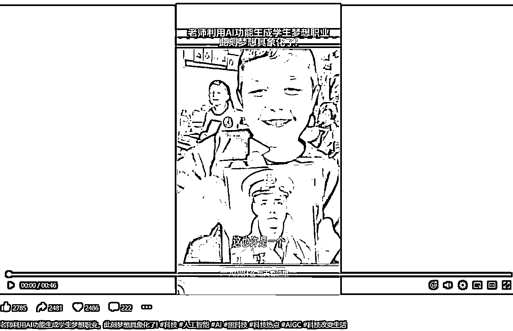
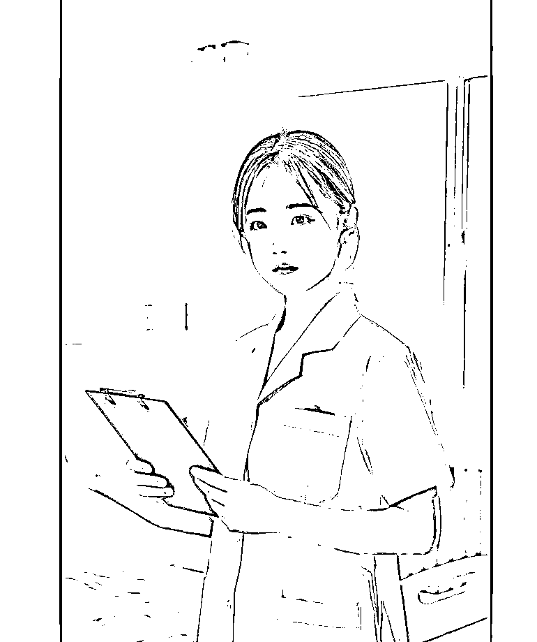

# 用comfyui搭建具有商业价值的“宝宝未来职业照工作流”

> 来源：[https://ycnvxt0fqtil.feishu.cn/docx/ExiMdrpVHoOH8bx3dkecBiROnqc](https://ycnvxt0fqtil.feishu.cn/docx/ExiMdrpVHoOH8bx3dkecBiROnqc)

1.  引言

*   大家好！我是一名建筑设计师，2024年10月加入生财，这是我第一次参加航海，最近搭建了一套“未来宝宝职业照”的工作流。

*   今天，我非常高兴能够在这里和大家分享这一工作流的设计思路、操作步骤以及实现的效果。这套工作流的目标是高效、精准地生成符合要求的“未来宝宝职业照”，同时保持创意与艺术感。希望通过这次分享，能够帮助大家理解和优化自己在类似项目中的工作流。

1.  背景与需求

*   背景：为什么要搭建这套“未来宝宝职业照”的工作流？有一天晚上在刷视频号的时候偶然看到一个“老师用AI功能生成学生梦想职业”，当孩子们看到未来的自己的时候脸上充满了惊喜，我觉得这个非常的有意义，不仅让孩子们对未来充满了期待，同时也在鼓励孩子为自己的梦想努力奋斗。正好这段时间在学comfyui，所以我决定自己尝试一下用comfyui搭建未来宝宝职业照工作流。

*   需求：我在某宝上搜索“未来宝宝职业照”发现已经商业化了，说明有一定的市场，也可以进一步和线下影楼合作制作实体化的照片，所以这套工作流具有理想和现实意义。

1.  工作流设计思路

*   工作流分为几个阶段：首先从成人职业照片入手，通过FLUX图生图来提升图像清晰度；然后对成人脸部进行处理，确保后续换脸操作的精准性；接着，加载宝宝照片，并通过LORA与faceiD生成未来宝宝的面部特征；最后进行面部合成，完成换脸操作。

1.  具体步骤与工具使用

*   步骤一：成人医生图片的选择与FLUX图生图的使用

*   选择合适的职业照：我首先用comfyui生成女医生的照片，但效果不是很满意，看着不够贴近生活，所以我尝试用国产软件“豆包”生图，我输入提示词“帮我生成一张图片：年轻漂亮的女医生站在干净整洁的病房内，手拿着病历单，看着我们，夏天，阳光照进房间，温馨的病房，明亮的光线。比例 9:16”。结果非常自然的生成了贴合实际的照片，当然这个过程同样需要抽卡，挑选一张完美的底图是非常重要的，这为最后的图片打下了一个基础，所以我选了一张手部姿态自然，衣服上没有多余的图标和文字的照片，这可以避免后续重绘中手部变形和字体扭曲，导致照片不够真实。

*   FLUX图生图的作用与如何调节降噪值：国产软件生成的图片构图不错，但是清晰度和细节上有所欠缺，所以为了提高底图的质量，我采用flux图生图的方式进行高清修复。因为图生图的工作流是在文生图的流程上修改的，结果生成的图片（左侧男医生图片）不仅与原图毫不相干，甚至连提示词都不起作用。这是因为文生图流程中K采样器降噪值默认为1，也代表着latent（潜空间）是一个空latent，而我们图生图流程将图片的latent给了K采样器，如果还是将降噪值设置为1的话，那么K采样器会将图片完全重绘。这一点放在webui上会更好理解，webui将降噪值denoising翻译为重绘幅度，值为0表示不会改变原图，值为1将会得到一个完全不同的图像。我的K采样器里噪波模式我选择了GPU（=A1111），这是webui的模式，comfyui的模式是CPU，将webui和comfyui对比着学会让自己更理解各种参数的意义。

*   关键技术点：降噪值的影响及调整方式。

*   步骤二：成人脸部处理

*   使用局部重绘（裁剪）节点精准裁剪成人脸部：首先要明确一点，因为宝宝长大后发型、服装、姿态都会变化，但脸部的神态特征是不会变的，所以为了节省算力，我们用局部重绘（裁剪）节点将成人脸部裁剪出来，这个节点和图像裁剪有区别，图像裁剪会将图像的尺寸裁剪，后续生图的时候还需要进行图像恢复，而局部重绘（裁剪）仅将重绘的区域裁剪出来发送给K采样器进行采样，不会改变图像尺寸。

*   重点节点介绍：segment anything节点有着非常强大的检测功能，所以我们用“简易seg检测”节点检测脸部，加载BBox检测，选择face模型（还可以选择人像、手部），sam加载器里的设备模式选项选择“prefer GPU”，这个选项有更好的兼容性和效果。seg仅具备检测功能，所以设置seg到遮罩及遮罩膨胀节点将脸部区域生成遮罩发送给内部重绘（裁剪），将裁剪宽高设置为1024*1024后，就顺利的将脸部遮罩区域裁剪出来。

*   步骤三：生成宝宝未来脸部图像

*   通过LORA与提示词控制重绘内容：我选择了XL大模型及一个调整人物年龄的lora，正面提示词我采用文本输入的方式分别输入“一个25岁的中国女孩、肖像照和高质量、高清、极致细节”，可以减轻提示词相互污染的情况。

*   通过FaceiD提取宝宝面部特征：Clip视觉图像处理插值方式选LANCZOS，大家都说这个方式好。因为我在航海过程中最先接触了face id所以采用了face id，面部特征提取的节点还有instantid 、pulid 、ecomid等，相应的大模型及lora都需要调整，效果如何还有待大家测试。

*   步骤四：面部特征合成

*   面部合成技巧：局部重绘在webui里属于图生图的一部分，所以迭代步数、CFG及降噪值都与文生图有所区别，下面是我尝试不同数值后得到的结果，步数设为10步，CFG值为1，降噪值调整为0.25，确保生成结果的自然过渡。（右图是CFG值调整为7的结果，可以看到面部拟合的不是很好）

1.  工作流中的关键技术与操作

*   降噪与特征保留：FLUX图生图与文生图的不同，降噪值按需调整。

*   ComfyUI的灵活性与优势：使得我们能够在图像合成的过程中进行微调，确保每个细节的完美呈现。这个过程需要不断地迭代，找到最优的参数设置，这个过程可以采用控制变量法，有助于我们更深入的理解每个参数影响的内容。

*   底图选择：本土化工具的选择，尤其是国产软件在文化理解和场景贴合方面的优势，极大地提升了工作的效率与效果。

1.  效果与结果展示

*   我选的两个宝宝脸型恰好和成年医生脸型相似，如果宝宝脸型是圆脸，那么在选择成人照片的时候也要选择圆脸会更契合。

1.  总结与展望

*   这个工作流通过多种工具的灵活配合，解决了许多技术难题，同时也保持了图像的艺术感与创意。未来，我希望大家能一起优化工作流，提升生成效果的精度和效率，也希望能够探索更多有趣的应用场景。希望大家能从中得到启发，顺利搭建其他的工作流。下面是我尝试的另外一个思路，修改提示词里宝宝的年龄，生成了宝宝龙年艺术照。

*   对未来优化的展望：我希望能在comfyui自动生成满意的底图，直接将flux高清修复生成的图片接入seg检测节点可以避免反复加载图像；脸部获取节点进一步优化，在之前我以为face id不能搭载flux模型，但今天看到有个工作流却做到了，所以尝试不同的大模型与脸部获取节点组合也是一个优化的方向；并在后续增加高清放大节点，生成高质量4K图片，毕竟顾客的要求没有完美，只有更完美。

*   非常感谢生财团队和教练、雪荔领队、子凌以及志愿者们，给了我这个机会和大家分享，文章写的比较匆忙，有不对的地方欢迎大家批评指正，一起共同进步，谢谢！