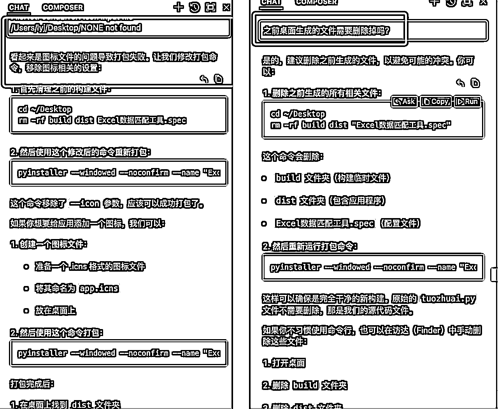
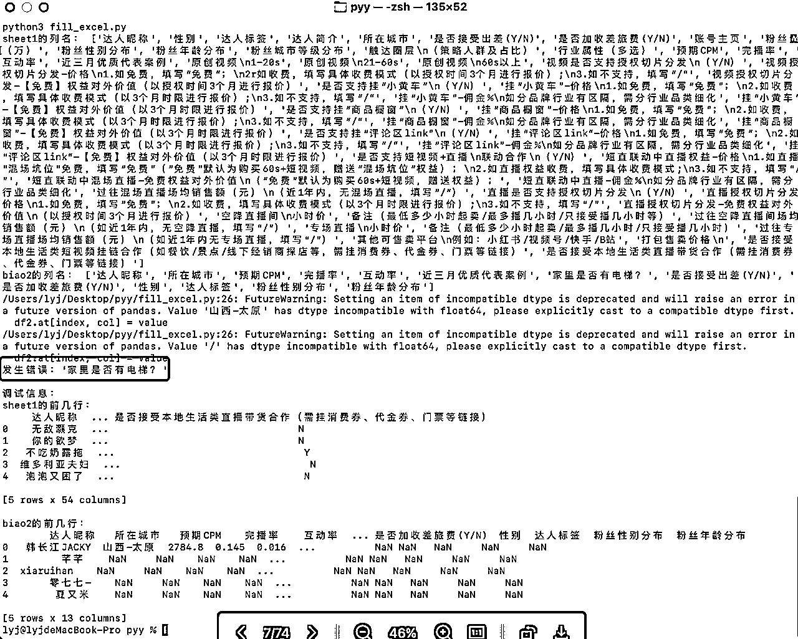

# 0编程基础，通过cursor打造出excel自动化匹配工具

> 来源：[https://qnfoes1o78.feishu.cn/docx/QDnsd1MZVoieAzxQwuUcOxs1n2e](https://qnfoes1o78.feishu.cn/docx/QDnsd1MZVoieAzxQwuUcOxs1n2e)

## 背景：

目前在无忧传媒做MCN商务，

主要工作内容：需要根据合适的项目，推荐自家合适的达人。

每一次提报账号吧，要填写的资料非常繁琐，

举个例子，

非常细致，包括但不限于达人昵称、主页链接、粉丝量级、星图八大人群、男女粉丝画像分布等等...

提上去之后，能否中号，不确定因素多，且无法人工把控。

这种背景下，多次让媒介部门填写详细资料，但无法保证产出，会使人消极，降低配合度，

虽然嘴上不说，我也不好意思强迫他们第一时间配合。

因此，在思考，能否打造一款自动匹配的工具，

让AI帮我自动化完成，

一来效率高，

二来不求与人，

## 说干就干，先说结论：

成功打造出来了，且运行的很流畅，当时成果是直接发朋友圈去宣发，

## 打磨过程：

## 思考匹配的运行逻辑，

提供2个表，

1个总表（sheet1），包含所有数据

1个待补充表（biao2），需从总表中通过行、列，一一对应到该框数据后，将数据补充完整。

刚开始，因为完全没有过编程基础，

只能用自然语言跟cursor沟通，

好在跟上了好时代，完全可以用最白痴的沟通方式弥补0基础的缺陷。

eg.配置环境出错，直接将显示错误的各种看不懂的英文代码，一字不落复制粘贴，他的分析速度非常高效；

最初沟通出来的代码逻辑非常死板。

biao2的行、列必须跟sheet1保持一致，字数、顺序都要一模一样才可，否则直接报错。

例如在中间穿插1个总表没有的【家里是否有电梯？】

都会导致运行出错。

用最朴素的方式来迭代优化，

出错之后，直接把错误代码复制到cursor的对话框中，进一步分析。

陆陆续续，摸索前进，更新迭代了几个版本；

例如，

1、遇到sheet1中没有的，需要跳过，不填写即可；

2、是否可以增加模糊匹配的代码，来快速试错；提高筛选匹配数据的速度。

满足基本功能之后，

思考如何更加便捷应用在工作场景中。

这会是，

## V1：只能macOS的终端，通过代码命令执行匹配数据。

那，是否可以打造成应用程序，直接放在桌面，双击打开之后，自运行里头代码软件，

在没有任何网络的情况下也可操作？

## 升级V2：思考，制作成可直接运行的软件，

1、左边总表，右边待补充表；

2、拖拽进入

3、设置输出桌面

4、等待匹配完整的表格

自动化完成填表即可；

以下是我的具体操作过程：

我想要在此基础上进行升级，制作成软件。

可以实现如下的流程：

1、界面有两个方框，左边放入sheet1（总表），右边放入biao2（待补充表）

2、用户拖拽文件。

3、进行数据匹配。

4、默认输出文件到桌面。

## 优化V3：实现直接拖拽，而不是文件夹路径上传。

升级成优化框，实现可以直接拖拽，匹配的非常完美！

突然想到，可运行的前提下，是需要配置系统环境，涉及到py代码环境，

这个步骤也是折腾了我挺久，非常繁琐麻烦。

如果，这个软件只能在已经配置好的电脑环境中运行，

那么，我无法对外分享，

于是乎，

## V4版本：打造成软件包，其他设备可直接使用。

引导话术1：我想要把这个功能，设置成在win或者macOS上，都可以独立运行的软件。不需要在安装代码插件的繁琐步骤。可以实现吗？

引导话术2：最终要的效果：在没有安装Python环境的电脑上独立运行。

## V5：优化细节，添加自己的联系方式

这会想的是：工具配置好之后，对外免费分享，或者售卖给同行，

添加一个我的联系方式，让更多的人看到我。

没办法发图片，但是能用文字呈现出效果，我都惊呆了。

## 最终成果展示

## 感悟：

1、个人无需编程，完全可以根据自己的需求，通过朴素到极致的小白语音，聊天式打造产品。

赶上了时代的红利。

至于能否变现，变现到什么程度，

就看需求挖的有多准、有多痛了。

2、通过这次简单的试手，让我对cursor变现空间，有着非常大的想象力，且，是完全可以自己操控。