# AI小白1周内开发6款应用的实操方法论

> 来源：[https://gnmzzv7764.feishu.cn/docx/NtVcdh1oKoVWPOxgsbpcOxgZnvS](https://gnmzzv7764.feishu.cn/docx/NtVcdh1oKoVWPOxgsbpcOxgZnvS)

Hi，你们好，我是Lucas，一个接触Cursor 、AI不到个月的业余爱好者，之前想要深入了解互联网产品和玩法但没有合适的∂机会，正是由于有生财有术平台，我有了机会深入参与互联网和AI，非常感谢！

目前在参加Cursor航海学习AI编程。感谢@瓜斯老师的邀请，让我能有机会和很多优秀的老师、同学在这里交流。分享关于Cursor AI的使用心得以及一些项目的思维方法论。^~^

内容主要从思维方法论的角度来分享：

idea从哪里来、如何正确使用工具、编程逻辑、方法论实操这几个方面。开始之前，我想先快速分享一下内容前提：关于思考、行动以及项目型思维。

## 前提

### 1.思考

先静而动，先定后行。

*   拿学习Cursor工具为例，我学习AI编程目标并不是成为一个编程开发人员。这个过程中开发不同类型的小产 品，主要目标在于建立对AI工具、AI智能、互联网产品的最直观感知。对于大部分小伙伴们来讲，我相信每个人的认知和“最终”目标都不一样。

*   这个是开始行动之前需要提前想清楚的。它起码决定了个人如何开始、如何学习、要花多少时间？要达成什么效果？是否要主动产生新的链接？是否在过程中发掘、创造机会？在过程中是否要花时间时间变现？以及关注的重点？等多个方面。

*   在这个过程中除了对目前AI产品强大的表现有所震撼，首先更多关注点我放在了观察学习方面，对于AI智能的行业性潜力和发展方向、目标有了基础学习和判断。

*   其次是对于比如创造端（Cursor背后公司）收费逻辑和流程、中间端（代充值、推广者等）、用户端（个体开发者、2B企业使用者）的使用流程、实践、以及对于AI小白在市场朦胧期想要入局这类赛道，是否能以这样的“工具”为起点，结合现有资源，快速展开做事。

### 2.行动

*   行动力对于创业者来讲是底盘，包括时间精力、情绪调节、沟通交流、反应速度、执行力、自我更新、资源互连、市场认知等能力。要求我们在对项目有较为完整的思考和认识以后，有一个大致性关于各环节节点及重点、接下来项目的不同参与者可能会引申出来的可能性、资源和需求的行动计划。

*   这个计划可能是一个目标性的。比如，基于我们目前具备的AI认知、技术认知、实践层面以及市场应用的阶段，是否能借力？做产品有优势还是服务有优势。

*   对于市场的判断，不打不胜的仗。我们目前的行动力具备多少，（不是能吃苦、耐力、执行力）是指能否抓住各环节要点，然后行动产生一个结果，区别在于每个人的盘子大小不一样。

*   剩下就是按照自己拥有的东西做行动计划了，边干边学边调整。

### 3.项目型思维

*   1个人可以成为10个人。我们传统的思维和学习方法让太多聪明、有活力的小孩儿和年轻人在被动思考、被动接受中疲于奔命。在了解人、了解自己、了解人与人以及成熟方面，理解的太慢。本来15岁就应该了解的东西，没有人带的话，可能三四十岁才能够慢慢找到感觉有所醒悟。

*   我们要知道每个人都是不一样的个体和生命历程。不要被别人环境和状态影响，慢慢用心寻找自己的兴趣和热爱的点，这是需要花最主要时间探索和学习的，越早越好。

*   要有核心认知和责任心。不高看任何一个人，不低看任何一个人，有能力随时随地向任何人学习并直接进化和升华。同时，清清楚楚看自己，尽力不生我慢心等等（傲慢、无知）。这是对自己负责、也是对别人负责。

*   讲究事实，实事求是，需要学习那就快速行动，需要改变，那就快速改变，不要带情绪方面的东西，随时准备推翻自己，这应该是优秀人才的基础和涵养。

项目型思维学习方法

如果觉得这个东西比较有趣，决定去学习，首先会先定目标，要定力所能及的最高目标、思考和行动要最快、要准确、要量大、不偷懒、向高手直接请教、先思考再学习，通过最短的时间将所有相关信息来源过滤一遍。然后整合大家的思考见解，再拿出自己的判断和预期，这可能是一个大概的思路。

下面是关于我学习Cursor AI编程的一些总结。

## 一、Idea从哪里来

对于小白来说，对于基础的编程词汇、概念等缺乏理解，导致在操作过程中“无法形成流畅的开发思路链条”，接下来分享一些我获得idea的小方法 •́︿•̀

### 1.如何产生idea

对于之前没有开发经验的编程初学者而言，刚开始的时候可能会陷入“不知道从哪里开始、没有想法”的状态中。我的经验是与其空想，不如通过迅速行动来打破困境。通过动手做一些小项目，不仅能够迅速掌握编程的核心技能，还能在过程中激发出意想不到的创意。你会惊讶地发现，灵感常常在不经意间涌现，而编程，正是将这些创意转化为现实的最趁手的工具。

#### 先从小游戏开始

我动手实现的第一款游戏是一款太空游戏：太空大战，也就是我们小时候红白机玩的那种小游戏。功能简单，主要通过慢速飞行→快速飞行来增加技术难度。

通过制作“太空大战”这个项目，相当于Cursor升级打怪的第一站。这个实操过程不仅获得了成就感，更重要的是，开始有了通过使用Cursor和其他工具来实现我的想法以及解决实际问题的思路。接下来，我系统分享一下我在使用这些工具过程中积累的一些经验和技巧。

下面就是进入游戏首页的界面：

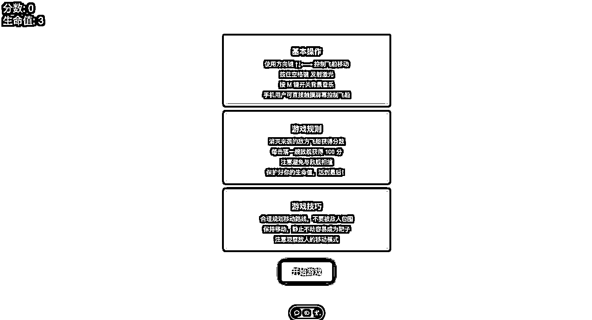

### 2.idea如何实现

就像制作贪吃蛇游戏一样，通过Cursor实现一款小游戏的逻辑并不复杂。按照我们常规的提示词就完全可以实现。可是如果游戏要吸引人，就需要有一点小心思和小设计了。游戏吸引人，除了故事、逻辑，画面和音乐很重要。于是我希望按照自己的想象，在音乐和画面上做一点有趣的事，操作步骤如下：

#### 2.1 星空背景效果的实现：

-我提示Cursor，我希望这款游戏有一个宇宙星空背景，星河点点，人类斗士驾驶战在浩瀚的宇宙，迎战外星球的攻击。

-我希望背景中的星系能够呈现自动且不规则的闪烁效果，宛如战机真实的翱翔在浩瀚宇宙。

#### 2.2 战斗机样式的实现：

-游戏当中的体验感来源于真实感（仿真效果）很重要，它会直接刺激到人内啡肽的分泌，于是我决定让我的战机实现3D立体效果，将战机设计成了喷火战机。

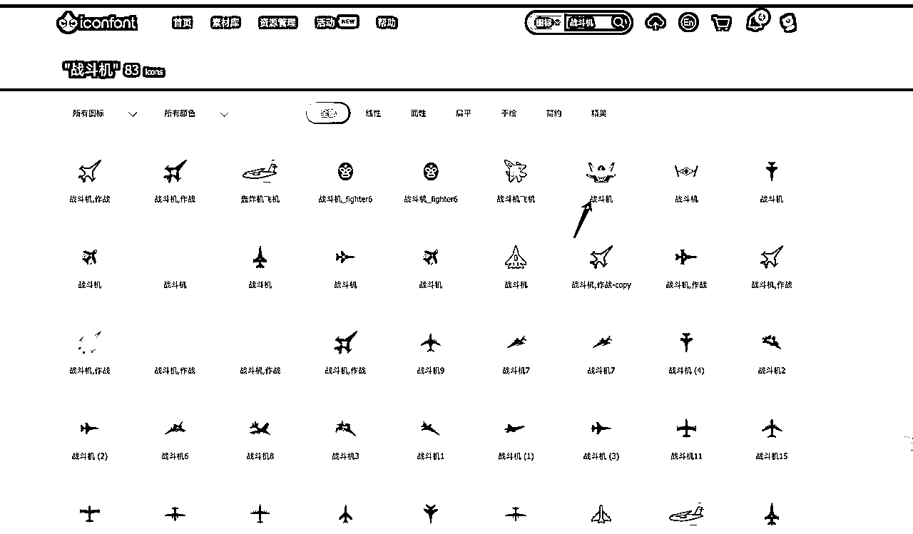

-战斗机原型：可以直接从“阿里巴巴矢量图”上面免费下载PNG图像（这是一个很棒的网站），然后使用图片尺寸转换工具进行图标大小的裁剪，我使用的是I❤️IMG网站的Resige IMAGE个功能（网址：https://www.iloveimg.com/）。


-目标击中的效果：战机击中目标以后要实现爆炸💥的效果，这个也可以通过矢量图标来实现，同样在阿里巴巴矢量图选择自己喜欢的图片即可。

-战机控制：我还记得小时候打飞机游戏里的飞机只能左右飞行，不能上下移动，这是一个小小的遗憾。被动挨打的感觉真的很不爽，所以我让战机实现了主动出击（上）、主动后退（下）的、以及快速飞行的能力！

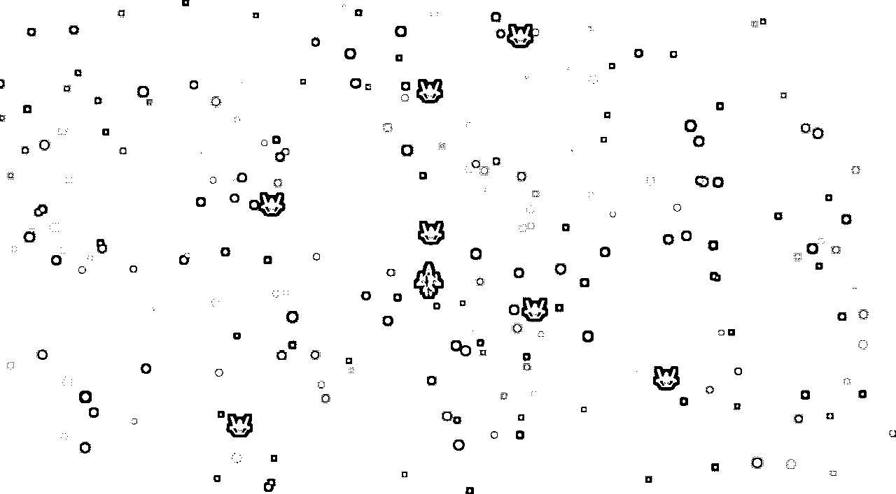

#### 2.3 背景音效的实现：

-画面完成以后，接下来就要配上惊险刺激的背景音乐了！首先，我在百度和谷歌搜索了关键词，发现了几个免费素材网站，然后开始注册、登录，找到MP3小样以后，提醒需要付费，关键是音效体验并不太好，于是只能换一种思路。

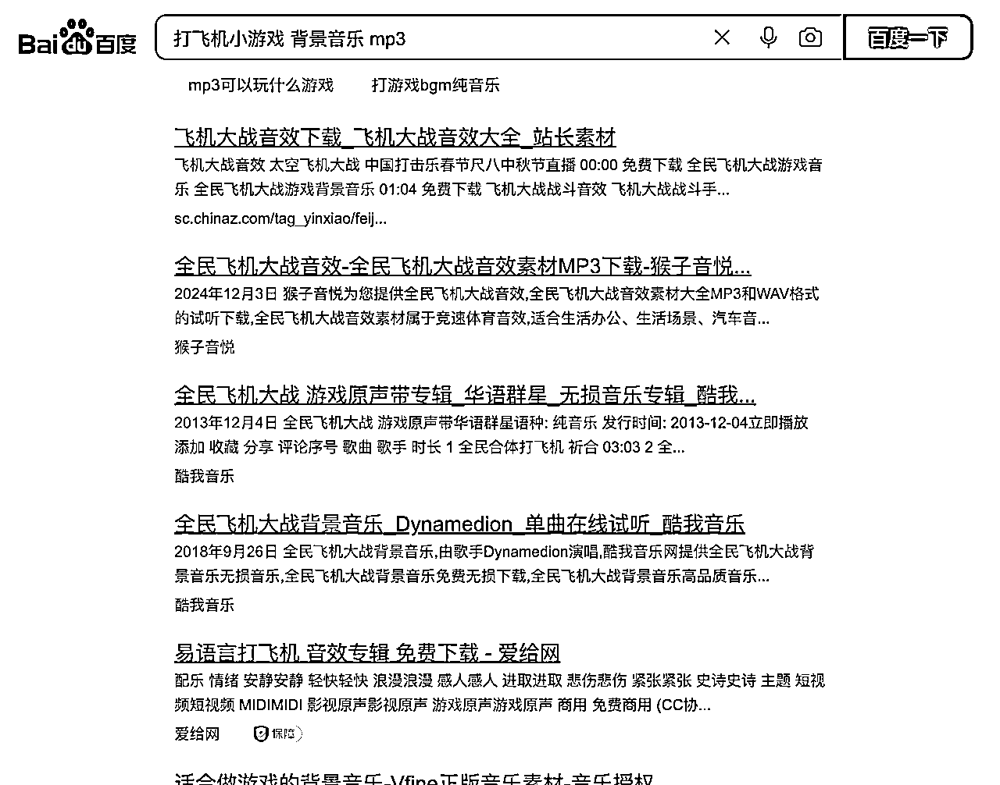

-打开电脑剪映→音频→搜索魂斗罗：


-接下来把音乐拖到剪辑栏，根据自己想要实现的效果，进行剪切即可，然后选择导出：

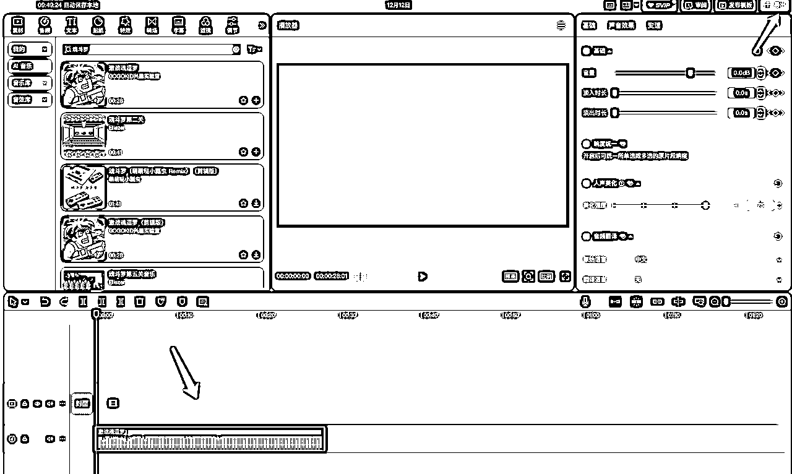

-勾选音频导出：

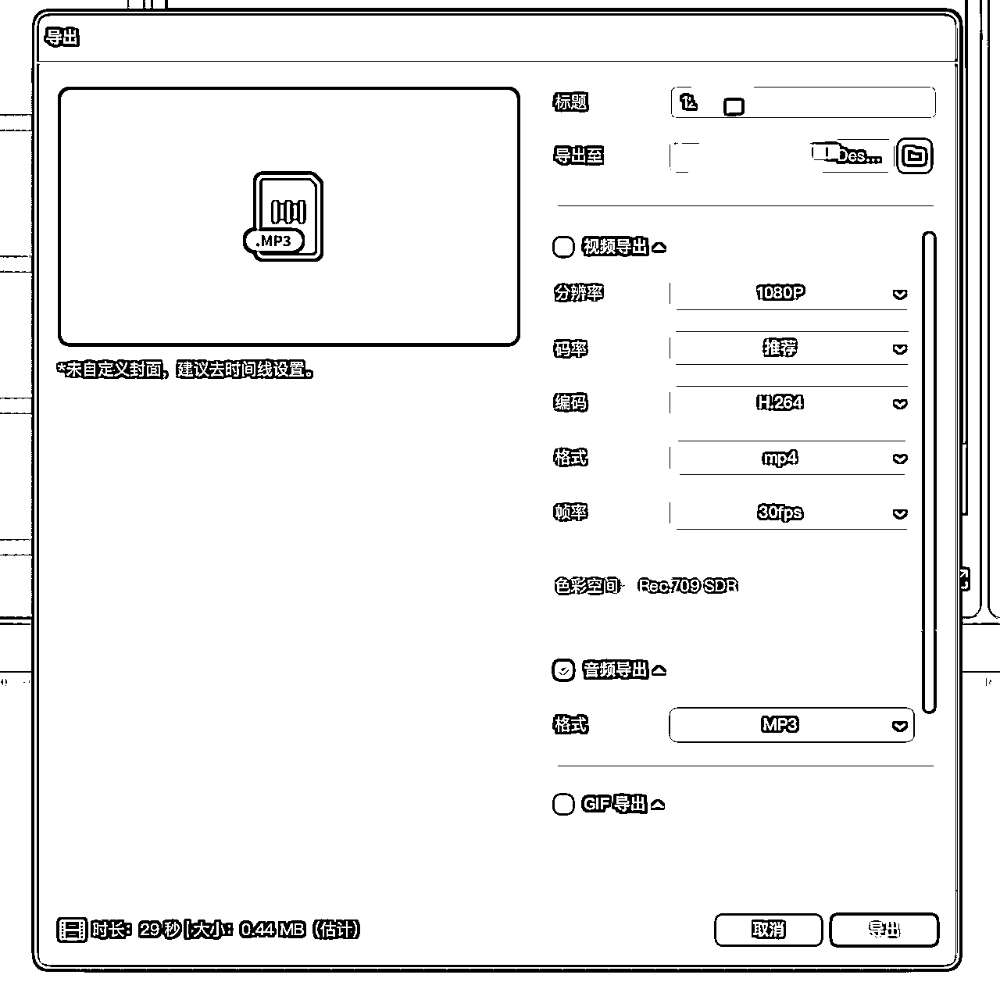

-这样就可以导出音频文件了，也可以尝试通过这样的方法快速找到自己喜欢的背景音乐或音效。¬‿¬接下来我们要把音频文件放在cursor给新建的images文件夹里。至此，背景音乐也添加完成了。然后就是打开游戏，测试效果了。（当然，如果你希望在摸鱼的时候玩一把又不希望被领导或同事发现，千万别忘了让Cursor帮实现音乐开关的功能哦~）

以上就是网页版游戏“太空大战”的大概思路 ͡° ͜ʖ ͡°

所以归根结底，不妨先开始行动。无论idea高级与否、是否是真的需求，随心所欲，直接开始干。如果实在找不到思路，不妨给自己10分钟静下来的时间，观察窗外的落叶、听一首Bob Dylan的音乐，或许灵感自然会掉下来。⭐️

## 二、如何正确使用工具

对于刚入门的小伙伴们，由于过去和“产品开发”相距甚远，首要面临的问题是，缺乏编程及编程基础知识，因此导致了我们容易习惯性的将Cursor理解为无所不能的编程机器人一样，（这是非常正常且合理的现象）。

即：我们只需要通过自然语言对Cursor提出需求，能让它听懂，它就能听懂人类的指令并产出结果。实际上在经过一段时间对Cursor的使用观察发现，想做到这一点一点都不容易。后面我会简单示范一下，通过不同的“自然语言风格”对Cursor提出指令，Cursor的理解有何变化，并会做出什么样的反应。

需要注意的是，在使用Cursor编程开发工具的过程中，偶尔会刷到一些大佬 ，在网络社交平台发布的诸如“用Cursor5分钟开发一个网站”、“通过Cursor半个小时开发一款APP”之类的帖子。

当我们看到这些显性结果的同时，容易忽略这些开发者前期付出的隐性时间成本和思考积累，从而对实现Cursor智能编程产生一种比较偏离的认知和预期。因此，在个人实际操作过程中，就容易产生动作变形、结果差于预期。从而陷入焦虑和焦躁当中。

不过，既然提出了问题，咱们一定会给出解决方案。如何正确使用工具，主要包括两部分：Gemini/ChatGPT+Kimi、另一个是快速且正确的使用Cursor。

为什么开发应用除了用Cursor，还需要借助辅助工具呢？

通过测试和实践我发现，虽然Cursor在代码生成和局部优化方面表现的挺不错的，但对于复杂项目的层次规划、架构设计、以及理解复杂的错误信息等方面，可能存在一定的局限性。而Gemini、ChatGPT在项目工程理解和自然语言对话方面的优势就出来了。因此，咱就可以借助这些辅助工具来补充Cursor的不足，另外也可以更少的；浪费Cursor的请求次数资源。

### 1.Gemini/ChatGPT+Kimi

#### 1.1 动手开发软件之前，需要对即将开发的项目有一个整体的思考框架或者项目开发路线。

假如我们要开发一个前端+后端+数据库+API实现的完整论坛，那么我们可以问问自己，是否了解一个此类的成熟的互联网产品的正确开发路径、技术需求、团队需求。显然，如果我们之前没有互联网产品和技术开发经验的话，对这个事情一定是陌生的。接下来我们就需要求助于Cemini或者ChatGPT了。

那为什么不使用Cursor直接提问呢，因为，会浪费请求次数。而且，Gemini和GPT对工程项目架构的理解更出色。比如：

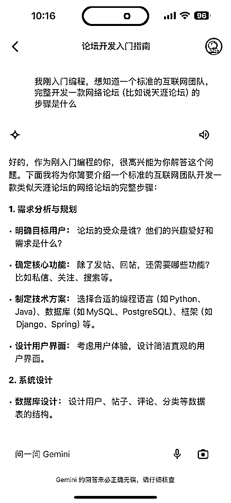

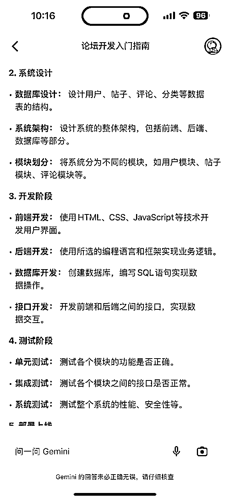

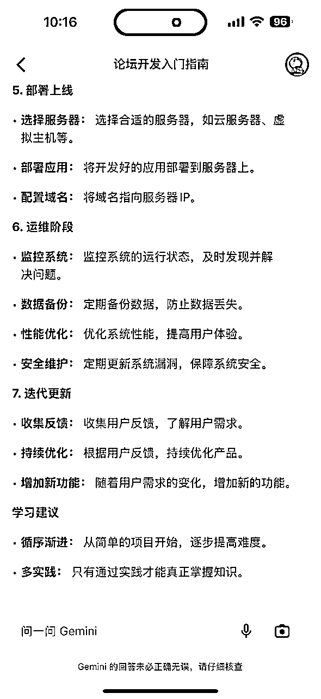

在经过几轮的对话测试以后，对于项目框架、功能实现、开发路径和需求我们基本上就可以做到心里有数了。

#### 1.2 接下来就是关于kimi的使用了。

（豆包也可以，看个人使用习惯。豆包有一个非常好用的功能就是下载好电脑桌面版以后，有快速上传图片、快捷键截图、截图转文字的功能。）

kimi或豆包主要用于项目开发过程中，终端和产品页面遇到报错信息的时候，我们需要实时截图给kimi进行错误分析，并给出解决方案。这个时候kimi和豆包的中文模型优势就出来了，它可以相对比较准确的理解我们中文口语的表达并给出解决方案。另外一个好处也是避免了我们浪费cursor的请求次数。比如：

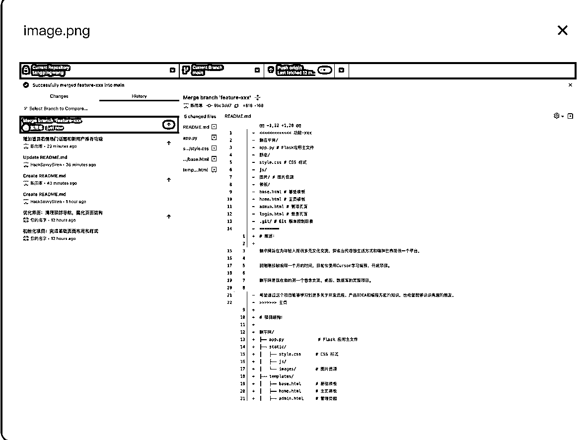

这张图是第一次Github DeskTop，当时正在进行git 提交。之前由于没有用过这个工具所以一脸茫然，于是就可以截图给kimi让他帮忙分析这个页面是什么意思、我的操作有没有错误、接下来我应该干什么？

顺带，我们就初步掌握了github desktop的整体页面功能，比如，什么是分支，如何合并分支之类的问题。如下图：

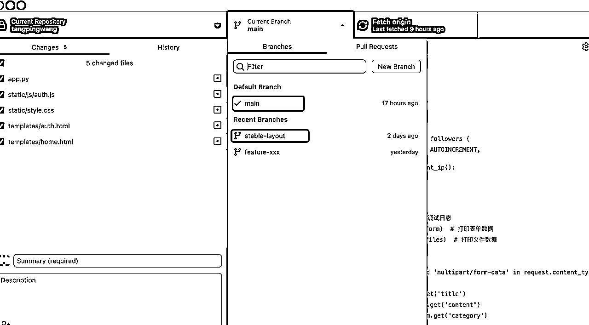

需要注意的是，我们在整个遇到问题解决问题的时候，要有一种随着项目学习的习惯。不单纯为了解决眼前的一个小bug，而是可以从一个点出发，一连串的把所需要的知识一次性查明白，都掌握。在不断试错过程中边解决问题，边掌握具体技能、拓展知识，相关工具使用、编程所需的基础知识的能力、开发者思维路径、项目构建和掌控能力，直到构建出相对完整的项目认知和编程知识体系。

### 2.如何快速且正确的使用Cursor

#### 2.1 首先要对Cursor的个性以及能力有所了解。

Cursor是经常会出错、也是会看人下菜碟的。什么意思呢？其实就是它给出的代码和思路仅仅只能是一个大致的参考，虽然大多数时候是正确的，但很多时候也会错误百出。因此，在面临复杂项目的时候，如果没有开发经验，往往会陷入不断调试、不断出错的怪圈。所以最好的方式应该是在做项目的过程中学习编程语言、逐步掌握开发的流程和各种相关工具。

那如何解决这类问题？我的方法主要分为三部分：

#### 2.2 cursor的常用功能

比如，下面这几项都是比较需要常用到的功能：

-@Codebase:

在chat输入框手动输入@，然后出现下拉框，就可以选择Codebase。通过@Codebase，可以直到找到要使用的最重要的代码片段，并基于这些代码，让cursor进行分析和优化。

-@Files:

通过这个功能、我们让Cursor 来找到我们希望它查看的代码文件，比如我们希望它检查一下index.html这个代码文件中的代码逻辑和代码没有错误或者需要完善的，那么我们就可以在聊天框中@Files。

-@Folders:

通过@Folders我们可以让cursor选中对应的文件夹，并回顾对应的文件夹，从而让它快速遍历整个文件夹的内容，从而发现问题，如下：

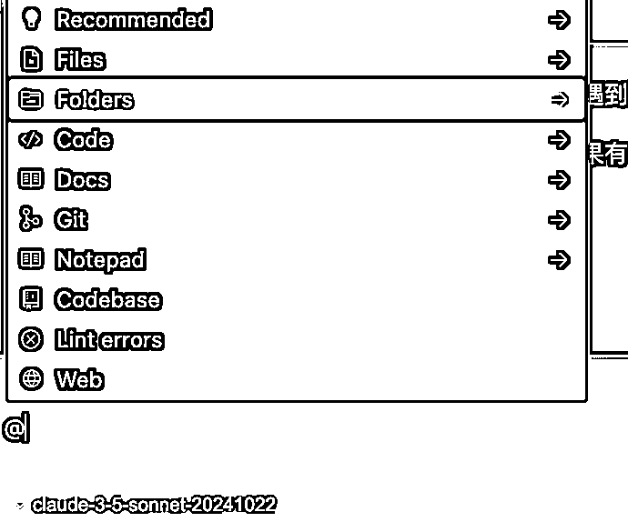


-@Docs：

比如我们现在正在开发一款ios APP，我们希望这款APP的界面设计效果实现Apple的简洁效果，接下来就可以通过@Docs调出这个功能，然后点击Add new doc，从而粘贴所需文档的 URL 。

比如，我在开发APP的过程中就引用了Apple官网上的一个Apple UI链接 在苹果官网专门有这个页面，复制链接过来就可以了：https://developer.apple.com/cn/documentation/swiftui/ （如下图操作）

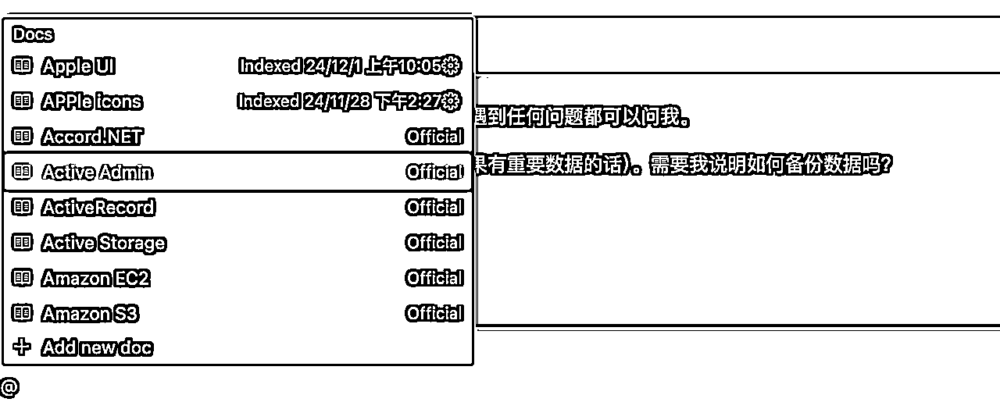


-command+K（ctrl+k)

我们可以在cursor里打开左侧的一个文件，然后在对应的代码上面，打开command+k，然后输入：帮我注释下面这段代码，点击生成，cursor就会帮我们把每行代码生成注释，这样对我们理解代码也是一种不错的学习方法。


另外也可以在编辑器窗口中也可以生成新代码或编辑现有代码。

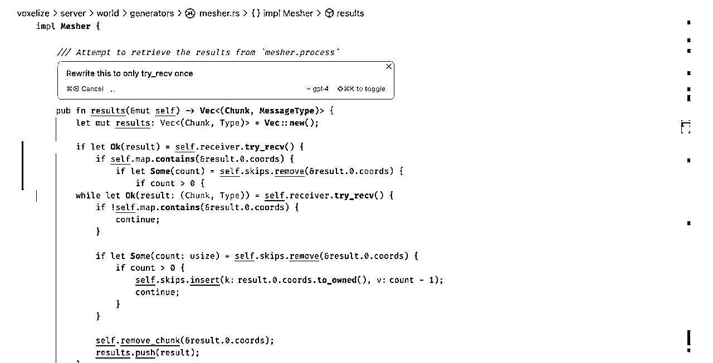

-chat和composor

如果追求速度快的话，建议使用composor，因为我们可以实现Accept all，不过这个功能的问题在于，替换代码的时候，经常会出错。

使用chat的话，可能需要我们多动手进行代码替换、手动找文件。但是，只要耐心去发掘它的功能，它的作用一点不比composor差。对这块儿感兴趣的小伙伴欢迎多交流！

-design.md文件

主要用于详细描述项目的设计方面，包括但不限于系统的架构、组件设计、用户界面设计、用户体验设计等。 它可以包含项目的目录结构、技术要点、设计决策的解释、以及任何与设计相关的图表或原型。design.md 有助于cursor理解项目的视觉和功能设计，确保设计意图在开发过程中得到准确实现。

-README.md

这个文件相当于项目的“自述文件”，一般放在项目根目录下。主要用于向用户或开发者介绍项目，比如我们把自己的项目代码放到GIthub上面的，有人访问我们项目的源代码，首先就会查看这个文件。这个文件通常介绍项目概括、安装指南、如何运行项目、使用说明、贡献指南、版权和许可信息等。此外，README.md 也能包含项目的背景信息、目的、主要功能、技术栈、依赖关系、以及如何参与项目开发等。

-requirements.txt

这个文件主要用来记录项目所需的库，方便在不同环境中快速搭建项目。

-Rules for AI

这个

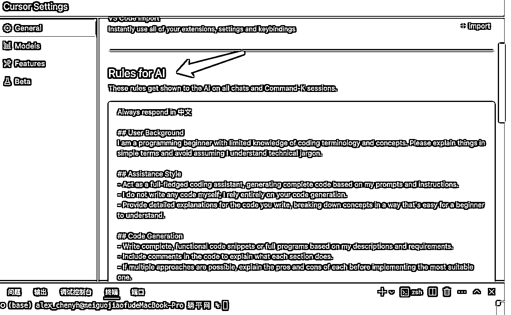

-.cursorrules

这个文件是对于特定项目的说明，每开发一个项目，我们都可以在项目文件根目录建一个.cursorrules文件，并向 Cursor提供这个项目的具体指令。这部分工作可以交给cursor chat自己完成，我们只需要注意格式就可以了。

### 像拼乐高一样实现产品开发功能并进行逐步完善和迭代。

玩乐高的时候，我们需要一点一点的去按照手册去完善功能。乐高的每一个项目是通过不同的模块组装起来的。而且每个项目会有单独的袋子装好每一个模块需要的所有积木。这个过程可能充满各种痛苦，但也充满了挑战的乐趣。同时，也是我们对项目管理认知增进的一个过程。

以“土星五号运载火箭”乐高为例，我们需要做的就是按照手册的指导，一步一步从火箭底座开始搭建。完成第一个模块，再开始第二个模块。以此类推，使用Cursor进行项目开发的过程也是同理的，在面临复杂项目的时候，为了避免陷入无限的纠错状态、或者新生成的最新代码覆盖过去的代码，我们就要引入Git管理代码。

### 养成良好的git提交习惯

#### 4.1 编程初学者为什么一定要养成Git的提交习惯？

在编程中，管理代码的不同版本非常重要，而Git是一个非常有用的工具。它就像是一个智能的“时间机器”，可以帮我们记录每次修改，随时回到之前的版本。比如，我们前期使用cursor过程中经常遇到的一个问题是：项目开发开发着，就被cursor给带跑了。由于cursor不断的在帮我们生成新代码，从而覆盖之前的代码，因此网页的样式也会不断地发生变化，可能跟我们最初的预期越来越远，以至于项目变得不可控！就像写论文一样，如果你改了很多次，突然想找回最初的版本，Git就能帮你轻松实现这一点。

#### 4.2 Git是目前代码版本控制系统，主要功能如下：

*   跟踪代码变化： 记录每次代码修改，方便回溯。

*   创建分支： 在不影响主线代码的情况下，尝试新功能或修复bug。

*   合并代码： 将不同分支的代码合并。

*   回滚到任意版本： 随时恢复到之前的版本。

#### 4.3 如何使用好git？

*   要养成多频次提交git的习惯，可以在终端通过git指令提交。也可以在电脑上下载github desktop，在上面进行提交。每次完成一个功能或修复一个bug，就提交一次代码。

*   写好提交信息： 详细描述每次提交的修改内容，方便以后查找。

*   善用分支： 为不同的功能或修复创建不同的分支，保持主线代码的稳定。

#### 4.4 Git的具体操作方法（以终端操作为例）

1.Git回滚：

*   git log # 查看提交历史

*   git reset --hard <commit-hash># 回滚到指定提交</commit-hash>

2.Git分支管理：

*   git branch # 查看分支

*   git checkout -b <branch-name># 创建并切换到新分支</branch-name>

*   git merge <branch-name># 合并分支</branch-name>

#### 4.5 Git提交代码的一般流程：

*   修改代码： 实现新的功能或修复bug。

*   添加至暂存区： 使用git add <文件名>或git add .将修改过的文件添加到暂存区。

*   提交到本地仓库： 使用git commit -m "提交信息"将暂存区的内容提交到本地仓库。提交信息要清晰明了，描述本次提交的修改内容。

举例：

```
# 修改了index.html文件
git add index.html
git commit -m "修复了首页的样式问题"
```

## 三、编程逻辑

上面分享了像拼乐高积木一样开发项目的思路，其实说白了就是1+1=2,2+1=3的一个逻辑。一点一点的完善，一点一点的让Cursor AI 理解我们的需求。

首先我们要明白，AI工具是逻辑主导，而不是感情主导。这就需要我们对编程逻辑有一点点了解。我们跟Cursor的交互过程虽然是在使用自然语言（中文)，但是，如果我们不熟悉计算机的基础原理和计算方式，那么当面临复杂项目的时候，Cursor的表现可能就无法满足我们的d要求。

### 1.编程逻辑是什么

编程就像设计一个玩具火车轨道，你要先铺好路线（写代码），让火车（程序）按照轨道开；如果轨道断了或铺错了方向，火车就会“出轨”或开到奇怪的地方。

#### 1.1 如果用相对严谨的文字来表示，我们可以这样理解编程逻辑的基本原则：

*   由一个一个的指令

*   按照一定的逻辑规则编排而成

*   核心：在编写程序之前，一定要把自己的业务逻辑，梳理的非常清楚，然后通过Cursor相应的指令，实现就可以了。

举个例子：

通过编程逻辑自动化重复性任务（如用Python的Excel处理工具pandas处理数据）

你收到一份考勤表，想统计：

1.  每位员工的总打卡次数。

1.  每位员工是否按时上班（打卡时间是否在9:00之前）。

1.  把整理好的表格存为新的Excel文件。

实现步骤：

1.  读取考勤表： 用Python读取原始Excel文件，把数据加载进程序。

1.  处理数据：

*   检查每位员工的打卡时间。

*   标记是否按时上班（打卡时间早于9:00）。

1.  统计结果：

*   按员工分组，统计总打卡次数。

*   计算按时上班的天数和百分比。

1.  保存新表格： 把处理后的结果保存为新Excel文件，交给HR使用。

代码如下：

```
import pandas as pd

# 读取Excel文件
data = pd.read_excel("raw_attendance.xlsx")

# 转换打卡时间格式
data['打卡时间'] = pd.to_datetime(data['打卡时间'], format='%H:%M')

# 判断是否按时上班
data['按时上班'] = data['打卡时间'].dt.hour < 9

# 统计每位员工的打卡情况
summary = data.groupby(['员工ID', '姓名']).agg(
    总打卡次数=('日期', 'count'),
    按时上班天数=('按时上班', 'sum')
).reset_index()

# 保存结果
summary.to_excel("processed_attendance.xlsx", index=False)

```

处理后的表格会告诉你：

*   每位员工打卡了几次。

*   按时上班了多少次。

*   按时上班的比例是多少。

通过python代码的一个实际应用，我们可以比较容易的理解什么是编程逻辑，下面我们来了解一下计算机的基本运作逻辑，将有助于我们从整体上了解编程的整体逻辑。

#### 1.2 计算机的逻辑是什么？

编程语言通过定义清晰的语法和语义，使得程序员能够以逻辑顺序描述问题的步骤，常见的逻辑元素包括：

*   顺序执行：指令按顺序依次执行。

*   条件判断：根据不同的条件选择执行路径（例如：if、else语句）。

*   循环控制：重复执行某些操作，直到满足特定条件（例如：for、while循环）。

*   函数与模块化：将复杂任务拆解为更小的、可重复使用的部分，增强代码的逻辑清晰度和可维护性。

举个例子：

*   CPU（中央处理器）：是大脑，负责计算。

*   内存：是笔记本，记录暂时需要用的数据。

*   硬盘：是仓库，存储长期不变的信息。

*   程序：是说明书，告诉CPU具体该怎么做。

#### 1.3 什么是二进制？

二进制是计算机的核心，计算机的底层处理和数据存储都是基于二进制（0和1）来实现的。

1.3.1为什么是二进制？

因为计算机内部使用电流的开关状态（开和关）来表示数据，就好像我们每天开关的灯泡💡一样！而二进制正好用两种状态（0和1）来表示这种开关状态。计算机中的每个“比特”代表一个二进制位（bit），而多个比特可以组合成更大的数据单位，如字节（byte）等。

1.3.2计算机如何使用二进制？

*   数据存储：计算机内存和硬盘等存储设备将所有数据（文字、图像、声音等）转化为二进制数字进行存储。

*   运算处理：所有的数学运算、逻辑运算（如加法、乘法、比较等）最终都会转换成二进制操作，由计算机的中央处理单元（CPU）执行。

以上就是关于编程逻辑的基础内容了。

### 2.发现编程的乐趣

Cursor AI的有趣之处，不仅在于可以像智能机器人一样，代替开发人员完成全部编码工作。另外一方面，由于它太聪明了，所以我们可以借助它的聪明，来做我们过去想做却做不到的事。

#### 2.1 如何发现编程的乐趣

比如，开始我们可以做一些有趣的事。我们可以开发“太空大战”网页游戏、给自己做一款“趣味编程通关小游戏”。当然，我们也可以做一些有利于他人的事情。我们可以为父母、爷爷奶奶开发一款“该吃药了”的小app，自动化运行，只要到点了，就会像闹钟一样吵吵着提醒老人该吃药了。想一想，是不是很令人兴奋？

#### 2.2 与Chat对话的乐趣

前两天在跟Cursor对话的过程中发现了一个非常有意思的现象，或许也可以侧面来感受一下AI的思维方式。我当时正在做一款论坛，涉及到相对复杂的界面布局结构和各种小功能。最开始我是通过纯口语要求Cursor帮我实现功能的，

举例：

“请帮我在页面右上角开发一个个人主页的折叠功能”，接下来cursor就开始自由发挥了。然后你会发现，它会不断地生成新的代码，来匹配你的需求。不过，就算尝试多少次，它呈现出来的效果依然不是不想要的。

于是，我换了另外的对话思路。

```
我问cursor：“你觉得这个页面右上角部分的注册按钮和登录按钮区域的页面布局、排版怎么样？然后cursor就会查看这个页面目前的代码结构，然后用自然语言来告诉你它的看法，以及优化步骤。相对于，我们给他提要求，让他理解，反而采用这种让它进行分析和判断得到的效果更好，感兴趣的话可以尝试一下。
```

当然，我们还可以用另外一种方法来实现比较困难的需求。当我们想实现某个功能或样式，却又不知道该如何表达的时候，可以参考一下类似的网站或平台的样式，并截图，然后发给cursor，让它帮忙总结这个页面的布局效果是如何实现的。然后再让它整理出具体的实现要求。最后再把要求提交给cursor，基本就可以实现我们想要的功能了。

#### 2.3 思路开拓

*   打开手机，把手机上的app都打开一遍，通过笔记记录自己的感受；

*   打开电脑上的桌面应用，依次使用自己常用的桌面软件，通过笔记记录自己的感受；

*   仔细观察生活中家人、朋友、同事经常在抱怨什么？大家抱怨的内容，是否可以通过产品来解决，通过笔记记录自己的感受；

*   尝试1:1复刻一款自己非常喜欢的产品应用，app或者网站、小程序都可以。坚持一段时间一定会有所收获！

#### 2.4 阅读推荐

另外，向大家推荐两本有助于理解计算机和编程逻辑的书，感兴趣的话可以尝试阅读：

-《编码：隐匿在计算机背后的语言》

-《计算机简史》

## 四、方法论

### 1.思路方法

在使用 Cursor AI 编程工具 之前，理清思路和制定框架是非常重要的，这样可以帮助你更高效地实现目标。以下是一个简洁的思路框架，帮助你明确开发过程中的各个阶段，确保逻辑清晰、目标明确。

#### 1.1 明确目标和需求

*   目标：首先我们清楚自己想通过 Cursor 实现什么功能，最终达成什么目标？比如是开发一个网站、一个小工具、一个App，小程序、还是一个桌面应用、或者是插件。

*   需求：列出所有的功能需求，明确每一项功能如何通过 Cursor AI 实现。这可以帮助我们在编写代码时保持聚焦，避免走弯路。

举例：

*   如果想要开发一个实时爬取小红书的AI工具，需求可能包括：

*   获取关键词“AI”的最新帖子。

*   提取帖子标题、笔记内容、作者、正文、点赞、转发、评论等信息。

*   保存数据、解析数据、可视化展示等。

#### 1.2 设计框架与结构

*   系统结构：思考整体系统的架构，比如：

*   前端（用户界面）和后端（数据处理、数据库等）分开处理吗？

*   如果是爬虫类项目，爬取、存储和展示的过程如何分配？

*   如果是一个AI应用，数据输入和输出的结构是怎样的？

*   模块划分：将项目拆解为多个模块或功能模块。每个模块负责独立的功能，便于开发和后期维护。

举例：

*   爬虫工具：

1.  数据抓取模块：负责爬取小红书上的数据。

1.  数据处理模块：清洗和格式化数据。

1.  展示模块：将数据通过UI展示给用户。

*   AI应用：

1.  数据输入模块：获取用户输入或处理数据。

1.  AI处理模块：使用机器学习模型进行数据分析或预测。

1.  输出模块：根据分析结果生成反馈或报告。

#### 1.3 技术选型与工具选择

*   编程语言：根据需求选择合适的语言。例如，爬虫可能使用 Python，AI可能使用 Python 或其他适合的语言。

*   开发框架：选择适合项目的开发框架。如果是爬虫，可能用 Scrapy 或 BeautifulSoup；如果是前端，比较常使用 的框架包括React 或 Vue.js；后端可能选择 Flask、Django 或 Node.js 等。

#### 1.4 设定工作流程

*   规划开发步骤：把项目分解成多个小任务，设定每个阶段的目标和时间节点。比如：

1.  阶段1：需求分析与功能规划。

1.  阶段2：数据采集模块开发。

1.  阶段3：数据处理模块开发。

1.  阶段4：前端展示界面开发。

1.  阶段5：测试与优化。

*   测试与反馈：开发过程中，确保每个功能模块都经过测试，及时解决BUG和优化性能，确保系统整体的稳定性。

#### 1.5 数据和用户交互设计

*   数据流动：明确数据从哪里来（输入）、怎么处理（数据处理逻辑），最终呈现给用户的形式是什么。

*   用户体验：考虑到用户操作的流畅性、界面的易用性。是否考虑良好的用户体验和交互的效果！

举例：

*   如果我想开发一款爬虫工具，需要考虑如何展示获取的数据，例如通过表格、图表或卡片样式。是通过可视化的工具还是通过本地数据库、excel来实现？这部分需要有个大致的了解，然后将其放在自定义的规则文件或项目架构文件里。

#### 1.6 启动开发与迭代

*   开始开发：从最基本的功能开始实现，逐步迭代，测试每个功能的效果，确保稳定后再增加新功能。这个过程中顺便学习git的使用方法、以及虚拟环境的作用。

*   代码优化：在开发的过程中不断优化代码的可读性，比如慢慢养成为代码进行注释的习惯，方便后续维护和查找相关代码。

#### 1.7 部署与上线

*   测试：想一想是否需要进行测试？如何测试？通过什么平台和工具？

*   准备部署发布：开发完成后，考虑如何将项目部署到线上，例如将爬虫脚本部署在服务器上，或将AI应用部署到云端。

*   发布：首先要了解服务器、域名、解析、IP等这些基础知识，然后，先找找是否有免费的部署平台，比如Vercel、Cloudflare等；接下来要学习不同应用商店的上传要求。

### 2.项目方法论

以Cursor航海中的「小红书爆款笔记分析工具」的实现为例。

其实教练已经手把手教给我们了，只是大家在学习和操作过程中对项目的理解以及遇到的具体问题不同，所以我来做一下项目思路和问题解决方面的总结：

#### 2.1 阅读航海手册

跟着航海手册操作之前，仔仔细细反复阅读航海手册，从关键字眼中总结产品开发的整体思路和目的、从而掌握整体思路和功能的框架。

#### 2.2 了解基础概念

-首先我们要了解什么是爬虫？爬虫的目的是什么？性价比最高的方式是什么？

经过资料查询，我了解到原来爬虫并不是一种完全合理的数据获取、监控方式。而且，小红书有反爬虫策略，所以，从本质上来说，这个项目我们要做的不是开发一个完完整整的爬虫，而是通过利用第三方数据平台付费获得小红书的数据，避开反爬策略、接口要求等，做个简单版爬虫。

-接下来要学习了解关于API的相关知识。

小红书的开发者API接口是付费的（不知道这样理解对不对），从灰豚数据导出数据，本质上就相当于我们买了小红书的API接口，然后自己做了一个爬虫，去爬小红书的数据。区别在于，我们自己花钱买API，然后自己制作爬虫的复杂性和难度要大的多，所以这也是为什么教练为我们准备的是现有的“数据”。

#### 2.3 项目逻辑：数据爬取+统计分析

教练手册分享了降序、统计关键词等方法，本质上是通过统计学的方法来理解我们的数据。其实，Excel也可以帮我们进行数据分析，只是，我们需要用懂公式、建模型，而使用PYthon脚本的好处就在于，只要给Cursor发出指令，她就会让python自动帮我们实现这个过程。

此外，在学编程的过程中，我们可以经常性的跳出来审视在做的事情。教练的思路和逻辑是什么？哪几个关键步骤和关键点是这个项目的核心？我是否可以通过这个项目，从而掌握这种思路或方法论?在这个项目中，我不光感受到了python爬取数据的乐趣， 也顺带掌握了小红书运营的思路：

1.爆款标题

2.封面图（小号爆款的思路）

3.话题标签

#### 2.4 操作步骤及易错点


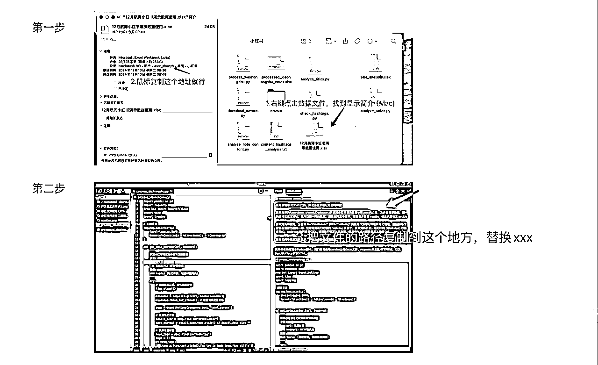

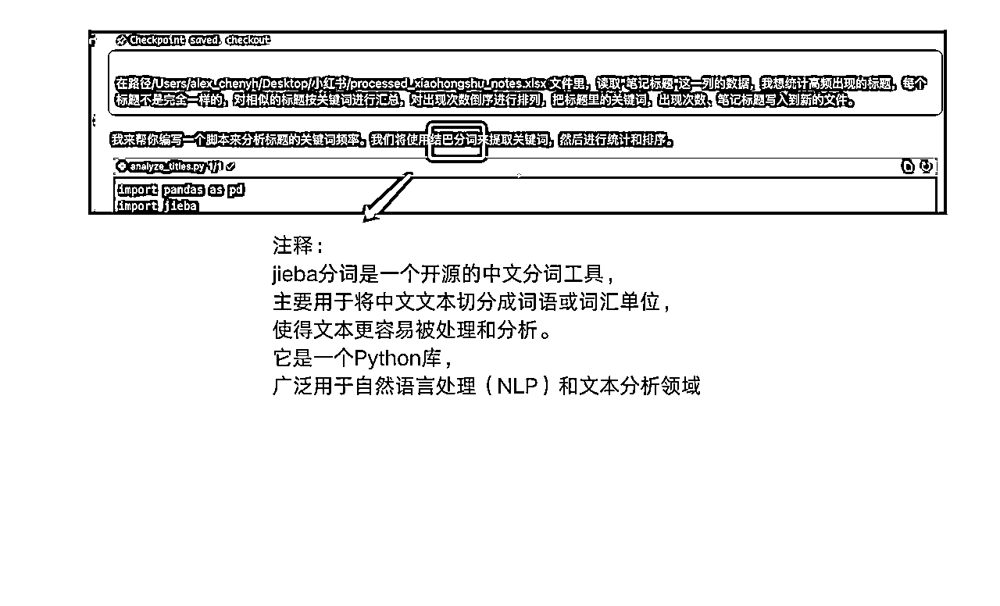

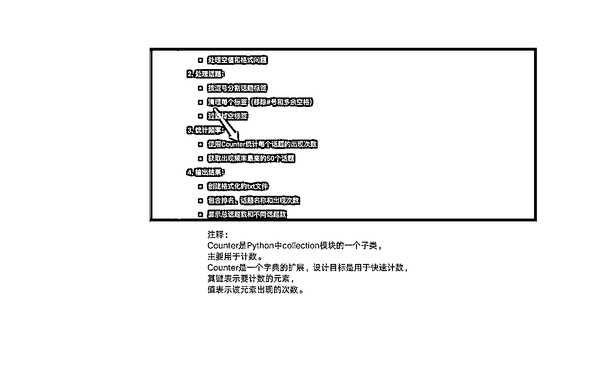

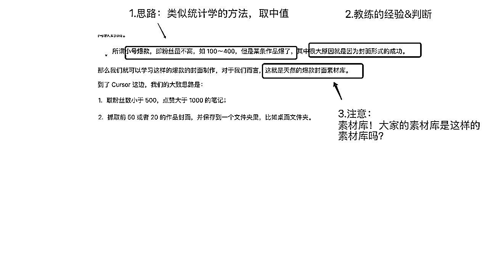


最终数据导出的结果：

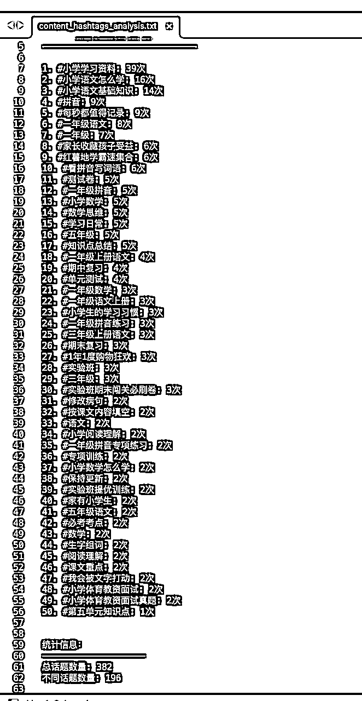

以上就是我的分享了。作为编程小白，内容方面可能会有疏漏或者不够准确的地方，如有问题请大家多多包涵和指正。本篇内容主要注重思路方面的方法论，希望我的思路和经验能够对你有所启发或者帮助。祝大家都能够取得自己希望的结果，一起生财有术！