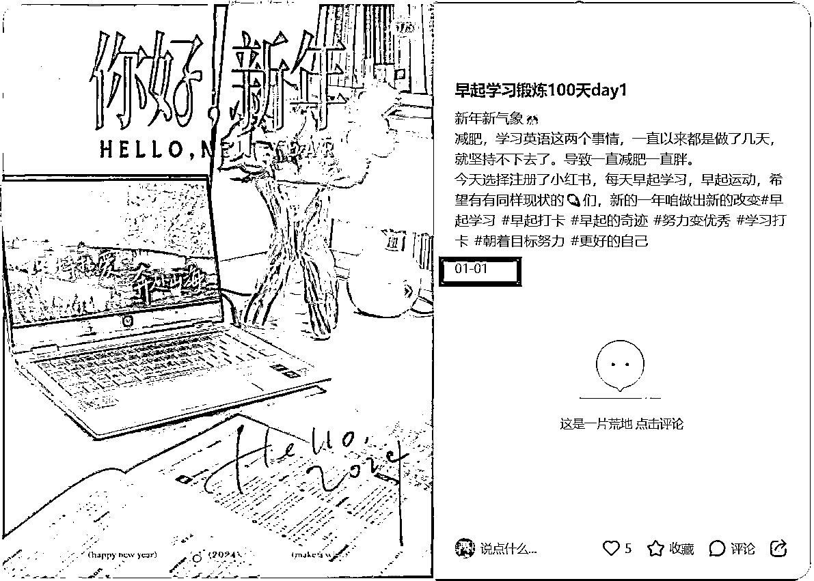

# 小红书虚拟资料引流后的本地商家对接sop

> 来源：[https://jwc04jmpug6.feishu.cn/docx/Qp0RdQdajoZJ4AxZafJcv7e5nFg](https://jwc04jmpug6.feishu.cn/docx/Qp0RdQdajoZJ4AxZafJcv7e5nFg)

大家好，我是巧克力。今年 7月 11 日加入生财的新人。9月份第一次参加【小红书虚拟资料引流】航海项目，做了考研赛道，成为了优秀学员。并且有幸在12月担任航海教练（感谢生财）

今天呢继续来给大家做一些详细的分享，分享贴中没有提到的问题，也欢迎圈友评论区留言，真诚分享，主打利他。

分享内容如下：

1、自媒体探索之路

2、加入生财初体验

3、9月航海之旅

4、给航海学员的建议

# 一、加入生财前的自媒体探索之路

加入生财的圈友，我相信大家只有一个目的，就是为了搞钱。那么躺平肯定是没办法搞钱的，所以我选择了努力。这时候听到最多的就是小红书好多博主都很赚钱。然后2023年底的时候下载了小红书，开始刷，估计过于努力了，当时小红书主页推荐的全是那种励志博主。像什么【早起100天干副业】【重生之。。。】【提前布局2024】这些热门爆款，当时也没有【同行调研的概念】。刷了一个星期的小红书，决定做励志博主，拍视频，拍图文，做带货博主。所以选择了一个特别有意义的时间，发布了第一条小红书。

早起了31天，日更了31条小红书，粉丝不到50人。真是印证了那句话【理想很丰满，现实很骨感】

然后就到寒假，过年回老家。当时又在思考，我老家是丽江的，然后我可以找一个有格调的清吧，直播学习。这个想法因为回家太忙了（家人在丽江开了两个民宿）就被搁置了。

## 专业≠影响力≠能变现

3月份开学后，开始思考自己的副业赛道。选择了自己比较了解的赛道。所以选择了【考研】。但是给我最大的感觉就是知识不值钱，流量才是最值钱的。3月4月是我干的最起劲的一个时间段，恰好也是考研复试阶段。因为平台给了巨大的正向反馈。

一个月时间

抖音/视频号：口播视频37条，直播46场，直播时长146小时

抖音粉丝：1113；单条播放量32万

视频号粉丝：877；单条播放量6万

但是，但是，但是

没有搞到钱。真是【虚假的繁荣啊】

# 二、加入生财初体验

### 非常像成功学的名字

【聂枭】为啥那么像成功学的名字，我还是选择了加入呢？

在加入前我自己是完全没有了解过生财的，生财的公众号啊，视频号啊，什么都没看过，

为啥会加入呢，一个是因为我一个比较好的朋友给我说她最近在参加生财的体验营，和我说了一下。另一个就是我男朋友，给我发了一份生财出品的资料，名字好像叫《人生亏钱指南》。然后我朋友就给我说可以加入学习一下，因为她也知道我在研究自媒体。然后果断加入。然后下载了知识星球。

### 琳琅满目的资讯

哇塞，开了眼了。全都是干自媒体的各种资讯，就像以前的论坛一样，全都是。当时被【风向标】这个名字吸引了，站在风口上，猪都会飞，觉得搞钱肯定要走在最前面，结果一看【啥也不是】，没有一个是自己能参与的。

### 一堆实操项目

第二天赶紧就问【鱼丸】航海在哪里看，我就去看了网页版，看了往期的航海手册。确实是保姆级教学啊。但是也只是停留在感慨上。

因为马上暑假了嘛，之前的热情也被消耗差不多了。刚好假期自己也养精蓄锐了。

# 三、参加9月航海

9月报名参加了【小红书虚拟资料引流】航海

截止到发帖，三个账号业绩20w，分成2w+。

### 要搞钱，就要先知道变现方式

看到这里的宝子，应该也知道了我之前的探索，就是因为不知道有哪些变现方式，就开始各种发笔记，发视频。导致小半年过去了，没有变现。

### 同行调研变现方式

1.  单纯卖资料

1.  送资料+推荐网课

1.  送资料+各种社群服务

1.  送资料+本地机构推荐

为啥强调了本地机构，最开始我也推了线上机构，因为客户问线上机构的也很多，为了实现转化，我就去对接了很多线上机构，但是数据反馈，推荐100多个考研人，一个成交的都没有。有天我和大学校友吃饭，聊起考研往事，她说自己是在本科学校附近的考研机构上课，她觉得效果不错，就交钱去报名了，之后她还推荐了几个小姐妹去学习，我瞬间捕捉到，我可以跟线下机构去合作，给他们推荐客户。

### 本地商家对接流程（重点介绍）

1.  确定赛道（看参加考试的人数来确定市场需求量，从而确定赛道）

1.  美团搜索

因为我是做考研的嘛，就搜索了考研，自习室等关键词，出来了很多机构。这里除了考研，其实考公、留学、k12等都可以参考这个方法哦。

出来的商家还是非常多的。

如果输入关键词，出来的商家不多，可以在美团更换位置，把位置定位到学校附近，又可以搜出其他品牌的考研机构。

这样我们就可以有一个商家名单了，还可以看看店铺评论区和评分以及商家沟通的窗口。

1.  私信商家

美团后台可以私信商家。但是私信的适合需要注意话术，切忌长篇大论，言简意赅就好。商家客服只是运营人员，咱们沟通合作事宜，还是要找具体负责人进行沟通。以下是一个错误示范和一个正确示范。

### 商家合作注意事项

在这个阶段呢，小白很容易踩坑（就是被忽悠的返点很低）

洽谈前的准备工作

1、可以做一个沟通的提纲

*   企业规模（能服务的范围，很多机构都有很多分校的，规模越大跑路风险越低）

*   企业特色（相较于同行友商，咱们有什么优势？比如特色课程、校区环境、特色服务、校企合作、店铺位置交通便利等）

*   企业承接流量的能力（这个非常关键，咱们属于搞流量的，流量转化能力差，就意味着咱赚不到钱）

*   企业主推的产品以及主推的老师（做好笔记或者让企业提供）

*   结算周期及方式（大部分企业都会要求提供对公账户开具发票，如果不能提供的相应的返点会降低）

*   潜在客户对接方式（一般是建微信群，在群内推送客户名片，总结客户情况建议让企业做一个反馈的在线表格）

以上是必须要了解到的内容，其他方面就看这个企业是怎么谈合作的啦。越详细越好。

2、沟通的时候，关键指标的参考

1.  合作模式（合作模式不一样返点比例也不一样）

*   引流（只给数据，不负责成交）

*   引流+筛选（只给有报班想法的数据）

*   引流+成交（个人成交，机构只管收费及服务）

1.  合作费用

*   只负责引流（一般就是返点，大概在10-20%）

*   引流+筛选（意向客户线索费（各个行业不一样一般在10-100之间），返点在10-20%)

*   引流+成交（前期不建议这样合作，咱们可以把时间精力放在做流量上，转化交给专业的人。如果要自己转化可以朝着30-50%去沟通）

1.  结算周期

单笔结算，

按月结算

### 小红书爆款打造

1.  基本功不能丢

调研同行=打造爆款=变现路径

1.  为什么要手动刷小红书

*   养号：降低之后发笔记，账号有异常值显示

*   梳理关键词：能搜到最新的笔记，避免进入信息茧房

*   找对标：对标不是单纯的赞藏评论，还要看带的话题、发布时间、博主主页等

*   训练算法：让系统给自己的账号更快的打好清晰的标签（这个非常重要）

1.  为什么不建议用ai洗稿

如果我们只是简单的复制粘贴用ai洗稿，那么大概率出来的文案都不会很好，那么也不会让笔记成为爆款。想用好AI写作，首先得学会如何写提示词，那还不如自己输出有血有肉的口水话呢。

我用小红书的初衷就是，我发现网购爱东西，评论区很多刷评论的，真的是一眼假，然后那个时候小红书都还是素人博主分享，写的都还很口水话，我就觉得超级真实。

【真诚是必杀技】

1.  不要陷在爆款的执念中，有私信的笔记就是好笔记

1.  虚拟资料引流号的几种表现形式

*   资料测评笔记

*   焦虑封面+资料内容

*   实拍资料

*   资料截图

1.  找到爆款笔记一定要分析主页

好的对标账号，版式一定是统一的。

这个账号不同时期换了不少于三个排版方式，某个版式数据好了，就延用。使用时间长了，数据不好了，就换下一个版式。

【做自媒体，做的就是数据】

# 四、给航海学员的一些建议

1.  做笔记的节奏：头天做好第二天早上发的笔记

1.  做笔记的工具：在熟不在多。WPS 、搞定、美图秀秀

1.  转化的话术：能判断客户意向度的话术就是好话术

1.  好笔记：有私信的笔记就是好笔记（不论浏览量多少，赞藏多少）

# 五、总结

我从来没想过自己能独立赚钱，更没想过自己能够一个月赚1w，但这切切实实发生在我身上。我很感谢生财，在赚钱的路上，成功指引我前进。也感谢生财的官方人员萌虎，他鼓励我开直播做分享，让我感到我的经验对新人如此受用。我相信未来与生财一起，会越走越顺