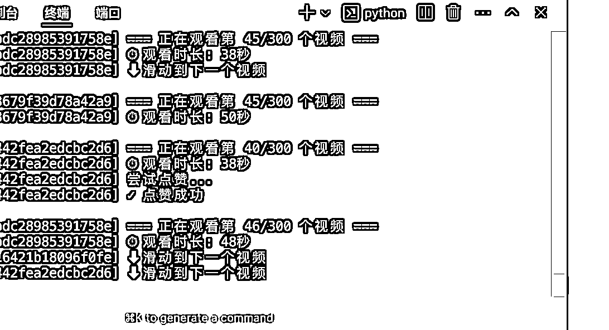
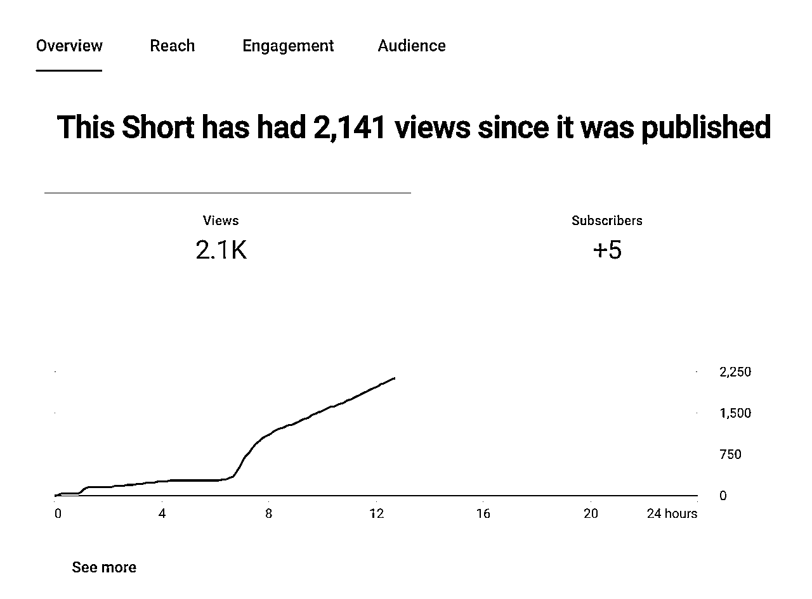
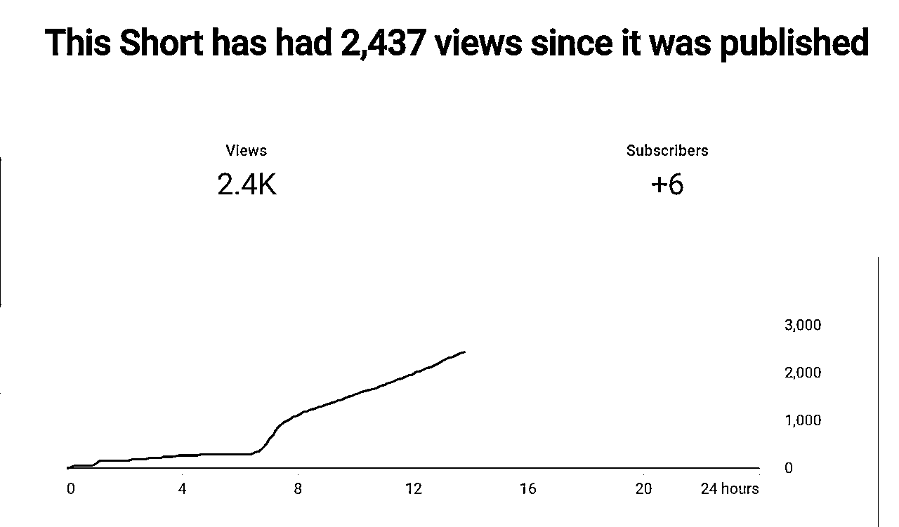
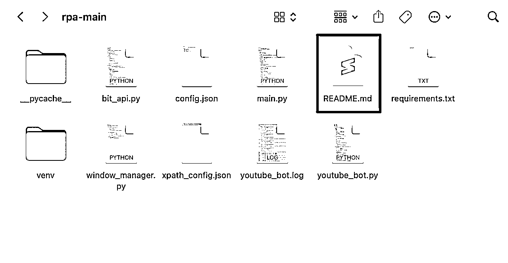
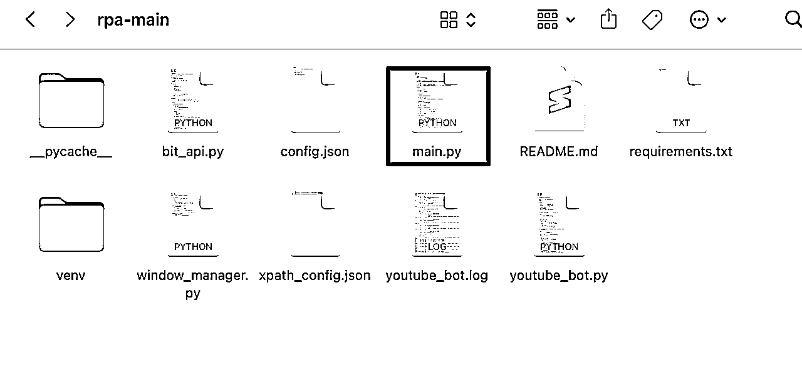
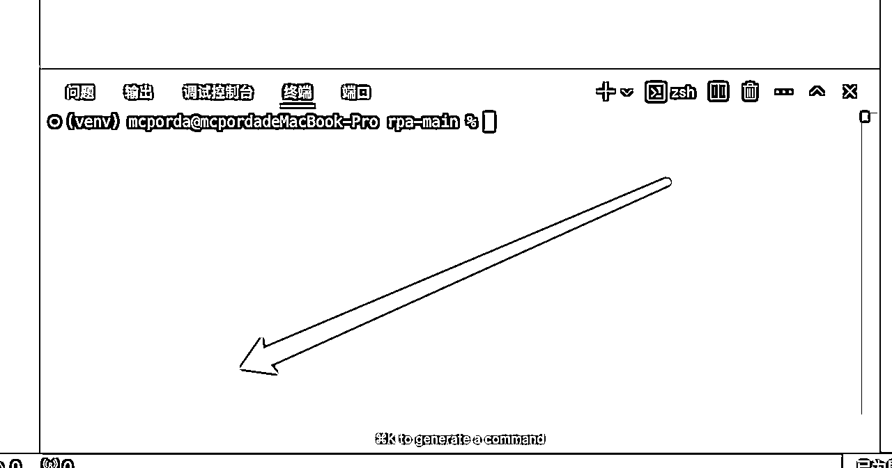

# YouTube Shorts项目实操：自动养号工具及航海历程分享

> 来源：[https://ocn3v0tggugm.feishu.cn/docx/MuHFd18GroC5vox8Cp8cGOtDnNg](https://ocn3v0tggugm.feishu.cn/docx/MuHFd18GroC5vox8Cp8cGOtDnNg)

## 前言

1.  最近喜欢的几句话.

*   赚钱的多少永远和你克服的困难大小成正比.

*   人挣不到自身认知以外的钱.

*   事实证明丑的东西有人喜欢,笨的同理.

*   一个人是人还是神,取决于你跟他之间的距离.

1.  背景介绍:

*   感谢 方波妮教练的细心解答,耐心指导和邀请,本着授人以鱼不如授人以渔的生财理念,我来分享下我的心路历程,和用到的一些工具,让我们一起生财有术!

1.  注意事项

*   善用AI,会用AI,用好AI:

*   工具只是工具,并不能代替人创造价值

*   本案例不会讲怎么制作,可以观看本期航海的Cursor篇,学习Cursor相关的技巧：

https://scys.com/activity/landing?id=4668&tabIndex=0

*   要搭配比特浏览器使用,你要手动在比特浏览器中设置好前置的登录,包括代理等内容,也就是打开就能看到你的号(保存了Cookie).www.bitbrowser.cn

*   比特浏览器的操作可以查看八块腹肌且永远不会塌房的马哥,@老馬🐎内容出海的相关Youtube Shorts航海录播.https://scys.com/activity/documents?id=4660&index=1

*   可以让Cursor来调用比特API全自动,可自行摸索.

*   本文旨在提供思路,和记录一些心路历程,希望各位可以合理利用此项目,早日开通YPP.

*   本项目在Mac下测试过,windows下测试也没有问题,当然你可以问Cursor,让他一键运行,有问题自动修复.

*   没有打包成软件的原因:

*   你可以在此项目上构建你需要的其他功能

*   习惯了用命令行,其实比看界面方便.

1.  下载打包文件工具见文末

## 项目实操

### 一、效果展示:




* * *

*   当然有人好奇这样的批量的养号能不能用,是否养得起来,这是10个小时前一个新号发布的第一条视频的观看数据:





### 二、项目工具：自动养号工具

1.  工具功能简介

*   自动化点赞与自动订阅：节省时间，提高运营效率。

*   自动化刷视频

1.  工具的使用场景

*   批量运营：适合多频道运行管理。

*   你可以在这个项目上二次开发,完善你想要的所有功能.

### 三、文件说明



*   需要知道两个文件的含义:

*   README.md:这里有项目的完整介绍,和每个参数的意义,

*   可以细看关于config.json文件的设置参数对应的含义:

```
```json
{
    "windows": [  // 浏览器窗口配置
        {
            "browser_id": "浏览器ID"  // 每个窗口的唯一标识
        }
    ],
    "settings": {
        "window_width": 400,        // 窗口宽度（像素）
        "window_height": 600,       // 窗口高度（像素）
        "watch_time_min": 5,        // 最短观看时间（秒）
        "watch_time_max": 30,       // 最长观看时间（秒）
        "like_probability": 0.3,    // 点赞概率,30%
        "subscribe_probability": 0.2,// 订阅概率,20%
        "scroll_count": 50          // 观看视频数量
    }
}
```

### 窗口大小设置
- `window_width`: 设置浏览器窗口和视口的宽度
- `window_height`: 设置浏览器窗口和视口的高度
- 建议设置合适的窗口大小以获得最佳的Shorts观看体验
- 推荐尺寸：
  * 手机视图：400x600 
  * 平板视图：600x800
  * 桌面视图：800x1000
```

*   也可以不看:

*   Cursor中直接对cursor提问:

*   提示词: @README.md 解读项目,他会指导你一步一步做.

*   cong.json中按照上述代码块中描述,做你想要的修改,你需要注意的是窗口不要过小,否则会因为找不到组件而无法触发操作.

### 四、browser_id（浏览器 ID）的获取

#### 打开比特浏览器,复制框内id:


#### 2.打开config.json 文件 ,把刚才复制的 ID 填入对应的XXXXXXXX,填了几个就会打开几个自动化窗口:

（需要养几个号就打开多少个窗口）


```
{
    "windows": [
        {
            "browser_id": "XXXXXXXXXXXXXXXXXXXXXXXXXXXXXXX"
        },
        {
            "browser_id": "XXXXXXXXXXXXXXXXXXXXXXXXXXXXXX"
        },
        {
            "browser_id": "XXXXXXXXXXXXXXXXXXXXXXXXXXXXXXX"
        },
        {
            "browser_id": "XXXXXXXXXXXXXXXXXXXXXXXXXXXXXXXX"
        },
        {
            "browser_id": "XXXXXXXXXXXXXXXXXXXXXXXXXXXXXXX"
        },
        {
            "browser_id": "XXXXXXXXXXXXXXXXXXXXXXXXXXXXX"
        },
        {
            "browser_id": "XXXXXXXXXXXXXXXXXXXXXXXXXXXXXX"
        },
        {
            "browser_id": "XXXXXXXXXXXXXXXXXXXXXXXXXXXX"
        }
    ],
    "settings": {
        "window_width": 400,
        "window_height": 600,
        "watch_time_min": 5,
        "watch_time_max": 60,
        "like_probability": 0.1,
        "subscribe_probability": 0.05,
        "scroll_count": 300  (这个是刷多少条停止)
    }
} 
```

### 五、如何运行:

*   会python的应该不会看到这里,所以我们采用最简单的方法.

*   cursor中agent模式下输入提示词: ""虚拟环境下运行此项目""即可,你也可以@main 文件来增加容错,虚拟环境的原因是不会干扰到你原来的python环境,也可以直接运行main.py文件,点击submit,剩下的交给cursor.


*   关于cursor的使用请查看:https://scys.com/view/docx/YIvBdL38ConF89xdBvAckZBPn5e



### 六、关于软件

*   程序采用的是模拟点击控件触发的逻辑操作,完全模拟人手操作,所以:

*   有时候会返回之前的刷过的视频,是正常的,拟人操作,再看看前一条

*   暂时没时间添加评论,留给各位当作业,我会在下方给出方法

*   观看时长:

*   每一个视频都不一样,全随机

*   互动:

*   订阅过的不会再触发订阅,建议设置页面为英文(中文也行,其他语言必会再次触发订阅,会卡主)

*   互动频率可在config中自行设置,

*   中途如何关闭:

*   点击到日志窗口,后按Control + C(手动停止会报错是正常的,不用管),所有已打开比特浏览器窗口会自动关闭:



*   电脑能否同时干别的:

*   Mac下本身就有多个桌面(四个指头上划触控板),你可在其余页面继续你的工作.

*   windows不清楚,需要你自行测试.

*   可否定时:

*   直接让cursor定时运行main.py文件即可

### 七、扩展(待续)

可否一直使用:

1.  那必须不能,只要油管更新了控件路径,就必定会失效.

#### 1.你要了解Xpath:先会用吧,这一块我做的模块化,后续在补充这个板块内容,这个文件是xpath_config.json.

```
{
    "selectors": {
        "like_button": "//*[@id=\"like-button\"]/yt-button-shape/label/button/yt-touch-feedback-shape/div",
        "subscribe_button": "//*[@id=\"metapanel\"]/yt-reel-metapanel-view-model/div/yt-reel-channel-bar-view-model/div/yt-subscribe-button-view-model/yt-animated-action/div/div/button/yt-touch-feedback-shape/div/div",
        "subscribe_text": "//*[@id=\"metapanel\"]/yt-reel-metapanel-view-model/div[1]/yt-reel-channel-bar-view-model/div[1]/yt-subscribe-button-view-model/yt-animated-action/div/div/button/div/text()"
    }
} 
```

#### 2.如果你不想了解,那你看这是啥:


这是我写的一个Chrome浏览器插件,按下快捷键,点击选择你要的元素,即可快速复制xpath,粘贴给Cursor说清楚这是哪个功能的xpath,它会自动添加你要的功能.

### 八、待更新

*   后续想到什么再补.

### 九、打包文件下载链接

链接：https://pan.quark.cn/s/4d734d76fafc

补档：https://pan.quark.cn/s/43872fdad098