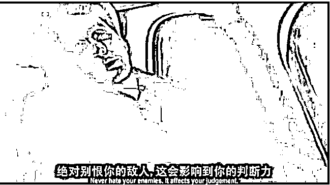
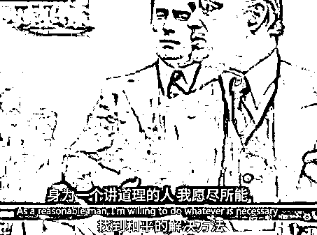
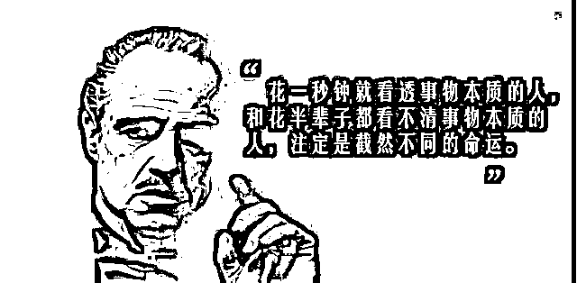
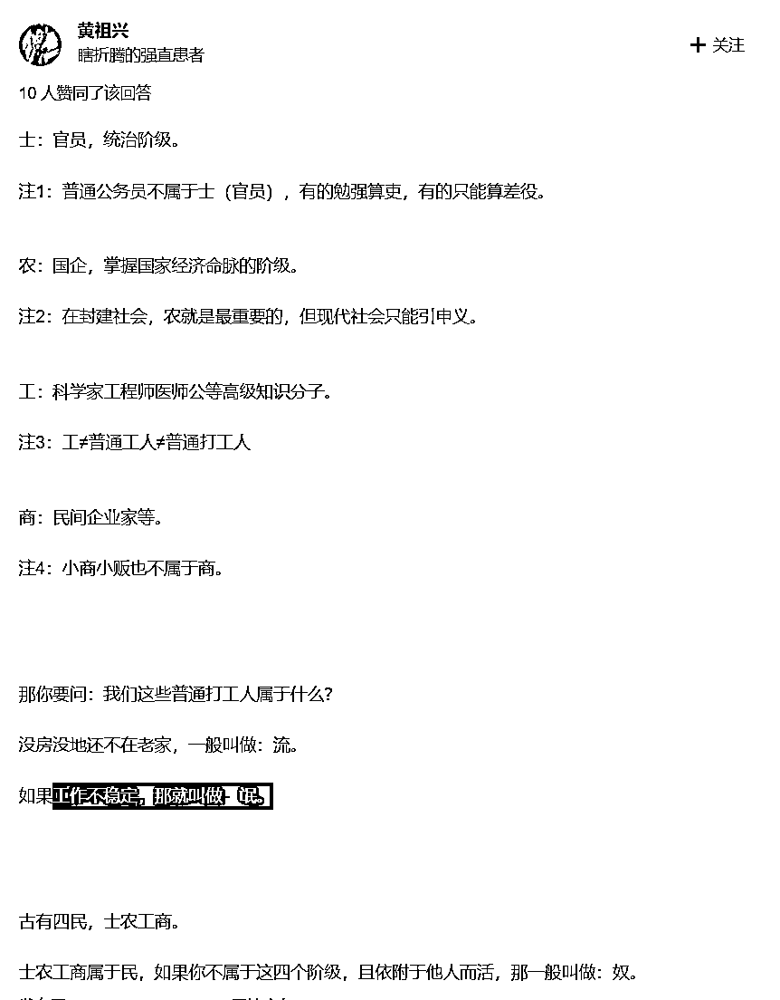

# 用修行的方式聊赚钱---普通人这辈子能年入100w已经是天花板了（上下篇合集）

> 来源：[https://unpke5o6so.feishu.cn/docx/SHCgd7UVCoon9dx6zQUcozjineb](https://unpke5o6so.feishu.cn/docx/SHCgd7UVCoon9dx6zQUcozjineb)

做人，首先要专心，心无旁骛，才能再谈其他。

4门12重楼是徐公子《神游》的境界划分，我用现实中的个人收入一一对应，可以帮助大家更好明了自己目前的状态，去除浮躁，得以修（赚）行（钱）。

第一重门

1内照=年收入20W

2炼形=年收入50W

3大药=年收入100W

第二重门

4灵丹=年收入1000W

5还转=年收入10000W

6金汤=年收入10000W

第三重门

7胎动=年收入100000W

8婴儿（脱胎换骨）=年收入1000000W

9阳神=年收入10000000W

第四重门

10=无穷大

11忘情

12元始

顺便再引用另外一个体系

第一重门

1内照=xx

2炼形=xx

3大药=副c

第二重门

4灵丹=正c

5还转=副t

6金汤=正t

没有个人天资和特大机缘，普通人能到金汤境，年入百万，正c已经到天花板了。接下来我来一一分析

# 上篇

## 第一重门

1内照

首先要认清自己，认识到自己的优缺点，知道自己的欲望，明了自己的本心～

此处会遇色欲天劫，无分好人坏人，认清真我境界自成。

从个人收入分析：只要你在一个方面安下心去学习，把一个事情的各个方面都有所涉猎，年入20W并不是难事。

修行分两种人，一种偏保守，境界到了也不突破，换一种方式在修炼这个境界，在一个境界停留很久，就是生活体验派。

一种偏激进，追求快速的进步，境界一到立马突破，是追名逐利的现实派。

生活体验派在内照境界非常扎实。我一个朋友她是国贸专业，考了初级会计证，律师资格证，教师资格证以及英语6级并且可以跟老外正常交流的口语水平，她就跟我说她不着急赚钱，多体验各种工作所带来的乐趣。有朝一日她想赚钱了，一念便可入第二重境界。

2炼形

能够正视外在的流言蜚语，能够把最普通的批评、建议听下去，强健的不是自己的身体，而是心灵。

这一层要受“身受劫”，可能会遭到诟病，可能会遭到批评，但是，要让这些慢慢消失，不影响自己。

在地师里面，有句话说得很好：不因言废行，因人废事。

很多人可能就停留在这一个境界了，虽然认清了自己，但是遇到人的批评建议或者流言蜚语，就开始定心不稳，一辈子忙于身受劫，继续不下去了。

PS:这一层，同样没有“好人坏人”之分。

从个人收入分析：年入20W只要在一个事情上各个方面做到70就可以达成，但是想要50W,就要把这个事情的方方面面做到90分以上。

并且50W靠一己之力是不能做到的，需要找朋友、员工帮助自己完成部分事情，涉及到人与人之间的相处问题，做事必然导致矛盾，偏见，有执着心就会被这些事情牵绊、烦扰，轻则放任这些问题，卡在20到50w的收入间，重则项目倒闭，收入重新跌回0到20W之间。

认清自己不难，但是难在认清别人的想法，认清人与人之间的不同，并兼容别人的观点，让别人为自己所用。

《金刚经》有句话：应无所住，而生其心。

而什么才是无住呢?首先必须无相，而后还需无见。无相是不执着，无见是不分别。

不执着心就清静，不分别心就平等。而清静平等的心，就是无住心，此心能生般若波罗蜜，能断像金刚一样坚固的各种“执见”烦恼。

人话就是不要执着于别人的看法，不区别对待别人好坏的意见，当你用平常心接受别人的批评后，便能入第三重境界。

3大药

一个人世界观的雏形的象征。一个人能看清自己，能在别人的言语和看法中仍然坚持自己的本心，接下来就要纠正自己心的偏差，使自己身心合一。

说起来很复杂，但其实也很简单，有了前面的铺垫，也就是看清自己，坚持自己，然后能够以自己的本心来控制自己的言行。

大药的境界就是自己所说的，所做的，要发自本心，做到身心合一。自己的心有偏差，或是行有偏差，都无法达到，有个说法叫做“言不由衷”，说的就是这种情况，大多数人就卡在了这一层境界上而无法寸进。

这一层仍然没有好坏之分，讲究的不过是形成一个自我。与之相对应的是“魔境劫”，魔境就是心的乱象，不仅要在安静的时候可以看到本心，更要在纷繁的乱象中辨认出自己的本心，并且遵从本心，也就是要发自内心地为人处世。做不到这一点，之后的都是虚妄。

魔镜天劫：吸取其中的教训，来形成自己的看法和经验，但是你所看到的事物，所经历的事情却并不是完全纯净的，夹杂着各种各样的乱象，如果为其所惑，自己的世界观就会摇摆不定或者受其影响导致心出现偏差，只有坚守自己本心不失，能去芜存菁地从这些经历中看到其本质，才能度过这个阶段从而形成自己的“灵丹”。

从个人收入分析：当你把自己的事情都做到极致之后，就不是单纯埋头做事情了，还要把自己高档的服务向别人出售，你要说服别人为什么选择你的服务并且为之支付高昂的价格。

而你自己也需要言行合一，实实在在的跟别人说自己能服务的范围，并且踏踏实实的把答应的事情都做好，让客户满意。

这时候公司的规模也不小了，如何让合伙人、员工们都为自己所用，都对自己满意，虽然炼形的时候已经管理他人，处理关系的经验，但是公司到这一规模，事情的程度更加复杂，要平衡的关系更多，如何让所有人都满意？

你该如何便如何，喜欢的人自然喜欢你，不喜欢的人也可以理解你。遵从本心，发自内心地为人处世，到此便入第4重境界。

由于我的年收入远未到达这里，所说的都是自己的片面之言，大家自己体会便可，内容如果有幸入高人法眼，希望多多指教。

## 第二重门

4灵丹

从“本心”变成了自己的世界观，也即“灵丹”。而在这个阶段，本心和自己的世界观融为一体，也就是说，没有了单独的“自我”，有的只是这个“自我”与自己世界观融于一体的东西，当然也可以理解为提升后的“自我”，在这种状态下，你审视外物时，你的观点就自然而然都是发自你形成的那一套世界观。

5还转

还转的功夫，就是在自己的世界观形成以后，在今后的为人处世中，就以它来审视人、事、物，以达到坐卧不失的境界。一个人形成自己的世界观以后，世界在他眼里与之前的发自本心的眼光来看相比，就会是另一种样子。

6金汤

是为36洞天中的不堕之境，境成之后可称真人，为人处世达到境界之后，就会获得相应的能力，这种能力可以让人做到更多的事情

此处有妄心天劫：佛教中，如来说修行要去‘众生相’……可是话又说回来，人本来就是众生之一，而且与其他众生相比，所欲无限。又怎么去呢？不如不去，在妄中经历！

在自己有能力做自己想做的时候，看到什么才是自己想做的，什么是自己的本心？一个人由于之前的境界会获得权力，而获得权力之后就有了实现自己妄心的机会，而从这里开始，就有本心好和本心不好之分了，虽然这对度过这个关卡，仍旧没有影响。面对妄心劫，有两种方式破妄而出。

第一种是以真心破妄境，这一种适合的是本心是“好”的那种人，就是自己的妄境本来就是属于比较好的方面或者十分单纯的妄心，举个极端的例子，像风君子，当时他的妄心就是想牵师父的手，所以一下就破妄而出了，因为他的师父就正在牵着他。

但是常人的妄心并非如此简单，比如，有的人想很有钱，有的人想家人幸福，有的人想占有很多女人，甚至有的人想杀光所有与己不合的人，等等等等。为什么很多人到临死之前突然大彻大悟，让人感觉做人境界高了一层呢？

因为之前都为妄心所困，直到最后一刻，审视自己的所作所为，突然就看明白自己的妄心所在，知道怎么面对了，这是洗去妄心的一个例子，再比如"放下屠刀立地成佛"，这个话，描述的就是一种洗去妄心的状态。

徐公子在书中设置了妄境，就是不管妄境多久，到实境总是一瞬，类似于黄粱美梦的感觉，你可以在这里做任何事，但是做了几十年之后慢慢的妄心就淡了，这个过程就是洗去妄心回归本心的过程。顺便提一下，黄粱美梦之后那书生若修道有成，也是此机缘助他破妄。

第二种是以妄心合实境，就是以自己的妄心，来应用到现实当中。举个例子可能会比较好理解一点：希特勒。他的妄心是什么？就是他的血统论所阐述的那样。而有这种妄心的人何止千万，他只是一个有机会并且得到实现他这种妄心的人。他的破妄方式，就是用妄心合实境。

这个选择，将影响以后的修炼，或者说是以后的做人方式和结局。

但是，大家发现没有，不管是哪种方式，对于达到做人的更高境界来说并无不同，选择不同的方式影响的只是之后的事情。

而在这里，破除妄心的方式就显而易见了：在妄境中和在实境中言行合一。妄心其实也就是本心所发，但是有的人会最终看到自己的本心，在长久思考或者顿悟之下，可以认识到自己真正想做的事。

有的人则看不到自己的本心，或者以妄心代替了自己的本心，并以此为依据来为人处世。当然也有的人，本来想做的就是坏事，他就照着本心做，那他也是找到自己的本心了。

这些不同的情况，只要处于其中的人能坚持自己，就是前面说的认识的自己，都可以达到破妄的境界。认识自己而后坚持不变，最终形成自己的一套为人处世的方式，并且不管妄境实境，发自本心地依照自己的方式来为人、做事，这就达到了不堕，也就是“金汤”。

到达此境界的人，有完善的世界观和方法论，不管在什么情况下，都可以坚持发自自己世界观的看法和做法，通俗点说，就是如果给你重来一次的机会，你不会有其他的选择。

后面还有的境界，便已高不可攀，不是我等凡人可以窥探！

# 下篇

主题：境界=知+行+修为+心境

大纲结构

起：通过两年时间的沉淀，我对自己之前提出的理论有了全新的理解

承：1两年的饭也不是白吃的

2人教人教不会，事教人一教就会

那说说我都具体悟出了些什么呢？修行分为十二个境界，那又如何区分每个境界之间的差距呢？

转：境界=知+行+修为+心境

合：经过这一遭，也算实现曾经一年顶十年的目标。不仅外表比之前沧桑不少，心态成熟了许多。

起：通过创业两年时间的沉淀，我对自己之前提出的理论有了全新的理解

两年前我写了《普通人这辈子能年入100w已经是天花板》上篇，收获了还不错的数据反馈，很惭愧中间由于创业和偷懒断更了良久，但是这两年我也没有闲着，经过两年创业的磨炼和时间的沉淀，我对自己之前提出的境界理论有了新的理解，所以写此下篇，以对上篇的理论的完善。

这两年的饭也不是白吃的，更少不了一路下来踩过的坑，如果两年前写那篇文章的时候我只有认知，其他方面都不足的话，那这两年的线下创业，如今我不会跟以前一样站到舞台上就紧张，张嘴也说不出去几句分享的话；我可以站在台上平静的给他人分享，也乐于参与一下讨论表达自己的看法。

更重要的一点事，明白了一个常识性的道理：人教人教不会，事教人一教就会。2月做失败的一个项目，这个项目上我就犯了“人教人教不会”的错误，每天苦口婆心告诉她账号目前存在哪些问题，告诉她解决方法，最后还是给我一坨shi。

后来我反思对她说这些话到底有没有用？有用，但是站在她的角度，有用但是她不一定要为此去做啊。

能解决的方法就藏在第二句里，及时跟员工进行沟通，充分讨论项目本身，这个项目你认可，咱们双方就都付出足够的努力，你琢磨项目怎么解决问题快速推进，我根据你的需要不断匹配资源配合，让每个人能发挥自己的主观能动性去解决问题，而不是当一个妈妈桑做项目。（这是公司，不是学校）

事情是双方都需要付出努力与自我责任，如果单方面一定要立刻停止，不然不仅浪费了自己的时间，还浪费公司资源。

诸如此类的思考和反省，在这两年的创业中，该走的弯路，该撞的南墙，该吃的苦，一个都没有落下都吃了或者正在吃，虽然眼下很痛苦，不过我的心态在变好这些苦都是自己生命必不可少的，年轻早点吃掉也挺好。

那就进入正题，说说完善的理论有了哪些吧？修行分为十二个境界，那又如何区分每个境界之间的差距呢？

境界里又包含了4个方面：知+行+修为+心境

什么是知？其实有很多书，很多道理要看。不过中国人的思维逻辑，通常我们可以把知分为5个阶段，我们管它叫“五理”。它是一个塔型的结构，最顶层的“理”我们管它叫天理，第二层的理叫伦理，第三层叫学理，第四层叫法理，第五层叫治理。

天理:由神来叙述或者构成的，在中国有没有关于神的著作呢?有的，就是那部《易经》，它讲的是天理。

伦理:是圣人之说，最经典的著作就是《论语》。中国很神奇，在天理与伦理之间有一部著作，它叫《道德经》，它既是天理又是伦理。北宋的赵匡胤的宰相，他说半部论语治天下，说的就是伦理，因为没有伦理就没有制定法理的逻辑基础，半部论语不是说论语上有治理天下的道理，而是论语中的伦理构成了大宋律法的逻辑基础。伦理非常重要，一个伟大的民族，一定会有一整套的伦理体系这是圣人之说。

在此之后是学理，中国的学理著作汗牛充栋，类似于像管子像《盐铁论》，中国在学理上这5000年，很牛很牛，上层天文下层地理中层社会各种各样学理方面的知识太多了我就不--列举了。

法理方面的东西我们也很厉害，因为从大秦律一直到大清律，中国古代关于法理就是非常的系统的成体系的。

治理方面最经典的代表就是《资治通鉴》，我们中国好多人在治理国家的时候都会读它，治理的成效比较好的政策例如一条鞭法。所以神管天理，圣人管伦理，贤者叙述学理，政治家处理法理，能臣处理治理。

行：德行+执行。

《易经》有言：“德不配位，必有灾殃。”一个人的德行若配不上自己的地位，那么这个人必然会有灾难。这是从今年合作的一家公司得到的感悟，据说就快要倒闭了，因为项目接触的比较深的，当时和这位老板吃饭，他也跟我分享了他一路的成长史，通过一顿饭就像快速翻阅了一本书一样，当时只是记下了，再半年半年当他公司遭遇危机的时候，这个书给了我不少启发。

他毕业后是进入大厂工作了5年，后来有人投资他100w做一个项目，当时在大平台能力已经积累的差不多并且还有人投资了，就直接出来干了。虽然这个项目砸了，但是紧接着在疫情来的时候，用了这次项目的积累，一下子就把新公司干起来了，前两年一度是业内有名的公司。

其实从现在来看，以这位老板有的资源，能看到如果他有想法，依然可以用各种渠道拿出不少钱，这个结论很残忍：看他目前公司的状态，其实再搞出来前也解决不了他公司的问题，

我再想这是为什么？

再次回顾他的发家履历，觉得他的失败仿佛是必然。从马后炮的角度去看，我觉得这位老板的认知没有问题，他认知下做出的一系列决定也没有问题，但这恰恰就是出现问题的本身，因为他履历中的带来的行还是太少了。

业内和这家差不多体量的另一家，但是在行业遭受打击，另外一家也在直线下跌到一半的时候稳住了，今年还略有回升。那家的老板从事这个行业、这个平台已经十多年了，而这位老板他是靠红利快速推起来，公司起来太快，没有积累过于优质的班底，导致我们发现作为业内最大的公司，底层设计甚至没有我们齐全；钱也来的太快，到处投资导致业务也不够聚焦，据说之前跑来的机会大把的浪费了；创始人一下赚太多也飘了，导致只有一部分的知跟上了，但是行商落下太多了。当需要自己身先士卒的时候，其实非常费劲。

以上三点，是导致这位老板无法把公司重新捞起来的最大原因，即便受死的骆驼比马大，他可以再想办法拿出不少钱，但是如果他不能克服自己这一关，那就没有任何人能帮助解决公司这个难关。

修为：是为阶级，条条大路通罗马，但是有的人出生在罗马。这里阶级分先天和后天，先天的话就是你是领导生理上的亲儿子，那你做啥事都容易的多；后天的话就看咱们的膝盖有多硬了，如果能和吕布一样的话，那做领导名义上“干儿子”，做事也会方便很多，所谓的钱在这里，其实最不值得一提的东西，钱只是像灵丹妙药一样，它对于普通人才是求而不得的珍贵宝物。对于先天之子来说这是稀疏平常的东西，对于后天之子来说虽说不能摊手可得，也不是什么稀奇玩意。

心境：养花如养人，普通人不要先养着养花，有这闲工夫麻烦先把自己养好。

我喜欢尼采的一句话：只有经历七重的孤独，才能成为真正的强者。七重是虚词，孤独是指在经历的过程中自我的超越和孤立思维的一种习惯和享受。人一开始把别人当做目标，但是如果你有幸赶上甚至超越所有人的时候，你会发现你的对手只有自己。

百尺竿头更进一步，

凡事在经历的过程中都有一个自我冥想的过程，例如学历生造，事业的突破等等。这些都是需要一个漫长的过程，需要不断的挑战自我。

合：经过这一遭，也算实现曾经一年顶十年的目标。不仅外表比之前沧桑不少，心态成熟了许多。

按照完善的境界理论来衡量我自己的，这两年的时间我的境界其实没有太大的进步，但是这两年的饭也不是白吃的，相当境界下，我比两年前的自己，每个部分都扎实了许多。

### 注释

士农工商更多是阶级，而不是职业。

首先先解释一下：

士：政府；农：国企；工：实业民企；商：非实业民企；后两等可以是：城市户口，农村户口。

在现代社会，大家对“士农工商”四个字的理解有误。

“仕”就不说了，指的是分配资源的权力。

“农”指的是基础生产资料的提供者，包括但不限于地主（房地产）、能源、粮食、医药、水资源等等。农从来就指的是地主，而不是地主养的长工

“工”指的是技术产业、工业、制造业。包括但不限于新能源、手机电脑、钢铁、箱包皮具、汽车等等。

“商”指的是贸易服务，低买高卖赚差价、餐饮、金融掮客等等，中间商和生产资料的持有者农的差距，大多数中间商不能对生产资料产生有效的控制，所以一旦出现问题，中间商对产品问题只能请求农来协助解决。

一个人商想要走农，跨越阶级，那正如“士农工商”的排序一样，商首先做好上商的一切的本分，可以把别人的产品卖出去，并且卖的比别人多。能比别人卖的比多别人这个事情，不仅需要作为“商”，敏锐洞察市场的需求，也一定离不开你也像“工”一样，自己对技术也了解执照，并且把产品扎实的生产出来，提供给消费者。随后通过实践的积累和时间的放大，让产品和公司拥有一定的护城河，在这座城池里，你真正拥有了对于其他工、商、民、奴的生杀大权。

某种意义上也就是“垄断”或者“品牌”。

当然普通人也可以通过一路打工的方式，先掌握“商”的思维和“工”的技术，并且攒下一定的流通货币以后，开始自己跨越阶级的旅途。

普通工农要么被士剥削，要么被商剥削，感觉都差不多，所以在士的社会里努力当官，在商的努力血腥的成为资本家

普通人通过时代红利和自我的努力，幸运的赚到了一些金钱后，用来解决流氓的问题，但是连商都算不上。