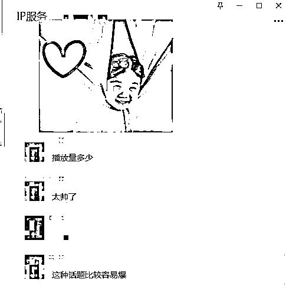
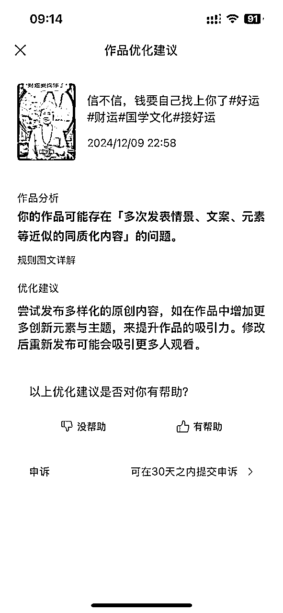
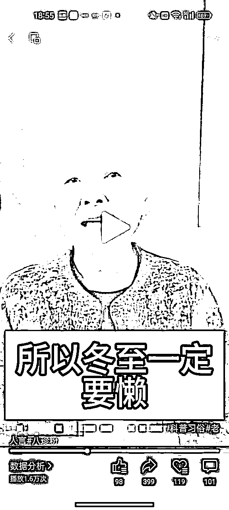

# 数字人视频号航海2条带货视频爆20万+流量，GMV7000+分享

> 来源：[https://lqpqitvyxqr.feishu.cn/docx/SL2mdaPz9o9RD8xVdP2cacUenJf](https://lqpqitvyxqr.feishu.cn/docx/SL2mdaPz9o9RD8xVdP2cacUenJf)

# 个人背景

大家好呀~ 我是清予

杭漂衢州人（浙江最会吃辣的城市），是一位很爱搞钱和写作，超级爱折腾的99年infj狮子girl。

我有8年的自媒体创作经历，今年是我边打工边创业的第1年，同时也在经营私域，运营自己的小红书和公众号，公众号写作已坚持135天。

目前在商业咨询公司搬砖，是情感疗愈数字人IP背后文案，已跑通两个数字人IP项目，目前在跟进7个数字人IP项目。

我是11月10日加入了的生财，12月第一次参加航海——【视频号带货-AI数字人】。

这次参加航海，写这篇分享的时候，我的5个视频号，4个都出了单，累计GMV7000+，变现3200+，1个号爆了2条20w+的视频，2天涨粉2700+。

今天的分享大纲如下，大家也可以根据自己的需要自由跳读~

没有参加这次航海的圈友，可以先看两遍航海手册，再看这篇避坑，我当时是看了两遍航海手册，最近看了第三遍，常看常新（会注意到之前没有注意到的许多细节）。

一、新人做数字人带货，如何提高爆单的可能性

1.  账号的初期搭建（为天选号打基础）

1.  选一个合适的数字人（为天选号打基础）

1.  要坚持发流量视频（账号更抗揍）

1.  先发流量视频，再发带货视频（账号更抗揍）

1.  流量视频如果用了公用数字人一定要去重（账号更抗揍）

二、带货视频大爆后，如何接住全部流量

1.  主副号要同等重视

1.  剪辑视频前商品先上橱窗

1.  第一次开播人脸识别一定要过一遍（尤其视频号的实名不是自己的）

1.  人在外面如何看流速

1.  不必担心大爆后粉丝数不够开播（什么情况下可以考虑买粉）

1.  爆款永远在下一条（心态篇）

1.  带货视频大爆后，几个复制爆款的关键时间点

1.  加几个代播（为大爆留后路）

【下面是这次航海的一些成果👇】

我是在账号爆完两条20w+视频的当天就限流了。

12.14 出了第一条27w的视频，当天凌晨这条带货视频限流；

12.15 出了第二条21w的视频，12.16 凌晨账号减少推荐。

但因为视频的高转发量，所以一直到12.22，橱窗还是在持续出单。

我当时在写这篇分享的时候，我也去后台截了个图，依旧也是有出单的一天，也就是12月21日。

言归正传，先从第一点开始~

# 一、作为新人，我如何提高爆单的可能性

我分析了下这次我能爆单的原因，总结下来可以用一句话概括：就是让自己的号尽可能成为那个天选号。

但至于这个号到底是不是天选号，这个其实很难说。

但是我们可以从各方面去努力，让自己的号有更大的爆的可能性。

我当时是做了以下5点，给大家做参考：

## 账号的初期搭建（为天选号打基础）

确定名字、头像、以及赛道，有点像粗糙的IP搭建。

等账号跑起来了，有一定的粉丝基础后，还可以开始完善简介（不过这个是后续的事情了，我当时爆单的时候还没有做这一步，后续会去做）

因为我一开始就抱着做数字人IP的心态去做，没想到会迎来爆单。

所以在开通视频号前，我就确定了我要做养生赛道，取的账号名称也是与之相关的——“xx食养生活”，账号名称对应我要带的品，这样做的好处是：人家刷到你的视频，看到你的账号名称的时候，第一反应就会是，养生相关的内容，我是不是可以来你主页看看。

头像我用的荷花头像，跟着航海手册换的头像，用中老年人比较喜欢的就行。

## 选一个合适的数字人（为天选号打基础）

我当时爆单后有给我的朋友分享我的数字人视频，她的第一反应是，我选的这个老太太很有说服力，一看就有文化又有气质的感觉😂而且看着还慈眉善目的。

所以，数字人选的好，从一定程度上就提高了信服力。

这点这次航海的船员大表哥也提到了，也试过确实有用👇

其实中老年人不太能区分你这个是不是真人的，就像现在依旧有很多人还不知道数字人这东西。

当对方以为你是一个真人IP的时候，爆单的可能性就翻倍了。

## 要坚持发流量视频（账号更抗揍）

我4个号流量视频数据跑的都还可以，只要账号本身没限流，基本都是几千的播放量，没有出现过几百的情况，有个号因为申诉都删掉了，所以找不到截图了。

【一些流量视频的数据👇】

流量视频虽然不一定能精准吸引到“会购买产品的用户”，但只要人群锁定对，账号不限流的情况下，人家这一次刷到了你的流量视频，下一次就还有可能会刷到你的带货视频。

前期粉丝画像对，后续的成交概率就大。

举一个简单的例子，我的第一个小红书博主号就是粉丝画像圈在了18-25岁，因为你前期发的内容都是这个人群爱看的，所以后面你再发其他年龄段的人爱看的内容，流量就会一落千丈。因为你在初始流量池的时候就被刷了。

所以我们在发流量视频的时候，直奔我们所需的用户人群，就是在提高以后发的视频爆的可能性。

中老年群体，我从我跑通的两个数字人IP上总结出来的经验是：两性情感是最容易爆的话题。

12月4号和9号连爆的两条10w+视频都是这类话题 👇

所以我们就直接对标两性情感的爆款视频，大家可以通过视频号主页直接关键词找对标账号。

可用搜索关键词：两性情感、婚姻关系、夫妻关系

【像这样👇】

我也给大家找了5个对标账号👇

1、郭银菊大姐

2、郑实小书馆

3、贞姐谈情感智慧

4、长卿商学智慧

5、新媛丨会话厅

大家可以直接去对标里面的爆款视频，然后扔到kimi里改写，自己再润色一遍就能用了。

扒过来的文案也可以直接用，但有数据扑街的风险，所以最好是可以修改40%-50%。

kimi修改提示语，大家可以参考用这句👇

请你改写这段文案，语言尽可能口语化，字数要控制在240个字以内（240个字差不多是30s）

有时候运气好，你多扔几遍，让kimi重写几次后就能得到你想要的文案，甚至自己都不用改。

如果你觉得提取和二创需要花很多时间，工作日比较忙，我给大家准备了15条爆款文案，大家可以直接用。

都是我在达人视频号上测试过的爆款文案，已经修改过40%-50%，大家可以自取，也可以扔进kimi里修改后再用。每扔一次kimi，出来的文案都会不太一样。

基本上你用这个文案，第一天发个2-3条，第二天就能过原创。我有4个号都是这样过的原创，第五个号是第二天就隐形限流了所以就没过原创。

## 先发流量视频，再发带货视频（账号更抗揍）

我出单的5个视频号里，只有爆单的那个视频号，是我先发了1条流量视频，然后过了2天才开始发带货视频+流量视频。其他的4个视频号都是3+1,4+1或者3+2这样一起发。

当时没有考虑到韩教练说的你一起发，都没传到服务器，所以服务器无法判别你是不是先发的流量视频。

我有一个号就是有爆的趋势，但是出现了180天的申诉，还没跑起来就违规了。

我分析的原因就是流量视频发少了，账号不抗揍，所以有爆的趋势的时候，你去复制爆款怼量的时候，数据还没跑起来了账号就出问题了。

所以尽可能，先发流量视频，再发带货视频，1带3,1带4这样，这就是在提高爆单的可能性，也是在避免账号一怼量就废的情况。

没试过1带2，可能可以延迟账号出问题的时间。

我出现2个20w+的账号，就是先发了1条流量视频，然后过了2天才开始发带货视频，期间正常用视频号刷视频。

第3天我发了4条带货视频（其中出现了第1条20w+爆款）

第3天晚上又发了1条流量视频+2条带货视频（出现第2条20w+爆款）

两个视频发布中间，至少要间隔半小时以上（这个在航海中韩教练就说过）

总之，发流量视频能提高权重，所以多发几条也没坏处。

我有4个号是同时启动的，但是我发过最多流量视频的那个号，是最抗揍的，也是最后出现“账号减少推荐”的账号。

## 流量视频如果用了公用数字人一定要去重（账号更抗揍）

我的第一个试水账号，就是用了不同的流量文案，但依旧收到了内容优化提醒。

我个人感觉下来，每个新视频号都有几条的新手保护期，就先出几条优化提醒，然后才限流账号。

所以尽可能，把违规次数留给带货视频，不要发流量视频的时候就违规了，就有点太亏了。

【当时用不同的流量文案，依旧收到的内容优化提醒👇】

关于去重，我用的最多的是，30s长的画中画视频去重。

我个人认为是比导入图片和添加贴纸去重会快很多，就是添加多了导出时间可能会慢。

我一般是这个剪完等待导出，再拿另外一个手机剪下一条。

我去重比较夸张，画中画的不相关视频我会好几个，然后切割后移动至不同图层，调整位置。

画中画音量一定要先调0，透明度3%，再去切割。

不然你切割完再去调音量工作量就非常大了，要一小段一小段调。

然后我会再加1-2个贴纸，调下亮度、对比度、色温、饱和度这些，有时候也会换下背景。

★注意：只更换背景，不一定能达到去重效果！我上面这条优化提醒，我就是换了背景，流量文案全是新的，但依旧收到了同质化提醒。

我个人实战下来的经验，我认为画中画的视频去重效果是最好的，大家可以参考。

下面是我去重的一些步骤，给大家录屏了一条👇

# 二、带货视频大爆，错过20w流量的复盘

## 主副号要同等重视

尤其是没开通原创前，流量视频都要坚持发，这样后面如果带货视频爆了，你怼量的时候就会更抗揍。

不然刚怼一条，号就减少推荐了，会很难受。

## 剪辑视频前商品先上橱窗

这点非常非常非常重要！！！

我当时就是不重视那个号，我觉得副号嘛，带着发就行了，所以橱窗上品也不积极，就错过了第一波20w+。

不然就算不能马上开播，橱窗也一定是有出单的！

## 第一次开播人脸识别一定要过一遍（尤其视频号的实名不是自己的）

尤其是号不是自己的！！！这点也非常非常非常重要！

人脸需要父母识别的，先让他们熟悉一下识别的流程，避免爆单后直播因为没有人脸验证被掐掉。

我的第一个账号直播是7:02开播，7:55弹人脸验证；

我的第二个账号直播是19:04开播，19:18弹人脸验证。

第一次开播可以直播聊聊天，这样就可以避免像我第一次一样，直播到一半被掐了，收益会减少一半不止！

我当时是被掐了之后，等了差不多一小时后才验证上，再次开播效果就没第一次好了。

1小时前，流速起来立马开播，成交是600+；

1小时后，认证完再开播，就只有100+了！！！

中间1小时的空挡，成交肯定是流失掉的。

所以，你把前面三点都做到了，等视频爆了，不说多挣几万，多挣个三四千一点问题都没！！！

我第二次爆的没有第一次猛，还被掐了一次直播，一天下来收益都有2500+（粗略算了算，应该是3000不到）

【被掐直播，一小时后再开播，成交额直降 👇】

## 人在外面如何看流速

微信不是自己的，看不到每分钟点赞的增长，大家可能就对数据没有感知力。

所以，强烈安利大家可用向日葵远程查看流速（不花钱，还很方便）

给大家看几条视频，从播放量和转发来看，再加上我当时没有及时挂橱窗，肯定是错过了一部分成交的。

这是我最近才发现的一个很好用的方法，用向日葵远程查看流速。

首先，你要在电脑和手机上都下载一个向日葵远程控制，长这样 👇

大家可以出门前，把自己要看的几个号，都先登入在浏览器里（当然你还需要装一个流速插件才行，装在谷歌浏览器里就行）。

注意：电脑版向日葵，要修改成长期验证码。

验证码发一个在手机上，出门前电脑要保持开机。

远程连上后是这样的，触屏就能控制电脑 👇

所以大家在外面的时候，电脑不在身边，也可以通过这个方法及时观察流速。

一旦有爆的趋势，就找代播团队立马开播。

## 不必担心大爆后粉丝数不够开播（什么情况下可以考虑买粉）

这是其中一个号爆的流量视频，一旦大爆，粉丝数肯定是蹭蹭往上涨的，所以不需要有这样的顾虑。

如果你想接住1万左右的小爆款的流量，那就可以提前买粉，不过成本也上去了。

比如我下面这个号的这条视频，当时流速就是跑到了65，但是等买完200个粉的时候，过了40来分钟，流速就掉下来了，我也是找的代播，算了一下差点亏本...所以提前买粉我认为是值得的，大家可以做个参考。

## 爆款永远在下一条（心态篇）

哪怕第一波流量没接住，这固然会很难受，但这已经无法改变了。

当时一起航海的圈友大家都知道，我错过了第一波20w+流量，但其实另外的几个号，也有小爆的视频，我也没接住...

所以心态很重要，任何事情，都是先坚持了才会有结果。

## 带货视频大爆后，几个复制爆款的关键时间点

我当时没接住第一波20w+流量的时候，我的第一反应就是不会再爆了，因为那条视频流量跑停的时候，就收到了优化提醒。

但我依然听了汪老师的建议，怼了3条视频后再睡觉，将爆款去重后再发布。

也听了斌斌教练的建议，设置了第二天六点的闹钟，但是因为前一天睡得太晚了，第一个闹钟没听到，醒来已经7点半，当时第二条爆款视频，流量已经跑到了10w+，但那天晚上就已经出了单。

虽然我没有在数据刚跑起来的时候就开播，但我是认为自己接住了第二拨流量。

休息好你才能创作出更多的爆款，休息好你才能接住更多的爆款流量。

不要对自己太苛刻，比起指责自己，复盘和向前走永远会比回头看更重要。

时常庆祝，知足常乐。

说白了还是心态要调整好，不过好心态也都是慢慢调整过来的，慢慢来不必着急。

出现爆款后，有三个关键时间点大家可以参考：

第一个是睡前，再怼一波爆款带货视频。

第二个是定时凌晨3点发布3条爆款带货视频，如果时间够的情况下，还是可以先发流量视频，再3条爆款带货视频。

第三个是定闹钟早上6:00起来看一眼数据，爆了立马开播。

【错过第一波流量后，第二天早上起来的后台截图 👇】

所以我也不能算完全错过了第一波27w的流量，因为那条视频给我带来了8000多的转发量。

这些转发里面，我认为一定是有成交的，不然我不会在账号限流后，每天依旧有出单。

## 加几个代播（为大爆留后路）

以备不时之需，别等流量爆了，然后加不上代播，又会错过一波流量。

当然学会自己播也并不难，但大爆的时候，比如像我这两次，每分钟一千一千播放量往上涨的时候，找代播反而是最划算的。

因为有人替你播，你就有时间复制爆款，怼量榨干流量，而且代播也不贵。

我当时的代播是白天35一小时，夜间是45，一旦大爆，你的时薪是远超于这个数的。

以上就是我的所有分享基本上包括了我在航海期间踩过的所有的坑，也欢迎大家补充 。

最后非常感谢那天爆单后，陪着我一起熬夜帮助我的汪老师和斌斌教练，以及在群里和私信帮助我的圈友~还有每天提醒我打卡的志愿者Elise，帮我看航海群分享稿的领队双鱼儿姐，排名不分先后~祝大家早日爆单！