# Cursor，我的盐不见了

> 来源：[https://lkqtstaxxx.feishu.cn/docx/SmyddCfBMoKSzrxRY8IcbddRncg](https://lkqtstaxxx.feishu.cn/docx/SmyddCfBMoKSzrxRY8IcbddRncg)

大家好，我是李灿，一个来自湖南的前端工程师。有了AI后，GPT就是我的编程老师，前端很多知识都是边做边跟GPT学的，现在有了Cursor，发现效率可以得到进一步提升。这次航海和Cursor玩得很开心，今天就和大家分享一下与Cursor协作做饭（编程）中，让它找盐（解决bug）的故事。

故事梗概：找盐没找到、找酱油没找到、于是把菜做成了甜的而我不爱吃，不死心的我终于找到盐和酱油，重新做饭吃上。以及整个做饭过程带给我的血泪教训[苦涩]！

省流版：看最后的做饭总结。

## 一、Cursor，我的盐不见了

编程如做饭，没盐怎么行！

航海任务中，有一个任务是用 Cursor 批量剪YouTube shorts视频，输入提示词，告诉它我要做的菜是批量剪视频，要什么口味也都说得清清楚楚，但运行文件立马报错：

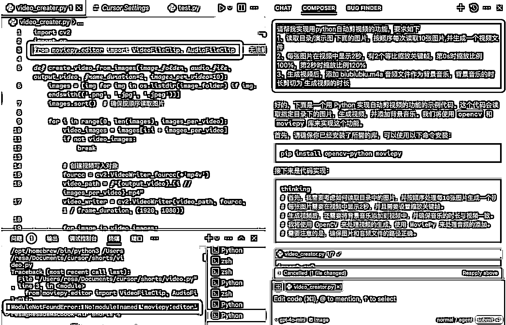

```
ModuleNotFoundError: No module named 'moviepy.editor'
```

字面理解一下，就是“moviepy.editor"不存在，就好像盐找不到了，我的饭做不下去了。

我：Cursor，我的盐找不到(“moviepy.editor"找不到)

Cursor：

你检查检查：

你确实买调料了吗（确保安装了moviepy）、

食谱是最新的吗（Python版本正确吗）、

锅好使吗（检查IDE、重启IDE）

我：我的moviepy是2.1.1，但还是没找着盐

Cursor：

你调料放对地方了吗（检查安装路径）、

重新买一份调料呗（重装moviepy）、

食谱新吗（检查Python版本）、

换个干净的厨房呢（使用虚拟环境）、

你的食材都买好了吗（相关依赖是否安装好）、

炒个小分量的菜试试（运行简单测试）

我：大哥，我都试了，还是找不到盐

Cursor：哦，你再把上面两次提到的方法重复一遍

我：


附提问截图：

第一次：


第二次：


参考答案做完出现了新错误，第三次问：


可以看出第三次的回答跟前两次很雷同，来回让我做同样的事，但没能实质解决报错。

## 二、谷哥，我的盐不见了

于是我又去找我的好朋友：谷歌。他很慷慨，一下子给了好多页结果，点开第一条：

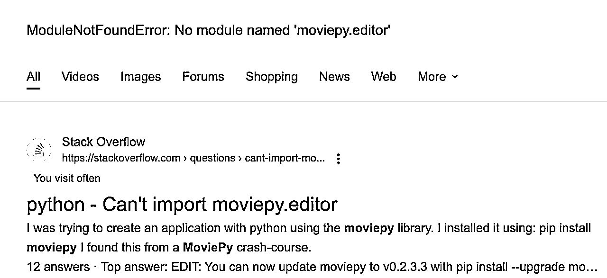

在答案里直接找使用盐的方式（其他引入方式），看到下面这条还比较新的答案，参考它对代码进行了修改

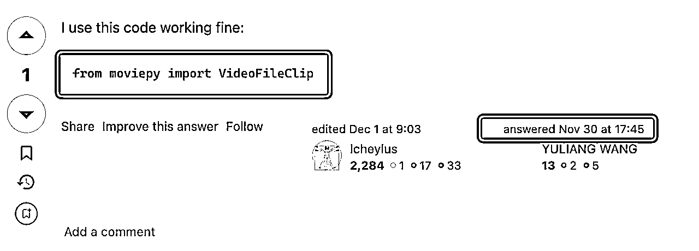

妈妈，我的盐终于不报错了！

但是，它开始报新的错误：

## 三、Cursor，我的酱油不见了

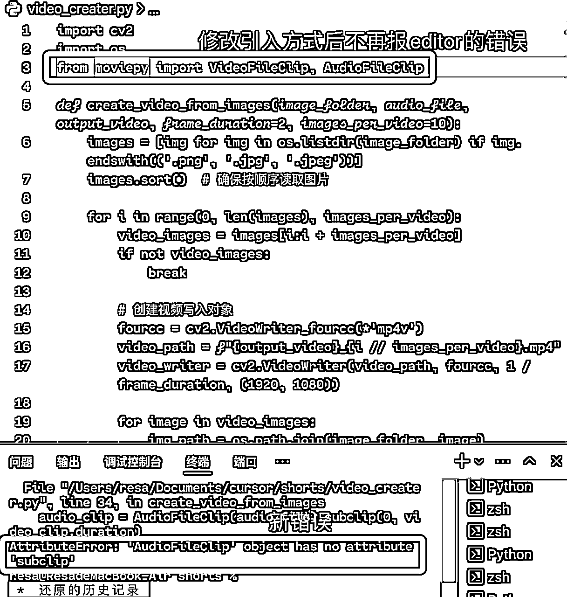

```
AttributeError: 'AudioFileClip' object has no attribute 'subclip'
```

如图，又开始找不到酱油（subclip）了！

我：大哥，我的酱油不见了（找不到subclip）

Cursor：哦，那是因为它改名叫生抽了（叫我把subclip改成set_duration）

我：大哥，叫生抽也不好使啊，现在报“生抽也不见了”

Cursor：哦，那是因为它改名叫酱油了（叫我把set_duration改成subclip）

我：拜托，酱油和生抽都不见了

Cursor：哦，那你继续用酱油吧（还叫我用subclip）

我：


附提问截图：

第一次问，它叫我把subclip改成set_duration:


改完继续报错，第二次问，又叫我改回subclip：


再次问它，跟它说了没有subclip也没有set_duraiton，它还叫我用subclip：

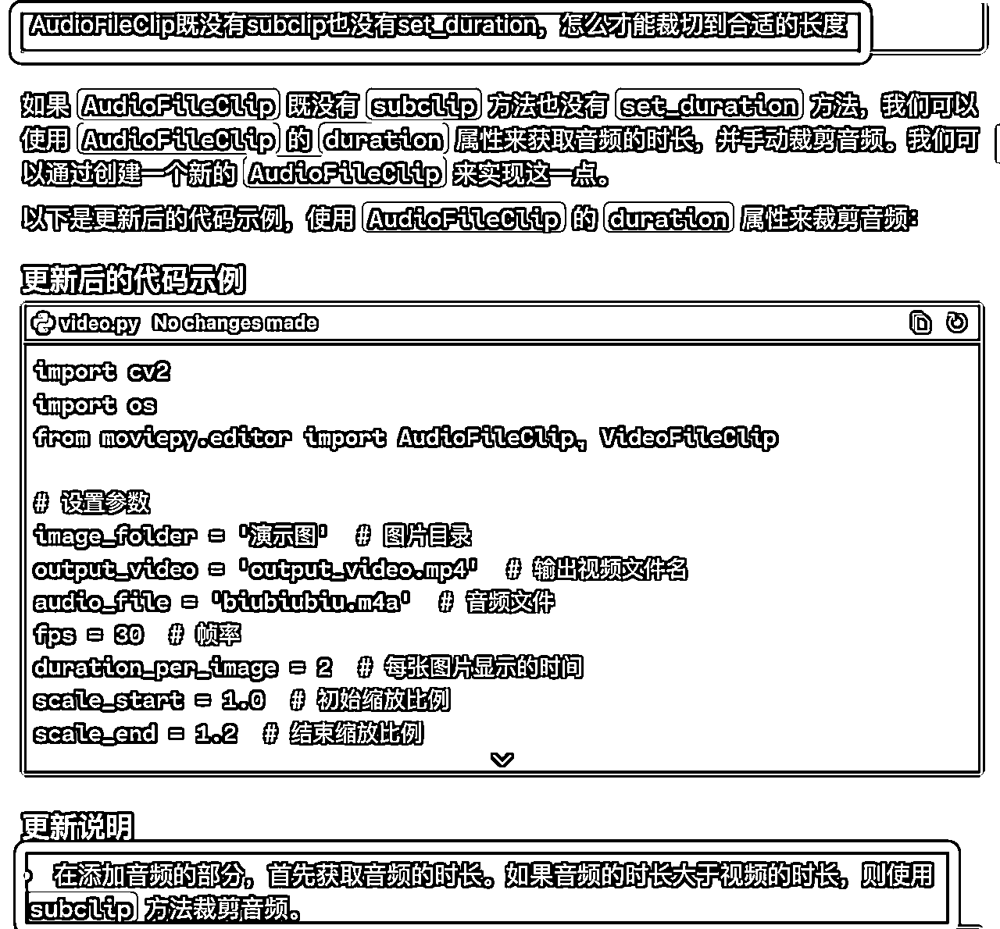

## 四、谷哥，我的酱油不见了

好吧，cursor大哥它失忆了，我再次找到谷哥哥:

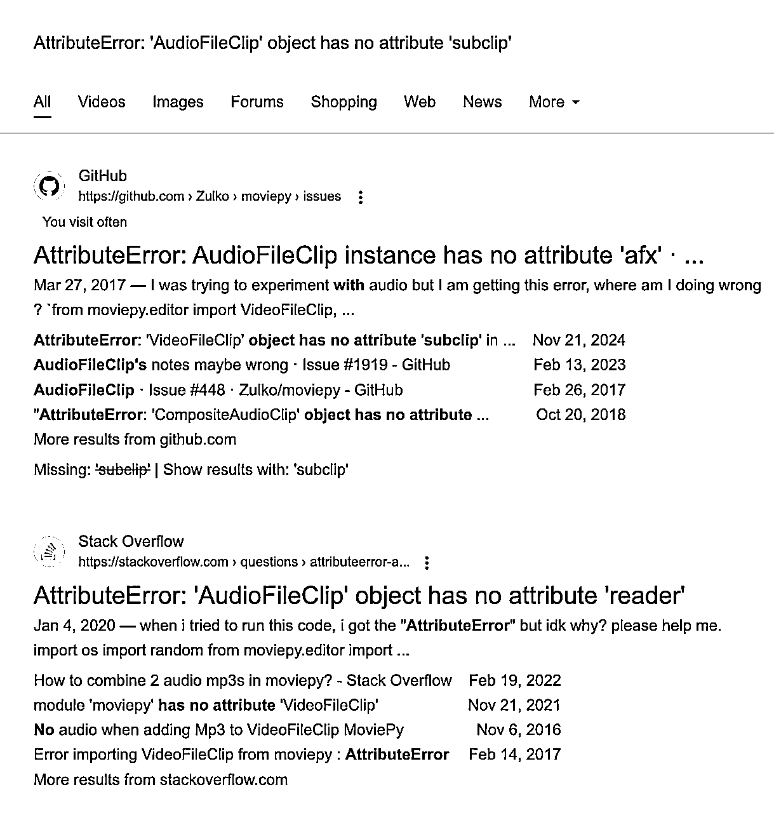

当时并没有完全能匹配到酱油（subclip）的结果（现在有一条），但是这一页有调料商（moviepy）的说明书（官方文档）：

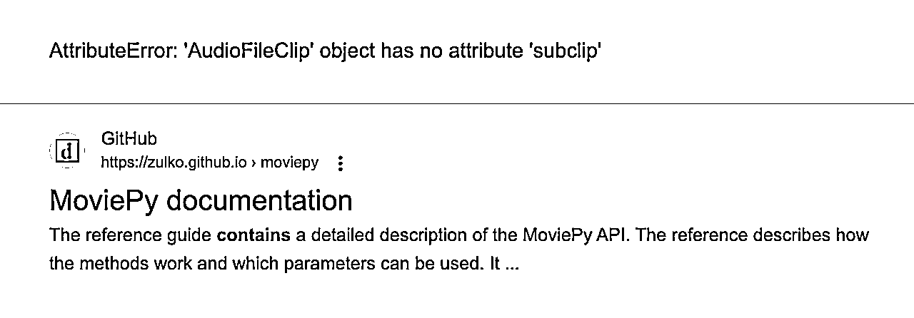

我想官方文档应该有关于酱油（subclip）相关的使用方法吧，找到搜索按钮就输入酱油（subclip），然后结果没一个精确匹配上（AudioFleClip.subclip)：

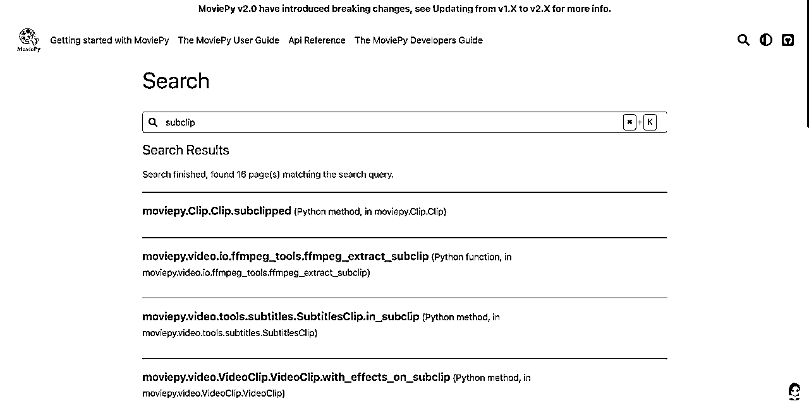

## 五、Cursor，你不用moviepy家的盐能做菜啵？

此时，我已放弃moviepy这套调料了，让cursor用moviepy之外的方式来做饭：


如果它一次成功就没有后面的故事了，中间还是遇到多次bug，最终实现的效果还是有瑕疵，此时距离我查看moviepy的文档已经差不多过去了两小时，快十二点了，要写日志了（半夜了，饭虽然没吃上，但做饭笔记还是要写的[旺柴]）。

写日志的时候回头去看了航海手册里贴出来的代码，教练明明也用了同样的盐（moviepy.editor），也用了同样的酱油（subclip），为啥我的就是不行呢？

## 六、盐就在那里，只怪自己眼神不好

不死心的我再去看了一眼调料商的说明书（官方文档），终于看到那个升级说明了，点进去一看，很清楚地说明了为什么找不着盐也找不着酱油（上面两个bug）：

在新版本里盐换了位置（不存在moviepy.editor并给出了正确的引入方式），酱油也改名了（很多方法如subclip、set_audio进行了重命名）：

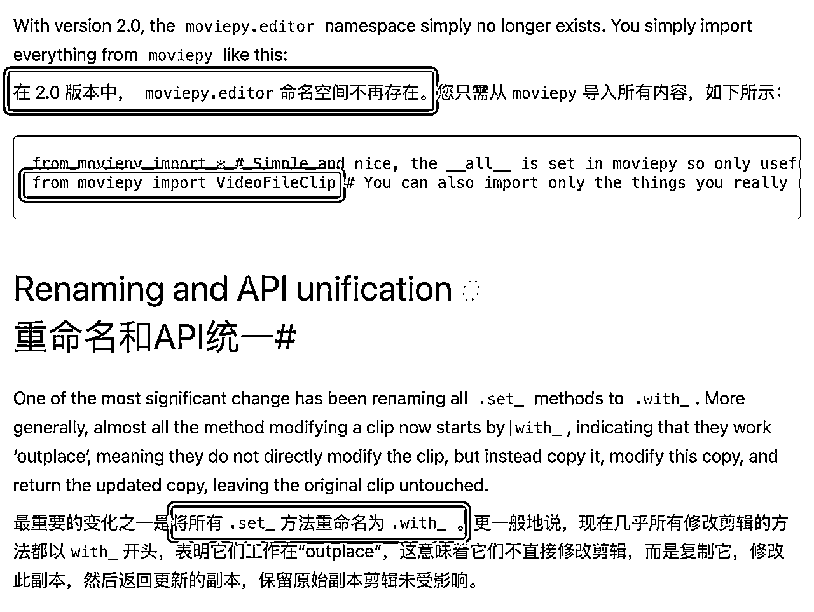

既然我们知道问题出在哪里，那么解决方案就很明显：

一是降低版本，使用含有moviepy.editor的版本（使用1.x版本里的盐和酱油，Cursor大哥认识的）；

二是根据新版本来修改代码（使用新版本的盐和酱油，使用方法需要自己或Cursor大哥学习一下）。

第一个方案要怎么执行也可以直接问AI，第二个方案如果自己看不懂代码也没关系，可以让cursor学习了给你来改：


妈妈，我终于能正确地用上盐和酱油了，可以吃上饭了！（参考文档进行了修改后可以正常运行了。）

## 七、做饭反思

这次做饭找不到盐和酱油，本质上是同一个原因，就是因为调料商更新了版本，盐和酱油的使用方式和以前不一样，所以用老方法是行不通的。而Cursor大哥还不知道调料商更新了，它只知道以前的用法，所以无论我怎么问它也给不出新方法。（moviepy的版本更新了，对原来的代码进行了重构，所以原来的使用方式在新版本里都不起作用了，但是AI模型没能那么快地同步到版本迭代后的知识，然后我拿一个它不知道的东西一个劲问它，它当然不知道啦。）

回顾自己找盐和酱油过程，其实可以发现：

### 7.1 动动脑子

自己根本没动脑子，只是惯性问cursor、问google、查文档，只会问现象“盐找不到啦”，不会问原因“为什么找不到盐了”。

在Cursor也无法帮我找到盐的时候，我如果继续问一问：

我做饭的家伙都准备好了，但一直报“盐找不到啦”，为什么？咋解决？

```
如果我的环境没有问题，Python版本也正确，相关依赖也都正确安装了，但是仍然报ModuleNotFoundError: No module named 'moviepy.editor'这个错误，可能的原因是什么
```

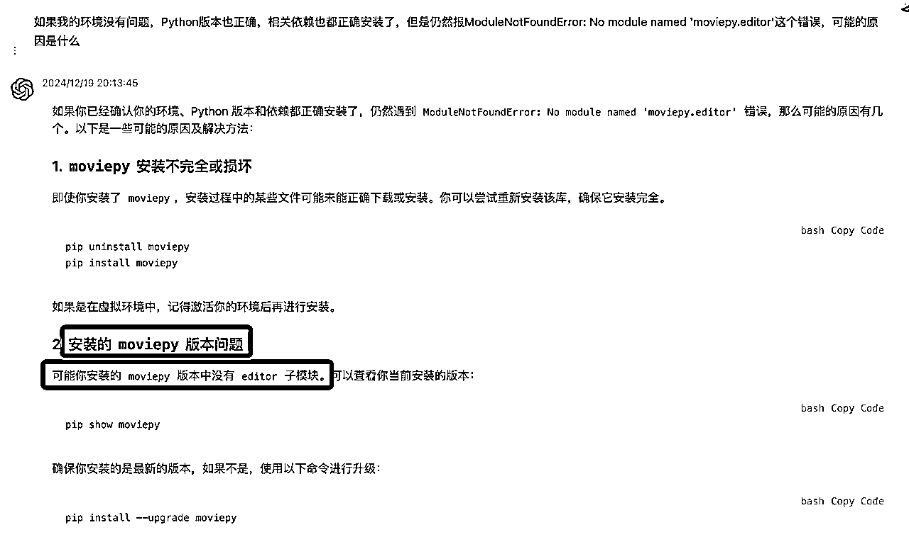

截图是我问的GPT3.5，让它解决那个报错也会进入鬼打墙，但是如果停下来问问它（或者cursor）这个问题，它给出的原因里就可能存在正确答案。

假设moviepy已经正确安装了，那么可以根据截图的第二条继续问：哪个moviepy的版本含有editor？

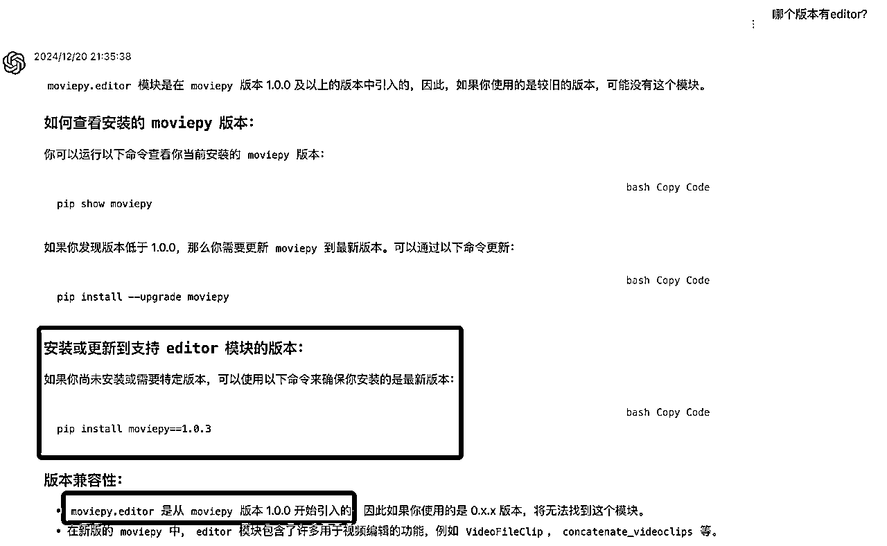

使用了正确的版本，后面也就没有找不到酱油（subclip）的问题了。

### 7.2 认真阅读

自己在阅读相关内容时也不认真，但凡仔细一点，都可以从几次搜索中get到正确答案：

第一次谷歌“找不到盐”的结果里就提到了是由于升级导致报这个错误：

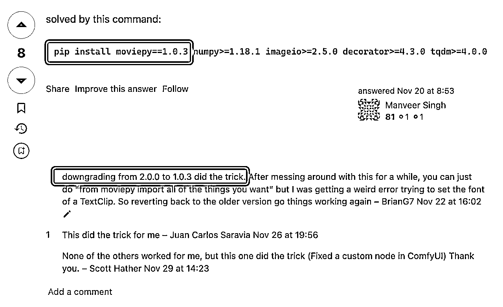

第二次搜索调料商说明书时，如果注意到上方版本升级的提醒（breaking changes），或者点进去与subclipped（与subclip非常像）的页面，就会发现subclipped就是更新后的subclip（酱油改名叫生抽啦），功能是一样的：

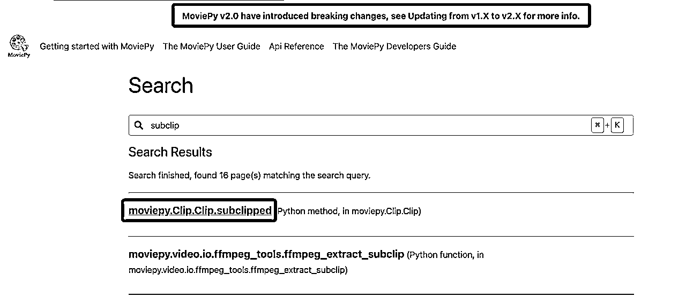

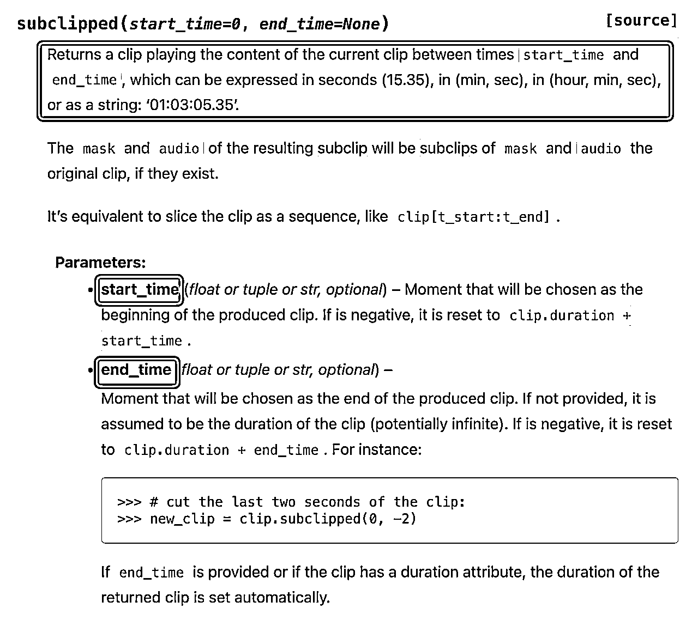

### 7.3 Cursor小知识

这里附带几个小知识：

@Web是让cursor联网去查询来解决问题

@链接 可以直接让它去读取链接内容

@Docs 可以添加文档，里面有一些预设的，也可以新增，比如新增moviepy的文档后，后面引用可以直接@MoviePy


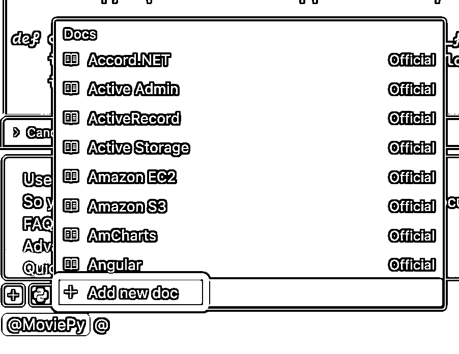


## 八、做饭总结

总结一下，在解决具有明确报错信息的bug时，可以先让cursor解决，如果鬼打墙时，可以停下来尝试：

1、我按照上面的方案完成了某某某操作，都正确/正常，但还是报同样的错误，可能的原因是什么？要如何解决？

2、@Web让其联网找找解决方案

3、@Codebase，如果问题不是单一的，让它基于整个项目上下文来思考一下

4、使用其他GPT、谷歌、官方文档检索更多信息

可以使用google来搜索一下，你的问题很大概率是别人已经遇到过的，在stackoverflow.com以及github上该仓库的Issues下找到相关问题的可能性也很大，再就是翻翻官方文档找找相关的内容，比如本次bug里遇到的editor、subclip等。如果明确知道能通过某个链接或阅读文档解决问题，可以让cursor @链接或@Docs添加文档来学习解决。

5、让它换一个方式来实现同样的需求

6、别忘了咱们航海群，去群里提问吧！（先搜索关键词看看是否已经有相同的提问和回答）

7、还可以场外求助懂这一块的朋友，也可以在stackoverflow.com以及github.com对应的仓库Issues(如https://github.com/Zulko/moviepy/issues）下进行提问。

我的分享到此结束，谢谢大家！