# 2个月2k+粉新手，教你如何做小红书？

> 来源：[https://n1v3gttgm1.feishu.cn/docx/LCcOd6YRLoAmgjxm0YRcZC7on4G](https://n1v3gttgm1.feishu.cn/docx/LCcOd6YRLoAmgjxm0YRcZC7on4G)

生财友友们，大家好呀，我是jennies，一枚跨境电商创业者，副业是盖洛普优势教练（初级）。

10月份第一次做小红书，主要是为了我的副业。中途我还踩坑禁言了30天，11.10重新起号，截止目前为止粉丝数2k+，进生财增加了1k+的粉丝数，接了一次商单GMV160，让我感觉意外的惊喜。

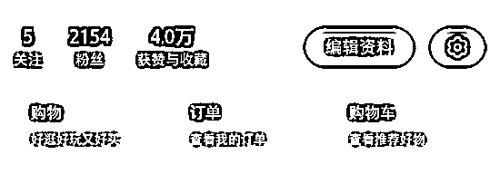

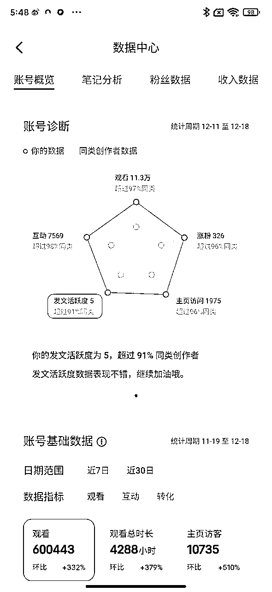

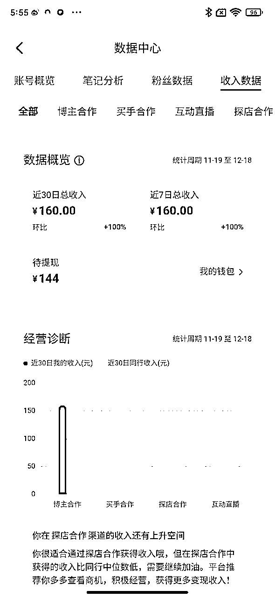

好了，正文开始~

接下来主要分享两个部分:

第一，新手如何做小红书要点

第二，进阶小红书难点

航海手册的内容非常丰富，如何运用到自己的做小红书这件事上呢？

如果你是新手小红书博主的话，这是摆在第一个的问题。

所以当时我针对这个问题，作为一个J人，我把框架要做的事情梳理出来，当然要是早点接触生财，这个事情可能效率会更高一些。

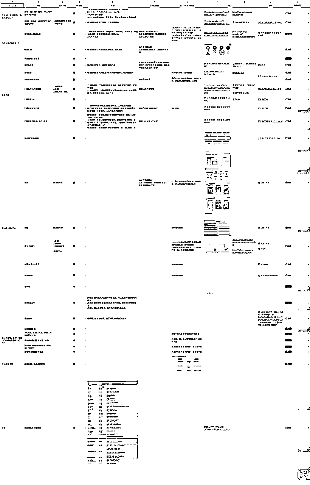

简化下来就是每天航海打卡里面的

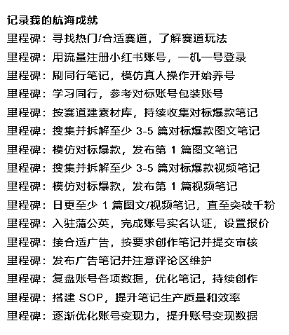

## 新手如何迅速做小红书？

### 步骤一:找合适/热门的赛道

合适的赛道这个梨云的生财好文给我很多的输入，我就直接给结论。

我当时一直都是卡在这里非常的难受，喜欢，擅长和商业价值之间我探索了非常多，当时梳理下来有3个方向，一个是游泳运动，一个是教练教育赛道，一个职场赛道。

我根据梨云的方法，在新红的数据菜单栏上的排序+她整理推荐的赛道里面最终选择了职场赛道。

### 步骤二:找对标账号

确认了职场，接下来就是找对标的账号，我当时搜集消化了很多信息，之后筛选确认了这几条:

1.内容形式我只做图文，所以参考图文账号--必选项

2.粉丝数近30天涨粉2k+---加分项

3.1k≤粉丝量≤1w--必选项

4.账号近30天内有发内容--必选项

5.笔记的数量总数最好不超过50篇--必选项

主要是为了对标到自己可以尽可能做到，但是又不是遥不可及的两个大原则做的筛选，细节考虑如下:

1.主要的考虑是自己不消耗能持续投入的精力的考量，之前做过视频，现在手上事情也比较多，希望能保持住心力，所以选择了图文

2.短期内涨粉的加速度比较快，说明有很多可以借鉴的

3.粉丝数越高超过10w，据资料显示说团队作战的可能更大，为什么对标1w，而不是10w呢？因为我认为更加接近当下我的水平产出

4.小红书每天的风向标和内容是有变化的，如果不是持久的经典话题，一般话题是有时效性的

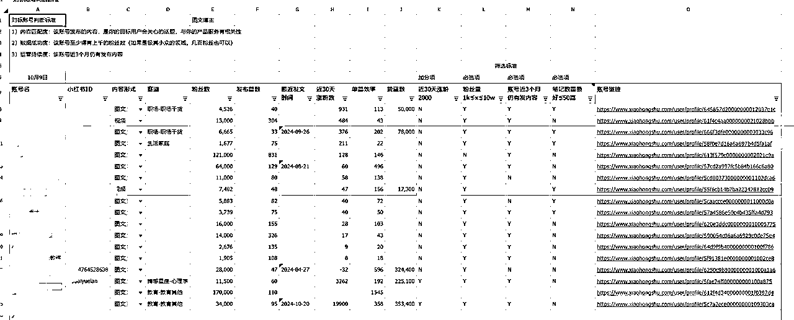

以上信息，大家最好是类似新红，灰豚数据/爬虫工具弄下来，效率会高很多；不要问，我为什么知道。哈哈哈哈。

因为第一次做，我自己当时是手copy下来，虽然很耗时间，但是我觉得能让我对账号的名称有了一些思考，为什么会起这样的名字是有什么好处吗？

所以当时自己取名字也借鉴了一下。塞翁失马焉知非福。

### 步骤三:找对标笔记

对标笔记的原则主要是根据和平台一致的，平台为什么给你流量？它会给什么样的笔记流量？

特别值得说的是，小红书对素人好，好在无论你是0粉还是百万粉，你的笔记符合了小红书用户和平台的利益那你们爆款的概率是一样的。

所以，平台的规则很多，但本次我们的目标是围绕，什么样叫做好的笔记？为什么是这个呢？因为你的目标是找出好的笔记进行仿写，进而发出第一个你认为可能会得到好的数据的笔记。

好，说清楚了之后，因为自己并没有对小红书用户喜欢的内容有内容相关的“体感”，对于新手一开始的筛选就可以从数据筛选来，这个是没错的。

小红书平台给笔记流量的算法是:

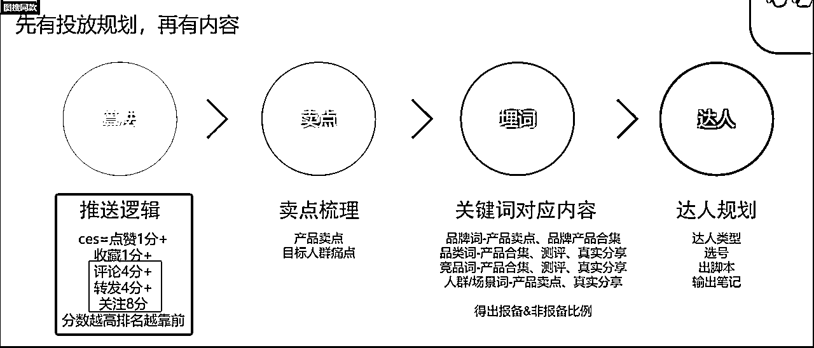

所以要挖取的数据很简单，在职场赛道的关键词输入后，把笔记的点赞，收藏，评分，转发，粉丝数收录进来作为爆款笔记的筛选器。

然后选择最好的评分，排优先序，进行笔记选择:

CES=点赞数+收藏数+评论数*4+转发数*4+单篇笔记涨分数*8=评分

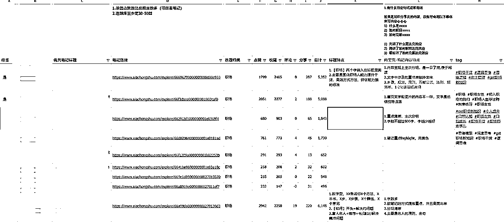

PS：你发的笔记足够多的时候，其实不用这么麻烦了，看账号的置顶以及翻两下就有“体感”知道哪篇是你想要模仿的笔记了。

### 步骤四:拆解对标笔记

首先，大家要清楚拆解笔记是为了什么？

为了发出去一篇不违规，且可能得到用户喜欢和平台青睐的笔记。

所以发一篇笔记要有哪些要素呢？

1.选题

2.标题

3.内容结构，风格

4.封面设计

5.笔记的tag-稳定标签+热门标签

在拆解内容上我觉得对于新人来说还是挺难的，这个时候AI可以帮你。

我一般是自己分析的，所以具体的技巧就不“祸害”大家了，AI并没有成熟的经验。

tag当时因为看了梨云的标签分析法，做了还挺严密逻辑的tag筛选方法，我把我筛选出来的笔记，把tag数据copy出来，关键词的搜索量代表了需求，所以把关键词搜索量和出现在笔记种的频次作为了筛选标准。

【标题】【内容结构】

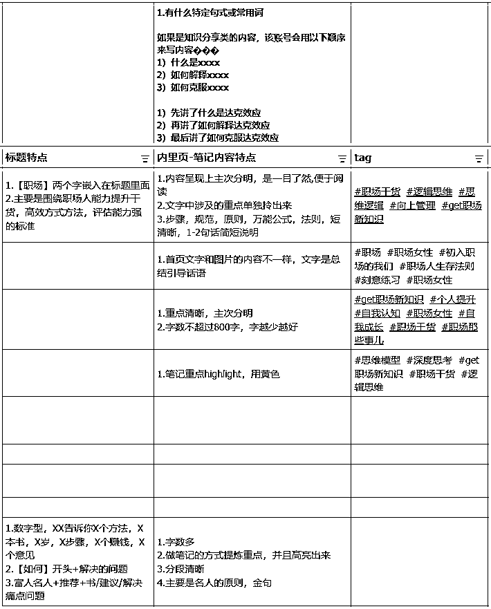

【封页设计】

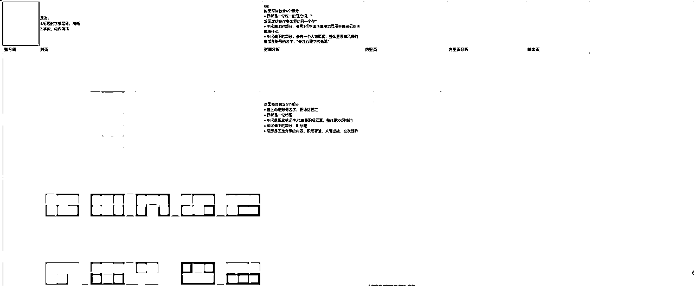

【tag】

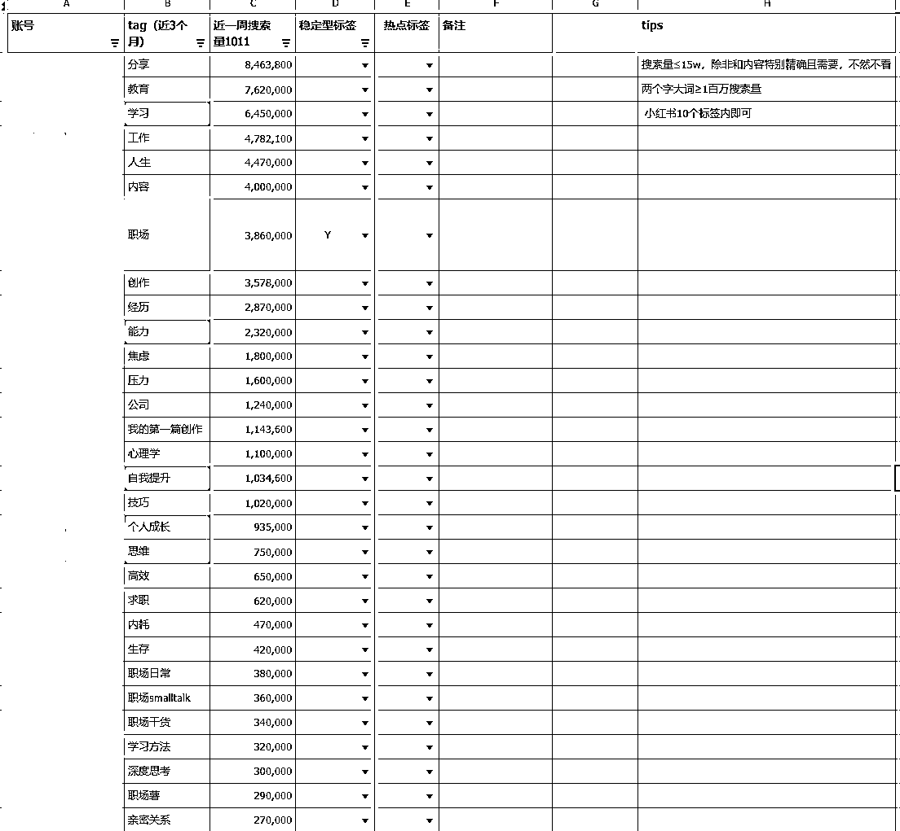

### 步骤五:输出笔记内容+封页

#### 1.写内容

刚入门新手就还挺难的，也不知道是什么仿写/原创，在即还没有形成自己的内容能力之前，我推荐大家用AI，我用的比较多的是kimi+自己改写。

##### 标题

#角色:

你现在是一个世界一流的文案大师,擅长编写小红书文案。

#背景:

我将告诉你一些写小红书标题的方法论,你需要认真学习。

#任务:

我会告诉你我的内容选题,请你根据我告诉你的方法论和我的内容选题,来按照我的要求生成小红书标题。

#方法论:

小红书标题的写作方法如下:

1.用数字凸显价值和美感:我们的大脑会优先识别数字,因此在标题中使用数字能增加辨识

度,让用户更加直观地感受内容的价值,激发其点开笔记的欲望。

例如:

《每天3分钟,10天消除黑眼圈》

《不节食不运动,挑战7天瘦10斤的快速减肥法》

《3年攒够100万元,相信坚持与复利》

《强推!1年时间让我脱胎换骨的24个好习惯》

《72个自我提升App,零成本自学》

《42个学生党免费自学网站,在假期中脱胎换骨》

《这5个方法让我摆脱拖延症,行动力提升99%+》

《过了20岁,一定要尽早养成这32种认知》。

2.体现实用性,强调价值:小红书用户搜索主动性强,通常会在平台内对一些

问题进行主动搜索。指导性强的标题有更好的针对性,从而提高笔记的吸引

カ。

例如:

《答应我,下次拍照一定要这样拍》

《如何找到自己热爱的事情?看完不迷茫!》

《如何停止胡思乱想,告别精神内耗?》

《这样做每日复盘,2021年每天进步一点点》

《职场人必备技能,让你能力翻番》

《自律上瘾!开挂的人生从自律开始。干货,建议收藏》

保姆级教程,教你把安卓平板升级成学习机》......

方法论3:

惊喜优惠,突出卖点

首先告诉用户,这款产品人气旺、

销量高、明星青睐等,突出卖点,

然后再利用优惠和低价营造反差,

这样会让用户感觉既花钱少又解决

了问题。

《INS上卖疯了的包包,居然只要1元钱》

《超可爱!9块钱宝藏好物,平价纯分享》

《连呼吸都是桃子味的!5块钱的良心国货》

《今年夏天超火的扎染衬衫,均价只要50元》

#要求:

请你根据我输入的需求,用每个方法各生成三条标题，我正在为主题是【重要但不紧急的，才是人生要事的9月个人总结】的公众号/小红书取标题，所以帮我根据方法论和主题分别取5个标题。

PS：我是个搬运工。

##### 内容

找到对标的笔记后，可以对kimi说:

#任务，”请根据这篇笔记的行文结构， 仿写一样的内容，但是改变文字，多使用emoji符号排版和序号，具有小红书爆款笔记的的特点，且口语化”

#### 2.封页+里页

我用的工具是搞定设计，其实可以直接“借鉴”持续爆款的账号封面设计，因为那是被验证过的，比如梨云绿，哈哈哈哈哈。

我自己有些时候有些莫名不想选大家一样的，我自己是在搞定设计里面找了我自己喜欢的，测试过3-4次确定下来的。这样效率不是很高，不推荐。

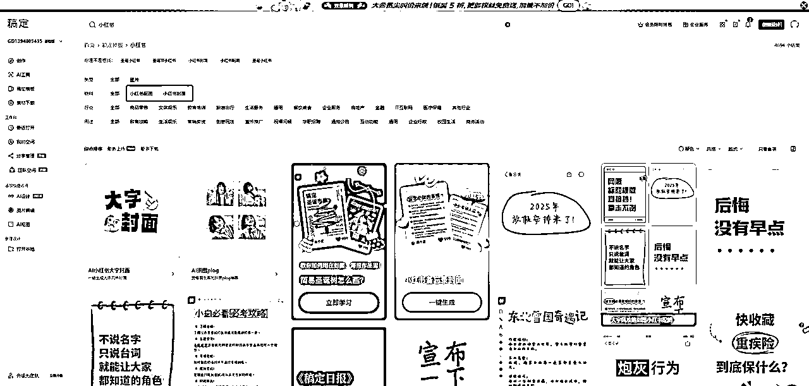

#### 3.发布

之前在最开始的给大家提到过，别自己踩了平台的规则，不是内容不好，而是损害了平台的利益和原则，你自己不知道，然后觉得自己哪哪都是问题，然后可能就放弃了。

最后一步，一定要做，就是检验自己的内容是否不符合要求。

把自己的内容放在违禁词的网站里面去查，有问题的修改即可。

我用下来的好用顺序是:句无忧＞易句网＞零克，具体的原因就不分析了，工具是辅助不是小红书的重点。

### 步骤六:如何评判自己的笔记是好还是不好呢？不好的地方主要是优化哪个方向呢？

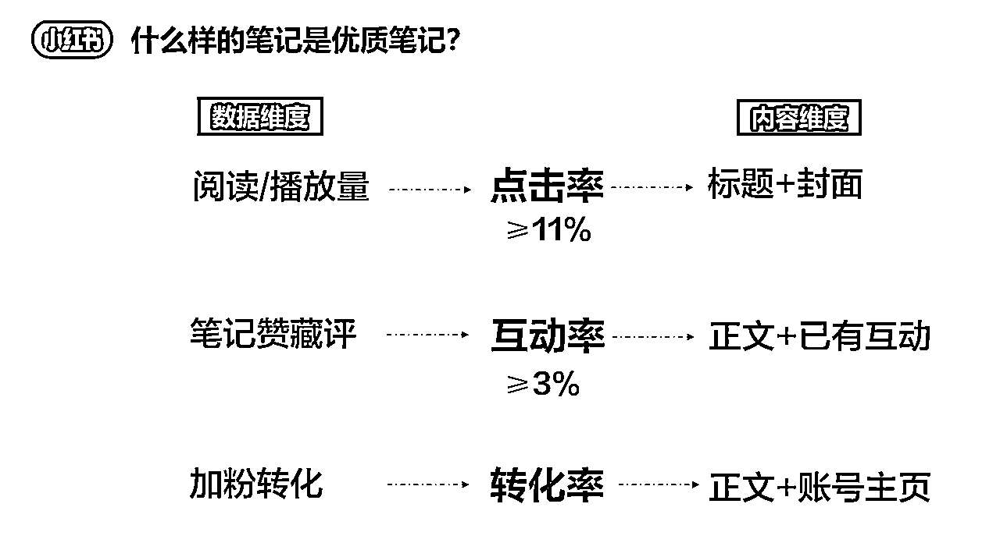

优化一定是基于知道问题在哪里，以上是小红书对优化笔记的标准，可以给各位参考。

### 步骤七:拆解账号四件套

笔记持续稳定的输出，0→1就万里长征走了很大了一步了，接下来粉丝为什么要关注你呢？需要有一个理由对吧，看你能获得什么价值，什么是粉丝关注的内容。

意味着你的主页装潢就特别重要了，那就是账号的你主页的头像，账号名，背景，简介。

那么如何拆解呢？

1.账号定位是否符合你的定位？

2.目标用户群里跟你预期的是否一致？

3.账号名的是否简洁，一眼就能看出是做什么的？比如:职场话题汇

4.头像是否表达了你想表达的东西？

5.简介的“引流”方式，是否清晰？

当然其实也不用这么复杂，新手也不需要了解这么的深，在笔记还没有得到正反馈之之前，都可以暂时不做。

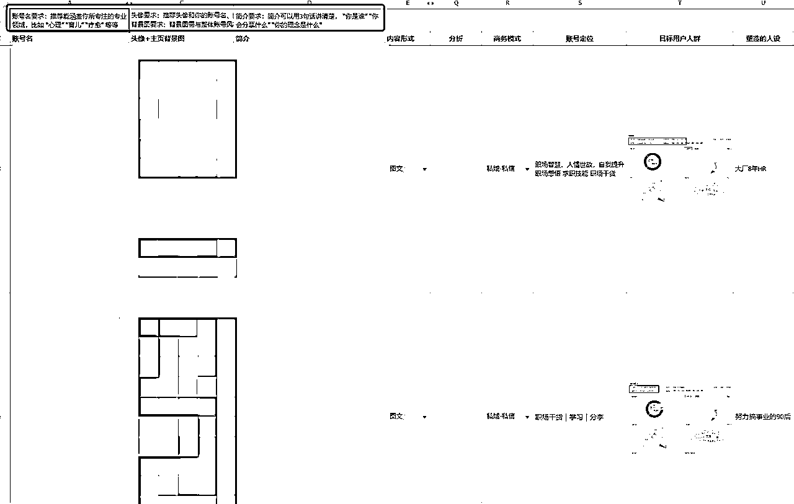

### 步骤八:输出自己的账号四件套

账号名要求：推荐能涵盖你所专注的专业领域，比如 “心理” “育儿” “疗愈” 等等

头像要求：推荐头像和你的账号名、封面与内里页风格一致

背景图要求：背景图需与整体账号风格一致，可以暗色一些

简介要求：简介可以用3句话讲清楚， “你是谁” “你会分享什么” “你的理念是什么”

根据你的拆解+自己回答以上的问题，就可以输出你自己的账号四件套。

## 2.进阶小红书经验帖

### 平台的红线不要踩

千万不要踩平台底线，把链接，二维码啊之类的放在自己的笔记中。我的账号被限流限制发言30天。

想分享给大家避免踩坑。

我在做之前我就知道是不能这么做的。平台有自己的利益诉求，太正常不过了。

首先说明，我是没有故意要踩平台红线，甚至都不知道咋回事就触犯了，自己给自己整了个乌龙。

我发的AI秒出思维导图的笔记发在小红书疑似我违规，我心想我怎么违规了，我当时就上头，把知识星球做的这个笔记的内容作为了我的上诉材料。

一下就遭了，就直接判罚。

原因是知识星球底部是有二维码的，我自己没有注意到。

1.事情已经发生了，还可能再申诉成功吗？我申诉了还是没有办法

2.我想起之前看到的我喜欢的博主被封禁了事情，心态上引起了强烈的共鸣，真的永远都要有的选。我立马找了我的小号装修好，继续我的测试大业。

3.站在平台的角度上来说，完全可以理解这个行为，下次就小心些吧，千万不要上头做事。

### 心力上，自媒体永远都要准时出摊

小红书最关键的是，持续的做。很多能得到深度质的飞跃的事情，其实是量没有积累够。

发几篇，发现数据不好，觉得自己是不是能力不行，是不是不适合做。

时间不足，上班都这么累了，我休息都不够，惰性起来。

选题不会啊，内容不会啊，拆解不会啊。

做视频和图文门槛好高啊，做着特别的消耗

..............

一周连基本的3-5篇都更新不了。如何能把小红书做起来？

出摊对于自媒体人来说非常的重要，每出摊一次都能增在你在用户面前的露出，而这个是确定性极高的事情。

准时出摊，你的能力会慢慢往上走，这件事情是确定性极高的，只有加法，没有减法。

尽管爆款只能追求概率，出摊是爆款的前提。

所以，你准备好了准时出摊吗？

### 锻练基本功才是最重要的

我自己做的这两个月的感受是，重要的事情只有两个

1.在小红书上我做什么？--方向

2.如何写出好的内容？

我在刚开始做的时候，不知道什么是重要的，希望把每一个步骤里面的点都要吃透，比如tag的分析，笔记好的标准....

事实上，每一步都花很多精力，我认为这是战略上的懒惰来掩饰战术上的勤奋。

你做小红书是不是合适，你能不能长期做，你能不能得到正反馈？

这些的前提是你得发小红书。

所以甚至是我自己的偏见，先动起来，生财这么好的内容摆在那里，先做起来是成功的第一步。

好的内容什么样，不清楚，那就搞清楚，找对标，你找了几个就说自己不合适？

尽管像大佬般的梨云都每天花至少2个小时来找选题，扒用户的评论区，还得分析满足了用户的什么需求。

所以内容的基本功是，持续不断的打磨自己的内容。

我自己感受上，我觉得至今还很难的不是做小红书发笔记，是如何能进阶。

进阶是，我发出的笔记我十分清楚满足了粉丝什么样的需求，且用粉丝喜欢的内容呈现，以及满足了人性的哪些点，我用一下梨云精华帖的一部分做个示范:

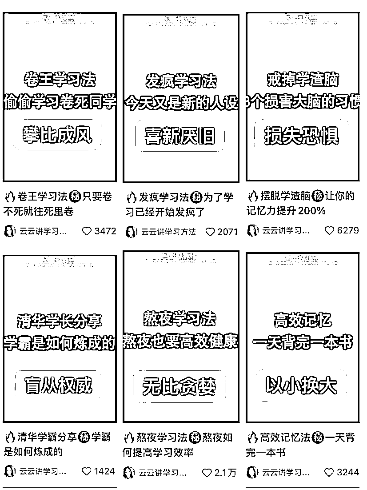

虽然有过数据还好的笔记，我觉得那是运气，不像是能力长在自己身上，可以稳定的强。

没关系，慢慢来，虽远必达。

### 选赛道是一件极其难的事情，需要给足尝试的耐心

我10月份开始到现在，其实我的赛道变过2回，我现在并没有在职场的赛道，这个变化不是我自己主动想变，而是在一次意外别人的选题参考下，我仿写了一篇，然后也有点小爆才转变的。

所以，千万不要觉得我一定要死磕某个赛道，也许你以为和你擅长的根本不是一回事。

赛道好，跟你有什么关系呢？

赛道不好，跟你就没有关系，挣不到钱了吗？

合适才是你持续愿意做下去的正反馈和动力。

赛道也不是你一开始就能你计划对的，你能带走的是做小红书的能力，无论做哪个你想做的赛道，咱们都能有能力hold起来，我想这才是做小红书的意义吧，永远都有选择的权力。

* * *

——END——

分享完毕，一路走来接近两个月，我自己的粉丝数的增长属于是中规中矩1个半月涨粉2k。

但是我之前的目标是一个月涨粉1k，来生财也是想接一次商单，整体上还是满意的。

所以，大家也加油，有些“成功”是虽远必达，只要在牌桌上就永远都有赢得可能，咱们得有这张门票。

感谢在小红书期间领队十月，星星的帮助，还有漫漫教练的点评~

今天是冬至，大家冬至快乐~