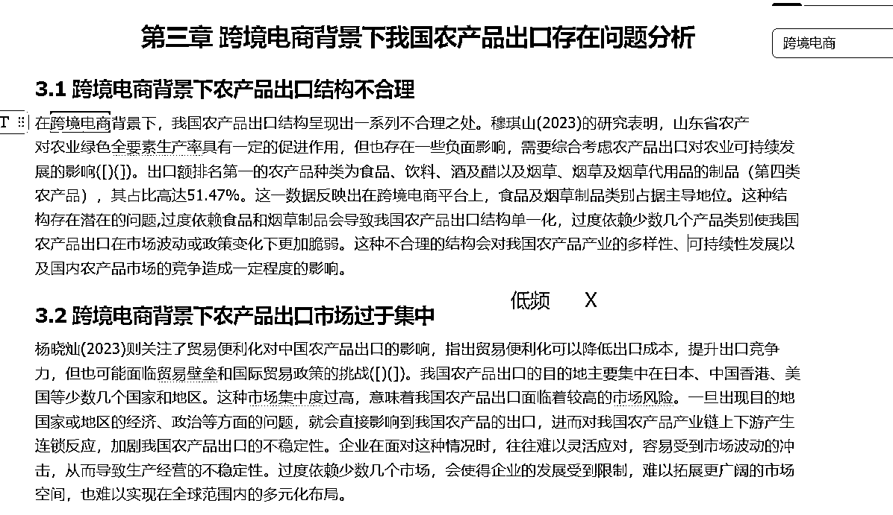
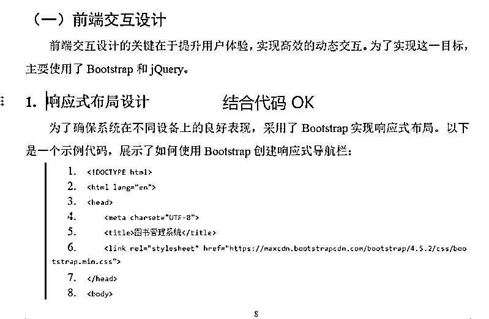
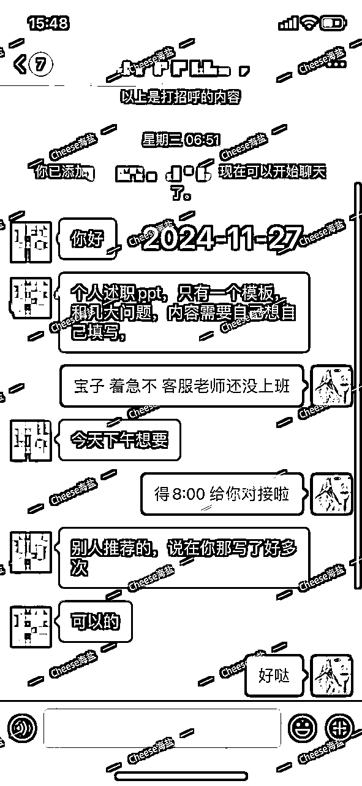
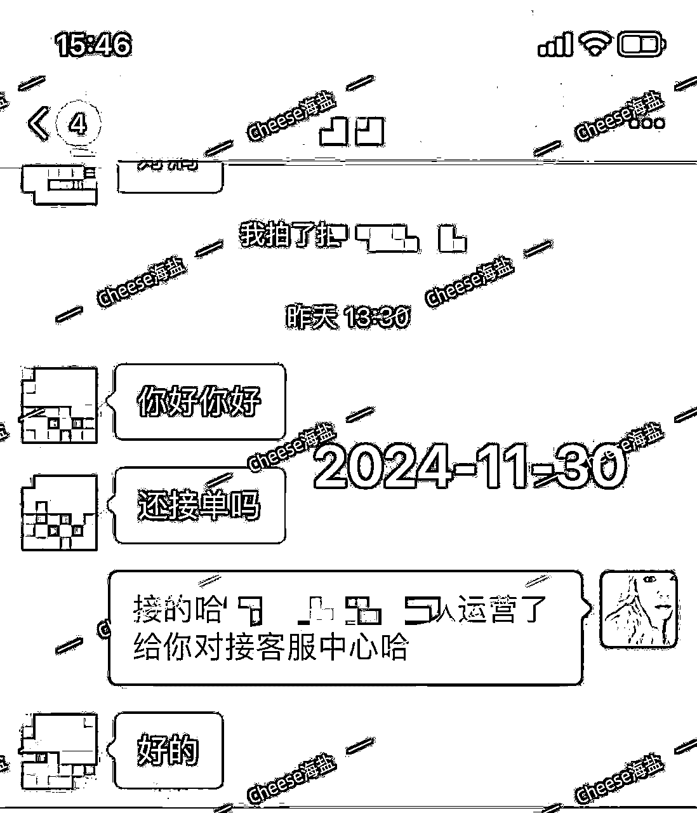

# 一文讲透AI写作交稿避坑指南，做靠谱写手订单接到手软

> 来源：[https://atbs4xk1uw.feishu.cn/docx/UqFjdBtbOoSwRgxJpgtc9UFnnCe](https://atbs4xk1uw.feishu.cn/docx/UqFjdBtbOoSwRgxJpgtc9UFnnCe)

# 一、效果小剧透

嘿嘿！小伙伴们，今天给客户交稿的“坑”踩得如何？

其实不仅仅是写手小白们，海盐之前合作的几百名外部成熟写手，经常交的稿件是带有很多“AI硬伤”的

包括海盐遍览了全网各种AI词汇、结构、写作硬伤的总结，找不到一套真正符合绝大多数客户要求的标准

无限次对照，无限次验证，网上这一内容教程的混乱，聊胜于无，于是，海盐结合了内部深入一线训练的有大量回头客、转介绍的数百名高质量写手的审稿标准，和小白常见误区、雷区，写了这一篇教程~~

在各种地方看过学过试过AI写手们是不是经常发现自己的稿子，乍一看很完美，但客户一读就说“你这是AI水的吧？”、“AI无脑出骗我钱的吧？”、“求求你了，好好修改，太水了吧？”、“别用AI写，以为我看不出来吗？”

别急，今天海盐来给大家揭秘——写稿时怎么用AI创作又能避免那些“隐形大坑”。

在你按下提交键之前，有哪些地方需要再三检查？咱不说稿件内容做到90分，确保客户给你打五星好评（这需要好好学习海盐大法：AI写作底层方法论那一篇，才能做到），也至少能做到交稿时没有硬伤，让客户心甘情愿确认收货~觉得你真的有用心写稿~~而不是AI水一个给他交付

先给大家一点小剧透：市面上大部分写手都在稿子里偷偷带着“AI痕迹”，但是完全没意识到...对，就是那些别人一眼就能看出来的地方！

比如说，句子结构太整齐，内容空洞无物，出现AI词汇、AI结构~ 哈哈，你有没有在心里偷偷说：“客户经常看一眼，就退货了，我都不知道为什么？我好委屈，明明按照各种帖子和大家一样的用AI写作的？” 对了，就是这个问题！

但别怕！今天这篇《AI写作交稿避坑指南》将帮你发现所有潜藏的AI痕迹，提前发现稿件写作的硬伤，确保提交给客户的稿件没有硬伤！轻松化身“靠谱写手”，不再让那些常见的坑绊倒你，接单接到手软，回头客多到手抖！

准备好了吗？拿好笔记本，接下来海盐要带大家一起玩转这些AI写作黑洞啦！

# 二、实战案例_人工修稿《活着》读后感

## 2.1 实操步骤

给客户交稿前，一定要给每部分内容做终审校验人工修稿

海盐一直说，AI写稿一定是人机结合，人机协作

我们就以海盐最经典的余华《活着》读后感 案例 为例，来讲解，交稿前，如何自检自查，AI词汇、AI结构、稿件硬伤、内容空洞等的处理技巧

以下案例以展示【人工审稿】【人工处理】为主，故省略了GPT出稿件的过程啦直接根据GPT已经写好的稿子，来处理 ~

我们一起还看看，如果将一个全篇AI词汇、AI结构、AI空洞内容的文章，通过人机结合，变身为一个满足市面上70%+客户的写作订单需求的水准~~

当然啦，别着急，具体为什么这么玩儿，会在下一章节再系统性的给大家讲知识点、技巧~

先看案例！走起~

以下案例的人工修改动作，用灰色背景的下划线代表删除、用黄色背景代表新增，这也是海盐一贯写作风格

### I. 【人工处理】引言 (500字100字)

GPT出了500字，我只需要100字的引言，这属于总结性的内容，可以直接用GPT缩减内容即可

请将下方读后感的引言的部分，挑重点缩减至130字以内:

"""余华的《活着》，是一部引人深思的文学之作。它以中国文化大革命时期为背景，由余华这位当代作家倾情书写。与其他作品相比，这本小说独具一格，令人难以忘怀。

读过《活着》后，我仿佛被带入了一个黑白交错的世界，饱受着残酷现实的煎熬。书中的主人公福贵，一位善良朴实的农民，经历了种种悲惨的遭遇。他的妻子相继去世，儿女离去，生活不断颠沛流离。在这个充满苦难的过程中，福贵的存在意义似乎被抽离，他只能默默地承受着生活的折磨。而这种苦难，并非只是福贵一个人的悲哀，而是广泛存在于整个社会的一种悲剧。

读着这本小说，我感受到了人性在残酷环境中的辗转反侧。正如书中所描述的那样，福贵用他的"活着"来体验着生命的脆弱与可贵。他的坚韧和坚守，如同一个不屈的鲨鱼，在无尽的黑暗中穿梭。这种形象深深触动了我的内心，引发了我对生命的思考。

在阅读过程中，我也发现《活着》中富含着对人性、命运和家族传承的深刻思考。这部作品让我想起了一句名言：“人生如梦，命运如纸，我们要以坚韧的心态去面对挫折和苦难。”福贵就是这样一个人，他用他的坚韧和执着，向我们诠释了生命的真谛。

《活着》不仅是一部讲述个人命运的小说，更是对整个社会的一次深刻反思。它以独特的视角和观点，揭示了人类的弱点和无奈，引导读者去思考生命的意义和价值。读过这本书后，我深信每一个人都应该珍惜和感激生命的赐予，用坚定的心态去面对生活的种种困难。"""

缩减至126字 内容也OK

修稿后：

余华的《活着》是一部引人深思的作品，独具一格。福贵在文化大革

命时期经历了悲惨遭遇，承受生活的折磨。他的坚韧和坚守让人感

动，揭示了生命的脆弱与可贵。小说思考了人性、命运和家族传承，

唤起对生命意义的思考。作品深刻反思整个社会，展现人类的弱点和

无奈。读后让人珍惜生命，以坚定心态面对困难。

### II. 【人工处理】核心主题的深入分析 (700字200字)

GPT出了700字，有很多空洞的明显是AI的内容，这一段我只需要200字，属于普通内容，要人工缩减，删减掉AI空洞内容

修稿前：

余华的《活着》深入探讨了人类存在的核心主题，其多重层面引人深思。

首先，作品中突出的主题是生命与生存的辩证关系。小说以福贵的生活经历为线索，展现了人们在极端环境中为了生存所做出的努力和牺牲。他的父亲曾说过：“人活着，总是要面对一些难以承受之事。”这句话成为福贵生命旅程的真实写照。作者以生动细腻的笔触描绘了福贵在困境中的坚韧和顽强，同时也表现了人类生存的脆弱性和无奈。通过福贵的命运，作品向读者呈现出生命的宝贵和可贵的一面。

其次，小说还探讨了家庭与亲情的重要性。福贵一家经历了家庭成员的相继离世，他的妻子、儿女的离去让他倍感孤独。尽管生活中的磨难让福贵几近崩溃，但他对家庭的深情厚意始终未变。作品通过福贵对家庭的坚守，揭示了家庭纽带的力量和亲情的珍贵。正如书中描写的那样，即使在最困难的时刻，福贵仍然把儿女的安危放在第一位，体现了亲情的伟大和无私。

此外，小说还呈现了社会变迁对个体命运的深刻影响。通过福贵一家的命运，作品揭示了历史背景下农民阶层所遭受的苦难。在文化大革命期间，福贵的家庭被政治斗争所卷入，生活受到了极大的影响。小说以饱含感情的笔墨展示了社会动荡对个人命运的颠覆性破坏。这一主题警示着人们对于社会变迁的认识和思考，引发读者对社会公平与正义的思考。

综上所述，《活着》深刻而多维地探讨了生命与生存、家庭与亲情、社会变迁与个体命运等的核心主题。通过福贵的命运，读者被引导去思考人类存在的意义和价值。作品以其独特的叙事方式和情感震撼力，让人们不仅深入思考生命的脆弱与可贵，也引发了对社会现实的关注和反思。余华通过深入描绘人性的复杂性和社会的残酷现实，以一种独特的视角触动了读者的心灵，使其对于生命和社会问题产生了更深层次的思考。

修稿后：

小说以福贵的生活经历为线索，展现了人们在极端环境中为了生存所做出的努力和牺牲。他的父亲曾说过：“人活着，总是要面对一些难以承受之事。”福贵一家经历了家庭成员的相继离世，他的妻子、儿女的离去让他倍感孤独。尽管生活中的磨难让福贵几近崩溃，但他对家庭的深情厚意始终未变。在文化大革命期间，福贵的家庭被政治斗争所卷入，小说以饱含感情的笔墨展示了社会动荡对个人命运的颠覆性破坏。《活着》深刻而多维地探讨了生命与生存、家庭与亲情、社会变迁与个体命运的核心主题。

缩减至204字 内容也OK

### III. 【人工处理】文学元素与写作风格 (700字300字)

GPT出了700字，有很多空洞的明显是AI的内容，这一段我只需要300字，属于普通内容，要人工缩减，删减掉AI空洞内容

修改前：

余华在《活着》中运用了丰富的文学元素和独特的写作风格，为作品赋予了深厚的内涵和独特的氛围。

首先，余华巧妙地运用了寓言的手法。通过以福贵的命运为线索，作品深刻地反映了社会的黑暗面和人性的扭曲。例如，当福贵与他的父亲在牛背山上放牛时的对话，以及福贵与小儿子在饿得无法忍受时的对话，都蕴含着深刻的寓意。这些寓言式的场景和对话，使作品不仅仅是福贵个人命运的写照，更具有了普遍的象征意义，让读者深入思考人类存在的困境。

其次，作品中还运用了细腻的描写和形象的比喻。余华他以其独特的笔触，将福贵的遭遇生动而真实地展现在读者面前。例如，福贵面对食不果腹的日子，他的肚子“像一面鼓胀得快要破裂的鼓”。这种细腻的描写使人不禁感受到饥饿的切肤之痛，增强了作品的真实感和情感共鸣。同时，余华还巧妙地运用了比喻，比如将福贵的妻子比作“一颗干了皮的白薯”，以突显她的瘦弱和憔悴。这些形象的比喻使作品充满了生动的图景，让读者对人物和场景产生了更加深刻的印象。

此外，余华的写作风格也极具个人特色。他的叙述简洁明快，语言质朴而富有力量。他巧妙地运用排比和节奏感强的句子结构，使作品更具韵律感和情感张力。例如，在福贵失去家人后，他描述福贵的心情时写道：“没了女人，没了儿子，福贵的心，成了无人的地方。心底又空了一块地方。”这种排比的写作手法，使福贵内心的孤寂和空虚更加深入人心。

综上所述，余华在《活着》中运用了寓言、比喻和独特的写作风格，丰富了作品的文学元素。通过精妙的叙述和形象的描写，他将读者带入一个富有象征意义和情感共鸣的世界。这些文学元素和写作风格为作品营造了独特的氛围，强化了主题的表达。读者在阅读过程中，我不仅仅被故事所吸引，更被余华深思的笔触和独特的叙述方式所折服，让人印象深刻。

修稿后：

余华在《活着》中运用了丰富的文学元素和独特的写作风格，为作品赋予了深厚的内涵和独特的氛围。他以其独特的笔触，将福贵的遭遇生动而真实地展现在读者面前。福贵面对食不果腹的日子，他的肚子“像一面鼓胀得快要破裂的鼓”。这种细腻的描写使人不禁感受到饥饿的切肤之痛，增强了作品的真实感和情感共鸣。余华还巧妙地运用了比喻，将福贵的妻子比作“一颗干了皮的白薯”，以突显她的瘦弱和憔悴。这些形象的比喻使作品充满了生动的图景。余华的写作风格也极具个人特色。他的叙述简洁明快，语言质朴而富有力量。他巧妙地运用排比和节奏感强的句子结构，使作品更具韵律感和情感张力。在福贵失去家人后，他描述福贵的心情时写道：“没了女人，没了儿子，福贵的心，成了无人的地方。心底又空了一块地方。”这种排比的写作手法，使福贵内心的孤寂和空虚更加深入人心。我不仅仅被故事所吸引，更被余华深思的笔触和独特的叙述方式所折服。

缩减至350字 内容也OK

### IV. 【人工处理】人物塑造与情感表达 (700字400字)

GPT出了700字，有很多空洞的明显是AI的内容，这一段我只需要400字，属于普通内容，要人工缩减，删减掉AI空洞内容

修稿前：

在余华的《活着》中，小说的主要角色的塑造和情感表达极具感染力，引发了读者的共鸣与思考。

首先，福贵这一角色的塑造给人留下了深刻的印象。小说从福贵年轻时的懵懂少年到老年时的沧桑苍老，通过对他内心世界的描写，展现了他坚强而又脆弱的一面。福贵在经历种种困境后，他的心灵逐渐受到伤害，但他依然保持着对生活的希望和渴望。例如，在儿子离家后，福贵发自内心地表达了对儿子的思念之情：“父亲对儿子的思念就像是天上的星星，又亮又远。”这种对家庭和亲情的深情描绘，让读者我深刻感受到福贵内心的温暖和坚定。

其次，作者通过对福贵妻子的塑造，展现了妻子的坚韧和无私。尽管妻子遭受了极大的痛苦和折磨，但她依然默默承受着一切。在福贵陷入绝境时，妻子的坚强给予了他支持和力量。这种伟大的母爱，以及妻子对福贵的支持和默默奉献，让读者感受到了这是亲情的伟大和无私。

此外，书中还展现了福贵与儿女之间复杂的情感关系。福贵与儿女之间的交流在困境中逐渐变得稀少，但他们的情感纽带仍然牢不可破。即使在最困难的时刻，福贵仍然为了儿女的幸福而奋斗。这种是父爱的伟大岸和执着，以及福贵对儿女的深情厚意，让读者感受到了家庭的温暖和亲情的珍贵。

通过对这些角色的塑造和情感表达，余华揭示了人类情感的复杂性和生命的脆弱。福贵、妻子和儿女的形象在作者的笔下栩栩如生，令人动容。他们的坚韧、无私和执着，让读者不禁反思自己的家庭和人际关系，体味到亲情的珍贵和伟大。这种情感的表达不仅在作品中产生共鸣，更在读者内心深处激发出对于生命和情感的深入思考。

综上所述，《活着》中的人物塑造和情感表达充满感染力，展现了人类情感的丰富性和复杂性。福贵、妻子和儿女的形象让读者产生共鸣，并引发对家庭、亲情和人生意义的思考。余华通过独特的叙述方式和情感描写，使作品更加生动鲜活，让人不禁为人物的命运所动容。这种情感的表达，让读者在阅读中深刻体会到人类情感的力量和生命的珍贵。

修改后：

小说的主要角色的塑造和情感表达极具感染力。从福贵年轻时的懵懂少年到老年时的沧桑苍老，通过对他内心世界的描写，展现了他坚强而又脆弱的一面。福贵在经历种种困境后，他的心灵逐渐受到伤害，但他依然保持着对生活的希望和渴望。在儿子离家后，福贵发自内心地表达了对儿子的思念之情：“父亲对儿子的思念就像是天上的星星，又亮又远。”这种对家庭和亲情的深情描绘，我深刻感受到福贵内心的温暖和坚定。作者通过对福贵妻子的塑造，展现了妻子的坚韧和无私。尽管妻子遭受了极大的痛苦和折磨，但她依然默默承受着一切。在福贵陷入绝境时，妻子的坚强给予了他支持和力量。妻子对福贵的支持和默默奉献，这是亲情的伟大和无私。书中还展现了福贵与儿女之间复杂的情感关系。福贵与儿女之间的交流在困境中逐渐变得稀少，但他们的情感纽带仍然牢不可破。即使在最困难的时刻，福贵仍然为了儿女的幸福而奋斗。这是父爱的伟岸和执着。通过对这些角色的塑造和情感表达，余华揭示了人类情感的复杂性和生命的脆弱。他们的坚韧、无私和执着，让读者不禁反思自己的家庭和人际关系。这种情感的表达不仅在作品中产生共鸣，更让读者在阅读中深刻体会到人类情感的力量和生命的珍贵。

缩减至458字 内容也OK

### V. 【人工处理】历史与社会背景分析 (679字300字)

GPT出了679字，有很多空洞的明显是AI的内容，这一段我只需要300字，属于普通内容，要人工缩减，删减掉AI空洞内容

修稿前：

余华的《活着》融入了丰富的历史和社会背景，与当时的时代背景密切相关，使作品具有深刻的历史意义和社会价值。

小说故事发生在中国文化大革命时期，这一时期是中国历史上的重要转折点，也是一个充满动荡和剧变的时代。作品通过福贵一家的命运，生动展示了农民阶层在这个时代所遭受的苦难和磨难。福贵的家庭受到政治斗争的波及，生活陷入困境。这种社会背景对人物命运的深刻影响，使作品更加具有历史的真实性和社会的关联。

在小说中，作者通过福贵与周围人物的互动，巧妙地描绘了那个时代人们的思想和行为。例如，文化大革命期间，福贵的儿子在受到红卫兵的逼迫后选择了离家，这反映了当时红卫兵运动带来的家庭分裂和亲情破裂。作品中也出现了集体运动和批斗的场景，这种历史背景下的社会运动深刻影响着福贵一家的生活，将他们推向了绝境。

此外，小说还通过福贵与儿子的对话，展现了当时社会对于知识分子的态度和对于思想自由的限制。儿子在对话中批评了福贵的无知和封闭思想，呼吁他觉醒。这种对话反映了当时社会对知识分子的批判和对思想自由的限制，凸显了那个时代的思想压抑和知识分子的困境。

综上所述，《活着》与当时的历史和社会背景紧密相连，通过福贵一家的遭遇和对话，揭示了文化大革命时期社会的黑暗面和人性的扭曲。作品对历史的真实再现和社会现实的反思，使读者更好地理解了那个时代的动荡和人们的生存状态。同时，通过作品中这鲜活的人物形象和情感描写，读者让我能够深入感受到历史与个人命运的交织，以及对社会现实的深刻思考。《活着》以其独特的历史背景和社会关联，展现了文化大革命时期的人类命运，使读者对历史与现实有了更深层次的认识。

修稿后：

故事发生在中国文化大革命时期，这一时期是中国历史上的重要转折点，也是一个充满动荡和剧变的时代。福贵一家的命运，生动展示了农民阶层在这个时代所遭受的苦难和磨难。福贵的家庭受到政治斗争的波及，生活陷入困境。通过福贵与周围人物的互动，巧妙地描绘了那个时代人们的思想和行为。文化大革命期间，福贵的儿子在受到红卫兵的逼迫后选择了离家，这反映了当时红卫兵运动带来的家庭分裂和亲情破裂。小说还通过福贵与儿子的对话，展现了当时社会对于知识分子的态度和对于思想自由的限制。儿子在对话中批评了福贵的无知和封闭思想，呼吁他觉醒。这鲜活的人物形象和情感描写，让我能够深入感受到历史与个人命运的交织，以及对社会现实的深刻思考。《活着》以其独特的历史背景和社会关联，展现了文化大革命时期的人类命运，使读者对历史与现实有了更深层次的认识。

缩减至330字 内容也OK

### VI. 【人工处理】作品与现实世界的关联 (668字400字)

GPT出了668字，有很多空洞的明显是AI的内容，这一段我只需要400字，属于普通内容，要人工缩减，删减掉AI空洞内容

修稿前：

余华的《活着》虽然发生在特定的历史时期，但作品中的主题、情节和人物与现实世界紧密相关，给当代社会和个体带来了深刻的启示和反思。

首先，作品中作者探讨的生命的可贵和人性的脆弱，在现实世界中也具有重要的意义。福贵一家在经历了苦难和痛苦后，仍然坚守着对生命的珍视和执着追求。这种对生命的尊重和珍惜的价值观在现实社会中同样重要。例如，面对日常生活的挑战和困境，我们应该从福贵身上汲取力量，坚定地追求自己的幸福和生活的意义。

其次，作品中作者揭示的家庭、亲情和人际关系对现实世界中的个体也具有启示意义。福贵在面对困境时，始终保持着对家庭和亲情的坚守和珍视。这种亲情的力量和家庭纽带的重要性，在现代社会中同样需要我们深思。面对快速变化和竞争激烈的现实世界，我们应该铭记家庭的温暖和亲情的支持，从中获得力量和慰藉。

此外，作品中作者对社会不公和人性扭曲的揭示，也对现实世界产生了深远的影响。福贵一家所经历的苦难和不公正反映了社会的黑暗面和人性的扭曲。这引发了对社会公平和正义的反思和呼唤。作品呼吁我们要关注社会中弱势群体的命运，并努力改变不公的现状。正如福贵一家的经历告诉我们，个体的抗争和努力可以引发社会的变革和进步。

综上所述，《活着》与现实世界存在着紧密的关联。作品中探讨的生命的可贵、家庭的温暖和社会不公，在当代社会中同样具有重要的意义。通过深入剖析作品中的主题、情节和人物，我们可以从中获得对生命意义、亲情纽带和社会公平的启示和反思。余华通过他独特的叙述方式和情感描写，将作品与现实世界相联系，引导我们思考并行动起来，以建设更加公正和人性化的社会。

修稿后：

《活着》虽然发生在特定的历史时期，但作品中的主题、情节和人物与现实世界紧密相关。作者探讨的生命的可贵和人性的脆弱，在现实世界中也具有重要的意义。福贵一家在经历了苦难和痛苦后，仍然坚守着对生命的珍视和执着追求。这种对生命的尊重和珍惜的价值观在现实社会中同样重要。面对日常生活的挑战和困境，我们应该从福贵身上汲取力量，坚定地追求自己的幸福和生活的意义。作者揭示的家庭、亲情和人际关系对现实世界中的个体也具有启示意义。福贵在面对困境时，始终保持着对家庭和亲情的坚守和珍视。这种亲情的力量和家庭纽带的重要性，在现代社会中同样需要我们深思。面对快速变化和竞争激烈的现实世界，我们应该铭记家庭的温暖和亲情的支持，从中获得力量和慰藉。作者对社会不公和人性扭曲的揭示，也对现实世界产生了深远的影响。福贵一家所经历的苦难和不公正反映了社会的黑暗面和人性的扭曲。这引发了对社会公平和正义的反思和呼唤。我们要关注社会中弱势群体的命运，并努力改变不公的现状。余华通过他独特的叙述方式和情感描写，将作品与现实世界相联系，引导我们思考并行动起来，以建设更加公正和人性化的社会。

缩减至442字 内容也OK

### VII. 【人工处理】个人体验与读后感的反思 (200字)

GPT出了725字，有很多空洞的明显是AI的内容，这一段我只需要200字，属于普通内容，要人工缩减，删减掉AI空洞内容

修稿前：

《活着》是一部让我深受触动的作品，它通过福贵一家的遭遇和生命的坎坷，让我对生命的意义和价值产生了深入的思考。

读完《活着》，我仿佛经历了一场心灵的洗礼。作品中的福贵以其顽强的生存意志和对家庭的坚守，给予了我巨大的震撼和启发。我不禁想起福贵儿子离家后的那句话：“我们生活在这个世界上，终究要面对一些难以承受的事情。”这句简短而深刻的台词，让我明白生命中的挫折和困难是不可避免的，但我们应该像福贵一样，坚持下去，保持对生命的热爱和希望。

通过福贵一家的遭遇，我对家庭的珍贵和亲情的伟大有了更深层次的认识。作品中福贵对妻子的深情厚意和对儿女的呵护让我深感亲情的力量。正如作品中所描述的，福贵的心“像一面鼓胀得快要破裂的鼓”，这种对家庭的深情，让我不禁反思自己对家人的关爱是否充分，是否懂得珍惜当下。

《活着》也让我对社会的不公和人性的扭曲有了更深刻的认识。作品中的历史背景和社会运动，反映了社会中的黑暗面和人性的扭曲。这也让我明白作为个体，我们应该关注社会中的不平等和不公，积极参与到社会的改变中，为实现公平正义贡献自己的力量。

通过阅读《活着》，我不仅仅被故事所打动，更被其中蕴含的深刻思考和对人生意义的探索所触动。福贵的坚韧和顽强，以及对家庭和生命的热爱，成为了我在人生中的精神支柱。作品通过福贵一家的故事，唤起了我对生命、家庭和社会的深刻思考。

综上所述，阅读《活着》让我对生命的珍贵和亲情的伟大有了更深刻的认识，同时也引发了我对社会不公和人性扭曲的思考。这部作品不仅是一部文学作品，更是一本人生的启示书。它教会了我在困境中坚持，懂得珍惜身边的亲情，关注社会的公正。通过福贵一家的故事，我明白了生活中的困难和痛苦并不能击垮我们，而是可以成为我们坚持向前的动力。

修稿后：

读完《活着》，我仿佛经历了一场心灵的洗礼。我不禁想起福贵儿子离家后的那句话：“我们生活在这个世界上，终究要面对一些难以承受的事情。”这句简短而深刻的台词，让我明白生命中的挫折和困难是不可避免的，但我们应该像福贵一样，坚持下去，保持对生命的热爱和希望。我对生命的珍贵和亲情的伟大有了更深刻的认识，同时也引发了我对社会不公和人性扭曲的思考。这部作品不仅是一部文学作品，更是一本人生的启示书。它教会了我在困境中坚持，懂得珍惜身边的亲情，关注社会的公正。通过福贵一家的故事，我明白了生活中的困难和痛苦并不能击垮我们，而是可以成为我们坚持向前的动力。

缩减至270字 内容也OK

### VIII. 【人工处理】评价与总结 (200字)

GPT出了480字，有很多空洞的明显是AI的内容，这一段我只需要200字，属于普通内容，要人工缩减，删减掉AI空洞内容

修稿前：

余华的《活着》这是一部令人深感震撼的作品，它以独特的视角和观点呈现了生命的坎坷和人性的扭曲。

作品通过福贵一家的遭遇，生动展示了人们在极端困境中的顽强生存和对亲情的执着追求。福贵的坚持和对家庭的珍视，令人动容。他们福贵的命运象征着千千万万个普通人的命运，唤起了读者对生命和人性的深入思考。

余华以其独特的叙事风格和简洁的语言，将故事中的每一个细节都刻画得淋漓尽致。通过揭示了人类生存状态中的苦痛和矛盾，作品使我们更加清晰地看到了人性的脆弱和生命的宝贵。

《活着》引人深思的主题和对生活的独特表达，使其与众不同。它这不仅仅是一部文学作品，更是一面镜子，映照着现实社会中的种种不公与挑战。作品让我们认识到生命的意义不仅仅在于存在，更在于我们对生命的态度和对他人的关怀。

总而言之，余华的《活着》是一部令人印象深刻的作品。它通过福贵一家的命运，呈现了我在这里看到了人性的边缘和生命的脆弱。作品这独特的视角和观点让读者我们思考人类存在的意义和价值，唤起了我们对亲情、社会不公和人性扭曲的关注。《活着》让我们反思生命的珍贵和对他人的关怀，成为这是一部值得深入探索和反思的文学作品。

修稿后：

这是一部令人深感震撼的作品，它以独特的视角和观点呈现了生命的坎坷和人性的扭曲。福贵的命运象征着千千万万个普通人的命运。故事中的每一个细节都刻画得淋漓尽致。揭示了人类生存状态中的苦痛和矛盾，我们更加清晰地看到了人性的脆弱和生命的宝贵。

这面镜子，映照着现实社会中的种种不公与挑战。生命的意义不仅仅在于存在，更在于我们对生命的态度和对他人的关怀。我在这里看到了人性的边缘和生命的脆弱。这独特的视角和观点让我们思考人类存在的意义和价值，唤起了我们对亲情、社会不公和人性扭曲的关注。这是一部值得深入探索和反思的文学作品。

缩减至255字 内容也OK

### IX. 【人工处理】结语 (100字)

上一段总结的挺好了，这一段简单一句话首尾就行了，不然两段内容雷同了。

修稿前：

余华的《活着》是一部令人心潮澎湃的作品，通过福贵一家的命运，展现了生命的坚韧和亲情的伟大。作品深刻探讨了生命的意义、家庭的温暖以及社会的不公，引发了我对人性和社会现实的深入思考。通过阅读《活着》，我深刻体会到生命的宝贵和珍视家庭的重要性。这部作品提醒着我们要勇敢面对困境，坚持追求真善美，为社会的公正和人性的温暖贡献力量。它不仅仅是一部文学作品，更是一本关于人生的启示书，值得我们深入品味和反思。让我们怀揣着对《活着》的深深敬意，继续探索和思考人生的意义与价值。

修稿后：

我们要勇敢面对困境，坚持追求真善美，为社会的公正和人性的温暖贡献力量。

缩减至32字 内容也OK

## 2.2 终稿展示

《活着》读后感 2000字（成稿）

余华的《活着》是一部引人深思的作品，独具一格。福贵在文化大革命时期经历了悲惨遭遇，承受生活的折磨。他的坚韧和坚守让人感动，揭示了生命的脆弱与可贵。小说思考了人性、命运和家族传承唤起对生命意义的思考。作品深刻反思整个社会，展现人类的弱点和无奈。读后让人珍惜生命，以坚定心态面对困难。

小说以福贵的生活经历为线索，展现了人们在极端环境中为了生存所做出的努力和牺牲。他的父亲曾说过：“人活着，总是要面对一些难以承受之事。”福贵一家经历了家庭成员的相继离世，他的妻子、儿女的离去让他倍感孤独。尽管生活中的磨难让福贵几近崩溃，但他对家庭的深情厚意始终未变。在文化大革命期间，福贵的家庭被政治斗争所卷入，小说以饱含感情的笔墨展示了社会动荡对个人命运的颠覆性破坏。《活着》深刻而多维地探讨了生命与生存、家庭与亲情、社会变迁与个体命运的核心主题。

余华在《活着》中运用了丰富的文学元素和独特的写作风格，为作品赋予了深厚的内涵和独特的氛围。他以其独特的笔触，将福贵的遭遇生动而真实地展现在读者面前。福贵面对食不果腹的日子，他的肚子“像一面鼓胀得快要破裂的鼓”。这种细腻的描写使人不禁感受到饥饿的切肤之痛，增强了作品的真实感和情感共鸣。余华还巧妙地运用了比喻，将福贵的妻子比作“一颗干了皮的白薯”，以突显她的瘦弱和憔悴。这些形象的比喻使作品充满了生动的图景。余华的写作风格也极具个人特色。他的叙述简洁明快，语言质朴而富有力量。他巧妙地运用排比和节奏感强的句子结构，使作品更具韵律感和情感张力。在福贵失去家人后，他描述福贵的心情时写道：“没了女人，没了儿子，福贵的心，成了无人的地方。心底又空了一块地方。”这种排比的写作手法，使福贵内心的孤寂和空虚更加深入人心。我不仅仅被故事所吸引，更被余华深思的笔触和独特的叙述方式所折服。

小说的主要角色的塑造和情感表达极具感染力。从福贵年轻时的懵懂少年到老年时的沧桑苍老，通过对他内心世界的描写，展现了他坚强而又脆弱的一面。福贵在经历种种困境后，他的心灵逐渐受到伤害，但他依然保持着对生活的希望和渴望。在儿子离家后，福贵发自内心地表达了对儿子的思念之情：“父亲对儿子的思念就像是天上的星星，又亮又远。”这种对家庭和亲情的深情描绘，我深刻感受到福贵内心的温暖和坚定。作者通过对福贵妻子的塑造，展现了妻子的坚韧和无私。尽管妻子遭受了极大的痛苦和折磨，但她依然默默承受着一切。在福贵陷入绝境时，妻子的坚强给予了他支持和力量。妻子对福贵的支持和默默奉献，这是亲情的伟大和无私。书中还展现了福贵与儿女之间复杂的情感关系。福贵与儿女之间的交流在困境中逐渐变得稀少，但他们的情感纽带仍然牢不可破。即使在最困难的时刻，福贵仍然为了儿女的幸福而奋斗。这是父爱的伟岸和执着。通过对这些角色的塑造和情感表达，余华揭示了人类情感的复杂性和生命的脆弱。他们的坚韧、无私和执着，让读者不禁反思自己的家庭和人际关系。这种情感的表达不仅在作品中产生共鸣，更让读者在阅读中深刻体会到人类情感的力量和生命的珍贵。

故事发生在中国文化大革命时期，这一时期是中国历史上的重要转折点，也是一个充满动荡和剧变的时代。福贵一家的命运，生动展示了农民阶层在这个时代所遭受的苦难和磨难。福贵的家庭受到政治斗争的波及，生活陷入困境。通过福贵与周围人物的互动，巧妙地描绘了那个时代人们的思想和行为。文化大革命期间，福贵的儿子在受到红卫兵的逼迫后选择了离家，这反映了当时红卫兵运动带来的家庭分裂和亲情破裂。小说还通过福贵与儿子的对话，展现了当时社会对于知识分子的态度和对于思想自由的限制。儿子在对话中批评了福贵的无知和封闭思想，呼吁他觉醒。这鲜活的人物形象和情感描写，让我能够深入感受到历史与个人命运的交织，以及对社会现实的深刻思考。《活着》以其独特的历史背景和社会关联，展现了文化大革命时期的人类命运，使读者对历史与现实有了更深层次的认识。

《活着》虽然发生在特定的历史时期，但作品中的主题、情节和人物与现实世界紧密相关。作者探讨的生命的可贵和人性的脆弱，在现实世界中也具有重要的意义。福贵一家在经历了苦难和痛苦后，仍然坚守着对生命的珍视和执着追求。这种对生命的尊重和珍惜的价值观在现实社会中同样重要。面对日常生活的挑战和困境，我们应该从福贵身上汲取力量，坚定地追求自己的幸福和生活的意义。作者揭示的家庭、亲情和人际关系对现实世界中的个体也具有启示意义。福贵在面对困境时，始终保持着对家庭和亲情的坚守和珍视。这种亲情的力量和家庭纽带的重要性，在现代社会中同样需要我们深思。面对快速变化和竞争激烈的现实世界，我们应该铭记家庭的温暖和亲情的支持，从中获得力量和慰藉。作者对社会不公和人性扭曲的揭示，也对现实世界产生了深远的影响。福贵一家所经历的苦难和不公正反映了社会的黑暗面和人性的扭曲。这引发了对社会公平和正义的反思和呼唤。我们要关注社会中弱势群体的命运，并努力改变不公的现状。余华通过他独特的叙述方式和情感描写，将作品与现实世界相联系，引导我们思考并行动起来，以建设更加公正和人性化的社会。

读完《活着》，我仿佛经历了一场心灵的洗礼。我不禁想起福贵儿子离家后的那句话：“我们生活在这个世界上，终究要面对一些难以承受的事情。”这句简短而深刻的台词，让我明白生命中的挫折和困难是不可避免的，但我们应该像福贵一样，坚持下去，保持对生命的热爱和希望。我对生命的珍贵和亲情的伟大有了更深刻的认识，同时也引发了我对社会不公和人性扭曲的思考。这部作品不仅是一部文学作品，更是一本人生的启示书。它教会了我在困境中坚持，懂得珍惜身边的亲情，关注社会的公正。通过福贵一家的故事，我明白了生活中的困难和痛苦并不能击垮我们，而是可以成为我们坚持向前的动力。

这是一部令人深感震撼的作品，它以独特的视角和观点呈现了生命的坎坷和人性的扭曲。福贵的命运象征着千千万万个普通人的命运。故事中的每一个细节都刻画得淋漓尽致。揭示了人类生存状态中的苦痛和矛盾，我们更加清晰地看到了人性的脆弱和生命的宝贵。

这面镜子，映照着现实社会中的种种不公与挑战。生命的意义不仅仅在于存在，更在于我们对生命的态度和对他人的关怀。我在这里看到了人性的边缘和生命的脆弱。这独特的视角和观点让我们思考人类存在的意义和价值，唤起了我们对亲情、社会不公和人性扭曲的关注。这是一部值得深入探索和反思的文学作品。

我们要勇敢面对困境，坚持追求真善美，为社会的公正和人性的温暖贡献力量。

总2441个字

# 三、审稿详细标准_给客户交稿前，一定来自检自查

相信这一篇审稿标准，会让，AI写作的新手和老手，都受益不菲~

AI写作的稿件质量，能打60分、70分、还是80分、90分，是需要一些方式方法和实战经验刻意练习、大量应用、才能写不同稿件能举一反三、融会贯通的，总之，需要点时间

那有宝子就说了，我刚开始写前几个稿子，内容还达不到多好，海盐老师有没有办法，让客户觉得我质量还不错，不是AI写的呢？

必须有！

只需要做到这一步：提交稿件前按照这一篇《AI写作交稿避坑指南》自检自查一遍！就OK啦~如果你真的对照完毕，从此，你可以和任何客户大胆的说：“我是人工高质量写手”

再不用担心和害怕“淘宝客服不要AI写手，怎么办？会不会被发现？”、“客户说我是AI写的，我好心虚啊？是不是被发现了？”

如果不好用，你来找我！！

只有干货，坐稳发车~

### 通用格式标准

稿件打开第一眼就是格式，是稿件的“前台门面”，这个基本功要扎实

如客户有格式要求，按照客户要求，如无客户要求，见以下默认格式

|  | 大标题 | 一级标题 | 二级标题 | 三级标题 | 四级标题 | 正文 |
| 中文字体 | 黑体 | 宋体 |  |  |  |  |
| 西文字体 | Times New Roman |  |  |  |  |  |
| 字号 | 小二 | 三号 | 三号 | 小三 | 四号 | 五号 |
| 段落-对齐方式 | 居中 | 左对齐 |  |  |  | 两端对齐 |
| 段落-缩进 | 无 |  |  |  |  | 首行缩进 |
| 段落-行间距 | 1.5 |  |  |  |  |  |
| 序号 |  | 一、 | （一） | 1.（英文点+英文空格） |  |  |

### 具体评判标准

#### 不出现客户信息（说明：只有给客户真实交稿时可以写客户相关信息，稿件copy到其他任何地方分享稿件都不能带客户信息，包括给航海教练审稿）

##### 【正确_示例】

##### 【错误_示例】

#### 题目居中

##### 【错误_示例】

##### 【正确_示例】

#### 目录格式错误

##### 【错误_示例】

##### 【错误_示例】

#### 参考文献

数量达标、权威性、较新（五年内）、格式正确；不出现多余空格、英文文献展示正确；

##### 【正确_示例】

##### 【错误_示例】

#### 图表错误

要有，图序号图标题，标题在下方、要有，表序号表标题，标题在上方；

##### 【错误_示例】

##### 【正确_示例】

#### 小标题格式统一

如章节大部分有编号，建议这一章统一全有编号；如四级标题只有一个，考虑删除或并入上级标题

##### 【错误_示例】

##### 【正确_示例】

#### 小标题层级建议不超过3层

#### 正文总字数与要求总字数相比上下浮动5%为合理

#### 去AI词和AI结构

AI词：去掉完全不影响语义表达的小范围内高频使用的小连接词

说明：AI词汇，全文只出现1次问题不大，不能密集多次使用

##### 【AI词列举】

首先、其次、最后、然而、但、却、而、它、具体而言、其中（两个连起来干掉一个）、同时、同样的、除此之外、不仅、也、仅仅、通过、尽管、但、而且、使得、此外、得出了以下结论、本文强调、深刻的体会到、深深感到、例如、以确保、从而、我深刻理解到、我意识到、也、正如xxx所说、我感到xxx，尤其是，特别是、使得、包括、这包括、包括但不限于、其、让我意识到、这在一定程度上、这、我们、我、往往、常常、应该、应、可以、

综上所述，尽量出现在“文献综述”的最后，或，所有问题的结尾；

*   不用“可能”、“也许”--->直接去掉；

*   主语不用“我”、“我们”，这样会像小学生写作文~；

*   不用“本文”--->用“本研究”；

*   “根据相关信息可以得知”--->去掉；

*   “深入”分析-->去掉“深入”；

###### 【错误_示例】

##### 【AI结构列举】

说明：AI结构，全文只出现1次问题不大，不能密集多次使用

不仅、还；不仅、更；不仅、而且；不仅仅，而且；尽管、但；通过xxx；如何xxx;虽然、但是；正如xxx所言；

AI常以“各种冒号”的样式输出，直接使用，一个是AI结构痕迹太强，一个是不符合文章格式

说明：教案是特例，教案中的A：B结构，是正常，老师写教案，经常这样写。比较特殊，无需去掉

A：B

A，B

冒号经常出现

###### 【AI结构错误_示例】

###### 【冒号错误_示例1】

###### 【冒号错误_示例2】

###### 【冒号错误_示例3】

###### 【去冒号化_示例1】

###### 【去冒号化_示例2】

###### 【去冒号化_示例3】

##### 【AI标点列举】

“# ”，“ - ”

###### 【错误_示例】

#### 段落字数250字-500字

小段落/小句，或者删掉，或者并入上下段；

##### 【段落字数_错误示例】

##### 【段落字数_正确示例】

#### 内容聚焦（重点）

正文段落应该出现关键词频率高

##### 【正确_示例】

##### 【错误_示例】

# 四、稿件加分项

看到这，又有宝子问了：

海盐，格式和AI词汇、结构，我好像没有硬伤了，内容上我一下子还找不到怎么做到你说的“内容丰满，不空洞”？

来啦来啦~~ 除了咱们读后感中教的增加“修辞手法、金句、引用、素材”等等小技巧外，这里又给大家带来大礼包啦~~

6个AI写作加分项，让你的文章写作立刻不空洞~~~

走起~~

### 加分项_数据丰满

##### 【加分项_数据丰满_示例】

### 加分项_结合文献引用

##### 【加分项_结合文献引用_示例】

### 加分项_结合图表

##### 【加分项_结合图表_示例】

### 加分项_结合时政

##### 【加分项_结合时政_示例】

### 加分项_结合案例

##### 【结合案例_示例】

### 加分项_结合代码

##### 【结合代码_示例】

# 后话

好啦，今天的分享到这里就结束啦~

海盐写作稿件的质量很高，23年9月、10月的老客户到今天24年10月、11月，还在来找海盐代创作，并且推荐朋友、同学、同事来找海盐代创作~~

相信你也可以一样做到~~找到问题、修正动作、刻意练习，是成长的最快路径~~

质量高的写手，或者说对于普通写手，交付的稿件没有【硬伤】，就已经超越了AI时代中绝大多数的AI写手啦~

希望大家都能在AI写作风口赛道上，做一个靠谱写手，在流量爆单，和对外合作时，才能真的订单接到手软~~回头客爆满~~钱包鼓鼓~~

##### 

2024.12.01 16:12

杭州