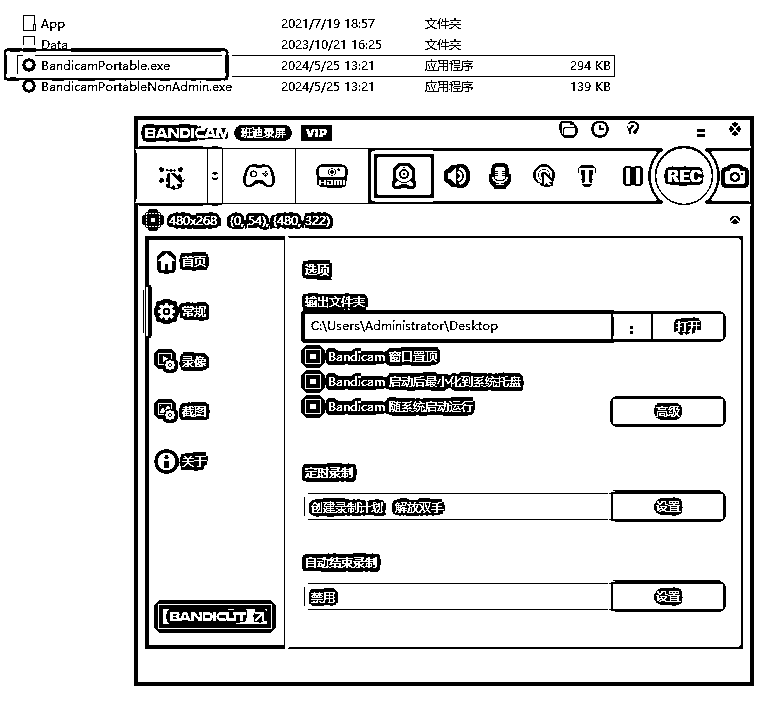

# 第44天涨粉2万+，AI自媒体账号的喂饭级教程

> 来源：[https://yf4niapxuw.feishu.cn/docx/V48OdFMHZoefIJxi6gscfclQnHb](https://yf4niapxuw.feishu.cn/docx/V48OdFMHZoefIJxi6gscfclQnHb)

你好呀，我是云珞。

第9天，我成为了AIP千粉博主，第30天，我成为了万粉博主，第44天，我的粉丝2万+。

什么是AIP呢？

就是AI自媒体博主，介绍AI工具的博主，科普AI工具用法，提高个人效率，打造个人IP。

做短视频，需要有一个大心脏。哪怕我坚持日更，做视频以爆款要求自己，但爆不爆，是平台说了算，是观众说了算，我只能尽到我最大的努力。

如果爆了一个视频，就会涨粉几千，平时不爆，每天也会涨粉几十、几百。

目前接了一个500元和800元商单。

我非常感谢林杰、一木、马克3位老师。

今天我向大家分享我写的AIP喂饭级教程，希望对大家有所启发。

# 一、写在前面

看这篇文章之前，你或许对AIP不感兴趣，或许你对AIP很感兴趣。

但我想的是，不论你做什么事情，都不能心急，要稳扎稳打的来。该付出的时间，必须付出。

我也是最近才理解了，慢慢来，比较快，这句话。

虽然我早就知道了“慢慢来，比较快”这句话，但我一直没有做到，总想快点拿到结果。我最近才真正做到了。

一开始，我做AI工具视频，也特别心急，比如，我做音频，我没有用自己的声音。

因为我之前学习过如何做游戏解说视频，买了一套200多的录音设备，学习过如何录音，但是，我很快就没有做了。

加上我之前录过一个短剧的教学视频，我发现，我本人的声音在录音的时候，会突然轻、突然重，当时花了我很多时间，录了很多遍，都没有录好，我就用了我的AI克隆声音，完成了短剧的教学视频。

我知道自己一时半会改不了，干脆用杰哥推荐的AI的声音。

AI生成音频后，虽然很像真人的声音，但需要二次剪辑。

我剪掉停顿比较多的地方的时候，我不听音频，直接看，看到没有音波起伏的地方，直接剪辑，剪辑完，也不听一遍，音频是否合适。

因为我赶时间。

后来，我发现这样不行。这样做出来的音频太差了。

现在我剪辑音频，都是一边听，一边剪辑。

剪辑完，还要整体听一遍。

不和谐的地方，再次剪辑。

或者某段音频不行，那就重新抽这段音频，重新弄。

有的牺牲，是必须付出的。就像我现在上班，早上我也不想起来，中午我也想午休。我超想把日更改成隔日更的。

但我早中晚一般会剪辑视频，我还是在坚持日更。我牺牲了午休的时间，中午赶去上班的路上我是真困啊，但必须用时间换取成果。

我写这个经历，是想告诉大家，成事从来不简单。

一开始，我剪辑一个1分钟多的视频，需要7小时，现在需要4小时。

现在我剪辑30多秒的视频，我只需要1至2小时了。

剪辑速度变快了许多。

# 二、制作视频

我是如何制作视频的呢？

先了解AI工具，再定选题，写文案，做音频，配画面，完成剪辑。

## （一）选题:到底要推荐什么工具

如果你想成为一个AI自媒体博主，最难的，就是选题这一关，市面上那么多的工具，你到底推荐哪一款AI工具呢？

每天我都会花25分钟至1小时刷AI相关的视频，看看近期视频有哪些爆款，分析他们为什么会爆，当我做完这个动作，遇到了那些好玩、有用的AI工具，我的选题自然而然出来了。

刷视频也是讲究方法的，需要时间投入的。

### 1、看巨量算数

#### 1）看关键词、看用户画像

你打开巨量算数（网址：https://trendinsight.oceanengine.com/arithmetic-index），输入关键词，比如，AI，AI工具，AI合集，AI排行，AI推荐。

然后看关键词指数、关联分析、人群画像。

比如，在关联分析中，分为搜索关联词、内容关联词，提到搜索AI的人也都在搜rain，其中马云最近搜索飙升。

你把鼠标放到马云这个词的红点上，就能看到很多AI。比如，马云：AI带来变革。你就可以去抖音搜索这个内容，去了解这件事情的始末。

点击人群画像，你就能看到，关心AI的人，到底在哪些区域，什么年龄段？什么性别？用户兴趣是什么？你就可以根据这些内容有针对性的做视频。

#### 2）从巨量算数找视频

你打开巨量算数，点击视频，输入关键词，比如AI，再点击搜索。

你就会看到很多AI相关的视频了。

### 2、看热点宝

你打开抖音，输入热点宝，点击去查看，点击抖音热点，点击视频，输入AI等关键词，你需要学习的视频自然而然出来了。

### 3、看抖音话题

你打开抖音，输入AI，点击话题，点击立即参与旁边的空白处，进入AI话题页面，看看综合、最新、最热、相似话题。

### 4、看一周内、半年内爆款视频

你打开抖音，输入AI，点击综合，点击这个像漏斗一样的图标，点击最多点赞，点赞一周内，就能看到近期热门视频了。

如果你想看更早的视频，可以点击最多点赞，点击半年内。

### 5、看AI公众号

你打开微信，输入AI，点击文章，点击最热，就能看到很多关于AI的文章。对于你喜欢的号主，你还可以点击关注，这样它出最新文章，你也可以留意到了。

### 6、看知识星球

如果你加入了AI相关的付费知识星球，也可以看AI相关的内容。

以生财有术为例。

你进入网页版（https://scys.com/search?query=zz8LD8ZUnw158c3YZtruXhdFKxvZe1UrHGjKTk964ZoqqbQEpm1N4N2），输入AI，点击精华和中标，就能看到很多有价值的内容。

### 7、把自己的一个账号养成AI号

你经常刷抖音，在抖音看AI相关的内容，遇到其他视频，就长按视频，点击不感兴趣，它就不会给你推荐其他内容了，你这个账号就成为了AI账号，给你推荐的视频全是AI内容。

## （二）写文案

当我定下我的主题后，我自己写文案，差不多要写几千字或改七八遍，然后定下一篇1分钟多的文稿。

后来，我写文案熟练了，修改二三遍就写好了，不像一开始要写七八遍了。

有时候我剪辑声音之后，时长缩水了。但是我还是有内容可写，我又会加一点内容，然后再做音频，凑够1分多钟。因为1分多钟的赛道竞争没有几十秒那么激烈。

不过，我现在我也不追求时长。有时候时长没有1分钟，就没有。

我推荐的工具，我会把它所有内容都看一遍，看看他们有哪些功能，看看他们的使用手册，使用他们的工具看看效果，对于我特别喜欢的功能，我会重点提。

一开始写文案，我会把它的所有功能的介绍写出来，然后再删减。

我介绍工具一般是：介绍工具名称+一句话概括工具亮点+具体介绍工具1-2个亮点或者如何使用。

如果该工具是清华等知名大学出品的，我会特意点出来。

如果工具是免费的，我也会在最后一句话介绍。

如果工具每天有免费额度，使用多了需要开会员，我就不会提免费。

## （三）做音频

AI音频如何做呢？

我用的是ChatTTS-UI-0.84。

分享文件：ChatTTS-UI-0.84.rar

链接：https://pan.xunlei.com/s/VOEbJeA_eARqy741Zvg_8D1cA1?pwd=74tz#

你先下载安装包，点击app，等待一会，它自动跳出了做音频浏览器页面。

你选你一个喜欢的音色。

当初，为了选出我喜欢的音色，我生成了很多音频，花的时间比较久。

后来，我发现了一个网站，可以直接听别人生成的音频，我听了很久，才选出了我喜欢的音色。

当时听得我都烦躁了，因为每一个声音不一样，但又有细微的一样，区别不是很大，都一样好听，太难选了。

选定音色后，每次做音频，我输入我的音色数字，设置好参数，输入文字，点击立即合成声音。

每次我会生成50至70个字，然后再生成下一句话。

音频生成后，我会剪辑掉没有声音的部分。

## （四）做视频

等音频处理好了，我再为它配上背景音乐、配上录屏的画面，画面是我写文案时，已经构思好了的，该转场的地方，加上转场特效，该给画面配上文字的地方，我配上文字，该加音效的地方，加上音效。

### 1、如何录屏

我用的是万兴喵影，开通了付费会员，我用它录屏后，它的视频会自动出现我的万兴素材框里。

分享文件：万兴喵影压缩包.7z

链接：https://pan.xunlei.com/s/VOEbKMf9t9Ep_CXOFtegokW0A1?pwd=harp#

如果你不能开通会员，我推荐这个Bandicam录屏，我以前用过，很好用，还可以设置自动跟着鼠标录屏。

通过网盘分享的文件：Bandicam录屏.zip

链接: https://pan.baidu.com/s/1V1h0iGUS7mS26B7y9nS2Mg?pwd=mjei 提取码: mjei

以前我用剪映比较多，先开始用万兴，我不习惯，后来慢慢剪辑多了，就习惯了。

### 2、如何找背景音乐

#### 1）搜索背景音乐合集推荐

你直接在抖音输入背景音乐合集推荐，有很多博主会推荐适合不同场景的背景音乐。

你直接打开剪映，点击音乐，输入音乐名称，把音乐拉下来，与你做的音频放到一起，听一听，这首歌是否适合你的文案和音频。

#### 2）用听歌识曲功能

如果你刷到一个视频，特别喜欢它的背景音乐，但你不知道这首歌讲什么名字，你可以用QQ音乐或者是网易云的听歌识曲功能。

以网易云为例。

你下载网易云App，长按网易云图标，点击听歌识曲，就可以识别音乐。

如果某些音乐实在是识别不出来，那你只能放弃了，或者直接问发视频的博主了。

### 3、如何做转场、加文字、加音效

你打开剪映，点击转场、文字、音频中的音效，然后添加，就行了。

我以前做过短剧去重的20三个方法，你也可以看看视频，里面讲到了如何加转场、加文字、加音效。

# 三、如何拥有好心态的方法

我现在为什么做AI自媒体，因为我努力没有卡点。

我做网盘拉新的时候，死号让我难受。虽然网盘拉新能赚钱，但能赚大钱，必须不断起新号，不用死号的，只能赚点小钱。或者说要等着热点来。

我做AI代写的时候，每次需要我主动鼓起勇气接单让我难受。

我是因为这2点让我难受的，才放弃的。

但我做2点并不是没有取得成绩，现在网盘拉新，我已经8周没有做了，依旧每周收入几百块。

我做AI代写，接2两单，交稿第二天钱就打到我的账户上了。

现在AI自媒体，没有让我放弃的点，我就一直坚持更新视频，每次做视频，都以爆款标准要求自己，发出去后，就不想了。

所以，你做AI自媒体前，必须想好，不能有卡点，别轻易放弃，不然只会浪费你的时间。

现在我对自己的要求是，一个月能爆一个几万赞的视频就够了。

# 四、如何变现

当你开始发视频，数据稍微好一点，后台就会有私信问你接不接推荐工具的广告，这样就可以变现。

抖音你可以开通星图，小红书你可以开通蒲公英，视频号你可以开通互选平台，这些都可以接广告。

除了接广告，你还可以做自己的课程，分销别人的产品。

当然，我做的是不露脸的工具号，如果你可以真人出镜的话，我还是建议你真人出镜做口播工具号，这种信任感更强，效果更好，剪辑更方便。

以我接的一个广告为例。

我加了商务的微信后，商务特别专业，评估了我的两个平台的账号，然后给了我500块，而且是一口价+合集。

我看了他们家的产品，试用了它工具。

我写好了文案，发给商务，文案通过之后，我又把我做好的视频发给商务看看。

视频很快就通过了，没有任何修改，当天我把视频发出后，500块就到账了。

整个过程特别丝滑，对方特别专业，而且要求也不高，没有让我修改文案和视频。

# 五、未来已至

AI可以让强者更强，节省我们的很多时间和精力。哪怕不做AI自媒体博主，光是了解这些工具，真的能够提高我的各种效率。

我很看好AI未来的发展前途。

这次做AI自媒体，我已经看到了我个人未来的希望了，也希望看到这篇文章的小伙伴也能做自己个人的IP，一起起飞。

最后，再次感谢林杰、一木、马克3位老师对我的指导。

感谢阅读到最后的小伙伴，大家一起搞钱，冲冲冲。

我在生财有术的往期文章链接：

1、手把手教你如何成为小红书小说博主

https://scys.com/articleDetail/xq_topic/184218548821282

2、我用生财教我的方法做短剧

https://scys.com/articleDetail/xq_topic/584514518515224

我在生财有术的往期视频链接：

如何做短剧推广视频

https://t.zsxq.com/OyV9W