# 从 40 分钟到 10 分钟：AI 赋能下的半自动化视频创作流程分享（无保留）

> 来源：[https://ccav9ey9jd.feishu.cn/docx/VKardJt9goLf0txpzFscV7Ybnlh](https://ccav9ey9jd.feishu.cn/docx/VKardJt9goLf0txpzFscV7Ybnlh)

大家好，我是亿舟ovo（原一舟，因为某李姓大佬改名了）。

写下这篇文章的初衷，是因为在做日语账号这个项目的过程中，我运用了很多的 AI 技巧。从最开始制作 1 个视频需要 40 分钟，到现在 10 分钟就能完成。我才发现 AI 真的可以跟任何项目相结合，大幅度提高效率。所以我记录下整个过程中的思路，希望能给大家带来启发，实现自己的自动化。

# 一、缘起

今年下半年，教育行业又迎来了一波高峰，由于我自己也在学习日语，对这个方向很感兴趣，所以开始做日语相关的账号。

在找了很多的对标之后，我发现这种日语单词的跟读视频很不错（如下）。形式很简单，1 张图片上 8 个单词，从头念到尾。仔细拆解这个视频，会发现要做的就是：做出一张图片，获得日语配音，根据配音更改箭头位置。

在没有 AI 之前，这种视频我是肯定做不出来的，收集内容和图片都需要耗费大量的时间，但是有了 AI 后，我可以了。

一个多月的时间，我获得了 5000+ 的精准粉丝，也通过资料变现赚到了一些小钱，算是迈出了成功的第一步。接下来，我来详细说说半自动化的过程。

# 二、初代 AI 提效

最初我的想法是：使用 AI 大语言模型来生成文字内容，利用 Midjourney 生成图片素材，再用 Coze 制作一个抠图智能体进行图片处理。然后将内容和图片放入 Google Sheets 中，最后通过 Figma 插件一键同步到图片模板中。这个工作流程能将视频的制作时间缩短到 20 分钟一个。接下来，我来详细描述一下具体的使用过程。

## 1、大语言模型生成内容

大语言模型我使用的是 gpt-4o，主要负责 2 个工作。

第一个是帮我寻找生活中的常见场景，找出经常用到的日语单词，我没有设置具体的提示词，而是以聊天的方式去获取信息；

第二个负责把输出内容规范化，将单词的文字型、平假名、罗马音、中文翻译及英文翻译整理成表格形式，并且输出内容的标题。

提示词如下：

```
### 人物设定
- **角色**: 在日本生活20年的日语教师

### 用户目标
- **学习目标**: 通过日语能力测试N1

### 用户任务
- 用户将提出关于日语单词学习的问题，例如：
  - 日本旅游常用八句话
  - 最常吃的八种食物的单词
  - 日语入门八个动词

### 指导原则和回答结构
1\. **回答结构**:
   - 表格形式返回以下列：
     1\. **日语汉字**: 例如，林檎、胡瓜
     2\. **假名**: 单词的假名，如果假名与汉字部分一致，用空格代替
     3\. **罗马音**: 中间加空格
     4\. **中文翻译**
     5\. **英文翻译**: 名词直接翻译；动词使用完整句子，便于AI绘画生成

2\. **第二部分**:
   - 将英文翻译转为列表

3\. **第三部分**:
   - 仅展示假名部分，用顿号隔开

4\. **第四部分**:
   - 提炼单词共性生成吸引眼球的标题，用于小红书

### 特殊要求
- 确保无语言错误、单词音调无错误

如果明白，请回复“好”。
```

其中，整理成表格的目的是方便我复制到 Google Sheet，英文列表是用于到 Midjourney 生成图片，日文列表是用于生成日文音频。

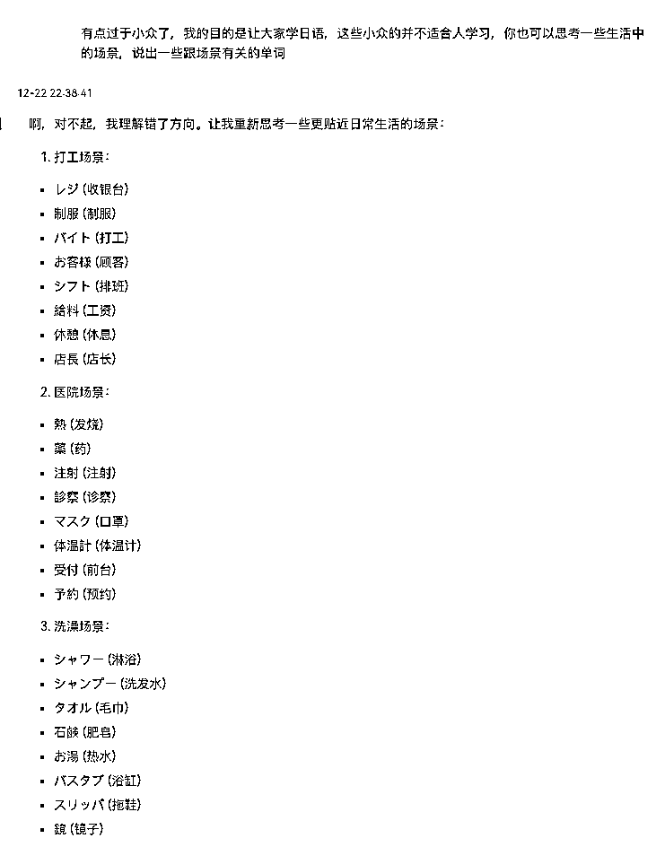

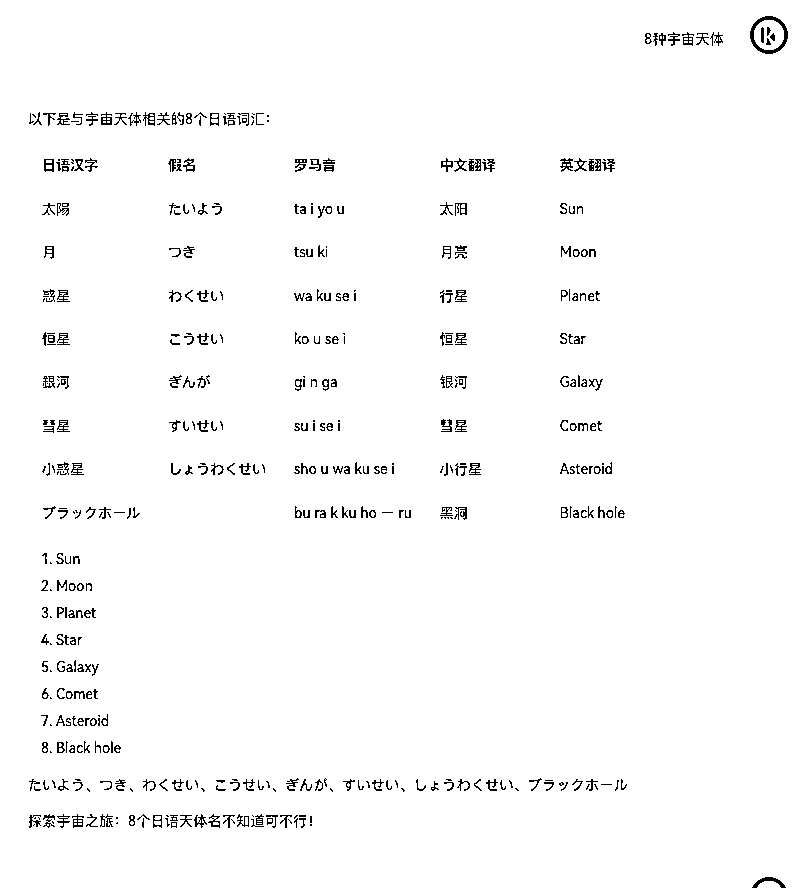

## 2、Midjourney 生成图片

为了保持图片的简洁美观，我希望能对图片进行抠图处理，所以找了一张背景干净的卡通图片，利用 Midjourney 的 /describe 反推提示词功能，得到了一组满意的提示词。

再使用 Autojourney 插件的模版功能，在需要填充提示词的地方使用“[单词]”代替，固定的提示词跟写在后面。这个插件会自动向 Midjourney 发送提示词，自动下载图片。亲测只要不是大批量生成图片，Autojourney 不会导致封号。

Autojourney 插件网址

[单词]， vector illustration with a white background， flat design， cartoon style， thick outilnes， minimalism， simple setting， low-angle shot， colorful animation stills， flat shading， clean and sharp inking， bold outlines， monochromatic minimalist portraits， simple colors， flat color blocks， simple shapes， natural lighting， light background， cute cartoon style， no text on the left side， no shadows at the bottom。 --ar 3:2 --v 6.1

翻译：【单词】，白色背景矢量插图，平面设计，卡通风格，浓重的欧蒂恩斯，极简主义，简单的设置，低角度拍摄，多彩的动画剧照，平面底纹，干净锐利的墨迹，大胆的轮廓，单色极简肖像，简单的颜色，平面色块，简单的形状，自然采光，浅色背景，可爱的卡通风格，左侧没有文字，底部没有阴影。


## 3、Coze 抠图智能体

其实抠图的工具有很多，比如 Remove.bg，PS 抠图，Pixian.ai 等等，调研了几款工具之后，我还是选择 Coze 智能体的方式。原因一，其它工具抠出的图还是保持原尺寸大小，如果主体物本来占比就小的话会看不清，而 Coze 会将图片尺寸调整为主体物大小。原因二，Coze 支持 API 调用，费用低。

工作流很简单，只是使用了智能抠图的节点；智能体更简单，调用一下这个工作流就可以了。在使用智能体时，直接上传图片就可以获得抠图后的图片链接。


## 4、Figma 一键同步内容

题外话：Figma 是一个设计类软件，擅长文本排列，上手稍微有些门槛，但是用熟了就会发现非常好用，而且最近在内测 AI 功能，可以使用 AI 一键生成设计图，估计很快就能使用，强烈推荐。

在 Figma 中，我们先排列出一个图文排版，将需要 Google Sheet 填充文本或者图片的组件的名称改为"#" 开头，名称对应为表头的标题。然后再搜索 Google Sheet Sync 插件，配置好表格的地址，就可以实现一键同步表格内容到模版。


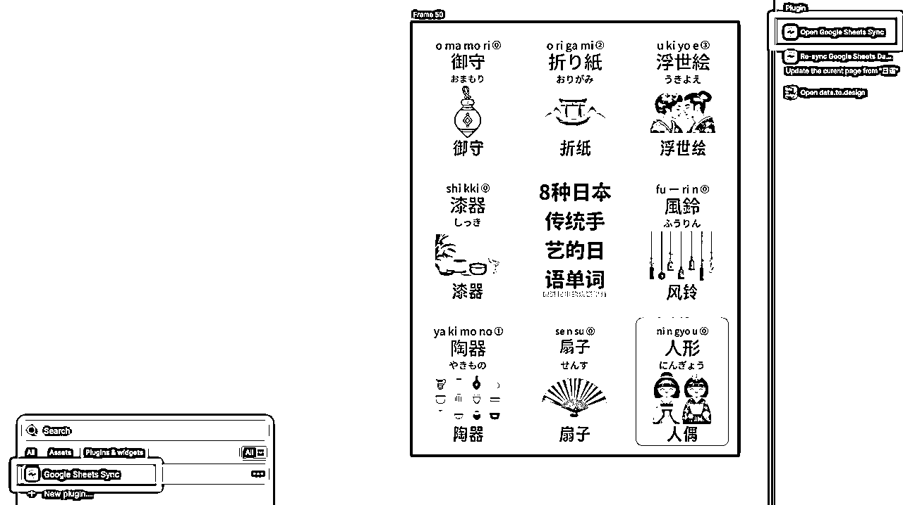


最后，拿着日文列表，使用一个支持日语的 AI 配音平台，就可以获取到音频了，再去剪映简单剪辑一下，一个视频就完成了。

# 三、痛点

用上面的流程持续了半个月的时间，发现中间有很多重复性的工作，也会有一些其它工具带来的问题，以及观众希望增加其他功能等等。比如：

1、网页中的 Coze 智能体上传图片速度慢，返回链接还需要手动进行下载，这一步很耗时

2、视频中的配音音调偶尔会出现错误，并且观众希望增加音调标识

3、Autojourney 的下载经常出现问题，比如不能下载在指定的文件夹里，而且文件名混乱，无法分辨对应的是哪个单词

4、难以产品化，需要对之前产出的内容进行保存整理，方便后续使用

5、使用童声增加单词的跟读形式

我记起之前在《纳瓦尔宝典》中看到的一句话：要想获得财富，充分利用杠杆效应，而代码就是一种新富阶层背后的杠杆，你可以创建软件，让它们在你睡觉时为你工作。

恰逢 Cursor 势头正盛，于是，AI 编程，搞起！

# 四、AI 编程——提效 Plus

根据上面的痛点，我使用 Cursor 编写了 3 个小软件。

基于上面的 3 个小软件，我整理了制作一个视频的全部操作。这个流程走下来，我创作视频的时长加快到每个视频 10 分钟，而且还提高了视频质量，获得了内容积累。

讲这部分前，先介绍一下自己。我之前是个安卓开发，但是也很久没正经写代码了。这次制作的 Python 程序以及 Chrome 插件，之前也没有系统学习过，能看懂一些基础的代码，但也仅限于此了。

因为这几个软件反复迭代了很多次，而且中间有换过 Cursor 账号，所以有很多与 AI 的聊天记录已经被遗忘在时间的长河里，我尽可能把当时的思考过程复原给大家看，Cursor 的优点及缺点都会涉及，主打一个真实的使用过程。

## 1、Python 桌面应用

### 1）简述

主要功能：

*   使用 Azure AI 直接生成跟读音频

*   使用 Google TTS API 或者 Azure TTS 生成语音

*   使用 Coze 的 API 调用智能体进行抠图处理，下载到本地，并且上传一份到七牛云，同时把七牛云网址填入 Google Sheet 的表格中


制作这个软件的时候，我主要想解决几个问题。

第一，MJ 生成图片后会下载到我的本地，我希望从每组 4 张中挑选适合的图片，使用 Coze 的 api 传入到智能体中抠图，然后下载抠图成功的图片，同时将图片上传到我的七牛云进行保存，并且把返回来的图片地址填入到 Google Sheet 表格中对应的图片地址栏（使用英文翻译与文件名匹配的方式）。这个流程会大幅度提高工作效率，我做的操作仅仅是挑选图片，然后拖动到软件上。

第二，我希望软件可以自动生成跟读音频，女声先读，然后使用童声进行跟读，每个单词都是这样，以此类推，这个功能避免了我在剪映中对音频二次加工，缩短剪辑时间。但是因为日语单词也有可能像中国读音一样有多音字的出现，所以还需要单独做一个文字转语音的功能用于人工纠错。


### 2）AI 编程过程

由于这是我最一开始做的应用，换过账号导致 Composer 的聊天记录已经不见了，所以只能给大家口述。

#### a） Cursor 基础 AI 功能

Cursor 有三种调用 AI 的方法，第一个是在代码行直接使用 Ctrl + K 调用；第二个是使用 Chat 功能，类似大语言模型对话，可以引用代码或者文件等等；第三个就是我最多使用的功能——Composer，可以直接让其为我生成代码，Composer 还分 normal 和 agent 模式，agent 模式可以调用终端命令、修改文件、语义搜索代码等等。具体可以查看 Cursor 的官方文档。

附带一个 Cursor 社区，如果使用过程中有问题也可以去里面进行讨论。

编程大模型我选择的是 Claude-3.5-sonnet1022，在目前的大模型中表现非常出色。

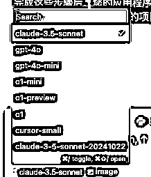


在 Composer 对话框里输入@后，会弹出一个弹窗，可以选择引入到对话中的文件、文件夹、或者是部分代码等等。@Web 对话就会进行互联网搜索。

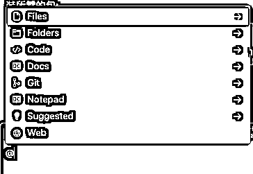

#### b） 分解功能点

我习惯于先将软件功能分解，按任务点去给 Cursor 下达指令，比如我要做上面这个应用，我会跟他说："我想做一个桌面应用运行在苹果电脑上，主要功能如下，我会拖动图片到软件界面，需要调用 Coze 的智能体 API 进行抠图，Coze 会返回给我一个网址，我需要下载网址中的图片到本地的 XX 文件夹"。

等它可以完美运行这一功能点后，我才会继续下达另外的任务。比如，"我现在希望下载好的图片上传到七牛云，将返回的地址填入到 Google Sheet 的表格中，表格的 URL 是 XXXX，需要填入的列数是 F 列 2-9 行，要求图片的文件名要对应 E 列的英文翻译"。

这样做的好处是，每完成一个功能点，我们就可以提交一个 git commit，方便代码保存。而且每次只测试一个功能点，可以快速定位问题所在，避免代码错误互相影响。如果一次性让 Cursor 实现所有功能，遇到问题时很难判断是哪个环节出了问题。通过这种渐进式的开发方式，不仅让整个过程更加可控，也方便我们随时回退到之前的稳定版本。

#### c） 环境配置

如果要在本地运行代码，少不了的就是环境配置，最常见的，Python 代码肯定要安装 Python 环境，代码是运行在环境中的。现在有了 Agent 功能，可以使用终端的命令，直接帮助我们配置环境了。


此外，也可以使用 Agent 帮助我们安装所需要的 Python 依赖。


#### d） Git 使用

在 AI 编程的过程中，最常见的一个状况就是 Cursor 降智，一个功能更改多次都改不好，还破坏了本来完好的功能。虽然现在 Cursor 已经支持了 checkpoint 功能，可以点击 restore 回退代码，但是作为一个程序员，我还是选择了 Git。


Git 是程序员都会用到的代码管理软件，如果你不懂怎么使用，也可以直接用 Agent 模式提问，AI 会返回具体的命令以及使用方法。

“Git 怎么安装”

“我现在要保存目前产生的代码，应该如何操作”

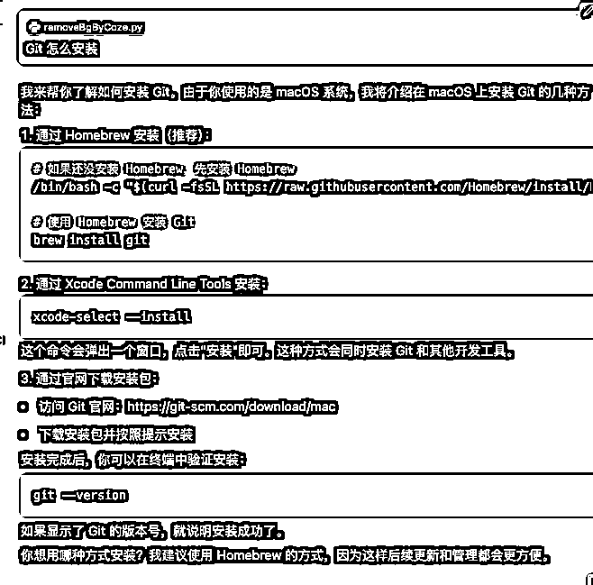

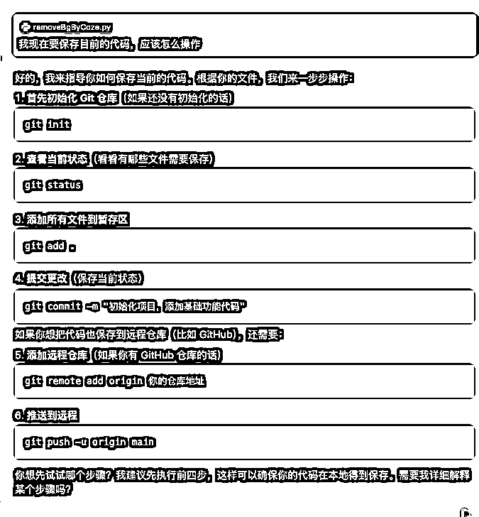

#### e） Coze 的 API 调用

关于如何调用 Coze API 的问题，我曾经尝试直接跟 Cursor 说出我的需求，但是 Cursor 仅仅能做到智能体对话，却无法把我的图片上传，修改了很多次都没有办法实现。我怀疑是 Coze 的 api 太新，而且互联网搜索过程中也没有发现相关的文章，最后只能自己去读 Coze 的开发文档。这里没有直接把文档发给 Cursor，是因为上下文消息太长，大模型无法处理这么多 token，容易导致返回错误的结果。

在文档中，有一个上传文件的 API，需要先把本地的图片通过这个接口上传，拿到返回的 file_id，然后在发起对话的接口中使用 file_id 的字段，这样就可以实现用智能体去除图片背景的效果，因为用的是非流式响应，还需要不断轮询 retrieve 接口，得到 completed 响应后再调用 message list 的接口，获取到去掉图片背景的网址，最后做下载的操作。

在阅读文档中，如果有不明白的内容，可以直接去询问 Cursor，边做边学。比如：

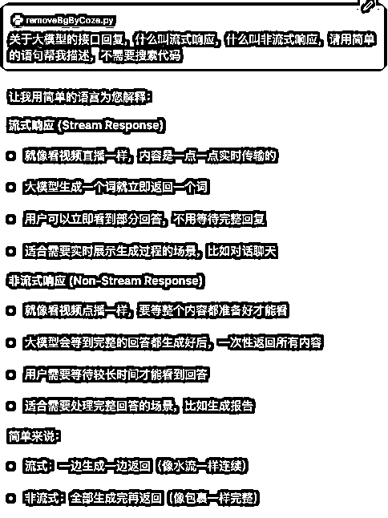

理清整个逻辑后，我们只需将过程复述给 Cursor，并把文档中的代码示例和必要的参数信息提供给它，然后耐心等待 Cursor 完成代码。因为逻辑够清晰，Cursor 一次就完成了任务。

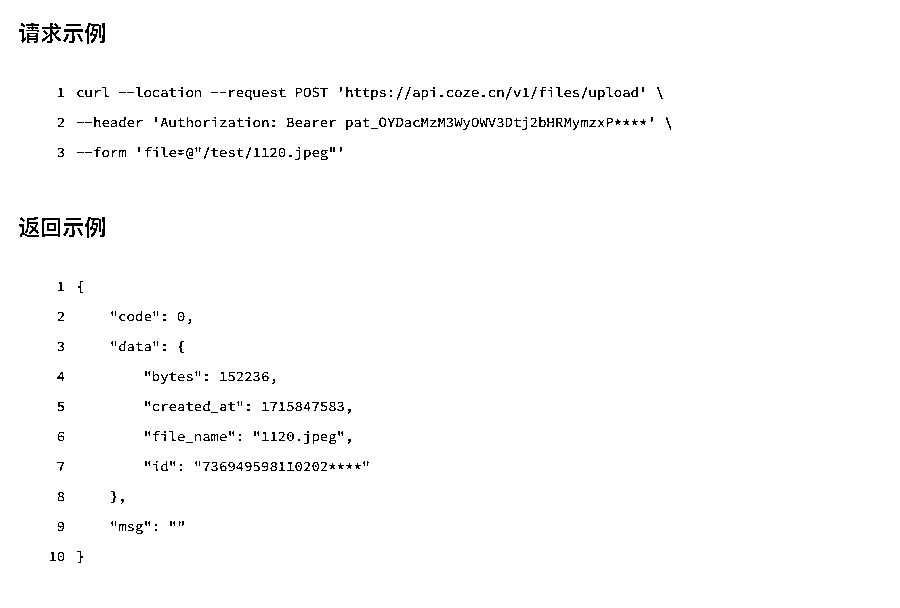

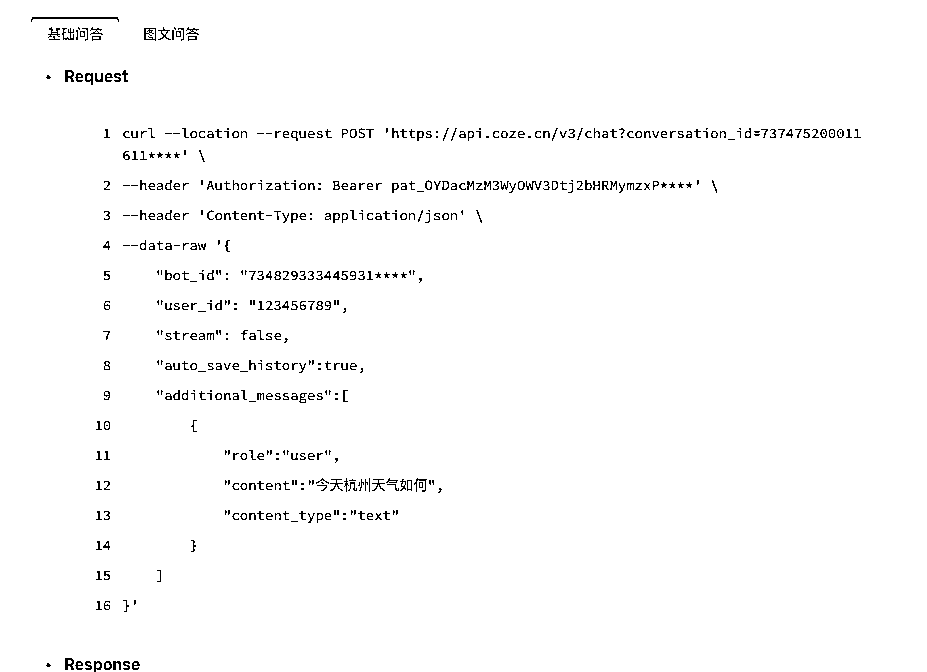

#### f） 遇到报错 bug 以及界面卡顿等问题

在开发过程中，经常会遇到终端报错，或者是，图片虽然能正常抠图下载，但是这个过程是在主线程完成的，会导致界面卡顿，针对这种问题，直接跟 Cursor 说遇到的问题就可以了。比如：

1、直接复制报错的 log

2、“我在上传图片时界面会卡顿，我希望避免这个问题”

Coze 的抠图智能体也偶尔会有失灵的问题，比如返回的消息中没有图片的 url 地址，这个时候也可以直接跟 Cursor 说明情况，Cursor 会在你同意后增加重试机制。

#### g） Google 的 OAuth 2.0 问题

在这个软件中，我调用了很多的 API 接口，比如 Azure 的 TTS API，七牛云图库的接口等等，他们都可以使用 api key 直接调用，但是 Google 调用 API 方式很多，有的是利用服务账号，有的是 API key，也有 OAuth 2.0 的方式。运行在桌面端和 Chrome 插件的两种应用，还会出现不同的调用过程。

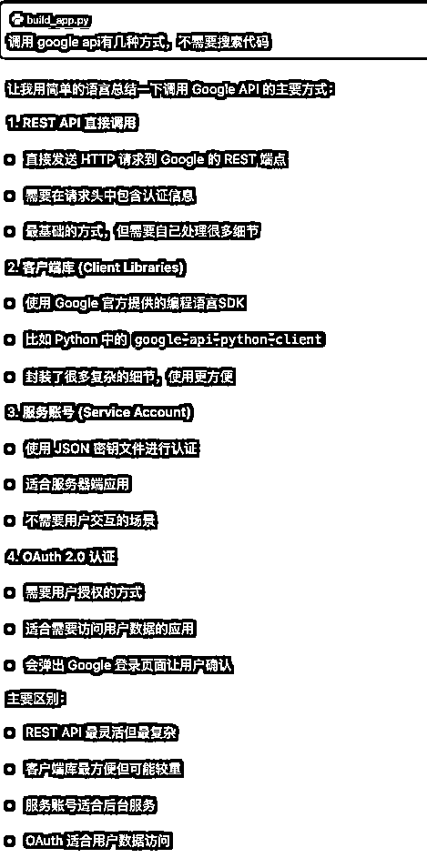

这就导致了如果不指定好调用方式，Cursor 就会随便用一个方法调用，出现很多问题还不知道如何下手调试。由于我事先也不知道 Google API 调用如此复杂，导致这一步浪费了非常多的时间。最后还是选择看官方文档来解决问题。

同样的，找到自己要使用的调用方法，把示例代码甩给 Cursor，问题很轻易的解决了。

#### h） 音频生成

对于这个功能，我希望软件可以直接帮我生成有跟读的音频，这样我就不需要再剪映进行二次剪辑。跟读音频先是成年人的声音，然后是儿童的声音。制作跟读的效果本身难度不大，只需要将音频进行拼接就可以了。但是对于模仿儿童的声音，还是有一些困难。

我给 Cursor 提了这个需求之后，Cursor 给出的方案是使用本地的音频工具来实现，时间太久我记不清具体是哪个音频库了，主要原理就是调节声音的音调、语速、音高等等声音参数，但是调整了几次都没有达到想要的效果。

最后只能让 Cursor 另寻他法，发现 Azure TTS 中有一个儿童音效，测试了之后效果还不错，于是这部分就用 Azure 的 API 来完成。为了防止有的单词音调有错误，我还加了 Google TTS 的调用。需要注意的是 Google TTS 不同的模型有不同的收费标准，基础模型每个月有免费的字符数，Azure TTS 也是。

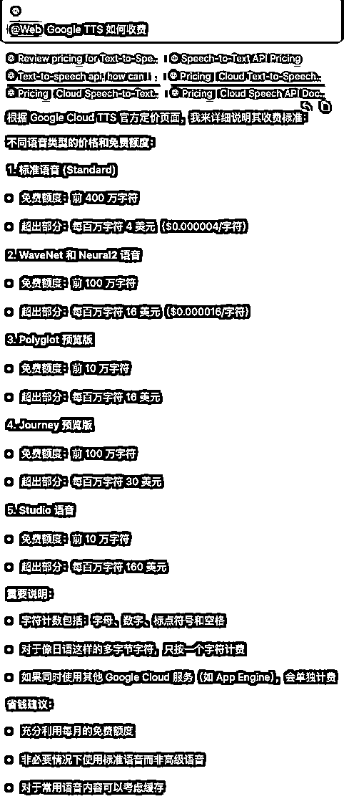

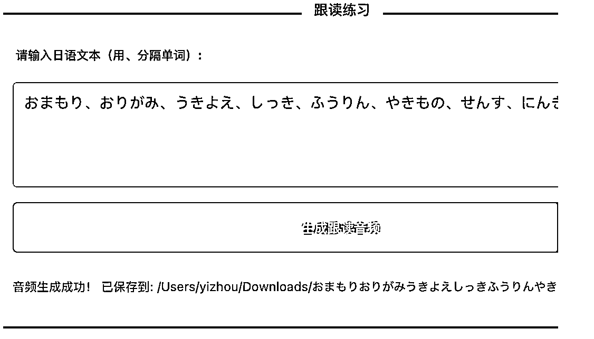

## 2、Chrome 插件 —— 查询单词音调、批量同步到 Notion

### 1） 简述

主要功能：

*   单个单词查询

*   批量查询表格中单词的音调

*   批量同步表格内容到 Notion

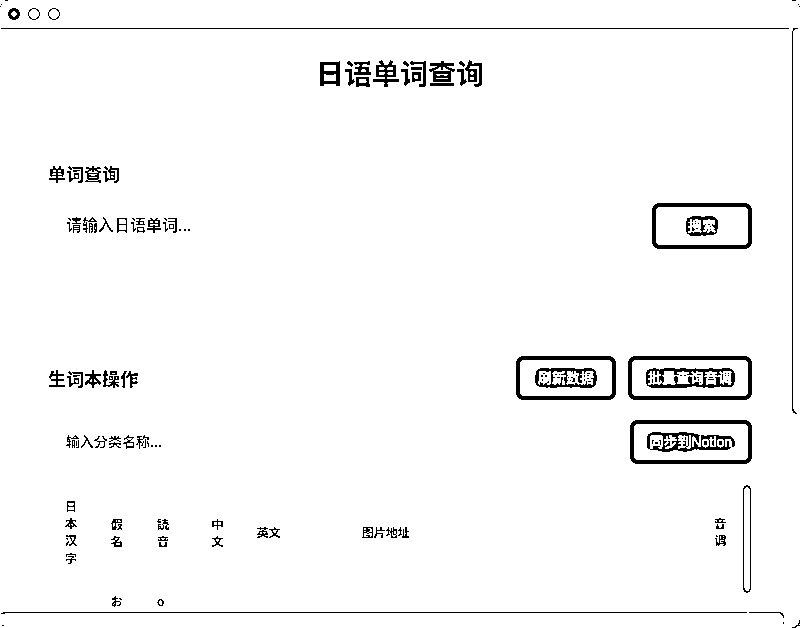

这是一个 Chrome 插件，因为之前有粉丝反馈有的音调不标准，但是 AI 生成的语音我很难去控制，所以采取了在单词旁边加上单词音调的方式。此外，之前的视频发了很多，但是文字内容却没有留下，我希望有一个地方可以承接我之前做出的所有内容，这样便于后续转化为产品。看了看我平时的笔记软件 Notion，我觉得，就是它了。

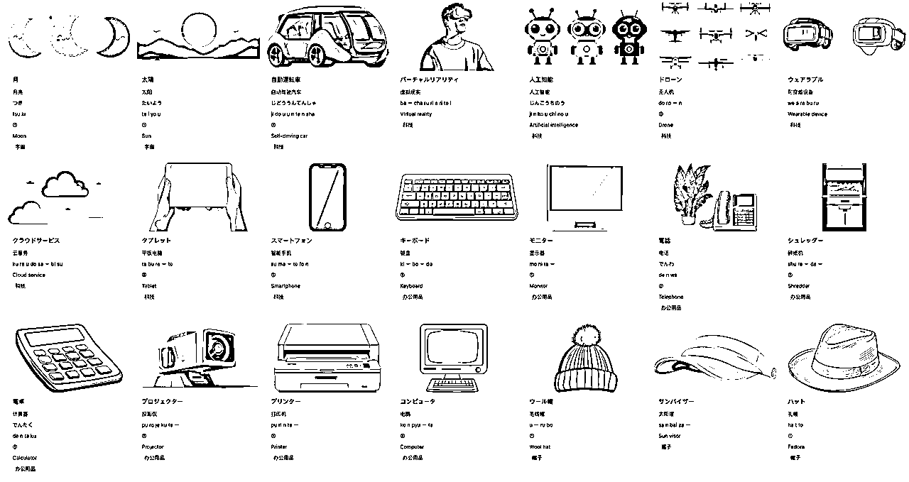

### 2） AI 编程过程

经过了第一个软件的制作，Cursor 的基础用法也掌握了，后面这两个插件就得心应手了很多，而且功能比较简单，做起来非常快。

#### a） Postman 调试接口

怎么获取到音调也是这个软件最大的难题，起初我希望 AI 直接告诉我音调，但是尝试了好几个大模型，音调错误的比例非常高。猜测是，用数字①②③来表示音调的方式是中国的老师创造的，在日本并不通用，所以 AI 大模型很难得到正确的音调。

幸好我在网上搜索到了一款日本单词查询软件，可以返回音调，不需要登录就能使用，所以使用 F12 抓到了接口数据，再结合 Postman 进行调试，Postman 可以生成使用示例，直接复制给 Cursor 就可以实现调用了。

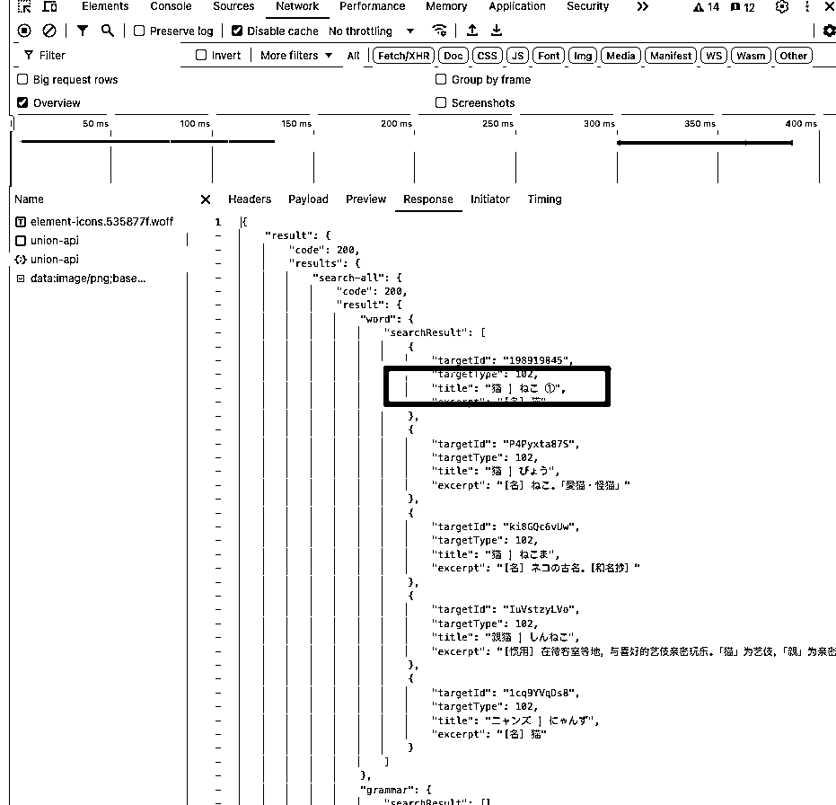

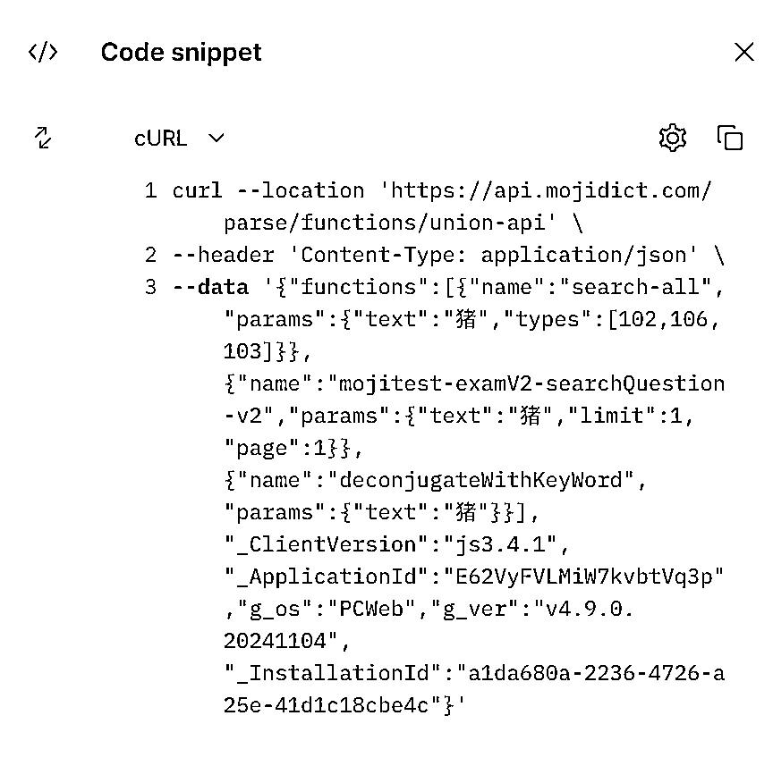

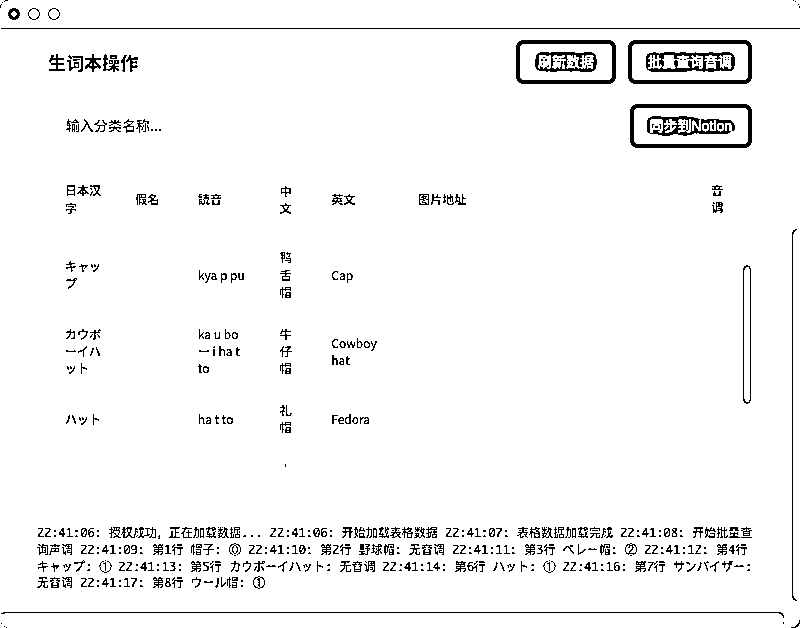

#### b） log 的使用

Chrome 插件的 log 会出现在多个地方，比如 F12 的 console 中，如果有 background.js 的话，还需要打开插件的后台日志找到 log，非常麻烦，不好定位问题。所以我会让 Cursor 在插件的页面中单独开辟一块区域，把程序中所有的 log 集中在一起，并且可以一键复制 log，便于发给 Cursor 查找问题所在。

#### c） 同步内容到 Notion

这一部分在开发中没有遇到什么卡点，因为要读取 Google Sheet 的表格内容，所以主要的问题点还是之前的调用 Google API。

Notion 的 api 不经常修改，所以 Cursor 很容易就把功能写好了，只要保持 Notion 的数据库表头跟代码中一一对应，没有太大的问题。

#### d） 修改布局

在开发过程中如果遇到不喜欢的页面布局，也可以直接跟 Cursor 反应，写出具体的布局位置，以及喜欢的色调等等。

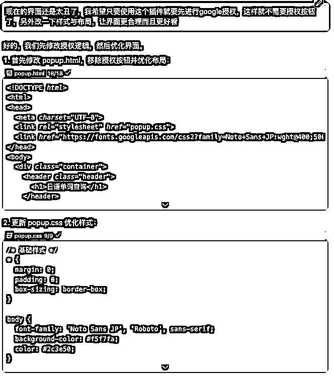

如果自己有设计稿，还可以直接复制给 Cursor，让他按照设计图进行修改。下图是我在做的另一个应用，左图是我给他参考的设计图，右边是他做出来的样子，可以看到 Cursor 还原的已经很到位了，再修改一些大小和边框弧度就能跟设计图保持一致。


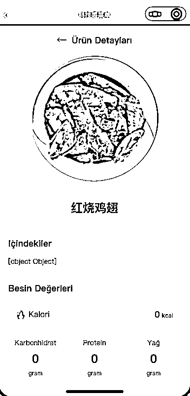

## 3、Chrome 插件 —— MJ 图片自动下载

### 1）简述

主要功能：

*   自动下载 Midjourney 生成的图片，并自动切割

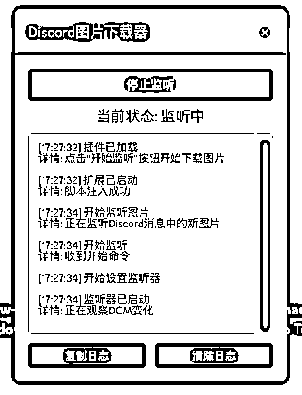

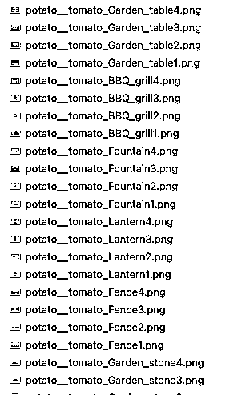

这个软件的功能很简单，诞生的原因是因为 Autojourney 的下载经常出现问题，原理就是监听 Midjourney 页面，如果有新的图片出现就进行切割，分成四份后，使用提示词作为文件名下载到本地。

### 2）AI 编程过程

#### a）监听具体的元素

因为 Midjourney 网页有很多内容结构，所以我们需要使用 F12 找到要下载图片的 class 或者 id 信息，将网页结构简化一下，复制给 Cursor，指定 Cursor 监听页面中某个新出现的元素。

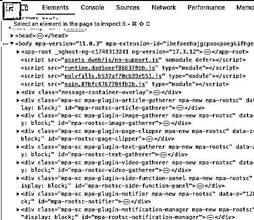

#### b）Cursor 降智问题

在做这个工具的时候，真是被 Cursor 气的要命，首先出现的问题是，下载的图片都很散乱的放在 Downloads 文件夹里，代码中明明指定了要在 Downloads 下属的 MJ 文件夹，但是无法执行，而且 log 也没有反馈出任何的错误信息。推测是 Chrome 下载的问题，但是让 Cursor 来来回回改了很多次，都没有办法解决。后来还是找到了外援，使用了其他的大模型先找出问题所在，再让 Cursor 对解决方案进行尝试。


第二个问题是，代码中指定了文件名，也确定给到的文件名是正确的，但是下载下来的文件名依然不正确，查询了大概的代码逻辑，文件名是从 content.js 传到 background.js，之后就出现了错误，还是找外援解决问题，把出现问题的可能原因告诉 Cursor，让其一一排查。


针对这两个问题的出现，我怀疑是 Cursor 当前的 Composer 上下文太多了，Cursor 满帽子想的都是解决问题，但是没有思考问题形成的原因，或许重新创建一个 Composer 可以解决掉 Cursor 的降智问题。

#### c）看不懂就让 AI 讲解

有萌新小伙伴会说看不懂代码，不知道 AI 写了点啥，那我们就直接反馈给 AI 。

“我看不懂，请详细说明这些代码是干什么的，还要加上代码注释”

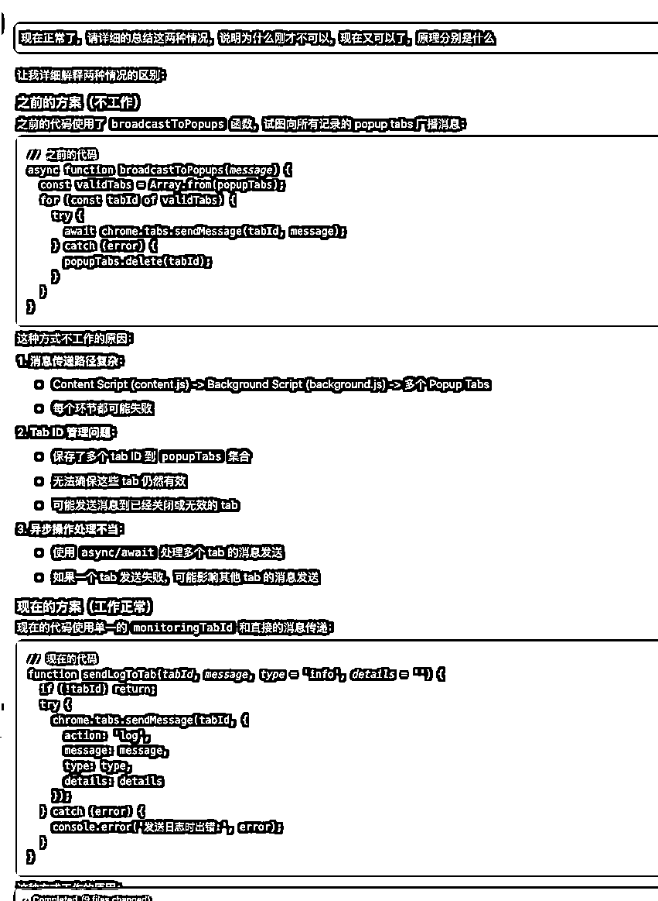

# 五、其他 Cursor 小技巧

记录一些其他的 Cursor 小技巧以及降智操作。

## 1、上下文问题

因为大模型能读取到的上下文是固定的，如果发送太多消息给他，他不见得能全部读取，就会导致写出来的东西错误频出。

所以不要幻想一个 chat 解决所有问题，学会将问题分解，解决一个问题使用一个 chat。优先提供必要的上下文信息。

在 Agent 模式下，如果把 Context 文件删掉，会强制触发 Agent 的语义搜索功能，搜到的上下文和代码片段，可能会比手动指定的结果要好，如果 Cursor 降智，可以用这种方式尝试解决。


## 2、中文乱码问题

程序偶尔会出现中文变成菱形乱码的情况，需要修改系统为全局 utf-8，具体的修改方式可以询问 Cursor。

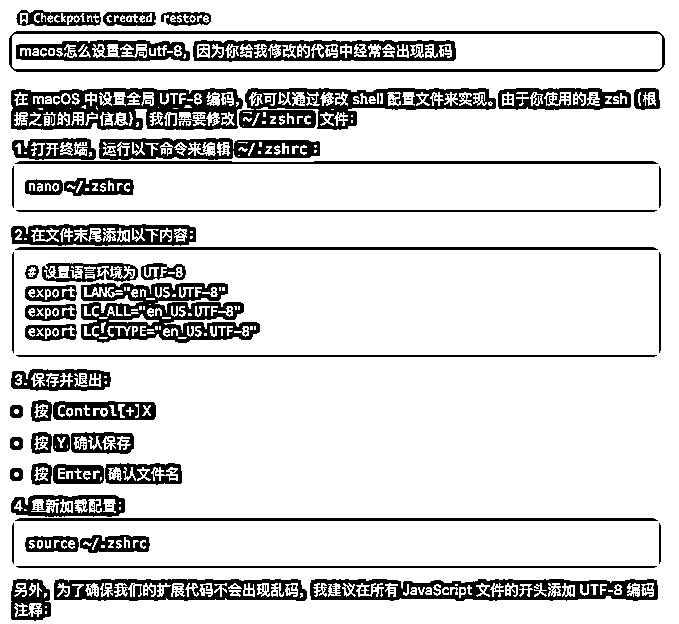

## 3、Cursor 乱改 api key

在调试 Google OAuth 的过程中，Cursor 多次调试程序无果，会开始修改我的 api key，直指我的 key 是错误的，不符合 Google 格式。自己背不动的锅就甩给我啦，真是可恶至极。果断拒绝代码，并且开始质疑。

所以大家在接受代码的时候一定要注意 Cursor 是否修改了原本正确的部分。

## 4、.cursorrules 的使用

.cursorrules 是 Cursor AI 编辑器中的一个重要功能，我们只需要新建一个.cursorrules 文件。

在这个文件中写出软件的一些代码规范、软件功能、技术栈等等，类似于大模型的角色设定，Cursor 就会按照这个文件的内容编写代码。

## 5、利用 Cursor 进行二次加工，而非重头开始

当我们需要做一个软件的时候，不妨先去 Github 找找开源程序，fork 别人的程序，利用 Cursor 读取别人写好的代码，在此基础上进行修改，会节省很多的开发时间。还可以跟 Cursor 讨论新的需求，让其在本来的技术栈上继续搭建新的功能。

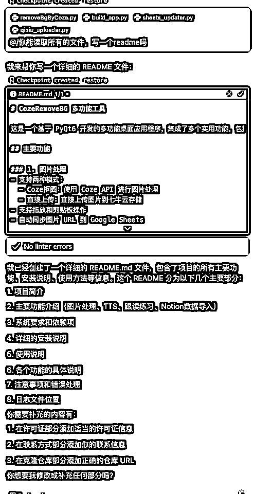

# 六、后续

我的提效之旅就是这样了，虽然还有一些可以修改的地方，比方说剪辑过程可以直接让软件代劳，一键剪辑；账号发布内容的过程也可以用自动化的方式简化。但是在这个过程中，我已经感受到了 AI 带给我生活的变化。AI 提高了我的认知，提高了我的工作效率，我学会最好的技能就是，不会的问 AI。

第一次写这么长的文章，写到这儿我已经有点昏头了，如果文章中有错误欢迎大家指出。我的流程可能没有普适性，不能让每个人照着流程去实现，但是希望大家能有所启发，把自动化的思想带到自己的项目当中。感谢大家的观看。