# 潜水四年，我做了两个千万用户级别的K12教育项目

> 来源：[https://yxlg5m8r086.feishu.cn/docx/WSz3dKv2nodwOOxELAkcFaYVnJg](https://yxlg5m8r086.feishu.cn/docx/WSz3dKv2nodwOOxELAkcFaYVnJg)

各位圈友大家好，我是十一，深圳一家教育科技公司的创始人，专注中小学教育赛道（非教培，不受双减政策影响），公司目前先后做了两个千万级用户的项目，分别对应中小学老师群体和家长/学生群体。

21年加入生财到现在已经快4年了，除了发了几条资源对接的帖子外一直在默默的潜水。生财对我而言更多是一个了解新玩法的前沿阵地，在生财里看到了很多大佬的分享，受益匪浅；也跟几个圈友进行了或深或浅的合作，拿到了一些结果。

公司去年开了一条新的业务线，一年多的时间也从零做到了千万级的用户数。这个项目可玩性和上限都很高，我们尝试了很多新的玩法：分销、知识付费、引流、低转高、社群等等，有些拿到了结果，有些只是跑通了链路但还没有精力去规模化。我把之前的尝试做了个梳理，算是抛砖引玉，欢迎大家多跟我交流，希望能链接更多有资源、有能力的圈友一起放大。

# 关于公司

我本身是程序员出身，所以公司整体的调性偏产研：简单、务实、高效，公司的产研能力得到多个合作方的赞誉，今年公司拿到了国家高新技术企业的认定，也从官方层面认证了我们的产研实力。

虽然现在相比项目初期来说用户和营收规模都取得的大幅的增长，但我一直都抱着创业初期的心态：多跟圈内圈外的高手交流，找到更多新的玩法和增长点，绝不能闭门造车，很多玩法都是跟生财的圈友交流出来并合作落地的。

# 关于产品

教师端的的业务线比较稳定这里就不展开了，主要讲一下家长/学生端的产品。上面提到过，公司有很强的产研基因，再加上为了规避双减政策的影响，我们决定从高效学习工具类产品切入C端家长用户，从23年年初开始陆续推出了6款微信小程序产品，涵盖语文、数学、英语、学习资料、名师课堂等学科和内容。

选择小程序作为产品的主阵地主要出于两方面的考虑：一是便捷，省去用户下载APP的步骤，即点即用；二是裂变，小程序根植于微信生态，可以充分利用微信的社交属性带来大量的裂变，这也是我们短短一年时间快速积累了上千万用户的关键。

🎈产品用户数

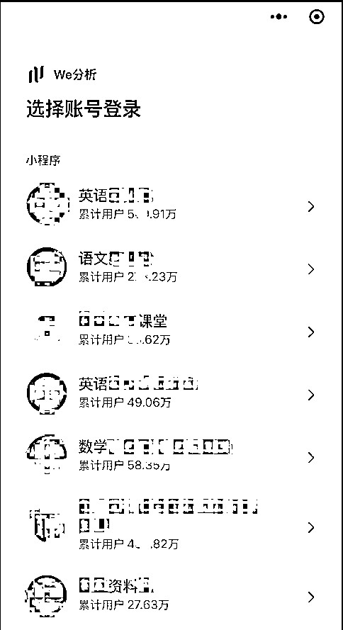

在教育行业里做了不少年头，初心还是有的。我们的产品没有接任何的三方广告，包括开屏广告。我也是家长，不希望自己的孩子用手机学习时莫名其妙的打开一些与学习不相关的广告，看到不该看的东西，影响孩子的学习和成长。

产品做好了，钱不会少赚，很长一段时间我们只有一名客服，就是产品总监。用户给我们提了很多好的建议，我们也不断打磨产品，所以产品的口碑也越来越好。

🎈部分用户好评截图

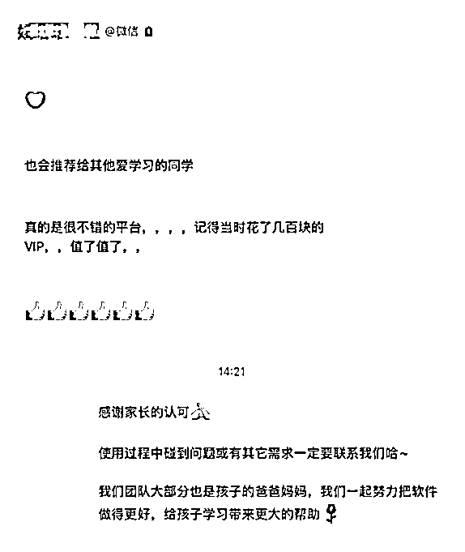

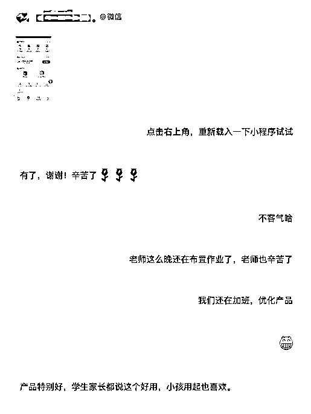

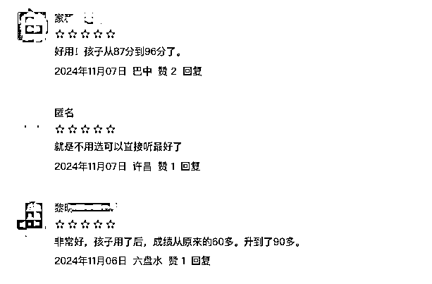

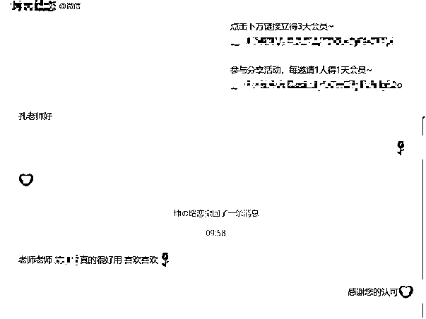

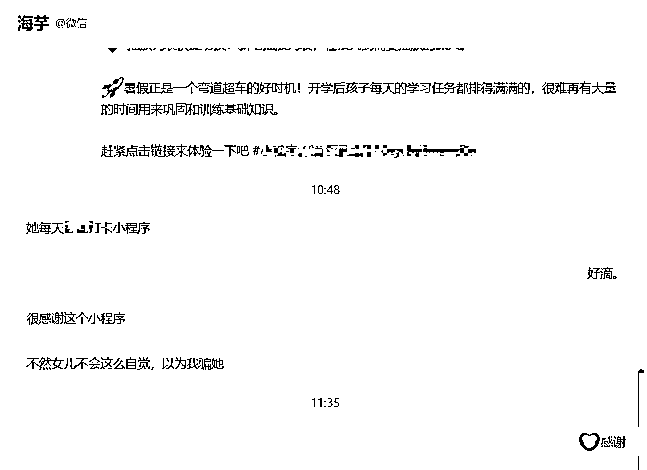

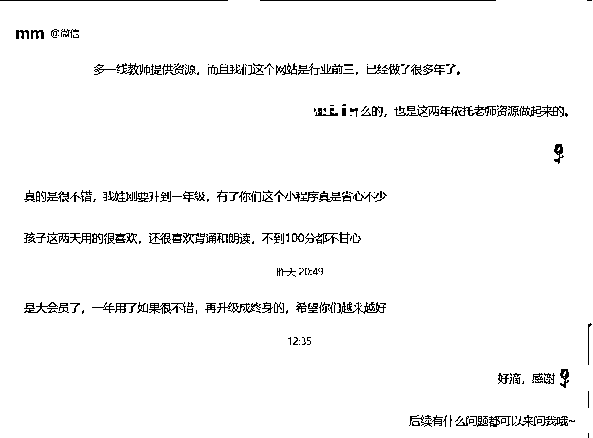

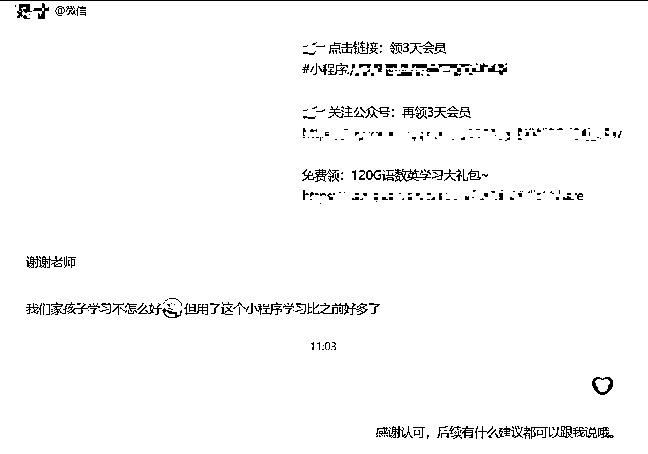

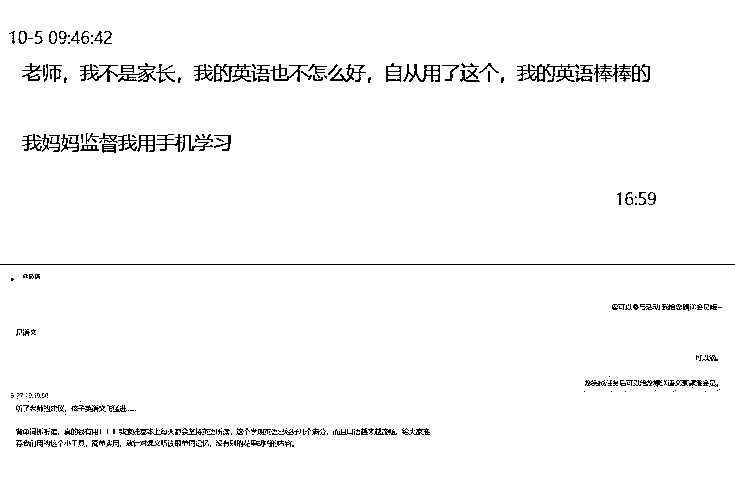

# 关于玩法

产品上线初期我们就自研了一套分销系统，下面所讲的所有玩法都是基于分销系统衍生出来的，所以我先讲一下这套分销系统的基本逻辑：

一、分销层级：为了规避政策风险，分销员只能发展一层下级，数量不限。

二、客户绑定：开通分销权限后，分销员将矩阵中任一小程序的小程序卡片/短链接/二维码分享出去，用户点击或扫码进入小程序即绑定成分销员的客户，客户在矩阵中任何小程序下单分销员都可以拿佣金。

三、无限裂变：分销员的客户将小程序分享给其他人，其他人点击或扫码进入小程序，也会即时绑定成分销员的客户，这些客户再分享，其他人点击进入小程序，也会即时绑定成分销员的客户，无限裂变。（我们在引导用户分享上面花了很多的精力，目前有40%+的用户有分享行为，裂变能力超强。）

## 基础玩法

刚开始我们的想法很简单，就想充分利用教师端业务积累的千万老师用户来触达家长，用分销佣金作为利益驱动。实际跑了一段时间后效果不太理想，主要还是政策的原因：老师群体相比于其他群体来说职业生涯更稳定，现在各地对于师德方面管控比较严，大部分老师不愿意冒着丢饭碗的风险做分销，且主科老师工作强度比较大，业余的时间不会太多，有时间有想法且已经再做副业的老师做都比较稳定，不愿意再多新的尝试。

这条路没走通，我们索性将门槛降到最低：纯素人，不限行业，不限资源，有手就行。看到这里大家可能会有这样的疑问，没有资源没有流量怎么可能赚钱？是的，每个人都有微信好友，也加了不少微信群，但这些很快就会消耗完，既然是推荐好用的产品给身边的人，总不能每天都推荐吧？发几次朋友圈，群里面丢些素材不就没得发了吗？

这个问题是我们碰到的第一个瓶颈，团队小伙伴每天都在做各种尝试，最后还是我在生财里找到了答案。

我看到 @华聪 发的找群的文章👉全网精准找群渠道分享，感觉打开了新大陆，马上就安排小伙伴测试：花半天的时间在微信搜索里找到并添加了100个群，接下来的3天内在这些群里分享我们的小程序，也不多说，就把用户的学习报告发到群里，有人问就聊一下，管理员要撤回的话过两分钟再回复，说是还是交作业发错了，被踢了也无所谓，不被踢的话过两天再发一次，观察了2周的数据，直客+裂变3000多人，产生了3000+的充值（非佣金），这个账号后续一直在裂变，也一直在出单。

于是我们先将这套打法固定下来，就利用微信搜索和线下的方式找群，沉淀了第一版的教程。

🎈初版教程截图

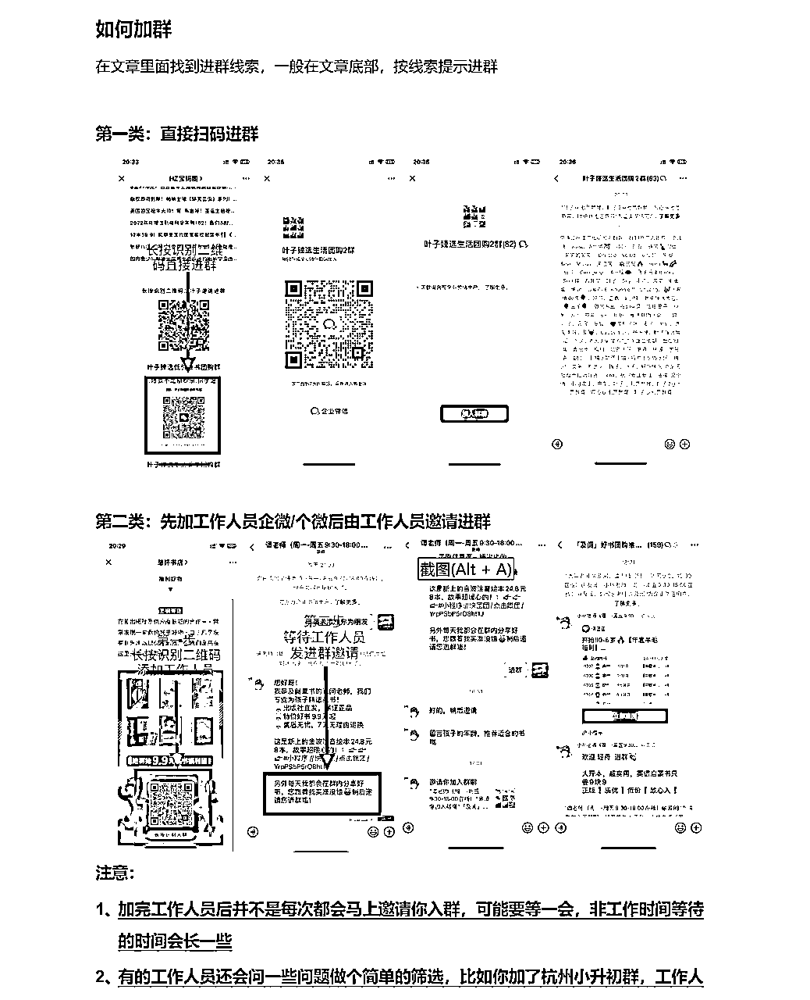

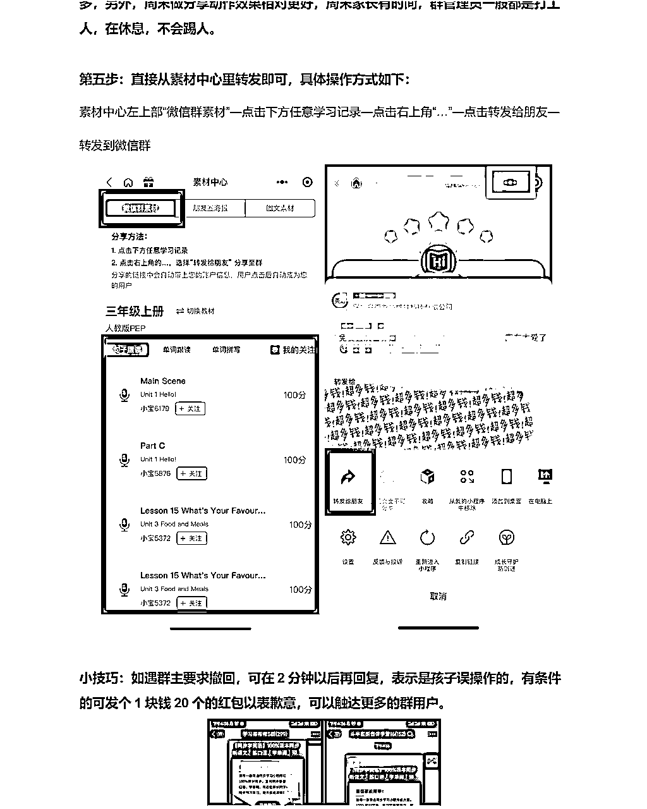

门槛降低后人就多了起来，有的分销员找到了新的玩法之后会跟我们分享，我们安排测试后符合低门槛高增量原则的我们就推广给其他分销员，陆续新增了教培机构APP加群、小红书找群、抖音找群等方式，流量来源更加丰富。

🎈新版教程截图

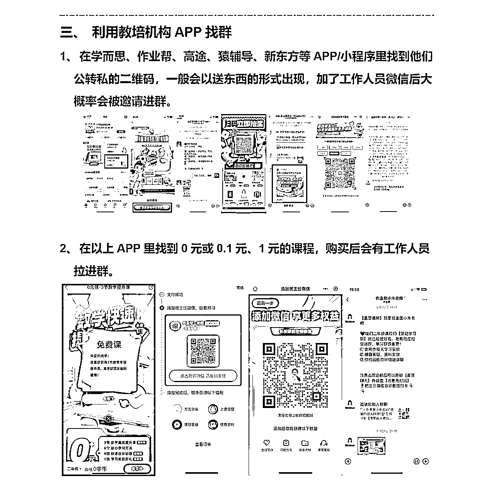

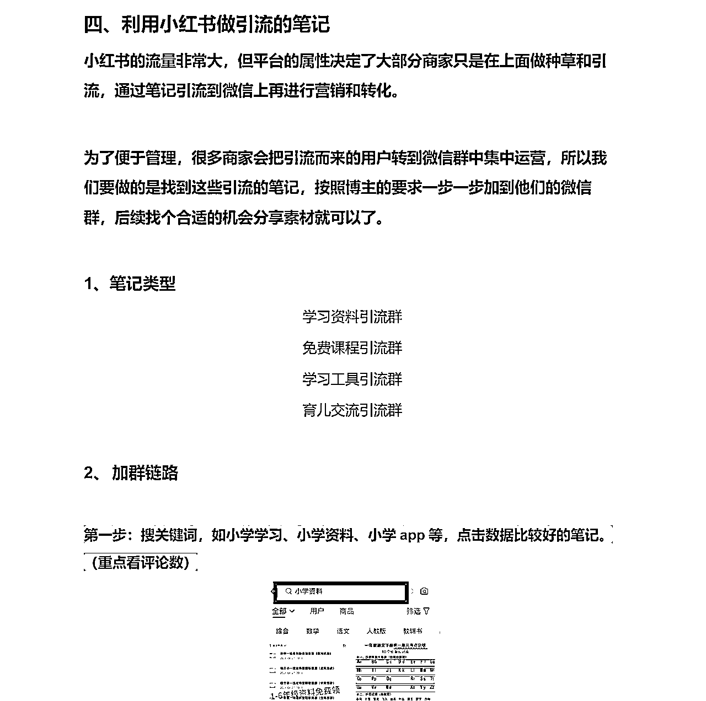

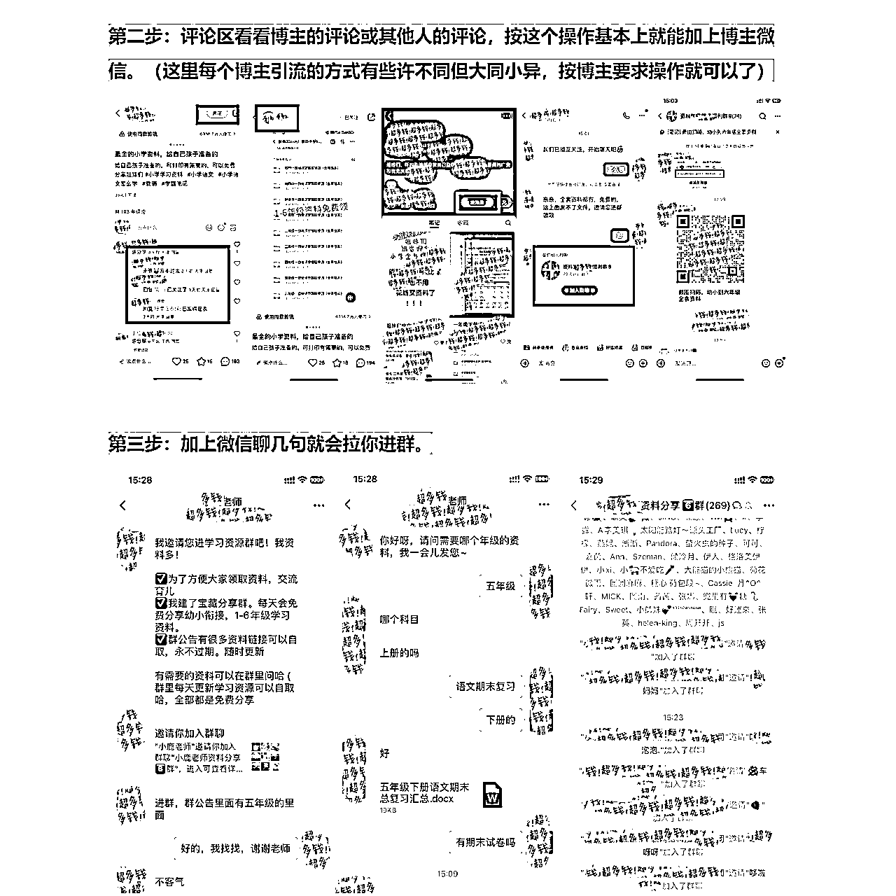

分销员的队伍越来越大，形形色色的人都有，有的人拿到了结果，有的人浅尝辄止，总体还是符合二八定律的。

拿到结果的主要是两类人，一是宝妈，二是大学生。我们后来分析，宝妈关心教育，懂得客户的需求，大学生时间多脑子活，一旦拿到结果很也容易把身边的同学、朋友带动起来，获得更多的二级分佣。

🎈分享两个典型的案例：

📌案例一：两孩宝妈，有正常工作，有空就找找群，没空放着不管，不到一年时间1万8的收益。她家在湖南一个小县城，每个月的工资不到3000，这笔收入对她来说算是抵得上上班半年的收入，上个月还专门寄了两箱家里种的橙子给我以表达谢意。

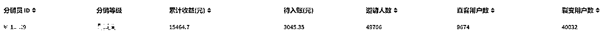

📌案例二：安徽大二学生，今年暑假开始做的，刚开始还各种怀疑，开学高峰之后直接起飞，4个月的时间佣金差不多小1万，相当于每个月多了2000多的生活费。开学的时候每天拉着我聊心得，十月份还拉了他们十几个同学一起做。

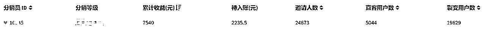

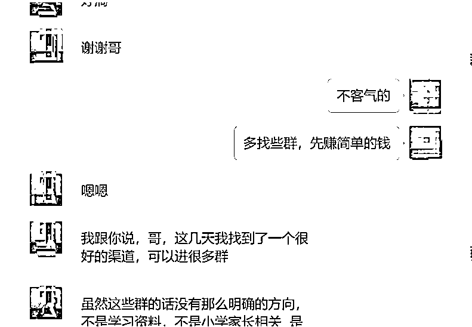

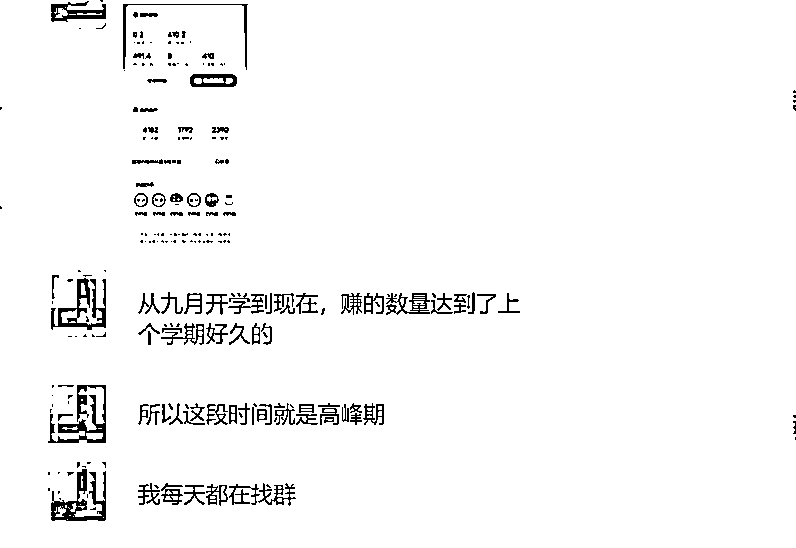

有一些手里有资源的分销员，比如有教育类公众号的，有学校资源或家长资源的，做的也还不错。

🎈先看公众号的：

这个深圳的兄弟吃了一波疫情的红利，做了几个大号，但赢利点很单一，就是接广告，现在公众号广告收益也断崖式下降。他之前跟别人合作被骗过，刚接触时各种怀疑，各种谨慎，后来来我们公司看了一下，回去就开始干。这是他其中一个号的数据，还有五个号加起来也有近30万的佣金。最近把直播和私域的玩法也教给他了，现在正忙着招人放大。

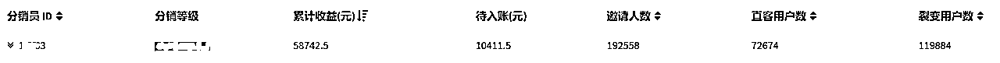

还有一个兄弟之前利用业余时间做了个教育账号矩阵，现在整个大环境一般他也没有精力再维护，我跟他说放着也是放着，挂个菜单和欢迎语也花不了太多时间，这才开始做。很高冷的一个兄弟，发消息起码两天才回复，语音从来没接过，赚钱都这么随性。

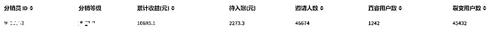

🎈再看其他有资源的：

一些教培的校长和老师，双减之后压力很大，利用自己的人脉让其他老师分享，不用每天盯着，也不用推销，自然出单。

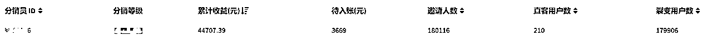

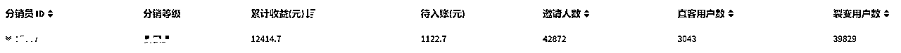

📌做个小结：

1、小程序的裂变能力很强，后台统计的所有分销员平均直客人数：裂变人数约为1：4，如果推荐的是精准家长用户的话，可以做到1：10，有资源的可以做到更高，上面展示的收益图里有这个数据，大家有兴趣可以往回看一下。

2、平均一个用户产生的佣金在3毛左右，看起来不高的原因是有很多泛流量点击。举个例子：分销员把小程序分享到小区群，里面可能有30个人点了，但实际只有5个是家里有小孩的，只有这5个用户才有可能去做裂变和转化，但后台数据还是统计的是点击的这30个人。如果是精准流量的话可以做到0.8-1元。

3、大部分半途而废的主要是想赚快钱的人，我们的产品里面有一个设置：新用户前三天是可以免费使用付费功能的，不用做任何动作，用户完全无感。这是我们反复测试过的，如果用户进来就卡会员，那么流失率和转化率都会大幅下降。大家换位思考一下，如果有个产品，你第一次听说，连功能都没怎么体验就要付费，那么你大概率选择放弃这个产品。基于这个逻辑，我们的理念是让用户先用起来，多体验功能，我们对产品有信心，转化数据也验证过了。所以这个产品不是强转化的逻辑而是自然转化，想赚快钱的自然做不下去。我们一直跟分销员强调，刚开始做的时候只需要关注邀请人数这一个数据，等这个数据量上去了订单自然来了。

4、基础玩法适合素人个体以兼职的形式去做，只是一个副业而不是主业，更谈不上指望这个暴富。我们对分销员的画像就是每个月能有500-2000副业收入就觉得很不错的人，所以三四线城市的宝妈和在校大学生是最符合这个画像的。

## 进阶玩法

生财的圈友大部分还是希望能暴富的，所以接下来我讲一下基于分销系统而产生的进阶玩法，有些我们拿到了不错的结果，有些只是把链路跑通了但没精力放大。

❗❗❗想要暴富的圈友可以重点看一下，有资源有能力的圈友可以一起放大。

### 获客系统

去年下半年跟重庆的圈友 @李汉中 勾搭上了，这个兄弟96年的，已经操盘了2个6000万+营收的项目，行业跨度比较大。当时他也是在做教育项目，英语赛道高客单价产品，主要是找个体加盟商。期间我们聊了很多的合作可能，最先落地的是获客系统。

他们的加盟商有两种盈利途径：一是直接终端销售给有需求的家长，二是招下级加盟商。由于客单价和加盟费都比较高，注定B端和C端的量都不会太大，那么流量问题就成为了这个项目再上一个台阶比较关键的因素。

我们为他量身定做了一套获客系统，简单来说就是在分销系统的基础上加入获客功能，把我们的转私入口转给购买获客系统的加盟商。

这样下来加盟商一是增加了C端的流量，另外还可以通过这套系统去做B端踢单，让一些没能力搞到流量的人也可以低门槛的做项目。

🎈获客链路

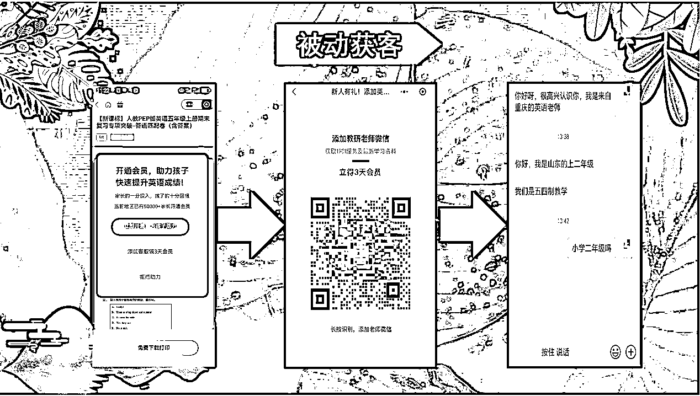

做了两场发售，覆盖了2000多个加盟商，客单价2999，共出了800多单。

🎈部分订单：

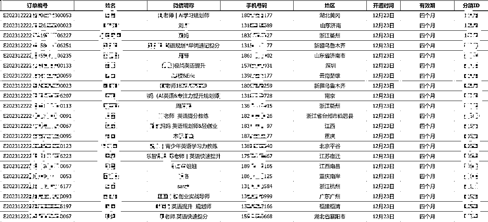

🎈发售会PPT：

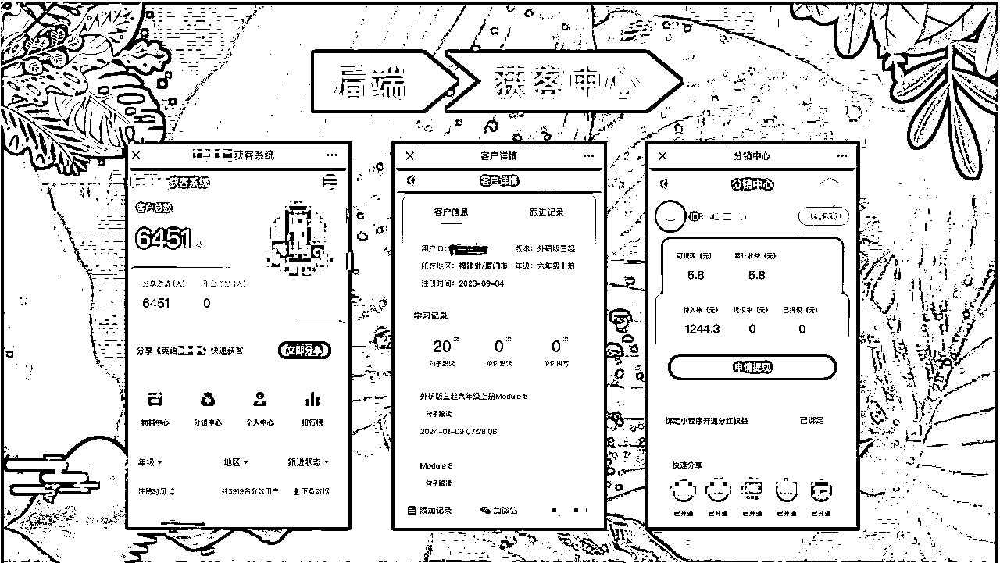

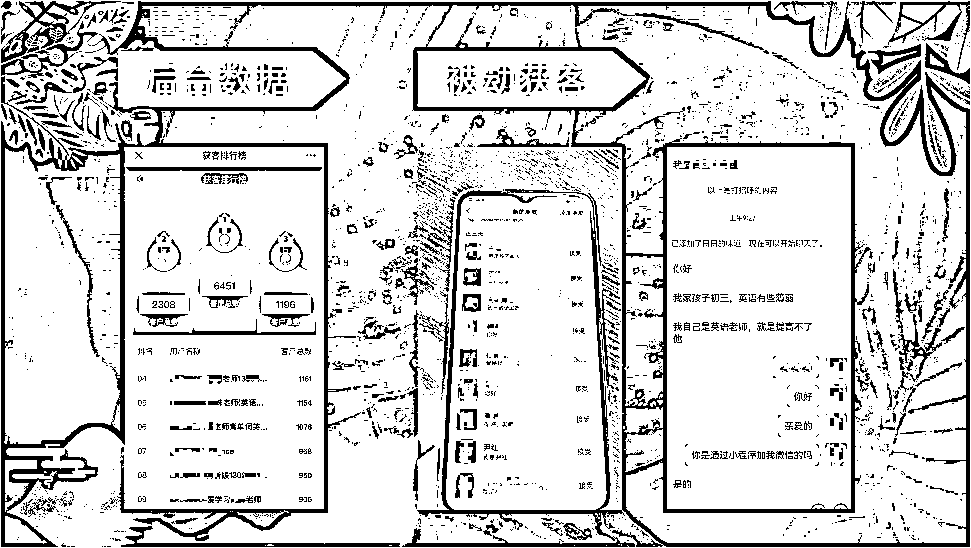

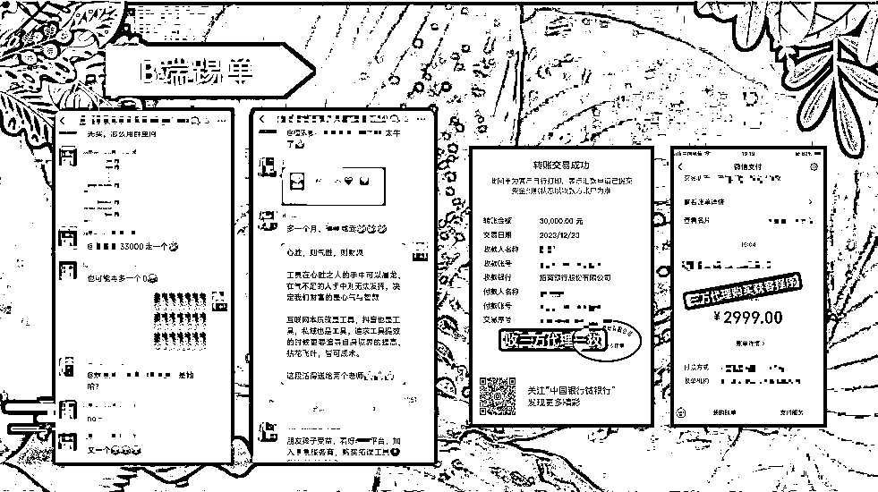

还有一些更高端的功能这里就不展示了，有兴趣的圈友私我详聊。

### 知识付费

华聪给我介绍了一个朋友做中小学学习资料付费社群的，B、C都做，他先是开了个分销试了一下，数据还可以，紧接着就把我们的分销加在了他B端的业务上，加盟收398，也陆陆续续收了近百个下级。

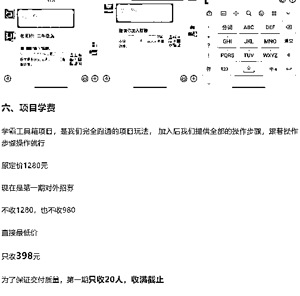

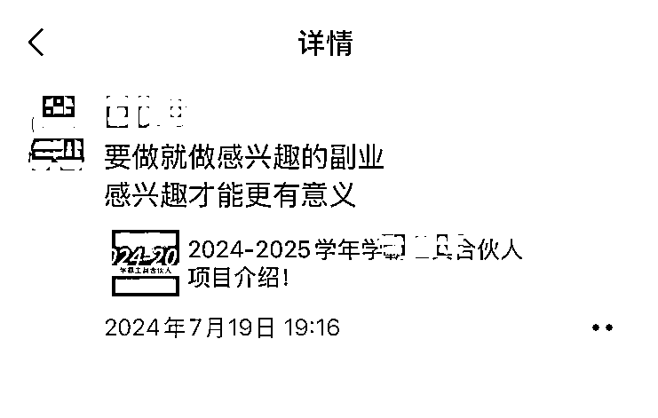

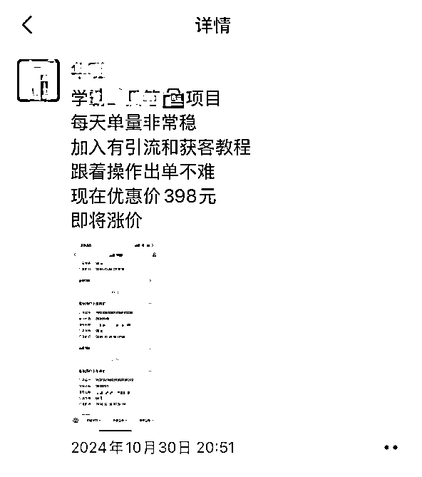

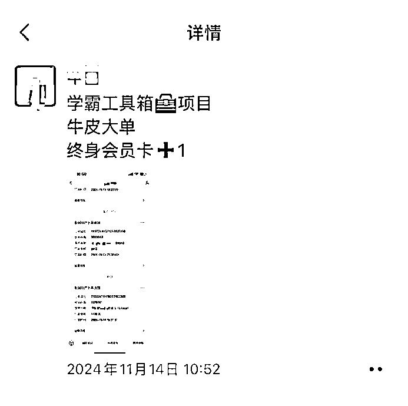

这种玩法有两端的收益：

1、发展代理/收徒的费用

2、下级分销的管道收益

🎈部分分销收益

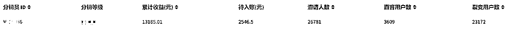

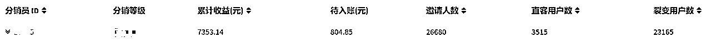

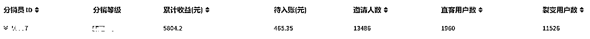

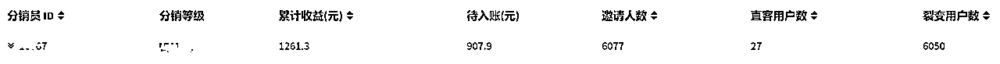

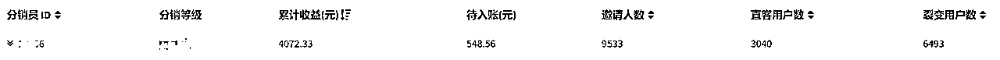

基于这些样本，我想能不能把这套玩法做成知识付费的产品，专门指导创业粉做分销，当时是想着让这个兄弟直接把这套模式放大，所以是以他现在付费资料社群业务的人群为基础来设计的方案。

🎈知识付费方案

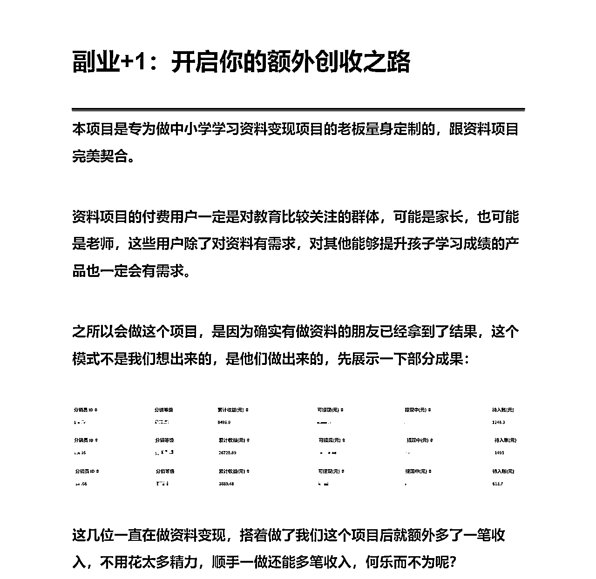

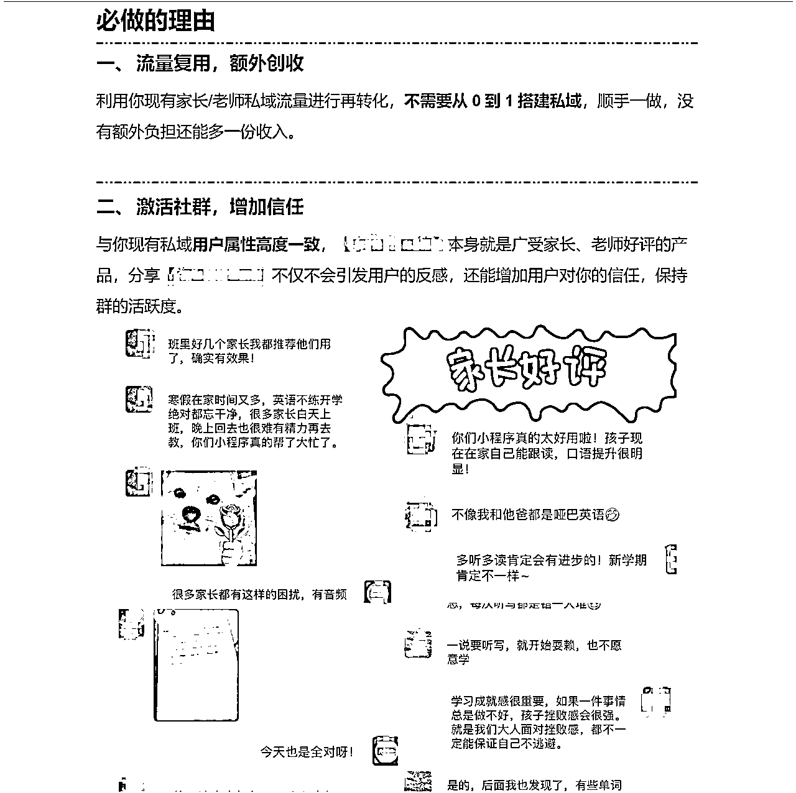

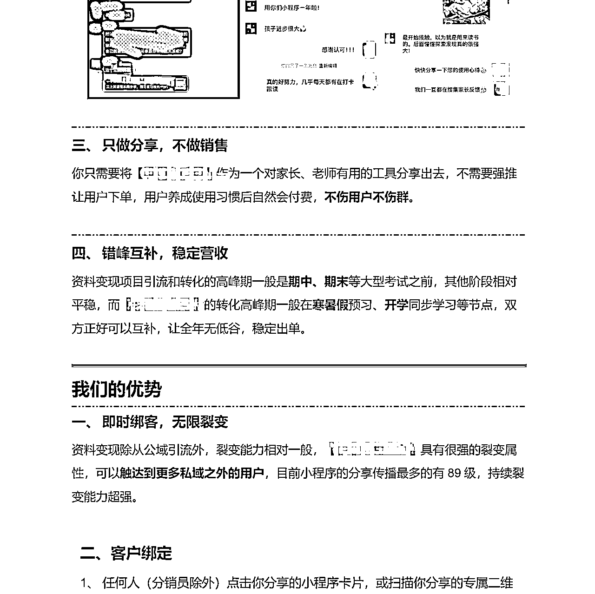

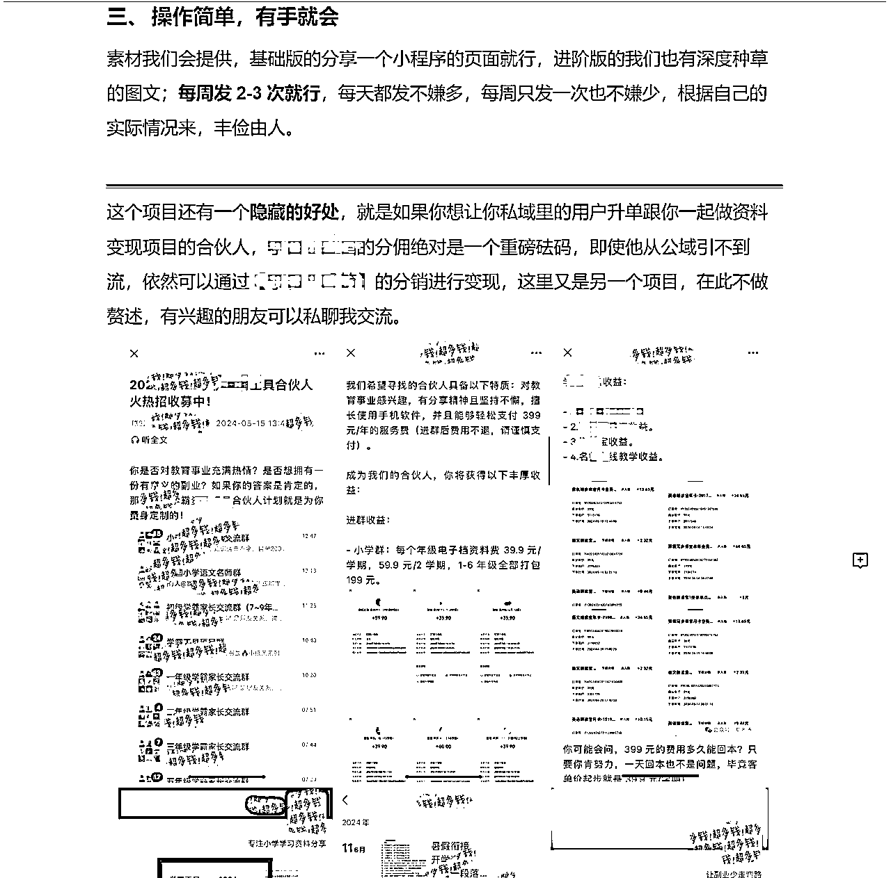

后来由于他工作比较忙，实在抽不出精力来放大这个项目，再加上公司这边又新开了一条业务线，所以这个项目暂时搁置了。我一直很看好这个模式，也想过招个有经验的伙伴负责这个项目，奈何一直没有合适的人选。

圈友们如果有合适的人选推荐，录用后我会发红包，另外如果有圈友有这方面的经历且有意愿把这个项目扩大的也欢迎来聊

还有一些分销员尝试且拿到结果的玩法，比如利用小程序抖音直播转私域、小红书做展示产品功能的笔记转私域、利用小程序社群打卡营再做低转高等，篇幅有限我就不展开细说了，有兴趣的圈友可以私聊我。

# 写在最后

码了这么多字并不是为了炫耀我们的产品有多好、规模做的有多大，而是想要通过生财有术这个平台链接更多对这个产品和业务感兴趣的、有一定资源或者能共创出更多玩法的圈友。

钱是赚不完的，创业的路途永无止境，欢迎大家跟我交流，也欢迎珠三角或者出差来深圳的圈友来公司喝喝茶，茶管够，酒管够！