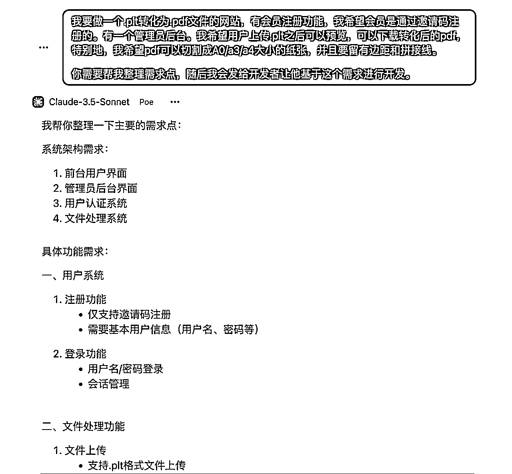
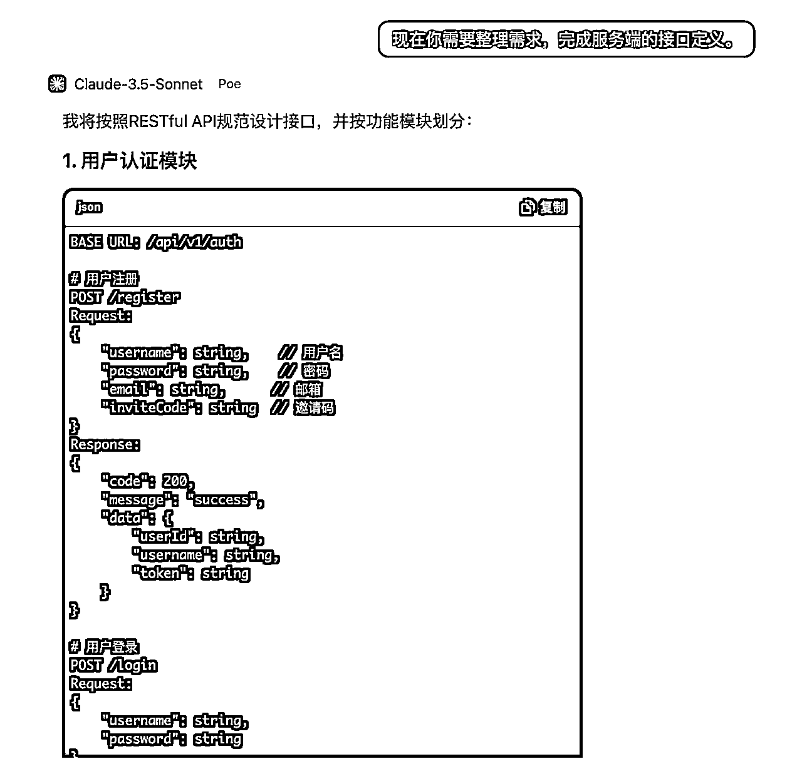
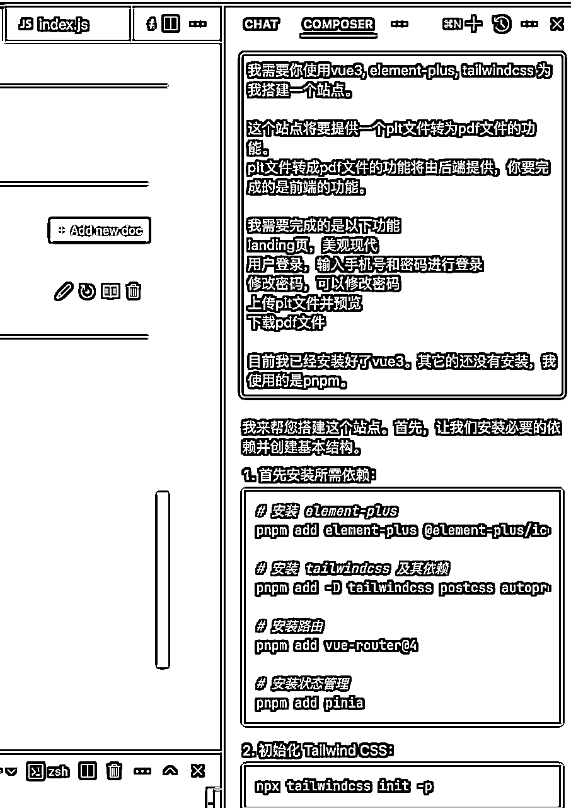
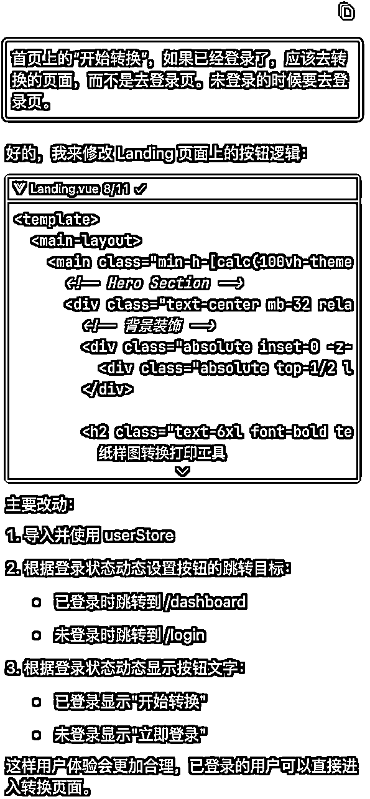
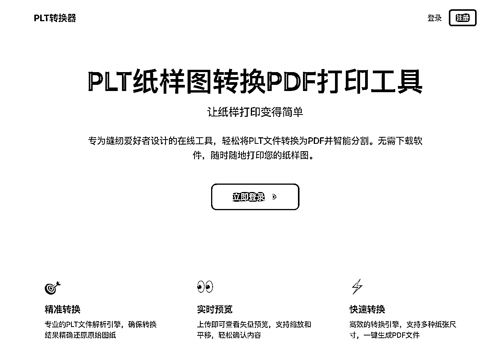
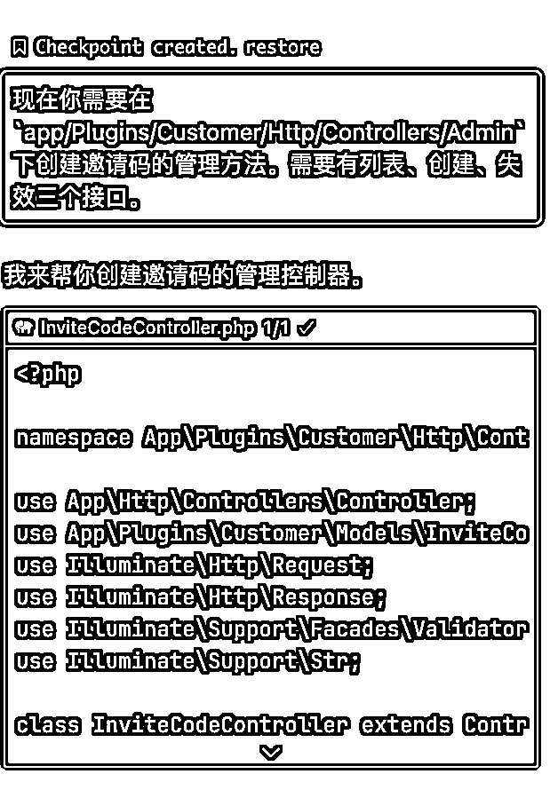
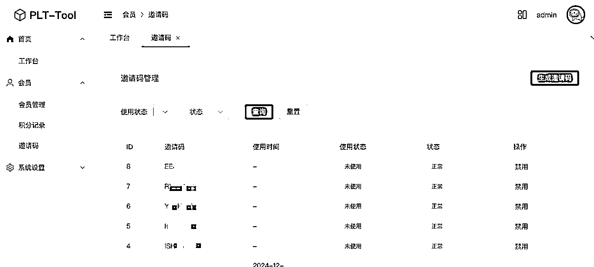

# 使用 cursor 完成一个略微有点复杂度的文件格式转化网站

> 来源：[https://lnq9nfegw4.feishu.cn/docx/Wx3Fdo8eHoZNu3xrDOCcIr2anxg](https://lnq9nfegw4.feishu.cn/docx/Wx3Fdo8eHoZNu3xrDOCcIr2anxg)

我是David，老码农一个。小排老师之前有介绍了怎么使用 cursor 来做一个简单网站。我的过程比较复杂一些。也可以分享一下。

原由：老婆最近入坑了缝纫手工，一天她问我怎么用cad，我就很好奇怎么现在做缝纫手工也要这么高端了吗？问了一下原来是她有一个.plt的纸样文件要打印出来，但要用ABViewer，但我们家又是苹果全家桶。于是我就稍微研究了一下。完成了这么个网站 https://plt.nanodeer.com，也就是测试一下 cursor 对于普通网站的能力在哪儿。

整个网站的完成时间大约是一个下午。包括了前后台和转化服务端。

AI始终应该是打辅助的，所以你应该作为指引者来引导它，而不是被它带着走。你的身份是老板，而AI则是你的员工。

## 规划

这个站点应该有三个部分，会员使用的前台界面，管理员使用的后台界面，以及负责转化的服务端。我非常推荐大家使用 next.js 或是 nuxt.js 这样的全栈框架配合 cursor 完成自己的项目，这样你可以在一个项目中完成所有的功能。但我之前有积累了一些代码片段，所以我就基于之前的积累，分成三个项目来完成。

a) 会员前台

b) 管理员后台

c) 服务端（负责转化）

你可以把你的网站的功能思考一下，然后发给 GPT，它会帮你拆分功能描述。我平时使用的是 poe + claude.ai，所以接下来也是用这个来展示。

然后一件很重要的事情，你可以让 AI 帮你生成接口定义

## Cursor 登场

接下来，你可以打开一个新项目。将需求说明和接口说明分别保存到项目目录下(requirement.md 和 api.md)。cursor 会索引这些文档作为参考。现在再开始让 cursor 开始工作，你可能会得到更高的一致性（或是说你会感到cursor更懂你）。

### 会员前台

现在你可以让 cursor 为你生成项目代码了。打开右侧的 composer 窗口，输入你的需求。

技巧可以说是完全没有。如果要有的话，你就要让 cursor 用上成熟的界面框架。比如 element-plus, ant-design, shadcn，tailwindcss。非常推荐大家用上 tailwindcss，基础样式就有了，合理美观。

它会开始生成一堆代码，你要做的就是点 run 或是 accept all，然后预览它是不是工作正常。

我是先从用户前台页面开始的。一些技巧是你可以让 cursor 把 API 接口放到一个目录下，回头你要修改的时候就比较统一。

你可以使用 pnpm dev来预览效果。如果你觉得页面不是很好看。你就在composer里告诉 cursor 说，你觉得哪个页面不是很好看，让他修改得美观现代一些。然后它就会尽它所能来优化界面。更有甚者，你可以在纸上画一个图，标明每个功能区是做什么用的。然后拍照，把图片复制到 composer 框里，然后让 cursor 照着这个草稿来实现功能区。

遇到错误的时候，就复制一下让 cursor 解决，或是你已经看出问题了，但不想消耗 cursor 的话，也可以直接在左侧的编辑框里解决。

现在我弄的是一个非常简单的项目，所以我就不断地让 cursor 去解决问题。

差不多四十多分钟。前台的基本功能就完成了。

### 服务端接口

我用了曾经世界上最好的语言PHP的Laravel框架来构建我的服务端，很简单就是提供登录啊上传啊这些的接口。

如果你掌握了这个框架的用法，实际会如鱼得水。

我就让 cursor 为我生成数据库迁移语句，生成模型，生成接口，生成路由。

如果你很清楚下一步要做的是什么事情，cursor 能做到的是成为另一个打代码特别快的你。

### 实现文件转化

这应该是最核心的功能了。我在这里实际做了一些尝试，我去分析了.plt文件的结构是什么样的。它是怎么来的。然后让AI思考如何转成PDF。中间过程比较复杂，这里就不展开了。对于码农同学来说，就是窗户纸的事情啊哈哈。

### 管理员后台

管理员后台我是基于市面上的开源管理后台框架来弄的。一样，把接口说明文档丢给它。告诉它要在哪里动手。它就会乖乖开始动。很简单，我只需要一个会员管理、邀请码管理就可以了。

## 整合

现在你要做的事情是把上面几样东西整合起来，当然如果你用全栈框架就没这么多事儿。我是带着体验 cursor 的目的来跑的。

做一些测试，如果没啥问题就进到下一步。有问题就 cursor 来解决。cursor 提供了两个窗口，chat相当于咨询，而composer相当于工程师。chat相当于 claude.ai 的代理，你可以向它提问。而composer而可以对你的代码进行改动。

## 部署

在 js 项目上，我用了一个 deployator 的项目进行部署。PHP则使用了 deployer 进行部署。不复杂。

然后要增加虚拟主机，把你的部署情况交给 poe ，它就替你写出配置文件了。非常懒人工具了。

## 宣传

这应该是AI目前应用最广的地方。拿着功能点去让kimi出文案。然后拿去稿定上弄点图，贴到社区里就完事了。

那剩下的事情就是去向老婆邀功了。

## 体会

完整体验下来，cursor 真的是一个非常好的辅助，它和现在大型IDE里的比如通义灵码不同的地方就是它对代码是会生成索引的，而且你可以给项目添加文档。这样有一些RAG的效果在里头。配合claude.ai的sonnet模型，它的代码生成能力真的是非常强悍。

以往我手搓这样的一个站点怎样也要三四天。现在一个下午就完成了，视觉效果基本是我满意的。如果纯这个项目而言，可能出个海也是可以的。但我感觉seo有点不好排上去。

所以圈友们，大胆用起来吧，写个项目的成本越来越低了。你要做的是不断去测试哪个门路来钱哈，然后再深化。