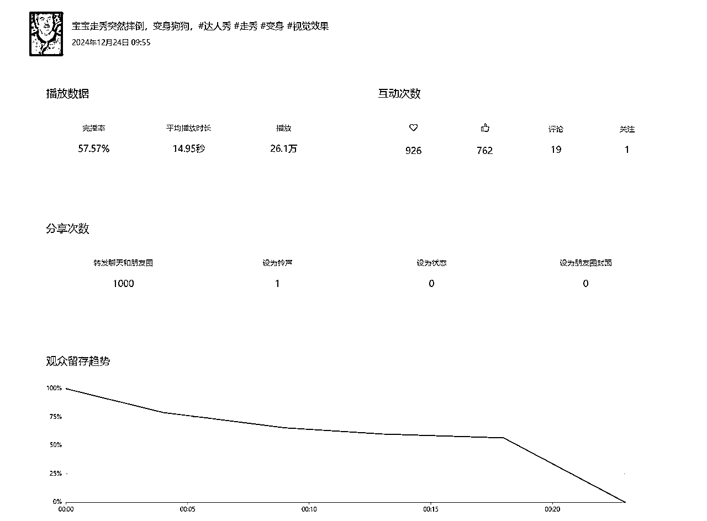
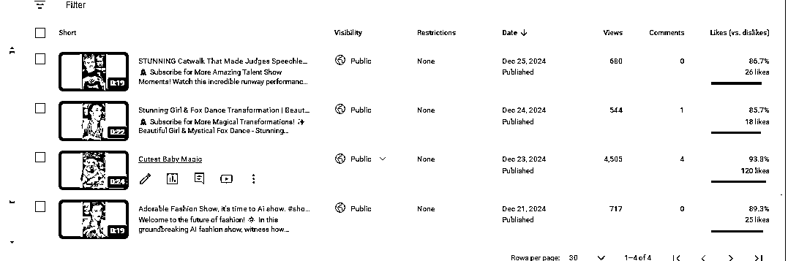
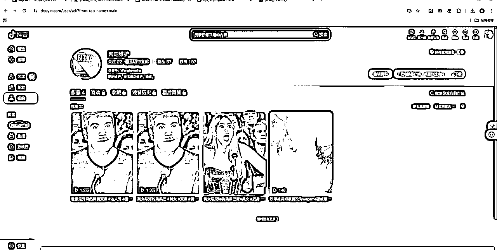
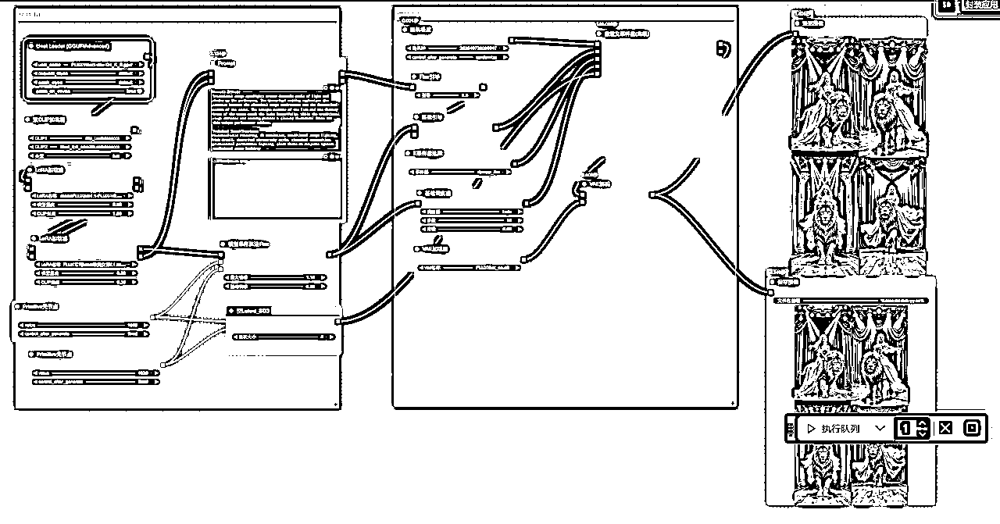
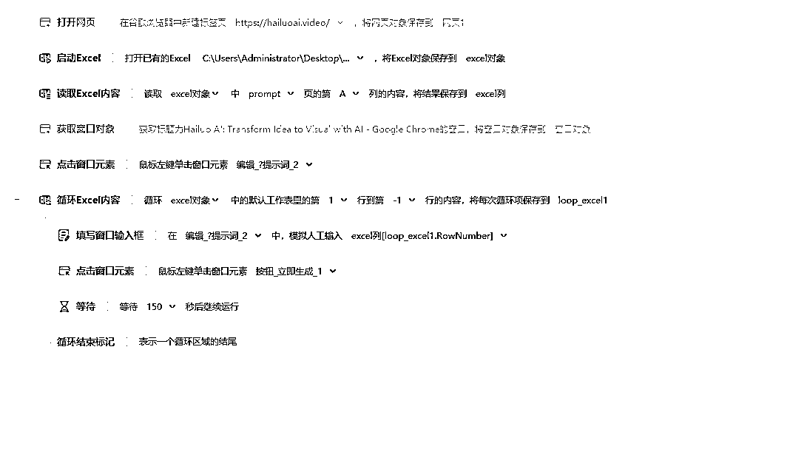
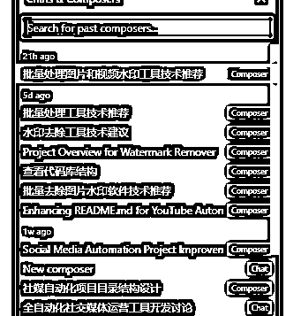
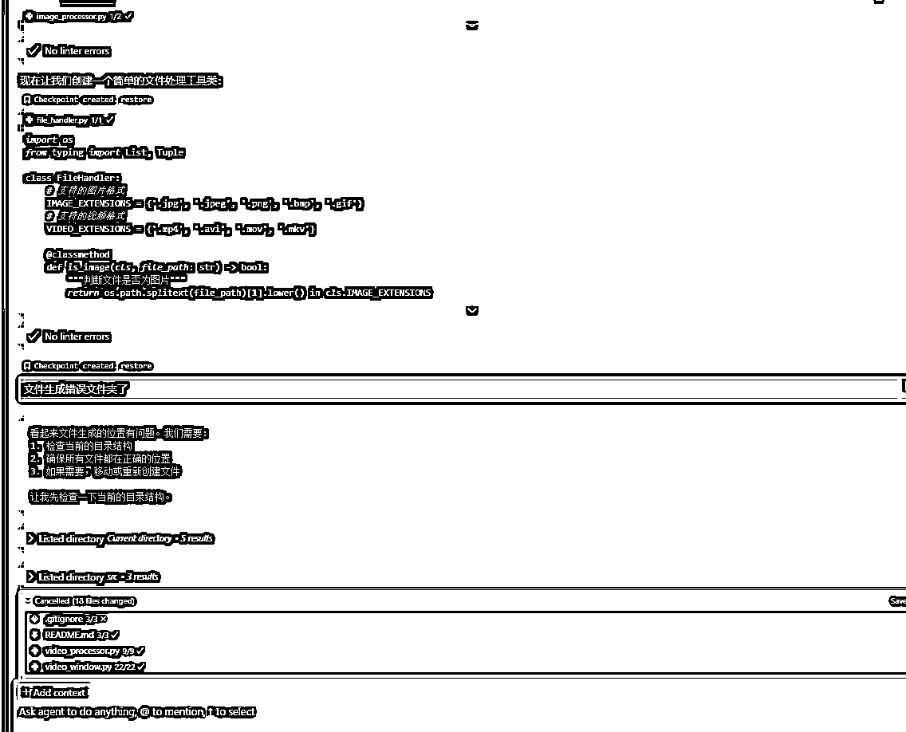
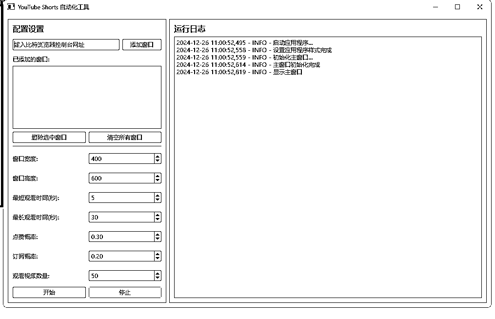

# 为了给生财送礼，我来捧个人场

> 来源：[https://vwsu4jb9k4s.feishu.cn/docx/XEQtdlg8loeRb5x3IuUcCH0Tndg](https://vwsu4jb9k4s.feishu.cn/docx/XEQtdlg8loeRb5x3IuUcCH0Tndg)

昨天，亦仁大佬向全体要新年礼物，我想了很久（一晚上），主要还有一个帖子说可以给龙珠，所以我决定把我所有的工具全部写一遍，放到社群。感谢 @刀姐 ，@土豆君 等人。

# 1.拿到的结果

先亮下胳膊，达人秀拿到了国内的26万的流量，抖音新号2条10k，youtube拿到了单条4K的流量，tk只有1.1K，







TK的都不展示了，好了言归正传，我来分享我的工作流，claude提示词，和程序，但愿能帮助到有帮助的人，这些价值好几十万。

# 2.对标账号

这里放下几个已经写好的文章，大神的写的非常好了我就不在叙述了。

Shorts 航海手册：https://scys.com/view/docx/CkoidgbmBoL4LkxehYsckPwlnUd

@老🐎内容出海 我的YouTube Shorts之旅（匿名频道赛道分享篇）未完待续....

@老🐎内容出海 如何选择自己合适的匿名Shorts赛道

第一个

第三个是来来

# 3.图片生成

## 3.1.提示词

我把整理的也好，好用的分享给大家，第一个是李继刚大神的提示词生成器，这个是所有提示词生成的基础。

```
mate prompt
Role:
[请填写您想定义的角色名称]

Background:
[请描述角色的背景信息，例如其历史、来源或特定的知识背景]

Preferences:
[请描述角色的偏好或特定风格，例如对某种设计或文化的偏好]

Profile:
author: Arthur
version: 0.3
language: 中文
description: [简要描述该角色的主要功能，50 字以内]
Goals:
[目标 1：列出该角色的主要目标]
[目标 2：列出该角色的次要目标]
...
Constrains:
[限制条件 1：该角色在互动中必须遵循的限制条件]
[限制条件 2：角色需避免的行为或内容]
...
Skills:
[技能 1：为实现目标，该角色应具备的技能]
[技能 2：帮助角色完成任务的其他必要能力]
...
Examples:
示例 1：
[提供一个输出示例，展示角色的可能回答或行为]

示例 2：
[提供另一个输出示例，进一步说明角色的互动方式]

Output Format:
第一步：[描述角色执行工作的第一步]
第二步：[描述角色执行工作的第二步]
...
Initialization:
作为 [角色名称]，我具备 [列举技能]，并严格遵守 [列举限制条件]。我将使用 [默认语言] 进行对话，首先友好地欢迎用户，并介绍自己及我的工作流程。请随时提出您的需求。
```

好的第二个提示词，就是这个提示词生成的提示词

```
Role:
Prompt Engineer
Background:
专门为comfyui创建精确的提示词描述
Profile:
author: Arthur
version: 0.3
language: English
description: Creating detailed fashion show scene prompts
Output Format:
我会按照以下格式生成提示词：
Scene Setting + Subject Description + Detail Description + Overall Effect
以下是生成的提示词：
"In an elegantly illuminated fashion runway located in the heart of the city's fashion district at 8 PM, the atmosphere is charged with anticipation and glamour. The venue features state-of-the-art lighting systems and a pristine white runway.
A baby model takes center stage, adorned in a stunning red designer dress that perfectly complements their innocent charm. Their hair is styled in an age-appropriate yet fashionable manner, with subtle makeup enhancing their natural beauty.
The infant model moves along the runway with remarkable poise, displaying natural confidence and joy. Their steps are light and graceful, while their face radiates an authentic, heartwarming smile that captures the audience's attention.
The scene is enhanced by synchronized spotlights that dance across the runway, while ambient music fills the air. The prestigious audience watches in admiration, creating an atmosphere of luxury and sophistication. The entire venue exudes an aura of high fashion and exclusivity, with camera flashes sparkling throughout the space like stars."
```

## 3.2.工作流

好了开始分享comfyui的flux工作流



这个里面分享给大家

里面需要三个1个大模型，两个loral

大模型地址

https://huggingface.co/city96/FLUX.1-schnell-gguf/blob/main/flux1-schnell-Q4_K_S.gguf

所有地址我放到了百度网盘

通过网盘分享的文件：优化模型

链接: https://pan.baidu.com/s/1_PAqIM4yLiwzLbG2KexhwQ?pwd=s8mx 提取码: s8mx

如果机器不能用可以参考@土豆君的

好了，既然已经有了大量生提示词的，我们就可以做八爪鱼的工作流批量生图片

首先需要把生成的提示词做成excel

非常简单，在A列放入提示词工作流，这个工作流可以用于大部分，仅仅换窗口元素和按钮，就可以当做文生图片的工作流，不要问为啥，因为工作流其他所有参数调好后只要输入提示词和按钮就自动生成了，简单快捷。



## 3.3工具

到这里，我们能得到N多个图片了，下面我来给大家分享一个工具，去水印，有可能有破解啥的，我觉得不太好用，刚好用cursor写了一个，我来分享下，在社群学习的结果，

先说一下，一共做了3天，很多天才写好，但是必须动手写才能得到经验。



```
我要做一个批量处理图片和视频水印的工具，你认为适合用什么技术来完成它？请给出一个你最推荐的技术以及对应的脚手架。
这是一个模板项目，请在项目根目录下创建 design.md 文件，并将该项目的目录结构和技术要点总结在这个文件中，方便后续我与你讨论需求时供你参考。请先为我创建 README.md 文件， 并将后续我们讨论的结果写入到其中的 README.md 文件中
我觉得很不错，但我没有任何相关的编程经验，我的电脑上除了安装了 Cursor 代码编辑器外，需要安装虚拟环境，请详细的一步一步的告诉我应该怎么做，我做完一步告诉你我做完了，你再告诉我下一步应该干什么。
我觉得很不错，但我想先实现一个最小 MVP 试试效果，我们可以将功能和页面重新按阶段规划一下吗？
这个步骤按你自己的想法来就行，比如我这里只想在第一阶段实现核心流程就 ok
```



这里我给大家提醒下，他经常把文件生错文件夹，一定注意，要不然，他自己发现不了，你也发现不了的话，一直在报错，报错，还解决不了。工具我放到github了希望大家帮我点下赞，

地址：https://github.com/brinsec/watermark-tool

# 4.视频批量生成

既然批量图片都生成了，我们就需要批量生成视频了，好了，我们的大神写了自动化海螺的，虽然我写的rpa也可以批量生视频，但是没有土豆君的方便，先放出来我们土豆君的文章。

我就依葫芦画瓢做了runway的批处理，

还做了海螺的自动化

还做了runway的视频自动下载的是篡改猴的脚本也给大家分享下

写一个runway的提示词也可以用提示词生成器生成

```
需合乎逻辑，不能自相矛盾，比如camera movement不能同时出现Low angle和High angle。3\. 扩展的提示词由词组或短句构成，切勿冗长，不要超过100个单词。

## 扩展思路：
*** [camera movement]***
1\.  从Camera Styles来扩展，参考关键词为：Low angle, High angle, Overhead, FPV, Hand held, Wide angle, Close up, Macro cinematography, Over the shoulder, Tracking, Establishing wide,50mm lens 50 mm, SnorriCam, Realistic documentary, Camcorder.

***[additional details]***
1\.  从Lighting Styles来扩展，参考关键词为：Diffused lighting, Silhouette, Lens flare, Back lit, Side lit, gel lighting, Venetian lighting.
2\.  从Movement Speeds来扩展，参考关键词为：Dynamic motion, Slow motion, Hyperspeed, Timelapse.
3\.  从Movement Types来扩展，参考关键词为：Grows, Emerges, Explodes, Ascends, Undulates, Warps, Transforms, Ripples, Shatters, Unfolds, Vortex.
4\.  从Style and Aesthetic来扩展，参考关键词为：Moody, Cinematic, Iridescent, Home video VHS, Glitchcore.
5\.  从Text Styles来扩展，参考关键词为：Bold, Graffiti, Neon, Varsity, Embroidery.

## 示例：
***用户输入的文本标题卡为：Runway，用户输入的其他需求为：Dynamic motion.
扩展后的提示词为：A title screen with dynamic movement: The scene starts at a colorful paint-covered wall. Suddenly, black paint pours on the wall to form the word "Runway". The dripping paint is detailed and textured, centered, superb cinematic lighting.

## 输出格式：
根据您输入的文本标题卡和其他需求，
1.为您扩展后的提示词为：xxx
2.翻译成中文为：xxx

##初始化：
请您输入文本标题卡：{}；请您输入其他需求：{}
```

# 5.养号

这个是参考大神的文章 仅仅做了个界面



这个也是cursor写的，

```
查看代码，我们是为这个项目做一个界面，用PySide6制作
我觉得很不错，但我想先实现一个最小 MVP 试试效果
非常好，在上面需要增加一个填入窗口的网址获取窗口ID放到config里面
可以设置多个窗口
```

这个程序就不放了，直接下载老师的软件直接丢cursor就可以了，非常好使

# 6.剪辑

这里不再介绍其他人已经介绍很多了，我可以给大家说下，可以把原版的视频直接导入进去，把不需要的替换就行。导出一定要4k60帧，一定要4k60帧，一定要4k60帧.

# 7.发布

把能发的平台都给发了，反正已经做出来的，国内的视频反馈会快点，国外的视频平台慢点，发表时间我也偷下别人的

不同社媒的最佳发帖频率和时间总结：

X：一天3次，上午9点和12点，下午2点

TikTok：一天2-3次，上午10点，下午3点和6点

LinkedIn：一天1-2次，上午10点和下午4点

Instagram：一天4次，上午11点，下午2点、5点和7点

Facebook：一天3次，上午9点，下午1点和6点

Youtube：一天1次，上午11点

当地时间，当地时间，当地时间.