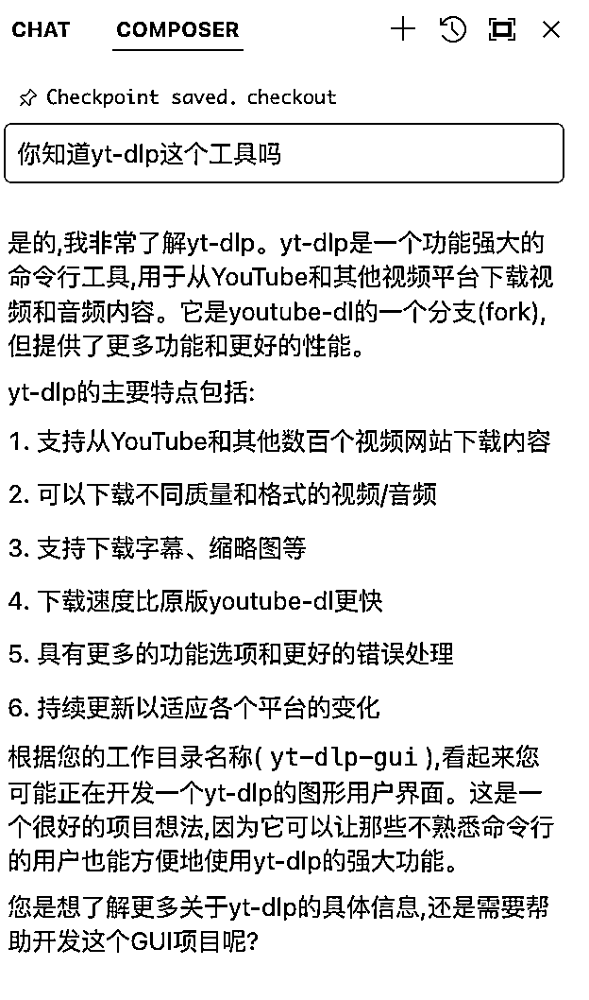
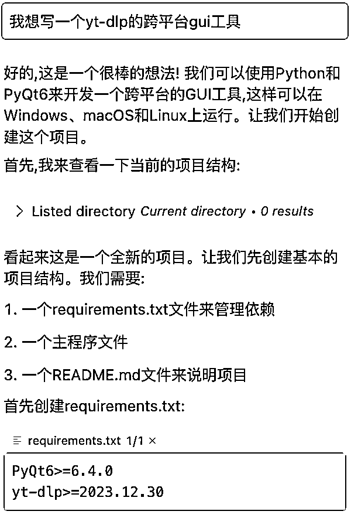
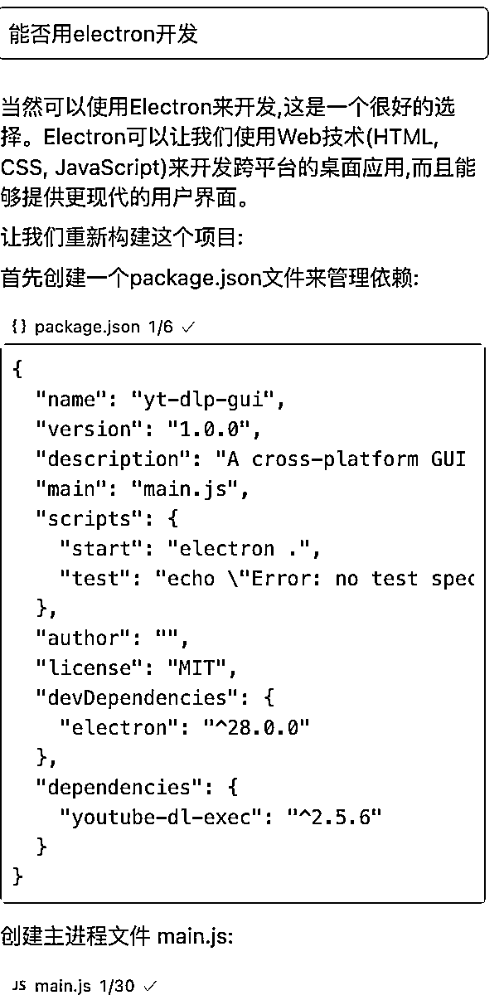
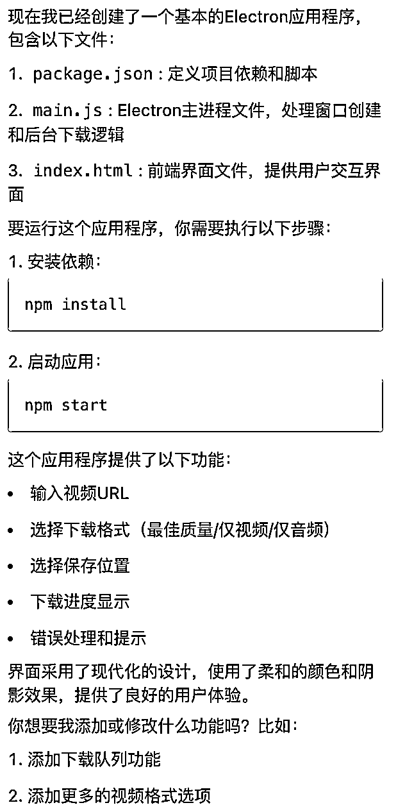
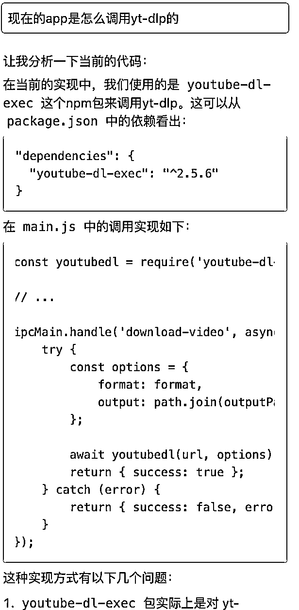
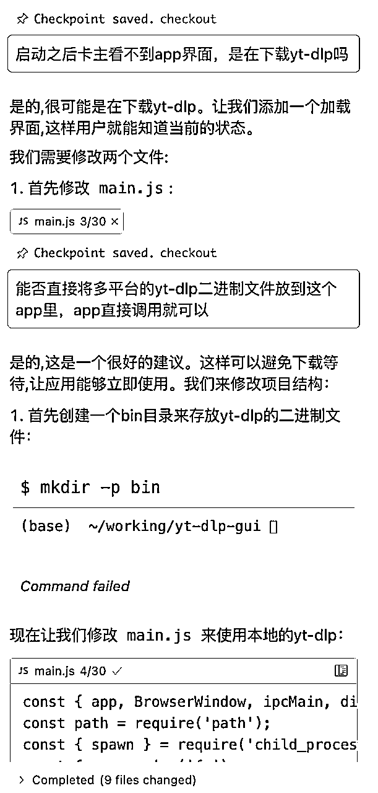
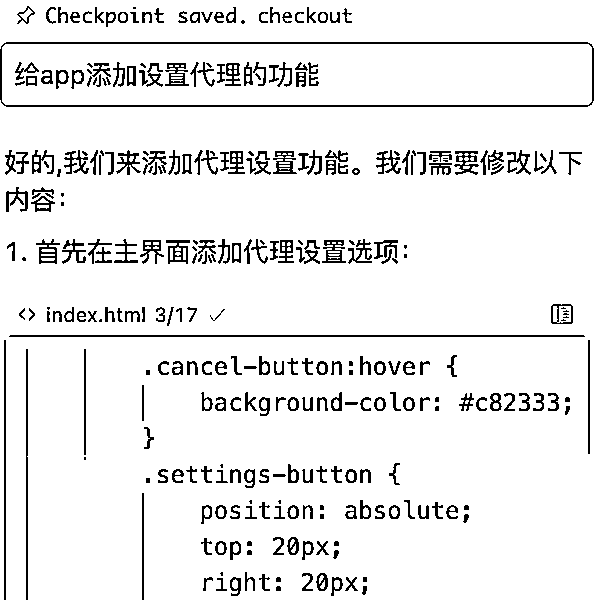
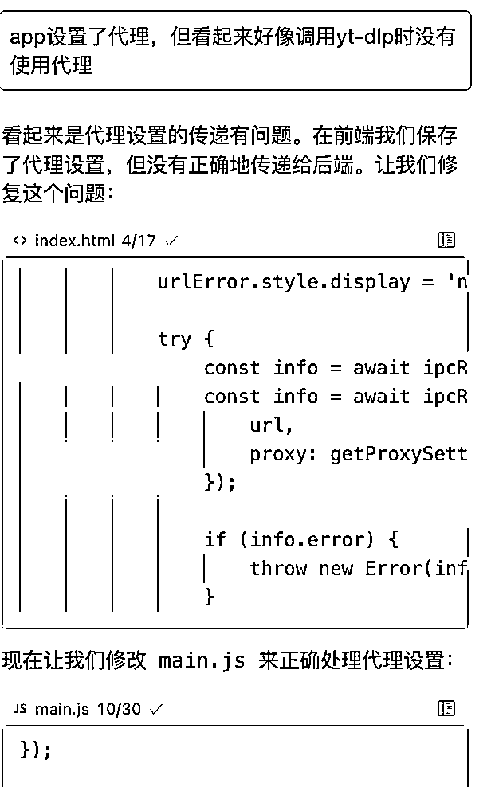

# 用Cursor手搓Youtube频道/播放列表/单视频下载工具

> 来源：[https://fiazd3hbob.feishu.cn/docx/XFsxdK6eXovUQQxPqN4cZJ3bncb](https://fiazd3hbob.feishu.cn/docx/XFsxdK6eXovUQQxPqN4cZJ3bncb)

参加了这次的Youtube Shorts航海，在航海群里看到有一些小伙伴还在为了下载工具发愁，用Cursor手搓了一个，我自己用起来还是挺好用的，分享给大家。

dist文件夹里有两个文件，一个是Mac电脑用的，一个是Windows电脑用的，我这边都经过简单的测试没什么问题，可以直接用。里边也包含了源码，可以放到Cursor里按照自己的想法进行改造。

下面是和Cursor的对话，去掉了一些冗余还有一些bug调试，可以用来参考：

