# 【项目实操】借力AI编码，小白3天也能完成古钱币智慧问答小程序开发

> 来源：[https://wf7paixr5g.feishu.cn/docx/XI0SdTHtpoOAm3xFQolcdcS1nNh](https://wf7paixr5g.feishu.cn/docx/XI0SdTHtpoOAm3xFQolcdcS1nNh)

大家好，我是赤木，一只某厂5年伪全栈程序牛马。

虽然有些标题党，我不是真零经验。但是我想说真不夸张，这次使用cursor确实让我震惊，因为这个小程序的99%的代码，全靠一键生成.....

先展示下成果：

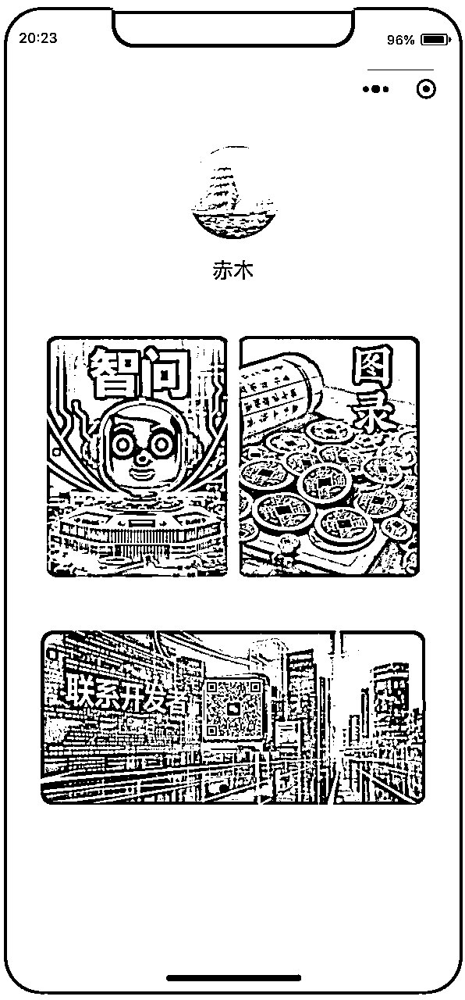

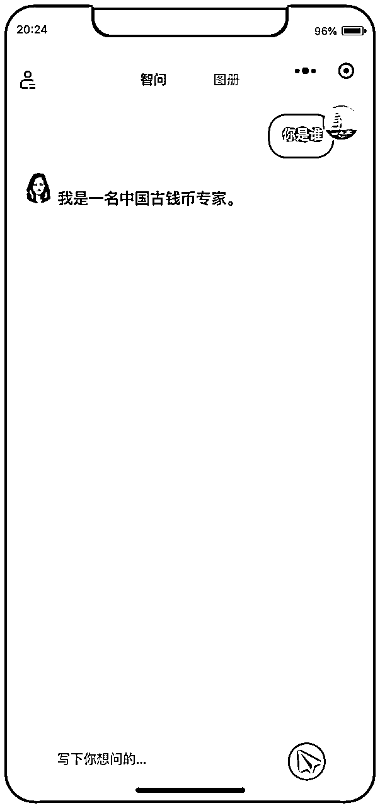

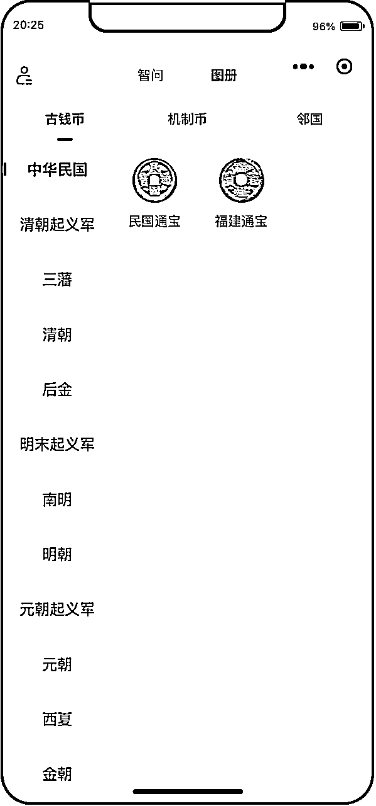

本篇文章主要展示靠自然语言编程完成一个MVP项目的关键过程，以及细节，圈友们可以尝试复制，打造属于自己的第一个小项目。

OK，废话不多说，直接开始！

# 一、准备工作

关于软件开发的环境，这里就不详细赘述了，没有经验的小白可以按照清单内容逐一完成。有经验的小伙伴可以直接从第二章开始看。

由于我做的小程序需要数据支持，所以我这里做了前后端分离的架构。

## 1、前端部分

### 微信小程序

注册一个微信小程序。如果只是自己玩，后面不发布，也可以不准测，开发时先用测试号。

### AI编码工具cursor

https://www.cursor.com/

主要用于生成代码。把自己想做的东西一步步拆解开告诉他，然后他给你返回代码。然后通过不断调整细节，最终达到目标实现。

比如，现在想做一个必应的搜索页面，就不要直接说“给我做一个必应搜索页面”，而是拆解成

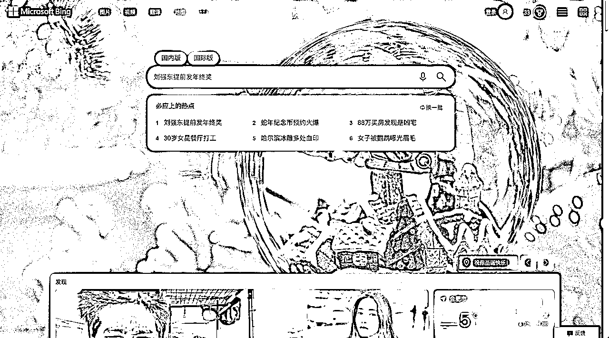

“我现在需要基于vue框架做一个前端页面：

1、页面顶部是一个工具条。最左侧显示logo‘Microsoft Bing’。在logo右侧，有图片、视频、翻译、地图、更多四个按钮。最右侧有登录和头像，圆形图标，隐藏标签。

2、页面正中有一个长条搜索框，搜索框内最右边有麦克风图标和放大镜图标。紧贴搜索框上面是一个标签，有两个选项‘国内版’、‘国际版’。搜索框的下面是一个半透明容器，里面有文字两行三列。

3、页面的最下面是一块容器，里面并列放着三张图片。

4、页面的背景是一张图片。

”

通过上面这种详细的描述后，生成出的代码就相对比较稳定。当然也有人试过，直接把网站链接或截图直接丢给他，让他复刻，但我尝试几次感觉效果不是很满意。

### 微信开发者工具

https://developers.weixin.qq.com/miniprogram/dev/devtools/download.html

这里主要是为了方便实时查看到修改代码后的页面变化。

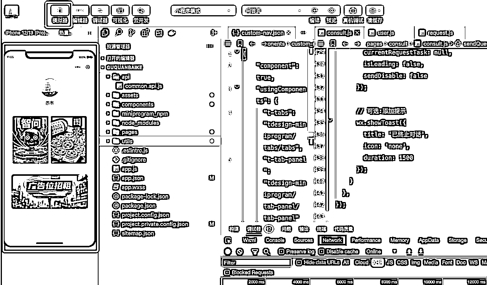

## 2、后端部分

### 阿里云服务器

https://www.aliyun.com/benefit/select/ecs?utm_content=se_1019876251

为我这里涉及到后端数据存储问题，所以使用python做了个简单的后端数据查询服务，方便数据交互。服务器上部署mysql、nginx。我买的是99一年的。

对于不熟悉的圈友可以使用小程序云开发，可以避免这些，缺点是云开发是收费的。虽然服务器也收费，但一个服务器能干很多事，但一个项目的云开发只能开发一个项目。

### 阿里云域名

https://wanwang.aliyun.com/domain/tld

因为小程序必须要使用域名且https接口，线上环境不能直接用ip进行访问。但如果你只是为了测试小程序，在开发者工具中模拟使用，而不发布，则可以不用购买域名。

这里需要注意的是，域名购买后需要备案，而备案的时间在将近一个月左右。所以如果你想要发布，就尽早去备案。

### 数据库可视化工具Navicat

https://www.navicat.com.cn/download/navicat-premium

方便数据库表管理，这个网上有很多破解版，不用真花钱。

# 二、正式开工

## 1、新建项目

打开微信开发者工具 - 创建小程序 - {配置相关信息} - 创建

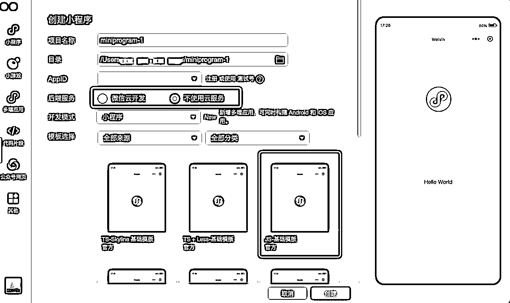

注意：

①这里是否使用云开发根据情况选择，有服务器-不使用云开发，没有服务器-云开发(收费19一个月)。

②AppID如果已经注册且认证了小程序，点击下拉使用注册的小程序。如果没有注册，可以临时使用“测试号”。

③模板为了代码生成省事，选择空白模板“JS-基础模板”、“TS-基础模板”都可以。

## 2、新建页面的方法

创建完成后，右键pages文件夹，新建文件夹“atlas”(atlas具体取什么名字，根据页面功能决定，好的名字可以帮助你快速找到指定页面)

在atlas文件夹右键，选择“新建Page”，就会自动生成“js、json、wxml、wxss”四个文件。z

js：里面写代码交互逻辑；

json：引用各种插件、组件；

wxml：页面的代码；

wxss：wxml中对应的样式；

这个功能做个了解，下面就是闭眼生成了。

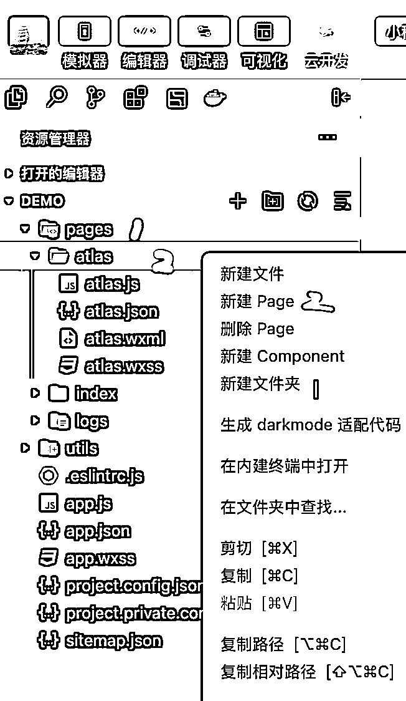

## 3、cursor代码编写

首先说一下为什么要选择cursor工具，他和其他AI编码的差异在于其他的AI工具需要你上传代码片段，然后他告诉你怎么修改。而cursor的优势是可以直接的读取你的整个项目工程，从而根据你的项目当前情况输出问题的答案。

下面直接开始。

打开cursor - Open a folder - {选中刚才的项目文件夹根目录}

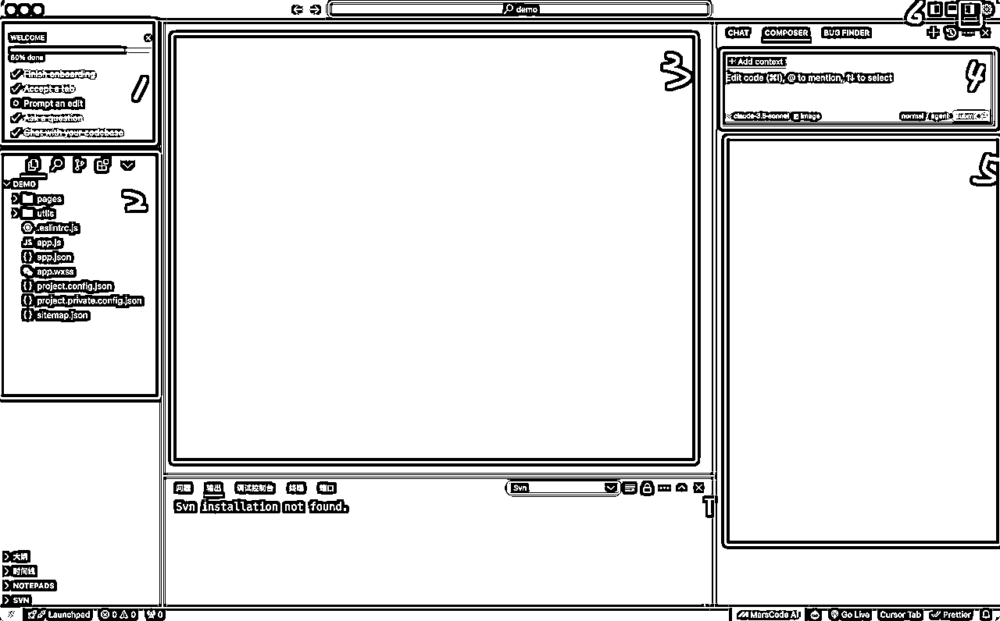

Cursor分为这几块功能区：

第一块：基础信息，不用管他。

第二块：代码结构区。

第三块：编码区，就是实际写代码的地方。

第六块：这个按钮可以 显示/隐藏 右边的4、5对话块。

第四块：输入你要实现的功能。左上角的➕，用来选取读取的文件。

第五块： AI帮你写好的代码，你只要复制到编码区就可以。有的项目可以一键导入，但小程序不太清楚为什么还要手动复制。

注：白嫖技巧——如果免费额度用完了，到官网注销当前账号，然后重新注册就清零了。

## 4、生成代码

Cursor的问题输入框中输入问题：

请基于微信小程序原生语言，在atlas页面生成一个类似于微信的对话页面：

1、atlas页面的主体是一个对话框，对话框左侧是机器人说的话，对话框右侧是用户说的话。在机器人说话的部分，机器人头像在消息的左侧。用户说话的部分，用户头像在消息的右侧。

2、页面的底部有一个输入框输入框的右侧有一个发送按钮。用户可以在输入框内输入文字点击发送按钮后显示在对话框的右侧。

3、整个用户的对话，我希望存储在一个数组中，数组的格式可以参照下面的形式：

talkList: [

{

"id": null,

"role": "user",

"content": "你好"

},

{

"id": "as-udskdkmh85", //id

"role": "assistant", //角色 user-用户 assisant-机器人

"content": "我是机器人，请问有什么可以帮您？" // 对话内容

}

]

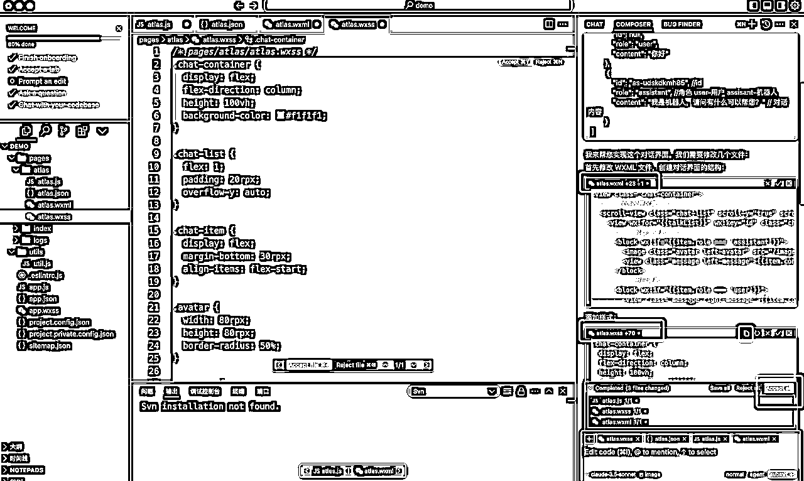

当你提问后，AI会将写好的代码返回给你，可以选择点击图片中的“Accept all”，直接一键修改所有代码。也可以根据他回复中的解释，进入到文件中，点击右上角的复制图标，进行单个页面的复制。这里因为页面是新建的，没有胆码，我们可以选择“Accept all”。

然后回到微信开发者工具，激活“模拟器”，然后点击“编译”。

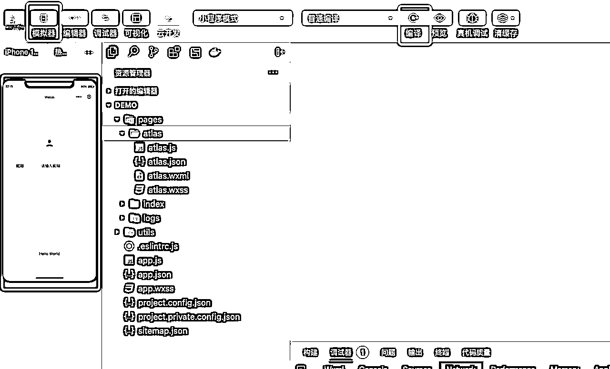

这里会发现模拟器上的页面显示并不对，所以我们还要配置下编译的路径。根据下图操作，然后选择“添加编译模式”，将“启动页面”字段，修改成你放代码的路径，确定，再点击“编译”。

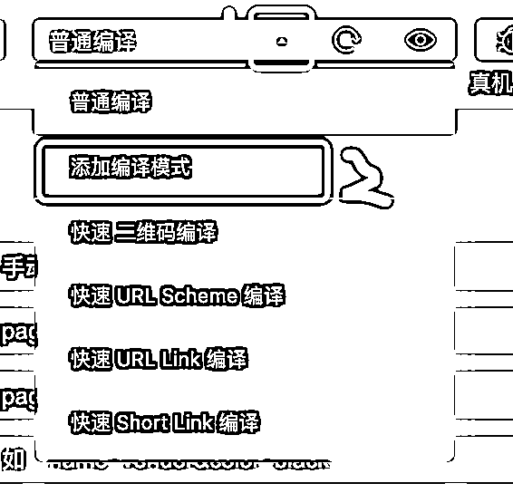

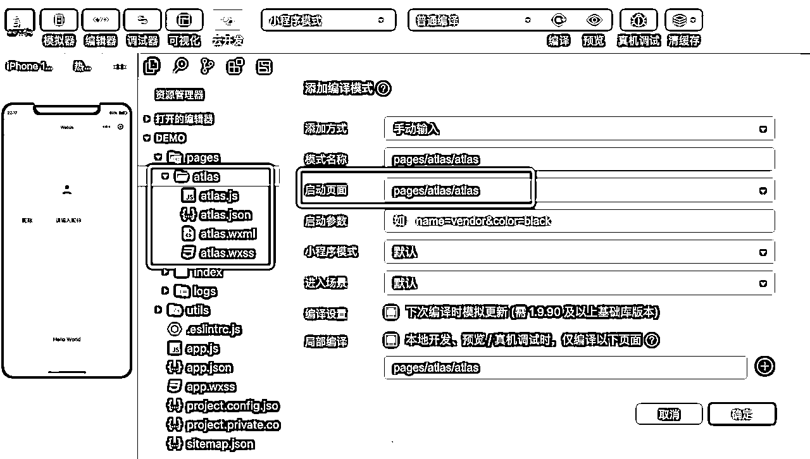

可以看到模拟器中，已经显示出正确的小程序页面。但下图右下角的 调试器 - Console - 中有红色的报错，如果当前对报错不知道怎么修改，则继续把错误复制给cursor。

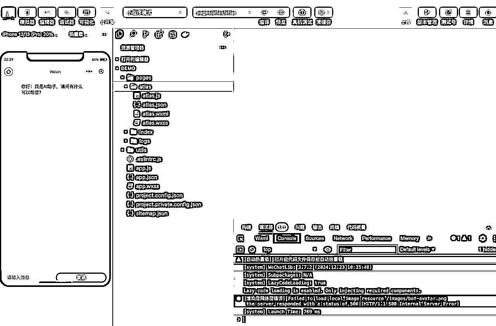

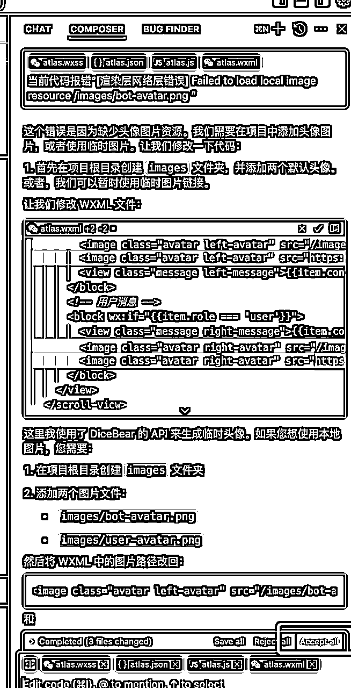

他告诉你报错的原因是，因为引用了images文件夹下面的一张图片，但是这张图片不存在，所以导致了报错。然后cursor对错误进行了修改，把从文件夹读取的文件变成了网络读取的图片，我们可以无脑选择"Accept all"同意他的修改。

然后回到微信开发者工具，点击编译，发现控制台中报错已经消失。同时刚才因为错误导致机器人头像没有显示出来，现在也可以正常显示了。

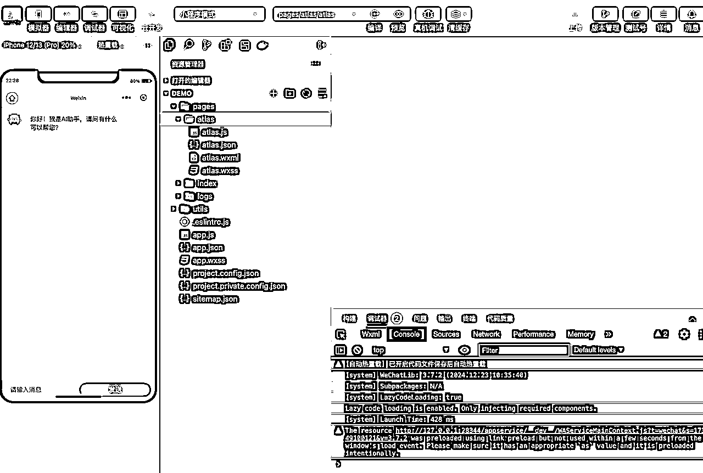

然后接下来需要做的就是继续优化我们的页面，以及实现功能。

比如我们现在觉得这个发送的按钮非常丑，想把它放到输入框里面。就可以直接对Cursor说：“我希望把页面最下方的发送按钮放到输入框的里面最右侧，发送按钮可以使用一个图标来展示。”。

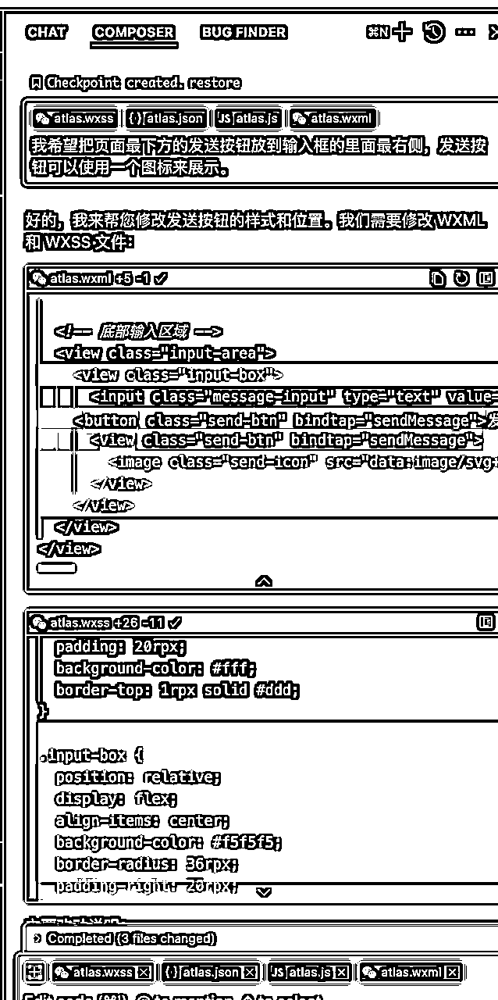

然后，无脑选择"Accept all"同意他的修改后，回到微信开发者工具，点击编译，继续观察模拟器。发现页面修改的符合自己的要求，我们可以先模拟测试一下。

比如说在输入框里面输入“你好，我是用户”。然后你可以看到机器人快速的回复了你一条消息。

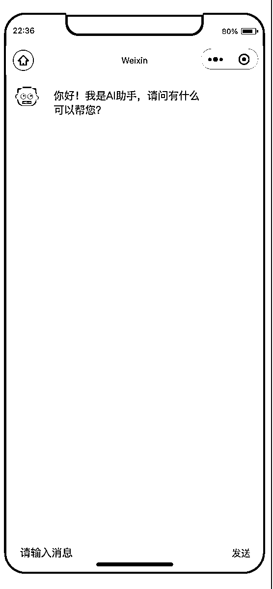

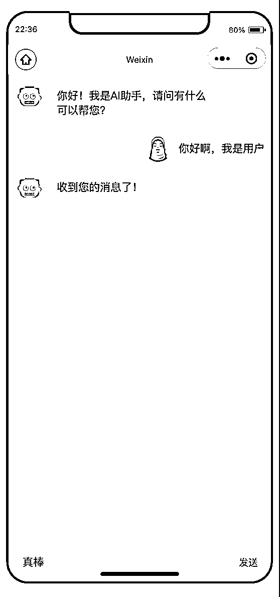

然后对于这个页面功能的实现，你是否满意？比如上面右图，你发现用户的头像，它放错了位置，我们希望他在文字的右侧。比如背景比较单调，我希望有一张图片.....

这个时候我们要做的就是不断去重复重复重复重复......刚才的操作，把问题发送给cursor，然后无脑点同意，再去微信开发者工具中编译，观察模拟器......

## 5、接入大模型能力

如果你想让机器人回答更智能，就需要接入大模型的能力。列举几个市面上主流的大模型有：

千帆大模型：https://cloud.baidu.com/doc/WENXINWORKSHOP/s/Fm2vrveyu

星火大模型：https://xinghuo.xfyun.cn/sparkapi?ch=bytg-api01&msclkid=ed5007893cd6168c7bac60e26b7874c0

通义千问：https://help.aliyun.com/zh/model-studio/developer-reference/use-qwen-by-calling-api

kimi：https://platform.moonshot.cn/docs/guide/start-using-kimi-api

我这里就选择的是百度的千帆大模型，大模型能力虽然是收费的，但基本每个平台都有免费的试用额度，用于开发试用足够用了。

关于大模型平台的注册、获取key，这里就不赘述了，网上教程写的都很详细：https://blog.csdn.net/qq_53962537/article/details/132013837

如果你想把大模型能力，接入对话系统，就只要打开cursor告诉他：

“请学习‘https://cloud.baidu.com/doc/WENXINWORKSHOP/s/Fm2vrveyu’链接中的请求与响应方式，然后修改当前代码。”

他就会自动根据文档生成调用的代码了。但需要注意的是生成的代码中会有注释，让你修改API_key、Secret_key的位置，你只要把自己的key复制进去就可以了。

## 6、不断重复

到这里，关于代码的编写部分就全部结束了。下面要做的就是发挥你的想象，不断把页面、功能一步步优化完善起来。

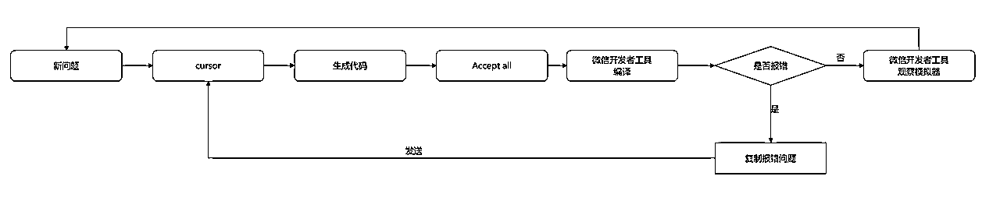

## 7、踩坑点

<1> 如果你访问的地址是ip，不是域名，需要把微信开发者工具 - 详情 - “不校验合法域名、web-view(业务域名)、TLS版本以及 HTTPS 证书”这一项勾选上。

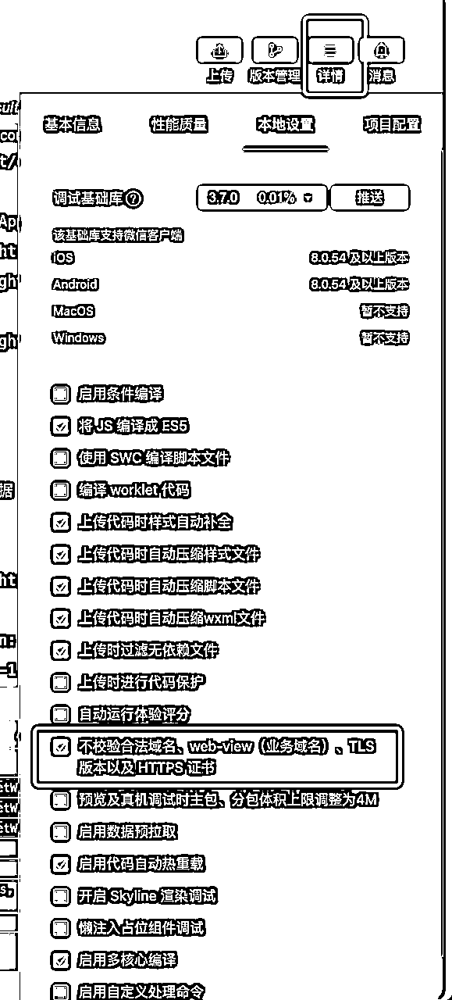

<2>如果你接口中访问了域名地址，需要将地址在小程序后台 - 管理 - 开发管理 - 开发设置 - 服务器域名 中配置

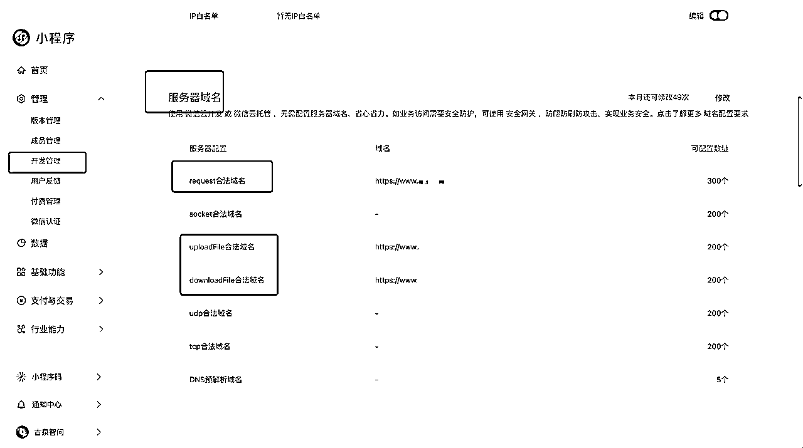

<3>如果你希望在手机真机上调试小程序，可以点击 微信开发者工具 - 预览/真机调试 - 等生成二维码后，使用手机扫码就可以访问了。

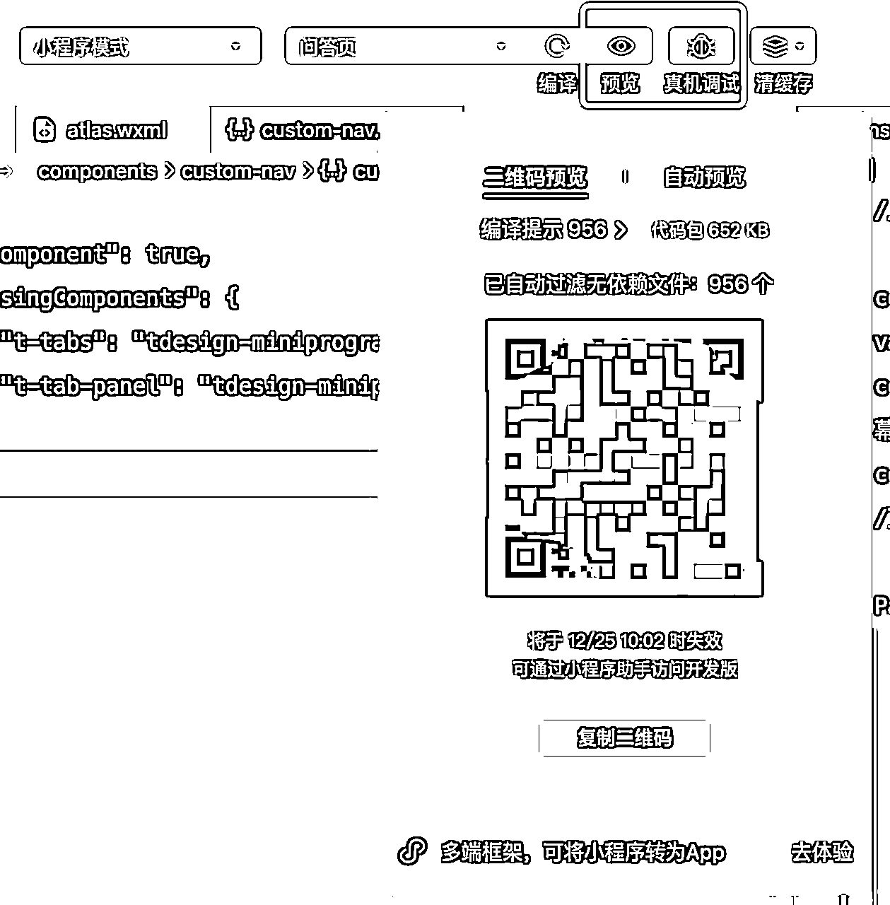

# 三、部署发布

## 1、上传代码

当你全部编写完成，需要发布时。在微信开发者工具中 - 上传 - 确认 - 填写版本号和备注 - 确认。代码就上传成功了。

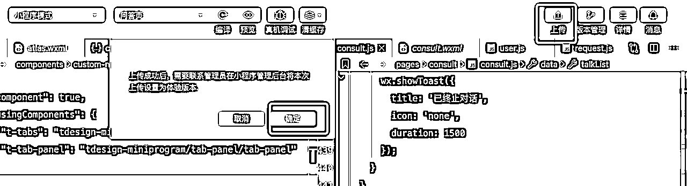

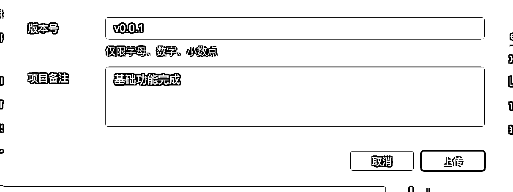

回到小程序后台https://mp.weixin.qq.com/，版本管理 - 开发版本，点击右边箭头，这里有两个选项。“提交审核”是发布到线上环境的前置工作，这里可以理解成腾讯需要检查一下，你的小程序中有没有涉及黄赌毒，在上面的审核版本模块中会显示审核结果。只有审核成功，你才有资格发布到线上环境，让所有人来使用。

## 2、发布体验版（私域）

另一个选项“选为体验版本”，等于是给一个预览版本，只有扫了体验版小程序二维码的用户，才可以体验小程序，非开发者体验是要在后台的管理成员管理中进行授权配置。

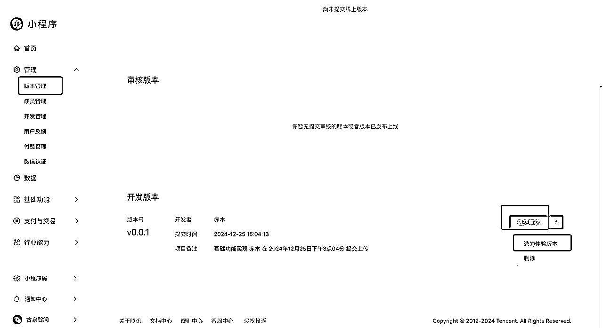

## 3、发布到线上平台（公域）

点击“提交审核”，就开始进入审核阶段。

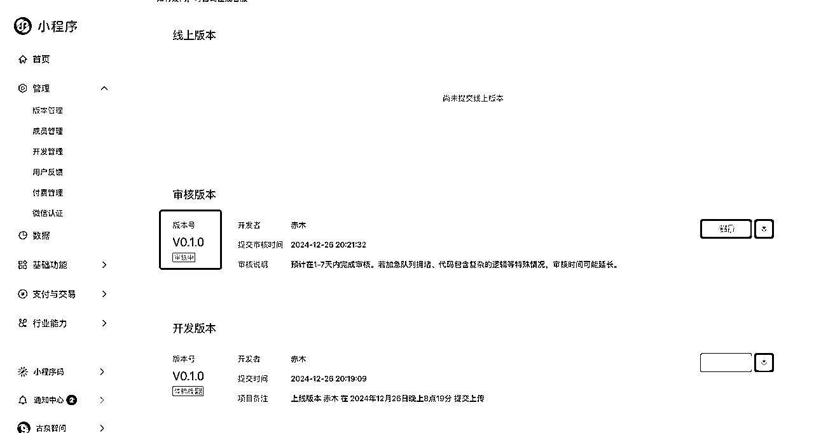

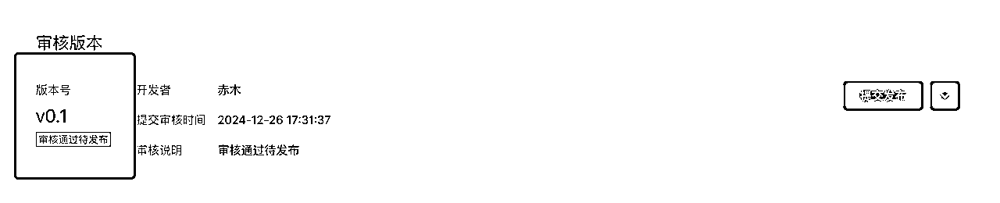

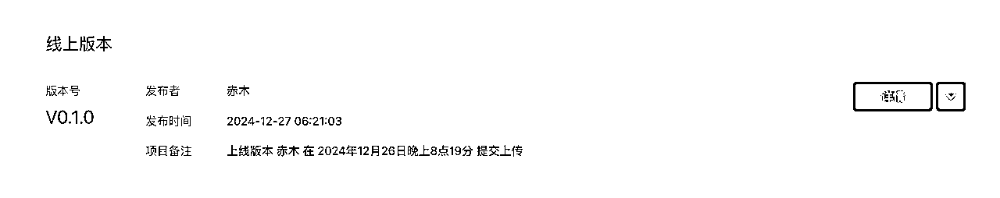

# 四、转化

做这个小程序的初衷是看到亦仁大大发的龙珠悬赏，恰好最近又在尝试使用cursor这个平台，所以就把这个项目编写过程记录下来分享给大家。

小程序现阶段还处在一个引流的阶段，当独立访问用户大于500个UV的时候，才可以开通流量，通过广告的形式赚取点击，当然这是小部分的收益。

后期具体变现路径，暂时还没有好的思路。

# 五、其他补充

1、这次使用自然语言总的感觉还是很惊艳的，即使你是没有任何技术背景的小白也可以快速编写出一套需要的程序。虽然有时他生成的代码不是最优解，但结果是功能都可以实现。

2、我在使用cursor时，还是单个页面的去设计。如果你想更快，可以试试用cursor的composer功能，

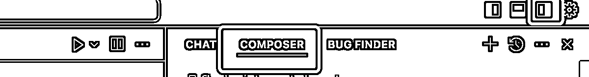

提问修改问：

1、你现在是一个微信小程序UI研发专家，熟练掌握小程序的各种UI设计。

2、你要根据你的经验设计小程序的整体风格。

3、你现在已经在微信小程序项目的根目录中。

4、你要设计一个页面，页面里面有一个日历。用户可以自由选择年、月、日的维度来显示。

3、在开发过程中遇到报错很正常，只要慢慢让他修改，他总会改正确。之前有个小错纠正了快五六次才解决，所以不要慌。

4、微信小程序在使用下面能力时需要在 “小程序后台 - 账号设置 - 服务内容声明 - 用户隐私保护指引 - 去完善” 里面配置， 不然功能无法使用。

5、我这三天也是陆陆续续的做这个小程序，如果有圈友连续时间来做，估计一天应该差不多。这里在强调一下几个比较耗时的时间节点：服务器认证(7-22天)、域名备案(7-22天)、小程序认证(1周左右，快的话当天也能结束)、代码发布审核(1-7天，通常在5小时内可以完成审核)。

6、实操过程中遇到问题，或者有好的变现思路的圈友，也可以加我微信【H452555338】进行交流（加好友请注明来意）