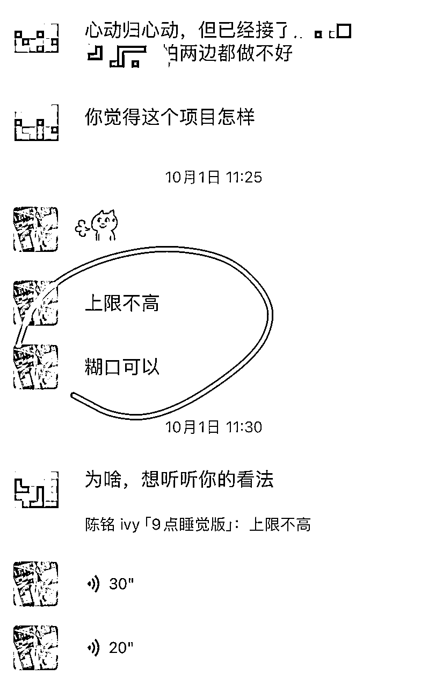
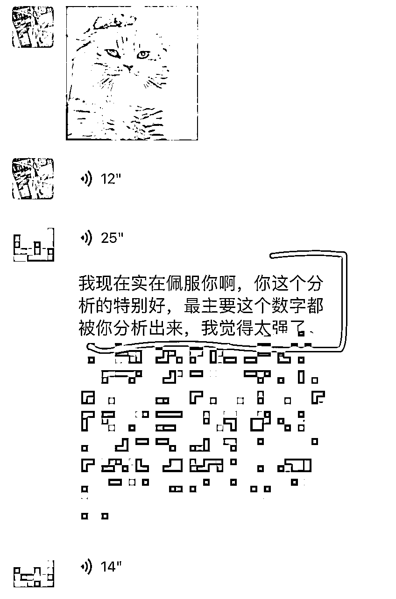

# 如何通过财务模型，判断一个项目是否值得做？

> 来源：[https://ht16ej1tui.feishu.cn/docx/XYbzdnOcKoeM1gxaB3xcrzPxnsd](https://ht16ej1tui.feishu.cn/docx/XYbzdnOcKoeM1gxaB3xcrzPxnsd)

圈友们好，无论你是创业者还是公司的业务负责人，在工作中总会面临一个决策：新项目应该做吗？

而这个决策，很大程度上取决于另外一个问题的答案，那就是：这个项目赚钱吗？

怎么判断一个项目是否赚钱呢？

我来分享几个分析方法，帮你从财务角度判断一个项目，值不值得做。

Hi，你好，我是创业从不亏本的ivy，和我的合伙人珍妮子一块靠1500元起家，在小红书留学两年做了2700万，又转去房产赛道两个月卖出1个小目标的房子，这是我们创业的第三年，侥幸逃过“创业公司一般三年倒闭”的魔咒。

三年间我们做过20多个项目，能放大，有稳定收入的只有三个，很多项目我跑一个月就能通过财务数据判断：这个项目能不能放大，天花板在哪里，一旦发现不对劲我就会及时止损。

今年遇到很多合伙人问我们：A项目怎么样，B项目怎么样，C项目怎么样。

我快速分析下这个项目的商业模式和财务模型，就能把加入项目能赚到的钱、需要付出的努力，都给算出来了。

所以今天总结下如何通过财务模型判断项目好坏，希望能给在选项目的老板们带来帮助。

# 财务模型是由什么决定的？

总的来说，由三个因素决定：

1.1 选赛道，选现金流好、高门槛、高利润的赛道

1.2 选位置，选最赚钱的产业链位置/岗位

1.3 选战术，选有复购的商业模式

## 1.1 选赛道，选现金流好、高门槛、高利润的赛道

如果赛道是好赛道，运营能力差一点，也能进去捡钱，但如果赛道是差赛道，哪怕创始人再牛，也很容易粪坑蝶泳。

接下来就以一位留学行业老板的财务模型，来举例说明，赛道对财务模型的影响（所有数据均已脱敏）。

这位老板的主营业务是澳新免费留学申请（零押金版），是留学申请中最hard模式的赛道，利润来源于院校次年返佣。

主要获客渠道为小红书，每月加微信几百人，转化率3%，每月签约客户数在20个左右。

每年签约客户数在200左右。入学率非常低，不到10%，只有不到20人。

每个入学学生的佣金算1.5万，总佣金在30万左右，这就是辛苦一年的收入。

这位老板，在高峰期有10+人的团队，后面解散团队又付了一笔N+1赔偿，再加上在小红书引流还有聚光投放的费用，最后收到的院校返佣也不够付这些成本，老板自己还贴了一些钱。

这个收入模型里有两个特别大的痛点：

一是两层漏斗筛选后，留下来的付费客户太少，一年能加五六千个微信，但是签约的只有200人；

这200人需要不收费服务一年，一年后入学的人却不到20个，有90%的时间精力是浪费在了不给钱的人身上。

二是，好的现金流模式是“先收后付”，即先收客户的钱，再给供应链付钱；但是免费留学申请的商业模式是“先付后收”，即先付给员工的工资，再收到学校的返佣，而这中间的时间差长达一年。

做免费留学申请，虽然单个学生的佣金看起来很多，但是“先付后收”的商业模式，叠加“转化率和入学率低”的bug，就是地狱开局。

这种商业模式，如果是个人自己做，能优化每一个环节的转化率，能把签约率提到10%，入学率提到30-50%，一年挣个几十万，还是很舒服的；但如果把模式放大，就会面临非常多的不可控，比如转化率的下降，又或者是90%的学生由于各种原因，不去读书，最终给利润带来毁灭性的打击。

那什么样的赛道才是好赛道呢？

我认为，好赛道有3个标准：

1.  现金流好，先收后付。

查理·芒格曾经说过：我们偏好能产生大量现金的生意。他认为，一个优秀的商业模式，应当能够在不需要不断追加大量新资本投入的前提下，持续产生稳定的现金流。

1.  有高门槛和进入壁垒

有人可能会想，我进入一个门槛低的行业，不是更简单吗？我做到头部，不也能赚钱吗？

但其实公司的利润水平，长期来说，会回归行业均值。门槛低，就意味着有更多的竞争者。而竞争者们，会把你的利润拉到行业平均水平甚至更低。

但是有门槛，则意味着你的竞争者不会太多，你不需要去和其他竞争者打价格战，也有更多时间，来建筑自己的护城河。

正如京东花了10年的时间来自建物流，因为消费者不需要第二个阿里巴巴，消费者需要的是下单后“当日达”和“明日达”。

1.  高利润

一个行业创造的总体价值，在产业链上的分配是极不均匀的。

一家公司创造的总体价值，在不同岗位上的分配，也是极不均匀的。

如果你不想费劲巴拉的创业，却要给员工打工，那么一定要选择一个高利润的商业模式，或者坐到能拿高利润的位置去。

## 1.2 选位置，选最赚钱的产业链位置/岗位

举个例子。之前有一位合伙人来问我，他有一个当地朋友，开了一家做短视频知识付费的公司，想出让50%股份给他。

他要了过去一年半的经营数据，想让我看看是否值得投资。（以下数据均已脱敏）

在过去一年半，这家公司的总营收为200万。

公司和主播是三七分的，公司拿30%，60万，主播拿70%，140万。

而公司拿到的60万，还需要付房租，水电气网，中控，客服的工资，以及手续费。付完这些支出后，老板只剩下20万的利润，还不到主播的零头。

更可怕的是，老板一个月的固定支出（房租，工资等），等于两个月的利润，也就是说，老板得挣两个月的钱，才能养得起他的团队亏一个月的本。

在这家公司，做主播的远比做老板的拿得多，那么最好的位置就不是做老板，而是做主播。老板看起来像是给主播打工的。

所以，当你想要进入一个行业，或是一家公司，一定要先算清楚，不同的产业链位置和岗位，分别拿到的钱是多少？尽量选择拿钱多的位置来做。

## 1.3 选战术，选有复购的商业模式

商业模式是什么？

简单来说，就是一个公司/个体能提供什么有价值的东西，如何卖到客户手里，并且从中赚钱。

商学院教材里有一个非常经典的商业模式，就是雀巢公司的奈斯派索咖啡机。

这个品牌最初的产品是高端咖啡机，但公司很快发现，光卖这个产品，并不是一个好的商业模式。

因为在美国，高端咖啡机市场竞争激烈，奈斯派索的价格高，没有竞争力。其次，机器的销售是一次性的，如果要维持收入，就得不断拉新客户。最后，客户买了咖啡机后，可能后续选择其他品牌的咖啡豆；奈斯派索费劲拉来的新客户，却只能赚一次卖机器的钱，非常亏。

当时，奈斯派索的财务情况岌岌可危。在这种情况下，奈斯派索新来的CEO，通过改变商业模式，成功改变了公司的命运。

他做的第一件事，就是把咖啡机卖得很便宜，同等品质，价格最低，是很好的促销手段。同时，公司研发了一种特制咖啡胶囊，只能在奈斯派索的咖啡机上用。这样一来，客户就会源源不断的复购他家的胶囊。在咖啡机上少赚的钱，后续都可以通过胶囊赚回来，甚至更多。

这种商业模式就是“剃刀+刀片”模式，通过低价销售一种产品（如剃刀架），把客户“锁定”到某个生态系统内，然后通过与之配套的消耗品（如剃须刀片）的销售，来获取稳定的收入和利润。

我和珍妮之所以从留学行业，转行到房产行业，也是因为，留学行业几乎没有复购，每年都要拉新，才能维持收入。而随着小红书做留学的越来越多，获取客资也变得越来越难，大家都在红海里卷生卷死。

而房产项目，目前来说还是一个大蓝海。高净值房东，在信任我们，把房子成功售出后，也会将后续的买房，装修，贷款，落户，甚至孩子转学，都交给我们打理，一个客户的终身价值很高。

# 判断一个项目是否值得做，可以看哪些财务指标？

完整的财务指标，是在三张财务报表的基础上，做进一步的计算和分析。但很多小公司/小项目，没有财务报表，也没必要算的太复杂。我们只需要抓大放小，快速地从一堆数字中判断出这个项目的整体情况即可。

所以我提取出了影响比较大的3个财务指标：

2.1 分析现金流-烧钱速度

2.2 分析业务-最小单元是否赚钱

2.3 分析客户-客户获取成本与客户终身价值

帮你判断一个项目是否值得做。

## 分析现金流-烧钱速度

做项目，最理想的情况，当然是每天的现金流都是正的。

但也不是所有现金流为负的项目，都不值得投入。

当每日现金流为负的时候，我们可以通过计算烧钱速度，判断这家公司现有的资金，能烧多久，在钱烧完之前，能否有现金流回正的转机。

计算公式：烧钱速度=(经营现金流出−经营现金流入)/时间周期

举个例子。假设一家西餐厅在某个月内的经营情况如下：

经营午餐和晚餐，获得经营现金流入6万元，房租水电，员工，食材成本等经营活动相关的现金流出是12万元，时间周期是1个月（假设30天）。

那么这家餐厅每天的烧钱速度= (120000−60000)/30=2000元/天，也就是说餐厅每天会消耗2000元的现金。如果公司手头有30万的资金储备，按照这个燃烧速度，理论上它可以维持150天（300000/2000=150天）的运营。

如果150天内，这家餐厅的现金流能扭亏为盈，这个项目就还可以继续做，但如果通过调研发现，当地餐厅经营月收入最高也只有10万，再怎么优化也是做一天亏一天，那这样的项目就需要及时止损。

## 2.2 分析业务-最小单元是否赚钱

每个业务都是由若干个“最小单元”组成的，如果每个“最小单元”都能盈利，且能覆盖固定成本，那么这个业务整体就是赚钱的。

那么“最小单元”是什么呢？

这取决于具体的业务，比如说，网约车的最小单元可以是一辆车，直播平台的最小单元可以是一个主播，留学申请公司的最小单元，可以是一个申请全案服务。总之，我们选择的最小单元，需要能反映这个业务收入和成本之间的关系。

确定最小单元后，我们就来算“最小单元贡献利润”，也就是每个最小单元能给公司赚多少钱。

举个例子，我之前个人开展留学申请业务，与兼职的后端交付老师合作，做一单给一单的钱。收到客户的费用后，我把其中50%转给交付端老师作为服务费，剩下50%作为我的利润，那就是做一单，赚一单，每一单的现金流都是正的。

但如果我想要扩大规模，租办公室，雇佣长期稳定的员工来做流量，销售，交付的工作，那就会增加一些固定成本，这时候就需要计算每月的固定成本，和最小单元贡献利润，来测算，每个月接多少单，才能达到盈亏平衡。

假设每月办公室租金和水电费为10000元，员工底薪为30000元，聚光投放成本为5000元，那么总的固定成本为45000元。

假设每单留学申请的价格为15000元，其中需要拿出40%作为流量，销售，交付员工们的总提成，那么每个最小单元的利润为15000-15000*0.4=9000元

盈亏平衡点的计算公式为：固定成本除以最小单元贡献利润

45000/9000=5

也就是说，每月签约学生数量，需要达到5人，才能不亏本。5人以上，老板才会有剩余利润。

这也是很多赚钱的小生意，一旦做大，老板就会开始亏本的原因。因为当老板是一人公司，只用兼职员工的时候，每做一单都是纯赚，但如果要扩大规模，加上固定成本，就有亏本的风险。

所以老板在扩张自己的生意之前，一定要先算一下盈亏平衡点，避免生意做大了反而亏钱。

## 2.3 分析客户-客户获取成本与客户终身价值

如果最小单元的利润贡献是正的，说明这个业务每单都能赚钱，老板就可以考虑扩大业务规模。

但在做这个决定之前，还需要再思考一个问题，也就是客户获取成本和客户终身价值。

因为盈亏平衡点告诉我们的是业务的局部盈利能力，它只考虑业务本身的成本。如果你要大力推广这个业务，还会涉及到另外一个重要成本，就是获取新客户的成本。

客户获取成本

客户获取成本，简称CAC，指的是获取一个新客户所花费的总成本。包括市场推广费、广告费、销售薪酬等所有用于获取新客户的费用。

计算公式是：客户获取成本=获取新客户的总成本/新客户数量

举个例子。假设一家留学公司，在抖音付费投流，花了10,000元投流费用，10,000元员工工资，总共20,000元。转化了10个客户，那么每个客户的获取成本就是2000元。

客户终身价值

客户终身价值，简称LTV，指的是一个客户在其整个生命周期内给公司带来的总收入。

计算公式是：客户终身价值=每个客户的平均收入×客户的平均生命周期

（复杂版）

每个客户的平均收入表示每个用户在一个时间段内贡献的平均收入

计算方式是：总收入/总用户数。

客户的平均生命周期，是指客户从首次消费到最终流失的平均时间

计算方式是：1/客户流失率。

举个例子。假设公司每月的总收入为300,000元，总客户数为1,000人，那么每个客户的平均收入是300元。如果每月的客户流失率为5%，平均生命周期就是 1/0.05=20个月，那么客户终身价值就是300元/月×20个月=6,000元

（楼上太复杂不看版）

简单来说，客户终身价值，就是一个客户这辈子会在你这里花多少钱。假设留学申请收费15000元一单，基本没有复购，那么一个客户的终身价值就是15000元，如果获客成本是2000元，那就可以疯狂扩张，因为高终身价值，撑得起高获客成本。

算出客户终身价值和客户获取成本之后，我们就可以用这两个指标来进行客户分析。

当“客户终身价值/客户获取成本”，这个比率大于1时，就说明公司获取客户的ROI 是正的，可以继续复制。这个值，越高越好。

# 致谢

感谢我的合伙人珍妮子，一起跑房产项目的海里，引领我们走向房产赛道的幕后房产boss。因为有大家，我们才可以一起尝试这么多项目，让我从这些项目中，总结提炼财务模型。

靠谱带我和珍妮一块进了生财，在生财看精华帖创业成功，遇到了芷蓝姐和靠谱指导我们，又泡在了理白的圈子学习，在留学行业下滑时，又在生财遇到了带我们去房产赛道的幕后boss，做项目时遇到了海里。

项目的跑通，离不开团队的齐心合力。

感谢和我们一起做项目的流量团队，转化团队，交付团队。

感谢生财有术。

感谢这个圈子，让我遇到这么多优秀的人。

# 历史介绍

我是创业从不亏本的ivy，加入生财两年

与合伙人珍妮子一起，做了一家年营收千万的留学公司

我们过去曾发表过几篇文章

能看到这，代表你对文章的喜爱

肯定有一定的程度！

也欢迎阅读我们写过的历史文章。

2022年的文章（精华×1）

1.  精华《粉丝3000月营收20万，小红书低粉高变现的蓝海攻略分享》

https://t.zsxq.com/GK9Nq

2023年的文章（精华×2）

1.  精华《如何让你的钱花的有价值？小红书聚光投放实战攻略》

https://t.zsxq.com/d0hv0

1.  精华《小红书教育赛道GMV1600万/年，小团队创业心法》

https://t.zsxq.com/iIXtQ

2024年的文章（精华×4）

1.  精华《老板避雷手册|年1100w营收背后，如何识别不合适的运营人员、合作商、合伙人？》

https://t.zsxq.com/uldES

1.  《老板避雷手册2：运营端忽视这些细节，会让你血亏500万》

https://t.zsxq.com/FKyYB

1.  《如何和另一半&长辈相处，实现2700w营收的同时稳定家庭？》

https://t.zsxq.com/KaIHx

1.  精华《小红书两年做了2700W营收后：我对「留学行业的趋势分析」》

https://t.zsxq.com/ZKsjN

1.  《「续集」老板避雷手册3：如何识别不合适的运营人员、合作商、合伙人？》

https://t.zsxq.com/YNLuh

1.  《老板避雷手册4：卖「合伙人产品」要避开的雷区，2个半月卖122.98万后，我的观察》

https://t.zsxq.com/LWDf9

1.  精华《留学从业者转行去「大蓝海」，2个月卖出1个小目标的产品❗（第一集）》

https://t.zsxq.com/1GLiq

1.  精华《2024，哪些赛道的人要「提桶跑路、去哪里找蓝海」❓留学赛道转行2个月卖出1个亿后的分析》

https://t.zsxq.com/RNhhV

1.  《「老板识人大法」：如何避免被人割韭菜？筛选运营、销售、与交付人员？》

https://t.zsxq.com/AMB7J

1.  《海外旅游赛道，天坑赛道中的清北，2024要怎么破局》

https://t.zsxq.com/gnrEe