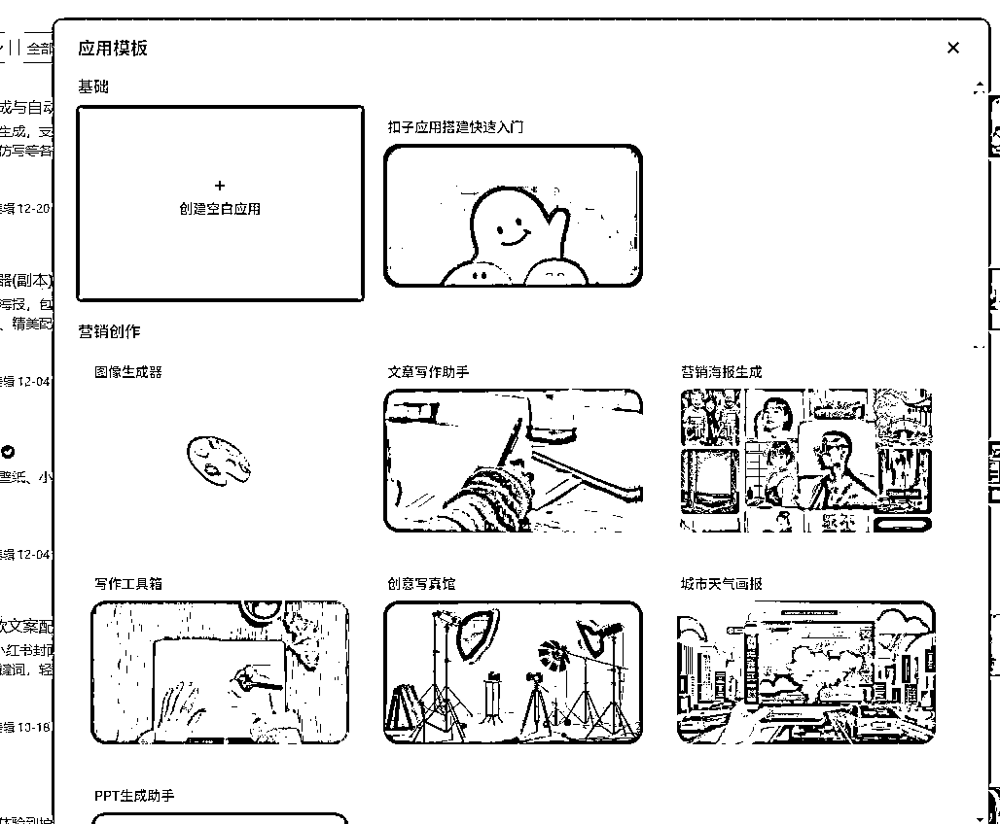
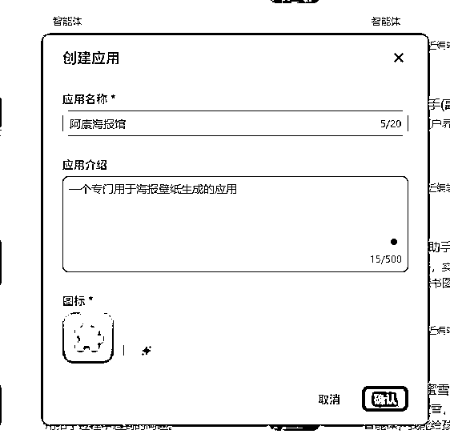
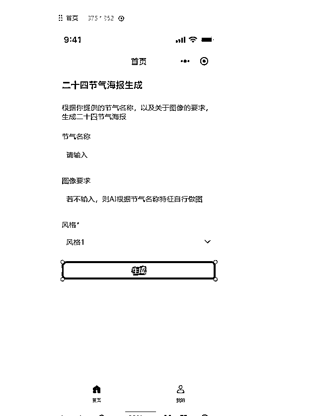
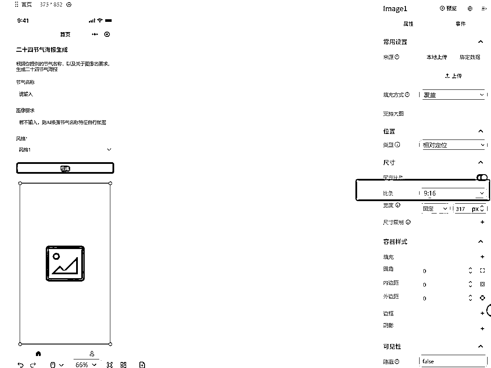
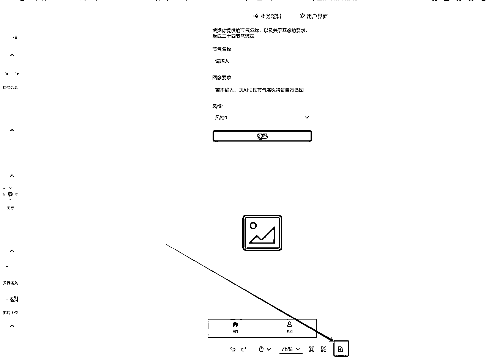
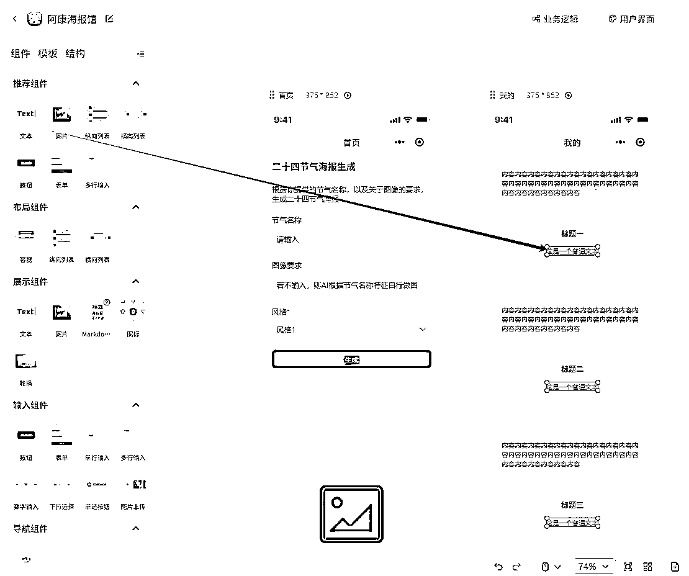
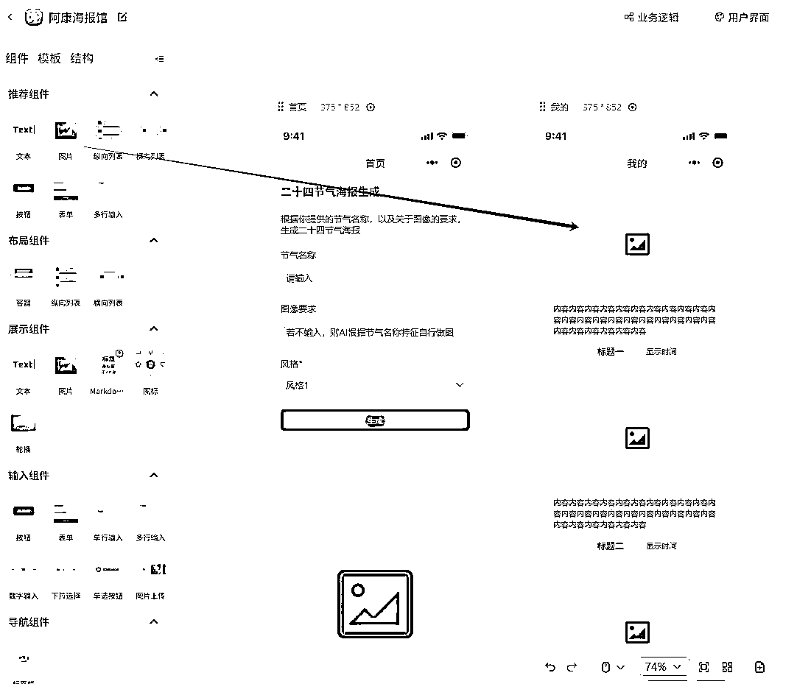

# Coze应用实战！如何利用coze应用功能，开发一个海报生成小程序，并发布到微信（一）

> 来源：[https://b121w2zgwyx.feishu.cn/docx/XevpdRH0JokjJzxtZ71cvnPMngc](https://b121w2zgwyx.feishu.cn/docx/XevpdRH0JokjJzxtZ71cvnPMngc)

coze最新的更新，可以创建应用并发布到小程序了，虽然目前coze应用目前还处于beta测试版，但我目前体验下来，感觉真的太强大了。

从此我一个从来没折腾过微信小程序的，也可以通过拖拉拽轻松搭建一个自己想要的应用了，这种感觉真的太好了。

如果你也有自己的创意，却苦于开发成本太大。

那么，现在！可以跟着我的脚步，来试试亲手做一个微信小程序吧！

今天的目标是，教大家把页面建设起来，come on！

# 一、如何创建一个应用

## 1、进入coze，创建一个空白应用

## 2、点击创建，选择创建应用

## 3、接着点击创建空白应用

## 4、然后根据你的需要填写相关信息，点确认

# 二、规划功能

为了方便零基础搭建，我这里不设计太复杂的功能，这个海报生成器，我只设计两个功能点

1、首页，里面就是一个生成海报的页面

2、我的、里面保存历史生成的记录

以上功能的具体逻辑，都将使用工作流来实现，后面我会细说，今天的目标主要是完成页面的设计。

# 三、如何搭建一个移动端的UI界面

应用有了，那么接下来，就是设计页面了。

## 1、选择UI搭建类型

进入应用之后，点击上方的“用户界面”，选“小程序和H5”，然后点“开始搭建”

## 2、设计“首页”，一个海报生成页面

### ①、添加一个表单，用来做请求生成

### ②、设计表单

我的页面很简单，就是用户提供一个24节气的节气名称，然后填写一下生成的图像要求，然后点击生成，就生成一个海报。所以将表单修改之后如下图：

内容的修改很简单，就是点击你要修改的地方，右边就会出现属性什么的，基本一看就会，所以我就不细说了。

### ③、添加一个用于显示生成图片的位置

点击生成之后，会生成图片，因此我们需要设计一个地方来预览这个图片，我这里就简单做，不做多个层级，我直接在表单下方添加一个图片用来显示。

因为我们做的手机的壁纸，所以图片比例需要修改为9:16

这样一个简单是首页就搭建完毕了，有的人可能会问了，那页面上一进来就有这个图片，看着也很奇怪呀。没错，

确实很奇怪，所以后续我们在做业务逻辑的时候，还需要对图片的可见性进行控制。现在先不着急改。

## 3、设计“我的”页面，展示历史生成记录

海报生成之后，我希望将生成的数据记录下来，这样后续可以看到之前生成的图像，这应该算是基础功能吧。

### ①、新建一个页面

点击页面下方这个按钮，新建一个页面，我们命名为“我的”

### ②、关联菜单项到“我的”

点击页面下方的菜单栏，然后将“我的”按钮页面跳转跟新建的页面关联

记得，前面是首页那里的菜单也要同样设置一下，否则菜单会有问题。

都设置完成之后，点击一下预览查看一下点击菜单的切换是否正常。

### ③、添加一个纵向列表

用来展示历史生成图片

### ④、增加标题和时间显示

我希望，图片在上，然后图片下方是节气名称加上生成时间最终效果是这样子的

那要怎么做呢？

我们如果需要改变一些布局，我们需要用到“容器”控件，这个控件专门用于我们灵活排版的。现在，我加一个容器到内容下方，只需要拖动到一个，其他列表一样就会出现了。

接下来我们单击标题，不要放开，将它拖动到容器中，现在变成这样子：

由于我还需要显示一个时间，所以我还需要拖进来一个文本显示

文本是进来了，但是我们发现这样子的排版看着有点奇怪吧，所以我需要再调整，点击控件位置

然后调整右边这些参数，高度改成：适应内容，排列方向选择横向，内边距调整成0，大家可以自己随便改改看看效果，后面就知道每个功能大体什么意思了。

经过上面一顿操作，现在页面就变成这样子了

### ⑤、增加图片显示

因为我们需要显示的是图片记录，因此我们还需要将内容替换成图片，我们把图片拖进来，然后把原来的内容删掉

最终效果就变成这样子了：

到这里，我们的页面搭建就基本完成了。当然大家如果要求高的话，可以自己再动手美化美化。

干货内容太多，本期就先分享页面搭建了，下一期将带大家实现海报生成的业务逻辑。敬请期待！