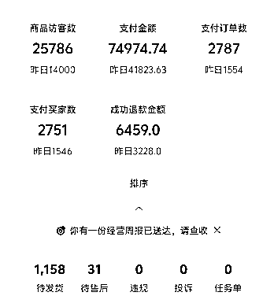
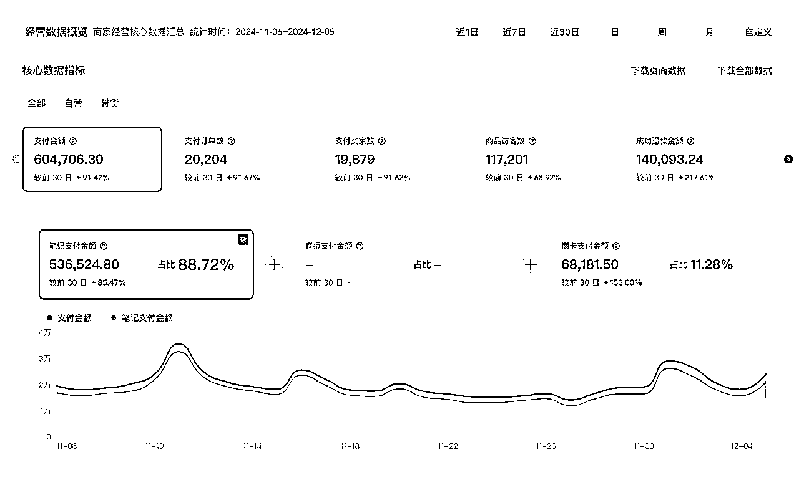
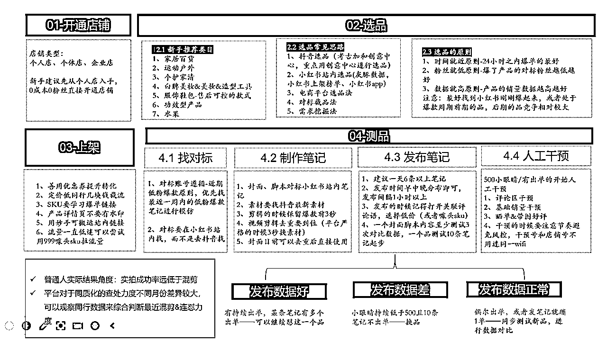
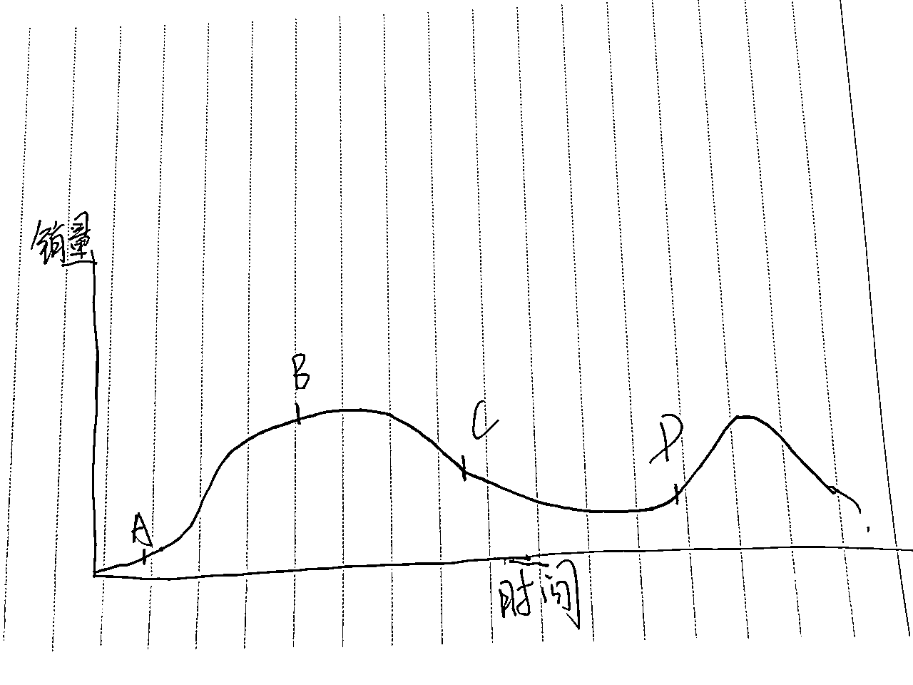
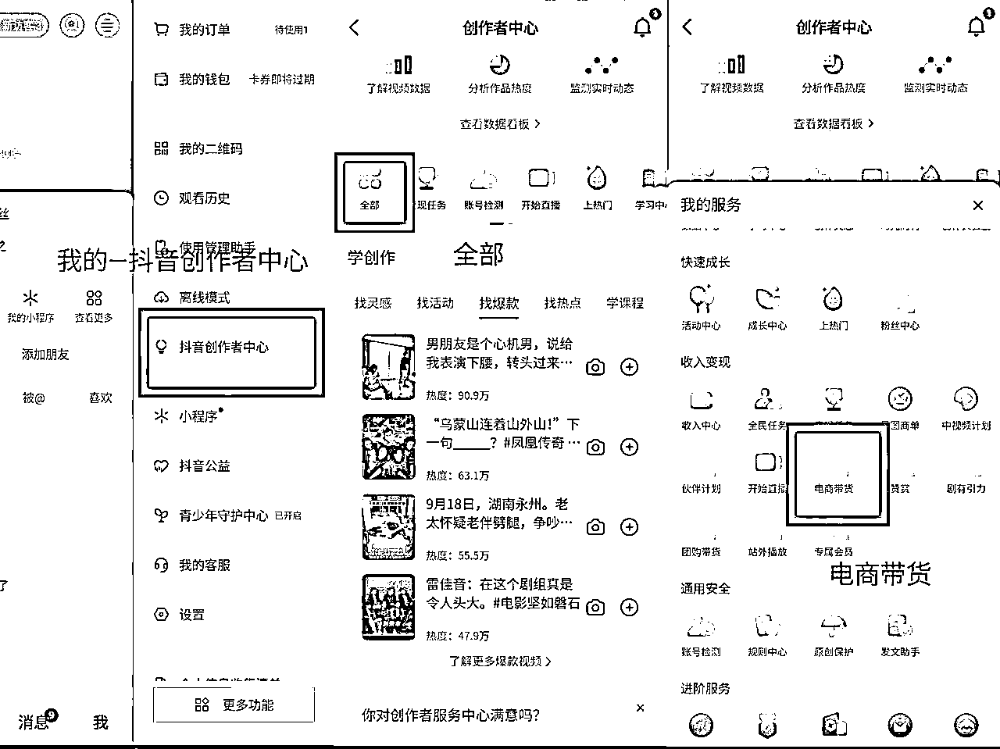
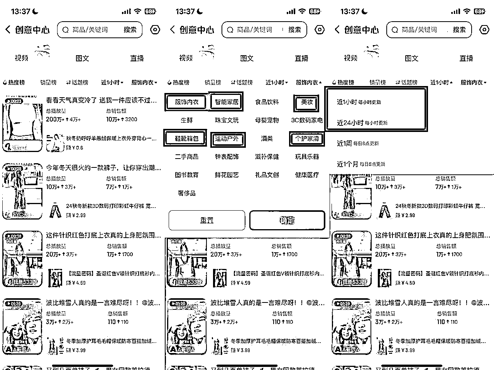
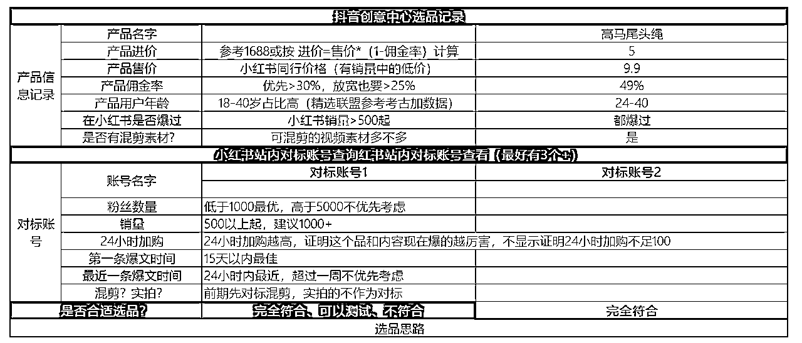

# 小红书电商全流程解析

> 来源：[https://hi428l7bh89.feishu.cn/docx/XnVhdzJTnoKNvRxkvQEc4JwLnRd](https://hi428l7bh89.feishu.cn/docx/XnVhdzJTnoKNvRxkvQEc4JwLnRd)

哈喽大家好，我是小刀，去年5月份跟着生财的航海开启了小红书电商之路，到现在已经1年半。

这1年半一直聚焦在小红书电商，多店GMV破百万，涉及的类目主要是百货、美妆美妆工具、运动用品、功效、养生用品等。

10月份小红书平台经历了流量低估，11月份账号流量恢复，新号单账号单天近8万GMV

单店铺单月GMV60万+（混剪）

全文7300字，阅读需要15-20分钟。

* * *

# 小红书项目解析

为了阅读体验，我假定你是一个0基础的小伙伴，帮你梳理了一下从0开始做小红书电商这个项目的全流程步骤。

而本篇内容就是梳理项目成本的2个关键点，即【01-选品】和【02-测品】，目录如下：

1、新手选品建议

1.1 最高效率的选中爆品的方法

1.2 新手小白选品的【3不卖】

1.3 建议新手必掌握的选品方法

1.4 进阶选品的选品建议

2、测品的正确方法

1.1 理解测品的概念和方法

1.2 正确的找对标的方法

1.3 制作笔记的要点解析

1.4 人工干预重点

3、其他避坑建议

* * *

# 小红书电商项目解惑

开始之前，先解答一些小伙伴的深深困惑：

小红书电商已经火了小2年，在项目快速迭代的节奏里，很多人肯定有疑问：小红书电商还能干吗？无货源还行吗？混剪还行吗？

先说项目问题：

1、相对比去年上半年，客观来讲难度是增加了一些的，主要体现在入局的人多、竞争大，正反馈时间会拉长一些

2、双11前平台流量调整，大多数小伙伴进入了一段流量低谷期，极大的打击了信心（现在已经恢复）

再说我们实际验证：

1、新手可以爆单：能不能快速爆单主要还是取决于选品，碰到爆品起号率依旧是在线的

2、混剪依旧可行：平台虽然出来严打同质化的规则（同质化不仅针对混剪 实拍同样需要注意），但是近期平台对于混剪的查处力度很低

现在入局更建议实拍还是混剪？

不谈具体的能力和实际的情况，只谈要什么形式是耍流氓。

先从能力上来看：

对于大多数产品的实拍难度是大于混剪的，实拍对于拍摄技术、网感有一定的要求，且这个能力很难短期快速提升。

混剪的好处是可以短期习得剪辑能力，让自己的素材不是劣势因素。

所以如果你本身有实拍的能力，当然建议选择适合实拍的产品走实拍长久路线；但是如果是纯小白，建议从混剪入手，先行动起来。

从选品上看：

如果笔记是以视频素材为主体的产品，且视频素材需要多场景拍摄/需要露脸的，建议直接走混剪。

比如常见的百货类目，你实拍一个魔法拖把需要的场景、时间成本都太高了，而且这类产品在抖音存在大量的可以混剪的素材可以用，拿捏好剪辑尺度，违规率非常低。

比如卷发棒、睫毛夹这样的产品，还需要露脸展示产品使用效果，对于拍摄模特本身的要求也较高。

如果笔记是以图文/实况或者单场景视频内容为主体，且对于拍摄审美要求不高的产品，则考虑二创和实拍结合起号。

比如夏天火爆的冰敷小风扇，主要是桌面拍摄产品，拍摄难度不高，则可以考虑实拍结合。

混剪建议赛道：家居百货、 个护家清、 美妆造型工具、 白牌美妆产品 、服饰鞋包 、运动用品等

实拍建议赛道：低违规率的功效产品、养生工具 、低客单价不挑身材的女装、不严格挑尺码的女鞋、低客单价白牌美妆产品、水果、大学生宿舍场景的3c产品等

实拍和混剪不是非A即B：

很多人不考虑自己的能力情况就执着于实拍，结果小眼睛发出去几十个根本坚持不住；也有很多人畏难情绪严重不敢尝试实拍。

我一般建议小伙伴抓住什么爆品先开始干，适合混剪的就立马混剪起来，后面品爆单了素材不够了，可以结合部分实拍素材从而提升原创度。

就算你笃定走实拍路线，在有好的二创素材的情况下，也可以利用二创素材起号。

什么形式不重要，重要的是针对我们的能力做我们做的品，怎么才能更快的拿到结果帮我们更容易坚持这个事情。

* * *

# 一、小红书电商选品

关于选品，之前有系统的写过一篇选品的文章，没有看过的可以先回顾一下。

这篇文章因为要强调的都属于影响结果的重点，所以不会跟之前文章一样讲的这么详细，大家可以根据自己目前对于小红书电商的掌握情况结合进行查看。

做小红书电商打死都绕不过去的一关就是选品关，而选品这个技术往深了看是无穷尽的，选品的能力和品感往往也是需要不停的锻炼才能慢慢变得更强。

## 1.1 产品的爆品周期

当一个产品处于不同的时间，对于我们选品的小伙伴来说判断这个品的难点也会有区别。

对于小红书电商想要选品命中率更高，就是要精准的识别在爆款周期内的产品。

A点：在小红书有人做还没有爆起来的品。

对于小白来说难点在于判断这个品能不能爆起来，需要更多的品感和判断力。

优势是竞争少、你先发笔记占据了先机，后面爆单的人是你的概率非常大

劣势是你可能压根不会发笔记，你在【判断这个品】，会担心测不出来选择不测，所有对你的判断力要求很高；其次是还没爆起来，没有爆款的对标封面、脚本，考验你制作封面和内容的能力。

B点：小红书已经爆起来了，有对标，但是对标销量已经不少了

优势：这时候已经有大量的爆款封面对标内容出现，你要做的就算执行到位、数量到位，保证能够有效快速的跟最新的素材和封面

劣势：竞争压力已经上来了，但是在这个图片种，B还在爆款周期内，后面还有一段时间都在爆，爆的周期比较长(比如八字拉力器 胸贴 可以爆一个夏天）

在A和B之前发现这个品快速跟进，对小白来说试错成本更低的。

C点：爆款笔记都是一到两周以前的了，最近一周没有什么爆款内容产出。

优势--没有，这个时候的入局对手最多，市场空间下降、内容同质化增加。

D点：这个品有销量，但是近期已经没有什么爆款笔记了。

属于我们说的，之前小红书爆过，我们要不要做。

这时候很多小伙伴应该记得答案了：取决于能不能有新的素材和封面。

爆款是有概率再爆起来的，但是80%以上都不是莫名其妙的爆了，而是出现了新的素材&封面&内容，重新激活了新一轮爆款周期。

### 怎么判断一个品在哪个爆单点？

一般来说，建议以【这个品在小红书的最新爆文时间】辅助判断

1、如果有新做这个品的号一周之内有爆款笔记产生，大概率这个品还在B点附近；

2、如果一周之内已经没有爆款笔记，或者偶尔有爆款笔记产出但是都是之前这个品已经有很多销量的账号，判断这个品处于C点附近。

3、如果一个品去搜索的时候，爆款笔记都是半个月以上的，那大概率爆品周期已经到了D点。

品的实际爆单过程，不会是我们画出来的这么理想化，一个品的爆单与否跟品本身、笔记质量都有很大的关系，不同的产品爆款周期也不一样。

### 一般一个品的爆款周期是多久？

能不能支撑起来一个品持续爆单，主要是：需求（市场本身多大）+笔记素材。

比如风塑梳这样的品，爆款周期不到1个月，我们做的八字拉力器爆款周期持续了3个月，滴眼液这个品爆了小半年。

当我们选的品，处于A和B的周期范围内，那爆起来的概率就会很大，当我们选的品是C和D，那爆起来的难度就要增加很多。

所以我们各种选品方法，都是为了帮我们更精准的判断我们的选品是处于A B点。

在具体的方法上，对于不同选品能力阶段的小伙伴来说， 在选品这个事情上的注意事项是不一样的

## 1.2 新手小白的3不卖

对于新手小白来讲，想要不在选品上出错，有3不卖：

1、这个品在小红书上销量不到500的我们不卖（近一周突然从0到500的新爆品除外）

2、这个品在小红书上近一周没有爆款笔记的我们不卖

3、这个品的对标爆款笔记模仿难度高的我们不卖（比如需要实拍、没有混剪素材等）

并不是说这3个情况的品本身不行、做不起来，而是对于新手小白来讲，这三个点保证的是我们尽量能命中爆款周期在B点左右的品，每次选到一个品，都考虑是不是符合这3个点。

等到我们能力进一步进阶，就可以挑战在A点就能识别爆品、并且有能力在没有对标笔记的情况下制作出来爆款封面和内容。

## 1.3 新手必备的选品方法

大原则就是我们作为新手小白，1.0阶段主打一个先能够抄明白，抄的最根本点在于能找到我们可以抄、能抄的来的品和内容。

如果一定要掌握一个选品技能，优先掌握【抖音精选联盟--创意中心】选品法，不夸张的说，熟练运用了抖音创意中心的24小时和1小时榜单，一定是不缺爆品的。

抖音精选联盟开通教程

创意中心使用指南

主要看热度榜、销量榜单，时间可以选择1小时、24小时分别进行查看。类目主要看【家居百货】【美妆】【个护家清】【服饰鞋包】【运动用品】。

方便新手阶段能够更准确的判断选品是否合适，提供选品表格式如下图，大家选品后严格按照选品表进行填写，再结合我们的3不卖原则，对90%的品都能进行合适的判断了。

## 1.4 进阶选手选品建议

对于进阶选手来讲，要盯紧榜单的同时，学会避开高峰竞争。

在正常的创意中心选品之外，学会根据榜单上的品去进行截品、延伸需求挖掘产品来保障自己不错过爆品的同时有概率打出新爆品，也就是更多的在A点就能发现识别爆品。

这一步要求大家看到一个品的时候的判断力是在线的，因为很多潜在爆品，小红书站内还没有可以对标的账号，所以能够根据同类产品来判断这款产品的销量。

一种是同一产品不同款式的判断，这个相对简单。

比如 你选出来了B款卷发棒，能根据小红书上A款卷发棒的产品特点、价格、销量、素材质量，来判断B品起来的概率大不大。

比如 你选到了A款睫毛夹，能根据小红书是其他睫毛夹的表现来判断这个品的爆单概率。

另一种是同一需求的产品

比如最开始叶黄素滴眼液火了，后面一看到润目贴这个品就知道都是聚焦到眼疲劳这个需求点，判断需求和市场空间都在，上了之后的爆单概率存在。

分享给大家两个常见的可以用的方法。

【对标截品】

截品的逻辑：找到优秀的同类目对标账号，借鉴他们的【测试结果】

这里面有2个关键点-对标账号一定要选对；小红书和抖音都要找到合适的对标

【需求选品】

能通过一个爆款产品分析出这个品背后的需求点，根据需求出发去搜索挖掘同类产品，从而避开大竞争环境。

# 二、小红书电商的测品

选品阶段最容易掉入的一个误区并不是选品方法层面的，而是心态方面。

90%的新手特别希望能通过一个非常完美的选品方法选择到一个完美的产品，发笔记就出单更新2天就爆单。

但是事实情况是：我们只能通过方法增加我们选品成功的可能性提升概率，在实际操作的过程中，我们需要通过不断【测品】才能最终确定属于我们的品。

并不是产品对了就一定可以爆起来，一个产品在不同的时间点具体的数据表现情况就会差很多。

一个产品在爆款周期内选中+你能有效的制作出来爆款的笔记（封面 标题 内容）+一定数量的笔记+大数据下的概率性，综合多个因素才能最终爆单。

## 2.1 理解测品的概念和方法

同样一个产品，在不同是时间、不同的账号、不同的笔记制作能力之下，都会产生不一样的结果。

实测下来，同样一款产品、同一个操盘手在A账号和B账号上就会有非常大的差异。

测品就是在我们用正确的选品方法选到一个品后，测试在这个阶段、在我们的账号上、以我们的笔记制作能力能不能把这个品做起来。

根据实际操作验证，大多数能爆单的产品在前10条笔记就能比较明显的看出爆单趋势，要么小眼睛数量比其他产品高、要么有某条笔记可以连续出单。

所以混剪类产品一般建议发10条左右笔记来测品，根据发笔记以后具体的出单情况来决定要不要继续做这个品。

## 1.2 正确的找对标的方法

但是具体怎么发笔记，也是需要正确的方法的，新手先掌握【抄】即可，这就要求我们找对标，能找到抄的对象。

对于混剪类产品来说，对标笔记要比对标账号更重要，所以不能仅仅局限于找到几个对标账号就可以了，而是不断的打开找对标的雷达，不放过每一个账号、每一个爆款笔记。

### 01-通过搜索商品关键词找笔记

搜索的时候既可以按照最新排序、也可以按照最热排序、综合排序，点赞100以上的笔记都不要放过，收藏起来。

### 02-沿着笔记关注账号

找到爆款笔记以后，一定要同步点击进入这个笔记的账号主页点个关注，同时把这个账号的其他1个月内的笔记内容快速浏览，发现数据好的进行点赞收藏。

### 03-搜索商品按照销量排序

直接搜索商品名字，点击按照销量排序，点进去销量在100以上的店铺，在主页查看爆款笔记内容，机械能收藏。

实际在笔记制作的时候，我们找对标的时候会发现同样的产品必然有不同的封面、脚本，那具体怎么进行测试？ 我先做什么样的笔记？

牢记一个大原则，不管是封面、脚本、还是素材，都遵循优先找【近期】【爆款】的原则。

注意：小红书的搜索系统很难用，搜索的时候很多笔记和商品通过关键词搜索不到，所以找对标的时候建议多种方法都用，避免错过优秀的对标内容。

## 1.3 制作笔记的要点解析

主要给大家讲解混剪类笔记的制作要点。

以视频类笔记举例子，牢记几个关键点。

### 01- 封面-爆款封面去重后使用即可

现在平台对于视频类笔记的封面查的不严格，下载小红书的爆款视频的封面去重后直接使用不违规。

### 02- 视频-小红书站内脚本+抖音最新素材

#### 爆款视频脚本优先对标小红书站内

视频类笔记重要的是先确定爆款脚本，部分产品在小红书上火的脚本和抖音火的脚本并不一致，这时候优先考虑用小红书站内的爆款脚本作为混剪的基础。

在剪辑的时候，一般来说爆款爆款脚本前3秒镜头。

#### 视频素材用抖音最新的爆款素材

不同于脚本，为了降低笔记的同质化，我们找素材的时候有效找到抖音的素材，越近期的被使用的频率会更少。

### 03-标题/正文—改动语句顺序、增加表情等

现在小红书平台对于标题和正文（尤其是视频类笔记)的查处力度是不严格的，一般来说我们在爆款标题的基础上通过增加/减少几个字，调整一下词语的顺序即可。

### 04-笔记更新的数量

平台对于同质化查处的力度一阵一阵的，正常来讲如果是实拍，每天更新频率可以拉到10条以上；如果是混剪建议在6条左右即可。

## 1.4 人工干预重点

我们发了一篇笔记之后，如果笔记数据还不错，就需要有意识的去布局你的评论区，做好相应的内容干预。

在我们笔记数据刚开始跑起来的时候，我们将笔记评论区及时做好相应的布局，引导用户在评论区更多的评论互动，一旦有人开始跟风评论，就能继续推动这篇笔记数据往前跑，互动数据越多，平台就会认为用户喜欢你这篇笔记，进而继续给你更多的流量曝光，逐渐形成一个正向的数据循环。

但并不是说运用了这套起号方法我们的笔记数据就一定能够跑起来，只是我们在关键节点去做好相应的数据内容，笔记爆起来的概率会更大！！

不要在关键环节偷懒！！

### 1.4 .1人工干预注注意事项

人工干预是能不能爆单的重要环节，但是小红书平台对于干预查的很严格，所以在干预的过程中一定要注意下面的一些注意事项。

#### 1.4.1.1 自己干预的小号要经常刷自己大号相关的类目

保证自己的小号标签是目标用户标签，最好是养成小号后期打开主页就能看到你的笔记推荐。

#### 1.4.1.2 人工干预不仅仅是评论区

要模拟正常用户看完笔记、正常点赞、查看详情页、加入购物车、咨询客服、评论等一整套动作做完。

#### 1.4.1.3 人工干预要错开时间段，通过不同的方式进入笔记。

方式1：搜索关键词或者笔记标题搜索笔记，按照最新排序就能快速找到要干预的笔记（推荐使用）

方式2：通过大号将笔记链接分享给小号，小号进入后再分享给其他小号；

方式3：通过大号将商品连接或主页连接分享给小号，小号进入笔记后再分享给其他小号；

方式4：通过账号名称搜索；

方式5：关注账号，从关注的界面查到账号，找到对应笔记

#### 1.4.1.4 自己的小号也需要养号

最好把网络与自己的主账号隔离开，除了给自己评论以外，也需要评论他人的作品内容，模拟真实用户使用小红书的行为。

### 1.4 .2 人工干具体方法

#### 1.4.2.1 评论区干预

##### 笔记自然流小👀超过500/有自然出单（2个条件满足一个即可），第一时间做进一步干预

小眼睛数据过500后，就要开始逐步布局评论区，注意一定时间不能等太久，不能等到小眼睛数据已经不跑了才开始去做，那时候平台已经不给推流了，做数据的意义就没那么大了。

就开始针对这个笔记做人工数据干预，第一波做5个数据，太少了达不到评论区造势效果，找5个身边的朋友做第一步小号的动作（具体怎么做，参考下方“评论区话术打造”）

注意要错开时间，方式要进行切换，有人是链接/有人是关键词

如果同一天多篇笔记小眼睛数据都能跑到500以上，建议重点干预数据最好的两篇即可，这一块大家灵活应用，干预太多有可能会被平台发现违规，但如果你每一篇数据都特别好，也可以分时段逐步干预，灵活一定要灵活！！

##### 具体干预什么类型的内容？

第1条蹲反馈类/有意思类型：为了让感兴趣的用户跟评【蹲一下，增加评论区互动】

1.  买了，姐妹们蹲我反馈

1.  完脾气不好，要是质量不好我回来骂你

1.  哇趣，这个有意思，买了买了，姐妹们蹲我

第2条，搬运一条同行点赞高的评论（同行点赞高说明更易引起大家互动共鸣）

第3条：用户评论区晒图+好评评论，可以到拼多多或者其他地方找一张用户的晒单图片，放到评论区，然后加上一些好评种草内容。

⚠️干预评论注意干预节奏，每条评论至少间隔十分钟以上。

#### 1.4.2.1 商品销量干预

有自然出单之后，开始有意识的作商品好评及晒单笔记

用小号到店铺里面去，模拟真实用户下单路径下单

下单搜索路径：通过主页搜索关键字找相关产品笔记，同时也看看其他的同类型笔记及产品，直到找到自己的笔记。

点进去浏览完笔记之后，看一下评论区（这时候也可以顺带一键三连点赞收藏评论一起做一下），看完评论区看商品详情页以及商品评价，稍微停留一会，再下单。下单数量选10，然后实际发货一单。

货到之后，第一时间做商品晒单笔记还有晒单好评。

# 三、其他避坑建议

3.1 降低对于结果的正反馈预期

相对于之前很多赚快钱的项目，小红书电商现阶段的正反馈周期要比很多人的预期长很多，这个预期不是说出单很难，而是在小红书电商目前的竞争情况下，想要爆单的时间周期会被拉长。

从笔记数量上来讲，精细化混剪的情况下有效发布100条笔记是基础预期值，新手小白要因为不管是剪辑的水平、还是找对标的能力前期都不能完全达标，所以自己内心的预期值可以再拉高到200条笔记。

很多小伙伴一听200条笔记吓坏了，但是剪辑熟练以后10分钟可以剪辑一条视频，我们按照20分钟产出一条笔记计算（实际熟练了不需要），一共是4000分钟，66个小时。

我们每天上班的时间是10小时起，66个小时只相当于你上了一周的班，真的算是很低的试错成本了。

3.2 不要最开始就上团队

小红书电商混剪带货，我看过很多人自己没跑通就着急组建团队要扩大。

这个项目本身的壁垒和门槛不高，重点就是在于【选品】和【测品】，前期一定要自己跑通才能更好的把控关键环节。

如果在跑通以后想通过矩阵放大收益，可以优先考虑招募兼职剪辑，把流程化的剪辑工作分包出去降低自己的工作量提升效率；其次考虑招募运营协助制作笔记封面、标题、内容，发布笔记回复客服消息等。

对于小工作室来讲，先用实习生和兼职小伙伴就能满足需求了。

最后，小红书电商真的没啥黑科技，就是选好品+发好笔记+坚持更新，下一篇内容准备更新【美妆工具】赛道具体应该怎么做的细节方法，可以浅浅期待一下

希望24年的尾巴上选择这个项目的小伙伴挖到自己的金子(＾－＾)V