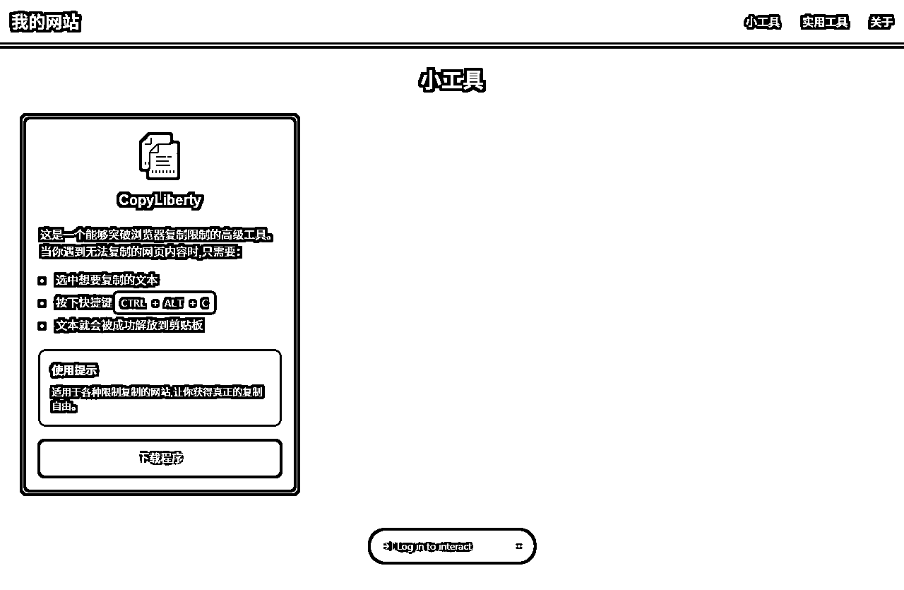
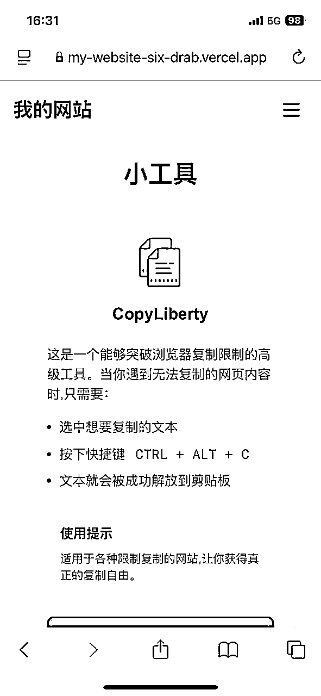
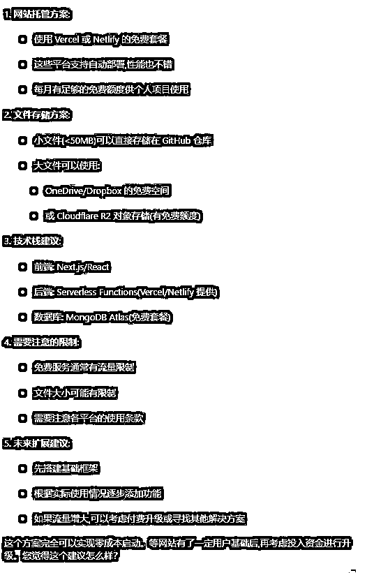
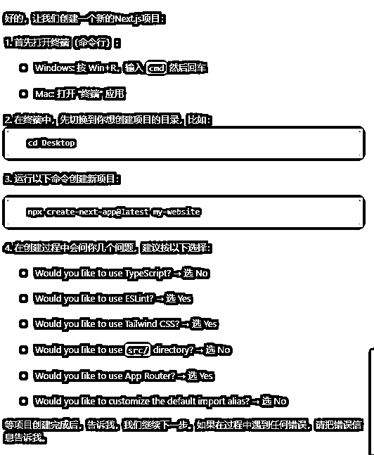
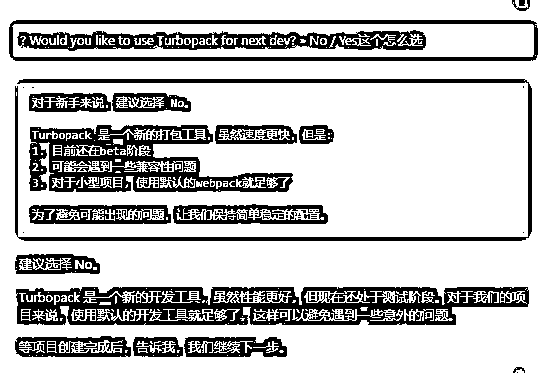
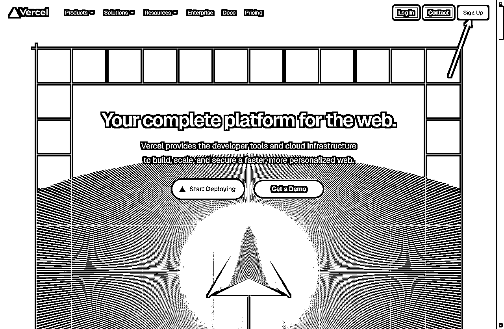
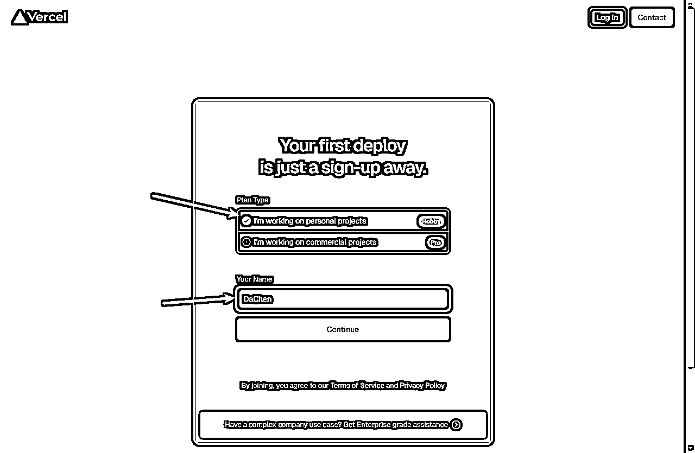
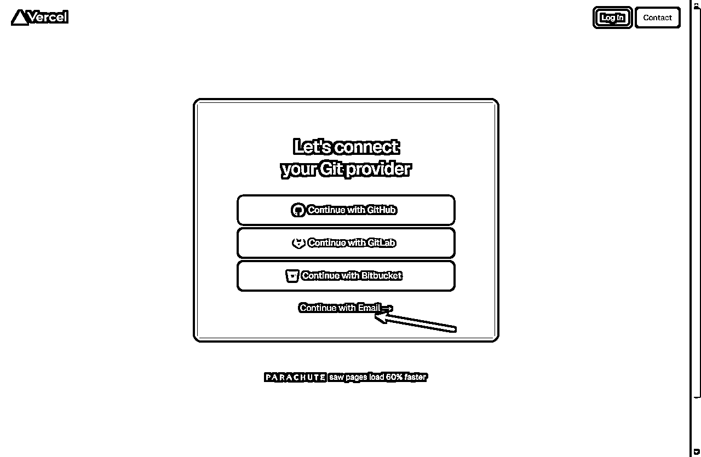
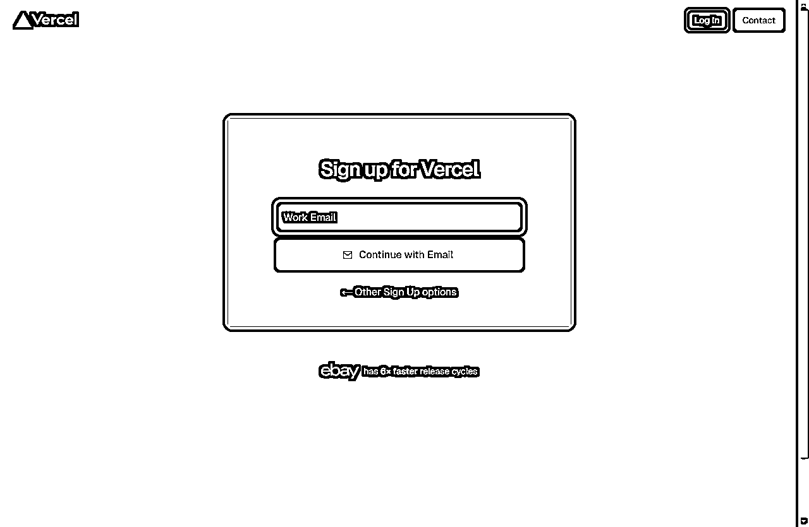
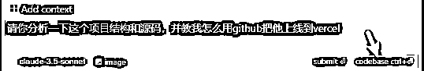

# 0基础也能学会!用Cursor一键部署网站,小白都能轻松上手

> 来源：[https://wm1881zs6s.feishu.cn/docx/YHm9d8S1fom7f1xoQ4Ic4D26n4b](https://wm1881zs6s.feishu.cn/docx/YHm9d8S1fom7f1xoQ4Ic4D26n4b)

圈友们好，我是大臣。

这期航海上了cursor的船，并且开发出了第一款能解决我一个小需求的工具。

我想分享这个工具，于是突然想到，我能不能让cursor开发一个工具分享的网站，并且教我如何部署上线？

## 成果展示图

PC端

手机端

## 第一步：询问想法的可行性

作为不懂技术的小白，需要先询问cursor自己的想法，是否可能实现，下面是我的提示词。

我想上线一个网站，它的功能如下：

1.  可以上传我自己发开的程序，别人可以从这个网站上下载这些程序。

1.  这个网站可能后面会拓展一些实用的功能，比如图片的压缩处理，在线的EPUB文档阅读等。

我希望我可以不花一分钱就能上线这个网站，你觉得可能吗？请给我一些建议。

这里cursor也是很给力的推荐了两个方案Vercel和Netlify，我这里用的Vercel(需要魔法)。

## 第二步：询问具体怎么做

下面是我的提示词，要cursor一步一步教我怎么做。

如何使用Vercel进行部署呢，我是一个完全没有经验的小白，请你一步一步的教我怎么做，我做完一步告诉你，你再告诉我下一步。

这是cursor给我的步骤，大家的可能会和我的有点不一样，不过按照它的步骤一步一步做就好啦，不会的可以继续问它。

就比如在创建项目的过程中，出现了一个它提到的问题，我直接复制问它怎么选，一句话有什么不会的直接问。

项目创建好后，和它说创建好了，它会叫你怎么测试服务是否正常，测试正常后，就可以开始搞vercel拉。

## 第三步：创建vercel账号

这一步和cursor告诉我的有出入，我觉得可能是网站更新的原因导致的，所以我就直接写我的步骤了。

1.  点击Sign Up

1.  选后面是Hobby的那个选项，然后填入你的名字，随便填都行，然后点Continue。

1.  点Continue with Email，这里cursor是让会让你选Continue with GitHub，不过我测试的结果是没法用。

1.  填入你的google邮箱，我只知道网易邮箱会接不到验证码，其他的没试过。

由于我已经注册好了，后面的步骤我无法再复现了，但是可以问cursor。

## 第四步：注册github

由于我已经有github账号了，注册的详细过程直接问cursor就好啦。

## 第五步：网站上线

这里我手欠开了一个新的cursor，导致前面的聊天记录没了，这时候有一种补救方案可以让cursor接着干。

请你分析一下这个项目结构和源码，并教我怎么用github把他上线到vercel。

这时候cursor会分析项目源码，重新熟悉这个项目，只要你告诉它你的需求，它还是可以继续指导你下一步怎么做。

网站上线后，可以让他教你做一个小测试，看看你是否可以更新你上线的网站。

## 第六步：开发自己的专属网站

网站上线好之后，你就可以用cursor来给刚才搭建的那个项目编写功能了，写好之后询问cursor怎么更新到vercel就行了。