# 二手机入局转转2.0的经验分享

> 来源：[https://ycncle3i0u5j.feishu.cn/docx/H9GldbOUmoaHlZxMNPzcPjN6noC](https://ycncle3i0u5j.feishu.cn/docx/H9GldbOUmoaHlZxMNPzcPjN6noC)

各位生财的圈友，大家好，我是在成都做二手数码的山人，我从事数码行业已经有12年了，卖过新机，干过维修，赛格开过档口，做过二手机直播。现在主做二手机同行批发和回收，实时竞拍以及转转2.0，零售和直播正在跟进中。

其实早就想过分享一下关于二手机，一直没行动，也不知道该从哪里下手比较好，彩虹看到了我女朋友发的资源对接，然后找到了我，期间还语音联系了我，帮我完成了大纲，和大体内容的总结，进度跟进，在这里非常感谢彩虹。生财团队也真的有在发掘各种赚钱的机会，入股不亏👍👍👍

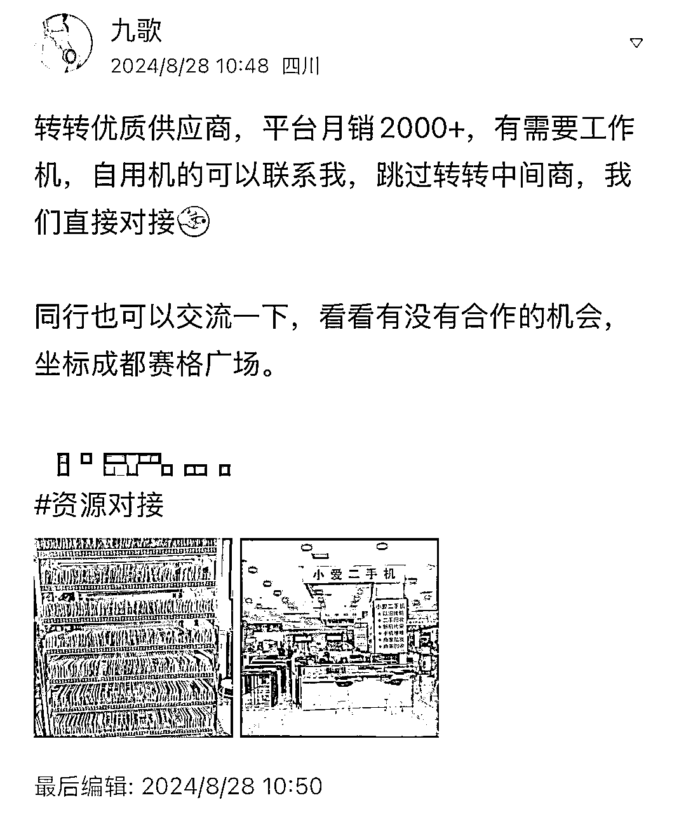

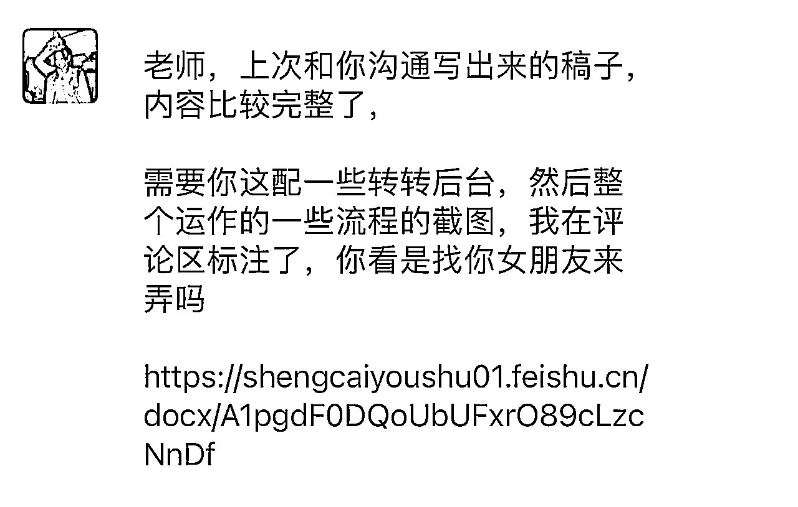

这篇主要是分享一下转转2.0，以下简称转转，先说下目前的收益情况，今年2月份是我做转转的第三个月，毛利是40w，平时能做到15W-30W毛利，净利润占毛利的30%-40%。四五月是一年中最淡的时候，能保本。

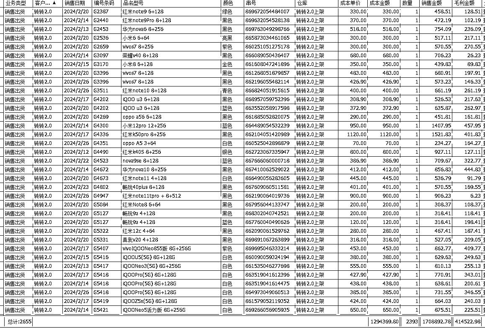

接下来我给大家分享一下我为什么去做转转，转转平台的玩法这些。

## 一、项目介绍

转转是目前国内最大的二手数码销售平台，流量高，动销快，和其他电商平台不同的是

*   不需要考虑流量运营，不需要做矩阵，转转基本上是平等的对待每一个供货商家，同等机况价格低的优先展示，还有一个售后率低的商家的产品会优先展示。

*   转转的供应商不需要去做销售，只负责后端的，选品，质检，定价。前端都是由转转去销售，发货，大大解决了销售方面的压力，就可以全部身心投入到采购方面去。

整个项目简单说就是在各个渠道采购的机器在转转卖掉，普遍毛利在50元-200元一台，整体毛利由单台毛利*台数决定。

分享一下我们是怎么采货以及变现的

我们采货主要有三种方式

1 同行交易的平台去采，如拍机堂、采货侠、拍闲品、小当、回收宝（微信小程序）等等，拍机堂和采货侠是商家之间交易最多的平台，买货卖货都可以，我们买回来不好出掉的机器都通过这两个平台快速处理掉，其他的几个平台只是买货。

下图第二张图是拍机堂的暗拍界面，每个机器都有图片，验机报告，整体价格相比实时竞拍回来的成本高些，与验机报告不符可以退货，退货也有要求，有的炸弹机不一定能退到货，水挺深的，小白勿碰。

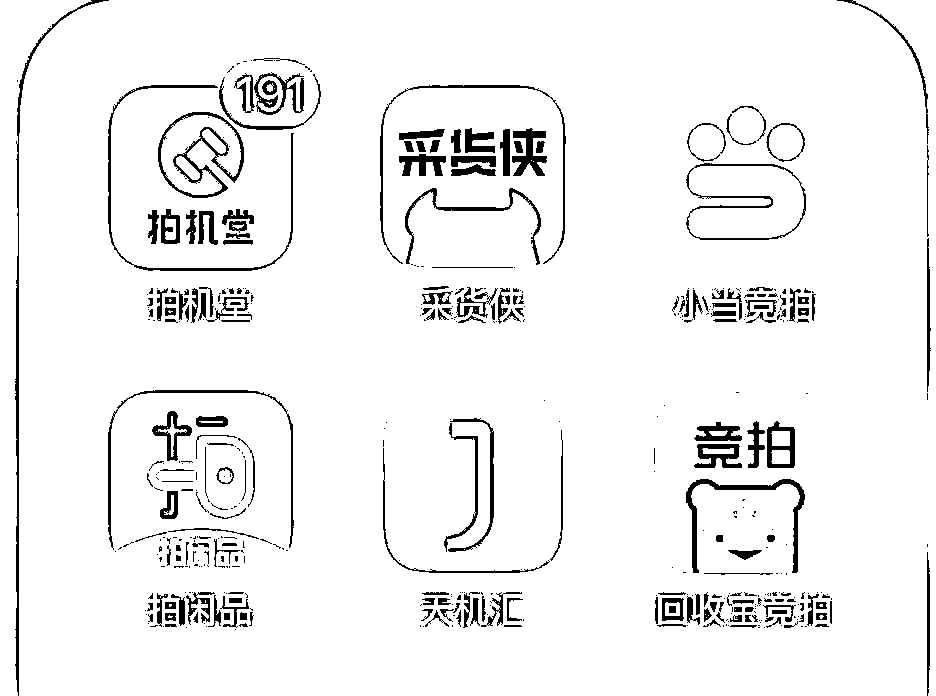

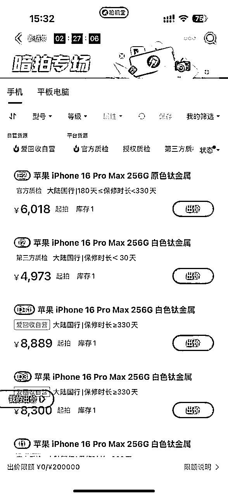

2 同行和零售回收，微信上的私域，目前手上有几千个商家，大部分是2019年在川内地推加的商家

3 实时竞拍：比较熟悉的有闪回收、繁星（微信小程序）、快售宝（微信小程序）、小当竞拍

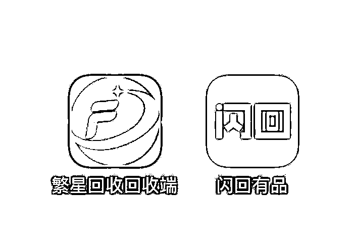

实时竞拍，就是大街随处可见的新机门店的店员把二手机以照片的形式发给我们回收报价，一台机器会有不同公司报价，价高者得，根据图片确定这个机器的价值，例如下图我报价419元，转转结算价是555元，毛利136元。

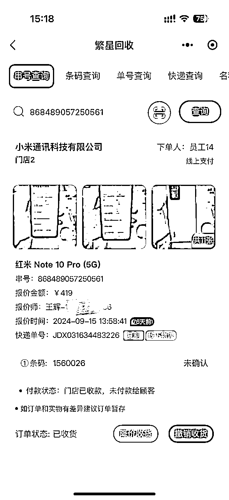

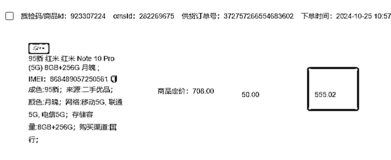

因为繁星的总部就在成都，挨着我们办公室拿货方便，能缩短到货周期，现在我们主要的实时竞拍平台是繁星。月收货台数2K+

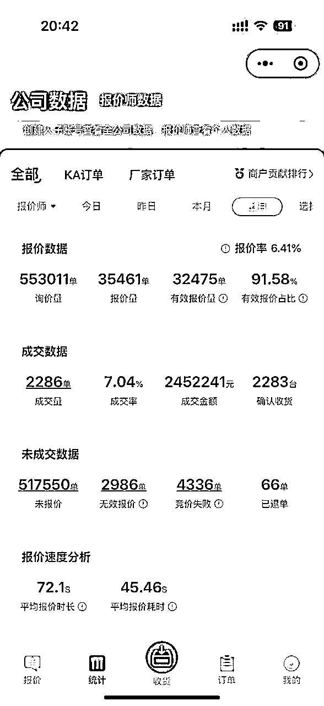

## 二、项目的成绩情况

这个项目是我们23年11月开始的，初始投资了100万，初始成型团队是6个人，加上我3个拍货验机，1个维修，1个后勤打杂，1个财务。

做转转之前，我做过采货侠保卖，是转转的另外一个部门，区别在于保卖会提前垫资，所以一台手机会分走几十的毛利，前面提过，单台毛利就在50-200，让整个项目的操作挺受限的，再加上最开始做没有经验，在采货侠这个项目上是以亏本收场的，关了采货侠之后，马上就开始了转转，有了保卖的经验就比较快的上手了。

快速的上手，又加上快过年了，一年中行情最好的时候属于是buff叠加了，我又根据转转采货表备到了热门稀缺机器，今年1月开始备的货，2月卖出了40W的毛利，过年都没咋休息，休息几天大家又备了些货到3月份卖出的，3月份有28W的毛利，抓住了这两个月也让我保卖的亏损缓了口气。

4月5月行情实在淡，也因为前段时间做的太累，从23年8月做保卖到24年3月就没咋休息，就躺平了两个月，保本状态，反思也可能是因为只在平台拍货的型号太局限，导致转转卖不动，明年这两个月应该不会躺平了，会继续研究实时竞拍卖转转的可行性。其他时间就15-25W毛利。今年11月之前没咋做其他渠道，一个月除了转转额外还有2W-5W的毛利，11月开始认真做同行批发做到了10W毛利。

现在资金陆续增加到了200-300W,11月最高峰库存增加了到了500W,资金根据情况需要增加，处理掉库存，12月又回到200-300W,从今年1月就陆续开始增加人手了，基本属于每个月都加了一个人，增加到总共16个人，9个报价师（包括我也是主力报价师），7个后端：1个验机师、1个维修师傅，2个后勤打杂，2个销售同行批发，1个财务。

9个报价师成熟的只有4个，另外5个都还在新手阶段，是属于让我有点脑壳痛的，有两三个都半年了还没有出成绩，2个销售其中一个还是新手，所以增加了资金和人手却没有看到明显的毛利增长。一个成熟的报价师一个月应该能创造3W-5W毛利，优秀的一个月能创造5W-8W，当然只出转转不容易达到这个数据，要搭配其他渠道。如果继续保持这个团队，5个新手报价师成长起来，理想预计每个月增加20w+毛利。

我的工资分配主要是报价师占大头，报价师拿走毛利的30%，其他岗位成本就6K-1W，业绩亏损的报价师要适当给些补贴，除掉工资房租等，纯利润占毛利的30%-40%

## 三、项目是怎么去做的

下面我给大家分享一下我是怎么从0-1把这个项目做起来的

1 平台规则

首先一定要去把各个平台的规则研究清楚，不要冒冒失失的就去做，先拿一部分机器来做实验。等拿到数据了再去加量。如果看不到利润要及时暂停，反复去思考是那个地方出现了问题，为什么看不到利润。我们做的时候也有亏损的机器，比如，在买的时候以某个成色的价格买回来，到手发现机器到不到那个标准，又退不了货。我们就会以实物机器为参考，去看是什么地方造成的差异，然后总结出来，不断去优化买货的方式。

2 人工效率。

我们很多同行人工效率特别低，本来回来的机器3天就能上架销售，效率低下导致要多花一倍或者更多的时间才能完成上架销售，因为销售时间过长导致本来有利润的机器最后不赚钱或者亏损，在人工效率方面一定要把责任落实到人头上，避免责任不清互相推诿导致效率低下。

3 库存结构

库存要合理的去做调控，不要出现严重偏差。当某些机器出现销售周期过长，销售利润偏低，要及时去做出调整。库存品类一定要多样化，SKU越多动销越高

4 数据分析

数据分析是重中之重，下图是我们平时会分析的数据，是其中一个员工在不同平台采购回来卖出的数据。

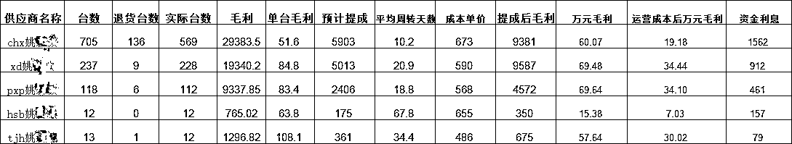

*   单台毛利是最关键性的数据，低于50就不太做得下去了

*   其次是动销天数，动销天数是投产比的关键因素，另外动销天数越长风险越高，成本低于1000的不能超过30天，低成本的行情波动也比较小，成本高于1000的不能超过15天。

*   台数情况反映了报价师的工作态度，不管利润多少，台数是必须想办法满足目标的，比如我们要求报价师一个月至少收600台

*   整体情况运转良好，就考虑资金投产比的分析，让资金利用率最大化。例如投入每万元的日收益，各个报价师的投产比。

## 四、项目做成的关键要素

1.核心是采购，能不能赚钱，采购是第一步。从别的渠道采购回来的成本越低，你的利润空间就越大。比如你采购成本500块钱一台，转转结算600，就有100块钱的利润。定价会根据市场、需求情况动态调整。

采购什么机型官方会给有一个需求大厅，里面有平台的热销缺货机型情况，sku做的很细化，比如机型、成色、颜色、内存，你就根据列表去找利润高的机子去采购。采购回来给转转质检，上架到店铺，转转官方会给你负责销售客服和发货事项，不需要你负责。

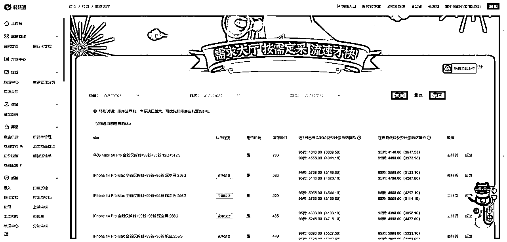

2.合适的时间备货，需要备货的时候BD会通知，转转官方也会给备货奖励，这个时间就可以在自己风险承受范围内尽可能的多备货，注意同型号同成色的不可备太多，型号品类要丰富一些，同型号同成色过多容易出现库存积压，动销天数过长就可能造成亏损。

3.操盘手的操盘和组织能力：要对各个环节有了解，比如采购、质检、上架这些。了解每个平台特点，质检要求，机型的利润空间这些情况，把控团队的方向。

4.质检，需要了解平台的质检要求，比如转转要求机子8成新。质检的时候，就要符合平台的要求，才能上。如果没有按照平台规则来，就会被罚款，严重会关账号，所以需要对平台的规则，有一定的把控能力，既要最大限度去赚钱，又不能被罚钱。质检师培养难度不大。

5.整备（整理和维修）:指的是二手手机有的配件坏了，可以修好再卖，利润可以更高。比如一个手机后盖有问题，在平台上卖400块钱，你可以买个新后盖成本100，修理一下再卖出去，定价在700块钱，就可以赚差价200块钱，当然你也可以不修直接卖出去，可能就只能赚100差价。还有一些小问题，像开机键，充电口的简单维修，这些小问题拿到外面维修，一般是10块。所以需要配一个维修师，根据地区不同维修师薪资6K-1W，一个月至少能处理1000台手机不太复杂的维修，大大降低维修成本，并提高上架效率。

销售规模：月销手机量2000-4000台，去年11月开始做的，一年的销售情况

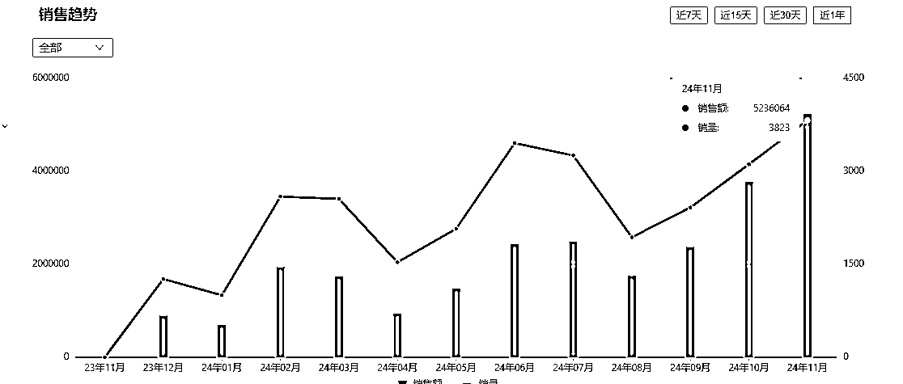

## 五、项目的风险和入局建议

### 1.项目过程中的风险主要是：

（1）能不能做到单台毛利50以上

（2）对于行情的提前预判，比如每年618、双11、双12、苹果新机发布9月、这些时间都会出现行情跌价，收货时需要压价，要提前清清库存。过年和78月，也就是寒暑假，是旺季，可以提前备货。

但是任何行情都只能是预判，比如今年苹果发布很快就降价500，这也导致整体行情下跌，这是在往年没有出现过的。

（3）备货也要考虑自己的风险承受能力，二手机的整体毛利点就在5%~10%，普遍一台50-300的毛利，特别是高端机，随便跌几百就会出现亏损，要考虑如果出现自己预料外的跌价能够承受的亏损。

（4）报价师人员的筛选，报价师不好挖，优秀的报价师随便到哪家就是摇钱树，所以只能自己培养，不会思考总结的，有亏几个月都没赚钱的报价师。

### 2.入局建议

*   有资金，至少需要100-150W

*   心态好，承受得住亏损，前面一两个月可能都赚不到钱，因为需要一定的时间熟悉转转的验机标准，上架流程，还有团队磨合也需要时间。还有可能行情大波动导致的亏损，要及时的调整心态和玩法。

*   有团队，如果只完成最低目标一个月卖1200台，至少需要6个人

*   一个报价师，一个验机师，或者两个报价师 自己收自己验。

*   一个打杂手机拍照、清洁、上架、库存管理等

*   一个财务入库、出库、数据分析等

*   一个维修师傅整备手机

*   一个统筹协调的操盘手

*   不是小投入，想要入场的还是慎重考虑。考虑入场的同行自身的销售渠道一定要过硬，只依赖转转一个平台不好做。另外特别提醒转转官方政策在收紧，验机要求变高，罚款力度变大，入场的人在持续增加，意味着利润空间有可能减少。

*   对二手机感兴趣的个人，没有学历，也没有突出能力找到好工作的，能吃苦的，可以去应聘报价师，做实时竞拍的招不到有经验的，每个公司都会培训新人。做得好的报价师月工资都是1万+，行情好的时候2万+，当然也有几个月都还亏损的，这个还是要看个人能力的。

以上就是我针对转转2.0做的分享，上面所提的平台，有需要也可以联系我对接，关于二手机方面大家有什么问题都可以一起来交流呀。