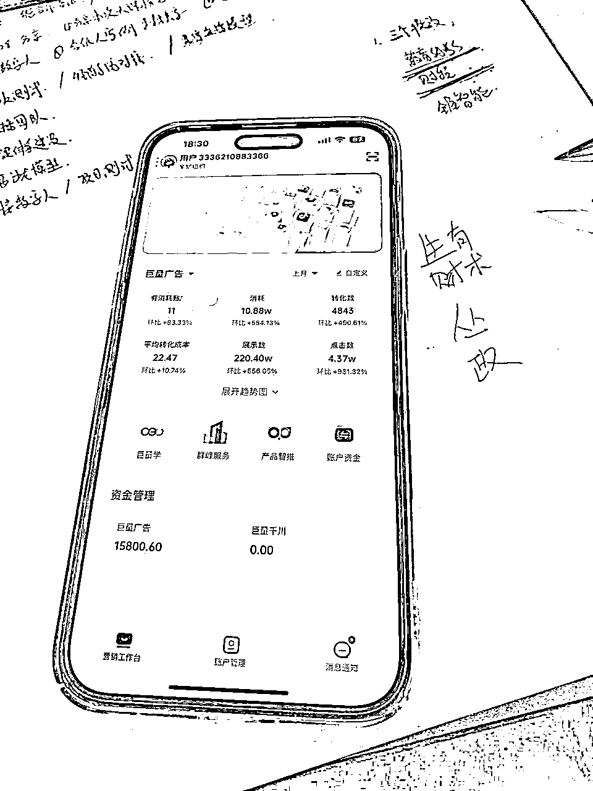

# 巨量本地推实操全流程（视频+图文）抖音新风口项目

> 来源：[https://mvdaj1881kj.feishu.cn/docx/Z2gldbBtfoQjNcx4EGVcD2jyn6c](https://mvdaj1881kj.feishu.cn/docx/Z2gldbBtfoQjNcx4EGVcD2jyn6c)

写在前面：

大家好，我是丛政，关于我个人的经历，包括对本地推完整的解读我都附在文章最后，想更详细了解的圈友大家可以阅读。

先说几个问题：

1.本地推适合哪些圈友：

做实体行业， 餐饮酒店，家居建材，工厂，招商加盟，全屋定制，招学员，卖项目，月子中心，兴趣教培，汽车后市场（车衣 洗车 改装 贴膜 二手车等）等等，可以说只要你缺客户，都可以用这套打法来获取精准流量。平均5-30一个客资成本，高一些的看行业，这是一个巨大的信息差，也是一个巨大的机会，意味着几万块你可以让全城的人知道你，意味着一个项目可以无限放大，因为流量是稳定可控的。同时如果你在自己的行业内拿到结果，还可以给同行赋能，转入培训代运营，这也是很多人在做的是，比如你做财税，手头有大把企业资源，就可以先学会自己投，效果好开会销交给这些老板，（如果你不具备这个能力的话我们可以全程协助）

2.抖音本地推和巨量AD，小红书聚光，视频号投放有什么区别？

本地推目前更适合推门店曝光，团购行业，目前过审难度更高，成本会更低，但灌水明显，返点很高，平均12-15%，巨量AD更适合线索型行业，也就是说咱们用来打留资的，聚光，视频号对于AD和本地推是一个投放人群和投放项目的补充，举个例子，旅游在抖音是禁投的，我们就可以用聚光配合自热来打。但是抖音平台趋势目前在大力推本地推，顺着平台做会很顺，这次也是把本地推完整的实操拿出来分享给大家，希望对大家有帮助，具体开户对接渠道，以及如果大家有需要学习更完整，多平台的打法也可以通过鱼丸找到我。

3.市场上依靠投流赚钱我身边真实案例给大家分享一下：

郑州大鱼，投放获客主要做本地推培训，10月业绩300万，苏州鑫哥，主打门窗工厂，全屋定制工厂垂类赛道一个月业绩300万，这两者利润保守估计也是过40%的。菏泽我朋友，3个投手，8个销售，卤味招学员，一个月业绩在百万左右，纯付费。西安金包银团队，5个人，目前一个月能干到30-50万，河南一个小团队，字节代理出来的，做代运营，4980.一个客户能收3000，多的客户返点就能拿到2万。可以说利用投放能做的事太多太多。过去你跑个项目，做ip，做矩阵，然后跑销转，两个月起步，现在快的话一个周，直接投个2000-3000就出来了。

再说一个市面上最近比较多的数字人，1234567，目前投500能转化5000业绩出来，（c+b代理）投产1:10

当你深入投放之后你会发现，可以做的项目太多了，可以搞的赛道太多了，因为你不缺流量了。

4.我希望得到什么：

我希望需要流量，需要获客，招商加盟类，以及完成0-1具备复制性的招商类，工具类，实体项目来和我嫁接。合作方式多样性。大家如果对我的模型感兴趣也可以深入沟通了解，大家负责流量就行，嫁接我的交付模型变现。

以下为本地推完整的实操内容，可以说保姆式教程，是我们团队实操的分享直接拿出来了，大家对着操作就行。

不是市面上的理论课，全程实操。

大家有什么问题可以留言，

https://hcn9k3ag2a4j.feishu.cn/wiki/BawswQS5iiEvFt...

这篇文章是我自己通过投放拿到的结果，上个月投放了11万，团队完成了80万业绩，是这个项目启动的第三个月。

如果单纯依靠自然流量是无法完成到这个量级的。

写在最后的话：

找到你认为对的事，抬头看路，埋头苦干，就一定有结果。

本质上我们在拼的是执行力，认知差，信息差。

希望每一位圈友都能在2024收获更多！

有问题在评论区留言，有问必答！

我相信这篇帖子一定能帮到很多圈友在今年，在自己的赛道上拿到更大的结果！