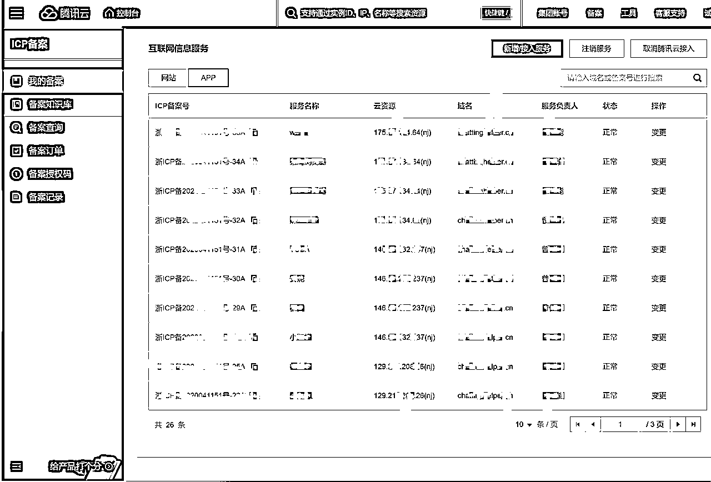
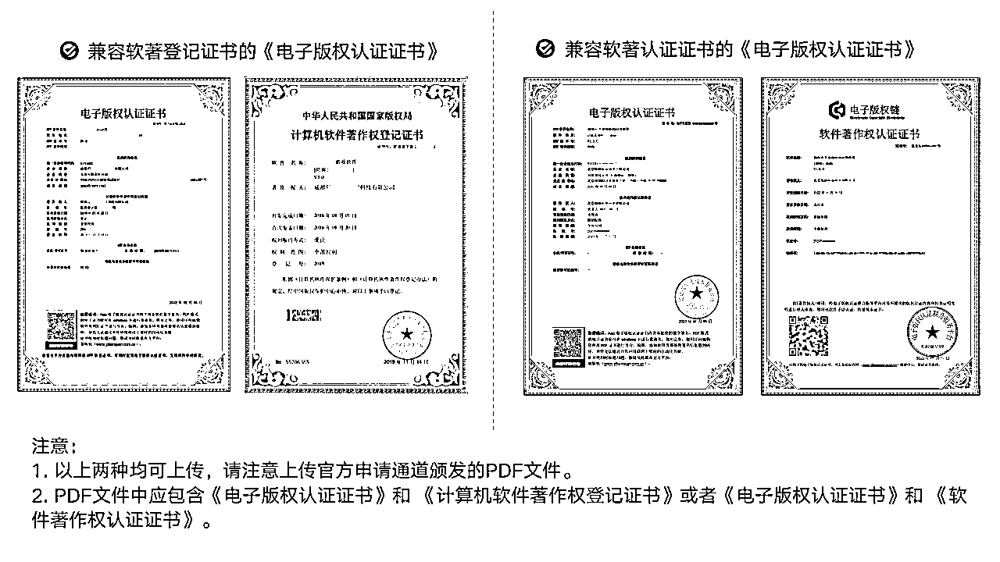
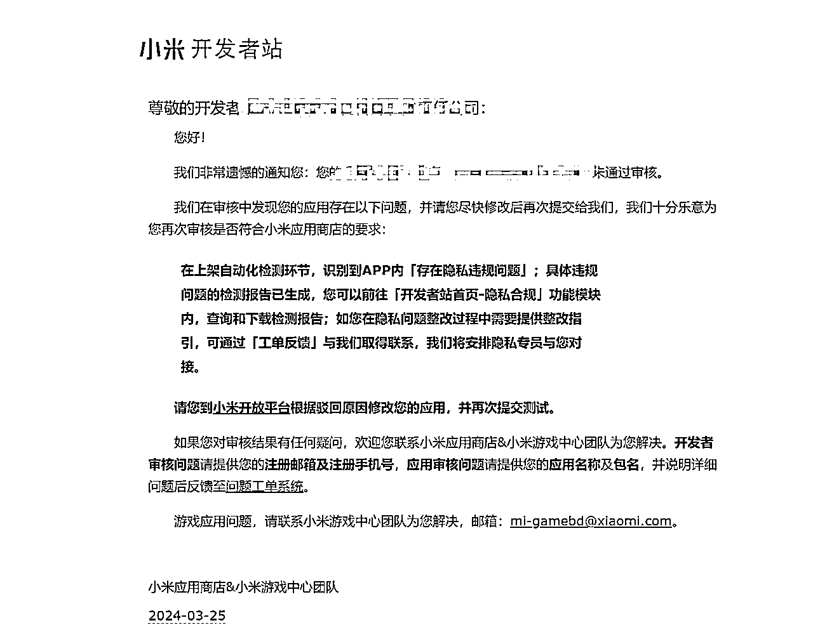
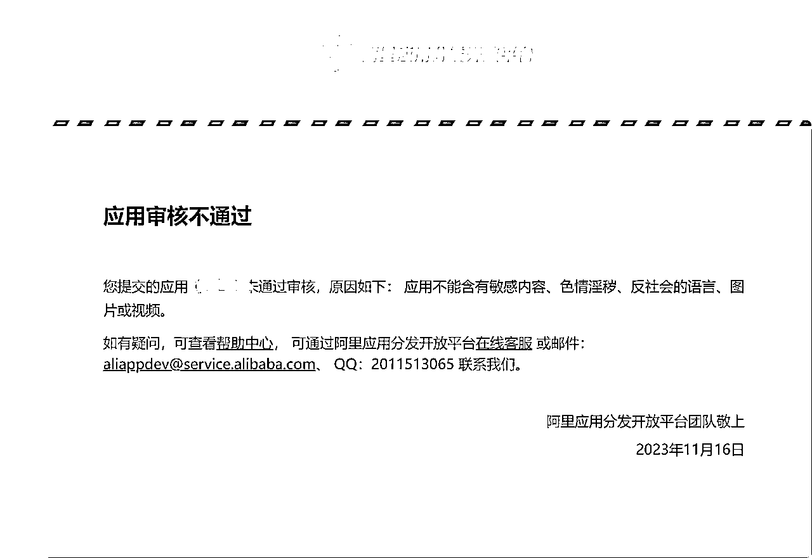
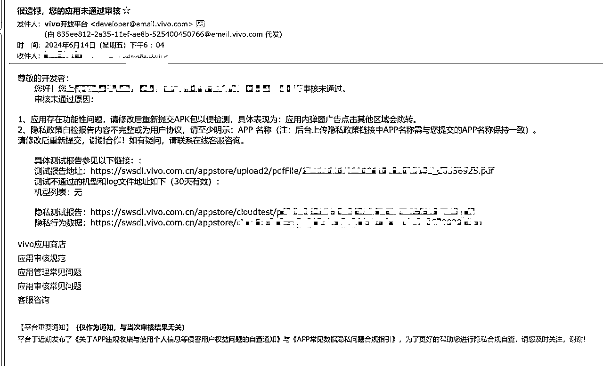
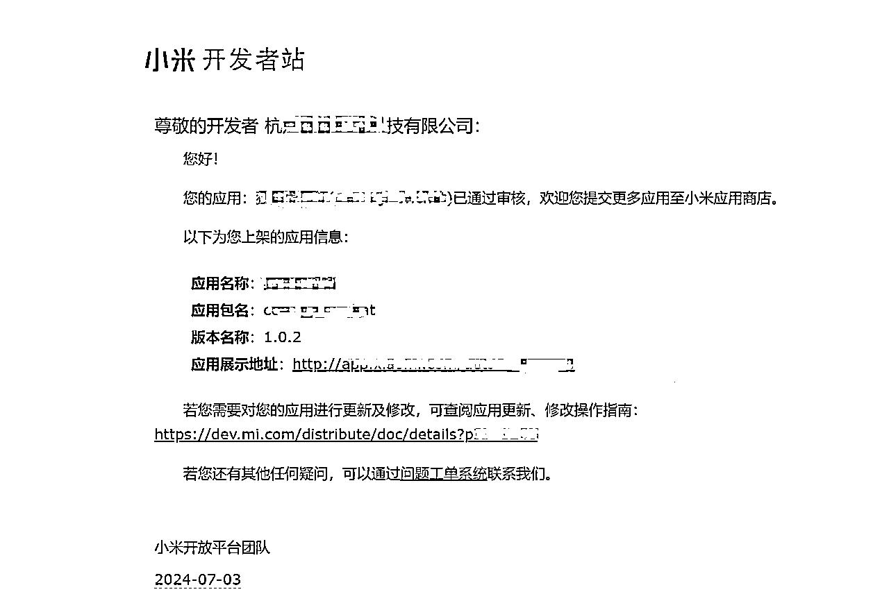
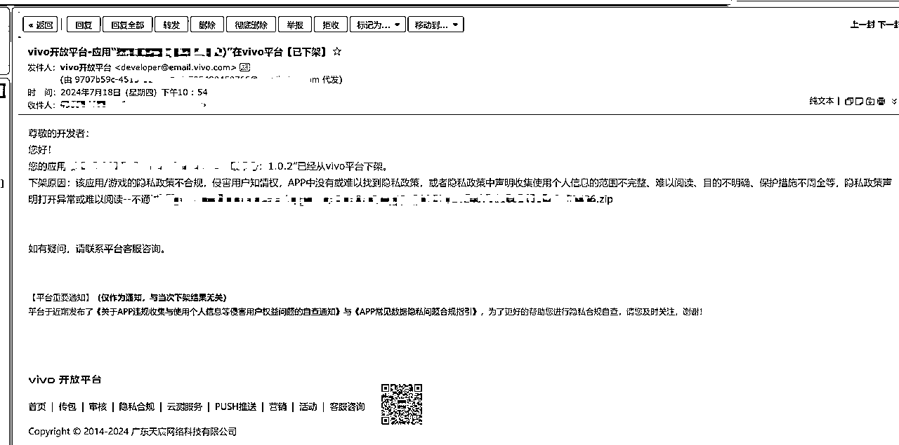
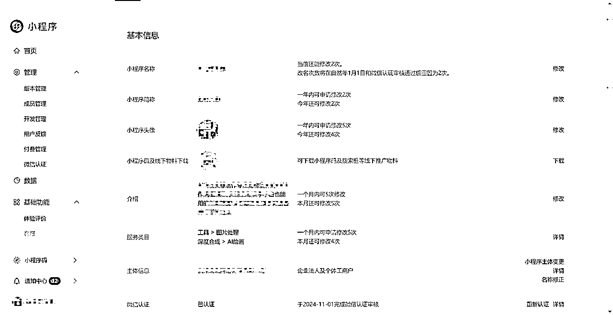

# 从0到1：一文讲透安卓APP和小程序上架那些事

> 来源：[https://h0v0176ep4x.feishu.cn/docx/Z9m3dnUVRoXmQgxGal2cDtg0nDg](https://h0v0176ep4x.feishu.cn/docx/Z9m3dnUVRoXmQgxGal2cDtg0nDg)

# 一、APP开发好了，上架被不断拒绝

大概三年前，我开发了一款社交类的APP，用于某个细分人群的陌生人社交，这类APP已经在海外市场成功得到验证，因为用户非常小众所以不担心会有大厂去模仿。APP是一种类似探探的应用，左右滑动匹配互相喜欢，内购解锁高级功能来获取收益。

然而，把开发时遇到的技术难题解决之后，接下来的困难才是刚刚开始。当APP首次提交至各大应用市场审核时，不断被拒。第一次，因为隐私政策描述不够详尽被拒；第二次，因界面设计中存在微小的用户体验问题被退回；第三次，则是因为功能实现上的一个小bug……

接下来就来说说如何解决这些问题，什么是隐私政策，常见的资质要求有哪些，网安部门让你上门汇报工作如何处理

# 二、安卓应用市场上架常见难题

## 2.1资质问题和政策问题如何解决

首先最重要的基础，现在安卓的各大应用市场（华为，小米，OPPO，vivo）已经不支持个人开发者提交APP了，必要有公司资质。

一个APP要上架哪些是必不可少叫的呢，总结如下：

1.  公司资质

1.  APP备案号（去年新规，今年开始强制执行）

1.  公司官网（须通过ICP备案）

1.  隐私政策和用户协议

1.  软件著作权

1.  安全评估报告

1.  ICP经营许可证（APP有支付功能）

### 公司资质

这个是基础，但是也有几个注意事项

注册资本要选择100w，因为后期部分资质申请的时候会对这个注册资金有要求

经营范围要加上互联网技术开发相关的内容，这样会更方便后期去申请各类资质

参考图如下：

### APP备案号

这个是去年的新规了，就跟网站的备案一样，申请相对比较简单，去腾讯云买个最便宜的服务器，记得买三个月以上，就可以让腾讯云帮你申请了，目前只能是运营商申请备案，个人是无法申请的

注意事项：服务内容最好选择工具类，比较容易通过

### 公司官网（须通过ICP备案）

网站ICP备案，即互联网信息服务提供者备案，也称为域名备案，是中国境内建立网站所必需的法定程序

这个和APP备案一样，去腾讯云或者阿里云买个服务器，按照流程申请即可，这个网站是必须的，APP备案也会用到

注意事项：APP备案目前不限制数量，APP没开发完都可以提前去申请备案，网站备案实测超过5个后，就会很难申请到新的

### 隐私政策和用户协议

用户协议可以直接用我的模板，核心难点是隐私政策，这个等会详细讲

### 软件著作权

APP软件著作权是指软件的开发者或者其他权利人依据有关著作权法律的规定，对于APP软件作品所享有的各项专有权利。这些权利包括但不限于发表权、署名权、修改权、复制权、发行权、出租权、信息网络传播权等

实际上这个东西就是个鸡肋，只要提供包名和APP名称，中介就能给你申办下来，你有这个东西并不能保护你的软件，但是没有的话分分钟让你下架

注意：软件著作权和商标是两个东西，如果APP名称和知名品牌重名，哪怕你有软著，没有商标的话，照样有侵权风险

APP上架必备，找中介处理就好，目前我这边找的价格是300一个，不同时间价格会浮动，在APP开发前期就要开始准备申请了，这个短则一个礼拜，慢则一个月

### 安全评估报告

按照教程来申请就行：https://dev.mi.com/xiaomihyperos/documentation/detail?pId=1347

杭州这边是网上申请后，辖区的网安会让你去他们办公室现场审查你的APP，审查重点是APP的内容风控，每一个用户上传的动态，头像，发的每一条私信都必须在后台可以监管，这个会让你现场演示具体功能，有bug的话尽量提前解决，不然当着叔叔的面还挺尴尬

### ICP经营许可证（APP有支付功能）

全称是“互联网信息服务增值电信业务经营许可证”，是企业提供互联网有偿信息服务、网站合法经营的重要证件。如果你的业务涉及到支付功能是必须办理此证件的，应用市场也会在上架的时候要求你提供

如果APP有支付功能，那这个资质就必须要有了，这个比较麻烦需要增加经营范围，建议找中介搞，一个月左右就能下证

### 特殊行业的资质

比如短视频，直播类需要有网络文化经营许可证，广播电视经营许可证，这种我都是找中介办理，没时间准备各种材料，而且周期很长，一个文网文证书，大概花了三个月才下来

以上这些都是基本功，但是真正的困难才刚刚开始

## 2.2 隐私政策问题

最最容易踩的坑，这里的问题无穷无尽，每个应用市场都有自己的一套规则

1、基础的隐私政策怎么写

这个是经过我们千锤百炼之后最终目前在使用的版本，至于为什么这么写可以通过，每一条都是和应用市场博弈后的血泪史

这里的核心在于，敏感权限的获取，也就是说应用市场会检查APP里面所有用到的敏感权限，然后这些权限的使用说明，必须在这个隐私政策里面有详细的描述，哪怕权限名称错一个字都不行，我们后来分析这个检测很可能是机器做的，只要关键词匹配没对上就会被拒

2、APP内部的SDK隐私政策如何处理

第一关过了，后面就是各种SDK的隐私问题，在用户点击同意隐私政策之前，APP不要去初始化SDK，早期我们经常在Application文件内做初始化处理，现在统统改成在Activity界面

还有所有用到的三方SDK必须在隐私政策里面一一列出，你可以多列几个，但是只要有一个漏掉就会被打回，这个也是机器审核的，不要有侥幸心理

## 2.3 内容风控问题

这个想对简单一点，社交类的APP有一个内容尺度的问题，明明觉得很健康的内容，在审核人员眼中就是大逆不道，这个设置一个审核开关即可，在审核期内屏蔽掉部分内容，审核通过后打开即可

同样广告开关也是，部分应用市场对APP广告审核严格，可以在审核期间关闭广告展示功能

## 2.4 马甲包如何上架

就是一套核心代码，如何上架多个APP，这个目前应用市场检查比较严格，马甲包的开发成本越来越高了，首先主页面的UI必须和主包完全不一样，虽然核心功能一样，但是可以把各个功能的位置调换，增加或减少部分功能，让APP看上去是全新的。

其次应用市场会检查代码相似度，这个可以使用github上的一个垃圾代码生成插件来解决。

地址：https://github.com/tubie/AndroidJunkCode

经过以上的操作，应用市场一般审核3天左右就会收到一封上架成功的邮件，你的九九八十一难就算完成了

# 三、吃着火锅、唱着歌，APP突然被下架了

经过以上的操作，一般的APP基本就上架了，但是突然有一个噩耗来袭，某一天收到了下架通知

## 3.1 邮件通知您的App已下架

这种不用慌，因为各个应用市场在不同时期对隐私政策的审查严格程度不一样，根据提示做对应修改就好

注意点：隐私政策网址一定要保持随时可以打开，不要因为上架了网址就不能用了，不要犯域名忘记续费这种低级错误

## 3.2 突然收到主管部门的快递

吃着火锅唱着歌，收到一封EMS，打开一看天塌了，工信部来函说你的APP隐私政策违规，给你下发了处罚文件，同时通知应用市场下架你的应用。

这种基本分两种情况：

邮件里面会有一份检测报告，告诉你为什么会违规，但这个不是重点，重点要看检测报告的落款

1、如果是xx市互联网安全检测中心之类的政府部门，那一般不用担心， 正常整改就行，整改完毕发一封邮件过去，基本不会为难你，但是也不会有回复，然而莫名其妙的APP又上架了，大家都走个过场，互相体谅就过去了，牢记世界就是个草台班子

2、如果落款是xx网络科技公司，这就麻烦了，就是说政府部门委托某家私人机构做隐私检测，这就不是技术问题能解决了，曾经我花了无数时间去挨个解决文件里面提到的技术漏洞，结果一次次都给你打回来，而且整改次数还有限制，这个时候懂事的你就应该知道需要动用钞能力了，去购买他们公司的隐私政策整改服务，人家就会手把手教你如何通过检测（其实能不能通过本来就是他们说了算）

其他的事还有，某地的网安部门直接电话过来，让我们买他们的法制日报，后面呢也没买幸好没事

# 四、微信小程序上架和安卓应用市场上架不同点

## 

如果你搞定了一个安卓APP的完整上架，那微信小程序上架过程宛如天堂，它属于是微信APP里面的一个生态，从逻辑上来讲微信是希望有更多的APP上架的，所以不会为难你，其实安卓应用市场早期也很简单，甚至个人都可以上架APP，后期主要是因为政策监管变的严格，导致应用市场也不得不严格管理，毕竟出事他就要背锅

微信小程序的隐私政策和用户协议微信会提供模板，按流程操作就行，而且不需要软著，小程序备案直接在微信后台根据指引填写相关信息，当天就能通过，同样不需要小程序实际开发完成

最大的好处，一劳永逸，微信小程序一旦上架成功，几乎不会被下架。

# 五：IOS应用市场上架和安卓不同点

ios的上架可以用个人身份，不需要公司资质，但是有几个点要注意：

1、马甲包上架要注意除了UI界面完全不同外，设备也要物理分离，要用不同的电脑，不同的网络去上架

2、可以注册个人开发者账号，年费99美元

3、ios这边同样需要APP备案，但是网站备案不严格要求

4、ios对功能相似的应用检测比较严格，有可能出现辛辛苦苦开发的应用，因为ios市场相似应用过多无法上架的问题，这个安卓市场也会有，但是安卓市场有好几家，总是能上架的

# 六：上架后的维护建议

1、安卓应用市场上架后，应用市场会不定期的抽查，尤其是隐私政策，如果后期APP更新新增了sdk，一定要在隐私政策里面做添加

2、APP内的网页对应的网址，一定要保证能打开的状态，也会不定期抽查

3、及时应对用户投诉，如果应对不及时用户会投诉到应用市场导致下架

4、支付相关的投诉要尽快处理，如果用户向支付宝或微信投诉，投诉率过高的话支付通道很可能被关闭

5、及时关注邮件，应用市场一般都是用邮件通知的，比如升级SDK，兼容最新版本手机型号，这些都要时刻关注