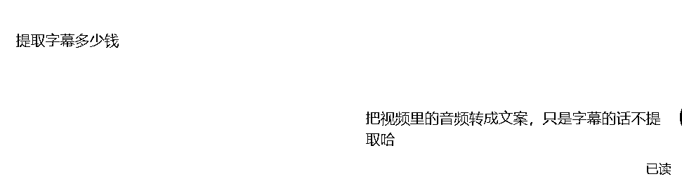

# 闲鱼虚拟产品之视频下载操作记录

> 来源：[https://w63nbfedzw.feishu.cn/docx/ZH7PdHZbsoWVtDxiEAXcYOyInqf](https://w63nbfedzw.feishu.cn/docx/ZH7PdHZbsoWVtDxiEAXcYOyInqf)

# 背景

之前做闲鱼二手书，习惯了每天都完成任务，前段时间刷到视频下载、文案提取的商品，觉得挂着也没啥事就上架了，没想到最近陆陆续续出了一些单，算不了什么大成绩，但也算是一个从0~1的过程。

信息差赚钱真的太可怕了！「YouTube视频下载」都能成为一个日赚几十几百的项目，这是一条今天看完就能马上实操、马上变现的副业项目

源自：

信息差赚钱：YouTube视频下载副业项目解析#风向标#

https://t.zsxq.com/isjGK

作者：老彭

「YouTube视频下载」或者说视频下载确实是一个能日赚几十几百的项目，上面的截图是我昨天和最近7天的数据报表，我昨天(2024年12月2日)GMV 47.8，确实是日赚几十哈，毕竟虚拟产品除了时间成本都是利润了。今天(2024年12月3日)粗略统计了下也有50+。

当然啦，我个人也知道这是偶然事件，不过也确实算是值得开心的事不是吗？要想放大就需要矩阵去搞，这次我们闲鱼资料航海有1800+圈友涌入，亚历山大哈，只能期望多多上品，多多爆单。

# 操作过程

## 操作过程的细节

### 寻找对标

操作过程其实很简单，就是找闲鱼刷对标账号，看有哪个商品写的好，然后就复制过来，自己上架。比如搜索【视频代下】、【视频转文字】，这里用闲鱼网页版(https://www.goofish.com/) ，需要登录闲鱼才能搜索：

我的主图跟截图里的【全网视频代下】差不多，我当时是想着挂着，有单就弄，没单也无所谓，直接打开宝贝详情查看，然后手机截图保存下载(因为手机APP下载有水印，所以使用截图)，并复制宝贝详情到备忘录(不用复制到备忘录也行，上架的时候直接粘贴就好)，网页版闲鱼宝贝详情没有水印，但是网页版不能上架宝贝，可以通过微信传到手机。

PS：阿奇索、闲管家支持网页版上架，不过一个虽然免费(阿奇索)，但是登录要输入密码比较麻烦就没用，一个收费(闲管家)，但是我的上架的商品不多，没必要开会员。

### 上架商品

闲鱼APP上架比较简单，点击中间发闲置然后按照提示输入宝贝详情和上传图片即可，这里就不赘述。

### 上架需要注意的点

1、一定要做自己能做到的，文案里面要写自己能做到的内容。比如说我这边只会双语的文案提取，我就不写支持N种国家语言的文案提取。

在接单的过程中，我发现有些客户是要提取视频字幕(音频是音乐)的文字比较麻烦，如果几块钱提取的话就很耗费功夫，我觉得不值得，然后我就没接这方面的业务。可以在详情里面备注，也可以在回复客户的时候说只提取视频里面的音频为文字。

2、价格要清晰，最好是看同行怎么写，也可以用小号咨询同行了解价格。我昨天就是吃了价格不清晰的亏，我昨天接了一个单，就是下载31个视频，但我当时以为同行是一块钱下载一个视频，毕竟下载视频很简单(自己觉得容易，不代表别人也觉得容易)，客户询价的时候也就不想那么麻烦去看同行的价格，这就吃了很多亏。然后朋友(也是圈友)发了老彭的文章给我：

当时还在苦逼下载的我突然看到老彭的贴子

看了老彭的贴子，我真的是欲哭无泪啊，因为老彭发的文章里面，他那个是有个同行的价格是按分钟计费的，我这个按个计费就亏大发了。我花了很长时间+熬夜给客户把31个视频下载完了总共16.8g，只收了35块，真的是亏大发了。所以大家以后要上架商品时需要了解同行的价格，不要像我一样坑自己。

3、商品图同行用得少的，尽量修改后再上传，我就遇到过同行找过来的情况。

4、Youtube在闲鱼是敏感词，Youtube、翻墙、代理之类的字样不要发。

### 如何提高曝光

其实我这个闲鱼账号很老了，之前都没啥曝光(100以下，大部分时间是30以下)，前段时间发现可以付费进行超级曝光推广，我就试了下，刚开始前几天没啥曝光，但店铺的曝光破百甚至200-300了，没截图，弄个刚开始进行超级擦亮和最近七天超级擦亮的截图：

昨天我的曝光有1100+，今天已经有1500+了，超级擦亮没多少钱，没什么曝光的时候可以开一开，提高下我们店铺的曝光。

Tips：尽量选择最高规格的曝光包，不然消耗完之后只能等结算后才能重新选择曝光包擦亮了，我就是卖的最多的商品消耗完了不能继续擦亮，这都是教训啊。

### 如何开通鱼小铺

有的朋友可能会说，这个【超级曝光】我怎么没有啊，这个超级曝光是鱼小铺才有的，可以每天上下架商品，过一段时间就可以开通了。

开通鱼小铺之后怎么使用超级曝光呢？可以通过【闲鱼APP→我的→工作台】进入工作台，然后找到热门工具或营销工具，就可以看到【超级擦亮】了：

点进去【新建擦亮计划】就可以了，尽量选择最高规格的(才19.9)。

## 给客户超出预期的服务

### 额外的服务

今天有个客户，她让我帮她提取视频的文案，过程中她说是上课用的，我就给她提取了一份带有时间版本的文案给，主动让客户给我好评，很爽快就给我好评：

还有另一个客户也差不多，我的服务是按次来算的，我给了他3个，超出预期，也给了个好评，并要了个小红花：

### 主动打折扣

[囧]今天下午也有个用户找我下载视频，有35个视频，因为是10-50秒一个时间，不敢收那么多，就跟客户说50块，关注我到8折只要40块，其实关注感觉没太大用处(粉丝少)，主要是怕跑单了就主动打折扣了，没想到客户同意了：

本来想让客户直接下40单的，估计是客户不会或不想，我只能修改价格。

# 交易过程的一些记录

有些视频是不能下载的，我把我这边遇到过的客户让我下载的视频的坑点记录下来：

## 网站加密的视频不要下载

哪怕你会破解加密视频，也不能帮忙下载。有个客户让我下载加密的视频，然后想学习技术，付费学习，但我犹豫了一个，这个是自己学习还行，但你拿出来卖这个可能会授人以柄。

说真的，差点在他的一声声大佬中迷失了自己😋

最后加到了微信，说40块让我教他，要不是给的钱少和我怕有风险犹豫了，还真的决定要教他了：

其实这种加密视频自己研究学习是可以的，但拿来牟利是违法的，咱不做这事，也不知道闲鱼上为什么有那么多下载这种付费视频的↓↓↓：

另有一个就是我跟朋友聊过，他说可能会有人钓鱼执法(这我还真没想到)：

幸好我当时没有下定决心要教他，不然指不定是一个钓鱼执法，做事需谨慎啊，不然掉进别人挖的坑里。

## 付费购买的视频不要下载

这种视频是有版权的，而且人家是付费，如果我们下载这种视频的话也是存在风险的，还有会员视频也是付费视频，这个也是不能下载的。

发付费课程让我下载。

## 颜色视频不能下载

颜色视频的话会有传播罪，昨晚就有个客户问我能不能下载p站的视频，我就想起之前的有人在p站教数学的梗，然后就问他是不是下载数学视频，他没最后我让他说跟他说不能下载音色视频，然后他就不回复了。

## 国内电影不要下载

这种是有版权的，国外电影（存疑）、纪录片或者很久以前的电影，可以下载，这种一般不会有人追究。

# 销售注意点

## 使用闲鱼信息提醒插件

这里要推广一下我写的插件了，大家一定要使用我写的闲鱼信息提醒插件，真的帮助很大。我昨天，闲鱼网页版一有新消息，闲鱼信息插件就提醒我，但有时候我手机app过了几十分钟之后才提醒我有新消息，所以一定要用起来。

闲鱼消息提醒插件编写教程：

星球贴子：https://t.zsxq.com/wGy3D

飞书文档：

😘大伙看帖子的时候可以顺手点个赞哦~

## 使用工具提效

国内外视频下载工具众多，我会选择适合的工具来提高效率。例如，国内视频可以使用猫抓等去水印工具，而国外YouTube视频可以通过搜索“u to b”找到下载网站。我也曾使用朋友的网站下载，但遇到高分辨率视频无声音的问题，需要额外合并音频。我也在开发自己的工具，以应对大量订单的需求。

国内的视频下载就不用说了，猫抓、轻抖很多去水印的工具，国外的YouTube视频可以在谷歌搜索Youtube Download，就会有很多视频下载网站。

我最开始是用的圈友的网站【https://www.maotools.org/】下载的：

因为我当时下载油管的订单不多，我就用他的下载，不过他的高分辨率的视频是没有声音的，需要下载没有声音的视频和音频合并，他也正在开发客户端版本，客户端版本我也给他提了一些需求，他正在完善。

客户端下载地址：https://www.maotools.org/download

因为昨天突然有个客户有31个视频让我下载，圈友的工具还没完善好，于是我就花了一些时间，自己也搞了一个demo应付下[捂脸哭]。说到这里，注意定价一定要弄好，不然的话时间成本就太高了。

附上我写的demo工具，有点小Bug，将就着用：

## 搭配网盘拉新

这个项目除了收下载费用还可以搭配网盘拉新，我因为之前的拉新权限被清除了，没有继续弄，有点可惜哈。

# 总结

这个项目还是比较简单的，主要是怎么获取流量、提高曝光，以及使用什么工具下载和提效，希望能给大家带来收获。